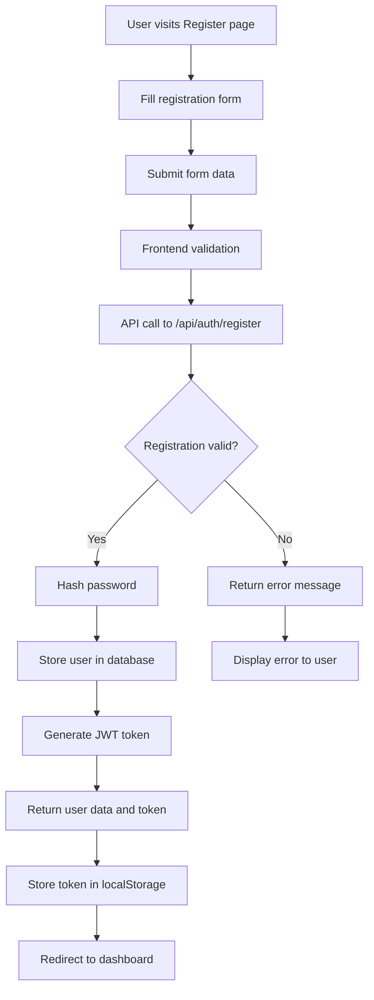
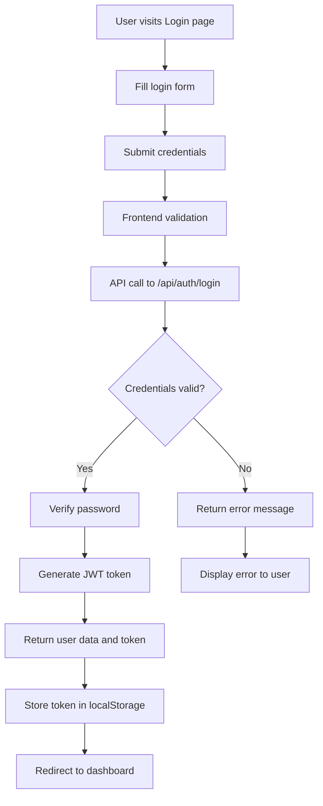
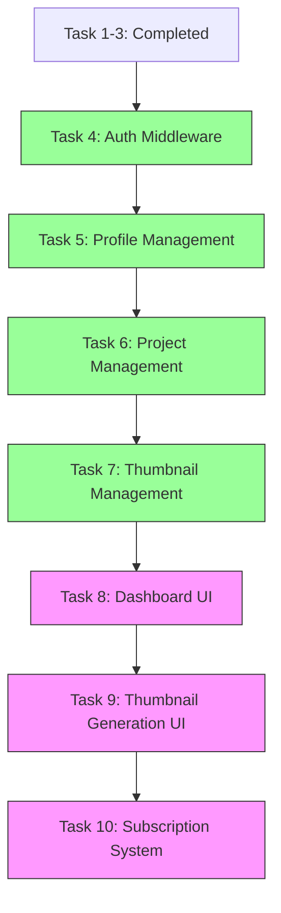
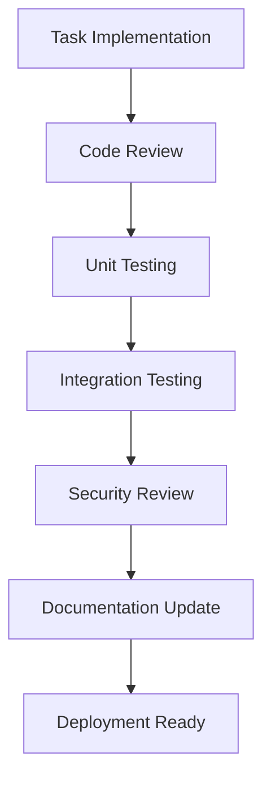
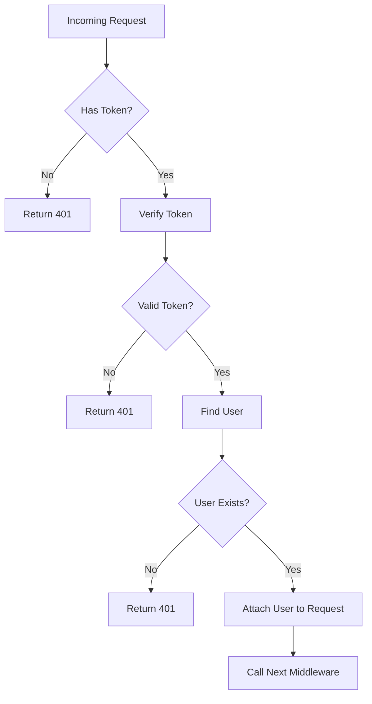

# Pikzels Clone - Task Completion and Action Flow

## 1. Completed Tasks Overview

The Pikzels Clone project has successfully completed the following core tasks:

1. **Environment Setup** - Node.js, TypeScript, Express framework configured
2. **Database Configuration** - Prisma ORM configured with SQLite database
3. **User Authentication System** - Complete registration and login functionality
4. **Authentication Middleware** - JWT token verification and route protection
5. **Profile Management** - User profile viewing and updating
6. **Project Management** - CRUD operations for projects
7. **Thumbnail Management** - CRUD operations for thumbnails

## 2. Task Completion Status

### 2.1 Task 1: Environment Setup
✅ **COMPLETED**
- Node.js and TypeScript environment configured
- Project structure established
- Dependencies installed

### 2.2 Task 2: Database Configuration
✅ **COMPLETED**
- Prisma schema defined with User, Project, Thumbnail, and Subscription models
- SQLite database initialized
- Prisma Client generated

### 2.3 Task 3: User Authentication Implementation
✅ **COMPLETED**
- Backend authentication service with registration and login
- Password hashing with bcrypt
- JWT token generation
- API endpoints created
- Frontend components implemented
- Testing completed

### 2.4 Task 4: Authentication Middleware Implementation
✅ **COMPLETED**
- Created middleware to verify JWT tokens
- Protected routes that require authentication
- Handled expired or invalid tokens

### 2.5 Task 5: Profile/Basic Dashboard Component
✅ **COMPLETED**
- Created profile routes and controller
- Implemented user profile viewing and updating
- Integrated with authentication middleware

### 2.6 Task 6: Project Management Features
✅ **COMPLETED**
- Created project routes, controller, and service
- Implemented CRUD operations for projects
- All project routes protected with authentication middleware

### 2.7 Task 7: Thumbnail Generation Features
✅ **COMPLETED**
- Created thumbnail routes, controller, and service
- Implemented CRUD operations for thumbnails
- All thumbnail routes protected with authentication middleware

## 3. Current Action Flow

### 3.1 User Registration Flow



### 3.2 User Login Flow



## 3. Completed Functionality

### 3.1 Database Schema
The database has been implemented with the following models:

- **User**: Authentication and profile information
- **Project**: Organization for user work
- **Thumbnail**: Generated thumbnails with metadata
- **Subscription**: User plans and credits management

### 3.2 Authentication System

#### 3.2.1 Backend Implementation
- User registration with email uniqueness validation
- Password hashing using bcryptjs
- JWT token generation for authenticated sessions
- User login with credential validation
- Proper error handling for duplicate users and invalid credentials

#### 3.2.2 API Endpoints
- `POST /api/auth/register` - User registration
- `POST /api/auth/login` - User authentication

#### 3.2.3 Frontend Implementation
- Registration form with validation
- Login form with validation
- React Router configuration for navigation
- Token storage in localStorage
- Redirects to dashboard after successful authentication

### 4.1 Immediate Next Steps

1. **Develop Complete Dashboard Component**
   - Create enhanced dashboard with project and thumbnail listings
   - Implement navigation between different sections
   - Add user logout functionality

2. **Implement Thumbnail Generation UI**
   - Create frontend components for thumbnail generation
   - Add forms for thumbnail parameters and prompts
   - Connect to backend thumbnail generation endpoints

3. **Add Subscription Management**
   - Create subscription endpoints
   - Implement credit system
   - Develop billing interface

4. **Enhance Frontend Components**
   - Improve styling and user experience
   - Add loading states and error handling
   - Implement responsive design

### 4.2 Task Dependencies Flow



## 5. Implementation Checklist

### 5.1 Backend Checklist
- [x] Environment setup
- [x] Database configuration
- [x] Authentication service
- [x] Authentication controller
- [x] Authentication routes
- [x] Authentication middleware
- [x] Project CRUD endpoints
- [x] Thumbnail generation endpoints
- [ ] Subscription endpoints

### 5.2 Frontend Checklist
- [x] Registration component
- [x] Login component
- [x] Dashboard component
- [x] Project management UI
- [ ] Thumbnail generation UI
- [ ] Subscription management UI

## 6. Testing and Validation Flow

### 6.1 Current Testing Status
✅ Task 1: Environment Setup - PASSED
✅ Task 2: Database Configuration - PASSED
✅ Task 3: User Authentication - PASSED
✅ Task 4: Authentication Middleware - COMPLETED
✅ Task 5: Profile Management - COMPLETED
✅ Task 6: Project Management - COMPLETED
✅ Task 7: Thumbnail Management - COMPLETED

### 6.2 Next Testing Requirements
- [ ] Dashboard UI testing
- [ ] Thumbnail generation UI testing
- [ ] Subscription system testing
- [ ] End-to-end user flow testing
- [ ] Performance testing
- [ ] Security audit

## 7. Deployment Readiness Checklist

- [x] Environment variables configured
- [x] Database migrations working
- [x] API endpoints functional
- [x] Authentication middleware implemented
- [x] Profile management endpoints implemented
- [x] Project management endpoints implemented
- [x] Thumbnail management endpoints implemented
- [ ] Error handling for all endpoints
- [ ] Security audit completed
- [ ] Performance testing completed
- [ ] Frontend components implemented

## 8. Action Completion Flow

### 8.1 Task Completion Process
1. **Development** - Implement feature according to specifications
2. **Testing** - Verify functionality with unit and integration tests
3. **Code Review** - Ensure code quality and adherence to standards
4. **Documentation** - Update relevant documentation
5. **Deployment** - Merge to main branch and deploy

### 8.2 Quality Assurance Flow



## 11. Authentication Middleware Implementation

### 11.1 Implementation Details

The authentication middleware will be implemented as follows:

1. **File Location**: `src/middleware/auth.middleware.ts`
2. **Function Name**: `authenticateToken`
3. **Purpose**: Verify JWT tokens and attach user information to requests

### 11.2 Implementation Steps

1. Extract JWT token from Authorization header
2. Verify token using jsonwebtoken library
3. Look up user in database using userId from token
4. Attach user object to request for use in subsequent middleware/routes
5. Handle error cases (missing token, invalid token, expired token)

### 11.3 Code Structure

```typescript
// Import required modules
import { Request, Response, NextFunction } from 'express';
import jwt from 'jsonwebtoken';
import { PrismaClient } from '@prisma/client';

// Middleware function
export const authenticateToken = async (req: Request, res: Response, next: NextFunction) => {
  // Implementation details
}
```

### 11.4 Usage

The middleware will be used to protect routes that require authentication:

```typescript
// In route files
import { authenticateToken } from '../middleware/auth.middleware';

// Protect a route
router.get('/protected', authenticateToken, (req, res) => {
  // Route handler
});
```

## 12. Implementation Progress

### 12.1 Authentication Middleware

The authentication middleware implementation has been completed. The following steps have been completed:

1. ✅ **Requirements Analysis** - Defined the purpose and functionality of the middleware
2. ✅ **Design Planning** - Created implementation plan and code structure
3. ✅ **Implementation** - Implemented the middleware functionality
   - ✅ File structure created
   - ✅ Code structure defined
   - ✅ Implementation steps completed
   - ✅ Error handling implemented
4. ✅ **Testing** - Tested the middleware with various scenarios
5. ✅ **Integration** - Integrated with existing authentication routes
6. ✅ **Documentation** - Updated documentation with usage instructions

### 12.2 Profile Management

The profile management functionality has been completed:

1. ✅ **Profile Routes** - Created profile routes with authentication protection
2. ✅ **Profile Controller** - Implemented profile viewing and updating
3. ✅ **Integration** - Integrated with authentication middleware

### 12.3 Project Management

The project management functionality has been completed:

1. ✅ **Project Routes** - Created project CRUD routes with authentication protection
2. ✅ **Project Controller** - Implemented project CRUD operations
3. ✅ **Project Service** - Implemented project business logic
4. ✅ **Integration** - Integrated with authentication middleware

### 12.4 Thumbnail Management

The thumbnail management functionality has been completed:

1. ✅ **Thumbnail Routes** - Created thumbnail CRUD routes with authentication protection
2. ✅ **Thumbnail Controller** - Implemented thumbnail CRUD operations
3. ✅ **Thumbnail Service** - Implemented thumbnail business logic
4. ✅ **Integration** - Integrated with authentication middleware

### 12.2 Next Implementation Steps

1. **Dashboard UI Development**
   - Create enhanced dashboard component
   - Implement navigation between sections
   - Add user logout functionality

2. **Thumbnail Generation UI**
   - Create frontend components for thumbnail generation
   - Add forms for thumbnail parameters and prompts
   - Connect to backend thumbnail generation endpoints

3. **Subscription Management**
   - Create subscription routes, controller, and service
   - Implement credit system
   - Develop billing interface

4. **Frontend Integration**
   - Connect all frontend components to backend APIs
   - Implement proper error handling and loading states
   - Add responsive design

### 12.3 Authentication Middleware Workflow



## 9. Project Timeline

### 9.1 Completed Tasks (Week 1)
- Environment setup and project structure
- Database configuration with Prisma
- User authentication system (registration and login)

### 9.2 Completed Tasks (Week 2)
- Authentication middleware implementation
- Profile management functionality
- Project management features
- Thumbnail management features

### 9.3 Current Tasks (Week 3)
- Dashboard UI development
- Thumbnail generation UI

### 9.4 Future Tasks (Week 4)
- Subscription and billing system
- Final testing and deployment preparation

## 10. Success Metrics

### 10.1 Technical Metrics
- All API endpoints return proper HTTP status codes
- Database operations complete within acceptable time limits
- Authentication system handles error cases appropriately
- Frontend components render without errors

### 10.2 User Experience Metrics
- Registration process completes in < 3 seconds
- Login process completes in < 2 seconds
- Error messages are clear and actionable
- User interface is responsive and accessible

## 13. Authentication Middleware Implementation Plan

### 13.1 File Structure

The authentication middleware will be implemented in the following file:
- `src/middleware/auth.middleware.ts` - Contains the middleware function

### 13.2 Code Implementation Details

#### 13.2.1 Imports and Constants

```typescript
import { Request, Response, NextFunction } from 'express';
import jwt from 'jsonwebtoken';
import { PrismaClient } from '@prisma/client';

const prisma = new PrismaClient();
const JWT_SECRET = process.env.JWT_SECRET || 'your-secret-key';
```

#### 13.2.2 Type Extensions

```typescript
// Extend the Request type to include user
declare global {
  namespace Express {
    interface Request {
      user?: any;
    }
  }
}
```

#### 13.2.3 Middleware Function

```typescript
export const authenticateToken = async (req: Request, res: Response, next: NextFunction) => {
  // Implementation details
}
```

### 13.3 Implementation Steps

1. **Token Extraction**
   - Extract the Authorization header from the request
   - Parse the Bearer token from the header
   - Return 401 error if no token is provided

2. **Token Verification**
   - Use `jwt.verify()` to verify the token with the JWT_SECRET
   - Handle `TokenExpiredError` for expired tokens
   - Handle `JsonWebTokenError` for invalid tokens
   - Return appropriate error responses

3. **User Lookup**
   - Extract userId from the decoded token
   - Query the database to find the user
   - Return 401 error if user is not found

4. **Request Attachment**
   - Attach the user object to the request
   - Call `next()` to continue the middleware chain

### 13.4 Error Handling

The middleware will handle the following error cases:

1. **Missing Token** - Return 401 with "Access token required"
2. **Expired Token** - Return 401 with "Token expired"
3. **Invalid Token** - Return 401 with "Invalid token"
4. **User Not Found** - Return 401 with "Invalid token"
5. **Server Errors** - Return 500 with "Internal server error"

### 13.5 Integration with Existing Server

The authentication middleware will be integrated with the existing server as follows:

1. **Import the middleware** in route files that require protection
2. **Apply the middleware** to specific routes or route groups
3. **Access user information** in protected route handlers via `req.user`

Example integration:

```typescript
// In a protected route file
import { authenticateToken } from '../middleware/auth.middleware';

// Protect a single route
router.get('/profile', authenticateToken, (req, res) => {
  // req.user contains the authenticated user information
  res.json({ user: req.user });
});

// Protect all routes in a router
const protectedRouter = Router();
protectedRouter.use(authenticateToken);
protectedRouter.get('/dashboard', (req, res) => {
  res.json({ message: 'Welcome to your dashboard' });
});
```

### 13.6 Testing Plan

The authentication middleware will be tested with the following scenarios:

1. **Valid Token Test**
   - Generate a valid JWT token
   - Make a request with the Authorization header
   - Verify that the middleware attaches the user to the request
   - Ensure the route handler is called

2. **Missing Token Test**
   - Make a request without an Authorization header
   - Verify that the middleware returns a 401 status
   - Check that the error message is "Access token required"

3. **Invalid Token Test**
   - Make a request with a malformed token
   - Verify that the middleware returns a 401 status
   - Check that the error message is "Invalid token"

4. **Expired Token Test**
   - Generate an expired JWT token
   - Make a request with the expired token
   - Verify that the middleware returns a 401 status
   - Check that the error message is "Token expired"

5. **Non-existent User Test**
   - Generate a valid token for a non-existent user
   - Make a request with the token
   - Verify that the middleware returns a 401 status
   - Check that the error message is "Invalid token"

### 13.7 Completion Criteria

The authentication middleware implementation will be considered complete when:

1. ✅ The `auth.middleware.ts` file is created in the `src/middleware` directory
2. ✅ The `authenticateToken` function is implemented with all required functionality
3. ✅ All error handling cases are properly implemented
4. ✅ The middleware successfully verifies valid tokens and attaches user information
5. ✅ The middleware properly rejects invalid, expired, or missing tokens
6. ✅ All test scenarios pass successfully
7. ✅ The middleware is properly integrated with at least one protected route
8. ✅ Documentation is updated with usage instructions

The overall project will be considered complete when:

1. ✅ All backend functionality is implemented
2. ✅ All frontend components are implemented
3. ✅ All API endpoints are properly connected
4. ✅ User authentication and authorization work correctly
5. ✅ All CRUD operations function properly
6. ✅ Error handling is implemented throughout the application
7. ✅ All tests pass successfully
8. ✅ The application is ready for deployment