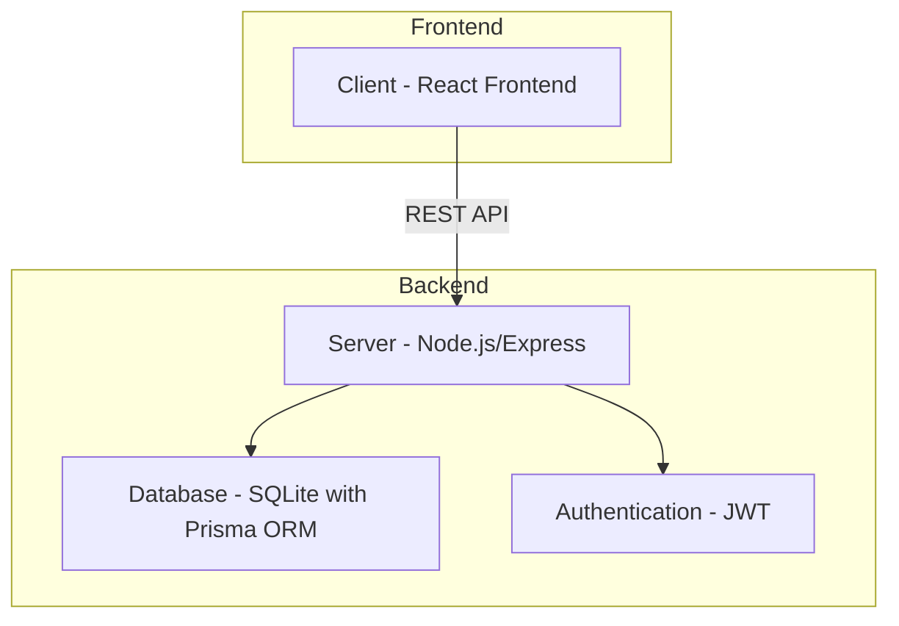
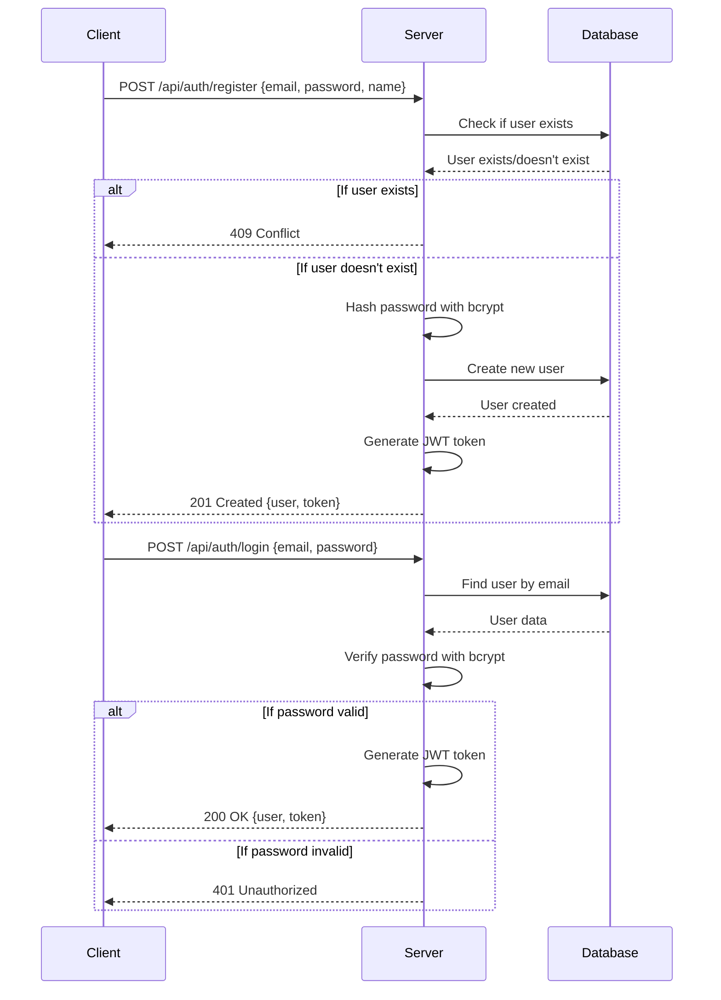
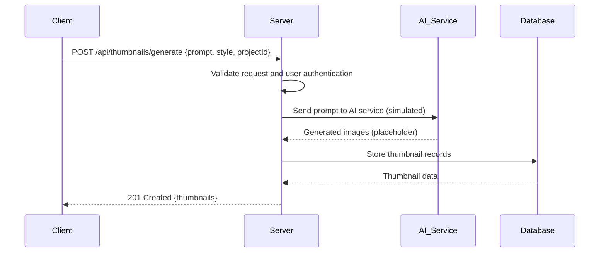
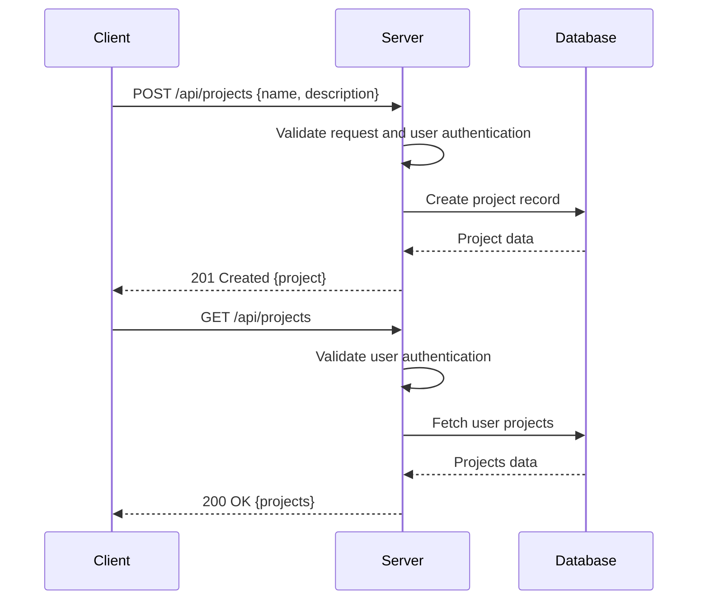
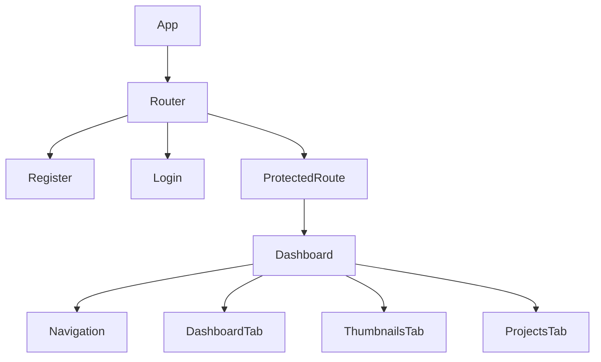

# Pikzels Clone - Thumbnail Maker Application

## Overview

The Pikzels Clone is a full-stack web application that allows users to create AI-generated thumbnails for content creation. The application provides user authentication, thumbnail generation capabilities, and project organization features. It follows a client-server architecture with a React frontend and Node.js/Express backend.

## Architecture

The application follows a client-server architecture pattern:



### Technology Stack

- **Frontend**: React with TypeScript
- **Backend**: Node.js with Express and TypeScript
- **Database**: SQLite with Prisma ORM
- **Authentication**: JWT (JSON Web Tokens) with bcrypt password hashing
- **API**: RESTful API design

## Data Models & ORM Mapping

The application uses four main data models defined through Prisma ORM:

### User Model
```prisma
model User {
  id            String     @id
  email         String     @unique
  passwordHash  String
  name          String?
  avatarUrl     String?
  isVerified    Boolean    @default(false)
  createdAt     DateTime   @default(now())
  updatedAt     DateTime
  projects      Project[]
  thumbnails    Thumbnail[]
  subscription  Subscription?
}
```

### Project Model
```prisma
model Project {
  id        String    @id
  name      String
  description String?
  userId    String
  user      User      @relation(fields: [userId], references: [id])
  createdAt DateTime  @default(now())
  updatedAt DateTime
  thumbnails Thumbnail[]
}
```

### Thumbnail Model
```prisma
model Thumbnail {
  id         String   @id
  title      String
  imageUrl   String
  prompt     String
  parameters Json
  projectId  String
  project    Project  @relation(fields: [projectId], references: [id])
  userId     String
  user       User     @relation(fields: [userId], references: [id])
  createdAt  DateTime @default(now())
}
```

### Subscription Model
```prisma
model Subscription {
  id           String   @id
  planType     String
  creditsBalance Int
  creditsUsed  Int      @default(0)
  periodStart  DateTime
  periodEnd    DateTime
  userId       String
  user         User     @relation(fields: [userId], references: [id])
  createdAt    DateTime @default(now())
}
```

## API Endpoints Reference

### Authentication Endpoints
- `POST /api/auth/register` - User registration
- `POST /api/auth/login` - User login

### User Profile Endpoints
- `GET /api/user/profile` - Get user profile (protected)

### Thumbnail Endpoints
- `POST /api/thumbnails` - Create a new thumbnail (protected)
- `POST /api/thumbnails/generate` - Generate thumbnails from a prompt (protected)
- `GET /api/thumbnails` - Get all user thumbnails (protected)
- `GET /api/thumbnails/:id` - Get a specific thumbnail (protected)
- `PUT /api/thumbnails/:id` - Update a thumbnail (protected)
- `DELETE /api/thumbnails/:id` - Delete a thumbnail (protected)

### Project Endpoints
- `POST /api/projects` - Create a new project (protected)
- `GET /api/projects` - Get all user projects (protected)
- `GET /api/projects/:id` - Get a specific project (protected)
- `PUT /api/projects/:id` - Update a project (protected)
- `DELETE /api/projects/:id` - Delete a project (protected)

### Authentication Requirements

All endpoints except `/api/auth/register` and `/api/auth/login` require authentication using JWT tokens. The token must be provided in the Authorization header as a Bearer token:

```
Authorization: Bearer <token>
```

## Business Logic Layer

### Authentication Flow


### Thumbnail Generation Flow


### Project Management Flow


## Middleware & Interceptors

### Authentication Middleware
The application uses JWT-based authentication middleware to protect routes:

1. Extracts the JWT token from the Authorization header
2. Verifies the token's validity using the JWT secret
3. Retrieves the user information from the database
4. Attaches the user information to the request object
5. Proceeds to the next middleware if valid, otherwise returns an error

### CORS Middleware
Configured to allow requests from the client application origin.

### Body Parser Middleware
Parses incoming request bodies in JSON format.

## Frontend Component Architecture

### Component Hierarchy


### Main Components

#### App Component
Root component that sets up routing for the application with authentication routes and protected dashboard routes.

#### Authentication Components
- **Register**: Handles user registration with email, password, and name fields
- **Login**: Handles user login with email and password fields
- **ProtectedRoute**: Wrapper component that ensures only authenticated users can access the dashboard

#### Dashboard Component
Main authenticated component that provides:
- User profile display
- Tab-based navigation (Dashboard, Thumbnails, Projects)
- Thumbnail gallery
- Project listing
- Logout functionality

### State Management
The frontend uses React's built-in useState and useEffect hooks for state management:
- User authentication state (token storage in localStorage)
- User profile data
- Thumbnails data
- Projects data
- Loading states
- Active tab navigation

## API Integration Layer

The frontend communicates with the backend through fetch API calls:
- Authentication endpoints for login and registration
- Protected endpoints for user profile, thumbnails, and projects
- All requests include the JWT token in the Authorization header
- Error handling for different HTTP status codes

## Testing Strategy

### Backend Testing
Unit tests cover:
- Authentication service (registration and login)
- Thumbnail service (CRUD operations)
- Project service (CRUD operations)
- Middleware functions
- Controller functions

### Frontend Testing
Frontend components are tested for:
- Rendering with proper data
- User interactions
- State management
- API integration
- Error handling

## Future Enhancements

1. **AI Integration**: Replace placeholder thumbnail generation with actual AI service integration
2. **Subscription Management**: Implement full subscription handling with credit systems
3. **Advanced Project Features**: Add project sharing, collaboration, and advanced organization
4. **Thumbnail Customization**: Add more parameters for thumbnail generation
5. **Analytics**: Add usage statistics and insights for users