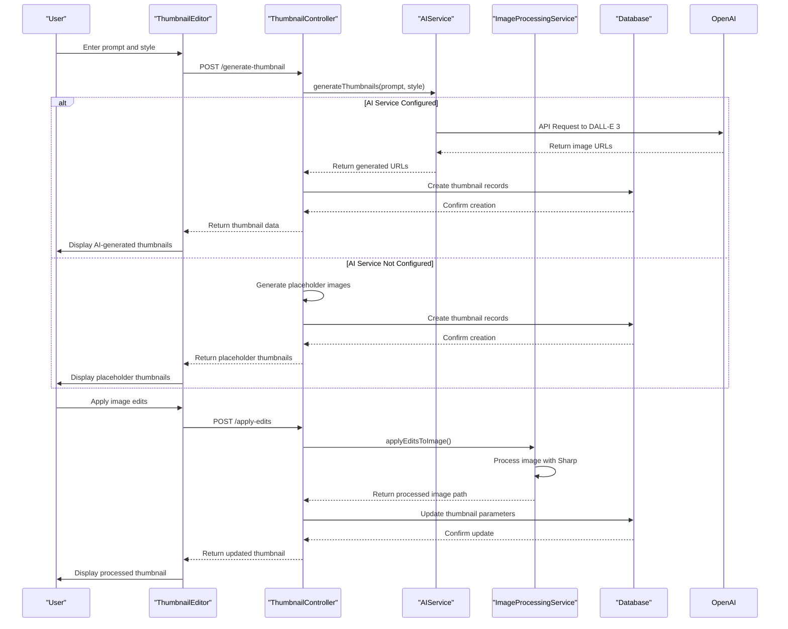

# AI & Image Processing

<cite>
**Referenced Files in This Document**   
- [ai.service.ts](file://pikzels-clone/src/modules/thumbnail/ai.service.ts)
- [image-processing.service.ts](file://pikzels-clone/src/modules/thumbnail/image-processing.service.ts)
- [thumbnail.controller.ts](file://pikzels-clone/src/modules/thumbnail/thumbnail.controller.ts)
- [ThumbnailEditor.tsx](file://pikzels-clone/client/src/components/ThumbnailEditor.tsx)
</cite>

## Table of Contents
1. [AI Thumbnail Generation Flow](#ai-thumbnail-generation-flow)
2. [Image Processing Pipeline](#image-processing-pipeline)
3. [Integration Between AI and Image Processing Services](#integration-between-ai-and-image-processing-services)
4. [Batch Editing and Preset Template Application](#batch-editing-and-preset-template-application)
5. [Performance Considerations](#performance-considerations)
6. [Troubleshooting Guide](#troubleshooting-guide)

## AI Thumbnail Generation Flow

The AI thumbnail generation flow begins with a user providing a text prompt and style preference through the frontend interface. This input is sent to the backend where the `AIService` class handles communication with OpenAI's DALL-E 3 API. The service constructs a request with the user's prompt, applying style-specific modifications to enhance the output quality based on whether the selected style is bold, minimalist, or dramatic.

When the `generateThumbnails` method is called, it validates the input parameters and constructs a properly formatted request to the OpenAI API. The service includes error handling for various failure scenarios including invalid API keys, rate limiting, and service unavailability. Upon successful response, the generated image URLs are returned and stored in the database along with the original prompt and style information.

The system implements a fallback mechanism that generates placeholder images when the AI service is not configured or encounters errors, ensuring uninterrupted user experience. This robust flow enables users to generate high-quality, AI-powered thumbnails from simple text descriptions.

**Section sources**
- [ai.service.ts](file://pikzels-clone/src/modules/thumbnail/ai.service.ts#L1-L143)
- [thumbnail.controller.ts](file://pikzels-clone/src/modules/thumbnail/thumbnail.controller.ts#L200-L300)

## Image Processing Pipeline

The image processing pipeline is implemented through the `ImageProcessingService` class, which leverages the Sharp library for efficient image manipulation operations. The pipeline supports a comprehensive set of image editing capabilities including resizing, filtering, color adjustments, rotation, flipping, cropping, and various filter applications.

The core method `applyEditsToImage` processes images by first fetching the image buffer from the provided URL, then sequentially applying the specified edits. The service handles brightness, contrast, and saturation adjustments through the modulate and linear operations, while supporting hue rotation, blur effects, and geometric transformations. For cropping operations, the service converts percentage-based coordinates to pixel values assuming a base resolution of 1280x720.

The pipeline includes several built-in filters such as grayscale, sepia, vintage, black and white, invert, sharpen, emboss, and edge detection. The emboss and edge detection filters are implemented using convolution kernels since Sharp does not provide direct methods for these effects. All processed images are saved in PNG format with unique filenames incorporating the thumbnail ID and timestamp.

**Diagram sources**
- [image-processing.service.ts](file://pikzels-clone/src/modules/thumbnail/image-processing.service.ts#L10-L280)

**Section sources**
- [image-processing.service.ts](file://pikzels-clone/src/modules/thumbnail/image-processing.service.ts#L10-L280)

## Integration Between AI and Image Processing Services

The integration between AI services and image processing services is orchestrated through the backend controller layer, specifically in the `thumbnail.controller.ts` file. When a user requests thumbnail generation, the system first attempts to use the AI service to create images via the DALL-E 3 API. If successful, these AI-generated images become the source material for subsequent image processing operations.

The `generateThumbnail` controller method coordinates this integration by first validating user input and checking the AI service configuration. Upon receiving AI-generated image URLs, the system creates database records for each thumbnail variation. These thumbnails can then be further enhanced using the image processing pipeline through the `applyEdits` endpoint.

The frontend `ThumbnailEditor` component facilitates this integration by providing a unified interface where users can first generate AI thumbnails and then apply additional processing effects. The editor sends edit parameters to the backend, which applies them through the `ImageProcessingService` and returns the processed image URL. This seamless integration allows users to combine AI-generated content with traditional image editing techniques.

**Diagram sources**
- [ai.service.ts](file://pikzels-clone/src/modules/thumbnail/ai.service.ts#L1-L143)
- [image-processing.service.ts](file://pikzels-clone/src/modules/thumbnail/image-processing.service.ts#L10-L280)
- [thumbnail.controller.ts](file://pikzels-clone/src/modules/thumbnail/thumbnail.controller.ts#L200-L500)
- [ThumbnailEditor.tsx](file://pikzels-clone/client/src/components/ThumbnailEditor.tsx#L80-L475)

**Section sources**
- [ai.service.ts](file://pikzels-clone/src/modules/thumbnail/ai.service.ts#L1-L143)
- [image-processing.service.ts](file://pikzels-clone/src/modules/thumbnail/image-processing.service.ts#L10-L280)
- [thumbnail.controller.ts](file://pikzels-clone/src/modules/thumbnail/thumbnail.controller.ts#L200-L500)
- [ThumbnailEditor.tsx](file://pikzels-clone/client/src/components/ThumbnailEditor.tsx#L80-L475)

## Batch Editing and Preset Template Application

The system supports batch editing capabilities through the `batchApplyEditsToImages` method in the `ImageProcessingService` class. This functionality allows users to apply the same set of edits to multiple images simultaneously, significantly improving workflow efficiency for users managing multiple thumbnails.

The batch processing method iterates through an array of image URLs, applying identical edit parameters to each image and returning an array of processed image paths. This is particularly useful for maintaining visual consistency across a series of thumbnails, such as when creating content for a video series or marketing campaign.

Preset template functionality is implemented in the frontend `ThumbnailEditor` component, allowing users to save and reuse frequently used edit configurations. Users can create presets with specific combinations of adjustments, filters, text overlays, and other effects. These presets are stored in localStorage, enabling quick application to any thumbnail. The `savePreset` and `applyPreset` methods handle the creation and application of these templates, while `deletePreset` allows for template management.

The integration between batch editing and presets enables powerful workflows where users can define a template once and apply it to multiple images in a single operation, streamlining the thumbnail creation process for content creators who need to maintain brand consistency across multiple platforms.

**Section sources**
- [image-processing.service.ts](file://pikzels-clone/src/modules/thumbnail/image-processing.service.ts#L200-L280)
- [ThumbnailEditor.tsx](file://pikzels-clone/client/src/components/ThumbnailEditor.tsx#L400-L450)

## Performance Considerations

The image processing operations in this system are CPU-intensive, particularly when handling multiple images or complex filter applications. The Sharp library is optimized for performance and uses libvips under the hood, which is highly efficient for image processing tasks. However, processing large images or applying multiple effects simultaneously can still consume significant system resources.

Memory management is handled through streaming operations in Sharp, which process images in chunks rather than loading entire images into memory. This approach minimizes memory footprint and prevents out-of-memory errors when processing high-resolution images. The system creates processed images in a dedicated directory with timestamps in filenames to avoid conflicts and ensure proper cleanup.

For AI operations, the system relies on external API calls to OpenAI, which offloads the computational burden from the local server. This design choice ensures that AI generation does not impact the performance of local image processing operations. The fallback to placeholder images when the AI service is unavailable or rate-limited helps maintain application responsiveness.

To optimize performance, the system could implement additional strategies such as processing queue management, worker threads for parallel image processing, and caching of frequently used presets or processed images. These enhancements would further improve the user experience, especially when handling large batches of thumbnails.

**Section sources**
- [image-processing.service.ts](file://pikzels-clone/src/modules/thumbnail/image-processing.service.ts#L10-L280)
- [ai.service.ts](file://pikzels-clone/src/modules/thumbnail/ai.service.ts#L1-L143)

## Troubleshooting Guide

Common issues in the image processing pipeline typically involve AI model loading failures or image processing errors. When the AI service fails to generate thumbnails, the most common causes are missing or invalid API keys, network connectivity issues, or rate limiting from the OpenAI API. The system provides clear error messages for these scenarios, including specific guidance for API key configuration and rate limit handling.

For image processing issues, common problems include invalid image URLs, unsupported image formats, or insufficient file system permissions for writing processed images. The `fetchImageBuffer` method includes error handling for network requests, while the directory creation code ensures the processed images directory exists with appropriate permissions.

When troubleshooting, users should first verify that the OPENAI_API_KEY environment variable is properly configured. For image processing issues, checking the network console for failed requests and verifying that the processed-images directory is writable can resolve most problems. The system's fallback mechanisms provide visibility into issues by continuing to function with placeholder images when AI services are unavailable.

For development and testing, the system includes mock implementations that allow the interface to function without requiring actual image processing or AI service connectivity, facilitating frontend development and user interface testing independent of backend services.

**Section sources**
- [ai.service.ts](file://pikzels-clone/src/modules/thumbnail/ai.service.ts#L1-L143)
- [image-processing.service.ts](file://pikzels-clone/src/modules/thumbnail/image-processing.service.ts#L10-L280)
- [thumbnail.controller.ts](file://pikzels-clone/src/modules/thumbnail/thumbnail.controller.ts#L200-L500)