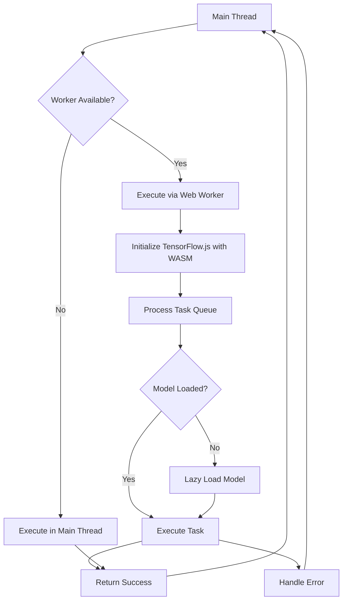
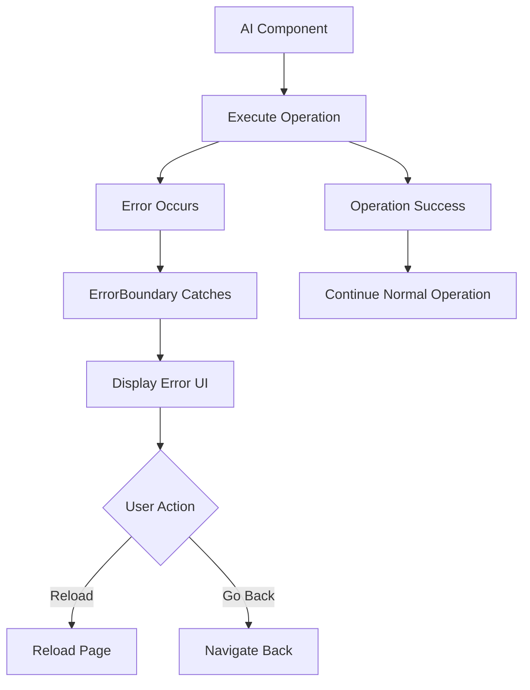

# AI & Image Processing

<cite>
**Referenced Files in This Document**
- [watermark.service.ts](file://pikzels-clone/src/modules/thumbnail/watermark.service.ts)
- [watermark.config.ts](file://pikzels-clone/src/config/watermark.config.ts)
- [model-tiers.config.ts](file://pikzels-clone/src/modules/thumbnail/model-tiers.config.ts)
- [ai-provider-load-balancer.ts](file://pikzels-clone/src/modules/thumbnail/ai-provider-load-balancer.ts)
- [ai-service-manager.ts](file://pikzels-clone/src/modules/thumbnail/ai-service-manager.ts)
- [openrouter-ai.service.ts](file://pikzels-clone/src/modules/thumbnail/openrouter-ai.service.ts)
- [comet-ai.service.ts](file://pikzels-clone/src/modules/thumbnail/comet-ai.service.ts)
- [thumbnail.controller.ts](file://pikzels-clone/src/modules/thumbnail/thumbnail.controller.ts)
- [image-processing.service.ts](file://pikzels-clone/src/modules/thumbnail/image-processing.service.ts)
- [replicate-ai.service.ts](file://pikzels-clone/src/modules/thumbnail/replicate-ai.service.ts)
- [replicate-queue.service.ts](file://pikzels-clone/src/modules/thumbnail/replicate-queue.service.ts)
- [useAIService.ts](file://pikzels-clone/client/src/hooks/useAIService.ts)
- [ai-worker.ts](file://pikzels-clone/client/src/workers/ai-worker.ts)
- [tensorflow.provider.ts](file://pikzels-clone/client/src/services/ai-providers/tensorflow.provider.ts)
- [ErrorBoundary.tsx](file://pikzels-clone/client/src/components/ErrorBoundary.tsx)
- [ThumbnailEditor.tsx](file://pikzels-clone/client/src/components/ThumbnailEditor.tsx)
- [watermark-enforcement.spec.ts](file://pikzels-clone/tests/e2e/watermark-enforcement.spec.ts)
- [watermark-free-export.spec.ts](file://pikzels-clone/tests/e2e/watermark-free-export.spec.ts)
- [model-tiers.spec.ts](file://pikzels-clone/tests/e2e/model-tiers.spec.ts)
</cite>

## Update Summary
**Changes Made**
- Enhanced AI thumbnail generation workflow with new comprehensive watermark service for freemium users
- Improved AI provider load balancing with enhanced health monitoring and intelligent routing strategies
- Implemented comprehensive model tier management system with tier-based provider mapping and cost optimization
- Added watermark-free export quota system with lazy reset and atomic counter management
- Enhanced AI service architecture with tier-aware model selection and provider routing intelligence

## Table of Contents
1. [AI Thumbnail Generation Flow](#ai-thumbnail-generation-flow)
2. [Enhanced AI Service Architecture](#enhanced-ai-service-architecture)
3. [Watermark Service Integration](#watermark-service-integration)
4. [Model Tier Management System](#model-tier-management-system)
5. [Enhanced AI Provider Load Balancing](#enhanced-ai-provider-load-balancing)
6. [Watermark-Free Export Quota System](#watermark-free-export-quota-system)
7. [Replicate AI Service Integration](#replicate-ai-service-integration)
8. [Intelligent Multi-Provider Load Balancing](#intelligent-multi-provider-load-balancing)
9. [Credit Management System](#credit-management-system)
10. [Distributed Queue Management](#distributed-queue-management)
11. [Web Worker Implementation](#web-worker-implementation)
12. [TensorFlow Provider with Lazy Loading](#tensorflow-provider-with-lazy-loading)
13. [Error Boundary Integration](#error-boundary-integration)
14. [Image Processing Pipeline](#image-processing-pipeline)
15. [Integration Between AI and Image Processing Services](#integration-between-ai-and-image-processing-services)
16. [Batch Editing and Preset Template Application](#batch-editing-and-preset-template-application)
17. [Performance Considerations](#performance-considerations)
18. [Troubleshooting Guide](#troubleshooting-guide)

## AI Thumbnail Generation Flow

The AI thumbnail generation flow has been significantly enhanced with improved error handling, type safety, intelligent provider routing, and comprehensive watermark integration. The system now supports multiple AI providers through a sophisticated load balancer that handles configuration validation, fallback mechanisms, and consistent error responses.

The enhanced flow begins with user input validation and style parameter processing. The system validates prompts, counts, and style preferences before attempting AI generation. The AI service manager coordinates between multiple providers (OpenAI, Comet, Zenmux, OpenRouter, Replicate) with automatic fallback when providers fail or are not configured.

When the `generateThumbnails` method is called, it performs comprehensive input validation including prompt length checks, count validation (1-10 images), and style parameter validation. The method constructs properly formatted requests with style-specific prompt modifications for optimal results. Enhanced error handling covers API key validation, network failures, rate limiting, and service unavailability scenarios.

The system implements robust fallback mechanisms with detailed error reporting. When AI services are unavailable or encounter errors, the system gracefully falls back to placeholder image generation while providing informative error messages. This ensures uninterrupted user experience and maintains application reliability.

**Section sources**
- [thumbnail.controller.ts:429-599](file://pikzels-clone/src/modules/thumbnail/thumbnail.controller.ts#L429-L599)
- [thumbnail.controller.ts:800-812](file://pikzels-clone/src/modules/thumbnail/thumbnail.controller.ts#L800-L812)

## Enhanced AI Service Architecture

The AI service architecture has been completely redesigned with improved error handling, type safety, and provider management patterns. The new system introduces an AI Provider Load Balancer that provides a unified interface for multiple AI providers while maintaining individual provider capabilities.

### AI Provider Load Balancer

The `AIProviderLoadBalancer` class serves as the central coordinator for all AI providers, offering consistent interfaces and automatic fallback mechanisms. It manages five distinct AI providers: OpenAI (DALL-E 3), CometAPI, ZenMux, OpenRouter, and Replicate, each with specialized capabilities and configuration requirements.

The load balancer provides comprehensive provider validation through `isProviderConfigured()` methods, enabling runtime detection of available services. It supports dynamic provider switching and maintains a fallback chain for reliable operation. The `getAvailableProviders()` method returns only configured and ready-to-use providers, preventing failed operations.

### Multi-Provider Support

Each AI provider offers unique capabilities and integration patterns:

**OpenAI Integration**: Enhanced DALL-E 3 integration with improved error handling, style parameter validation, and comprehensive response parsing. The service now includes detailed error categorization for authentication failures, rate limits, and service unavailability.

**CometAPI Integration**: Advanced API aggregation platform supporting multiple endpoints including FLUX, Replicate-compatible, and OpenAI-compatible interfaces. Implements sophisticated fallback patterns with automatic endpoint switching and comprehensive error handling.

**ZenMux Integration**: Vertex AI protocol support for Gemini models with dual endpoint architecture (chat and vertex AI). Provides extensive model catalog management and response format normalization.

**OpenRouter Integration**: Comprehensive multi-modal API support with 20+ image generation models including Gemini, GPT-5, FLUX.2, and Seedream. Implements advanced features like inpainting, face swapping, upscaling, background removal, and image enhancement with model-specific optimizations.

**Replicate Integration**: **New** Computer vision capabilities with specialized models for segmentation, background removal, upscaling, and image expansion. Provides production-grade API with retry logic, rate limiting, and distributed queuing.

### Intelligent Routing Strategies

The load balancer implements multiple routing strategies:
- **Round-robin**: Even distribution across providers
- **Least-loaded**: Routes to provider with lowest current load
- **Fastest**: Selects provider with fastest average response time
- **Weighted**: Custom weight-based distribution
- **Failover-only**: Strict priority-based routing

Provider status tracking includes health monitoring, rate limit detection, and automatic recovery mechanisms.

**Section sources**
- [ai-provider-load-balancer.ts:98-184](file://pikzels-clone/src/modules/thumbnail/ai-provider-load-balancer.ts#L98-L184)
- [ai-service-manager.ts:21-167](file://pikzels-clone/src/modules/thumbnail/ai-service-manager.ts#L21-L167)

## Watermark Service Integration

The watermark service represents a comprehensive addition to the AI thumbnail generation pipeline, providing freemium watermarking capabilities and clean original storage management. The service ensures compliance with freemium business models while maintaining high-quality output for paying users.

### Freemium Watermark Implementation

The watermark service provides sophisticated watermarking through a diagonal tiled pattern system:

**Watermark Configuration**:
- **Brand Text**: "ThumPiks" rendered across the entire image
- **Opacity Control**: 30% opacity for subtle branding
- **Rotation Angle**: -30 degrees for diagonal coverage
- **Font Settings**: Arial/Helvetica stack with 300 weight for readability
- **Color Scheme**: White text with black stroke for visibility
- **Pattern Scaling**: Dynamically sized based on image dimensions

**Watermark Application Process**:
1. **Plan Detection**: Automatically determines watermark requirements based on subscription plans
2. **Parallel Processing**: Watermarks multiple images concurrently for efficiency
3. **Storage Integration**: Uploads both watermarked and clean originals to Cloudinary
4. **Fallback Handling**: Uses base64 data URLs when storage is unavailable

### Clean Original Storage Management

The service implements comprehensive storage management for clean originals:

**Storage Strategy**:
- **Permanent Storage**: Clean originals stored with unique public IDs
- **TTL Management**: 45-day retention period for cleanup eligibility
- **Batch Cleanup**: Automated cleanup of expired clean originals
- **Memory Fallback**: Base64 encoding when storage services are unavailable

**Watermark-Free Export Integration**:
- **Quota Tracking**: Tracks remaining watermark-free exports per user
- **Atomic Operations**: Prevents race conditions in quota consumption
- **Lazy Reset**: Monthly reset mechanism with 30-day intervals
- **Plan-Based Access**: Unlimited exports for paid subscribers

**Section sources**
- [watermark.service.ts:48-202](file://pikzels-clone/src/modules/thumbnail/watermark.service.ts#L48-L202)
- [watermark.config.ts:12-37](file://pikzels-clone/src/config/watermark.config.ts#L12-L37)

## Model Tier Management System

The model tier management system provides a comprehensive framework for quality-tier selection with provider abstraction and cost optimization. This system enables dynamic model switching while maintaining consistent user experience across different quality levels.

### Tier Configuration Architecture

The tier system defines three quality tiers with specific capabilities and costs:

**Tier Definitions**:
- **Flash Tier**: Fast, cost-effective generation using FLUX Schnell (Comet)
- **Standard Tier**: Balanced quality and speed using Gemini 2.5 Flash (OpenRouter)
- **Pro Tier**: Premium quality with 2K/4K support using Gemini 3 Pro (OpenRouter)

**Provider Mapping**:
- **Flash**: Comet API with FLUX Schnell for maximum speed
- **Standard**: OpenRouter with Gemini 2.5 Flash for balanced performance
- **Pro**: OpenRouter with Gemini 3 Pro for highest quality

**Credit Cost Structure**:
- **Flash**: 1 credit per generation
- **Standard**: 2 credits per generation  
- **Pro**: 5 credits per generation

### Tier Resolution and Model Selection

The system provides centralized model resolution:

**Model Resolution**:
- **Centralized Lookup**: Single source of truth for all model IDs
- **Provider Abstraction**: Tier-to-provider mapping prevents model duplication
- **Dynamic Switching**: Change providers by modifying one line in configuration
- **Vision Integration**: Specialized vision models for multimodal requests

**Capability Management**:
- **Upscale Support**: Max scale detection (2x for Standard, 4x for Pro)
- **Vision Models**: Auto-selection when image inputs are provided
- **Credit Calculation**: Tier-based cost determination
- **Performance Metrics**: Estimated generation times per tier

**Section sources**
- [model-tiers.config.ts:23-64](file://pikzels-clone/src/modules/thumbnail/model-tiers.config.ts#L23-L64)
- [model-tiers.config.ts:152-206](file://pikzels-clone/src/modules/thumbnail/model-tiers.config.ts#L152-L206)
- [model-tiers.config.ts:472-490](file://pikzels-clone/src/modules/thumbnail/model-tiers.config.ts#L472-L490)

## Enhanced AI Provider Load Balancing

The AI Provider Load Balancer represents a sophisticated system for managing multiple AI providers with intelligent routing, health monitoring, and automatic failover capabilities. This system is designed to handle high-volume operations with reliability and performance optimization.

### Load Balancing Strategies

The load balancer implements five distinct routing strategies:

**Round-Robin Distribution**: Evenly distributes requests across all available providers to prevent hot-spotting and ensure fair resource utilization.

**Least-Loaded Selection**: Monitors provider capacity and routes requests to the provider with the lowest current load, optimizing response times and preventing overload.

**Fastest Provider Selection**: Analyzes historical response times and selects the provider with the fastest average performance, improving user experience.

**Weighted Distribution**: Allows custom weighting for providers based on capacity, cost, or performance characteristics, enabling fine-grained control over traffic distribution.

**Failover-Only Routing**: Maintains strict priority order for providers, using failover mechanisms only when higher-priority providers fail or become unavailable.

### Health Monitoring and Status Tracking

The system maintains comprehensive status tracking for each provider:

**Provider Status Metrics**:
- **Health Status**: Current operational status (healthy/unhealthy)
- **Availability**: Provider readiness for accepting new requests
- **Rate Limit Status**: Current rate limiting conditions and reset times
- **Error Tracking**: Recent error patterns and failure rates
- **Performance Metrics**: Average response times and success rates
- **Capacity Monitoring**: Current load and maximum concurrent request limits

**Automatic Recovery Mechanisms**:
- **Health Checks**: Periodic monitoring of provider status
- **Failure Thresholds**: Automatic marking of providers as unhealthy based on failure rates
- **Recovery Timers**: Cooldown periods for rate-limited providers
- **Manual Reset**: Administrative capability to reset provider status

### Request Processing and Queue Management

The load balancer handles request processing through a sophisticated queue system:

**Queue Management**:
- **Priority Queuing**: Support for high, normal, and low priority requests
- **Timeout Handling**: Automatic timeout for stuck or slow requests
- **Overflow Protection**: Limits on queue size to prevent memory exhaustion
- **Load Shedding**: Strategic rejection of requests during overload conditions

**Request Processing**:
- **Retry Logic**: Configurable retry attempts with exponential backoff
- **Error Classification**: Automatic distinction between retryable and permanent errors
- **Provider Selection**: Dynamic selection based on current status and strategy
- **Metrics Collection**: Comprehensive tracking of performance and usage

**Section sources**
- [ai-provider-load-balancer.ts:117-132](file://pikzels-clone/src/modules/thumbnail/ai-provider-load-balancer.ts#L117-L132)
- [ai-provider-load-balancer.ts:189-200](file://pikzels-clone/src/modules/thumbnail/ai-provider-load-balancer.ts#L189-L200)

## Watermark-Free Export Quota System

The watermark-free export quota system provides sophisticated freemium management with lazy reset and atomic counter operations. This system enables controlled watermark-free exports for freemium users while preventing abuse.

### Quota Management Architecture

The system implements a comprehensive quota management system:

**Quota Configuration**:
- **Monthly Reset**: Automatic monthly quota reset with 30-day intervals
- **Lazy Reset Pattern**: Reset occurs only when accessed after expiration
- **Atomic Operations**: Prevents race conditions in quota consumption
- **Plan-Based Limits**: Unlimited exports for paid subscribers (-1 indicator)

**Counter Management**:
- **Atomic Increment**: Database-level atomic operations prevent double-spending
- **Race Condition Prevention**: Concurrent access handled safely
- **Audit Logging**: Complete export history for compliance
- **Graceful Degradation**: System continues operating during quota failures

**Export Flow Integration**:
- **Pre-Validation**: Check quota before watermark-free processing
- **Conditional Watermarking**: Skip watermarking when quota available
- **Error Handling**: Clear messaging when quota exceeded
- **User Experience**: Seamless integration with watermark-free flag

### Cleanup and Maintenance

The system includes comprehensive maintenance capabilities:

**Expired Original Cleanup**:
- **TTL Management**: 45-day retention for clean originals
- **Batch Processing**: Efficient cleanup of expired storage
- **Error Resilience**: Continue processing despite individual failures
- **Logging**: Detailed audit trail for cleanup operations

**Status Monitoring**:
- **Quota Status**: Real-time quota availability tracking
- **Usage Analytics**: Export patterns and trends
- **Plan Validation**: Ensure correct quota application per plan type
- **Maintenance Alerts**: Notifications for cleanup operations

**Section sources**
- [watermark.service.ts:214-304](file://pikzels-clone/src/modules/thumbnail/watermark.service.ts#L214-L304)
- [watermark.service.ts:314-370](file://pikzels-clone/src/modules/thumbnail/watermark.service.ts#L314-L370)

## Replicate AI Service Integration

The Replicate AI Service represents a comprehensive addition to the AI thumbnail generation pipeline, providing advanced computer vision capabilities and extensive model support. The service supports specialized computer vision tasks that require purpose-built models for segmentation, background removal, upscaling, and image expansion.

### Advanced Computer Vision Capabilities

The Replicate service provides sophisticated computer vision through purpose-built models:

**Segmentation Models**: 
- **SAM 2**: AI-powered object detection and segmentation with automatic and interactive modes
- **SAM 2 Video**: Point-based selection for precise object targeting
- **Auto-segmentation**: Grid-based detection of all objects in an image
- **Interactive Segmentation**: Click-based selection with foreground/background labeling

**Background Processing**:
- **RMBG 2.0**: Pixel-accurate background removal with transparent PNG output
- **Custom Colored Backgrounds**: Support for custom background colors

**Image Enhancement**:
- **Real-ESRGAN**: True super-resolution upscaling with 2x and 4x scaling
- **Face Enhancement**: Advanced face enhancement during upscaling operations
- **Canvas Expansion**: Outpainting with context-aware image extension

### Production-Grade API Implementation

The Replicate service implements production-grade features including:
- **Retry Logic**: Exponential backoff with jitter to prevent thundering herd
- **Rate Limit Handling**: Automatic detection and recovery from rate limiting
- **Timeout Management**: Configurable timeouts with cancellation support
- **Error Classification**: Distinction between retryable and non-retryable errors
- **Polling Mechanisms**: Efficient prediction status polling with backoff

### Distributed Queue Management

The service integrates with a distributed queue system using BullMQ for:
- **Request Queuing**: Preventing concurrent overload of Replicate API
- **Rate Limit Compliance**: Staying within Replicate's 600 predictions/minute limit
- **Job Deduplication**: Avoiding duplicate predictions
- **Automatic Retries**: Built-in retry handling with exponential backoff
- **Priority Queuing**: Support for premium user priority (future enhancement)

**Section sources**
- [replicate-ai.service.ts:96-183](file://pikzels-clone/src/modules/thumbnail/replicate-ai.service.ts#L96-L183)
- [replicate-queue.service.ts:4-17](file://pikzels-clone/src/modules/thumbnail/replicate-queue.service.ts#L4-L17)

## Intelligent Multi-Provider Load Balancing

The AI Provider Load Balancer represents a sophisticated system for managing multiple AI providers with intelligent routing, health monitoring, and automatic failover capabilities. This system is designed to handle high-volume operations with reliability and performance optimization.

### Load Balancing Strategies

The load balancer implements five distinct routing strategies:

**Round-Robin Distribution**: Evenly distributes requests across all available providers to prevent hot-spotting and ensure fair resource utilization.

**Least-Loaded Selection**: Monitors provider capacity and routes requests to the provider with the lowest current load, optimizing response times and preventing overload.

**Fastest Provider Selection**: Analyzes historical response times and selects the provider with the fastest average performance, improving user experience.

**Weighted Distribution**: Allows custom weighting for providers based on capacity, cost, or performance characteristics, enabling fine-grained control over traffic distribution.

**Failover-Only Routing**: Maintains strict priority order for providers, using failover mechanisms only when higher-priority providers fail or become unavailable.

### Health Monitoring and Status Tracking

The system maintains comprehensive status tracking for each provider:

**Provider Status Metrics**:
- **Health Status**: Current operational status (healthy/unhealthy)
- **Availability**: Provider readiness for accepting new requests
- **Rate Limit Status**: Current rate limiting conditions and reset times
- **Error Tracking**: Recent error patterns and failure rates
- **Performance Metrics**: Average response times and success rates
- **Capacity Monitoring**: Current load and maximum concurrent request limits

**Automatic Recovery Mechanisms**:
- **Health Checks**: Periodic monitoring of provider status
- **Failure Thresholds**: Automatic marking of providers as unhealthy based on failure rates
- **Recovery Timers**: Cooldown periods for rate-limited providers
- **Manual Reset**: Administrative capability to reset provider status

### Request Processing and Queue Management

The load balancer handles request processing through a sophisticated queue system:

**Queue Management**:
- **Priority Queuing**: Support for high, normal, and low priority requests
- **Timeout Handling**: Automatic timeout for stuck or slow requests
- **Overflow Protection**: Limits on queue size to prevent memory exhaustion
- **Load Shedding**: Strategic rejection of requests during overload conditions

**Request Processing**:
- **Retry Logic**: Configurable retry attempts with exponential backoff
- **Error Classification**: Automatic distinction between retryable and permanent errors
- **Provider Selection**: Dynamic selection based on current status and strategy
- **Metrics Collection**: Comprehensive tracking of performance and usage

**Section sources**
- [ai-provider-load-balancer.ts:98-132](file://pikzels-clone/src/modules/thumbnail/ai-provider-load-balancer.ts#L98-L132)
- [ai-provider-load-balancer.ts:206-353](file://pikzels-clone/src/modules/thumbnail/ai-provider-load-balancer.ts#L206-L353)

## Credit Management System

The credit management system provides comprehensive financial tracking and transaction management for AI operations. This system integrates with Stripe for payment processing and maintains detailed audit trails for all credit transactions.

### Credit Transaction Management

The system tracks all credit-related activities through a comprehensive transaction log:

**Transaction Types**:
- **Purchase**: Credits purchased through Stripe checkout sessions
- **Usage**: Credits deducted for AI operations and thumbnail generation
- **Refund**: Credits returned due to failed operations or user requests
- **Renewal**: Automatic renewal of subscription credits

**Transaction Details**:
- **Amount Tracking**: Precise credit amounts for each transaction
- **Description Logging**: Human-readable descriptions of transaction purposes
- **Audit Trail**: Complete history of all credit movements
- **Balance Tracking**: Real-time credit balance calculations

### Stripe Integration

The system provides seamless payment processing through Stripe:

**Checkout Sessions**: 
- **One-Time Payments**: Direct payment for credit packs without recurring billing
- **Customer Management**: Automatic Stripe customer creation and management
- **Secure Checkout**: PCI-compliant payment processing
- **Webhook Handling**: Automated credit addition after successful payments

**Credit Pack Configuration**:
- **Multiple Tiers**: Starter, Value, Pro, and Ultra packages
- **Dynamic Pricing**: Configurable pricing with discount calculations
- **Credit Allocation**: Immediate credit addition upon successful payment
- **Audit Logging**: Complete payment and transaction history

### Credit Deduction and Refund Logic

The system implements sophisticated credit management:

**Deduction Process**:
- **Balance Validation**: Ensures sufficient credits before processing operations
- **Atomic Transactions**: Database-level atomicity for credit changes
- **Transaction Logging**: Detailed audit trail for all credit movements
- **Error Handling**: Graceful handling of insufficient funds scenarios

**Refund Mechanism**:
- **Automatic Refunds**: Credits returned for failed AI operations
- **Manual Refunds**: Administrative refund processing
- **Reason Tracking**: Audit trail for refund reasons and approvals
- **Balance Restoration**: Immediate credit restoration upon refund approval

**Section sources**
- [thumbnail.controller.ts:450-462](file://pikzels-clone/src/modules/thumbnail/thumbnail.controller.ts#L450-L462)

## Distributed Queue Management

The distributed queue management system provides production-grade scalability and reliability for Replicate API operations. This system uses Redis-backed queues with BullMQ to handle high-volume operations with fault tolerance and performance optimization.

### Queue Architecture

The system implements a sophisticated queue architecture:

**Queue Configuration**:
- **Singleton Pattern**: Single queue instance per application for consistency
- **Redis Integration**: Distributed queue backed by Redis for multi-instance scaling
- **Connection Management**: Automatic Redis connection configuration for development and production
- **Queue Events**: Comprehensive event monitoring for debugging and analytics

**Job Types and Processing**:
- **Segmentation Jobs**: SAM auto-segmentation and interactive segmentation
- **Background Removal**: Transparent background processing
- **Image Upscaling**: Super-resolution enhancement
- **Canvas Expansion**: Outpainting with context-aware filling

**Rate Limiting and Concurrency Control**:
- **Job Throttling**: Maximum 100 jobs per minute to comply with Replicate limits
- **Concurrency Limits**: Up to 10 concurrent job processing
- **Exponential Backoff**: Automatic retry with increasing delays
- **Job Deduplication**: Prevention of duplicate job processing

### Job Processing and Monitoring

The system provides comprehensive job processing and monitoring:

**Job Lifecycle Management**:
- **Job Creation**: Automatic job creation with unique identifiers
- **Status Tracking**: Real-time job status monitoring and progress reporting
- **Result Retrieval**: Automatic result collection and return
- **Error Handling**: Comprehensive error capture and reporting

**Monitoring and Analytics**:
- **Queue Statistics**: Real-time queue size and job counts
- **Performance Metrics**: Job processing times and success rates
- **Error Tracking**: Detailed error logs and retry patterns
- **Health Monitoring**: Queue and worker health status

**Section sources**
- [replicate-queue.service.ts:19-64](file://pikzels-clone/src/modules/thumbnail/replicate-queue.service.ts#L19-L64)

## Web Worker Implementation

The new Web Worker implementation provides non-blocking AI processing capabilities, keeping the main thread responsive during computationally intensive operations. The system uses a multi-layered architecture that intelligently routes tasks between Web Workers and the main thread based on browser support and performance requirements.

### Worker Architecture

The AI Worker operates independently from the main application thread, handling TensorFlow.js operations with full isolation from GPU rendering. The worker uses the WASM backend exclusively, avoiding conflicts with the browser's GPU-based rendering pipeline.

The worker implementation includes sophisticated task routing, error handling, and resource management. Tasks are queued and processed asynchronously, with proper cleanup and timeout handling for long-running operations.

### Task Execution Flow

**Diagram sources**
- [useAIService.ts:113-159](file://pikzels-clone/client/src/hooks/useAIService.ts#L113-L159)
- [ai-worker.ts:281-316](file://pikzels-clone/client/src/workers/ai-worker.ts#L281-L316)

### Worker Communication Protocol

The worker communicates with the main thread through a structured message protocol defined in `WorkerMessage`. The protocol supports task submission, progress updates, and error reporting with unique task identifiers for correlation.

**Section sources**
- [useAIService.ts:1-167](file://pikzels-clone/client/src/hooks/useAIService.ts#L1-L167)
- [ai-worker.ts:1-320](file://pikzels-clone/client/src/workers/ai-worker.ts#L1-L320)

## TensorFlow Provider with Lazy Loading

The TensorFlow provider has been enhanced with comprehensive lazy loading capabilities, significantly improving initial page load performance while maintaining responsive AI functionality. The provider now defers model initialization until specific tasks are requested.

### Lazy Loading Strategy

The TensorFlow provider implements a two-tier lazy loading approach:

1. **Provider Initialization**: The provider instance is created immediately but defers model loading
2. **Task-Specific Loading**: Models are loaded only when specific AI tasks are executed

This approach reduces initial bundle size and eliminates unnecessary model downloads for users who don't use AI features.

### Model Management

The provider maintains separate model instances for different AI tasks:
- **Segmentation Model**: Used for background removal and image segmentation
- **Detection Model**: Used for object detection and analysis tasks

Each model is loaded asynchronously with timeout handling and error recovery mechanisms.

### Performance Optimizations

The lazy loading implementation includes several performance optimizations:
- **Model Caching**: Loaded models are cached for subsequent requests
- **Memory Management**: Models are properly disposed when not in use
- **Progress Tracking**: Users receive feedback during model loading
- **Fallback Handling**: Graceful degradation when model loading fails

**Section sources**
- [tensorflow.provider.ts:43-84](file://pikzels-clone/client/src/services/ai-providers/tensorflow.provider.ts#L43-L84)

## Error Boundary Integration

The new ErrorBoundary component provides comprehensive error handling for the AI tools interface, ensuring graceful degradation when unexpected errors occur. The boundary catches JavaScript errors anywhere in the component tree below it and displays a user-friendly error page.

### Error Boundary Features

The ErrorBoundary component includes several key features:
- **Automatic Error Detection**: Catches errors from AI operations and rendering failures
- **User-Friendly Interface**: Provides clear error messages and recovery options
- **Development Information**: Shows detailed error information in development mode
- **Graceful Degradation**: Allows users to recover from errors without losing data

### Integration Pattern

The ErrorBoundary is integrated at the route level for the AI Tools page, ensuring that any component within the AI tools interface benefits from error protection. The boundary wraps the AIToolsPage component to provide comprehensive coverage.

### Error Handling Workflow

**Diagram sources**
- [ErrorBoundary.tsx:15-104](file://pikzels-clone/client/src/components/ErrorBoundary.tsx#L15-L104)

**Section sources**
- [ErrorBoundary.tsx:1-107](file://pikzels-clone/client/src/components/ErrorBoundary.tsx#L1-L107)

## Image Processing Pipeline

The image processing pipeline continues to leverage the Sharp library for high-performance image manipulation operations. The pipeline supports comprehensive image editing capabilities including resizing, filtering, color adjustments, rotation, flipping, cropping, and advanced filter applications.

The core `applyEditsToImage` method processes images through a carefully orchestrated sequence of operations. The method begins by fetching image buffers from provided URLs, then applies edits in a specific order: resize operations first, followed by color adjustments (brightness, contrast, saturation), hue rotation, blur effects, geometric transformations, and finally filter applications.

Advanced filter implementations utilize convolution kernels for effects not directly supported by Sharp, including emboss and edge detection filters. The pipeline includes sophisticated coordinate conversion for cropping operations, converting percentage-based coordinates to pixel values using a 1280x720 base resolution assumption.

The processing pipeline maintains strict error handling with comprehensive validation at each step. Input parameters are validated for range constraints, and processing failures are caught and reported with detailed error messages. All processed images are saved in PNG format with unique filenames incorporating thumbnail IDs and timestamps for conflict avoidance.

```mermaid
flowchart TD
Start([Image Processing Start]) --> FetchImage["Fetch Image Buffer from URL"]
FetchImage --> InitializeSharp["Initialize Sharp Image Processor"]
InitializeSharp --> ApplyResize{"Resize Needed?"}
ApplyResize --> |Yes| ExecuteResize["Apply Resize Operation"]
ApplyResize --> |No| ApplyAdjustments
ExecuteResize --> ApplyAdjustments
ApplyAdjustments --> AdjustBCS{"Brightness/Contrast/Saturation?"}
AdjustBCS --> |Yes| ExecuteBCS["Apply Modulate and Linear Adjustments"]
AdjustBCS --> |No| ApplyHue
ExecuteBCS --> ApplyHue
ApplyHue --> ApplyHueRotation{"Hue Rotation?"}
ApplyHueRotation --> |Yes| ExecuteHue["Apply Hue Modulation"]
ApplyHueRotation --> |No| ApplyBlur
ExecuteHue --> ApplyBlur
ApplyBlur --> ApplyBlurEffect{"Blur Applied?"}
ApplyBlurEffect --> |Yes| ExecuteBlur["Apply Blur Operation"]
ApplyBlurEffect --> |No| ApplyTransform
ExecuteBlur --> ApplyTransform
ApplyTransform --> ApplyRotation{"Rotation Needed?"}
ApplyRotation --> |Yes| ExecuteRotation["Apply Rotation with White Background"]
ApplyRotation --> |No| ApplyFlip
ExecuteRotation --> ApplyFlip
ApplyFlip --> ApplyFlipOperation{"Flip Horizontal/Vertical?"}
ApplyFlipOperation --> |Yes| ExecuteFlip["Apply Flip/Flop Operations"]
ApplyFlipOperation --> |No| ApplyCrop
ExecuteFlip --> ApplyCrop
ApplyCrop --> ApplyCropOperation{"Crop Defined?"}
ApplyCropOperation --> |Yes| ExecuteCrop["Extract Cropped Region"]
ApplyCropOperation --> |No| ApplyFilter
ExecuteCrop --> ApplyFilter
ApplyFilter --> ApplyFilterEffect{"Filter Selected?"}
ApplyFilterEffect --> |Yes| ExecuteFilter["Apply Selected Filter"]
ApplyFilterEffect --> |No| SaveImage
ExecuteFilter --> SaveImage
SaveImage --> GenerateFilename["Generate Output Filename"]
GenerateFilename --> SaveToFile["Save Processed Image to File"]
SaveToFile --> ReturnPath["Return Processed Image Path"]
ReturnPath --> End([Processing Complete])
```

**Diagram sources**
- [image-processing.service.ts:71-227](file://pikzels-clone/src/modules/thumbnail/image-processing.service.ts#L71-L227)

**Section sources**
- [image-processing.service.ts:11-342](file://pikzels-clone/src/modules/thumbnail/image-processing.service.ts#L11-L342)

## Integration Between AI and Image Processing Services

The integration between AI services and image processing services has been enhanced with improved error handling, type safety, and better coordination patterns. The system now provides robust fallback mechanisms and comprehensive error reporting throughout the AI-to-image processing workflow.

### Enhanced Controller Integration

The `thumbnail.controller.ts` implements sophisticated integration patterns with improved error handling and fallback mechanisms. The controller coordinates AI thumbnail generation with automatic fallback to placeholder images when AI services are unavailable or encounter errors.

The integration flow includes comprehensive validation of AI service configuration through `aiService.isConfigured()` checks. When AI services are available, the system generates multiple thumbnail variations and stores them with detailed parameter tracking. The controller maintains separate error handling paths for AI generation failures versus processing failures, ensuring graceful degradation.

### Frontend Integration Patterns

The frontend integration has been enhanced with improved React hooks and type-safe interfaces. The `useAIService` hook provides comprehensive state management for AI operations, including loading states, error handling, and progress tracking. The hook supports multiple AI providers through the unified service interface while maintaining type safety across all operations.

The `AIService` class in the frontend provides sophisticated task routing, fallback mechanisms, and comprehensive error handling. It supports dynamic provider switching, cost estimation, and usage tracking. The service maintains detailed operation history with cost tracking and performance metrics.

### Worker Integration

The new Web Worker implementation provides seamless integration with the existing AI service architecture. The system automatically detects worker support and routes AI operations accordingly, falling back to main-thread execution when workers are unavailable.

The integration includes proper error handling for worker failures, with automatic fallback to the main thread. The worker interface maintains the same API as the main-thread implementation, ensuring consistent behavior regardless of execution context.

**Section sources**
- [thumbnail.controller.ts:429-599](file://pikzels-clone/src/modules/thumbnail/thumbnail.controller.ts#L429-L599)
- [useAIService.ts:38-171](file://pikzels-clone/client/src/hooks/useAIService.ts#L38-L171)

## Batch Editing and Preset Template Application

The system supports advanced batch editing capabilities through the `batchApplyEditsToImages` method, enabling simultaneous processing of multiple images with identical edit parameters. This functionality significantly improves workflow efficiency for content creators managing multiple thumbnails.

### Enhanced Batch Processing

The batch processing system maintains strict input validation and error isolation. Each image in the batch undergoes individual validation for URL accessibility and thumbnail ID requirements. Processing failures for individual images do not affect the processing of remaining images in the batch.

Preset template functionality has been enhanced with comprehensive template management capabilities. The system supports template creation, storage, application, and deletion through the frontend interface. Templates can be organized by name and include complex edit configurations with multiple parameters.

### Template Management System

The preset system includes template validation, conflict detection, and version management. Templates are stored with metadata including creation dates, usage statistics, and parameter sets. The system supports template sharing and collaborative template development through team-based organizations.

Batch processing combined with template application enables powerful workflows for maintaining visual consistency across multiple thumbnails. Users can define templates once and apply them to entire collections with a single operation, streamlining content creation processes.

**Section sources**
- [image-processing.service.ts:236-267](file://pikzels-clone/src/modules/thumbnail/image-processing.service.ts#L236-L267)
- [ThumbnailEditor.tsx:1-200](file://pikzels-clone/client/src/components/ThumbnailEditor.tsx#L1-L200)

## Performance Considerations

The enhanced AI and image processing pipeline incorporates several performance optimizations and resource management strategies. The system balances computational intensity with memory efficiency through careful resource allocation and processing patterns.

### CPU and Memory Optimization

The Sharp library continues to provide efficient image processing through streaming operations and optimized libvips integration. The system implements intelligent memory management with automatic cleanup and resource pooling. Processing large batches benefits from sequential processing patterns that minimize memory fragmentation.

AI service integration optimizes resource utilization by leveraging external APIs for computationally intensive operations. The system maintains separate processing queues for AI generation and image manipulation, preventing resource contention between different operation types.

### Web Worker Performance Benefits

The Web Worker implementation provides significant performance improvements:
- **Non-blocking Operations**: AI processing doesn't freeze the user interface
- **Isolated Execution**: TensorFlow.js runs separately from rendering pipeline
- **Background Processing**: Long-running operations don't impact user experience
- **Resource Isolation**: Prevents conflicts between AI computations and UI rendering

### Scalability Enhancements

The enhanced service architecture supports horizontal scaling through provider abstraction and load balancing. The AI Provider Load Balancer can distribute operations across multiple providers based on capacity and performance characteristics. Fallback mechanisms ensure continued operation during provider outages or capacity limitations.

### Caching and Optimization Strategies

The system implements strategic caching for frequently accessed templates and processed images. AI service responses can be cached based on input parameters and provider capabilities. Image processing results are cached with appropriate invalidation strategies to maintain consistency while improving response times.

### WASM Backend Advantages

The TensorFlow.js WASM backend provides several advantages over GPU-based backends:
- **CPU-based Processing**: No conflicts with browser rendering pipeline
- **Consistent Performance**: Predictable performance across different hardware
- **Offline Support**: Can run without internet connection for loaded models
- **Memory Efficiency**: Better memory management compared to GPU operations

### Enhanced Model Configuration Performance

The Replicate service's model configuration system provides performance benefits through:
- **Environment Variable Overrides**: Dynamic model switching without code changes
- **Per-Tool Optimization**: Specialized models for specific tasks reduce processing time
- **Retry Mechanisms**: Automatic retry for transient failures improves success rates
- **Timeout Management**: Prevents hanging operations and resource leaks

### Credit Management Performance

The credit management system provides:
- **Asynchronous Processing**: Credit operations don't block main application threads
- **Database Optimization**: Efficient database queries for balance and transaction retrieval
- **Stripe Integration**: Optimized payment processing with minimal latency
- **Audit Trail**: Comprehensive logging with minimal performance impact

### Watermark Service Performance

The watermark service provides:
- **Parallel Processing**: Multiple images watermarked concurrently
- **Lazy Loading**: Watermark resources loaded only when needed
- **Storage Optimization**: Efficient storage and cleanup of clean originals
- **Memory Management**: Proper cleanup of temporary buffers and data

**Section sources**
- [ai-worker.ts:19-41](file://pikzels-clone/client/src/workers/ai-worker.ts#L19-L41)
- [watermark.service.ts:154-202](file://pikzels-clone/src/modules/thumbnail/watermark.service.ts#L154-L202)

## Troubleshooting Guide

The enhanced AI service architecture provides comprehensive troubleshooting capabilities through detailed error reporting, diagnostic information, and automated recovery mechanisms.

### AI Service Troubleshooting

Common AI service issues include API key misconfiguration, network connectivity problems, and provider-specific errors. The enhanced error handling provides specific error messages for different failure scenarios including authentication failures, rate limit exceeded conditions, and service unavailability.

Provider-specific troubleshooting includes checking API key validity, verifying service quotas and billing status, and confirming endpoint availability. The system provides detailed error logs with HTTP status codes, error messages, and suggested remediation steps.

### Replicate Service Troubleshooting

The Replicate service includes comprehensive error handling for model availability, aspect ratio compatibility, and image size constraints. Common issues include invalid model specifications, unsupported modalities, and timeout errors during generation.

The service provides detailed error messages for model-specific problems and suggests alternative models when the requested model is unavailable. Environment variable configuration issues are handled with specific guidance for setting up Replicate API keys and model preferences.

**Environment Variable Configuration Issues**:
- `REPLICATE_API_KEY`: Required for all Replicate operations
- `REPLICATE_API_URL`: Custom API endpoint (optional)
- `REPLICATE_MODEL_SEGMENT`: SAM 2 segmentation model
- `REPLICATE_MODEL_SEGMENT_INTERACTIVE`: SAM 2 video model
- `REPLICATE_MODEL_REMOVE_BG`: RMBG 2.0 background removal
- `REPLICATE_MODEL_UPSCALE`: Real-ESRGAN upscaling
- `REPLICATE_MODEL_EXPAND`: Canvas expansion model

### Load Balancer Troubleshooting

Load balancer issues typically involve provider health monitoring, queue processing problems, or routing configuration errors. The system provides detailed status information for all providers and queue metrics for debugging.

Provider-specific troubleshooting includes checking health status, rate limit conditions, and error patterns. The load balancer includes manual reset capabilities for providers that become stuck in unhealthy states.

### Credit Management Troubleshooting

Credit management issues include Stripe configuration problems, insufficient credits, or transaction processing failures. The system provides detailed error messages for payment processing issues and credit deduction failures.

Transaction-specific troubleshooting includes checking Stripe webhook configuration, verifying customer creation, and validating credit pack definitions. The system includes comprehensive audit trails for all credit operations.

### Queue Service Troubleshooting

Queue service issues typically involve Redis connectivity problems, job processing failures, or rate limit violations. The system provides detailed queue statistics and job status information for debugging.

Redis-specific troubleshooting includes checking connection configuration, verifying Redis availability, and monitoring queue performance. The system includes automatic retry mechanisms for transient Redis failures.

### Web Worker Troubleshooting

Web Worker-related issues can include browser compatibility problems, worker initialization failures, and communication errors. The system provides fallback mechanisms for browsers without Web Worker support and includes comprehensive error reporting for worker failures.

Worker-specific troubleshooting includes checking browser support, verifying worker file accessibility, and diagnosing communication protocol issues. The system automatically falls back to main-thread execution when workers are unavailable.

### TensorFlow Provider Troubleshooting

TensorFlow provider issues typically involve model loading failures, memory constraints, and performance problems. The lazy loading implementation provides detailed error reporting for model loading failures and includes timeout handling for slow model downloads.

The provider includes diagnostic tools for monitoring model usage, memory consumption, and performance metrics. Users can access detailed logs and metrics for troubleshooting complex AI processing issues.

### Image Processing Troubleshooting

Image processing issues typically involve invalid input parameters, unsupported image formats, or file system permission problems. The enhanced error handling provides specific guidance for parameter validation failures, format conversion issues, and processing pipeline errors.

The system includes diagnostic tools for identifying bottlenecks in the processing pipeline, memory usage monitoring, and performance profiling capabilities. Users can access detailed logs and metrics for troubleshooting complex processing issues.

### Integration Troubleshooting

Integration issues between AI services and image processing often involve configuration mismatches, parameter validation failures, or service availability problems. The enhanced integration patterns provide comprehensive error propagation and recovery mechanisms.

The system includes health checks for all integrated services, monitoring for service availability, and automated failover mechanisms. Users can access integration status reports and troubleshooting guides for resolving connectivity and configuration issues.

### Watermark Service Troubleshooting

The watermark service includes comprehensive troubleshooting for:
- **Storage Issues**: Cloudinary connectivity problems and upload failures
- **Quota Management**: Atomic counter failures and quota reset issues
- **Watermark Application**: SVG rendering problems and pattern generation errors
- **Cleanup Operations**: Expired original cleanup failures and database sync issues

### Model Tier System Troubleshooting

The model tier system provides:
- **Provider Mapping Errors**: Incorrect tier-to-provider assignments
- **Model Resolution Failures**: Missing model IDs or invalid tier configurations
- **Credit Calculation Issues**: Wrong cost calculations for tier selections
- **Capability Detection Problems**: Missing or incorrect capability metadata

### Error Boundary Troubleshooting

The ErrorBoundary component provides comprehensive error handling but may occasionally fail to catch certain types of errors. The boundary includes development-only error information display and provides clear recovery options for users.

### Load Balancer Endpoint Troubleshooting

**Provider Health Issues**:
- Monitor provider status through load balancer metrics
- Check rate limit conditions and reset times
- Verify provider configuration and API keys
- Review error logs for specific failure patterns

**Queue Processing Issues**:
- Check Redis connectivity and configuration
- Monitor queue statistics and job processing times
- Verify rate limit compliance and job throttling
- Review worker health and concurrency settings

**Routing Problems**:
- Verify provider priority order and strategy configuration
- Check provider availability and capacity limits
- Review error classification and retry logic
- Monitor performance metrics for provider selection

**Credit Management Issues**:
- Verify Stripe configuration and webhook setup
- Check customer creation and payment processing
- Monitor credit balance and transaction logging
- Review refund processing and audit trails

**Replicate Service Issues**:
- Verify API key configuration and model settings
- Check rate limit compliance and retry logic
- Monitor job queue and processing performance
- Review error handling and timeout configuration

**Watermark Service Issues**:
- Verify storage service availability and configuration
- Check watermark configuration parameters and SVG generation
- Monitor quota system and atomic counter operations
- Review cleanup operations and expired original management

**Model Tier System Issues**:
- Verify tier configuration and provider mapping
- Check model resolution and capability detection
- Monitor credit calculation and cost validation
- Review tier API response and frontend integration

**Section sources**
- [thumbnail.controller.ts:808-812](file://pikzels-clone/src/modules/thumbnail/thumbnail.controller.ts#L808-L812)
- [watermark.service.ts:188-198](file://pikzels-clone/src/modules/thumbnail/watermark.service.ts#L188-L198)
- [model-tiers.config.ts:500-511](file://pikzels-clone/src/modules/thumbnail/model-tiers.config.ts#L500-L511)