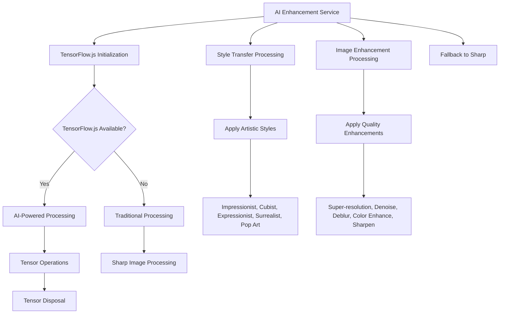
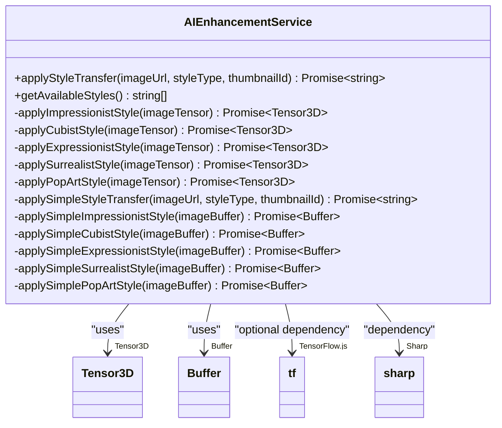
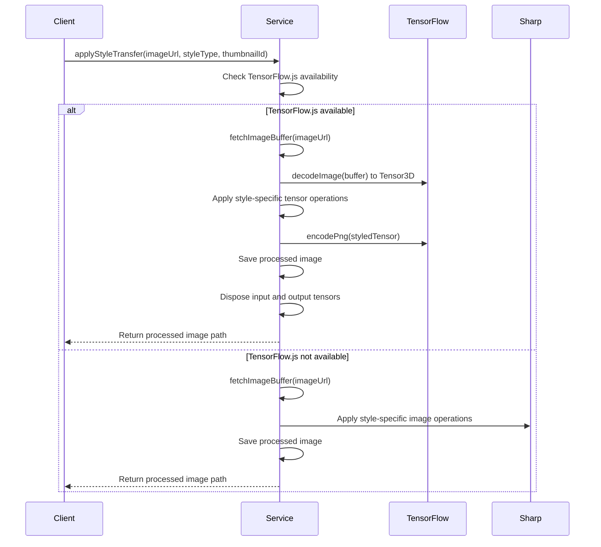
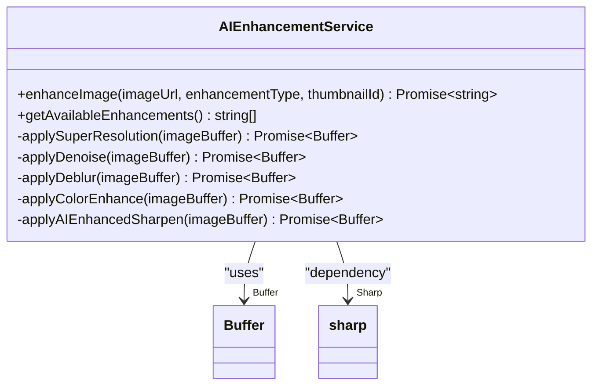
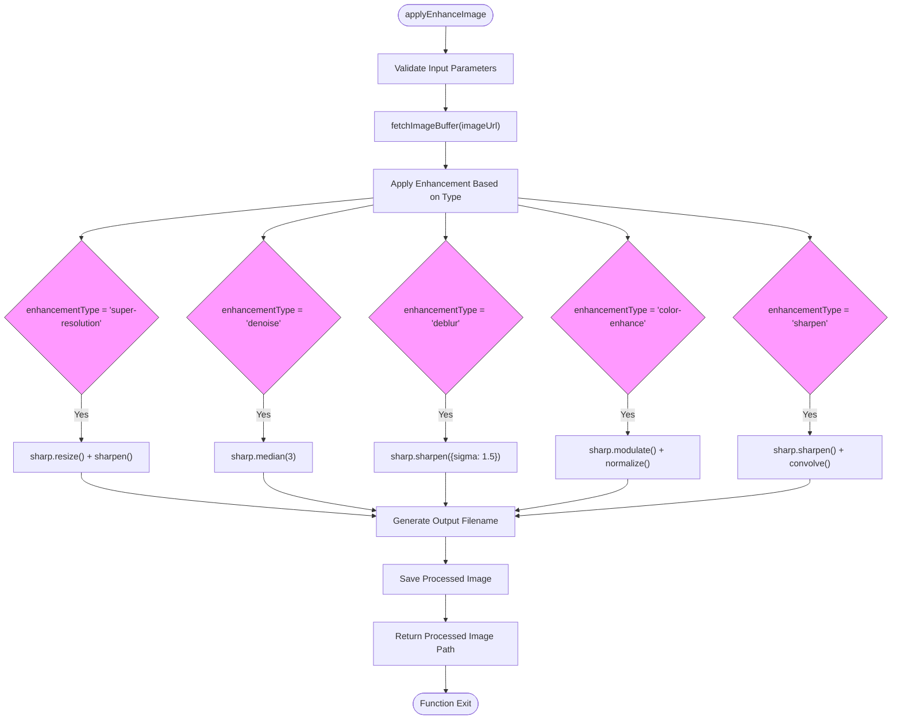
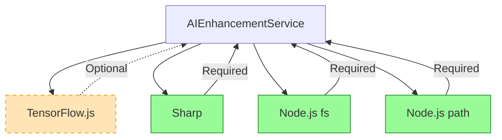

# AI Enhancement Service

<cite>
**Referenced Files in This Document**   
- [ai-enhancement.service.ts](file://pikzels-clone/src/modules/ai/ai-enhancement.service.ts)
</cite>

## Table of Contents
1. [Introduction](#introduction)
2. [Core Components](#core-components)
3. [Architecture Overview](#architecture-overview)
4. [Detailed Component Analysis](#detailed-component-analysis)
5. [Dependency Analysis](#dependency-analysis)
6. [Performance Considerations](#performance-considerations)
7. [Troubleshooting Guide](#troubleshooting-guide)
8. [Conclusion](#conclusion)

## Introduction

The AI Enhancement Service provides advanced image processing capabilities through a hybrid approach that combines artificial intelligence with traditional image manipulation techniques. This service enables users to apply artistic styles and quality enhancements to images, with a graceful fallback mechanism when AI capabilities are unavailable. The implementation leverages TensorFlow.js for AI-powered transformations and Sharp for traditional image processing, creating a robust system that maintains functionality across different environments.

**Section sources**
- [ai-enhancement.service.ts](file://pikzels-clone/src/modules/ai/ai-enhancement.service.ts#L1-L665)

## Core Components

The AI Enhancement Service consists of several key components that work together to provide style transfer and image enhancement functionality. The core class `AIEnhancementService` manages the initialization of TensorFlow.js, handles image processing workflows, and provides methods for both AI-powered and traditional image transformations. The service implements a fallback strategy that automatically switches to Sharp-based processing when TensorFlow.js is unavailable, ensuring consistent functionality regardless of the execution environment.

The service exposes two primary interfaces: `applyStyleTransfer` for artistic transformations and `enhanceImage` for quality improvements. Supporting methods handle tensor manipulation, memory management, and image buffer operations. The implementation includes comprehensive error handling and resource cleanup to prevent memory leaks during intensive image processing operations.

**Section sources**
- [ai-enhancement.service.ts](file://pikzels-clone/src/modules/ai/ai-enhancement.service.ts#L1-L665)

## Architecture Overview

The AI Enhancement Service follows a layered architecture that separates concerns between AI processing, traditional image manipulation, and service coordination. The architecture is designed to be resilient, with a clear fallback path when AI capabilities are unavailable.

**Diagram sources**
- [ai-enhancement.service.ts](file://pikzels-clone/src/modules/ai/ai-enhancement.service.ts#L1-L665)

**Section sources**
- [ai-enhancement.service.ts](file://pikzels-clone/src/modules/ai/ai-enhancement.service.ts#L1-L665)

## Detailed Component Analysis

### Style Transfer Implementation

The style transfer functionality provides five distinct artistic styles that can be applied to images. The service implements both AI-powered and traditional approaches, with TensorFlow.js handling the sophisticated neural style transfer when available, and Sharp providing simplified approximations as a fallback.

**Diagram sources**
- [ai-enhancement.service.ts](file://pikzels-clone/src/modules/ai/ai-enhancement.service.ts#L1-L665)

**Section sources**
- [ai-enhancement.service.ts](file://pikzels-clone/src/modules/ai/ai-enhancement.service.ts#L63-L502)

#### Artistic Style Processing Flow

The service processes artistic styles through a well-defined workflow that handles both AI and traditional approaches. When TensorFlow.js is available, the service converts images to tensors, applies mathematical transformations to achieve the desired artistic effect, and then converts the result back to an image buffer.

**Diagram sources**
- [ai-enhancement.service.ts](file://pikzels-clone/src/modules/ai/ai-enhancement.service.ts#L63-L181)

### Image Enhancement Implementation

The image enhancement functionality provides five quality improvement options that can be applied to images. These enhancements focus on improving image clarity, resolution, and color quality through both AI-powered and traditional methods.

**Diagram sources**
- [ai-enhancement.service.ts](file://pikzels-clone/src/modules/ai/ai-enhancement.service.ts#L1-L665)

**Section sources**
- [ai-enhancement.service.ts](file://pikzels-clone/src/modules/ai/ai-enhancement.service.ts#L190-L581)

#### Enhancement Processing Flow

The enhancement processing follows a consistent pattern across all enhancement types, with the service routing requests to the appropriate implementation based on the requested enhancement type.

**Diagram sources**
- [ai-enhancement.service.ts](file://pikzels-clone/src/modules/ai/ai-enhancement.service.ts#L190-L237)

## Dependency Analysis

The AI Enhancement Service has a well-defined dependency structure that enables its hybrid AI/traditional processing approach. The service conditionally depends on TensorFlow.js for AI-powered operations, with a graceful degradation to Sharp when the AI framework is unavailable.

**Diagram sources**
- [ai-enhancement.service.ts](file://pikzels-clone/src/modules/ai/ai-enhancement.service.ts#L1-L665)

**Section sources**
- [ai-enhancement.service.ts](file://pikzels-clone/src/modules/ai/ai-enhancement.service.ts#L1-L665)

## Performance Considerations

The AI Enhancement Service implements several performance optimizations to handle CPU-intensive image processing operations efficiently. The service manages memory carefully by disposing of TensorFlow.js tensors after use to prevent memory leaks. The implementation uses asynchronous operations throughout to avoid blocking the event loop during potentially long-running image processing tasks.

For AI-powered operations, the service initializes TensorFlow.js during construction, warming up the framework to reduce latency for subsequent operations. The fallback to Sharp ensures that image processing remains available even when the more resource-intensive TensorFlow.js is not present or fails to initialize.

The service processes images in memory as buffers rather than writing intermediate results to disk, reducing I/O overhead. Output images are saved to the processed-images directory with timestamps in their filenames to prevent conflicts.

**Section sources**
- [ai-enhancement.service.ts](file://pikzels-clone/src/modules/ai/ai-enhancement.service.ts#L43-L54)
- [ai-enhancement.service.ts](file://pikzels-clone/src/modules/ai/ai-enhancement.service.ts#L63-L125)
- [ai-enhancement.service.ts](file://pikzels-clone/src/modules/ai/ai-enhancement.service.ts#L317-L502)

## Troubleshooting Guide

The AI Enhancement Service includes comprehensive error handling to address common issues that may arise during image processing. When TensorFlow.js fails to initialize, the service logs the error and continues operation using Sharp as a fallback, ensuring that core functionality remains available.

Common issues and their solutions include:

- **TensorFlow.js initialization failures**: These typically occur when the @tensorflow/tfjs-node package is not properly installed or when there are compatibility issues with the Node.js version. The service gracefully falls back to Sharp in these cases.

- **Memory exhaustion during tensor operations**: The service explicitly disposes of tensors after use to prevent memory leaks. If memory issues persist, consider processing images in smaller batches or reducing image resolution.

- **Image fetch failures**: The service includes error handling for image retrieval operations. Ensure that image URLs are accessible and that the service has appropriate network permissions.

- **Degraded performance**: For AI-powered operations, ensure that TensorFlow.js is properly installed with native bindings. Without native bindings, performance may be significantly slower.

The service logs detailed error messages to help diagnose issues, and all public methods include comprehensive error handling to prevent uncaught exceptions.

**Section sources**
- [ai-enhancement.service.ts](file://pikzels-clone/src/modules/ai/ai-enhancement.service.ts#L43-L54)
- [ai-enhancement.service.ts](file://pikzels-clone/src/modules/ai/ai-enhancement.service.ts#L63-L125)
- [ai-enhancement.service.ts](file://pikzels-clone/src/modules/ai/ai-enhancement.service.ts#L190-L237)
- [ai-enhancement.service.ts](file://pikzels-clone/src/modules/ai/ai-enhancement.service.ts#L588-L623)

## Conclusion

The AI Enhancement Service provides a robust solution for applying artistic styles and quality enhancements to images through a hybrid approach that combines the power of TensorFlow.js with the reliability of Sharp. The service's architecture enables AI-powered transformations when available while maintaining functionality through traditional image processing methods when AI capabilities are unavailable.

Key strengths of the implementation include its graceful fallback mechanism, comprehensive error handling, and careful memory management. The service exposes a clean interface for both style transfer and image enhancement operations, with support for multiple artistic styles and enhancement types. The design prioritizes reliability and performance, making it suitable for production use in thumbnail generation and image processing workflows.