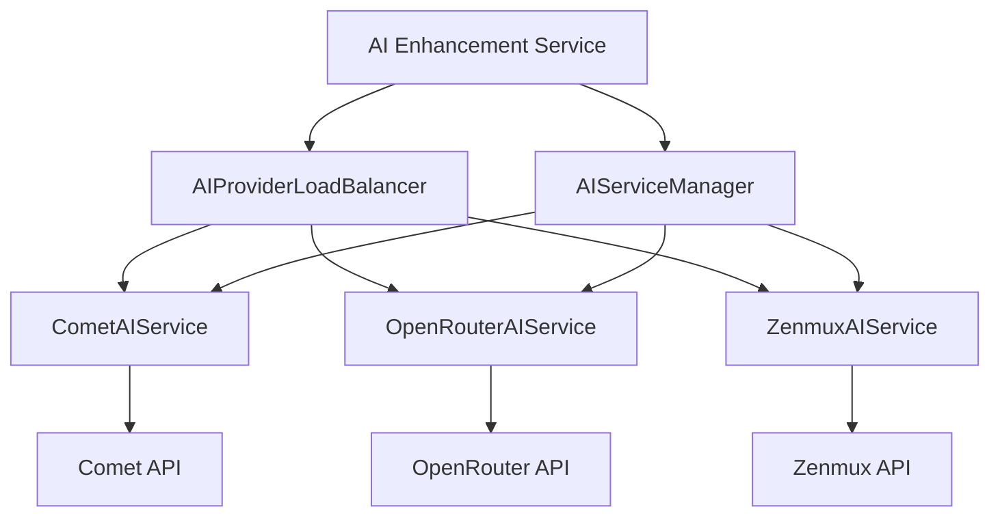
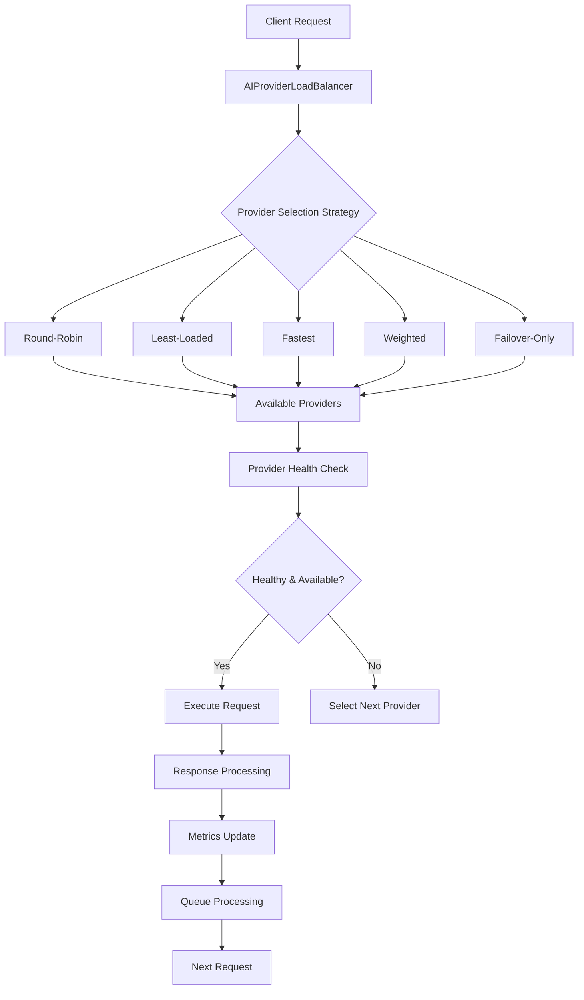
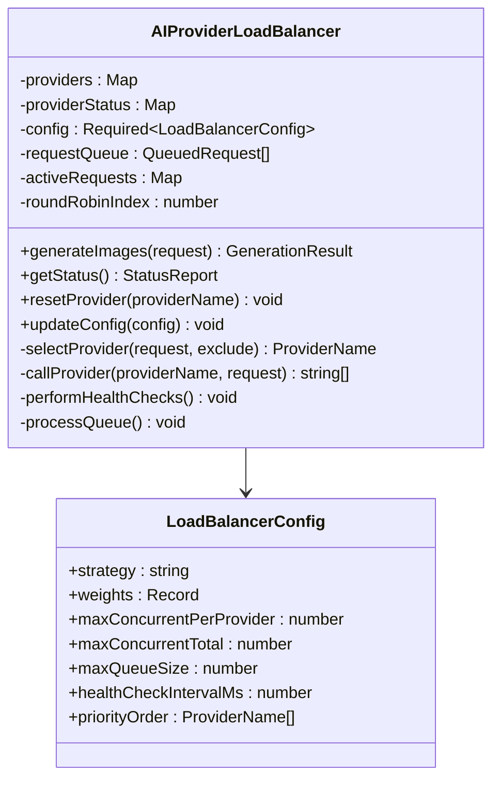
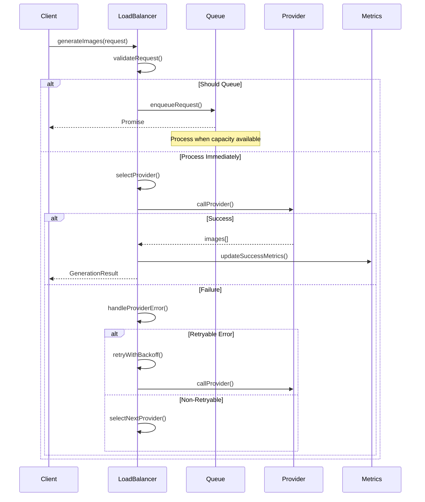
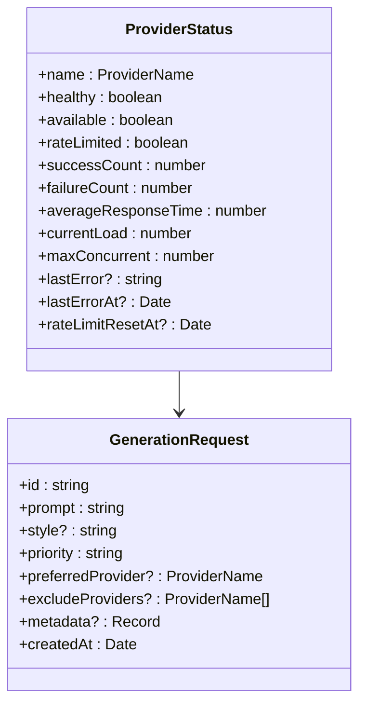
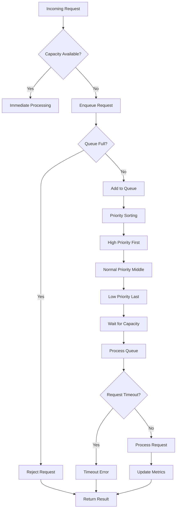
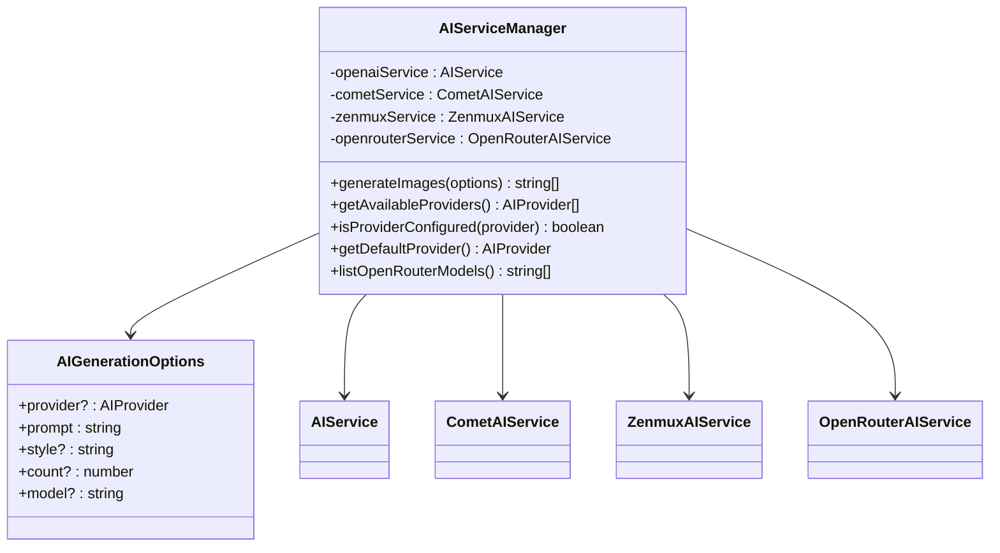
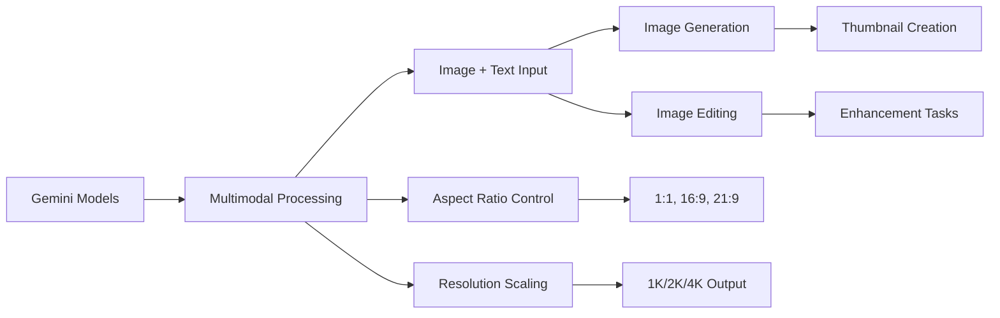

# AI Enhancement Service

<cite>
**Referenced Files in This Document**
- [ai-provider-load-balancer.ts](file://pikzels-clone/src/modules/thumbnail/ai-provider-load-balancer.ts)
- [ai-service-manager.ts](file://pikzels-clone/src/modules/thumbnail/ai-service-manager.ts)
- [comet-ai.service.ts](file://pikzels-clone/src/modules/thumbnail/comet-ai.service.ts)
- [openrouter-ai.service.ts](file://pikzels-clone/src/modules/thumbnail/openrouter-ai.service.ts)
- [zenmux-ai.service.ts](file://pikzels-clone/src/modules/thumbnail/zenmux-ai.service.ts)
- [ai-enhancement.service.ts](file://pikzels-clone/src/modules/ai/ai-enhancement.service.ts)
</cite>

## Update Summary
**Changes Made**
- Updated documentation to reflect migration from specialized AI models to Google Gemini 2.5 Flash Image and Gemini 3 Pro Image models
- Added comprehensive coverage of Gemini's advanced multimodal capabilities including image_size parameters for 2K and 4K output resolution
- Enhanced documentation with Gemini model specifications, aspect ratio support, and resolution scaling features
- Updated provider recommendations to prioritize Gemini models for thumbnail generation and enhancement operations
- Added troubleshooting guidance for Gemini-specific configuration and performance optimization

## Table of Contents
1. [Introduction](#introduction)
2. [Core Components](#core-components)
3. [Architecture Overview](#architecture-overview)
4. [Detailed Component Analysis](#detailed-component-analysis)
5. [Multi-Provider Load Balancing System](#multi-provider-load-balancing-system)
6. [AI Service Management](#ai-service-management)
7. [Provider-Specific Implementations](#provider-specific-implementations)
8. [Gemini Model Migration and Capabilities](#gemini-model-migration-and-capabilities)
9. [Integration Patterns](#integration-patterns)
10. [Performance Considerations](#performance-considerations)
11. [Troubleshooting Guide](#troubleshooting-guide)
12. [Conclusion](#conclusion)

## Introduction

The AI Enhancement Service has evolved into a sophisticated multi-provider system that leverages intelligent load balancing and failover mechanisms to provide reliable AI-powered image generation and enhancement capabilities. This system replaces the previous single-provider approach with a production-ready architecture that supports multiple AI providers including Comet API, OpenRouter, and Zenmux, offering redundancy, scalability, and optimal performance through intelligent distribution of workloads.

**Updated** The service now prioritizes Google Gemini models for enhanced multimodal capabilities, particularly for thumbnail generation and enhancement operations with advanced image_size parameters supporting 2K and 4K output resolutions.

**Section sources**
- [ai-provider-load-balancer.ts](file://pikzels-clone/src/modules/thumbnail/ai-provider-load-balancer.ts#L1-L890)
- [ai-service-manager.ts](file://pikzels-clone/src/modules/thumbnail/ai-service-manager.ts#L1-L143)

## Core Components

The AI Enhancement Service now consists of three primary architectural layers:

### Load Balancer Layer
The AIProviderLoadBalancer serves as the central coordinator, managing multiple AI providers with intelligent routing, health monitoring, and failover capabilities. It implements configurable strategies including round-robin, least-loaded, fastest, weighted, and failover-only approaches.

### Service Management Layer  
The AIServiceManager provides a unified interface for accessing individual AI providers, handling provider configuration validation and service orchestration.

### Provider Implementation Layer
Individual provider services (CometAIService, OpenRouterAIService, ZenmuxAIService) encapsulate provider-specific APIs, authentication, and response handling logic.

**Diagram sources**
- [ai-provider-load-balancer.ts](file://pikzels-clone/src/modules/thumbnail/ai-provider-load-balancer.ts#L98-L184)
- [ai-service-manager.ts](file://pikzels-clone/src/modules/thumbnail/ai-service-manager.ts#L20-L31)

**Section sources**
- [ai-provider-load-balancer.ts](file://pikzels-clone/src/modules/thumbnail/ai-provider-load-balancer.ts#L98-L184)
- [ai-service-manager.ts](file://pikzels-clone/src/modules/thumbnail/ai-service-manager.ts#L20-L98)

## Architecture Overview

The new architecture implements a distributed AI service system with comprehensive load balancing, health monitoring, and intelligent failover mechanisms designed for production environments with potentially high traffic loads.

**Diagram sources**
- [ai-provider-load-balancer.ts](file://pikzels-clone/src/modules/thumbnail/ai-provider-load-balancer.ts#L206-L353)

**Section sources**
- [ai-provider-load-balancer.ts](file://pikzels-clone/src/modules/thumbnail/ai-provider-load-balancer.ts#L98-L132)

## Detailed Component Analysis

### Load Balancer Configuration and Strategy

The AIProviderLoadBalancer offers extensive configuration options for production deployment:

**Diagram sources**
- [ai-provider-load-balancer.ts](file://pikzels-clone/src/modules/thumbnail/ai-provider-load-balancer.ts#L98-L132)

**Section sources**
- [ai-provider-load-balancer.ts](file://pikzels-clone/src/modules/thumbnail/ai-provider-load-balancer.ts#L117-L132)

### Request Processing Workflow

The load balancer implements a sophisticated request processing pipeline with queue management, retry logic, and comprehensive error handling:

**Diagram sources**
- [ai-provider-load-balancer.ts](file://pikzels-clone/src/modules/thumbnail/ai-provider-load-balancer.ts#L206-L353)

**Section sources**
- [ai-provider-load-balancer.ts](file://pikzels-clone/src/modules/thumbnail/ai-provider-load-balancer.ts#L206-L353)

## Multi-Provider Load Balancing System

### Provider Selection Strategies

The load balancer supports five distinct provider selection strategies:

**Round-Robin**: Distributes requests evenly across all available providers, ensuring fair usage distribution.

**Least-Loaded**: Selects the provider with the lowest current load, optimizing for performance under varying workloads.

**Fastest**: Chooses the provider with the best average response time, prioritizing speed based on historical performance data.

**Weighted**: Applies configurable weights to prioritize certain providers over others based on capacity, cost, or quality considerations.

**Failover-Only**: Uses a strict priority order for providers, only switching when the current provider fails or becomes unavailable.

### Health Monitoring and Status Tracking

Each provider maintains comprehensive status information including health state, availability, rate limiting status, success/failure counts, and performance metrics:

**Diagram sources**
- [ai-provider-load-balancer.ts](file://pikzels-clone/src/modules/thumbnail/ai-provider-load-balancer.ts#L21-L89)

**Section sources**
- [ai-provider-load-balancer.ts](file://pikzels-clone/src/modules/thumbnail/ai-provider-load-balancer.ts#L21-L89)

### Queue Management and Request Processing

The system implements intelligent queue management with priority-based ordering, timeout handling, and automatic retry mechanisms:

**Diagram sources**
- [ai-provider-load-balancer.ts](file://pikzels-clone/src/modules/thumbnail/ai-provider-load-balancer.ts#L235-L285)

**Section sources**
- [ai-provider-load-balancer.ts](file://pikzels-clone/src/modules/thumbnail/ai-provider-load-balancer.ts#L235-L285)

## AI Service Management

### Unified Provider Interface

The AIServiceManager provides a simplified interface for accessing multiple AI providers while handling configuration validation and service orchestration:

**Diagram sources**
- [ai-service-manager.ts](file://pikzels-clone/src/modules/thumbnail/ai-service-manager.ts#L20-L143)

**Section sources**
- [ai-service-manager.ts](file://pikzels-clone/src/modules/thumbnail/ai-service-manager.ts#L20-L143)

### Provider Configuration and Validation

Each provider implements robust configuration validation to ensure proper setup before accepting requests:

**Section sources**
- [ai-service-manager.ts](file://pikzels-clone/src/modules/thumbnail/ai-service-manager.ts#L38-L75)

## Provider-Specific Implementations

### Comet AI Service

The CometAIService provides access to multiple AI models through a unified API, supporting both direct FLUX generation and Replicate-compatible endpoints with automatic fallback mechanisms.

**Section sources**
- [comet-ai.service.ts](file://pikzels-clone/src/modules/thumbnail/comet-ai.service.ts#L19-L91)

### OpenRouter AI Service

The OpenRouterAIService integrates with multiple image generation models including Gemini, GPT-5, and FLUX.2 variants, supporting various aspect ratios and quality configurations.

**Updated** Now prioritizes Google Gemini 2.5 Flash Image and Gemini 3 Pro Image models for enhanced multimodal capabilities and 2K/4K output resolution support.

**Section sources**
- [openrouter-ai.service.ts](file://pikzels-clone/src/modules/thumbnail/openrouter-ai.service.ts#L22-L97)

### Zenmux AI Service

The ZenmuxAIService leverages the Vertex AI protocol to access high-quality Gemini models with flexible configuration options and comprehensive error handling.

**Section sources**
- [zenmux-ai.service.ts](file://pikzels-clone/src/modules/thumbnail/zenmux-ai.service.ts#L19-L80)

## Gemini Model Migration and Capabilities

### Google Gemini Model Specifications

The service now extensively utilizes Google Gemini models for superior multimodal capabilities:

**Gemini 2.5 Flash Image** (`google/gemini-2.5-flash-image`)
- **Status**: General Availability (GA)
- **Best for**: Thumbnails, fast generation, cost-effective solutions
- **Capabilities**: Advanced multimodal processing, 2K/4K output support via image_size parameter
- **Performance**: High speed with excellent quality balance

**Gemini 3 Pro Image** (`google/gemini-3-pro-image-preview`)
- **Status**: Preview/Pro version
- **Best for**: Highest quality outputs, detailed enhancement
- **Capabilities**: Premium quality generation, advanced image manipulation
- **Resolution**: Supports 2K and 4K output through image_size configuration

### Advanced Multimodal Capabilities

Gemini models provide enhanced capabilities beyond traditional text-to-image generation:

**Diagram sources**
- [openrouter-ai.service.ts](file://pikzels-clone/src/modules/thumbnail/openrouter-ai.service.ts#L33-L96)

### Image Size Parameters and Resolution Support

Gemini models support advanced image_size parameters for precise output control:

**Supported Image Sizes**:
- `1K`: 1024×1024 pixels (default)
- `2K`: 2048×2048 pixels (2x resolution)
- `4K`: 4096×4096 pixels (4x resolution)

**Aspect Ratio Support**:
- Square (1:1) - 1024×1024
- Portrait (2:3) - 832×1248
- Landscape (3:2) - 1248×832
- Portrait (3:4) - 864×1184
- Landscape (4:3) - 1184×864
- Portrait (4:5) - 896×1152
- Landscape (5:4) - 1152×896
- Portrait (9:16) - 768×1344
- Landscape (16:9) - 1344×768 (optimal for thumbnails)
- Ultrawide (21:9) - 1536×672

**Section sources**
- [openrouter-ai.service.ts](file://pikzels-clone/src/modules/thumbnail/openrouter-ai.service.ts#L33-L96)
- [openrouter-ai.service.ts](file://pikzels-clone/src/modules/thumbnail/openrouter-ai.service.ts#L56-L82)

## Integration Patterns

### Traditional AI Enhancement Service

The existing AIEnhancementService continues to provide style transfer and image enhancement capabilities using TensorFlow.js and Sharp, with graceful fallback to traditional processing methods when AI frameworks are unavailable.

**Section sources**
- [ai-enhancement.service.ts](file://pikzels-clone/src/modules/ai/ai-enhancement.service.ts#L31-L126)

### Hybrid Integration Approach

Organizations can leverage both systems simultaneously:
- Use AIProviderLoadBalancer for scalable, multi-provider image generation with Gemini models
- Use AIEnhancementService for style transfer and enhancement operations
- Implement custom integration patterns based on specific requirements

**Updated** Gemini models now serve as the primary recommendation for thumbnail generation and enhancement tasks due to their superior multimodal capabilities and resolution support.

## Performance Considerations

### Load Balancer Performance Optimization

The load balancer implements several performance optimizations for high-throughput scenarios:

**Memory Management**: Efficient provider status tracking with automatic cleanup of inactive providers and metrics decay for long-running systems.

**Connection Pooling**: Intelligent connection management to minimize API call overhead and maximize throughput across multiple providers.

**Caching Strategy**: Provider health and configuration caching to reduce repeated validation overhead and improve response times.

**Resource Limits**: Configurable concurrency limits per provider and global rate limiting to prevent provider overload and ensure fair resource distribution.

### Provider-Specific Optimizations

Each provider service implements optimization strategies:

**Comet API**: Dual endpoint support with automatic fallback and intelligent error recovery to maximize success rates.

**OpenRouter**: Model selection optimization and parameter tuning for optimal quality-to-speed ratios, with Gemini models prioritized for thumbnail operations.

**Zenmux**: Vertex AI protocol optimization and response format normalization for consistent performance.

**Gemini Integration**: Specialized handling for Gemini model parameters including image_size configuration and aspect ratio optimization.

**Section sources**
- [ai-provider-load-balancer.ts](file://pikzels-clone/src/modules/thumbnail/ai-provider-load-balancer.ts#L117-L132)
- [ai-enhancement.service.ts](file://pikzels-clone/src/modules/ai/ai-enhancement.service.ts#L44-L55)

## Troubleshooting Guide

### Load Balancer Issues

**Provider Health Problems**: Monitor provider status through the getStatus() method and use resetProvider() to manually reset unhealthy providers.

**Queue Bottlenecks**: Adjust queue configuration parameters including maxQueueSize and queueTimeoutMs to handle peak loads effectively.

**Rate Limiting**: The system automatically handles rate limiting with configurable cooldown periods. Monitor rateLimitResetAt timestamps to understand provider availability.

**Strategy Configuration**: Test different provider selection strategies using the updateConfig() method to optimize for specific workload patterns.

### Provider-Specific Troubleshooting

**Authentication Issues**: Verify API key configuration and use isConfigured() methods to validate provider setup before deployment.

**Network Connectivity**: Implement proper error handling for network timeouts and retry mechanisms for transient failures.

**Model Availability**: Monitor provider model availability and implement fallback strategies for unsupported model configurations.

**Response Time Monitoring**: Track provider response times and adjust weights or priorities based on performance metrics.

### Gemini-Specific Troubleshooting

**Model Configuration**: Ensure Gemini models are properly configured with correct model IDs and parameters.

**Image Size Issues**: Verify image_size parameters are correctly set for desired output resolution (1K, 2K, or 4K).

**Aspect Ratio Problems**: Check aspect ratio compatibility with Gemini models and ensure proper dimension calculations.

**Multimodal Errors**: Verify modalities array includes both 'image' and 'text' for Gemini model requests.

**Section sources**
- [ai-provider-load-balancer.ts](file://pikzels-clone/src/modules/thumbnail/ai-provider-load-balancer.ts#L765-L795)
- [ai-service-manager.ts](file://pikzels-clone/src/modules/thumbnail/ai-service-manager.ts#L105-L118)

## Conclusion

The AI Enhancement Service has evolved into a comprehensive, production-ready multi-provider system that provides scalable, reliable AI-powered image generation and enhancement capabilities. The new architecture offers superior fault tolerance, performance optimization, and operational flexibility compared to the previous single-provider approach.

**Updated Key Advantages with Gemini Migration**:

**Enhanced Multimodal Processing**: Google Gemini models provide superior image generation capabilities with advanced multimodal processing for thumbnails and enhancement tasks.

**Advanced Resolution Control**: 2K and 4K output support through image_size parameters enables high-quality thumbnail generation and enhancement workflows.

**Optimized Performance**: Gemini models offer better quality-to-speed ratios for thumbnail creation, making them ideal for production environments.

**Scalability**: Support for multiple AI providers with intelligent load distribution and automatic failover mechanisms.

**Reliability**: Comprehensive health monitoring, rate limit handling, and queue management ensure consistent service availability.

**Flexibility**: Configurable provider selection strategies and dynamic reconfiguration enable adaptation to changing workload patterns and provider performance.

**Operational Excellence**: Detailed metrics collection, logging, and monitoring capabilities support effective operations and troubleshooting.

The system maintains backward compatibility with existing AI enhancement functionality while providing a foundation for future expansion and optimization of AI-powered features in the thumbnail generation workflow, with Google Gemini models as the recommended choice for most thumbnail generation and enhancement operations.