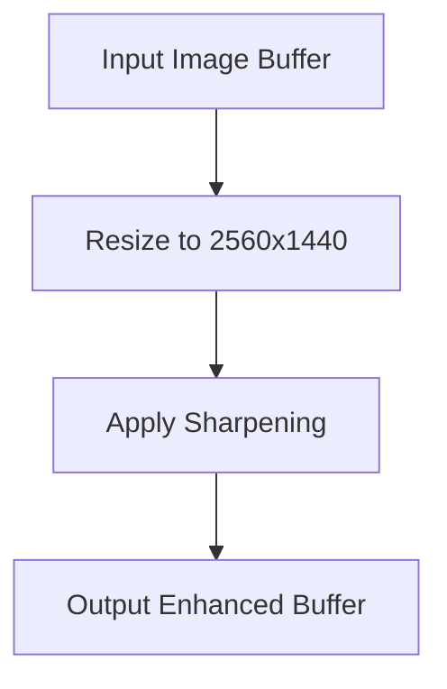
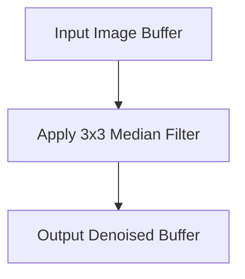
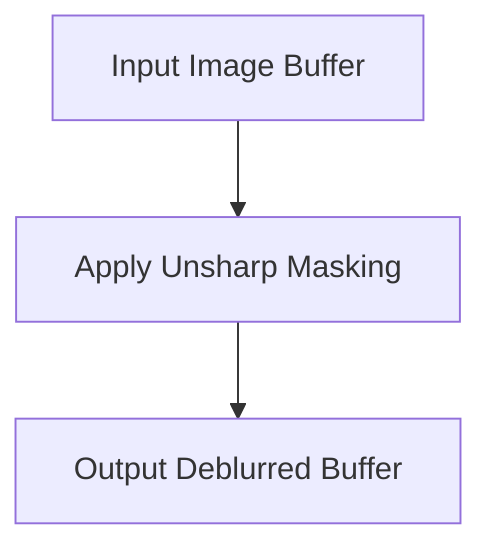
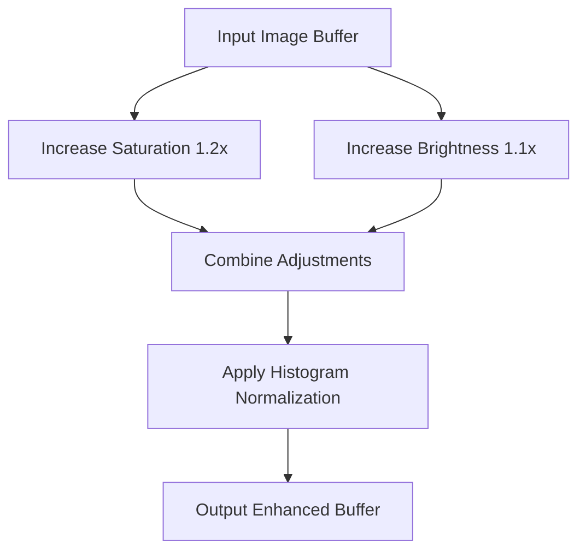
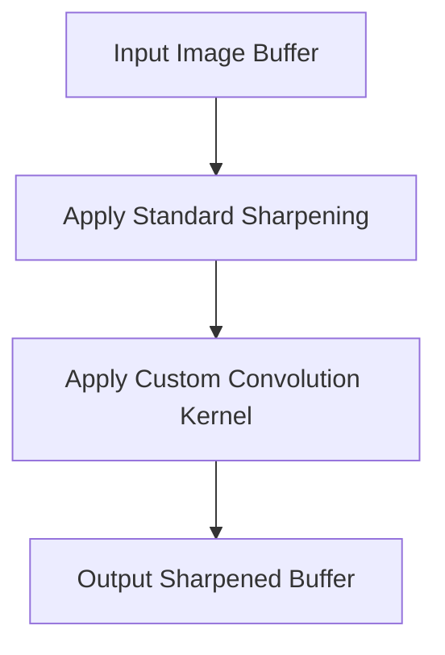
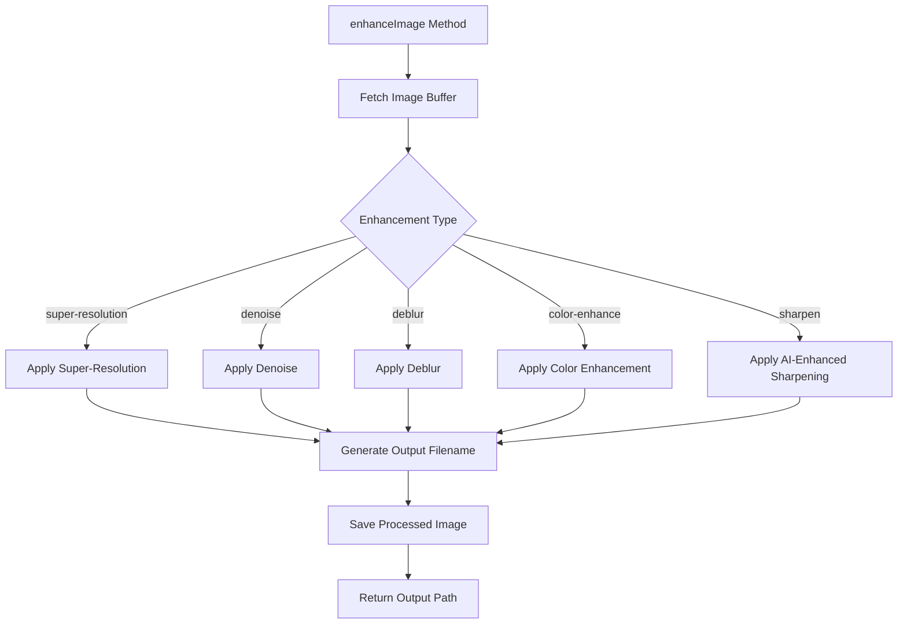

# Image Enhancement

<cite>
**Referenced Files in This Document**   
- [ai-enhancement.service.ts](file://pikzels-clone\src\modules\ai\ai-enhancement.service.ts)
- [image-processing.service.ts](file://pikzels-clone\src\modules\thumbnail\image-processing.service.ts)
</cite>

## Table of Contents
1. [Introduction](#introduction)
2. [Core Components](#core-components)
3. [Enhancement Types and Techniques](#enhancement-types-and-techniques)
4. [Processing Pipeline](#processing-pipeline)
5. [Memory and Performance Considerations](#memory-and-performance-considerations)
6. [Error Handling and Resilience](#error-handling-and-resilience)
7. [Troubleshooting Guide](#troubleshooting-guide)

## Introduction

The Image Enhancement feature within the AI Enhancement Service provides a comprehensive suite of quality improvement capabilities for thumbnail images. This system combines AI-inspired algorithms with traditional image processing techniques through the Sharp library to deliver super-resolution, denoise, deblur, color enhancement, and sharpening functionalities. The enhancement process is orchestrated through the `enhanceImage` method, which serves as the primary interface for applying various quality improvements to input images. This document details the implementation architecture, specific enhancement techniques, buffer handling strategies, and performance characteristics of the image enhancement system.

## Core Components

The image enhancement functionality is primarily implemented in the `AIEnhancementService` class, which coordinates the application of various enhancement types to input images. The service integrates with the `ImageProcessingService` for fundamental image manipulation operations and leverages the Sharp library for low-level image processing. The enhancement workflow begins with image buffer retrieval and concludes with processed image persistence, maintaining a consistent pattern across all enhancement types. The system is designed with fallback mechanisms that ensure basic functionality even when advanced AI capabilities are unavailable.

**Section sources**
- [ai-enhancement.service.ts](file://pikzels-clone\src\modules\ai\ai-enhancement.service.ts#L30-L664)
- [image-processing.service.ts](file://pikzels-clone\src\modules\thumbnail\image-processing.service.ts#L10-L280)

## Enhancement Types and Techniques

The AI Enhancement Service implements five distinct enhancement types, each addressing specific image quality issues through targeted algorithms. These enhancements combine AI-inspired approaches with traditional image processing techniques to achieve optimal results.

### Super-Resolution

The super-resolution enhancement increases image resolution through strategic upscaling. The implementation uses Sharp's resize functionality to upscale images to 2560x1440 pixels (2x the base resolution), followed by sharpening to enhance detail clarity. This approach simulates the effects of more sophisticated super-resolution models while maintaining computational efficiency. The enhancement preserves image aspect ratio during upscaling and applies post-processing sharpening to mitigate potential blurring from the resize operation.

**Diagram sources**
- [ai-enhancement.service.ts](file://pikzels-clone\src\modules\ai\ai-enhancement.service.ts#L509-L519)

### Denoise

The denoise enhancement reduces image noise using median filtering, an effective technique for removing salt-and-pepper noise while preserving edge details. The implementation applies a 3x3 median filter through Sharp's median function, which replaces each pixel with the median value of its 3x3 neighborhood. This non-linear filtering approach is particularly effective at eliminating random noise pixels without significantly blurring important image features.

**Diagram sources**
- [ai-enhancement.service.ts](file://pikzels-clone\src\modules\ai\ai-enhancement.service.ts#L526-L533)

### Deblur

The deblur enhancement addresses image blur through unsharp masking, a technique that enhances edges and fine details. The implementation uses Sharp's sharpen function with a sigma value of 1.5, which controls the radius of the effect. This approach creates a high-pass filtered version of the image and adds it back to the original, effectively amplifying high-frequency components that correspond to edges and textures, resulting in a perceptually sharper image.

**Diagram sources**
- [ai-enhancement.service.ts](file://pikzels-clone\src\modules\ai\ai-enhancement.service.ts#L540-L547)

### Color Enhancement

The color enhancement process improves image vibrancy and contrast through multiple adjustments. The implementation simultaneously increases saturation by 20% and brightness by 10% using Sharp's modulate function, followed by histogram normalization to optimize the full dynamic range of colors. This combination produces images with more vivid colors and improved tonal distribution, making visual elements more prominent and engaging.

**Diagram sources**
- [ai-enhancement.service.ts](file://pikzels-clone\src\modules\ai\ai-enhancement.service.ts#L554-L562)

### Sharpening

The AI-enhanced sharpening technique combines traditional unsharp masking with convolution-based edge enhancement. The implementation first applies standard sharpening with a sigma of 1.5, then applies a custom 3x3 convolution kernel designed to amplify edges. The kernel [-1, -1, -1, -1, 9, -1, -1, -1, -1] acts as a high-pass filter that significantly boosts center pixel values relative to their neighbors, creating a pronounced sharpening effect that enhances fine details throughout the image.

**Diagram sources**
- [ai-enhancement.service.ts](file://pikzels-clone\src\modules\ai\ai-enhancement.service.ts#L569-L581)

## Processing Pipeline

The image enhancement workflow follows a consistent pattern across all enhancement types, ensuring reliability and maintainability. The pipeline begins with image buffer retrieval and concludes with processed image persistence, with enhancement-specific processing occurring in between.

**Diagram sources**
- [ai-enhancement.service.ts](file://pikzels-clone\src\modules\ai\ai-enhancement.service.ts#L190-L237)

## Memory and Performance Considerations

The image enhancement system faces several performance challenges due to the computationally intensive nature of image processing operations. CPU-heavy operations such as resizing, filtering, and convolution can create bottlenecks, particularly when processing high-resolution images or handling multiple enhancement requests concurrently. The system manages memory through careful buffer handling, ensuring that image data is properly disposed of after processing to prevent memory leaks. The use of Sharp, a highly optimized image processing library, helps mitigate performance issues, but certain operations like super-resolution and complex filtering remain resource-intensive. For optimal performance, the system should be deployed on hardware with sufficient CPU resources and adequate memory bandwidth.

**Section sources**
- [ai-enhancement.service.ts](file://pikzels-clone\src\modules\ai\ai-enhancement.service.ts#L190-L664)

## Error Handling and Resilience

The enhancement system implements comprehensive error handling to ensure reliability and graceful degradation. Each enhancement operation is wrapped in try-catch blocks that capture and log errors while providing meaningful error messages to callers. The system includes fallback mechanisms, such as the ability to proceed with basic image processing when AI capabilities are unavailable. Buffer handling includes validation and proper disposal to prevent memory leaks. The fetchImageBuffer method includes special handling for test environments and placeholder images, ensuring consistent behavior across different deployment scenarios.

**Section sources**
- [ai-enhancement.service.ts](file://pikzels-clone\src\modules\ai\ai-enhancement.service.ts#L190-L237)
- [ai-enhancement.service.ts](file://pikzels-clone\src\modules\ai\ai-enhancement.service.ts#L596-L644)

## Troubleshooting Guide

When encountering issues with image enhancement, consider the following common problems and solutions:

1. **Failed Enhancements**: Check server logs for specific error messages. Common causes include insufficient memory, file system permissions issues, or corrupted input images. Ensure the processed-images directory is writable and has sufficient space.

2. **Poor Output Quality**: Verify that input images meet minimum quality requirements. For super-resolution, extremely low-quality source images may not benefit from upscaling. Adjust enhancement parameters based on input image characteristics.

3. **Performance Bottlenecks**: Monitor CPU and memory usage during enhancement operations. Consider implementing request queuing or rate limiting for high-volume scenarios. Optimize by processing images in smaller batches.

4. **Missing AI Features**: If TensorFlow.js fails to initialize, the system will fall back to basic Sharp-based processing. Ensure TensorFlow.js dependencies are properly installed and compatible with the Node.js version.

5. **File Persistence Issues**: Confirm that the processedImagesDir path is correctly configured and accessible. Check file system permissions and ensure adequate disk space is available.

**Section sources**
- [ai-enhancement.service.ts](file://pikzels-clone\src\modules\ai\ai-enhancement.service.ts#L190-L664)