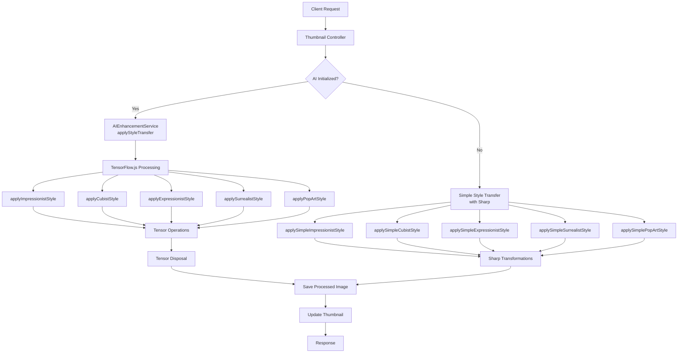
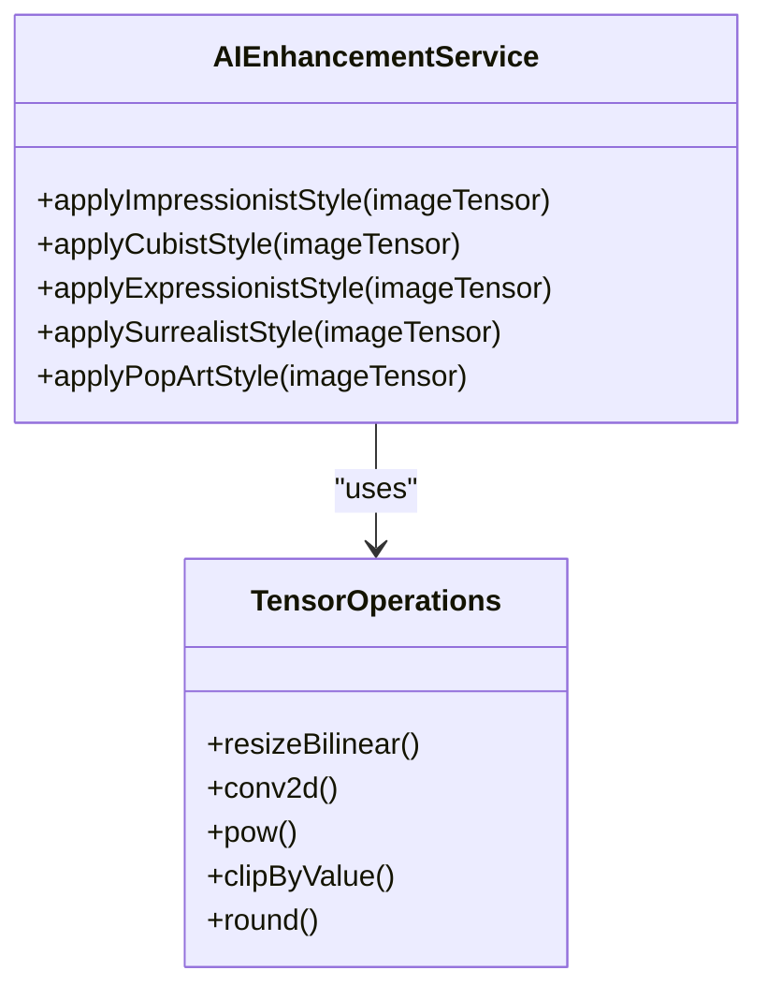
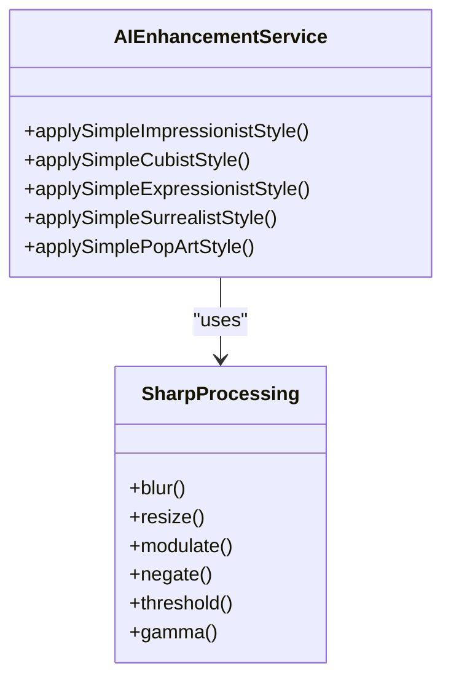

# Style Transfer

<cite>
**Referenced Files in This Document**   
- [ai-enhancement.service.ts](file://src/modules/ai/ai-enhancement.service.ts)
- [thumbnail.controller.ts](file://src/modules/thumbnail/thumbnail.controller.ts)
- [image-processing.service.ts](file://src/modules/thumbnail/image-processing.service.ts)
</cite>

## Table of Contents
1. [Introduction](#introduction)
2. [Architecture Overview](#architecture-overview)
3. [Core Components](#core-components)
4. [Style Transfer Implementation](#style-transfer-implementation)
5. [AI-Powered Style Algorithms](#ai-powered-style-algorithms)
6. [Fallback Processing with Sharp](#fallback-processing-with-sharp)
7. [Performance Considerations](#performance-considerations)
8. [Error Handling and Troubleshooting](#error-handling-and-troubleshooting)
9. [Usage Examples](#usage-examples)

## Introduction

The Style Transfer feature in the AI Enhancement Service enables users to transform thumbnail images into various artistic styles including Impressionist, Cubist, Expressionist, Surrealist, and Pop Art. This functionality combines TensorFlow.js for AI-powered transformations with Sharp for fallback image processing when AI capabilities are unavailable. The system intelligently routes requests based on TensorFlow.js initialization status, ensuring consistent functionality regardless of AI availability. This document details the implementation, internal logic, and operational characteristics of this feature.

## Architecture Overview

The Style Transfer feature follows a service-oriented architecture with clear separation between API endpoints, business logic, and processing layers. The system prioritizes AI-powered transformations while maintaining robust fallback mechanisms.

**Diagram sources**
- [ai-enhancement.service.ts](file://src/modules/ai/ai-enhancement.service.ts)
- [thumbnail.controller.ts](file://src/modules/thumbnail/thumbnail.controller.ts)

## Core Components

The Style Transfer functionality is implemented through three primary components that work in concert to deliver artistic transformations. The AIEnhancementService serves as the central processing unit, handling both AI-powered and fallback style applications. The ThumbnailController exposes the functionality through REST endpoints, managing authentication and thumbnail state updates. For non-AI processing, the system leverages image-processing.service.ts to apply transformations when TensorFlow.js is unavailable.

**Section sources**
- [ai-enhancement.service.ts](file://src/modules/ai/ai-enhancement.service.ts#L63-L125)
- [thumbnail.controller.ts](file://src/modules/thumbnail/thumbnail.controller.ts#L404-L462)
- [image-processing.service.ts](file://src/modules/thumbnail/image-processing.service.ts)

## Style Transfer Implementation

The style transfer process begins with an HTTP request to the applyStyleTransfer endpoint, which validates user authorization and thumbnail ownership before proceeding. The AIEnhancementService checks its initialization status to determine the processing path. When TensorFlow.js is available and properly initialized, the service applies AI-powered transformations through tensor manipulation. If AI capabilities are unavailable, the system seamlessly falls back to Sharp-based image processing methods. This dual-path approach ensures consistent functionality across different deployment environments while maximizing quality when AI resources are present.

The implementation includes comprehensive error handling, tensor memory management, and proper cleanup procedures to prevent memory leaks during intensive image processing operations.

**Section sources**
- [ai-enhancement.service.ts](file://src/modules/ai/ai-enhancement.service.ts#L63-L125)
- [thumbnail.controller.ts](file://src/modules/thumbnail/thumbnail.controller.ts#L404-L462)

## AI-Powered Style Algorithms

### Impressionist Style
The AI-powered Impressionist style applies a soft blur effect through bilinear resizing to simulate brush strokes, followed by saturation enhancement to make colors more vibrant. The algorithm normalizes pixel values, applies the transformation, and ensures values remain within valid ranges before converting back to integer format.

### Cubist Style
The Cubist transformation enhances contrast through power functions and creates geometric effects by reducing resolution and then upsampling. This grid-like effect approximates the fragmented, angular characteristics of Cubist art through tensor operations that manipulate image dimensions and contrast levels.

### Expressionist Style
Expressionist transformations apply strong color shifts by manipulating individual RGB channels with different multipliers, creating emotional intensity through enhanced reds and blues. The algorithm also increases contrast to amplify the dramatic effect characteristic of Expressionist art.

### Surrealist Style
Surrealist transformations combine convolution-based blurring with color inversion to create dreamlike, fantastical effects. The algorithm uses a Gaussian-like kernel for blurring and subtracts the image from 1 to invert colors, producing the disorienting visual effects associated with Surrealism.

### Pop Art Style
Pop Art transformations enhance colors through channel-wise power functions and apply posterization by rounding and quantizing color values. This reduces color depth and creates the bold, high-contrast aesthetic characteristic of Pop Art while maintaining vibrant, saturated colors.

**Diagram sources**
- [ai-enhancement.service.ts](file://src/modules/ai/ai-enhancement.service.ts#L317-L502)

## Fallback Processing with Sharp

When TensorFlow.js is not initialized or unavailable, the system employs Sharp-based fallback methods that replicate the artistic styles through conventional image processing techniques.

### Impressionist Fallback
Applies a 2-pixel blur combined with 30% saturation enhancement to simulate brush strokes and vibrant colors.

### Cubist Fallback
Reduces image resolution to 320x180 pixels then upscales back to 1280x720, creating pixelation effects, while increasing brightness by 20% to enhance geometric contrasts.

### Expressionist Fallback
Increases saturation by 50%, brightness by 10%, and applies a 15-degree hue rotation, followed by gamma correction to intensify colors and create emotional impact.

### Surrealist Fallback
Applies a 3-pixel blur, inverts colors, and reduces saturation to 80% to create dreamy, otherworldly effects.

### Pop Art Fallback
Boosts saturation by 50% and brightness by 20%, then applies thresholding at 128 to create high-contrast, poster-like effects with bold color blocks.

**Diagram sources**
- [ai-enhancement.service.ts](file://src/modules/ai/ai-enhancement.service.ts#L244-L310)

## Performance Considerations

The Style Transfer feature involves CPU-intensive operations that require careful resource management. AI-powered transformations using TensorFlow.js consume significant memory due to tensor operations, particularly during the creation and manipulation of large image tensors. The system implements tensor disposal through explicit dispose() calls to prevent memory leaks and ensure efficient garbage collection.

For optimal performance, the service should be deployed on systems with adequate RAM and processing power, preferably with GPU acceleration for TensorFlow.js operations. When AI capabilities are unavailable, the Sharp-based fallback methods offer faster processing with lower resource requirements, making them suitable for constrained environments.

The initialization process for TensorFlow.js occurs during service startup, with warm-up operations to prepare the framework for immediate use. This initialization status is maintained as a class property, allowing the system to quickly determine the appropriate processing path without repeated environment checks.

**Section sources**
- [ai-enhancement.service.ts](file://src/modules/ai/ai-enhancement.service.ts#L30-L54)

## Error Handling and Troubleshooting

The Style Transfer feature includes comprehensive error handling at multiple levels. During initialization, the system gracefully handles TensorFlow.js loading failures by logging warnings and operating in fallback mode. Each style application method is wrapped in try-catch blocks that capture processing errors and provide meaningful error messages.

Common issues include initialization failures when TensorFlow.js dependencies are missing, which result in automatic fallback to Sharp processing. Memory-related errors may occur during tensor operations on large images, which the system handles by propagating exceptions with descriptive messages. Network issues during image fetching are mitigated through placeholder generation and error logging.

For troubleshooting initialization problems, verify that TensorFlow.js packages are properly installed and that the execution environment meets the framework's requirements. For degraded rendering quality, check that tensor disposal is occurring properly and that memory resources are sufficient for the image sizes being processed.

**Section sources**
- [ai-enhancement.service.ts](file://src/modules/ai/ai-enhancement.service.ts#L43-L54)
- [ai-enhancement.service.ts](file://src/modules/ai/ai-enhancement.service.ts#L75-L125)

## Usage Examples

The Style Transfer feature is invoked through the applyStyleTransfer controller method, which handles authentication, validation, and response formatting. When calling the AIEnhancementService directly, developers should ensure proper error handling and resource management.

Tensor disposal is critical when working with the AI-powered methods, as failure to dispose of tensors can lead to memory leaks during prolonged use. The service automatically handles disposal within its methods, but custom implementations should follow the same pattern of disposing both input and output tensors after processing.

The system validates style types against a predefined list of available styles, ensuring only supported transformations are applied. This validation occurs before any processing begins, preventing unnecessary resource consumption on invalid requests.

**Section sources**
- [ai-enhancement.service.ts](file://src/modules/ai/ai-enhancement.service.ts#L63-L125)
- [thumbnail.controller.ts](file://src/modules/thumbnail/thumbnail.controller.ts#L404-L462)