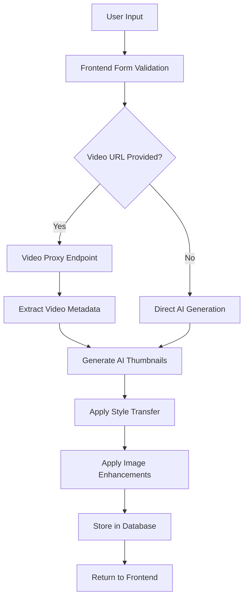
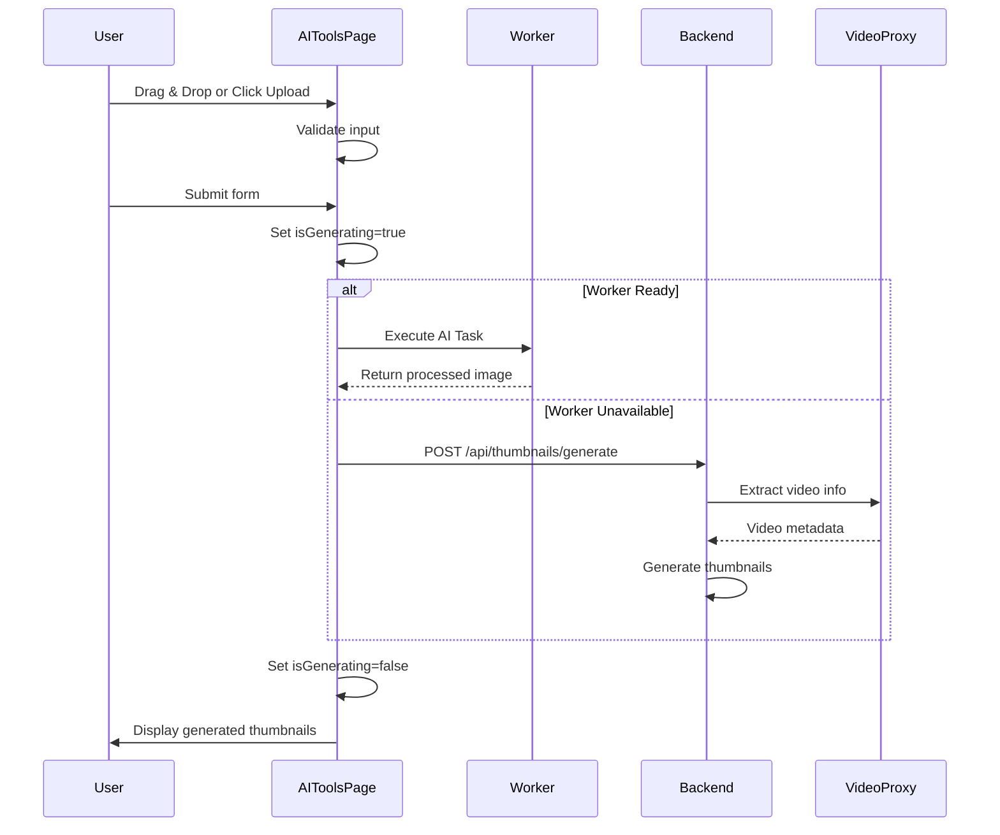
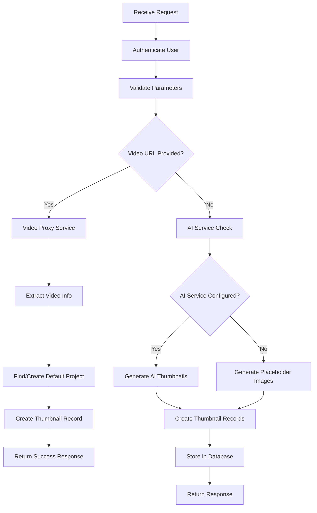
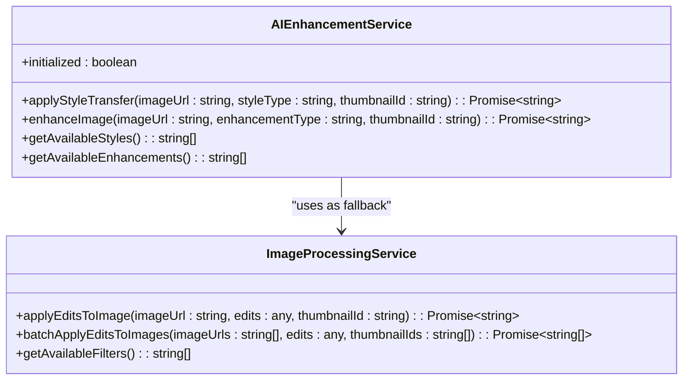
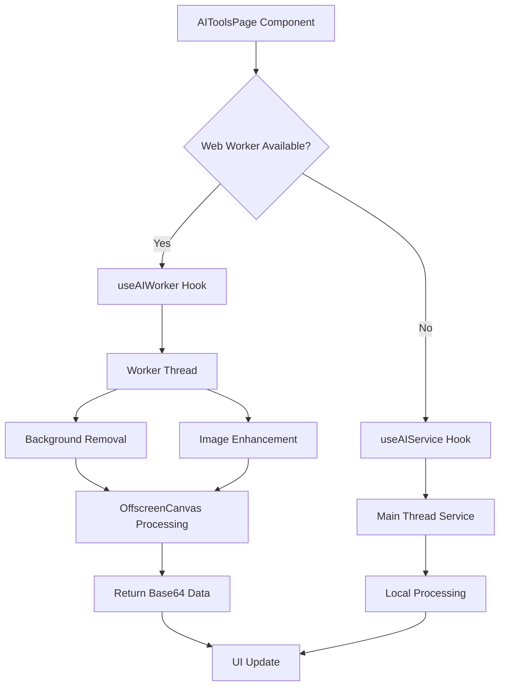
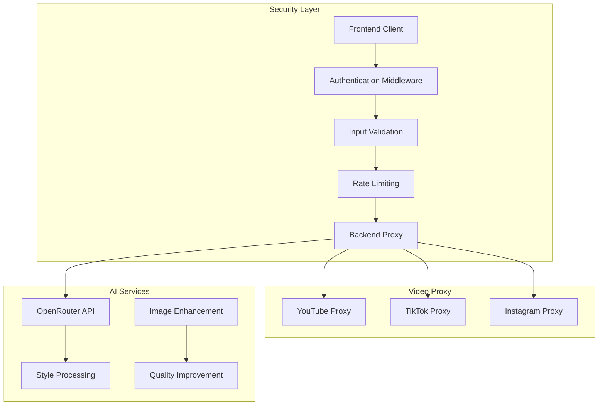
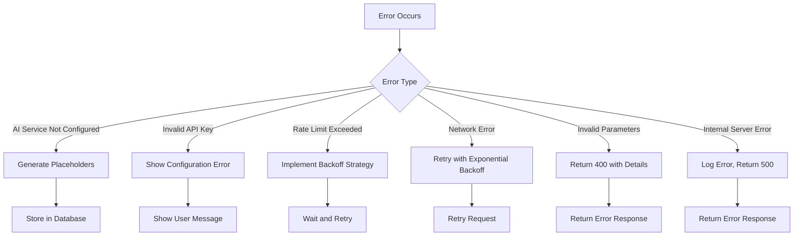
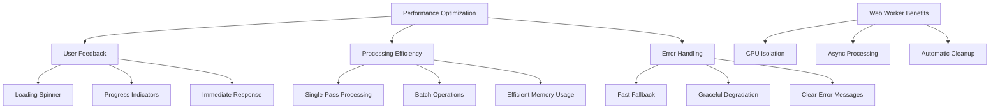
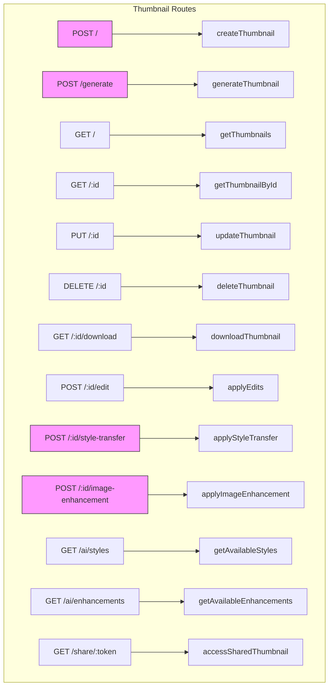

# AI Thumbnail Generation Workflow

<cite>
**Referenced Files in This Document**
- [AIToolsPage.tsx](file://pikzels-clone/client/src/components/dashboard/AIToolsPage.tsx)
- [useAIService.ts](file://pikzels-clone/client/src/hooks/useAIService.ts)
- [useAIWorker.ts](file://pikzels-clone/client/src/hooks/useAIWorker.ts)
- [ai-worker.ts](file://pikzels-clone/client/src/workers/ai-worker.ts)
- [CreateThumbnail.tsx](file://pikzels-clone/client/src/components/CreateThumbnail.tsx)
- [ai.service.ts](file://pikzels-clone/src/modules/thumbnail/ai.service.ts)
- [image-processing.service.ts](file://pikzels-clone/src/modules/thumbnail/image-processing.service.ts)
- [ai-enhancement.service.ts](file://pikzels-clone/src/modules/ai/ai-enhancement.service.ts)
- [thumbnail.controller.ts](file://pikzels-clone/src/modules/thumbnail/thumbnail.controller.ts)
- [thumbnail.service.ts](file://pikzels-clone/src/modules/thumbnail/thumbnail.service.ts)
- [thumbnail.routes.ts](file://pikzels-clone/src/modules/thumbnail/thumbnail.routes.ts)
- [video-proxy.routes.ts](file://pikzels-clone/src/modules/video-proxy/video-proxy.routes.ts)
- [video-proxy.controller.ts](file://pikzels-clone/src/modules/video-proxy/video-proxy.controller.ts)
- [video-proxy.service.ts](file://pikzels-clone/src/modules/video-proxy/video-proxy.service.ts)
- [openrouter-ai.service.ts](file://pikzels-clone/src/modules/thumbnail/openrouter-ai.service.ts)
- [thumbnail.public.routes.ts](file://pikzels-clone/src/modules/thumbnail/thumbnail.public.routes.ts)
</cite>

## Update Summary
**Changes Made**
- Enhanced AIToolsPage component with modern drag-and-drop interface replacing click-to-upload for improved user experience
- Implemented dual prompt state architecture (generatePrompt/inpaintPrompt) for specialized AI tool workflows
- Integrated Web Worker architecture with fallback to main thread service for optimal performance
- Improved state management with better cleanup functionality and conditional initialization
- Added comprehensive error handling with try/catch blocks and console logging
- Enhanced AI service orchestration with worker.isReady conditional execution
- Added visual feedback states for drag-and-drop operations with color-coded overlays
- Implemented dual drag-and-drop areas for main image uploads and face swap source uploads

## Table of Contents
1. [Introduction](#introduction)
2. [Workflow Overview](#workflow-overview)
3. [Frontend Integration](#frontend-integration)
4. [Backend Processing Pipeline](#backend-processing-pipeline)
5. [AI Enhancement Service](#ai-enhancement-service)
6. [Image Processing Service](#image-processing-service)
7. [Web Worker Architecture](#web-worker-architecture)
8. [Security Architecture](#security-architecture)
9. [Error Handling and Fallback Mechanisms](#error-handling-and-fallback-mechanisms)
10. [Performance Optimization](#performance-optimization)
11. [API Endpoints](#api-endpoints)
12. [Configuration and Environment](#configuration-and-environment)

## Introduction

The AI Thumbnail Generation Workflow is a comprehensive system that transforms user input into AI-enhanced thumbnails through a secure, coordinated process between frontend and backend components. This document details the end-to-end workflow from video URL input to final AI-enhanced thumbnail output, focusing on the integration between the CreateThumbnail component and backend services. The system leverages both AIEnhancementService for intelligent style application and ImageProcessingService for comprehensive thumbnail creation, providing a robust solution for generating high-quality thumbnails with enhanced security through the BFF (Backend-for-Frontend) pattern.

**Section sources**
- [CreateThumbnail.tsx](file://pikzels-clone/client/src/components/CreateThumbnail.tsx#L1-L205)
- [ai.service.ts](file://pikzels-clone/src/modules/thumbnail/ai.service.ts#L1-L156)

## Workflow Overview

The AI Thumbnail Generation Workflow follows a structured process that begins with user input and concludes with AI-enhanced thumbnail output. The workflow is designed to be resilient, with fallback mechanisms in place when AI processing is unavailable. The system coordinates asynchronous processing across multiple services to deliver thumbnails efficiently while providing appropriate user feedback throughout the generation process.



**Diagram sources**
- [CreateThumbnail.tsx](file://pikzels-clone/client/src/components/CreateThumbnail.tsx#L24-L37)
- [thumbnail.controller.ts](file://pikzels-clone/src/modules/thumbnail/thumbnail.controller.ts#L245-L450)
- [video-proxy.routes.ts](file://pikzels-clone/src/modules/video-proxy/video-proxy.routes.ts#L1-L39)

**Section sources**
- [CreateThumbnail.tsx](file://pikzels-clone/client/src/components/CreateThumbnail.tsx#L1-L205)
- [thumbnail.controller.ts](file://pikzels-clone/src/modules/thumbnail/thumbnail.controller.ts#L245-L450)

## Frontend Integration

The frontend integration is centered around the AIToolsPage component, which provides a modern, user-friendly interface for generating thumbnails with enhanced drag-and-drop functionality. The component implements comprehensive validation and state management for dual prompt states (generatePrompt/inpaintPrompt), style preferences, and project associations, then coordinates with backend services to generate the final output.

The component features a sophisticated dual-state architecture with separate prompts for different AI tool workflows. The generatePrompt state manages text-to-image generation requests, while inpaintPrompt handles intelligent image editing through AI-powered inpainting. The component implements comprehensive validation and state management for the prompt, style, and project selection. When the user submits the form, the handleSubmit function is triggered, which calls the onCreate callback with the collected parameters. During processing, the component displays a loading spinner to provide visual feedback to the user and prevents double submissions through the isGenerating state flag.

**Updated** Enhanced with modern drag-and-drop interface featuring visual feedback states and dual upload areas



**Diagram sources**
- [AIToolsPage.tsx](file://pikzels-clone/client/src/components/dashboard/AIToolsPage.tsx#L204-L231)
- [useAIWorker.ts](file://pikzels-clone/client/src/hooks/useAIWorker.ts#L113-L159)
- [thumbnail.controller.ts](file://pikzels-clone/src/modules/thumbnail/thumbnail.controller.ts#L245-L450)

**Section sources**
- [AIToolsPage.tsx](file://pikzels-clone/client/src/components/dashboard/AIToolsPage.tsx#L1-L948)
- [useAIService.ts](file://pikzels-clone/client/src/hooks/useAIService.ts#L1-L191)

## Backend Processing Pipeline

The backend processing pipeline is orchestrated through the thumbnail.controller.ts file, which handles the generation request and coordinates between various services. The pipeline begins with authentication and validation, followed by AI thumbnail generation or fallback to placeholder images, and concludes with database storage and response preparation.

The generateThumbnail controller method first validates the user's authentication status and required parameters. It then checks if the AI service is properly configured before attempting to generate thumbnails through the OpenRouter API. If the AI service fails or is not configured, the system automatically falls back to generating placeholder images, ensuring that users can always generate thumbnails regardless of AI service availability.



**Diagram sources**
- [thumbnail.controller.ts](file://pikzels-clone/src/modules/thumbnail/thumbnail.controller.ts#L245-L450)
- [ai.service.ts](file://pikzels-clone/src/modules/thumbnail/ai.service.ts#L61-L76)
- [thumbnail.service.ts](file://pikzels-clone/src/modules/thumbnail/thumbnail.service.ts#L34-L65)

**Section sources**
- [thumbnail.controller.ts](file://pikzels-clone/src/modules/thumbnail/thumbnail.controller.ts#L245-L450)
- [thumbnail.service.ts](file://pikzels-clone/src/modules/thumbnail/thumbnail.service.ts#L34-L65)

## AI Enhancement Service

The AIEnhancementService provides advanced image processing capabilities using TensorFlow.js for AI-powered style transfer and image enhancement. The service is designed to be resilient, with fallback mechanisms that use Sharp for basic image processing when TensorFlow.js is not available.

The service supports multiple style transfer options including impressionist, cubist, expressionist, surrealist, and pop-art styles. Each style applies specific tensor operations to transform the input image into the desired artistic style. The service also provides image enhancement features such as super-resolution, denoising, deblurring, color enhancement, and sharpening.



**Diagram sources**
- [ai-enhancement.service.ts](file://pikzels-clone/src/modules/ai/ai-enhancement.service.ts#L31-L666)
- [image-processing.service.ts](file://pikzels-clone/src/modules/thumbnail/image-processing.service.ts#L11-L342)

**Section sources**
- [ai-enhancement.service.ts](file://pikzels-clone/src/modules/ai/ai-enhancement.service.ts#L31-L666)

## Image Processing Service

The ImageProcessingService handles basic image manipulation operations using the Sharp library. This service is used both as a primary image processor for non-AI operations and as a fallback when AI processing is unavailable. The service provides a comprehensive set of image editing capabilities including resizing, cropping, rotation, flipping, and various filter applications.

The service processes images by creating a Sharp pipeline that applies transformations sequentially. It supports basic adjustments like brightness, contrast, and saturation, as well as more advanced operations like hue rotation, blur, and convolution filters for effects like emboss and edge detection. The service also handles the storage of processed images in the filesystem.

```mermaid
flowchart TD
A[Input Image] --> B[Resize]
B --> C[Basic Adjustments]
C --> D[Hue Rotation]
D --> E[Blur]
E --> F[Rotation]
F --> G[Flip]
G --> H[Crop]
H --> I[Filters]
I --> J[Save Output]
C --> |Brightness| C1[Modulate]
C --> |Contrast| C2[Linear]
C --> |Saturation| C3[Modulate]
I --> |Grayscale| I1[grayscale()]
I --> |Sepia| I2[tint()]
I --> |Vintage| I3[modulate + tint]
I --> |Black & White| I4[grayscale + modulate]
I --> |Invert| I5[negate()]
I --> |Emboss| I6[convolve]
I --> |Edge Detect| I7[convolve]
```

**Diagram sources**
- [image-processing.service.ts](file://pikzels-clone/src/modules/thumbnail/image-processing.service.ts#L71-L227)

**Section sources**
- [image-processing.service.ts](file://pikzels-clone/src/modules/thumbnail/image-processing.service.ts#L71-L227)

## Web Worker Architecture

The AIToolsPage component implements a sophisticated Web Worker architecture that provides optimal performance for AI image processing tasks. The system intelligently selects between Web Worker execution and main thread fallback based on browser support and performance considerations.

The Web Worker implementation uses TensorFlow.js with WASM backend for CPU-based processing, ensuring compatibility and preventing GPU contention. The worker handles background removal and image enhancement tasks asynchronously, keeping the main UI responsive. The architecture includes comprehensive error handling, timeout management, and automatic cleanup of pending tasks.



**Diagram sources**
- [AIToolsPage.tsx](file://pikzels-clone/client/src/components/dashboard/AIToolsPage.tsx#L69-L95)
- [useAIWorker.ts](file://pikzels-clone/client/src/hooks/useAIWorker.ts#L21-L167)
- [ai-worker.ts](file://pikzels-clone/client/src/workers/ai-worker.ts#L19-L41)

**Section sources**
- [AIToolsPage.tsx](file://pikzels-clone/client/src/components/dashboard/AIToolsPage.tsx#L69-L95)
- [useAIWorker.ts](file://pikzels-clone/client/src/hooks/useAIWorker.ts#L21-L167)
- [ai-worker.ts](file://pikzels-clone/client/src/workers/ai-worker.ts#L19-L41)

## Security Architecture

The system implements a comprehensive security architecture through the BFF (Backend-for-Frontend) pattern, which provides an additional layer of protection by routing sensitive operations through backend endpoints rather than exposing API keys directly to the client. This approach prevents credential exposure and provides centralized access control.

The security architecture includes several key components:
- **Backend Proxy Endpoints**: Dedicated endpoints for video processing that handle external API calls
- **Authentication Middleware**: Ensures all operations require valid user authentication
- **Input Validation**: Comprehensive validation and sanitization of all user inputs
- **Rate Limiting**: Protection against abuse through request throttling
- **CORS Protection**: Proper handling of cross-origin requests for video platforms



**Diagram sources**
- [video-proxy.routes.ts](file://pikzels-clone/src/modules/video-proxy/video-proxy.routes.ts#L1-L39)
- [video-proxy.controller.ts](file://pikzels-clone/src/modules/video-proxy/video-proxy.controller.ts#L178-L228)

**Section sources**
- [video-proxy.routes.ts](file://pikzels-clone/src/modules/video-proxy/video-proxy.routes.ts#L1-L39)
- [video-proxy.controller.ts](file://pikzels-clone/src/modules/video-proxy/video-proxy.controller.ts#L178-L228)

## Error Handling and Fallback Mechanisms

The system implements comprehensive error handling and fallback mechanisms to ensure reliability and maintain user experience even when AI processing is unavailable. The error handling strategy is multi-layered, addressing issues at the API, service, and user interface levels.

When the AI service is not configured or encounters errors, the system automatically falls back to generating placeholder images using the placehold.co service. This ensures that users can always generate thumbnails regardless of AI service availability. The system also handles specific error cases from the OpenRouter API, providing clear error messages for unauthorized access, invalid requests, rate limiting, and service unavailability.



**Diagram sources**
- [ai.service.ts](file://pikzels-clone/src/modules/thumbnail/ai.service.ts#L33-L44)
- [thumbnail.controller.ts](file://pikzels-clone/src/modules/thumbnail/thumbnail.controller.ts#L348-L445)

**Section sources**
- [ai.service.ts](file://pikzels-clone/src/modules/thumbnail/ai.service.ts#L33-L44)
- [thumbnail.controller.ts](file://pikzels-clone/src/modules/thumbnail/thumbnail.controller.ts#L348-L445)

## Performance Optimization

The system incorporates several performance optimization strategies to reduce processing latency and improve user feedback during thumbnail generation. These optimizations include efficient error handling, caching mechanisms, and asynchronous processing coordination.

The frontend provides immediate visual feedback through a loading spinner during the generation process, improving perceived performance. The backend implements efficient error handling that minimizes processing time when the AI service is unavailable by quickly falling back to placeholder generation. The system also uses efficient image processing pipelines that apply multiple transformations in a single pass through the Sharp library.

The Web Worker architecture significantly improves performance by offloading heavy AI processing tasks from the main thread. The worker implementation uses dynamic imports for TensorFlow.js modules, lazy loading of segmentation models, and efficient canvas-based image processing with OffscreenCanvas for better memory management.



**Diagram sources**
- [AIToolsPage.tsx](file://pikzels-clone/client/src/components/dashboard/AIToolsPage.tsx#L170-L196)
- [useAIWorker.ts](file://pikzels-clone/client/src/hooks/useAIWorker.ts#L96-L111)
- [image-processing.service.ts](file://pikzels-clone/src/modules/thumbnail/image-processing.service.ts#L71-L227)
- [thumbnail.controller.ts](file://pikzels-clone/src/modules/thumbnail/thumbnail.controller.ts#L348-L445)

**Section sources**
- [AIToolsPage.tsx](file://pikzels-clone/client/src/components/dashboard/AIToolsPage.tsx#L170-L196)
- [useAIWorker.ts](file://pikzels-clone/client/src/hooks/useAIWorker.ts#L96-L111)
- [image-processing.service.ts](file://pikzels-clone/src/modules/thumbnail/image-processing.service.ts#L71-L227)

## API Endpoints

The AI Thumbnail Generation system exposes a comprehensive set of RESTful API endpoints through the thumbnail.routes.ts file. These endpoints provide the interface between the frontend and backend services, enabling thumbnail creation, retrieval, updating, and deletion operations.

The primary endpoint for AI thumbnail generation is the POST /api/thumbnails/generate route, which accepts a prompt, style, and project ID to generate AI-enhanced thumbnails. The system also provides endpoints for applying style transfer and image enhancements to existing thumbnails, allowing users to further customize their generated thumbnails.



**Diagram sources**
- [thumbnail.routes.ts](file://pikzels-clone/src/modules/thumbnail/thumbnail.routes.ts#L1-L58)
- [thumbnail.controller.ts](file://pikzels-clone/src/modules/thumbnail/thumbnail.controller.ts#L79-L800)
- [thumbnail.public.routes.ts](file://pikzels-clone/src/modules/thumbnail/thumbnail.public.routes.ts#L1-L10)

**Section sources**
- [thumbnail.routes.ts](file://pikzels-clone/src/modules/thumbnail/thumbnail.routes.ts#L1-L58)
- [thumbnail.controller.ts](file://pikzels-clone/src/modules/thumbnail/thumbnail.controller.ts#L79-L800)
- [thumbnail.public.routes.ts](file://pikzels-clone/src/modules/thumbnail/thumbnail.public.routes.ts#L1-L10)

## Configuration and Environment

The system's behavior is controlled through environment variables, with the OPENROUTER_API_KEY being the primary configuration for enabling AI thumbnail generation. When this key is not configured, the system automatically falls back to generating placeholder images, ensuring that the application remains functional in development or testing environments without requiring an OpenRouter API key.

The configuration approach follows the twelve-factor app methodology, keeping configuration separate from code and allowing different configurations for different environments. This enables seamless deployment across development, staging, and production environments with appropriate API keys and settings for each.

**Section sources**
- [ai.service.ts](file://pikzels-clone/src/modules/thumbnail/ai.service.ts#L10-L19)
- [thumbnail.controller.ts](file://pikzels-clone/src/modules/thumbnail/thumbnail.controller.ts#L61-L76)
- [openrouter-ai.service.ts](file://pikzels-clone/src/modules/thumbnail/openrouter-ai.service.ts#L27-L523)

## AI Style Presets

The system now supports seven distinct AI style presets that provide different aesthetic approaches for thumbnail generation. These styles are applied through enhanced prompt engineering to produce consistent visual results across all generated thumbnails.

### Available Style Presets

The system supports the following style presets:

1. **Bold** - Eye-catching design with high contrast and vibrant colors
2. **Minimalist** - Clean, simple design with lots of white space
3. **Dramatic** - Strong lighting and high contrast with cinematic feel
4. **Cinematic** - Movie poster quality with professional photography
5. **Professional** - Corporate, clean design with business-like aesthetic
6. **Creative** - Artistic style with unique perspective and imaginative design
7. **Gaming** - Energetic, action-packed visuals with gaming aesthetic

### Style Implementation

Each style preset modifies the base prompt through the OpenRouter AI service to achieve specific visual characteristics. The styling system uses enhanced prompt engineering techniques that incorporate style-specific descriptors and composition guidelines.

**Section sources**
- [openrouter-ai.service.ts](file://pikzels-clone/src/modules/thumbnail/openrouter-ai.service.ts#L141-L162)
- [thumbnail.controller.ts](file://pikzels-clone/src/modules/thumbnail/thumbnail.controller.ts#L341-L346)

## Video Proxy Service

The video proxy service provides secure, authenticated access to social media video platforms without exposing API credentials to the client. The service supports multiple platforms including YouTube, TikTok, Instagram, Twitter/X, and Vimeo.

### Supported Platforms

The video proxy service currently supports the following platforms:

- **YouTube**: Full video streaming with thumbnail extraction
- **TikTok**: Video URL processing and stream extraction
- **Instagram**: Photo and video content processing
- **Twitter/X**: Tweet video content extraction
- **Vimeo**: Professional video hosting platform

### Platform Detection and Processing

The service automatically detects the platform from the provided URL and extracts the appropriate video ID for processing. Each platform has specific URL patterns and extraction logic to handle different URL formats and embed configurations.

**Section sources**
- [video-proxy.service.ts](file://pikzels-clone/src/modules/video-proxy/video-proxy.service.ts#L30-L141)
- [video-proxy.controller.ts](file://pikzels-clone/src/modules/video-proxy/video-proxy.controller.ts#L1-L313)

## Enhanced User Interface Features

The AIToolsPage component introduces several enhanced user interface features that improve the overall user experience:

### Modern Drag-and-Drop Interface
The component replaces traditional click-to-upload with a sophisticated drag-and-drop interface that provides visual feedback during file operations. The interface includes:
- Visual drag state indicators with color-coded borders
- Custom drag overlay with drop instructions
- File type validation and size constraints
- Real-time preview generation

**Updated** Enhanced with dual drag-and-drop areas for main image uploads and face swap source uploads

### Dual Prompt State Architecture
The component implements a dual prompt state system optimized for different AI tool workflows:
- **generatePrompt**: Specialized for text-to-image generation with descriptive text input
- **inpaintPrompt**: Focused on AI-powered image editing with precise editing instructions

### Enhanced State Management
Improved state management includes:
- Automatic cleanup of uploaded files and temporary data
- Conditional initialization based on worker availability
- Comprehensive error state tracking with user-friendly messages
- Responsive UI state updates during processing

### Visual Feedback States
The component provides comprehensive visual feedback for drag-and-drop operations:
- **Main Image Upload Area**: Blue border and overlay when dragging over
- **Face Swap Source Area**: Orange border and overlay for face swap uploads
- **Interactive Upload Previews**: Real-time image previews with remove buttons
- **Loading States**: Animated spinners and progress indicators during processing

**Section sources**
- [AIToolsPage.tsx](file://pikzels-clone/client/src/components/dashboard/AIToolsPage.tsx#L204-L259)
- [AIToolsPage.tsx](file://pikzels-clone/client/src/components/dashboard/AIToolsPage.tsx#L100-L102)
- [AIToolsPage.tsx](file://pikzels-clone/client/src/components/dashboard/AIToolsPage.tsx#L521-L522)
- [AIToolsPage.tsx](file://pikzels-clone/client/src/components/dashboard/AIToolsPage.tsx#L649-L666)
- [AIToolsPage.tsx](file://pikzels-clone/client/src/components/dashboard/AIToolsPage.tsx#L808-L832)