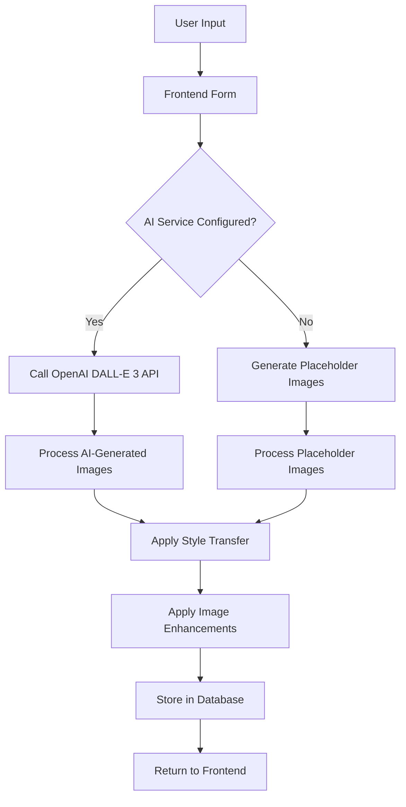
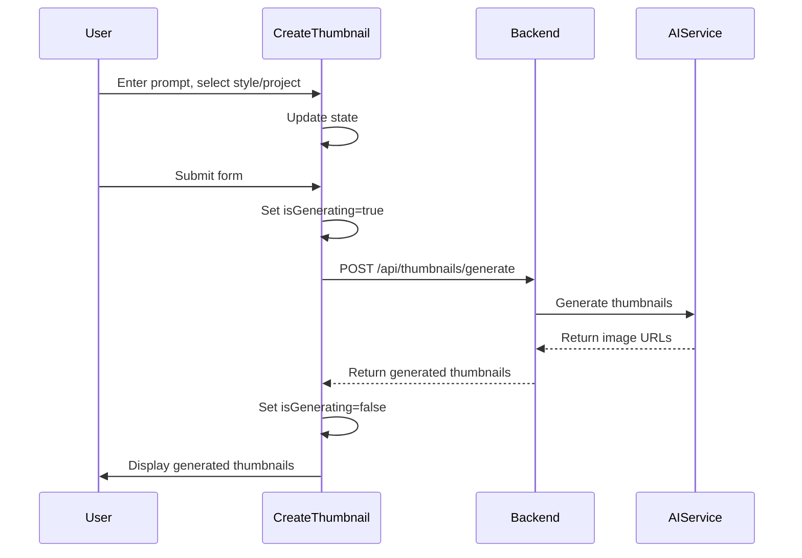
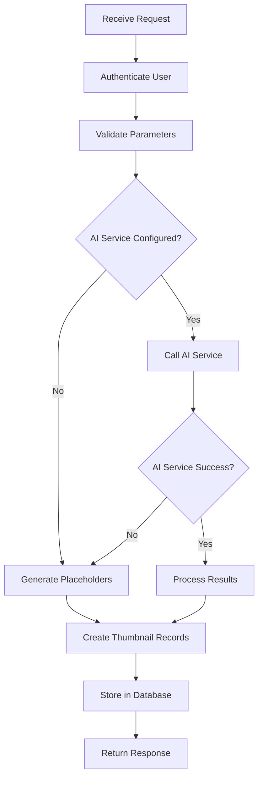
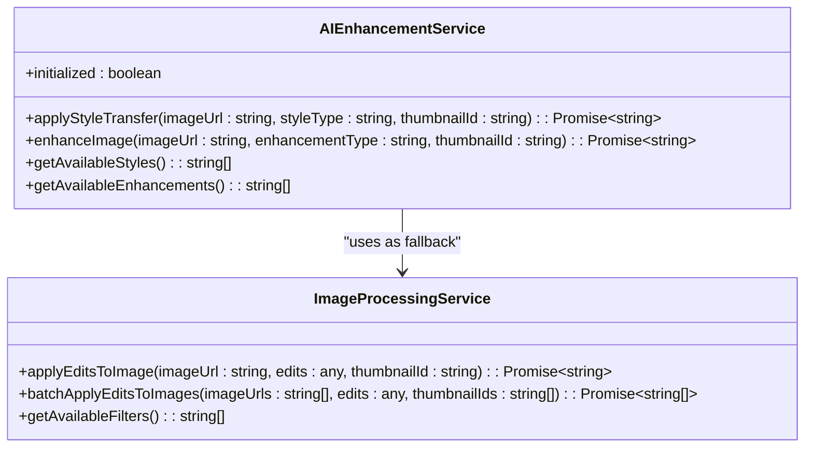
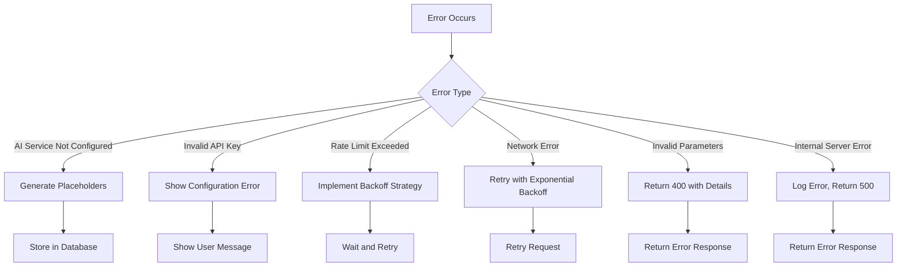
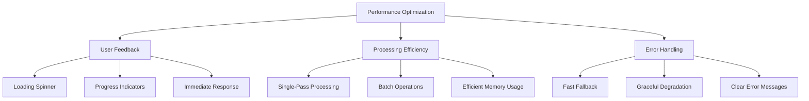
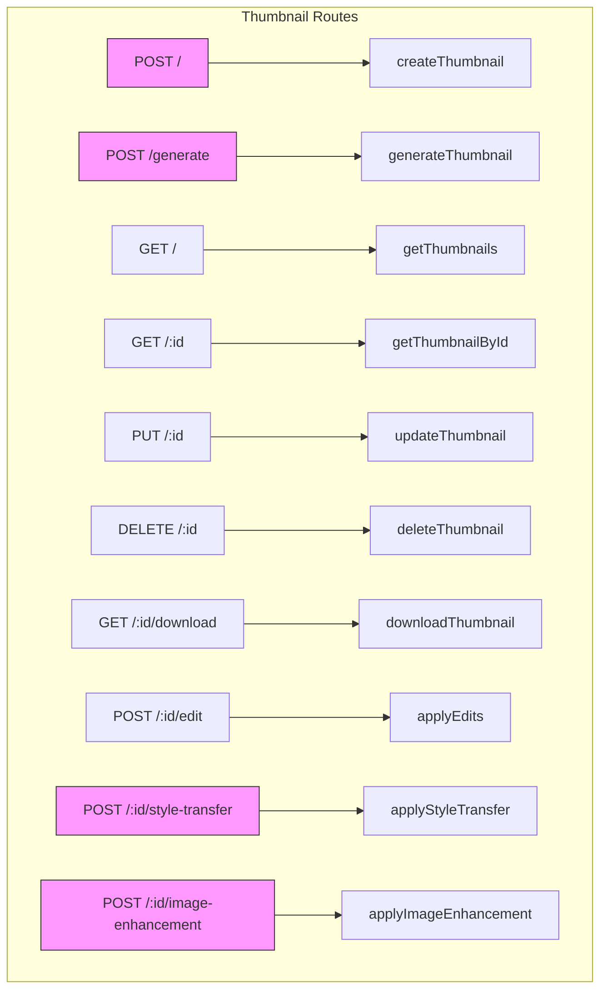

# AI Thumbnail Generation Workflow

<cite>
**Referenced Files in This Document**   
- [CreateThumbnail.tsx](file://pikzels-clone\client\src\components\CreateThumbnail.tsx)
- [ai.service.ts](file://pikzels-clone\src\modules\thumbnail\ai.service.ts)
- [image-processing.service.ts](file://pikzels-clone\src\modules\thumbnail\image-processing.service.ts)
- [ai-enhancement.service.ts](file://pikzels-clone\src\modules\ai\ai-enhancement.service.ts)
- [thumbnail.controller.ts](file://pikzels-clone\src\modules\thumbnail\thumbnail.controller.ts)
- [thumbnail.service.ts](file://pikzels-clone\src\modules\thumbnail\thumbnail.service.ts)
- [thumbnail.routes.ts](file://pikzels-clone\src\modules\thumbnail\thumbnail.routes.ts)
</cite>

## Table of Contents
1. [Introduction](#introduction)
2. [Workflow Overview](#workflow-overview)
3. [Frontend Integration](#frontend-integration)
4. [Backend Processing Pipeline](#backend-processing-pipeline)
5. [AI Enhancement Service](#ai-enhancement-service)
6. [Image Processing Service](#image-processing-service)
7. [Error Handling and Fallback Mechanisms](#error-handling-and-fallback-mechanisms)
8. [Performance Optimization](#performance-optimization)
9. [API Endpoints](#api-endpoints)
10. [Configuration and Environment](#configuration-and-environment)

## Introduction

The AI Thumbnail Generation Workflow is a comprehensive system that transforms user input into AI-enhanced thumbnails through a coordinated process between frontend and backend components. This document details the end-to-end workflow from video URL input to final AI-enhanced thumbnail output, focusing on the integration between the CreateThumbnail component and backend services. The system leverages both AIEnhancementService for intelligent style application and ImageProcessingService for comprehensive thumbnail creation, providing a robust solution for generating high-quality thumbnails.

**Section sources**
- [CreateThumbnail.tsx](file://pikzels-clone\client\src\components\CreateThumbnail.tsx#L9-L200)
- [ai.service.ts](file://pikzels-clone\src\modules\thumbnail\ai.service.ts#L1-L143)

## Workflow Overview

The AI Thumbnail Generation Workflow follows a structured process that begins with user input and concludes with AI-enhanced thumbnail output. The workflow is designed to be resilient, with fallback mechanisms in place when AI processing is unavailable. The system coordinates asynchronous processing across multiple services to deliver thumbnails efficiently while providing appropriate user feedback throughout the generation process.



**Diagram sources**
- [CreateThumbnail.tsx](file://pikzels-clone\client\src\components\CreateThumbnail.tsx#L9-L200)
- [ai.service.ts](file://pikzels-clone\src\modules\thumbnail\ai.service.ts#L27-L133)
- [thumbnail.controller.ts](file://pikzels-clone\src\modules\thumbnail\thumbnail.controller.ts#L200-L300)

**Section sources**
- [CreateThumbnail.tsx](file://pikzels-clone\client\src\components\CreateThumbnail.tsx#L9-L200)
- [ai.service.ts](file://pikzels-clone\src\modules\thumbnail\ai.service.ts#L1-L143)
- [thumbnail.controller.ts](file://pikzels-clone\src\modules\thumbnail\thumbnail.controller.ts#L200-L300)

## Frontend Integration

The frontend integration is centered around the CreateThumbnail component, which provides a user-friendly interface for generating thumbnails. The component collects user input including the thumbnail prompt, style preference, and project association, then coordinates with backend services to generate the final output.

The component implements a controlled form with state management for the prompt, style, and project selection. When the user submits the form, the handleSubmit function is triggered, which calls the onCreate callback with the collected parameters. During processing, the component displays a loading spinner to provide visual feedback to the user.



**Diagram sources**
- [CreateThumbnail.tsx](file://pikzels-clone\client\src\components\CreateThumbnail.tsx#L9-L200)
- [thumbnail.controller.ts](file://pikzels-clone\src\modules\thumbnail\thumbnail.controller.ts#L200-L300)

**Section sources**
- [CreateThumbnail.tsx](file://pikzels-clone\client\src\components\CreateThumbnail.tsx#L9-L200)

## Backend Processing Pipeline

The backend processing pipeline is orchestrated through the thumbnail.controller.ts file, which handles the generation request and coordinates between various services. The pipeline begins with authentication and validation, followed by AI thumbnail generation or fallback to placeholder images, and concludes with database storage and response preparation.

The generateThumbnail controller method first validates the user's authentication status and required parameters. It then checks if the AI service is properly configured before attempting to generate thumbnails through the OpenAI API. If the AI service fails or is not configured, the system automatically falls back to generating placeholder images, ensuring that users can always generate thumbnails regardless of AI service availability.



**Diagram sources**
- [thumbnail.controller.ts](file://pikzels-clone\src\modules\thumbnail\thumbnail.controller.ts#L200-L300)
- [ai.service.ts](file://pikzels-clone\src\modules\thumbnail\ai.service.ts#L27-L133)
- [thumbnail.service.ts](file://pikzels-clone\src\modules\thumbnail\thumbnail.service.ts#L1-L136)

**Section sources**
- [thumbnail.controller.ts](file://pikzels-clone\src\modules\thumbnail\thumbnail.controller.ts#L200-L300)
- [thumbnail.service.ts](file://pikzels-clone\src\modules\thumbnail\thumbnail.service.ts#L1-L136)

## AI Enhancement Service

The AIEnhancementService provides advanced image processing capabilities using TensorFlow.js for AI-powered style transfer and image enhancement. The service is designed to be resilient, with fallback mechanisms that use Sharp for basic image processing when TensorFlow.js is not available.

The service supports multiple style transfer options including impressionist, cubist, expressionist, surrealist, and pop-art styles. Each style applies specific tensor operations to transform the input image into the desired artistic style. The service also provides image enhancement features such as super-resolution, denoising, deblurring, color enhancement, and sharpening.



**Diagram sources**
- [ai-enhancement.service.ts](file://pikzels-clone\src\modules\ai\ai-enhancement.service.ts#L30-L664)
- [image-processing.service.ts](file://pikzels-clone\src\modules\thumbnail\image-processing.service.ts#L10-L280)

**Section sources**
- [ai-enhancement.service.ts](file://pikzels-clone\src\modules\ai\ai-enhancement.service.ts#L30-L664)

## Image Processing Service

The ImageProcessingService handles basic image manipulation operations using the Sharp library. This service is used both as a primary image processor for non-AI operations and as a fallback when AI processing is unavailable. The service provides a comprehensive set of image editing capabilities including resizing, cropping, rotation, flipping, and various filter applications.

The service processes images by creating a Sharp pipeline that applies transformations sequentially. It supports basic adjustments like brightness, contrast, and saturation, as well as more advanced operations like hue rotation, blur, and convolution filters for effects like emboss and edge detection. The service also handles the storage of processed images in the filesystem.

```mermaid
flowchart TD
A[Input Image] --> B[Resize]
B --> C[Basic Adjustments]
C --> D[Hue Rotation]
D --> E[Blur]
E --> F[Rotation]
F --> G[Flip]
G --> H[Crop]
H --> I[Filters]
I --> J[Save Output]
C --> |Brightness| C1[Modulate]
C --> |Contrast| C2[Linear]
C --> |Saturation| C3[Modulate]
I --> |Grayscale| I1[grayscale()]
I --> |Sepia| I2[tint()]
I --> |Vintage| I3[modulate + tint]
I --> |Black & White| I4[grayscale + modulate]
I --> |Invert| I5[negate()]
I --> |Emboss| I6[convolve]
I --> |Edge Detect| I7[convolve]
```

**Diagram sources**
- [image-processing.service.ts](file://pikzels-clone\src\modules\thumbnail\image-processing.service.ts#L10-L280)

**Section sources**
- [image-processing.service.ts](file://pikzels-clone\src\modules\thumbnail\image-processing.service.ts#L10-L280)

## Error Handling and Fallback Mechanisms

The system implements comprehensive error handling and fallback mechanisms to ensure reliability and maintain user experience even when AI processing is unavailable. The error handling strategy is multi-layered, addressing issues at the API, service, and user interface levels.

When the AI service is not configured or encounters errors, the system automatically falls back to generating placeholder images using the placehold.co service. This ensures that users can always generate thumbnails regardless of AI service availability. The system also handles specific error cases from the OpenAI API, providing clear error messages for unauthorized access, invalid requests, rate limiting, and service unavailability.



**Diagram sources**
- [ai.service.ts](file://pikzels-clone\src\modules\thumbnail\ai.service.ts#L27-L133)
- [thumbnail.controller.ts](file://pikzels-clone\src\modules\thumbnail\thumbnail.controller.ts#L200-L300)

**Section sources**
- [ai.service.ts](file://pikzels-clone\src\modules\thumbnail\ai.service.ts#L27-L133)
- [thumbnail.controller.ts](file://pikzels-clone\src\modules\thumbnail\thumbnail.controller.ts#L200-L300)

## Performance Optimization

The system incorporates several performance optimization strategies to reduce processing latency and improve user feedback during thumbnail generation. These optimizations include efficient error handling, caching mechanisms, and asynchronous processing coordination.

The frontend provides immediate visual feedback through a loading spinner during the generation process, improving perceived performance. The backend implements efficient error handling that minimizes processing time when the AI service is unavailable by quickly falling back to placeholder generation. The system also uses efficient image processing pipelines that apply multiple transformations in a single pass through the Sharp library.



**Diagram sources**
- [CreateThumbnail.tsx](file://pikzels-clone\client\src\components\CreateThumbnail.tsx#L9-L200)
- [image-processing.service.ts](file://pikzels-clone\src\modules\thumbnail\image-processing.service.ts#L10-L280)
- [ai.service.ts](file://pikzels-clone\src\modules\thumbnail\ai.service.ts#L27-L133)

**Section sources**
- [CreateThumbnail.tsx](file://pikzels-clone\client\src\components\CreateThumbnail.tsx#L9-L200)
- [image-processing.service.ts](file://pikzels-clone\src\modules\thumbnail\image-processing.service.ts#L10-L280)

## API Endpoints

The AI Thumbnail Generation system exposes a set of RESTful API endpoints through the thumbnail.routes.ts file. These endpoints provide the interface between the frontend and backend services, enabling thumbnail creation, retrieval, updating, and deletion operations.

The primary endpoint for AI thumbnail generation is the POST /api/thumbnails/generate route, which accepts a prompt, style, and project ID to generate AI-enhanced thumbnails. The system also provides endpoints for applying style transfer and image enhancements to existing thumbnails, allowing users to further customize their generated thumbnails.



**Diagram sources**
- [thumbnail.routes.ts](file://pikzels-clone\src\modules\thumbnail\thumbnail.routes.ts#L1-L55)
- [thumbnail.controller.ts](file://pikzels-clone\src\modules\thumbnail\thumbnail.controller.ts#L1-L734)

**Section sources**
- [thumbnail.routes.ts](file://pikzels-clone\src\modules\thumbnail\thumbnail.routes.ts#L1-L55)
- [thumbnail.controller.ts](file://pikzels-clone\src\modules\thumbnail\thumbnail.controller.ts#L1-L734)

## Configuration and Environment

The system's behavior is controlled through environment variables, with the OPENAI_API_KEY being the primary configuration for enabling AI thumbnail generation. When this key is not configured, the system automatically falls back to generating placeholder images, ensuring that the application remains functional in development or testing environments without requiring an OpenAI API key.

The configuration approach follows the twelve-factor app methodology, keeping configuration separate from code and allowing different configurations for different environments. This enables seamless deployment across development, staging, and production environments with appropriate API keys and settings for each.

**Section sources**
- [ai.service.ts](file://pikzels-clone\src\modules\thumbnail\ai.service.ts#L1-L143)
- [thumbnail.controller.ts](file://pikzels-clone\src\modules\thumbnail\thumbnail.controller.ts#L200-L300)