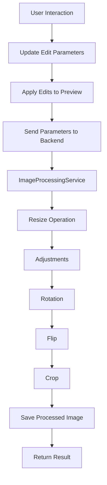
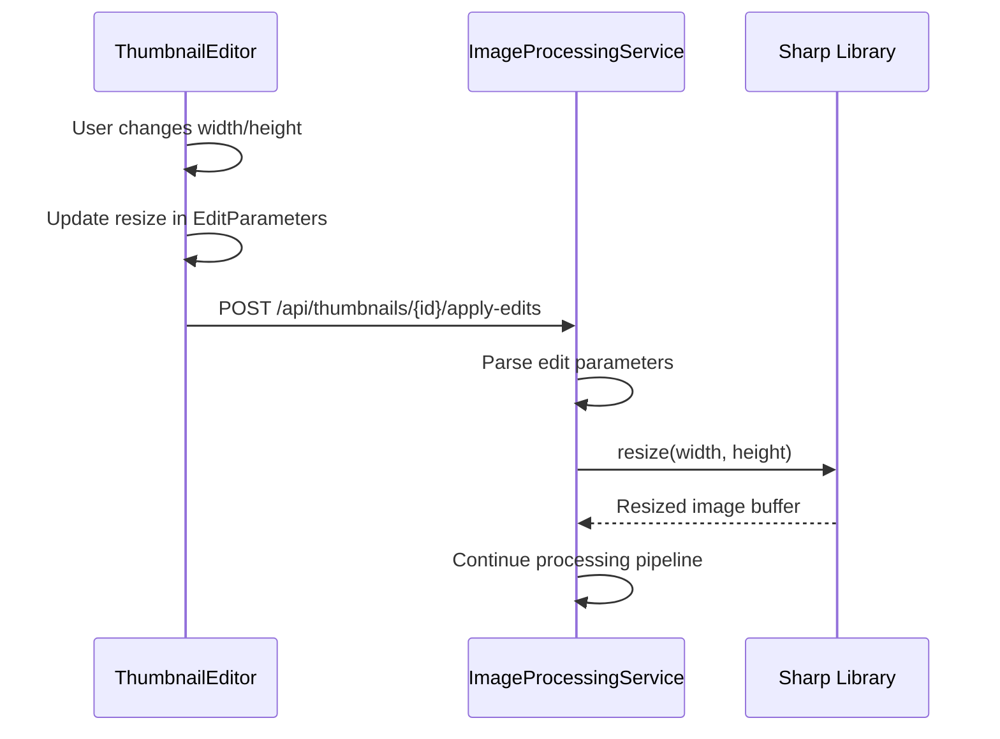
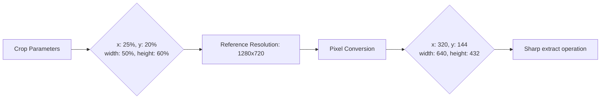
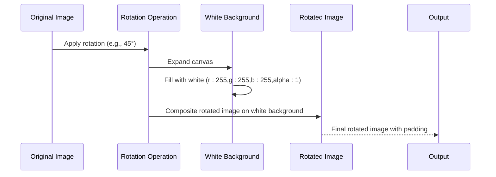
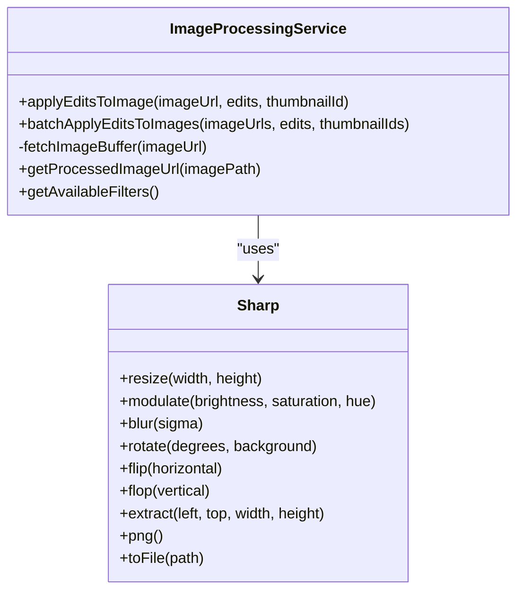
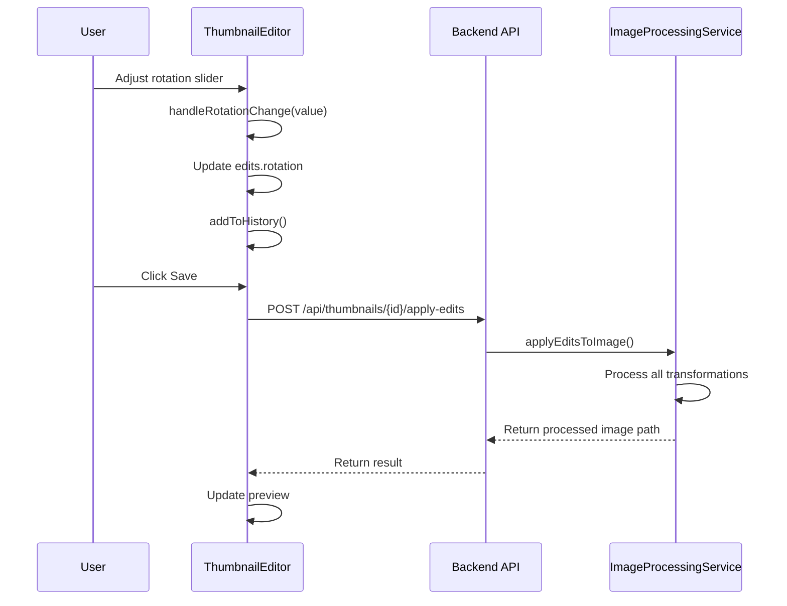

# Basic Image Transformations

<cite>
**Referenced Files in This Document**  
- [image-processing.service.ts](file://pikzels-clone\src\modules\thumbnail\image-processing.service.ts)
- [ThumbnailEditor.tsx](file://pikzels-clone\client\src\components\ThumbnailEditor.tsx)
</cite>

## Table of Contents
1. [Introduction](#introduction)
2. [Core Transformation Operations](#core-transformation-operations)
3. [Resize Implementation](#resize-implementation)
4. [Crop with Percentage-Based Coordinates](#crop-with-percentage-based-coordinates)
5. [Rotation with Background Padding](#rotation-with-background-padding)
6. [Flip Operations](#flip-operations)
7. [Transformation Chaining in Image Processing](#transformation-chaining-in-image-processing)
8. [UI Integration and Parameter Flow](#ui-integration-and-parameter-flow)
9. [Common Issues and Troubleshooting](#common-issues-and-troubleshooting)
10. [Performance Considerations](#performance-considerations)

## Introduction

The Basic Image Transformations feature provides users with essential editing capabilities including resize, crop, rotation, and flip operations. These transformations are implemented through a combination of frontend UI components and backend image processing logic using the Sharp library. The system follows a parameter-driven approach where edit operations are defined as JSON parameters in the frontend, transmitted to the backend, and applied sequentially to produce the final transformed image.

The architecture separates concerns between the user interface (ThumbnailEditor) which captures user interactions, and the image processing service which executes the actual transformations. This document details the implementation of each transformation operation, the coordinate system used for cropping, aspect ratio handling during resize, rotation with white background padding, and the separate horizontal/vertical flip logic.

**Section sources**
- [image-processing.service.ts](file://pikzels-clone\src\modules\thumbnail\image-processing.service.ts#L1-L50)
- [ThumbnailEditor.tsx](file://pikzels-clone\client\src\components\ThumbnailEditor.tsx#L1-L100)

## Core Transformation Operations

The image transformation system implements four fundamental operations: resize, crop, rotation, and flip. These operations are exposed through the ThumbnailEditor UI component and processed by the ImageProcessingService backend service. Each transformation is applied as a discrete step in a processing pipeline, allowing for combinations of multiple operations on a single image.

The transformations follow a specific execution order: resize → adjustments (brightness, contrast, etc.) → rotation → flip → crop. This order ensures predictable results, particularly when combining operations that affect image dimensions. All transformation parameters are stored in the EditParameters interface, which maintains the state of all applied edits for a given thumbnail.



**Diagram sources**
- [image-processing.service.ts](file://pikzels-clone\src\modules\thumbnail\image-processing.service.ts#L18-L174)
- [ThumbnailEditor.tsx](file://pikzels-clone\client\src\components\ThumbnailEditor.tsx#L80-L150)

**Section sources**
- [image-processing.service.ts](file://pikzels-clone\src\modules\thumbnail\image-processing.service.ts#L1-L100)
- [ThumbnailEditor.tsx](file://pikzels-clone\client\src\components\ThumbnailEditor.tsx#L80-L200)

## Resize Implementation

The resize operation allows users to modify image dimensions while maintaining control over aspect ratio. In the ThumbnailEditor component, resize parameters are managed through width and height inputs that update the resize property in the EditParameters state object. The initial dimensions are set to 1280x720 pixels, which serves as the reference resolution for other transformations.

When a resize operation is requested, the ImageProcessingService applies the Sharp library's resize method with the specified dimensions. The implementation does not enforce aspect ratio preservation by default, allowing users to create non-proportional scaling. However, the UI could be extended to include aspect ratio locking functionality by calculating dependent dimensions when one dimension is changed.

The resize operation is applied early in the processing pipeline, before other transformations, to optimize performance. Resizing early reduces the pixel count for subsequent operations like rotation and filtering, improving processing efficiency for large images.



**Diagram sources**
- [image-processing.service.ts](file://pikzels-clone\src\modules\thumbnail\image-processing.service.ts#L45-L55)
- [ThumbnailEditor.tsx](file://pikzels-clone\client\src\components\ThumbnailEditor.tsx#L280-L295)

**Section sources**
- [image-processing.service.ts](file://pikzels-clone\src\modules\thumbnail\image-processing.service.ts#L45-L60)
- [ThumbnailEditor.tsx](file://pikzels-clone\client\src\components\ThumbnailEditor.tsx#L280-L300)

## Crop with Percentage-Based Coordinates

The crop operation uses a percentage-based coordinate system relative to a 1280x720 base image reference. This approach ensures consistent cropping behavior across images of different resolutions by normalizing coordinates to a common reference frame. The crop parameters include x, y, width, and height values, all expressed as percentages of the reference dimensions.

In the implementation, the percentage values are converted to pixel coordinates by multiplying with the reference dimensions (1280 for width, 720 for height). The conversion occurs in the ImageProcessingService's applyEditsToImage method, where the percentage values from the EditParameters are transformed into absolute pixel values for the Sharp library's extract operation.

This percentage-based system provides several advantages: it maintains consistent crop behavior regardless of source image resolution, simplifies UI implementation by using normalized values, and enables responsive design where crop regions can be defined proportionally rather than absolutely.



**Diagram sources**
- [image-processing.service.ts](file://pikzels-clone\src\modules\thumbnail\image-processing.service.ts#L130-L150)
- [ThumbnailEditor.tsx](file://pikzels-clone\client\src\components\ThumbnailEditor.tsx#L100-L120)

**Section sources**
- [image-processing.service.ts](file://pikzels-clone\src\modules\thumbnail\image-processing.service.ts#L130-L155)
- [ThumbnailEditor.tsx](file://pikzels-clone\client\src\components\ThumbnailEditor.tsx#L100-L130)

## Rotation with Background Padding

The rotation operation implements image rotation with white background padding to handle the expanded canvas area created by rotating rectangular images. When an image is rotated, its bounding box increases in size, requiring additional space around the original image. The implementation uses Sharp's rotate method with a white background specification to fill this expanded area.

The rotation angle is specified in degrees (0-360) and applied as a positive clockwise rotation. The background color is set to white with full opacity using the background option { r: 255, g: 255, b: 255, alpha: 1 }. This creates a clean white border around the rotated image, which is particularly important for thumbnails that may be displayed on light backgrounds.

The rotation operation is applied after resize but before flip in the processing pipeline. This order ensures that the resize operation works with the original image dimensions, while the flip operation works with the already-rotated image. The white background padding prevents transparency issues and ensures consistent rendering across different display contexts.



**Diagram sources**
- [image-processing.service.ts](file://pikzels-clone\src\modules\thumbnail\image-processing.service.ts#L110-L120)
- [ThumbnailEditor.tsx](file://pikzels-clone\client\src\components\ThumbnailEditor.tsx#L260-L275)

**Section sources**
- [image-processing.service.ts](file://pikzels-clone\src\modules\thumbnail\image-processing.service.ts#L110-L125)
- [ThumbnailEditor.tsx](file://pikzels-clone\client\src\components\ThumbnailEditor.tsx#L260-L280)

## Flip Operations

The flip operations provide separate controls for horizontal and vertical flipping using Sharp's distinct flip and flop methods. The implementation supports three states: no flip, horizontal flip only, vertical flip only, and both horizontal and vertical flip (equivalent to 180° rotation).

In the ThumbnailEditor component, flip operations are triggered by dedicated buttons that toggle the flipHorizontal and flipVertical boolean flags in the EditParameters state. When a flip operation is requested, the corresponding flag is inverted and the changes are added to the edit history.

The ImageProcessingService translates these boolean flags into Sharp operations: flip(true) for horizontal flipping and flop(true) for vertical flipping. When both flags are true, both operations are applied sequentially. This separation allows for independent control of horizontal and vertical mirroring, which is essential for creating specific visual effects in thumbnail design.

```mermaid
flowchart TD
A[Flip Parameters] --> B{flipHorizontal: true<br>flipVertical: false}
B --> C[Apply flip(true)]
A --> D{flipHorizontal: false<br>flipVertical: true}
D --> E[Apply flop(true)]
A --> F{flipHorizontal: true<br>flipVertical: true}
F --> G[Apply flip(true) + flop(true)]
A --> H{flipHorizontal: false<br>flipVertical: false}
H --> I[No flip operation]
```

**Diagram sources**
- [image-processing.service.ts](file://pikzels-clone\src\modules\thumbnail\image-processing.service.ts#L100-L110)
- [ThumbnailEditor.tsx](file://pikzels-clone\client\src\components\ThumbnailEditor.tsx#L245-L260)

**Section sources**
- [image-processing.service.ts](file://pikzels-clone\src\modules\thumbnail\image-processing.service.ts#L100-L125)
- [ThumbnailEditor.tsx](file://pikzels-clone\client\src\components\ThumbnailEditor.tsx#L245-L280)

## Transformation Chaining in Image Processing

The ImageProcessingService implements a sequential chaining of Sharp operations where transformations are applied in a specific order to ensure predictable results. The service constructs a processing pipeline by chaining Sharp methods based on the provided edit parameters, with each transformation building upon the result of the previous operation.

The chaining follows the order: resize → adjustments → rotation → flip → crop. This sequence optimizes performance by reducing image dimensions early (resize) and applying dimension-altering operations (rotation) before the final cropping. The service maintains a processedImage variable that is progressively modified by each transformation step.

Error handling is implemented at the service level to catch and log any issues during processing, ensuring that failures in one transformation do not compromise the entire pipeline. The final processed image is saved to the filesystem with a unique filename incorporating the thumbnail ID and timestamp.



**Diagram sources**
- [image-processing.service.ts](file://pikzels-clone\src\modules\thumbnail\image-processing.service.ts#L18-L174)
- [ThumbnailEditor.tsx](file://pikzels-clone\client\src\components\ThumbnailEditor.tsx#L300-L350)

**Section sources**
- [image-processing.service.ts](file://pikzels-clone\src\modules\thumbnail\image-processing.service.ts#L18-L174)
- [ThumbnailEditor.tsx](file://pikzels-clone\client\src\components\ThumbnailEditor.tsx#L300-L350)

## UI Integration and Parameter Flow

The transformation operations are integrated through the ThumbnailEditor UI component, which captures user interactions and translates them into edit parameters. The component maintains state for all transformation operations in the edits object, which follows the EditParameters interface structure.

User interactions trigger specific handler functions (handleResizeChange, handleRotationChange, handleFlip, etc.) that update the corresponding properties in the edits state. Each state update is accompanied by a call to addToHistory, enabling undo/redo functionality. When the user saves their changes, the complete edits object is passed to the onSave callback, which typically sends it to the backend API.

The parameter flow follows a clear path from UI interaction to backend processing: user action → state update → API request → ImageProcessingService → Sharp operations → saved image. This unidirectional data flow ensures predictable behavior and simplifies debugging of transformation issues.



**Diagram sources**
- [image-processing.service.ts](file://pikzels-clone\src\modules\thumbnail\image-processing.service.ts#L18-L174)
- [ThumbnailEditor.tsx](file://pikzels-clone\client\src\components\ThumbnailEditor.tsx#L80-L350)

**Section sources**
- [image-processing.service.ts](file://pikzels-clone\src\modules\thumbnail\image-processing.service.ts#L18-L174)
- [ThumbnailEditor.tsx](file://pikzels-clone\client\src\components\ThumbnailEditor.tsx#L80-L350)

## Common Issues and Troubleshooting

Several common issues can arise when applying image transformations, particularly when combining multiple operations. Image distortion during resize occurs when users set non-proportional width and height values, stretching the image content. This can be mitigated by implementing aspect ratio locking in the UI or providing visual warnings when disproportionate scaling is applied.

Canvas overflow during rotation happens when the rotated image extends beyond the original canvas boundaries. The current implementation addresses this by using white background padding, but users may prefer transparent backgrounds or automatic canvas resizing. For transparent backgrounds, the background option would need to be modified to include alpha: 0.

Other potential issues include performance degradation with large images, loss of quality from multiple processing steps, and unexpected behavior when combining transformations. These can be addressed through optimization techniques such as processing resize operations first, using appropriate image formats, and validating parameter combinations before application.

**Section sources**
- [image-processing.service.ts](file://pikzels-clone\src\modules\thumbnail\image-processing.service.ts#L18-L174)
- [ThumbnailEditor.tsx](file://pikzels-clone\client\src\components\ThumbnailEditor.tsx#L80-L350)

## Performance Considerations

Handling large images efficiently requires careful consideration of the transformation pipeline order and resource management. The current implementation optimizes performance by applying the resize operation early in the processing chain, reducing the pixel count for subsequent operations like rotation, filtering, and cropping.

For very large images, additional optimizations could include: implementing streaming processing to reduce memory usage, using worker threads to prevent UI blocking, applying transformations at lower resolutions during preview, and caching intermediate results. The service should also implement proper error handling and timeout mechanisms to prevent server overload from extremely large image processing requests.

Memory management is particularly important when processing multiple images in batch operations. The current batchApplyEditsToImages method processes images sequentially, but could be enhanced with concurrency controls to limit the number of simultaneous operations and prevent resource exhaustion.

**Section sources**
- [image-processing.service.ts](file://pikzels-clone\src\modules\thumbnail\image-processing.service.ts#L18-L174)
- [ThumbnailEditor.tsx](file://pikzels-clone\client\src\components\ThumbnailEditor.tsx#L80-L350)