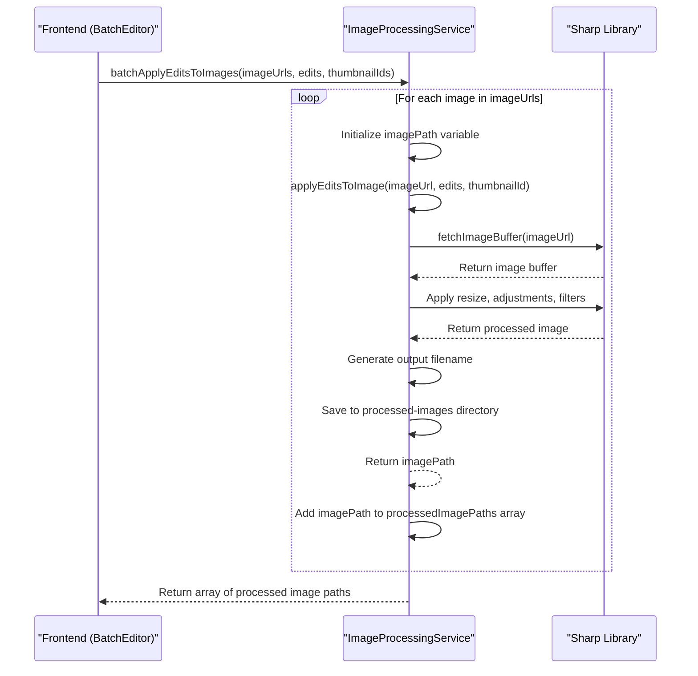
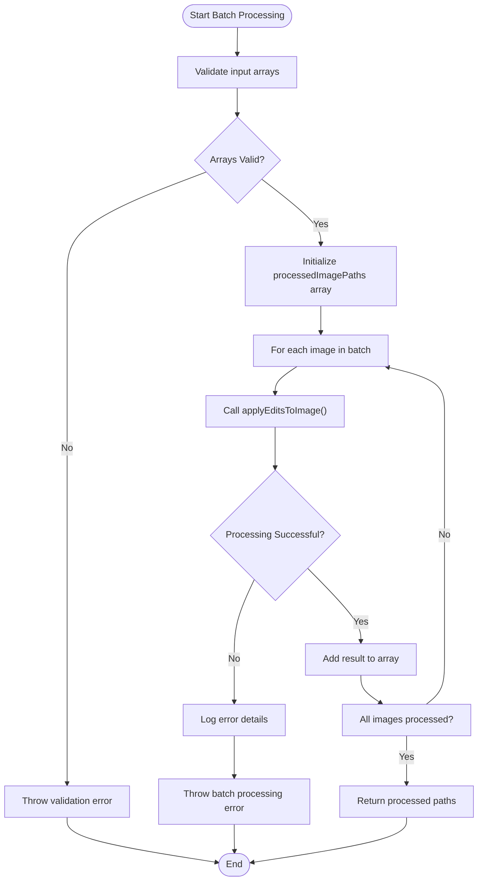

# Batch Image Processing

<cite>
**Referenced Files in This Document**  
- [image-processing.service.ts](file://pikzels-clone\src\modules\thumbnail\image-processing.service.ts)
- [BatchEditor.tsx](file://pikzels-clone\client\src\components\BatchEditor.tsx)
- [batch-editing.test.ts](file://pikzels-clone\src\modules\thumbnail\__tests__\batch-editing.test.ts)
</cite>

## Table of Contents
1. [Introduction](#introduction)
2. [Core Processing Workflow](#core-processing-workflow)
3. [Input Parameters](#input-parameters)
4. [Error Handling and Resource Management](#error-handling-and-resource-management)
5. [Frontend Integration](#frontend-integration)
6. [Performance Considerations](#performance-considerations)
7. [Troubleshooting Guide](#troubleshooting-guide)

## Introduction

The Batch Image Processing capability enables users to apply identical edit parameters across multiple thumbnail images simultaneously. This functionality is centered around the `batchApplyEditsToImages` method in the `ImageProcessingService` class, which orchestrates the sequential processing of image URLs using the core `applyEditsToImage` function. The system supports comprehensive image transformations including adjustments, filters, text overlays, and watermarks, with robust error handling and resource management.

**Section sources**
- [image-processing.service.ts](file://pikzels-clone\src\modules\thumbnail\image-processing.service.ts#L183-L206)
- [image-processing.service.ts](file://pikzels-clone\src\modules\thumbnail\image-processing.service.ts#L18-L174)

## Core Processing Workflow

The batch image processing follows a sequential workflow that ensures consistent application of edit parameters across all specified images. The `batchApplyEditsToImages` method iterates through each image URL in the provided array, applying the same edit configuration using the `applyEditsToImage` function.

**Diagram sources**
- [image-processing.service.ts](file://pikzels-clone\src\modules\thumbnail\image-processing.service.ts#L183-L206)

**Section sources**
- [image-processing.service.ts](file://pikzels-clone\src\modules\thumbnail\image-processing.service.ts#L183-L206)

## Input Parameters

The `batchApplyEditsToImages` method accepts three primary parameters that define the batch processing operation:

- **imageUrls**: Array of strings containing the URLs of source images to be processed
- **edits**: Object containing the edit parameters to apply uniformly across all images
- **thumbnailIds**: Array of strings used to generate unique filenames for processed images

The edit parameters object supports various image manipulation options including brightness, contrast, saturation, hue, blur, rotation, flip operations, resize dimensions, and filter applications. Each processed image is saved with a filename that incorporates the corresponding thumbnail ID and timestamp to ensure uniqueness.

**Section sources**
- [image-processing.service.ts](file://pikzels-clone\src\modules\thumbnail\image-processing.service.ts#L183-L206)

## Error Handling and Resource Management

The batch processing implementation includes comprehensive error handling to manage failures during the processing loop. The method is wrapped in a try-catch block that captures any exceptions occurring during image processing. When an error occurs, it logs the error details and throws a descriptive error message, ensuring that calling code can handle the failure appropriately.

Resource management is handled through proper file system operations and memory cleanup. The processed images are saved to a designated directory with unique filenames, and the system ensures that temporary buffers are properly managed during the processing pipeline. The implementation also includes proper cleanup of intermediate processing objects to prevent memory leaks.

**Diagram sources**
- [image-processing.service.ts](file://pikzels-clone\src\modules\thumbnail\image-processing.service.ts#L183-L206)

**Section sources**
- [image-processing.service.ts](file://pikzels-clone\src\modules\thumbnail\image-processing.service.ts#L183-L206)

## Frontend Integration

The batch processing functionality is integrated with the frontend through the `BatchEditor` component, which provides a user interface for configuring edit parameters across multiple thumbnails. The component allows users to adjust various image properties and apply them to all selected thumbnails simultaneously.

When the user saves their edits, the `BatchEditor` invokes the save callback with the configured edit parameters, which are then passed to the backend service for processing. The integration ensures that the same edit configuration is applied consistently across all selected images, providing a seamless user experience for bulk image editing operations.

**Section sources**
- [BatchEditor.tsx](file://pikzels-clone\client\src\components\BatchEditor.tsx#L54-L964)

## Performance Considerations

The current implementation processes images sequentially, which ensures predictable resource usage but may impact performance when handling large batches. Each image is processed individually, with the system waiting for one image to complete before starting the next. This approach prevents excessive memory consumption but may result in longer processing times for large batches.

Memory management is optimized by processing one image at a time and releasing resources after each operation. The system creates temporary buffers for image data but ensures they are properly cleaned up after processing. However, for very large batches, the sequential nature of processing may lead to extended execution times.

Future optimizations could include implementing parallel processing with controlled concurrency to improve throughput while maintaining memory constraints. This would involve processing multiple images simultaneously but limiting the number of concurrent operations to prevent system resource exhaustion.

**Section sources**
- [image-processing.service.ts](file://pikzels-clone\src\modules\thumbnail\image-processing.service.ts#L183-L206)

## Troubleshooting Guide

When encountering issues with batch image processing, consider the following troubleshooting strategies:

For partial batch failures, examine the error logs to identify which specific images failed processing. The sequential nature of processing means that if one image fails, subsequent images will not be processed. Check the source image URLs for accessibility and validity, and verify that the edit parameters are correctly formatted.

For timeout issues, ensure that the server configuration allows sufficient time for image processing operations. The current implementation does not have explicit timeout settings, but server-level timeouts may interrupt long-running operations. Consider implementing timeout handling or breaking large batches into smaller chunks to prevent timeout errors.

Monitor system resources during processing, as memory usage can increase with larger images or complex edit operations. If memory issues occur, consider optimizing the image processing pipeline or increasing available system resources.

**Section sources**
- [image-processing.service.ts](file://pikzels-clone\src\modules\thumbnail\image-processing.service.ts#L183-L206)
- [batch-editing.test.ts](file://pikzels-clone\src\modules\thumbnail\__tests__\batch-editing.test.ts#L1-L138)