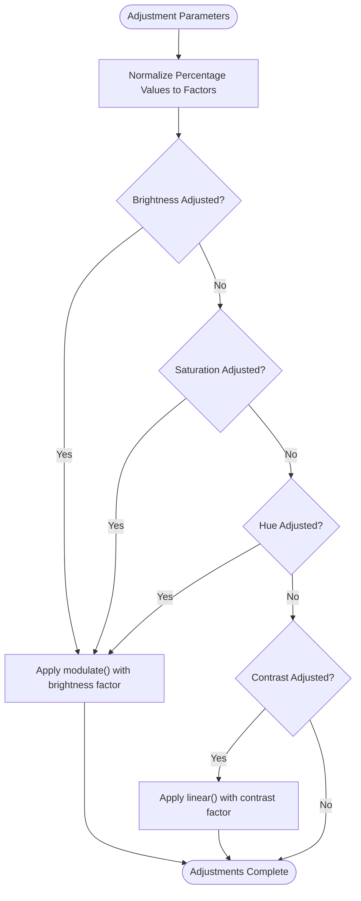
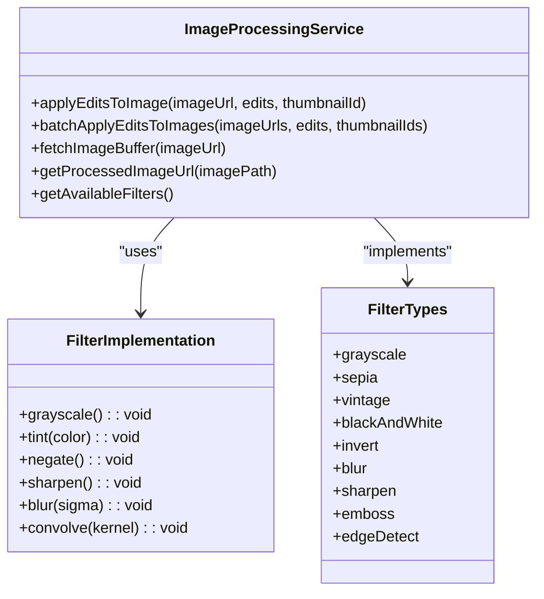
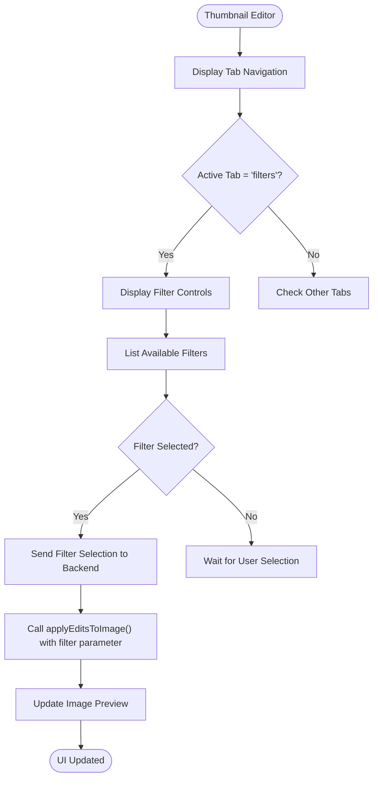
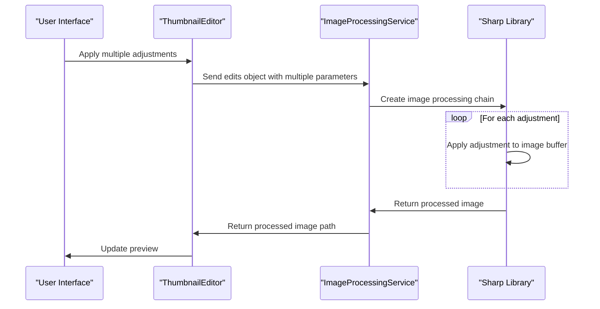

<cite>
**Referenced Files in This Document**   
- [image-processing.service.ts](file://pikzels-clone\src\modules\thumbnail\image-processing.service.ts)
- [ThumbnailEditor.tsx](file://pikzels-clone\client\src\components\ThumbnailEditor.tsx)
</cite>

# Image Adjustments and Filters

## Table of Contents
1. [Introduction](#introduction)
2. [Core Adjustment Operations](#core-adjustment-operations)
3. [Filter Implementation](#filter-implementation)
4. [UI Integration](#ui-integration)
5. [Performance Considerations](#performance-considerations)
6. [Troubleshooting Guide](#troubleshooting-guide)

## Introduction

The image adjustment and filtering system in the Thumbnail Maker application provides users with comprehensive tools to modify and enhance thumbnail images. The system is implemented through the `ImageProcessingService` class in the backend and integrated with the `ThumbnailEditor` component in the frontend. This document details the implementation of brightness, contrast, saturation, hue, blur, and predefined filter effects, along with their UI controls and performance implications.

**Section sources**
- [image-processing.service.ts](file://pikzels-clone\src\modules\thumbnail\image-processing.service.ts#L18-L174)
- [ThumbnailEditor.tsx](file://pikzels-clone\client\src\components\ThumbnailEditor.tsx#L127-L131)

## Core Adjustment Operations

The core image adjustments are implemented using the Sharp image processing library, with specific operations for brightness, contrast, saturation, hue, and blur. These adjustments are applied through the `applyEditsToImage` method in the `ImageProcessingService` class.

### Modulate and Linear Operations

The system uses Sharp's `modulate` and `linear` methods to implement color adjustments. The `modulate` method adjusts brightness, saturation, and hue, while the `linear` method handles contrast adjustments.

**Diagram sources**
- [image-processing.service.ts](file://pikzels-clone\src\modules\thumbnail\image-processing.service.ts#L50-L57)
- [image-processing.service.ts](file://pikzels-clone\src\modules\thumbnail\image-processing.service.ts#L66-L67)

The implementation normalizes percentage values to multiplicative factors:
- Brightness: percentage value divided by 100 (e.g., 150% becomes 1.5)
- Contrast: percentage value divided by 100 (e.g., 120% becomes 1.2)
- Saturation: percentage value divided by 100 (e.g., 80% becomes 0.8)

For contrast adjustments, the system uses the `linear` operation with the formula `contrast, -(128 * (contrast - 1))` to maintain proper luminance levels.

**Section sources**
- [image-processing.service.ts](file://pikzels-clone\src\modules\thumbnail\image-processing.service.ts#L45-L67)

## Filter Implementation

The application provides ten built-in filters, including six standard filters and two simulated effects using convolution kernels.

### Built-in Filters

The six built-in filters are implemented as follows:

**Diagram sources**
- [image-processing.service.ts](file://pikzels-clone\src\modules\thumbnail\image-processing.service.ts#L114-L148)
- [image-processing.service.ts](file://pikzels-clone\src\modules\thumbnail\image-processing.service.ts#L266-L280)

The filters are implemented through a switch-case structure in the `applyEditsToImage` method:

1. **Grayscale**: Uses Sharp's `grayscale()` method to convert the image to grayscale
2. **Sepia**: Applies a tint with color `#C0A080` to create a sepia tone
3. **Vintage**: Combines reduced saturation (0.8) with a warm tint (`#D0C0A0`)
4. **BlackAndWhite**: Applies grayscale with increased brightness (1.2) for a high-contrast effect
5. **Invert**: Uses Sharp's `negate()` method to invert all colors
6. **Blur**: Applies a blur effect with a sigma value of 5
7. **Sharpen**: Uses Sharp's `sharpen()` method for image sharpening

### Simulated Effects

Two additional effects are simulated using convolution kernels:

1. **Emboss**: Uses a 3x3 kernel `[-1, -1, 0, -1, 1, 1, 0, 1, 1]` to create an emboss effect
2. **EdgeDetect**: Uses a 3x3 kernel `[-1, -1, -1, -1, 8, -1, -1, -1, -1]` to detect edges in the image

These effects are implemented using Sharp's `convolve()` method, which applies the specified kernel to each pixel in the image.

**Section sources**
- [image-processing.service.ts](file://pikzels-clone\src\modules\thumbnail\image-processing.service.ts#L114-L150)

## UI Integration

The image adjustment and filter controls are integrated into the Thumbnail Editor's UI through tab-based navigation.

### Filter Controls in Thumbnail Editor

**Diagram sources**
- [ThumbnailEditor.tsx](file://pikzels-clone\client\src\components\ThumbnailEditor.tsx#L603-L605)
- [image-processing.service.ts](file://pikzels-clone\src\modules\thumbnail\image-processing.service.ts#L18-L174)

The UI implementation includes:
- A dedicated "Filters" tab in the Thumbnail Editor
- A list of available filters retrieved from `getAvailableFilters()`
- Click handlers that update the active filter selection
- Real-time preview updates when filters are applied

The `activeTab` state variable controls which editing panel is displayed, with the filters tab activated when `activeTab` equals 'filters'.

**Section sources**
- [ThumbnailEditor.tsx](file://pikzels-clone\client\src\components\ThumbnailEditor.tsx#L127-L131)
- [ThumbnailEditor.tsx](file://pikzels-clone\client\src\components\ThumbnailEditor.tsx#L1100-L1137)

## Performance Considerations

The image processing system has several performance implications that affect both server resources and user experience.

### Filter Chaining and Memory Usage

When multiple adjustments are applied to an image, they are processed sequentially, which can impact performance:

**Diagram sources**
- [image-processing.service.ts](file://pikzels-clone\src\modules\thumbnail\image-processing.service.ts#L18-L174)
- [ThumbnailEditor.tsx](file://pikzels-clone\client\src\components\ThumbnailEditor.tsx#L18-L174)

Key performance considerations:
- Each adjustment operation requires memory for the image buffer
- Complex filter combinations increase processing time
- Large images consume more memory during processing
- The order of operations can affect final results and performance

The system processes adjustments in the following order: resize, basic adjustments (brightness, contrast, saturation), hue rotation, blur, rotation, flip, crop, and finally filters. This order is optimized to minimize computational overhead.

**Section sources**
- [image-processing.service.ts](file://pikzels-clone\src\modules\thumbnail\image-processing.service.ts#L18-L174)

## Troubleshooting Guide

This section provides guidance for resolving common issues with image adjustments and filters.

### Unexpected Output with Multiple Adjustments

When combining multiple adjustments, users may encounter unexpected results. Common issues and solutions:

| Issue | Possible Cause | Solution |
|-------|---------------|----------|
| Over-saturated colors | High saturation combined with brightness | Reduce saturation or brightness values |
| Excessive blurring | Multiple blur operations | Apply blur only once with appropriate sigma value |
| Color distortion | Conflicting hue and tint operations | Avoid combining hue rotation with sepia/vintage filters |
| Performance issues | Too many sequential operations | Simplify the adjustment chain or process in batches |

### Debugging Filter Application

To troubleshoot filter issues, verify the following:
1. Ensure the filter name matches exactly with the case-sensitive values in `getAvailableFilters()`
2. Check that the backend service is properly receiving the filter parameter
3. Verify that the Sharp library is correctly installed and configured
4. Monitor server logs for any errors during image processing

The system includes error handling in the `applyEditsToImage` method, which catches exceptions and returns appropriate error messages.

**Section sources**
- [image-processing.service.ts](file://pikzels-clone\src\modules\thumbnail\image-processing.service.ts#L175-L185)
- [image-processing.service.ts](file://pikzels-clone\src\modules\thumbnail\image-processing.service.ts#L266-L280)