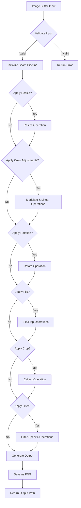
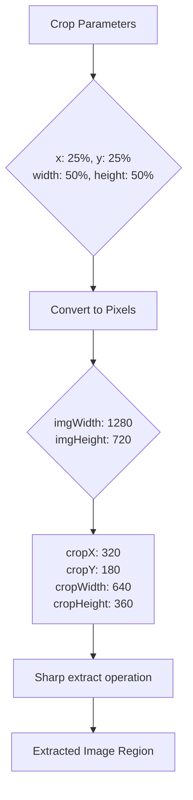
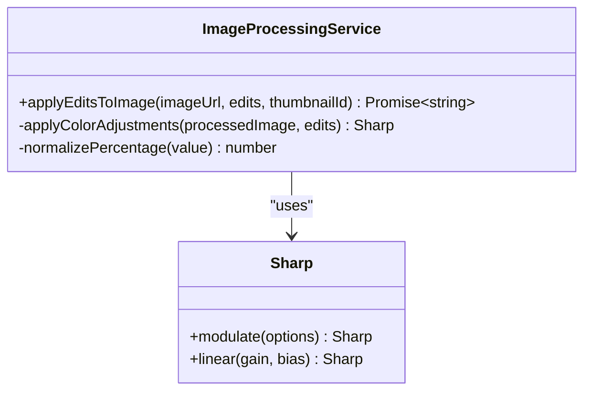
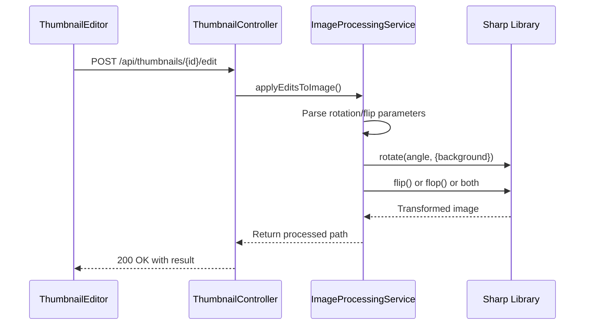
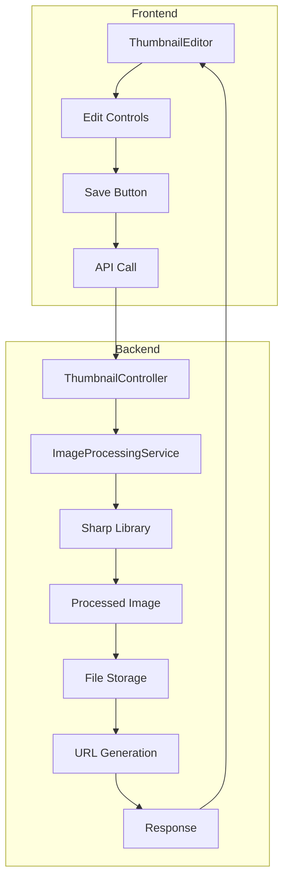
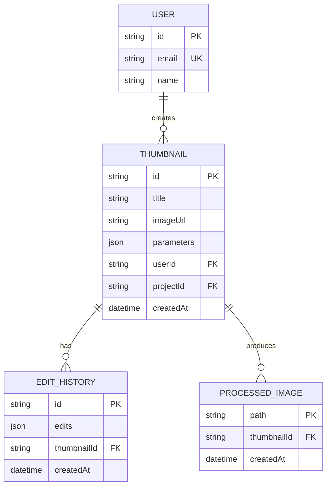
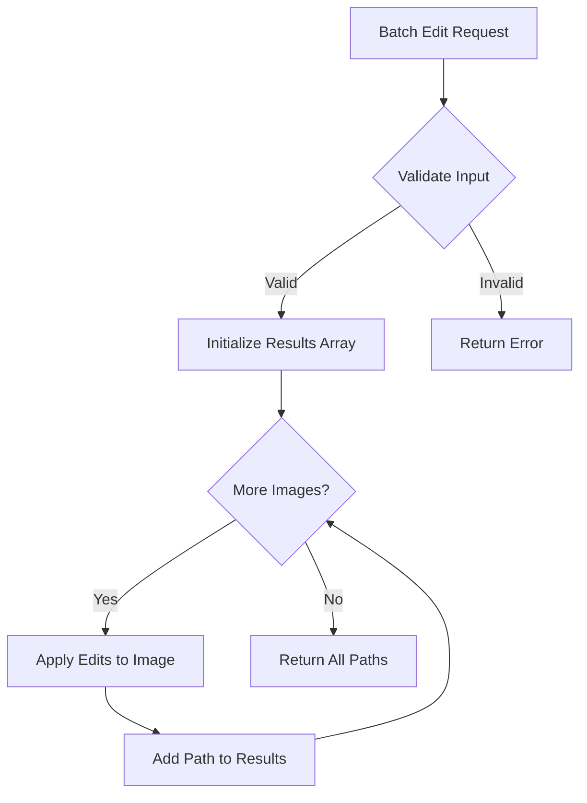
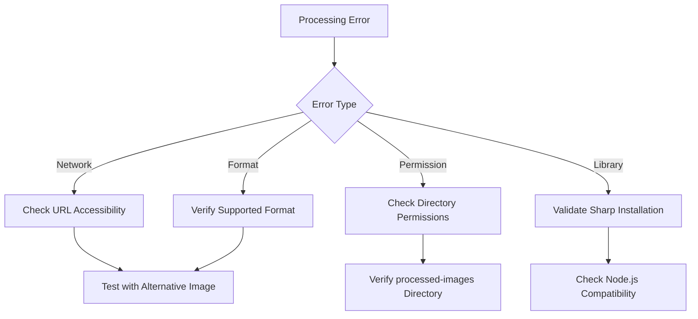

# Image Processing Pipeline

<cite>
**Referenced Files in This Document**   
- [image-processing.service.ts](file://pikzels-clone\src\modules\thumbnail\image-processing.service.ts)
- [thumbnail.controller.ts](file://pikzels-clone\src\modules\thumbnail\thumbnail.controller.ts)
- [thumbnail.routes.ts](file://pikzels-clone\src\modules\thumbnail\thumbnail.routes.ts)
- [ThumbnailEditor.tsx](file://pikzels-clone\client\src\components\ThumbnailEditor.tsx)
- [server.ts](file://pikzels-clone\src\server.ts)
</cite>

## Table of Contents
1. [Introduction](#introduction)
2. [Core Components](#core-components)
3. [Processing Workflow](#processing-workflow)
4. [Feature Implementation](#feature-implementation)
5. [Service Integration](#service-integration)
6. [Performance Considerations](#performance-considerations)
7. [Troubleshooting Guide](#troubleshooting-guide)
8. [Conclusion](#conclusion)

## Introduction

The Image Processing Pipeline is a critical component of the thumbnail creation system, responsible for transforming raw image data into visually enhanced thumbnails through a series of configurable operations. Built on the Sharp image processing library, this pipeline enables users to manipulate images through various editing features including resizing, cropping, color adjustments, rotation, flipping, and filter application. The system processes images from buffer input through sequential transformation operations to final PNG output, supporting both individual and batch processing workflows. This document details the implementation of the core editing features, processing workflow, service integration, performance considerations, and troubleshooting guidance for the image processing system.

## Core Components

The image processing system consists of several interconnected components that work together to provide comprehensive image manipulation capabilities. The primary component is the `ImageProcessingService` class, which encapsulates all image manipulation logic and provides a clean interface for applying edits to images. This service works in conjunction with the `ThumbnailController` and `ThumbnailRoutes` to expose the functionality through a REST API, while the `ThumbnailEditor` component on the frontend provides a user interface for configuring edits. The server configuration ensures that processed images are served correctly through static file serving.

**Section sources**
- [image-processing.service.ts](file://pikzels-clone\src\modules\thumbnail\image-processing.service.ts#L10-L280)
- [thumbnail.controller.ts](file://pikzels-clone\src\modules\thumbnail\thumbnail.controller.ts#L1-L734)
- [thumbnail.routes.ts](file://pikzels-clone\src\modules\thumbnail\thumbnail.routes.ts#L1-L55)
- [ThumbnailEditor.tsx](file://pikzels-clone\client\src\components\ThumbnailEditor.tsx#L1-L1505)
- [server.ts](file://pikzels-clone\src\server.ts#L1-L57)

## Processing Workflow

The image processing workflow follows a structured sequence from input to output, ensuring consistent and reliable image transformations. The process begins with an image buffer input, which can come from various sources including URLs, file uploads, or placeholder images. The workflow then applies a series of transformation operations in sequence before producing the final PNG output.



**Diagram sources**
- [image-processing.service.ts](file://pikzels-clone\src\modules\thumbnail\image-processing.service.ts#L18-L174)

The workflow starts by fetching the image buffer from the provided URL, with special handling for placeholder images and test environments. Once the buffer is obtained, a Sharp processing pipeline is initialized. The system then sequentially applies each requested transformation based on the edit parameters. Each operation modifies the processing pipeline, building upon previous transformations. After all operations are applied, the processed image is saved as a PNG file with a generated filename that includes the thumbnail ID and timestamp, then the output path is returned.

**Section sources**
- [image-processing.service.ts](file://pikzels-clone\src\modules\thumbnail\image-processing.service.ts#L29-L174)

## Feature Implementation

### Resize and Crop Operations

The resize and crop operations provide fundamental image manipulation capabilities. The resize operation adjusts the dimensions of the image to specified width and height values, while the crop operation extracts a rectangular region from the image. Both operations are implemented as conditional transformations that are only applied when specified in the edit parameters.

For crop operations, the system converts percentage-based coordinates to pixel values using a base image size of 1280x720 pixels. This conversion allows users to specify crop regions using intuitive percentage values while ensuring precise pixel-level accuracy in the final output. The crop operation uses Sharp's `extract` method to isolate the specified region.



**Diagram sources**
- [image-processing.service.ts](file://pikzels-clone\src\modules\thumbnail\image-processing.service.ts#L145-L158)

**Section sources**
- [image-processing.service.ts](file://pikzels-clone\src\modules\thumbnail\image-processing.service.ts#L45-L52)
- [image-processing.service.ts](file://pikzels-clone\src\modules\thumbnail\image-processing.service.ts#L145-L158)

### Brightness, Contrast, and Saturation Adjustments

The brightness, contrast, and saturation adjustments are implemented using Sharp's `modulate` and `linear` operations. These color adjustments are applied as a group when any of the three properties are specified in the edit parameters. The system normalizes the input values from percentage-based controls (0-200%) to multiplier values (0-2) for consistent application.

Brightness and saturation adjustments are handled through the `modulate` operation, which efficiently applies these changes in the LCH colorspace. Contrast adjustment is implemented using the `linear` operation with a gain and bias calculation that centers the adjustment around the mid-gray value (128), preserving the overall tonal balance of the image.



**Diagram sources**
- [image-processing.service.ts](file://pikzels-clone\src\modules\thumbnail\image-processing.service.ts#L54-L77)

**Section sources**
- [image-processing.service.ts](file://pikzels-clone\src\modules\thumbnail\image-processing.service.ts#L54-L77)

### Rotation and Flipping

Rotation and flipping operations provide geometric transformations that alter the orientation of the image. The rotation operation supports arbitrary angle rotation with a white background to fill any newly exposed areas. The flipping operations include both horizontal flip (mirror) and vertical flop (upside-down) transformations, which can be applied individually or together.



**Diagram sources**
- [image-processing.service.ts](file://pikzels-clone\src\modules\thumbnail\image-processing.service.ts#L113-L138)
- [thumbnail.controller.ts](file://pikzels-clone\src\modules\thumbnail\thumbnail.controller.ts#L341-L401)

**Section sources**
- [image-processing.service.ts](file://pikzels-clone\src\modules\thumbnail\image-processing.service.ts#L113-L138)

### Filter Application

The system implements a variety of filters that apply specific visual effects to images. These filters are implemented using combinations of Sharp operations to achieve the desired aesthetic. The available filters include grayscale, sepia, vintage, black and white, invert, blur, sharpen, emboss, and edge detection.

For filters that are not directly supported by Sharp (emboss and edge detection), the system uses convolution kernels to simulate these effects. The emboss filter uses a specific 3x3 kernel to create a relief-like appearance, while the edge detection filter uses a Laplacian kernel to highlight areas of rapid intensity change.

```mermaid
flowchart TD
A[Apply Filter] --> B{Filter Type}
B --> |grayscale| C[Sharp grayscale()]
B --> |sepia| D[Sharp tint('#C0A080')]
B --> |vintage| E[Modulate saturation + Tint]
B --> |blackAndWhite| F[Grayscale + Brightness boost]
B --> |invert| G[Sharp negate()]
B --> |blur| H[Sharp blur()]
B --> |sharpen| I[Sharp sharpen()]
B --> |emboss| J[Convolve with emboss kernel]
B --> |edgeDetect| K[Convolve with edge detection kernel]
```

**Diagram sources**
- [image-processing.service.ts](file://pikzels-clone\src\modules\thumbnail\image-processing.service.ts#L160-L174)

**Section sources**
- [image-processing.service.ts](file://pikzels-clone\src\modules\thumbnail\image-processing.service.ts#L160-L174)
- [image-processing.service.ts](file://pikzels-clone\src\modules\thumbnail\image-processing.service.ts#L266-L279)

## Service Integration

### Frontend Editor Integration

The image processing service is tightly integrated with the frontend ThumbnailEditor component, which provides a user-friendly interface for configuring image edits. The editor captures user input through various controls and sends the edit parameters to the backend via API calls. The integration follows a request-response pattern where the frontend sends edit configurations and receives processed image URLs.



**Diagram sources**
- [ThumbnailEditor.tsx](file://pikzels-clone\client\src\components\ThumbnailEditor.tsx#L1-L1505)
- [thumbnail.controller.ts](file://pikzels-clone\src\modules\thumbnail\thumbnail.controller.ts#L341-L401)

**Section sources**
- [ThumbnailEditor.tsx](file://pikzels-clone\client\src\components\ThumbnailEditor.tsx#L1-L1505)

### API Endpoint Structure

The image processing functionality is exposed through a well-structured REST API with clear endpoint organization. The API follows standard REST conventions with appropriate HTTP methods and status codes. Authentication is enforced through JWT tokens, ensuring that only authorized users can access the image processing features.



**Diagram sources**
- [thumbnail.routes.ts](file://pikzels-clone\src\modules\thumbnail\thumbnail.routes.ts#L1-L55)
- [server.ts](file://pikzels-clone\src\server.ts#L1-L57)

**Section sources**
- [thumbnail.routes.ts](file://pikzels-clone\src\modules\thumbnail\thumbnail.routes.ts#L1-L55)

### Batch Processing Implementation

The system supports batch processing of multiple images with the same edit parameters through the `batchApplyEditsToImages` method. This feature allows users to apply consistent transformations across multiple thumbnails efficiently. The implementation processes images sequentially in a loop, applying the same edits to each image and collecting the output paths.



**Diagram sources**
- [image-processing.service.ts](file://pikzels-clone\src\modules\thumbnail\image-processing.service.ts#L183-L206)

**Section sources**
- [image-processing.service.ts](file://pikzels-clone\src\modules\thumbnail\image-processing.service.ts#L183-L206)

## Performance Considerations

The image processing pipeline has been designed with performance and memory usage in mind, particularly when handling large images. The system processes images in memory using Sharp's efficient streaming architecture, which minimizes memory footprint by processing images in chunks rather than loading entire images into memory at once.

For large-scale processing, the system could be enhanced with several performance optimizations. These include implementing a queue-based processing system to handle multiple requests without overwhelming server resources, adding image size limits to prevent excessive memory usage, and implementing caching mechanisms to avoid reprocessing identical edit combinations.

The current implementation processes images synchronously within the request-response cycle, which may lead to timeouts for very large images or complex edit combinations. A more robust approach would involve asynchronous processing with job queues and webhook notifications, allowing the server to accept processing requests and complete them in the background.

**Section sources**
- [image-processing.service.ts](file://pikzels-clone\src\modules\thumbnail\image-processing.service.ts#L18-L280)

## Troubleshooting Guide

### Common Image Processing Failures

When image processing fails, the system logs detailed error information to aid in troubleshooting. Common failure points include invalid image URLs, unsupported image formats, insufficient server permissions, and Sharp library errors. The error handling strategy follows a graceful degradation approach, attempting to continue processing even when individual operations fail.



**Diagram sources**
- [image-processing.service.ts](file://pikzels-clone\src\modules\thumbnail\image-processing.service.ts#L170-L171)
- [image-processing.service.ts](file://pikzels-clone\src\modules\thumbnail\image-processing.service.ts#L202-L203)

**Section sources**
- [image-processing.service.ts](file://pikzels-clone\src\modules\thumbnail\image-processing.service.ts#L170-L171)
- [image-processing.service.ts](file://pikzels-clone\src\modules\thumbnail\image-processing.service.ts#L202-L203)

### Format Compatibility Issues

The system primarily outputs PNG format images, but Sharp supports a wide range of input formats including JPEG, PNG, WebP, AVIF, GIF, SVG, and TIFF. Format compatibility issues typically arise from corrupted input files, unsupported color profiles, or malformed image data. When encountering format issues, verify that the input image is valid by opening it with standard image viewing software.

For optimal results, ensure that input images are in a widely supported format like JPEG or PNG with standard color profiles. The system automatically handles format conversion during processing, but starting with a compatible input format reduces the likelihood of processing errors.

**Section sources**
- [image-processing.service.ts](file://pikzels-clone\src\modules\thumbnail\image-processing.service.ts#L176-L178)

## Conclusion

The Image Processing Pipeline provides a comprehensive set of features for manipulating thumbnail images through a robust and extensible architecture. By leveraging the Sharp library, the system delivers high-performance image transformations with a wide range of editing capabilities. The integration between frontend and backend components enables a seamless user experience for creating and customizing thumbnails. While the current implementation meets the core requirements, opportunities exist for enhancing performance through asynchronous processing and improved error handling. The modular design allows for easy extension with additional filters and editing features as needed.