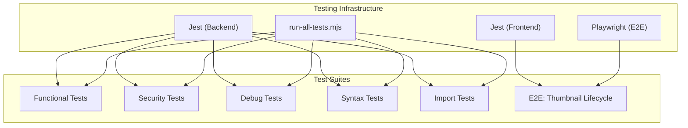
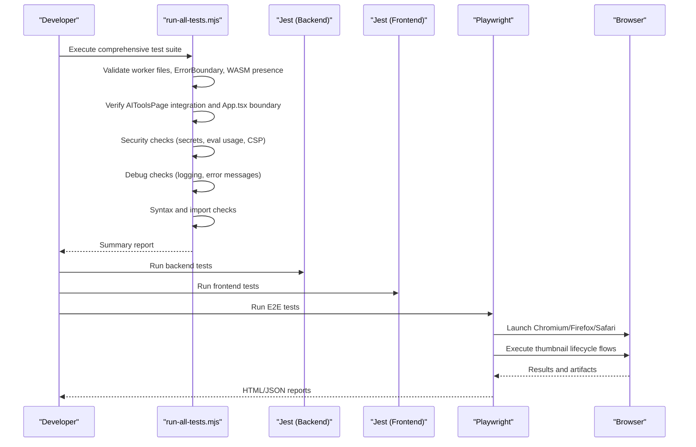
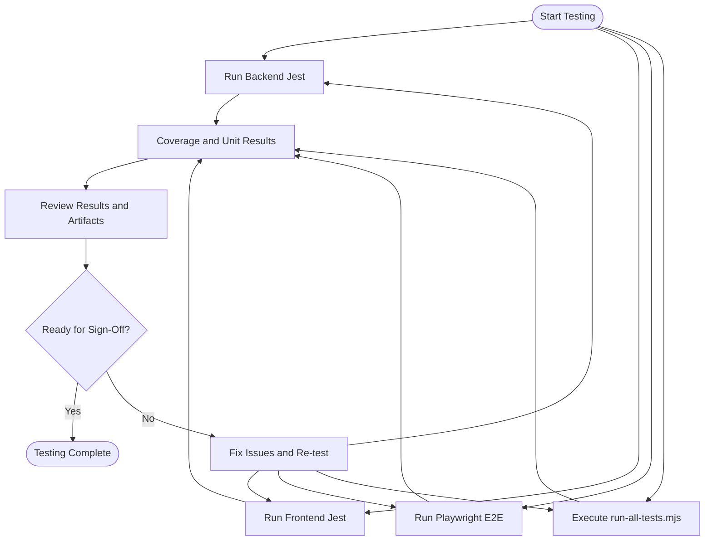
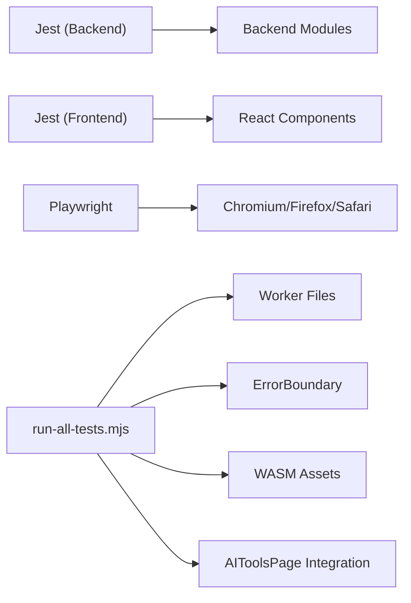
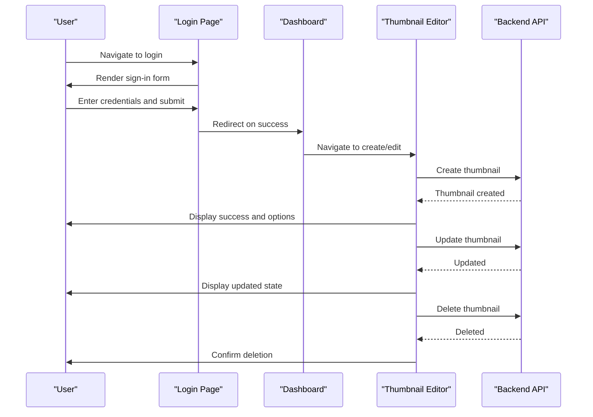

# Testing Checklist

<cite>
**Referenced Files in This Document**
- [TESTING_CHECKLIST.md](file://pikzels-clone/docs/TESTING_CHECKLIST.md)
- [README.md](file://pikzels-clone/README.md)
- [client/README.md](file://pikzels-clone/client/README.md)
- [jest.config.js](file://pikzels-clone/jest.config.js)
- [client/jest.config.js](file://pikzels-clone/client/jest.config.js)
- [playwright.config.ts](file://pikzels-clone/playwright.config.ts)
- [client/run-all-tests.mjs](file://pikzels-clone/client/run-all-tests.mjs)
- [tests/e2e/thumbnail-operations.spec.ts](file://pikzels-clone/tests/e2e/thumbnail-operations.spec.ts)
</cite>

## Table of Contents
1. [Introduction](#introduction)
2. [Project Structure](#project-structure)
3. [Core Components](#core-components)
4. [Architecture Overview](#architecture-overview)
5. [Detailed Component Analysis](#detailed-component-analysis)
6. [Dependency Analysis](#dependency-analysis)
7. [Performance Considerations](#performance-considerations)
8. [Troubleshooting Guide](#troubleshooting-guide)
9. [Conclusion](#conclusion)
10. [Appendices](#appendices)

## Introduction
This Testing Checklist documents the comprehensive testing strategy for the Thumbnail Maker Studio, with a focus on the Web Worker implementation for AI-powered thumbnail editing. It consolidates functional, security, debug, browser compatibility, stress, and performance testing requirements, along with automation via Jest and Playwright. The checklist ensures robust validation of AI tools, worker lifecycle, fallback behavior, error handling, and performance benchmarks across modern browsers.

## Project Structure
The testing ecosystem spans backend and frontend configurations, with dedicated test suites and automation scripts:
- Backend Jest configuration for unit/integration tests
- Frontend Jest configuration for React/TypeScript tests
- Playwright configuration for end-to-end (E2E) browser tests
- A comprehensive Node-based test runner for functional, security, debug, syntax, and import validations
- E2E test suite covering the complete thumbnail lifecycle

**Diagram sources**
- [jest.config.js](file://pikzels-clone/jest.config.js#L1-L44)
- [client/jest.config.js](file://pikzels-clone/client/jest.config.js#L1-L11)
- [playwright.config.ts](file://pikzels-clone/playwright.config.ts#L1-L119)
- [client/run-all-tests.mjs](file://pikzels-clone/client/run-all-tests.mjs#L1-L544)
- [tests/e2e/thumbnail-operations.spec.ts](file://pikzels-clone/tests/e2e/thumbnail-operations.spec.ts#L1-L442)

**Section sources**
- [README.md](file://pikzels-clone/README.md#L162-L167)
- [client/README.md](file://pikzels-clone/client/README.md#L21-L24)

## Core Components
This section outlines the primary testing domains and their associated verification criteria, derived from the Testing Checklist.

- Functional Tests
  - Page loads, worker initialization, and WASM model loading
  - Remove background tool: upload, processing, display, download, and error handling
  - Enhancement tool: auto, sharpen, denoise, color with strength slider
  - UI responsiveness: maintain 60fps, interactivity during processing, smooth animations

- Security Tests
  - Input validation for image uploads and worker messages
  - Resource protection: memory and CPU limits
  - Network security: WASM MIME types, HTTPS for external resources, CDN integrity
  - Data privacy: local processing, no tracking pixels, proper storage cleanup

- Debug Tests
  - Console logs: expected worker lifecycle messages, absence of uncaught errors
  - Network tab: WASM file loading, worker script, model files
  - Performance tab: frame rate, memory usage targets
  - Application tab: service workers, storage hygiene
  - Source maps: TypeScript debugging, readable stack traces

- Browser Compatibility Tests
  - Modern browsers: Chrome, Firefox, Edge, Safari with expected pass/fallback behavior
  - Older browsers: graceful degradation and messaging

- Stress Tests
  - Large images: 5MP and 10MP handling, responsiveness, memory bounds
  - Rapid operations: quick succession of tasks, switching tools
  - Concurrent usage: multiple tabs, isolated workers

- Performance Benchmarks
  - Targets for page load, worker init, model load, processing time, frame rate, memory usage
  - Measurement guidance included

- Known Issues and Critical Reporting
  - Known issues to watch for and immediate reporting criteria for critical defects

**Section sources**
- [TESTING_CHECKLIST.md](file://pikzels-clone/docs/TESTING_CHECKLIST.md#L8-L439)

## Architecture Overview
The testing architecture integrates multiple layers:
- Unit and integration tests via Jest (backend)
- Component and UI tests via Jest (frontend)
- E2E tests via Playwright across multiple browsers
- A Node-based comprehensive test runner validating functional, security, debug, syntax, and import correctness

**Diagram sources**
- [client/run-all-tests.mjs](file://pikzels-clone/client/run-all-tests.mjs#L464-L544)
- [jest.config.js](file://pikzels-clone/jest.config.js#L1-L44)
- [client/jest.config.js](file://pikzels-clone/client/jest.config.js#L1-L11)
- [playwright.config.ts](file://pikzels-clone/playwright.config.ts#L1-L119)

## Detailed Component Analysis

### Functional Tests
Key verification points:
- Page loads without console errors, worker creation succeeds, WASM files load
- Remove background tool: upload, processing, result display, download, and error handling for invalid images
- Enhancement tool: all modes work, strength slider affects output, quality acceptable, multiple enhancements chainable
- UI responsiveness: 60fps, clickable buttons, scrolling, navigation, animations, input responsiveness during processing

Recommended validation steps:
- Manually verify worker lifecycle and UI smoothness
- Test invalid image scenarios and error surfaces
- Validate model lazy-loading and timeout protections

**Section sources**
- [TESTING_CHECKLIST.md](file://pikzels-clone/docs/TESTING_CHECKLIST.md#L10-L86)

### Security Tests
Key verification points:
- Input validation: accepted formats, file size limits, XSS prevention, data URL validation
- Worker message validation: message types, task IDs, data structures, injection prevention
- Resource protection: memory usage under 500MB, CPU usage containment, no cross-tab conflicts
- Network security: correct WASM MIME types, HTTPS for external resources, CDN integrity, local fallbacks
- Data privacy: local processing, no tracking pixels, storage cleanup, consent-based persistence

Recommended validation steps:
- Review worker message handling and input sanitization
- Inspect CSP headers and Netlify redirects
- Monitor memory/CPU spikes during processing

**Section sources**
- [TESTING_CHECKLIST.md](file://pikzels-clone/docs/TESTING_CHECKLIST.md#L89-L141)

### Debug Tests
Key verification points:
- Console logs: expected lifecycle logs, absence of uncaught errors and timeouts
- Network tab: WASM file loads (HTTP 200, correct MIME), worker script, model files
- Performance tab: main thread at 60fps, minimal long tasks, worker thread activity
- Application tab: no interfering service workers, clean local storage/IndexedDB
- Source maps: TypeScript debugging, breakpoints in worker, readable stack traces

Recommended validation steps:
- Use DevTools to capture logs, network requests, and performance metrics
- Verify source maps configuration for accurate debugging

**Section sources**
- [TESTING_CHECKLIST.md](file://pikzels-clone/docs/TESTING_CHECKLIST.md#L143-L218)

### Browser Compatibility Tests
Key verification points:
- Modern browsers: Chrome 90+, Firefox 88+, Edge 90+, Safari 14+ — all pass
- Older browsers: Chrome 60–89 — graceful fallback, acceptable UI freezes
- IE 11 — unsupported message, no crash

Recommended validation steps:
- Execute Playwright tests across Chromium, Firefox, and WebKit
- Validate fallback behavior on older browsers

**Section sources**
- [TESTING_CHECKLIST.md](file://pikzels-clone/docs/TESTING_CHECKLIST.md#L221-L256)

### Stress Tests
Key verification points:
- Large images: 5MP and 10MP handling, responsiveness, memory bounds
- Rapid operations: quick successive actions, cancellation of previous tasks, no queue buildup
- Concurrent usage: multiple tabs, isolated workers, acceptable performance

Recommended validation steps:
- Benchmark processing time and memory usage for large images
- Simulate rapid tool switching and concurrent tab usage

**Section sources**
- [TESTING_CHECKLIST.md](file://pikzels-clone/docs/TESTING_CHECKLIST.md#L259-L296)

### Performance Benchmarks
Target metrics and measurement guidance:
- Page Load: target <500ms, acceptable <1s, critical <2s
- Worker Init: target <1s, acceptable <2s, critical <5s
- Model Load: target <5s, acceptable <10s, critical <15s
- Process (1080p): target <5s, acceptable <10s, critical <30s
- UI Frame Rate: target 60fps, acceptable 50fps, critical 30fps
- Memory Usage: target <200MB, acceptable <400MB, critical <600MB

Measurement guidance is provided in the checklist for timing and heap usage.

**Section sources**
- [TESTING_CHECKLIST.md](file://pikzels-clone/docs/TESTING_CHECKLIST.md#L299-L324)

### Known Issues and Critical Reporting
Known issues to watch:
- Backend selection: WASM vs WebGL fallback indicators
- Model caching: first-use delay vs subsequent instant loads
- Worker termination: navigating away without immediate termination
- Large image memory pressure: responsiveness under 10MP+

Critical issues to report immediately:
- Page crashes using AI tools
- Worker initialization timeout
- UI freeze during processing
- Memory leaks causing slowdown
- Security vulnerabilities (XSS, code injection)
- Data loss or corruption

**Section sources**
- [TESTING_CHECKLIST.md](file://pikzels-clone/docs/TESTING_CHECKLIST.md#L327-L388)

### Automation and Test Execution
- Jest (Backend): configured for TypeScript, coverage thresholds, test timeout, and transform settings
- Jest (Frontend): configured for jsdom, TypeScript transform, and test match patterns
- Playwright: multi-browser projects, tracing, screenshots, videos, and base URL configuration
- run-all-tests.mjs: comprehensive validation of worker files, ErrorBoundary, WASM assets, AIToolsPage integration, security checks, logging, syntax, imports, and dependency validation

**Diagram sources**
- [jest.config.js](file://pikzels-clone/jest.config.js#L1-L44)
- [client/jest.config.js](file://pikzels-clone/client/jest.config.js#L1-L11)
- [playwright.config.ts](file://pikzels-clone/playwright.config.ts#L1-L119)
- [client/run-all-tests.mjs](file://pikzels-clone/client/run-all-tests.mjs#L464-L544)

**Section sources**
- [jest.config.js](file://pikzels-clone/jest.config.js#L1-L44)
- [client/jest.config.js](file://pikzels-clone/client/jest.config.js#L1-L11)
- [playwright.config.ts](file://pikzels-clone/playwright.config.ts#L1-L119)
- [client/run-all-tests.mjs](file://pikzels-clone/client/run-all-tests.mjs#L1-L544)

## Dependency Analysis
Testing dependencies and their roles:
- Jest (Backend): executes server-side unit and integration tests with coverage thresholds and transform pipeline
- Jest (Frontend): runs React/TypeScript tests in jsdom environment with TypeScript transform
- Playwright: orchestrates cross-browser E2E tests with tracing, screenshots, and video capture
- run-all-tests.mjs: validates functional, security, debug, syntax, and import correctness across worker and UI components

**Diagram sources**
- [jest.config.js](file://pikzels-clone/jest.config.js#L1-L44)
- [client/jest.config.js](file://pikzels-clone/client/jest.config.js#L1-L11)
- [playwright.config.ts](file://pikzels-clone/playwright.config.ts#L1-L119)
- [client/run-all-tests.mjs](file://pikzels-clone/client/run-all-tests.mjs#L66-L178)

**Section sources**
- [jest.config.js](file://pikzels-clone/jest.config.js#L1-L44)
- [client/jest.config.js](file://pikzels-clone/client/jest.config.js#L1-L11)
- [playwright.config.ts](file://pikzels-clone/playwright.config.ts#L1-L119)
- [client/run-all-tests.mjs](file://pikzels-clone/client/run-all-tests.mjs#L66-L178)

## Performance Considerations
- Maintain 60fps during AI processing by offloading to Web Workers and avoiding heavy synchronous work on the main thread
- Enforce memory usage targets and monitor heap growth; implement worker termination on navigation
- Validate model lazy-loading and caching to reduce latency on subsequent operations
- Use performance timing to measure critical paths (page load, worker init, model load, processing)

[No sources needed since this section provides general guidance]

## Troubleshooting Guide
Common issues and resolutions:
- Worker initialization timeout: verify WASM backend availability and model CDN accessibility
- UI completely freezing: confirm worker offloads processing and main thread remains responsive
- Memory leaks: ensure worker termination and cleanup of pending tasks on unmount
- Security vulnerabilities: validate input sanitization, CSP headers, and absence of eval/Function constructors
- Data loss: confirm local processing and proper storage cleanup

**Section sources**
- [TESTING_CHECKLIST.md](file://pikzels-clone/docs/TESTING_CHECKLIST.md#L378-L388)

## Conclusion
This Testing Checklist provides a structured approach to validate the AI-powered thumbnail editing features, focusing on worker lifecycle, fallback behavior, security, debugging, browser compatibility, stress scenarios, and performance. Combined with automated Jest and Playwright tests, plus the comprehensive Node-based validation runner, the project can achieve reliable, high-quality functionality across environments.

[No sources needed since this section summarizes without analyzing specific files]

## Appendices

### Appendix A: E2E Test Flow
The E2E suite validates the complete thumbnail lifecycle: authentication, creation, editing, and deletion, capturing screenshots and asserting UI states.

**Diagram sources**
- [tests/e2e/thumbnail-operations.spec.ts](file://pikzels-clone/tests/e2e/thumbnail-operations.spec.ts#L113-L415)

**Section sources**
- [tests/e2e/thumbnail-operations.spec.ts](file://pikzels-clone/tests/e2e/thumbnail-operations.spec.ts#L1-L442)

### Appendix B: Test Execution Commands
- Backend tests: npm test
- Frontend tests: cd client && npm test
- Coverage report: npm run test:coverage
- Playwright E2E: npx playwright test tests/e2e/thumbnail-operations.spec.ts --headed --project=chromium
- Comprehensive validation: node client/run-all-tests.mjs

**Section sources**
- [README.md](file://pikzels-clone/README.md#L162-L167)
- [client/README.md](file://pikzels-clone/client/README.md#L21-L24)
- [playwright.config.ts](file://pikzels-clone/playwright.config.ts#L102-L117)
- [client/run-all-tests.mjs](file://pikzels-clone/client/run-all-tests.mjs#L464-L544)