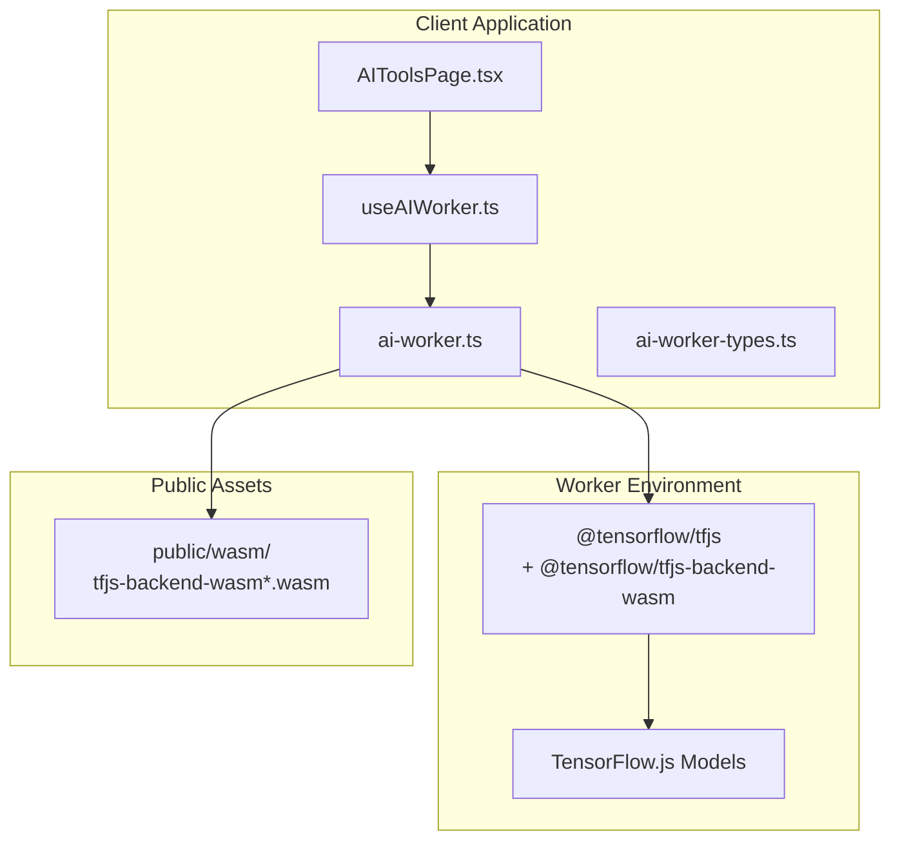
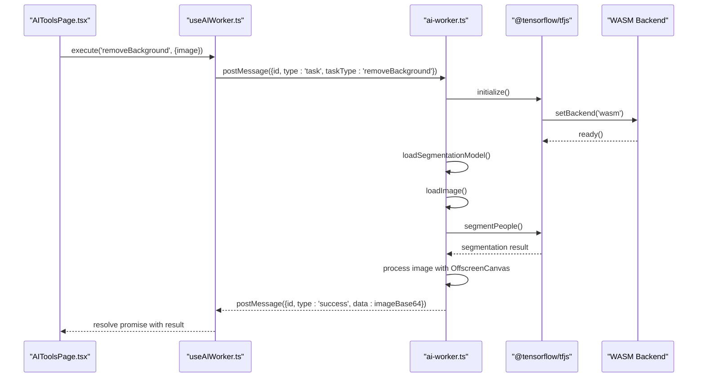
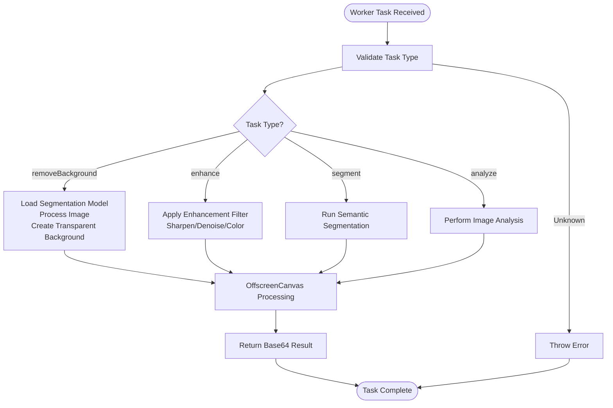
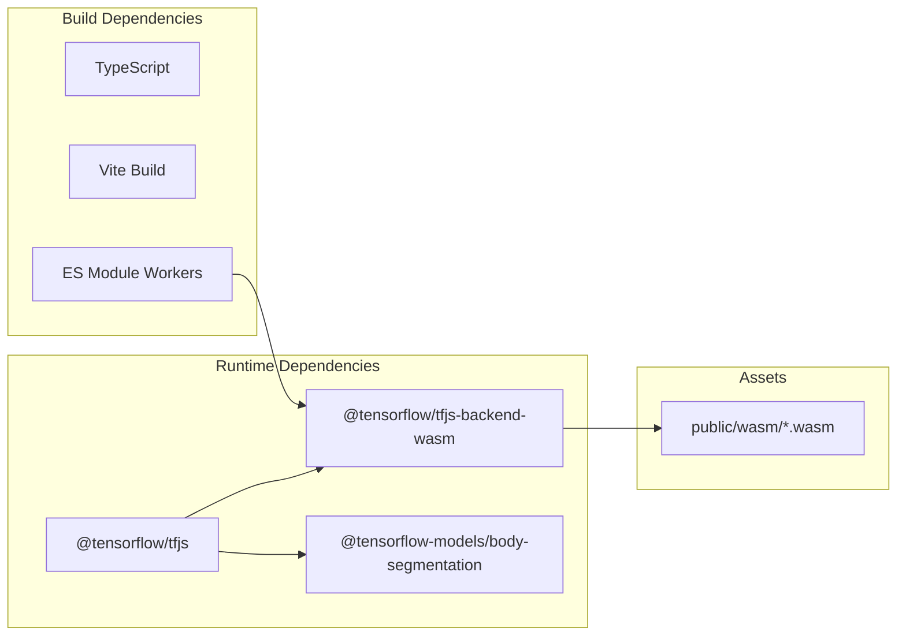

# WASM Analysis

<cite>
**Referenced Files in This Document**
- [WASM_ANALYSIS.md](file://pikzels-clone/docs/WASM_ANALYSIS.md)
- [WEB_WORKERS_ASSESSMENT.md](file://pikzels-clone/docs/WEB_WORKERS_ASSESSMENT.md)
- [WEB_WORKERS_IMPLEMENTATION.md](file://pikzels-clone/docs/WEB_WORKERS_IMPLEMENTATION.md)
- [ai-worker.ts](file://pikzels-clone/client/src/workers/ai-worker.ts)
- [useAIWorker.ts](file://pikzels-clone/client/src/hooks/useAIWorker.ts)
- [ai-worker-types.ts](file://pikzels-clone/client/src/workers/ai-worker-types.ts)
- [AIToolsPage.tsx](file://pikzels-clone/client/src/components/dashboard/AIToolsPage.tsx)
- [test-worker.html](file://pikzels-clone/client/test-worker.html)
- [run-all-tests.mjs](file://pikzels-clone/client/run-all-tests.mjs)
- [package.json](file://pikzels-clone/package.json)
</cite>

## Table of Contents
1. [Introduction](#introduction)
2. [Project Structure](#project-structure)
3. [Core Components](#core-components)
4. [Architecture Overview](#architecture-overview)
5. [Detailed Component Analysis](#detailed-component-analysis)
6. [Dependency Analysis](#dependency-analysis)
7. [Performance Considerations](#performance-considerations)
8. [Troubleshooting Guide](#troubleshooting-guide)
9. [Conclusion](#conclusion)

## Introduction
This document provides a comprehensive analysis of the WebAssembly (WASM) and Web Workers implementation for AI tools in the project. It evaluates the current state of AI processing, the rationale for choosing Web Workers over pure WASM, and documents the complete implementation including worker lifecycle management, fallback mechanisms, and performance characteristics.

## Project Structure
The WASM and Web Workers implementation is organized across three primary areas:
- Worker infrastructure: dedicated worker file and TypeScript types
- React integration: a custom hook for worker lifecycle and task execution
- UI integration: the AI Tools page that conditionally uses workers or falls back to the main thread

**Diagram sources**
- [AIToolsPage.tsx](file://pikzels-clone/client/src/components/dashboard/AIToolsPage.tsx#L69-L96)
- [useAIWorker.ts](file://pikzels-clone/client/src/hooks/useAIWorker.ts#L21-L111)
- [ai-worker.ts](file://pikzels-clone/client/src/workers/ai-worker.ts#L1-L41)
- [ai-worker-types.ts](file://pikzels-clone/client/src/workers/ai-worker-types.ts#L1-L40)

**Section sources**
- [AIToolsPage.tsx](file://pikzels-clone/client/src/components/dashboard/AIToolsPage.tsx#L69-L96)
- [useAIWorker.ts](file://pikzels-clone/client/src/hooks/useAIWorker.ts#L21-L111)
- [ai-worker.ts](file://pikzels-clone/client/src/workers/ai-worker.ts#L1-L41)
- [ai-worker-types.ts](file://pikzels-clone/client/src/workers/ai-worker-types.ts#L1-L40)

## Core Components
The implementation consists of three core components working together to deliver non-blocking AI processing:

### Web Worker (ai-worker.ts)
- Initializes TensorFlow.js with WASM backend for CPU-based computation
- Lazily loads TensorFlow.js and WASM backend to minimize main bundle size
- Manages model lifecycle and provides task execution functions
- Handles image processing using OffscreenCanvas for efficient pixel manipulation
- Implements robust error handling and logging

### React Hook (useAIWorker.ts)
- Creates and manages Web Worker lifecycle
- Provides a promise-based interface for AI task execution
- Implements timeout handling and error propagation
- Tracks processing state and worker readiness
- Supports graceful degradation when workers are unavailable

### Worker Types (ai-worker-types.ts)
- Defines strongly-typed worker message protocols
- Specifies supported task types and request/response interfaces
- Ensures type safety across the main thread and worker boundary

**Section sources**
- [ai-worker.ts](file://pikzels-clone/client/src/workers/ai-worker.ts#L1-L320)
- [useAIWorker.ts](file://pikzels-clone/client/src/hooks/useAIWorker.ts#L1-L167)
- [ai-worker-types.ts](file://pikzels-clone/client/src/workers/ai-worker-types.ts#L1-L40)

## Architecture Overview
The system architecture separates AI computation from the main UI thread using Web Workers, with WASM backend ensuring CPU-based processing that doesn't contend with GPU rendering.

**Diagram sources**
- [AIToolsPage.tsx](file://pikzels-clone/client/src/components/dashboard/AIToolsPage.tsx#L233-L253)
- [useAIWorker.ts](file://pikzels-clone/client/src/hooks/useAIWorker.ts#L113-L159)
- [ai-worker.ts](file://pikzels-clone/client/src/workers/ai-worker.ts#L281-L316)

**Section sources**
- [AIToolsPage.tsx](file://pikzels-clone/client/src/components/dashboard/AIToolsPage.tsx#L233-L253)
- [useAIWorker.ts](file://pikzels-clone/client/src/hooks/useAIWorker.ts#L113-L159)
- [ai-worker.ts](file://pikzels-clone/client/src/workers/ai-worker.ts#L281-L316)

## Detailed Component Analysis

### Web Worker Implementation
The worker implementation demonstrates several key architectural decisions:

#### Initialization Strategy
- Dynamic imports prevent bundling TensorFlow.js in the main application bundle
- WASM backend is explicitly set to avoid GPU contention with browser rendering
- Local WASM file paths enable offline support and faster loading

#### Task Management
- Support for multiple task types: removeBackground, enhance, segment, analyze
- Asynchronous task execution with proper error handling
- Timeout mechanism prevents hanging operations

#### Image Processing Pipeline
- Uses OffscreenCanvas for efficient pixel manipulation
- Implements custom convolution kernels for image enhancement
- Supports both base64 data URLs and binary image data

**Diagram sources**
- [ai-worker.ts](file://pikzels-clone/client/src/workers/ai-worker.ts#L289-L298)

**Section sources**
- [ai-worker.ts](file://pikzels-clone/client/src/workers/ai-worker.ts#L19-L41)
- [ai-worker.ts](file://pikzels-clone/client/src/workers/ai-worker.ts#L46-L64)
- [ai-worker.ts](file://pikzels-clone/client/src/workers/ai-worker.ts#L90-L154)
- [ai-worker.ts](file://pikzels-clone/client/src/workers/ai-worker.ts#L159-L198)

### React Hook Integration
The useAIWorker hook provides a clean interface for React components:

#### Worker Lifecycle Management
- Automatic worker creation with module worker support
- Proper cleanup on component unmount
- Error handling for worker initialization failures

#### Task Execution
- Promise-based API for asynchronous task execution
- Unique task ID generation for reliable message correlation
- 30-second timeout protection for long-running operations

#### State Management
- Tracks worker readiness and processing state
- Provides loading indicators for UI feedback
- Handles fallback scenarios gracefully

**Section sources**
- [useAIWorker.ts](file://pikzels-clone/client/src/hooks/useAIWorker.ts#L27-L111)
- [useAIWorker.ts](file://pikzels-clone/client/src/hooks/useAIWorker.ts#L113-L159)
- [useAIWorker.ts](file://pikzels-clone/client/src/hooks/useAIWorker.ts#L161-L166)

### UI Integration Strategy
The AIToolsPage implements a sophisticated fallback mechanism:

#### Conditional Worker Usage
- Checks for Web Worker support before attempting initialization
- Uses worker when available, falls back to main-thread AI service
- Dynamically adjusts UI state based on worker availability

#### State Coordination
- Maps worker properties (isReady, isProcessing) to component state
- Provides seamless switching between worker and fallback modes
- Maintains consistent user experience regardless of backend choice

**Section sources**
- [AIToolsPage.tsx](file://pikzels-clone/client/src/components/dashboard/AIToolsPage.tsx#L70-L96)
- [AIToolsPage.tsx](file://pikzels-clone/client/src/components/dashboard/AIToolsPage.tsx#L233-L253)
- [AIToolsPage.tsx](file://pikzels-clone/client/src/components/dashboard/AIToolsPage.tsx#L255-L283)

## Dependency Analysis
The implementation introduces specific dependencies and asset requirements:

### TensorFlow.js Dependencies
- Core TensorFlow.js library for machine learning operations
- WASM backend for CPU-based computation
- Body segmentation models for background removal

### Asset Dependencies
- WASM binary files served from public/wasm directory
- Module worker support for modern browsers
- OffscreenCanvas API for efficient image processing

**Diagram sources**
- [package.json](file://pikzels-clone/package.json#L94-L135)
- [ai-worker.ts](file://pikzels-clone/client/src/workers/ai-worker.ts#L24-L26)
- [run-all-tests.mjs](file://pikzels-clone/client/run-all-tests.mjs#L102-L123)

**Section sources**
- [package.json](file://pikzels-clone/package.json#L94-L135)
- [ai-worker.ts](file://pikzels-clone/client/src/workers/ai-worker.ts#L24-L29)
- [run-all-tests.mjs](file://pikzels-clone/client/run-all-tests.mjs#L102-L140)

## Performance Considerations
The implementation achieves significant performance improvements through strategic design choices:

### Non-Blocking Processing
- All AI operations execute in Web Workers, keeping the main thread responsive
- Users can continue interacting with the interface during processing
- Eliminates UI freezes that previously occurred during model inference

### CPU vs GPU Isolation
- WASM backend runs computations on CPU threads
- Avoids competition with browser rendering for GPU resources
- Provides predictable performance across different hardware configurations

### Memory Management
- OffscreenCanvas enables efficient image processing without DOM manipulation
- Proper cleanup of worker resources prevents memory leaks
- Lazy loading of models reduces initial memory footprint

### Fallback Strategy
- Automatic detection of worker support prevents runtime errors
- Graceful degradation maintains functionality on older browsers
- Consistent user experience regardless of browser capabilities

**Section sources**
- [WEB_WORKERS_ASSESSMENT.md](file://pikzels-clone/docs/WEB_WORKERS_ASSESSMENT.md#L46-L66)
- [WEB_WORKERS_IMPLEMENTATION.md](file://pikzels-clone/docs/WEB_WORKERS_IMPLEMENTATION.md#L46-L64)
- [WEB_WORKERS_ASSESSMENT.md](file://pikzels-clone/docs/WEB_WORKERS_ASSESSMENT.md#L187-L201)

## Troubleshooting Guide

### Common Issues and Solutions

#### Worker Not Loading
**Symptoms**: Console shows "Worker not initialized" or "Worker not supported"
**Causes**: 
- Browser lacks Web Worker support
- Module worker not supported in development environment
- Incorrect worker file path

**Solutions**:
- Check browser compatibility for Web Workers
- Verify ES module worker support in development server
- Ensure worker file is accessible at the specified URL

#### WASM Files Missing
**Symptoms**: Network requests for `/wasm/*.wasm` return 404 errors
**Causes**:
- Missing public/wasm directory
- WASM files not copied during build process
- Incorrect MIME type configuration

**Solutions**:
- Verify public/wasm directory exists with required files
- Run build process to copy WASM assets
- Configure server to serve WASM files with correct MIME type

#### Performance Issues
**Symptoms**: Processing still causes UI slowdown despite worker usage
**Causes**:
- Model loading occurs in main thread
- Large image sizes causing memory pressure
- Inefficient image transfer between threads

**Solutions**:
- Ensure model loading happens in worker context
- Optimize image sizes before processing
- Use ArrayBuffer transfer for efficient data exchange

**Section sources**
- [WEB_WORKERS_IMPLEMENTATION.md](file://pikzels-clone/docs/WEB_WORKERS_IMPLEMENTATION.md#L220-L236)
- [test-worker.html](file://pikzels-clone/client/test-worker.html#L100-L115)
- [run-all-tests.mjs](file://pikzels-clone/client/run-all-tests.mjs#L102-L140)

## Conclusion
The Web Workers + WASM implementation represents a mature solution for AI-powered image processing in the browser. By leveraging Web Workers for non-blocking execution and WASM for CPU-based computation, the system achieves:

- **Responsive UI**: Users can interact with the interface during AI processing
- **Consistent Performance**: Predictable execution without GPU contention
- **Graceful Degradation**: Automatic fallback ensures functionality across browsers
- **Scalable Architecture**: Clean separation of concerns enables future enhancements

The implementation successfully addresses the original performance bottlenecks identified in the WASM analysis, providing a professional-grade user experience while maintaining code maintainability and extensibility.