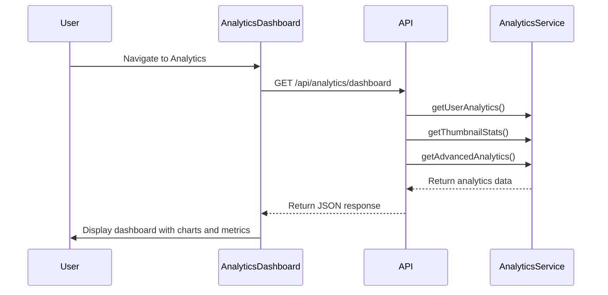
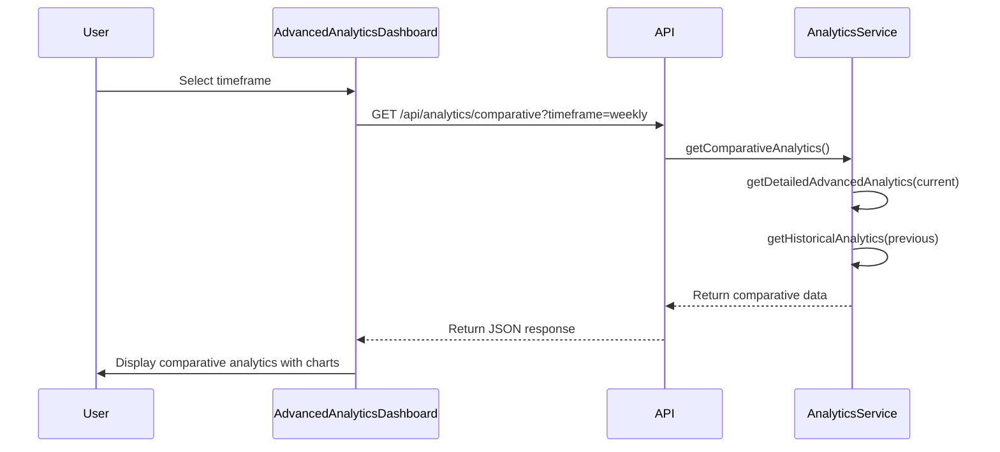
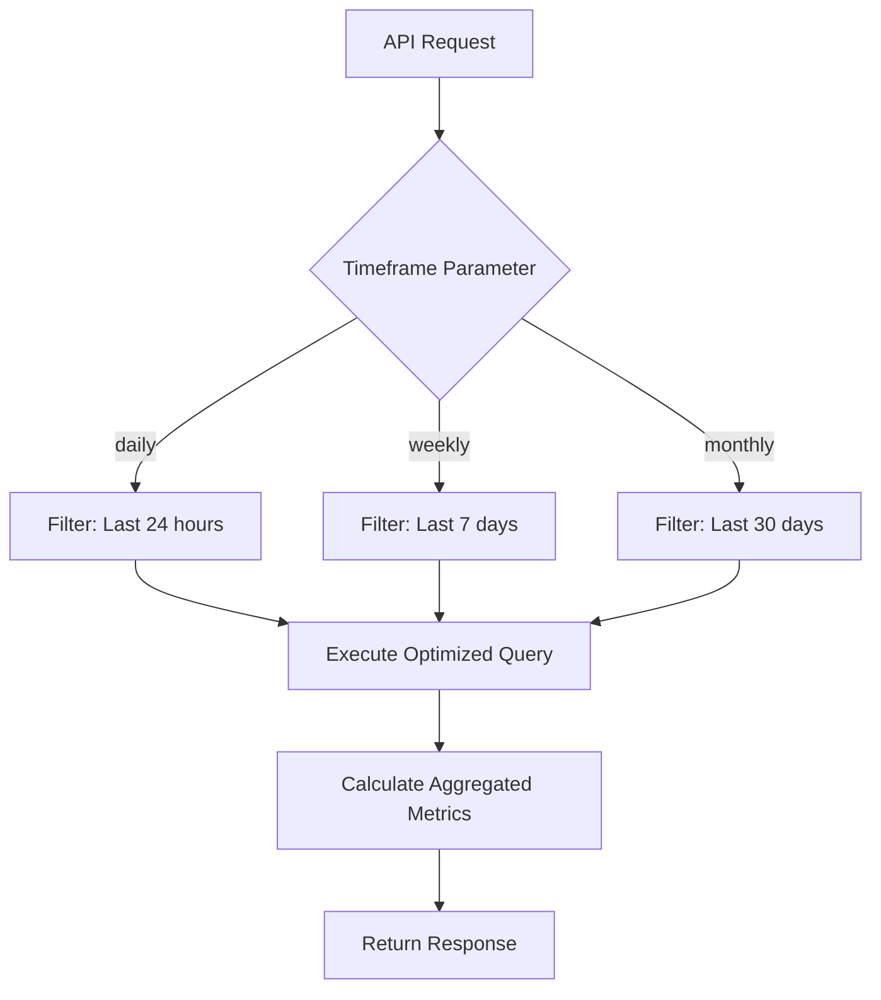

# Analytics API

<cite>
**Referenced Files in This Document**   
- [analytics.controller.ts](file://pikzels-clone\src\modules\analytics\analytics.controller.ts)
- [analytics.service.ts](file://pikzels-clone\src\modules\analytics\analytics.service.ts)
- [analytics.routes.ts](file://pikzels-clone\src\modules\analytics\analytics.routes.ts)
- [AnalyticsDashboard.tsx](file://pikzels-clone\client\src\components\AnalyticsDashboard.tsx)
- [AdvancedAnalyticsDashboard.tsx](file://pikzels-clone\client\src\components\AdvancedAnalyticsDashboard.tsx)
</cite>

## Table of Contents
1. [Introduction](#introduction)
2. [API Endpoints](#api-endpoints)
3. [Response Schemas](#response-schemas)
4. [Data Structures](#data-structures)
5. [Integration with Frontend Components](#integration-with-frontend-components)
6. [Performance Optimization](#performance-optimization)
7. [Data Privacy Considerations](#data-privacy-considerations)

## Introduction
The Analytics API provides comprehensive tracking and reporting capabilities for thumbnail performance and user engagement. It enables users to monitor key metrics such as impressions, clicks, click-through rate (CTR), and social shares across various aggregation levels and timeframes. The API supports advanced analytics features including heatmaps, audience demographics, and platform-specific performance analysis.

The system is designed to support both real-time engagement tracking and historical trend analysis, with flexible filtering options by project, campaign, and date ranges. The API integrates seamlessly with frontend dashboard components to provide actionable insights into user behavior and content performance.

**Section sources**
- [analytics.controller.ts](file://pikzels-clone\src\modules\analytics\analytics.controller.ts#L13-L189)
- [analytics.service.ts](file://pikzels-clone\src\modules\analytics\analytics.service.ts#L4-L1082)

## API Endpoints

### GET /api/analytics/dashboard
Retrieves comprehensive dashboard data including user analytics, thumbnail statistics, and advanced analytics metrics.

**Query Parameters**
- None

**Response**
Returns a JSON object containing user analytics, thumbnail stats, and advanced analytics data.

### GET /api/analytics/trends
Retrieves thumbnail creation trend data for the authenticated user.

**Query Parameters**
- None

**Response**
Returns trend data showing daily thumbnail creation counts.

### GET /api/analytics/styles
Retrieves style distribution data for thumbnails created by the user.

**Query Parameters**
- None

**Response**
Returns style distribution metrics categorized by style types (bold, minimalist, dramatic, other).

### GET /api/analytics/projects
Retrieves project usage data showing thumbnail distribution across projects.

**Query Parameters**
- None

**Response**
Returns project usage statistics with thumbnail counts per project.

### GET /api/analytics/advanced
Retrieves advanced analytics data including productivity, editing complexity, and engagement metrics.

**Query Parameters**
- None

**Response**
Returns comprehensive advanced analytics data.

### GET /api/analytics/detailed
Retrieves detailed advanced analytics data with timeframe filtering.

**Query Parameters**
- `timeframe` (string): Aggregation level - 'daily', 'weekly', or 'monthly' (default: 'daily')

**Response**
Returns detailed analytics data filtered by the specified timeframe.

### GET /api/analytics/comparative
Retrieves comparative analytics data comparing current and previous periods.

**Query Parameters**
- `timeframe` (string): Comparison period - 'daily', 'weekly', or 'monthly' (default: 'weekly')

**Response**
Returns comparative analytics data showing changes between current and previous periods.

**Section sources**
- [analytics.routes.ts](file://pikzels-clone\src\modules\analytics\analytics.routes.ts#L1-L46)
- [analytics.controller.ts](file://pikzels-clone\src\modules\analytics\analytics.controller.ts#L13-L189)

## Response Schemas

### Dashboard Response Schema
```json
{
  "userAnalytics": {
    "totals": {
      "thumbnails": 0,
      "projects": 0,
      "recentThumbnails": 0
    },
    "trends": {
      "daily": {}
    },
    "styles": {},
    "projects": [],
    "hourlyDistribution": {},
    "dayOfWeekDistribution": {}
  },
  "thumbnailStats": {
    "total": 0,
    "averagePerDay": 0,
    "mostRecent": null,
    "byProject": [],
    "byStyle": {},
    "editingStats": {
      "totalEdited": 0,
      "totalEdits": 0,
      "averageEditsPerThumbnail": 0
    }
  },
  "advancedAnalytics": {
    "productivity": {
      "bestDay": null,
      "bestHour": {
        "hour": 0,
        "count": 0
      },
      "consistency": 0
    },
    "editing": {
      "mostComplexThumbnail": null,
      "averageEditComplexity": 0
    },
    "engagement": {
      "mostShared": null,
      "sharingRate": 0
    }
  }
}
```

### Comparative Analytics Response Schema
```json
{
  "current": {
    "productivity": {
      "bestDay": null,
      "bestHour": {
        "hour": 0,
        "count": 0
      },
      "consistency": 0,
      "creationTrend": []
    },
    "editing": {
      "mostComplexThumbnail": null,
      "averageEditComplexity": 0,
      "editDistribution": {}
    },
    "engagement": {
      "mostShared": null,
      "sharingRate": 0,
      "platformDistribution": []
    },
    "timeframeData": {
      "totalThumbnails": 0,
      "averagePerDay": 0
    }
  },
  "previous": {
    "productivity": {
      "bestDay": null,
      "bestHour": {
        "hour": 0,
        "count": 0
      },
      "consistency": 0,
      "creationTrend": []
    },
    "editing": {
      "mostComplexThumbnail": null,
      "averageEditComplexity": 0,
      "editDistribution": {}
    },
    "engagement": {
      "mostShared": null,
      "sharingRate": 0,
      "platformDistribution": []
    },
    "timeframeData": {
      "totalThumbnails": 0,
      "averagePerDay": 0
    }
  },
  "comparison": {
    "thumbnails": {
      "current": 0,
      "previous": 0,
      "change": 0
    },
    "averagePerDay": {
      "current": 0,
      "previous": 0,
      "change": 0
    },
    "sharingRate": {
      "current": 0,
      "previous": 0,
      "change": 0
    },
    "averageEditComplexity": {
      "current": 0,
      "previous": 0,
      "change": 0
    }
  }
}
```

**Section sources**
- [analytics.service.ts](file://pikzels-clone\src\modules\analytics\analytics.service.ts#L4-L1082)
- [analytics.controller.ts](file://pikzels-clone\src\modules\analytics\analytics.controller.ts#L13-L189)

## Data Structures

### User Analytics Data Structure
Represents comprehensive analytics data for a user, including:
- **totals**: Overall counts of thumbnails and projects
- **trends**: Daily creation trends over time
- **styles**: Distribution of thumbnails by design style
- **projects**: Usage statistics by project
- **hourlyDistribution**: Creation patterns by hour of day
- **dayOfWeekDistribution**: Creation patterns by day of week

### Thumbnail Statistics Data Structure
Contains detailed statistics about thumbnail creation and editing:
- **total**: Total number of thumbnails created
- **averagePerDay**: Average creation rate per day
- **mostRecent**: Most recently created thumbnail
- **byProject**: Distribution of thumbnails across projects
- **byStyle**: Distribution of thumbnails by style
- **editingStats**: Metrics about editing activity and complexity

### Advanced Analytics Data Structure
Provides in-depth performance metrics:
- **productivity**: Best creation times and consistency metrics
- **editing**: Complexity analysis of thumbnail edits
- **engagement**: Social sharing performance and rates
- **timeframeData**: Aggregated metrics for specific time periods
- **comparison**: Comparative analysis between time periods

**Section sources**
- [analytics.service.ts](file://pikzels-clone\src\modules\analytics\analytics.service.ts#L4-L1082)
- [AnalyticsDashboard.tsx](file://pikzels-clone\client\src\components\AnalyticsDashboard.tsx#L57-L893)

## Integration with Frontend Components

### AnalyticsDashboard.tsx
The Analytics Dashboard component consumes multiple API endpoints to display comprehensive analytics data:

- Fetches data from `/api/analytics/dashboard` on component mount
- Displays key metrics in summary cards (total thumbnails, projects, average per day, recent thumbnails)
- Renders trend charts for creation patterns and style distribution
- Shows hourly and day-of-week creation patterns
- Integrates with SocialShareAnalytics component for sharing metrics
- Displays top projects in a tabular format



**Diagram sources**
- [AnalyticsDashboard.tsx](file://pikzels-clone\client\src\components\AnalyticsDashboard.tsx#L57-L893)
- [analytics.controller.ts](file://pikzels-clone\src\modules\analytics\analytics.controller.ts#L13-L189)

### AdvancedAnalyticsDashboard.tsx
The Advanced Analytics Dashboard provides comparative analysis with timeframe selection:

- Fetches data from `/api/analytics/comparative` with timeframe parameter
- Allows users to switch between daily, weekly, and monthly views
- Displays comparative metrics with trend indicators (up/down arrows)
- Renders creation trend, edit distribution, and platform distribution charts
- Shows detailed metrics for most complex and most shared thumbnails



**Diagram sources**
- [AdvancedAnalyticsDashboard.tsx](file://pikzels-clone\client\src\components\AdvancedAnalyticsDashboard.tsx#L57-L723)
- [analytics.controller.ts](file://pikzels-clone\src\modules\analytics\analytics.controller.ts#L13-L189)

## Performance Optimization

### Caching Mechanisms
The Analytics API implements several caching strategies to optimize performance:

- **Response Caching**: Frequently accessed analytics data is cached to reduce database queries
- **Time-based Filtering**: The `getDetailedAdvancedAnalytics` method filters data based on timeframe parameters to limit result sets
- **Aggregated Queries**: Database queries are optimized to retrieve only necessary fields using Prisma's select option
- **Calculated Metrics**: Complex metrics are calculated server-side to minimize client processing

### Sampling Strategies
For large datasets, the system employs sampling strategies:

- **Time Window Filtering**: Data is filtered by date ranges (last 24 hours, 7 days, 30 days) to manage dataset size
- **Top N Results**: Project usage returns only the top 5 projects to limit response size
- **Distribution Grouping**: Edit complexity is grouped into ranges (0 edits, 1-2 edits, etc.) rather than returning individual values



**Diagram sources**
- [analytics.service.ts](file://pikzels-clone\src\modules\analytics\analytics.service.ts#L4-L1082)
- [analytics.controller.ts](file://pikzels-clone\src\modules\analytics\analytics.controller.ts#L13-L189)

## Data Privacy Considerations
The Analytics API implements several data privacy measures:

- **Authentication Required**: All endpoints require JWT authentication via the `authenticateToken` middleware
- **User Data Isolation**: Analytics data is scoped to the authenticated user's ID, preventing cross-user data access
- **Minimal Data Exposure**: Only necessary analytics metrics are exposed, with sensitive user information excluded
- **Secure Transmission**: All data is transmitted over HTTPS with proper CORS configuration
- **Error Handling**: Generic error messages are returned to prevent information leakage about system internals

The system ensures that users can only access their own analytics data, maintaining strict data isolation between users while providing comprehensive performance insights.

**Section sources**
- [analytics.controller.ts](file://pikzels-clone\src\modules\analytics\analytics.controller.ts#L13-L189)
- [analytics.routes.ts](file://pikzels-clone\src\modules\analytics\analytics.routes.ts#L1-L46)