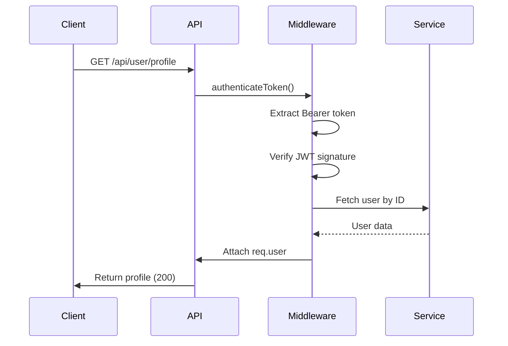
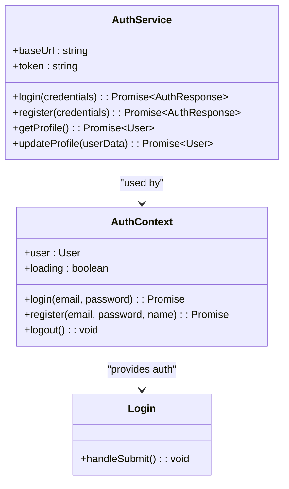

# Authentication API

<cite>
**Referenced Files in This Document**   
- [auth.controller.ts](file://pikzels-clone\src\modules\auth\auth.controller.ts)
- [auth.service.ts](file://pikzels-clone\src\modules\auth\auth.service.ts)
- [auth.routes.ts](file://pikzels-clone\src\modules\auth\auth.routes.ts)
- [profile.controller.ts](file://pikzels-clone\src\modules\auth\profile.controller.ts)
- [profile.routes.ts](file://pikzels-clone\src\modules\auth\profile.routes.ts)
- [auth.middleware.ts](file://pikzels-clone\src\middleware\auth.middleware.ts)
- [Login.tsx](file://pikzels-clone\client\src\components\auth\Login.tsx)
- [ForgotPassword.tsx](file://pikzels-clone\client\src\components\auth\ForgotPassword.tsx)
- [AuthContext.tsx](file://pikzels-clone\client\src\contexts\AuthContext.tsx)
- [auth.service.ts](file://pikzels-clone\shared\auth.service.ts)
</cite>

## Table of Contents
1. [Introduction](#introduction)
2. [Authentication Endpoints](#authentication-endpoints)
3. [Profile Management Endpoints](#profile-management-endpoints)
4. [Authentication Mechanism](#authentication-mechanism)
5. [Request and Response Schemas](#request-and-response-schemas)
6. [Error Handling](#error-handling)
7. [Security Best Practices](#security-best-practices)
8. [Frontend Integration](#frontend-integration)
9. [Usage Examples](#usage-examples)
10. [Conclusion](#conclusion)

## Introduction
This document provides comprehensive documentation for the Authentication API in the Thumbnail Maker application. The API supports user registration, login, password recovery, and profile management through secure endpoints. It uses JSON Web Tokens (JWT) for stateless authentication, bcrypt for password hashing, and middleware-based token validation to protect sensitive routes. The system integrates seamlessly with frontend components and follows security best practices including input validation and secure token handling.

**Section sources**
- [auth.controller.ts](file://pikzels-clone\src\modules\auth\auth.controller.ts#L1-L122)
- [auth.routes.ts](file://pikzels-clone\src\modules\auth\auth.routes.ts#L1-L16)

## Authentication Endpoints

### User Registration
- **Endpoint**: `POST /api/auth/register`
- **Purpose**: Creates a new user account
- **Request Body**:
  - `email`: string (required, must be valid email format)
  - `password`: string (required, minimum 6 characters)
  - `name`: string (optional)
- **Response**: 201 Created with user object and JWT token
- **Validation**: Email uniqueness enforced at database level

### User Login
- **Endpoint**: `POST /api/auth/login`
- **Purpose**: Authenticates user credentials and returns JWT token
- **Request Body**:
  - `email`: string (required)
  - `password`: string (required)
- **Response**: 200 OK with user object and JWT token
- **Security**: Constant-time comparison via bcrypt prevents timing attacks

### Password Recovery
- **Request Reset**: `POST /api/auth/request-password-reset`
  - Accepts email to initiate reset flow
  - Returns success message regardless of email existence (security)
- **Reset Password**: `POST /api/auth/reset-password`
  - Requires valid token and new password
  - Token expires after 7 days (same as JWT)

**Section sources**
- [auth.controller.ts](file://pikzels-clone\src\modules\auth\auth.controller.ts#L6-L120)
- [auth.service.ts](file://pikzels-clone\src\modules\auth\auth.service.ts#L9-L134)

## Profile Management Endpoints

### Get User Profile
- **Endpoint**: `GET /api/user/profile`
- **Method**: GET
- **Authentication**: Required (via Bearer token)
- **Response**: 200 OK with current user's profile data

### Update User Profile
- **Endpoint**: `PUT /api/user/profile`
- **Method**: PUT
- **Authentication**: Required
- **Request Body**:
  - `name`: string (optional)
- **Response**: 200 OK with updated user object

### Middleware Protection
All profile endpoints use `authenticateToken` middleware which:
- Extracts JWT from Authorization header
- Validates token signature and expiration
- Attaches user object to request context
- Rejects requests with invalid or missing tokens



**Diagram sources**
- [profile.routes.ts](file://pikzels-clone\src\modules\auth\profile.routes.ts#L1-L23)
- [auth.middleware.ts](file://pikzels-clone\src\middleware\auth.middleware.ts#L15-L53)

**Section sources**
- [profile.controller.ts](file://pikzels-clone\src\modules\auth\profile.controller.ts#L14-L56)
- [profile.routes.ts](file://pikzels-clone\src\modules\auth\profile.routes.ts#L1-L23)

## Authentication Mechanism

### JSON Web Tokens (JWT)
- **Algorithm**: HS256
- **Secret**: Environment variable `JWT_SECRET` (fallback: 'your-secret-key')
- **Payload**: `{ userId: string }`
- **Expiration**: 7 days (`expiresIn: '7d'`)
- **Storage**: Client-side localStorage (frontend)

### Token Validation Flow
1. Client sends token in `Authorization: Bearer <token>` header
2. Middleware verifies token using `jwt.verify()`
3. On success: user data retrieved from database and attached to request
4. On failure: appropriate 4xx error returned

### Session Handling
Stateless design using JWT eliminates server-side session storage. Token revocation handled by expiration only (no token blacklist implemented).

**Section sources**
- [auth.service.ts](file://pikzels-clone\src\modules\auth\auth.service.ts#L35-L67)
- [auth.middleware.ts](file://pikzels-clone\src\middleware\auth.middleware.ts#L28-L35)

## Request and Response Schemas

### Registration Request
```json
{
  "email": "user@example.com",
  "password": "securepassword",
  "name": "John Doe"
}
```

### Login Request
```json
{
  "email": "user@example.com",
  "password": "securepassword"
}
```

### Successful Response
```json
{
  "user": {
    "id": "uuid",
    "email": "user@example.com",
    "name": "John Doe"
  },
  "token": "jwt-string"
}
```

### Profile Response
```json
{
  "user": {
    "id": "uuid",
    "email": "user@example.com",
    "name": "John Doe"
  }
}
```

**Section sources**
- [auth.controller.ts](file://pikzels-clone\src\modules\auth\auth.controller.ts#L6-L120)
- [profile.controller.ts](file://pikzels-clone\src\modules\auth\profile.controller.ts#L14-L56)

## Error Handling

### Common Error Responses
| Status | Error | Description |
|--------|-------|-------------|
| 400 | "Email and password are required" | Missing credentials in login/register |
| 400 | "Password must be at least 6 characters long" | Weak password |
| 401 | "Invalid credentials" | Incorrect email/password |
| 401 | "Access token required" | Missing Authorization header |
| 403 | "Invalid or expired token" | Malformed or expired JWT |
| 409 | "User already exists" | Email already registered |

### Password Reset Errors
- 400: "Invalid or expired password reset token"
- 400: "Password reset token has expired"
- 400: "Token and new password are required"

All errors follow consistent JSON format: `{ "error": "message" }`

**Section sources**
- [auth.controller.ts](file://pikzels-clone\src\modules\auth\auth.controller.ts#L6-L120)
- [auth.service.ts](file://pikzels-clone\src\modules\auth\auth.service.ts#L9-L134)

## Security Best Practices

### Password Hashing
- **Library**: bcryptjs
- **Salt Rounds**: 10
- Hashing occurs during both registration and password reset

### Input Validation
- Required fields validated at controller level
- Email format enforced by client and assumed valid at server
- Password strength: minimum 6 characters

### Rate Limiting
Not currently implemented but recommended for production (e.g., 5 attempts/15 minutes)

### Secure Cookie Policies
Not applicable – stateless JWT authentication used instead of session cookies

### CSRF Protection
Implicitly handled by token-based authentication (no session cookies to protect)

**Section sources**
- [auth.service.ts](file://pikzels-clone\src\modules\auth\auth.service.ts#L20-L20)
- [auth.service.ts](file://pikzels-clone\src\modules\auth\auth.service.ts#L119-L119)

## Frontend Integration

### AuthContext Provider
- Centralized authentication state management
- Exposes `login`, `register`, `logout`, and `user` state
- Automatically checks localStorage for token on load
- ProtectedRoute component can leverage this context

### Component Integration
- **Login.tsx**: Handles credential submission and token storage
- **ForgotPassword.tsx**: Manages password reset request flow
- Both components use native fetch API to communicate with backend

### Shared Service
`shared/auth.service.ts` provides reusable methods for web and mobile clients:
- `login(credentials)`
- `register(credentials)`
- `getProfile()`
- `updateProfile(userData)`



**Diagram sources**
- [AuthContext.tsx](file://pikzels-clone\client\src\contexts\AuthContext.tsx#L1-L145)
- [Login.tsx](file://pikzels-clone\client\src\components\auth\Login.tsx#L1-L129)
- [shared/auth.service.ts](file://pikzels-clone\shared\auth.service.ts#L1-L140)

**Section sources**
- [AuthContext.tsx](file://pikzels-clone\client\src\contexts\AuthContext.tsx#L1-L145)
- [Login.tsx](file://pikzels-clone\client\src\components\auth\Login.tsx#L1-L129)
- [ForgotPassword.tsx](file://pikzels-clone\client\src\components\auth\ForgotPassword.tsx#L1-L107)

## Usage Examples

### cURL Examples

**User Registration**
```bash
curl -X POST http://localhost:3000/api/auth/register \
  -H "Content-Type: application/json" \
  -d '{"email":"user@example.com","password":"password123","name":"John Doe"}'
```

**User Login**
```bash
curl -X POST http://localhost:3000/api/auth/login \
  -H "Content-Type: application/json" \
  -d '{"email":"user@example.com","password":"password123"}'
```

**Get Profile (Authenticated)**
```bash
curl -X GET http://localhost:3000/api/user/profile \
  -H "Authorization: Bearer your-jwt-token-here"
```

### JavaScript Examples

**Using Fetch API**
```javascript
// Login request
const response = await fetch('/api/auth/login', {
  method: 'POST',
  headers: { 'Content-Type': 'application/json' },
  body: JSON.stringify({ email, password })
});

const data = await response.json();
if (response.ok) {
  localStorage.setItem('token', data.token);
}
```

**Using Shared AuthService**
```javascript
import { AuthService } from '../shared/auth.service';

const api = new AuthService('http://localhost:3000');
try {
  const result = await api.login({ email, password });
  console.log('Logged in:', result.user);
} catch (error) {
  console.error('Login failed:', error.message);
}
```

**Section sources**
- [Login.tsx](file://pikzels-clone\client\src\components\auth\Login.tsx#L1-L129)
- [shared/auth.service.ts](file://pikzels-clone\shared\auth.service.ts#L48-L85)

## Conclusion
The Authentication API provides a secure, well-structured foundation for user management in the Thumbnail Maker application. It implements industry-standard practices including JWT-based authentication, bcrypt password hashing, and proper error handling. The separation of concerns between routes, controllers, and services ensures maintainability, while the shared service enables consistent integration across platforms. Frontend components are properly integrated through context providers and reusable service classes. For production deployment, additional security measures like rate limiting and token revocation should be considered.