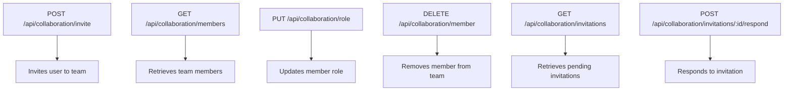
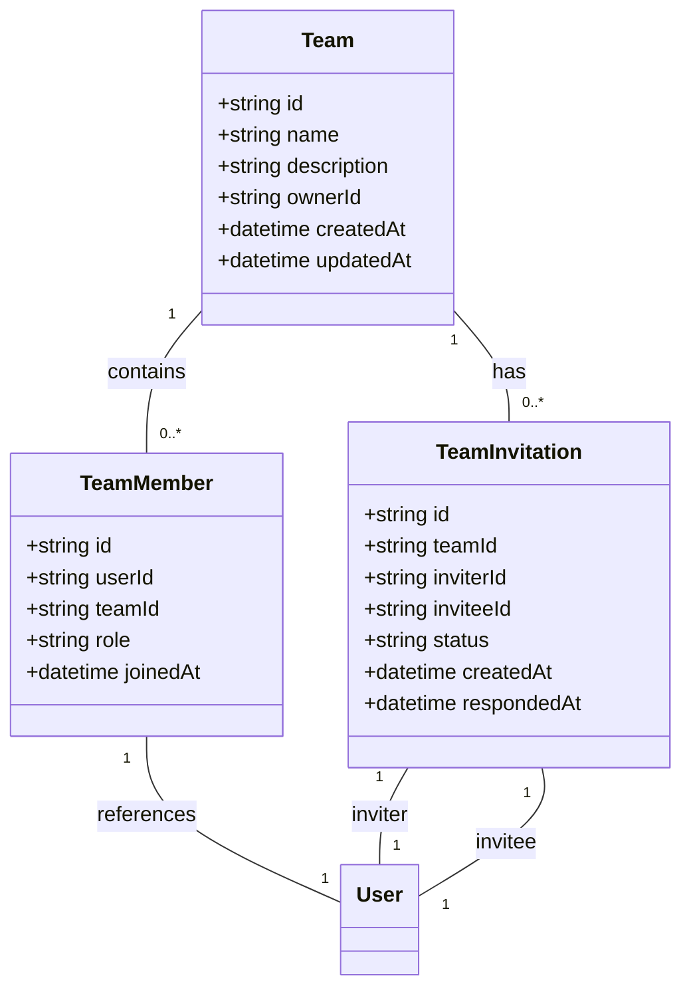
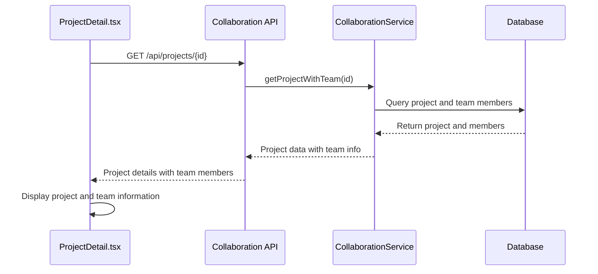
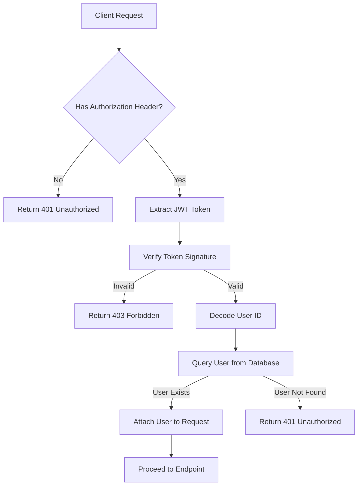

# Collaboration API

<cite>
**Referenced Files in This Document**   
- [collaboration.controller.ts](file://src/modules/collaboration/collaboration.controller.ts)
- [collaboration.service.ts](file://src/modules/collaboration/collaboration.service.ts)
- [collaboration.routes.ts](file://src/modules/collaboration/collaboration.routes.ts)
- [ProjectDetail.tsx](file://client/src/components/projects/ProjectDetail.tsx)
</cite>

## Table of Contents
1. [Introduction](#introduction)
2. [API Endpoints](#api-endpoints)
3. [Request and Response Formats](#request-and-response-formats)
4. [Role-Based Access Control (RBAC)](#role-based-access-control-rbac)
5. [Integration with ProjectDetail.tsx](#integration-with-projectdetailtsx)
6. [Security Considerations](#security-considerations)
7. [Rate Limiting](#rate-limiting)

## Introduction

The Collaboration API enables team-based project work by providing endpoints for team management, member invitations, role assignments, and access control. This API allows users to create teams, invite members, manage roles, and control access to projects. The system implements role-based access control (RBAC) with distinct permission levels to ensure appropriate access to team resources.

The API is designed to support collaborative workflows where multiple users can work on projects together, with clear ownership and permission structures. It integrates with the frontend component ProjectDetail.tsx to display team information and manage project access.

## API Endpoints

The Collaboration API provides several endpoints for managing team collaboration:



**Diagram sources**
- [collaboration.routes.ts](file://src/modules/collaboration/collaboration.routes.ts#L20-L45)
- [collaboration.controller.ts](file://src/modules/collaboration/collaboration.controller.ts#L120-L260)

**Section sources**
- [collaboration.routes.ts](file://src/modules/collaboration/collaboration.routes.ts#L1-L46)
- [collaboration.controller.ts](file://src/modules/collaboration/collaboration.controller.ts#L1-L260)

## Request and Response Formats

### Invitation Request (POST /api/collaboration/invite)

The invitation endpoint requires the following payload structure:

```json
{
  "inviteeEmail": "user@example.com"
}
```

The response returns invitation details including team information, inviter details, and invitation status.

### Role Update Request (PUT /api/collaboration/role)

The role update endpoint requires the following payload:

```json
{
  "role": "viewer|editor|admin"
}
```

The response returns updated member information with the new role assignment.

### Member List Response (GET /api/collaboration/members)

The members endpoint returns a list of team members with their roles and user information:

```json
[
  {
    "id": "string",
    "role": "owner|admin|member",
    "user": {
      "id": "string",
      "name": "string",
      "email": "string",
      "avatarUrl": "string"
    },
    "joinedAt": "datetime"
  }
]
```

**Section sources**
- [collaboration.controller.ts](file://src/modules/collaboration/collaboration.controller.ts#L120-L260)
- [collaboration.service.ts](file://src/modules/collaboration/collaboration.service.ts#L4-L432)

## Role-Based Access Control (RBAC)

The Collaboration API implements a role-based access control system with the following roles:

- **Owner**: Full control over the team, can manage members, update team information, and delete the team
- **Admin**: Can invite members and remove members, but cannot delete the team
- **Member**: Can view team information and projects, but cannot modify team structure



**Diagram sources**
- [collaboration.service.ts](file://src/modules/collaboration/collaboration.service.ts#L4-L432)
- [collaboration.controller.ts](file://src/modules/collaboration/collaboration.controller.ts#L1-L260)

**Section sources**
- [collaboration.service.ts](file://src/modules/collaboration/collaboration.service.ts#L4-L432)

## Integration with ProjectDetail.tsx

The Collaboration API integrates with the ProjectDetail.tsx component to display team information and manage project access. When a user views a project, the component fetches project details including team membership information.



**Diagram sources**
- [ProjectDetail.tsx](file://client/src/components/projects/ProjectDetail.tsx#L10-L183)
- [collaboration.service.ts](file://src/modules/collaboration/collaboration.service.ts#L4-L432)

**Section sources**
- [ProjectDetail.tsx](file://client/src/components/projects/ProjectDetail.tsx#L10-L183)

## Security Considerations

The Collaboration API implements several security measures to protect team data and prevent unauthorized access:

### Permission Escalation Protection

The system prevents privilege escalation by enforcing strict role-based authorization:

- Only team owners can update member roles
- Only owners and admins can remove members
- Team owners cannot be removed by other members
- Users cannot change their own role

### Audit Logging

All access changes are automatically logged through the database operations:

- Team creation and deletion
- Member invitations and responses
- Role changes
- Member removals

These logs are maintained in the database and can be queried for audit purposes.

### Authentication

All endpoints require authentication via JWT tokens:



**Diagram sources**
- [auth.middleware.ts](file://src/middleware/auth.middleware.ts#L15-L53)
- [collaboration.controller.ts](file://src/modules/collaboration/collaboration.controller.ts#L1-L260)

**Section sources**
- [auth.middleware.ts](file://src/middleware/auth.middleware.ts#L15-L53)
- [collaboration.service.ts](file://src/modules/collaboration/collaboration.service.ts#L4-L432)

## Rate Limiting

While the current implementation does not include explicit rate limiting on invitation sends, this is a recommended enhancement to prevent abuse. Implementing rate limiting would help prevent:

- Spamming users with unwanted invitations
- Brute force attacks on user email addresses
- Resource exhaustion through excessive invitation creation

A recommended approach would be to limit users to a certain number of invitations per time period (e.g., 10 invitations per hour) based on their user ID or IP address.

**Section sources**
- [collaboration.service.ts](file://src/modules/collaboration/collaboration.service.ts#L4-L432)