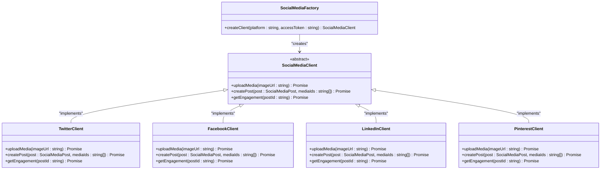
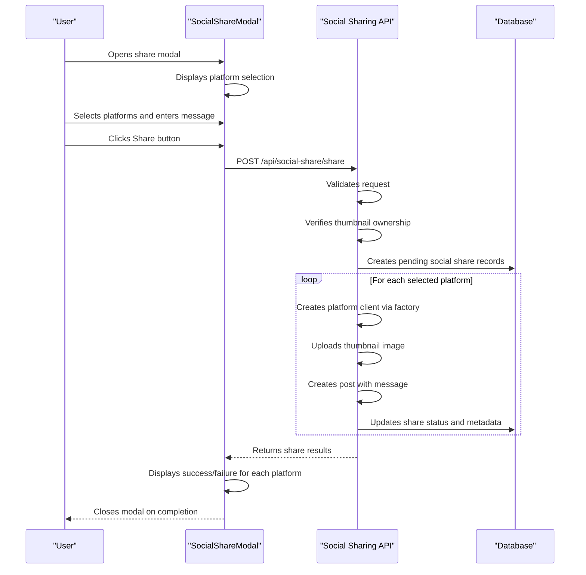

# Social Sharing API

<cite>
**Referenced Files in This Document**   
- [social-share.controller.ts](file://pikzels-clone/src/modules/social-share/social-share.controller.ts)
- [social-share.service.ts](file://pikzels-clone/src/modules/social-share/social-share.service.ts)
- [social-media-factory.ts](file://pikzels-clone/src/modules/social-share/social-media-factory.ts)
- [social-media-client.ts](file://pikzels-clone/src/modules/social-share/social-media-client.ts)
- [twitter-client.ts](file://pikzels-clone/src/modules/social-share/twitter-client.ts)
- [facebook-client.ts](file://pikzels-clone/src/modules/social-share/facebook-client.ts)
- [linkedin-client.ts](file://pikzels-clone/src/modules/social-share/linkedin-client.ts)
- [pinterest-client.ts](file://pikzels-clone/src/modules/social-share/pinterest-client.ts)
- [social-share.routes.ts](file://pikzels-clone/src/modules/social-share/social-share.routes.ts)
- [SocialShareModal.tsx](file://pikzels-clone/client/src/components/SocialShareModal.tsx)
</cite>

## Table of Contents
1. [Introduction](#introduction)
2. [API Endpoints](#api-endpoints)
3. [Request and Response Schema](#request-and-response-schema)
4. [Social Media Client Factory Pattern](#social-media-client-factory-pattern)
5. [Error Handling](#error-handling)
6. [Integration with SocialShareModal](#integration-with-socialsharemodal)
7. [OAuth Token Management](#oauth-token-management)
8. [Platform Compliance and Content Moderation](#platform-compliance-and-content-moderation)
9. [Examples](#examples)
10. [Conclusion](#conclusion)

## Introduction

The Social Sharing API enables users to share thumbnails across multiple social media platforms including Facebook, Twitter, LinkedIn, and Pinterest. The API provides a unified interface for cross-platform sharing while handling platform-specific requirements through an abstraction layer. This documentation details the API endpoints, request/response schemas, implementation patterns, and integration points.

**Section sources**
- [social-share.controller.ts](file://pikzels-clone/src/modules/social-share/social-share.controller.ts#L16-L281)
- [SocialShareModal.tsx](file://pikzels-clone/client/src/components/SocialShareModal.tsx#L9-L168)

## API Endpoints

The Social Sharing API provides several endpoints for sharing content and retrieving share history:

### POST /api/social-share/share
Shares a thumbnail to one or more social media platforms.

### GET /api/social-share/
Retrieves the user's social share history with optional filters for platform, status, and thumbnail ID.

### GET /api/social-share/stats
Retrieves social sharing statistics grouped by platform and status.

### GET /api/social-share/thumbnail/:thumbnailId
Retrieves all social shares associated with a specific thumbnail.

### DELETE /api/social-share/:id
Deletes a social share record.

**Section sources**
- [social-share.routes.ts](file://pikzels-clone/src/modules/social-share/social-share.routes.ts#L1-L26)
- [social-share.controller.ts](file://pikzels-clone/src/modules/social-share/social-share.controller.ts#L16-L281)

## Request and Response Schema

### Request Body for POST /api/social-share/share

```json
{
  "thumbnailId": "string",
  "platforms": ["string"],
  "message": "string"
}
```

- **thumbnailId**: The ID of the thumbnail to share (required)
- **platforms**: Array of platform identifiers (required): "facebook", "twitter", "linkedin", "pinterest"
- **message**: Optional caption or message to include with the share

### Response Schema

```json
{
  "message": "string",
  "results": [
    {
      "platform": "string",
      "success": "boolean",
      "shareUrl": "string",
      "shareId": "string",
      "error": "string"
    }
  ]
}
```

- **message**: Status message indicating completion
- **results**: Array of platform-specific share results containing:
  - **platform**: Platform identifier
  - **success**: Boolean indicating share success
  - **shareUrl**: URL of the published post (on success)
  - **shareId**: Platform-specific identifier for the post (on success)
  - **error**: Error message (on failure)

**Section sources**
- [social-share.controller.ts](file://pikzels-clone/src/modules/social-share/social-share.controller.ts#L20-L171)
- [social-share.service.ts](file://pikzels-clone/src/modules/social-share/social-share.service.ts#L4-L130)

## Social Media Client Factory Pattern

The API implements a factory pattern to handle different social media platform APIs uniformly. The `SocialMediaFactory` creates platform-specific client instances based on the requested platform.



**Diagram sources**
- [social-media-factory.ts](file://pikzels-clone/src/modules/social-share/social-media-factory.ts#L6-L25)
- [social-media-client.ts](file://pikzels-clone/src/modules/social-share/social-media-client.ts#L1-L69)
- [twitter-client.ts](file://pikzels-clone/src/modules/social-share/twitter-client.ts#L6-L128)
- [facebook-client.ts](file://pikzels-clone/src/modules/social-share/facebook-client.ts#L6-L130)
- [linkedin-client.ts](file://pikzels-clone/src/modules/social-share/linkedin-client.ts#L6-L130)
- [pinterest-client.ts](file://pikzels-clone/src/modules/social-share/pinterest-client.ts#L6-L136)

## Error Handling

The API handles various error conditions with appropriate HTTP status codes and error responses:

### Common Error Responses

- **400 Bad Request**: Missing required fields (thumbnailId, platforms)
- **401 Unauthorized**: User not authenticated
- **403 Forbidden**: User does not own the requested thumbnail
- **404 Not Found**: Thumbnail or social share record not found
- **500 Internal Server Error**: Unexpected server error

### Platform-Specific Errors

- **No access token**: When the user hasn't connected a platform account
- **Content validation errors**: When post content violates platform rules (length, content type)
- **Rate limiting**: When platform API rate limits are exceeded
- **Media upload failures**: When image upload to platform fails
- **Post creation failures**: When platform rejects the post content

The API records detailed error information in the social share database, including error messages and timestamps.

**Section sources**
- [social-share.controller.ts](file://pikzels-clone/src/modules/social-share/social-share.controller.ts#L20-L171)
- [twitter-client.ts](file://pikzels-clone/src/modules/social-share/twitter-client.ts#L6-L128)
- [facebook-client.ts](file://pikzels-clone/src/modules/social-share/facebook-client.ts#L6-L130)

## Integration with SocialShareModal

The Social Sharing API is integrated with the `SocialShareModal` component in the client application. This modal provides a user interface for selecting platforms, entering a message, and initiating the sharing process.



**Diagram sources**
- [SocialShareModal.tsx](file://pikzels-clone/client/src/components/SocialShareModal.tsx#L9-L168)
- [social-share.controller.ts](file://pikzels-clone/src/modules/social-share/social-share.controller.ts#L20-L171)

## OAuth Token Management

OAuth tokens for social media platforms are managed through the user settings system. When a user connects a social media account, the access token is securely stored in the user's settings. The Social Sharing API retrieves these tokens when needed for sharing operations.

Tokens are validated before use, and the system handles token expiration by prompting users to re-authenticate when necessary. The current implementation uses a placeholder for token storage, with the actual implementation requiring integration with the authentication service.

**Section sources**
- [social-share.controller.ts](file://pikzels-clone/src/modules/social-share/social-share.controller.ts#L20-L171)
- [social-share.service.ts](file://pikzels-clone/src/modules/social-share/social-share.service.ts#L4-L130)

## Platform Compliance and Content Moderation

The API implements platform-specific validation rules to ensure compliance with each social media platform's policies:

- **Twitter**: Maximum 280 characters for text content
- **Facebook**: Maximum 63,206 characters for posts
- **LinkedIn**: Maximum 3,000 characters for posts
- **Pinterest**: Maximum 500 characters for pin descriptions, requires image

Content is validated before submission to prevent rejected posts. The validation includes checking for required fields, character limits, and proper media attachment. Moderated content detection is not currently implemented but could be integrated with AI content analysis services.

**Section sources**
- [twitter-client.ts](file://pikzels-clone/src/modules/social-share/twitter-client.ts#L6-L128)
- [facebook-client.ts](file://pikzels-clone/src/modules/social-share/facebook-client.ts#L6-L130)
- [linkedin-client.ts](file://pikzels-clone/src/modules/social-share/linkedin-client.ts#L6-L130)
- [pinterest-client.ts](file://pikzels-clone/src/modules/social-share/pinterest-client.ts#L6-L136)

## Examples

### Sharing to Multiple Platforms

```json
POST /api/social-share/share
{
  "thumbnailId": "thumb_123",
  "platforms": ["twitter", "facebook", "linkedin"],
  "message": "Check out my new thumbnail design! #graphicdesign"
}
```

Response:
```json
{
  "message": "Social sharing completed",
  "results": [
    {
      "platform": "twitter",
      "success": true,
      "shareUrl": "https://twitter.com/user/status/123",
      "shareId": "123"
    },
    {
      "platform": "facebook",
      "success": true,
      "shareUrl": "https://facebook.com/post/456",
      "shareId": "456"
    },
    {
      "platform": "linkedin",
      "success": false,
      "error": "No access token for linkedin"
    }
  ]
}
```

### Retrieving Share History

```json
GET /api/social-share/?platform=twitter&status=success
```

Response:
```json
{
  "socialShares": [
    {
      "id": "share_789",
      "thumbnailId": "thumb_123",
      "userId": "user_456",
      "platform": "twitter",
      "status": "success",
      "shareUrl": "https://twitter.com/user/status/123",
      "shareId": "123",
      "sharedAt": "2025-01-15T10:30:00Z"
    }
  ]
}
```

**Section sources**
- [social-share.controller.ts](file://pikzels-clone/src/modules/social-share/social-share.controller.ts#L20-L171)
- [social-share.service.ts](file://pikzels-clone/src/modules/social-share/social-share.service.ts#L4-L130)

## Conclusion

The Social Sharing API provides a robust solution for cross-platform thumbnail sharing with a clean, consistent interface. The factory pattern implementation allows for easy extension to additional platforms while maintaining code organization. The API handles authentication, validation, error reporting, and persistence of share records. Integration with the client-side modal provides a seamless user experience for sharing content across multiple social networks simultaneously.