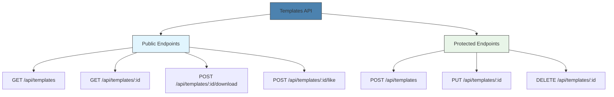
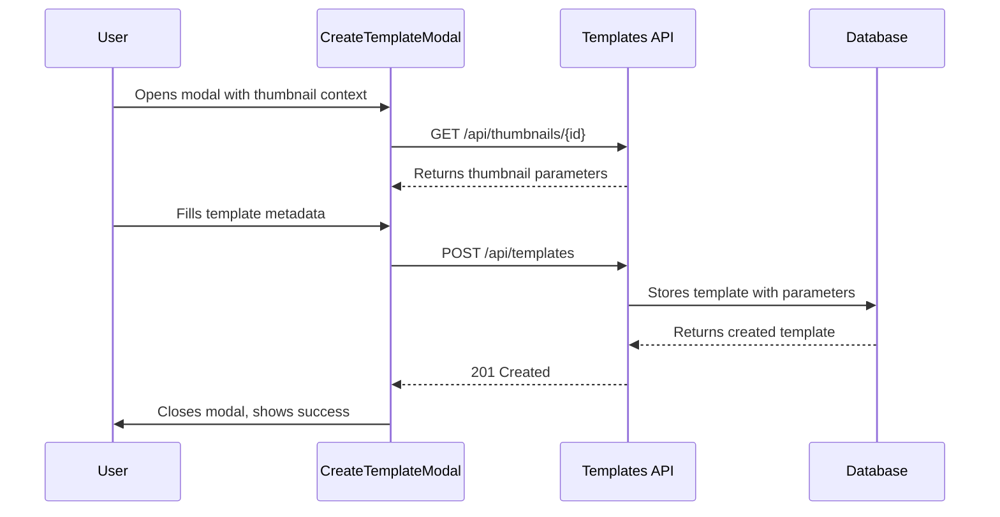
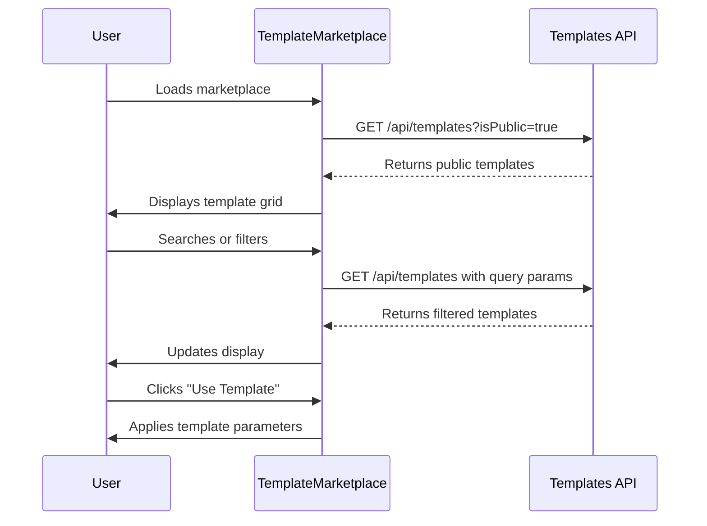

# Templates API

<cite>
**Referenced Files in This Document**   
- [template.controller.ts](file://pikzels-clone/src/modules/templates/template.controller.ts)
- [template.routes.ts](file://pikzels-clone/src/modules/templates/template.routes.ts)
- [template.service.ts](file://pikzels-clone/src/modules/templates/template.service.ts)
- [CreateTemplateModal.tsx](file://pikzels-clone/client/src/components/templates/CreateTemplateModal.tsx)
- [TemplateMarketplace.tsx](file://pikzels-clone/client/src/components/templates/TemplateMarketplace.tsx)
- [template-marketplace.md](file://pikzels-clone/docs/template-marketplace.md)
</cite>

## Table of Contents
1. [Introduction](#introduction)
2. [API Endpoints](#api-endpoints)
3. [Request and Response Formats](#request-and-response-formats)
4. [Template Versioning and Updates](#template-versioning-and-updates)
5. [Integration with Frontend Components](#integration-with-frontend-components)
6. [Template Validation Rules](#template-validation-rules)
7. [Performance Optimization](#performance-optimization)
8. [Security Considerations](#security-considerations)
9. [Usage Examples](#usage-examples)
10. [Conclusion](#conclusion)

## Introduction

The Templates API provides a comprehensive system for creating, managing, and sharing thumbnail templates within the application. This API enables users to convert their thumbnail designs into reusable templates, share them with the community through a marketplace, and apply existing templates to new projects. The system is designed to support both individual template management and community-driven template sharing, with features for categorization, search, and usage tracking.

The API follows RESTful principles and is organized around the template resource, providing standard CRUD operations along with additional functionality for template discovery and engagement metrics. The system is integrated with the application's authentication mechanism to ensure proper access control and ownership management.

**Section sources**
- [template-marketplace.md](file://pikzels-clone/docs/template-marketplace.md#L1-L20)

## API Endpoints

The Templates API provides a comprehensive set of endpoints for template management and marketplace functionality. These endpoints are organized to separate public and protected operations, with appropriate authentication requirements.



**Diagram sources**
- [template.routes.ts](file://pikzels-clone/src/modules/templates/template.routes.ts#L1-L27)

### POST /api/templates

Creates a new template from an existing thumbnail configuration. This endpoint requires authentication and validates that the user has access to the source thumbnail.

**Section sources**
- [template.controller.ts](file://pikzels-clone/src/modules/templates/template.controller.ts#L8-L32)
- [template.service.ts](file://pikzels-clone/src/modules/templates/template.service.ts#L8-L28)

### GET /api/templates

Retrieves a list of templates with optional filtering, sorting, and pagination. Public templates can be accessed without authentication, while private templates require authentication and ownership verification.

**Section sources**
- [template.controller.ts](file://pikzels-clone/src/modules/templates/template.controller.ts#L34-L76)
- [template.service.ts](file://pikzels-clone/src/modules/templates/template.service.ts#L33-L109)

### GET /api/templates/:id

Retrieves a specific template by its unique identifier. Returns detailed information including template metadata, parameters, and creator information.

**Section sources**
- [template.controller.ts](file://pikzels-clone/src/modules/templates/template.controller.ts#L78-L98)
- [template.service.ts](file://pikzels-clone/src/modules/templates/template.service.ts#L114-L137)

### PUT /api/templates/:id

Updates an existing template's metadata and properties. This operation requires authentication and verifies that the user is the template's creator.

**Section sources**
- [template.controller.ts](file://pikzels-clone/src/modules/templates/template.controller.ts#L100-L132)
- [template.service.ts](file://pikzels-clone/src/modules/templates/template.service.ts#L142-L171)

### DELETE /api/templates/:id

Removes a template from the system. This operation requires authentication and verifies ownership of the template.

**Section sources**
- [template.controller.ts](file://pikzels-clone/src/modules/templates/template.controller.ts#L134-L164)
- [template.service.ts](file://pikzels-clone/src/modules/templates/template.service.ts#L176-L180)

## Request and Response Formats

### Request Body Schema

When creating or updating a template, the request body must include the following properties:

```json
{
  "name": "Template Name",
  "description": "Template description",
  "thumbnailId": "source-thumbnail-id",
  "parameters": {
    "layout": "grid",
    "colors": ["#ff0000", "#0000ff"],
    "fonts": ["Arial", "Helvetica"],
    "placeholders": [
      {
        "type": "text",
        "position": { "x": 100, "y": 200 },
        "size": 24,
        "text": "Sample Text"
      }
    ]
  },
  "tags": ["bold", "modern", "red"],
  "isPublic": true
}
```

The `parameters` field captures the complete configuration of the source thumbnail, including layout, color schemes, font selections, and placeholder positions for text and media elements.

**Section sources**
- [template.controller.ts](file://pikzels-clone/src/modules/templates/template.controller.ts#L10-L15)
- [template.service.ts](file://pikzels-clone/src/modules/templates/template.service.ts#L8-L12)

### Response Format

Template responses include comprehensive metadata, usage statistics, and categorization information:

```json
{
  "id": "template-123",
  "name": "Bold Modern Design",
  "description": "A bold and modern thumbnail template",
  "thumbnail": {
    "id": "thumbnail-456",
    "title": "Sample Thumbnail",
    "imageUrl": "/processed-images/sample.jpg"
  },
  "creator": {
    "id": "user-789",
    "name": "John Doe",
    "avatarUrl": "/avatars/john.jpg"
  },
  "parameters": {
    "layout": "grid",
    "colors": ["#ff0000", "#0000ff"],
    "fonts": ["Arial", "Helvetica"],
    "placeholders": [
      {
        "type": "text",
        "position": { "x": 100, "y": 200 },
        "size": 24,
        "text": "Sample Text"
      }
    ]
  },
  "tags": ["bold", "modern", "red"],
  "isPublic": true,
  "downloads": 42,
  "likes": 15,
  "createdAt": "2023-01-01T00:00:00.000Z",
  "updatedAt": "2023-01-01T00:00:00.000Z"
}
```

The response includes nested objects for the source thumbnail and creator, providing context for template discovery and attribution.

**Section sources**
- [template.controller.ts](file://pikzels-clone/src/modules/templates/template.controller.ts#L88-L95)
- [template.service.ts](file://pikzels-clone/src/modules/templates/template.service.ts#L114-L137)

## Template Versioning and Updates

The current implementation of the Templates API does not include explicit versioning for templates. When a template is updated via the PUT endpoint, the changes are applied directly to the existing template record. This approach ensures that any projects or users referencing the template will automatically receive the updated configuration.

To prevent breaking existing projects that depend on a template, the system maintains backward compatibility by preserving the structure of the parameters object. When updating a template, only the specified fields are modified, while other configuration aspects remain unchanged. This allows for incremental improvements to templates without disrupting existing usage.

The API does not currently support maintaining multiple versions of the same template or rolling back to previous versions. Each template is represented as a single entity with a creation timestamp and last update timestamp, but no version history is maintained.

**Section sources**
- [template-marketplace.md](file://pikzels-clone/docs/template-marketplace.md#L270-L275)
- [template.service.ts](file://pikzels-clone/src/modules/templates/template.service.ts#L142-L171)

## Integration with Frontend Components

The Templates API is integrated with two key frontend components that provide user interfaces for template creation and marketplace browsing.

### CreateTemplateModal Component

The `CreateTemplateModal` component enables users to convert their current thumbnail design into a reusable template. This modal interface collects template metadata including name, description, tags, and visibility settings.



**Diagram sources**
- [CreateTemplateModal.tsx](file://pikzels-clone/client/src/components/templates/CreateTemplateModal.tsx#L1-L187)
- [template.controller.ts](file://pikzels-clone/src/modules/templates/template.controller.ts#L8-L32)

### TemplateMarketplace Component

The `TemplateMarketplace` component provides a browsing interface for discovering and using templates from the community. It displays templates with search, filtering, and sorting capabilities.



**Diagram sources**
- [TemplateMarketplace.tsx](file://pikzels-clone/client/src/components/templates/TemplateMarketplace.tsx#L1-L253)
- [template.controller.ts](file://pikzels-clone/src/modules/templates/template.controller.ts#L34-L76)

## Template Validation Rules

The Templates API implements several validation rules to ensure data integrity and consistency:

1. **Required Fields**: Name, thumbnailId, and parameters are required for template creation
2. **Ownership Verification**: Users can only modify or delete templates they created
3. **Input Sanitization**: All string inputs are trimmed and validated for appropriate length
4. **Tag Validation**: Tags are limited to alphanumeric characters and common symbols
5. **Parameter Structure**: The parameters object must conform to the expected schema for thumbnail configurations

The API performs validation at both the controller and service layers, with detailed error messages returned for invalid requests. Authentication is required for all write operations, and appropriate HTTP status codes are used to indicate success or failure conditions.

**Section sources**
- [template.controller.ts](file://pikzels-clone/src/modules/templates/template.controller.ts#L17-L25)
- [template-marketplace.md](file://pikzels-clone/docs/template-marketplace.md#L350-L360)

## Performance Optimization

The Templates API includes several performance optimizations to ensure responsive template operations:

1. **Database Indexing**: The template table is indexed on frequently queried fields including isPublic, creatorId, and tags to accelerate filtering operations
2. **Pagination**: Template listing endpoints support pagination with a default limit of 20 items per page and a maximum of 100 to prevent excessive data transfer
3. **Selective Field Inclusion**: Database queries use Prisma's include feature to only retrieve necessary related data, reducing query overhead
4. **JSON Storage**: Tags are stored as JSON arrays in the database, enabling efficient querying and retrieval
5. **Caching Considerations**: While not explicitly implemented, the API design supports future caching of public template listings to reduce database load

The service layer implements efficient query building based on provided filters, minimizing database load and response times for template discovery operations.

**Section sources**
- [template.service.ts](file://pikzels-clone/src/modules/templates/template.service.ts#L33-L109)
- [template-marketplace.md](file://pikzels-clone/docs/template-marketplace.md#L360-L370)

## Security Considerations

The Templates API implements several security measures to protect user data and prevent unauthorized access:

1. **Authentication**: All write operations (create, update, delete) require valid authentication tokens
2. **Authorization**: Users can only modify templates they own, with ownership verified on each protected operation
3. **Input Validation**: All user inputs are validated to prevent injection attacks and ensure data integrity
4. **Parameterized Queries**: Database operations use Prisma ORM with parameterized queries to prevent SQL injection
5. **Rate Limiting**: While not explicitly shown in the code, the API should implement rate limiting to prevent abuse of template creation endpoints
6. **Content Security**: User-generated template parameters are treated as structured data rather than executable code, reducing the risk of XSS attacks

The system follows the principle of least privilege, ensuring that users only have access to templates they created or that are marked as public.

**Section sources**
- [template.controller.ts](file://pikzels-clone/src/modules/templates/template.controller.ts#L105-L115)
- [template-marketplace.md](file://pikzels-clone/docs/template-marketplace.md#L370-L387)

## Usage Examples

### Creating a Custom Template from a Thumbnail

To create a custom template from an existing thumbnail, follow these steps:

1. Open the thumbnail you want to convert to a template
2. Click the "Create Template" button to open the CreateTemplateModal
3. Enter a name and optional description for your template
4. Add relevant tags to help others discover your template
5. Choose whether to make your template public or private
6. Click "Create Template" to save your template

The system will capture all the current configuration of your thumbnail, including layout, colors, fonts, and placeholder positions, and save it as a reusable template.

**Section sources**
- [CreateTemplateModal.tsx](file://pikzels-clone/client/src/components/templates/CreateTemplateModal.tsx#L1-L187)

### Browsing Marketplace Templates

To browse and use templates from the marketplace:

1. Navigate to the Template Marketplace page
2. Browse the grid of available public templates
3. Use the search box to find templates by name or description
4. Filter templates by tags to find designs that match your needs
5. Click "Use Template" on a template to apply its configuration to your current project

The marketplace displays template usage statistics including download counts and likes to help you identify popular and effective designs.

**Section sources**
- [TemplateMarketplace.tsx](file://pikzels-clone/client/src/components/templates/TemplateMarketplace.tsx#L1-L253)

## Conclusion

The Templates API provides a robust foundation for template creation, management, and sharing within the application. By following RESTful principles and implementing appropriate security measures, the API enables users to create and share thumbnail designs while maintaining data integrity and access control.

The integration with frontend components like CreateTemplateModal and TemplateMarketplace provides an intuitive user experience for template operations. While the current implementation lacks explicit versioning, it ensures backward compatibility for template updates.

Future enhancements could include template versioning, improved search capabilities, and additional engagement features like template ratings and comments. The API's modular design makes it well-suited for these future extensions while maintaining compatibility with existing functionality.