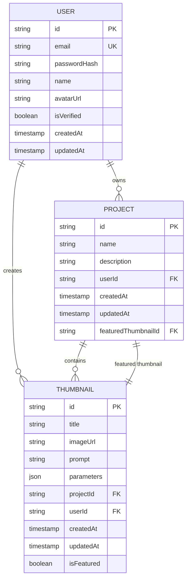

# Thumbnail API

<cite>
**Referenced Files in This Document**   
- [thumbnail.controller.ts](file://pikzels-clone\src\modules\thumbnail\thumbnail.controller.ts)
- [thumbnail.routes.ts](file://pikzels-clone\src\modules\thumbnail\thumbnail.routes.ts)
- [thumbnail.public.routes.ts](file://pikzels-clone\src\modules\thumbnail\thumbnail.public.routes.ts)
- [thumbnail.service.ts](file://pikzels-clone\src\modules\thumbnail\thumbnail.service.ts)
- [ai.service.ts](file://pikzels-clone\src\modules\thumbnail\ai.service.ts)
- [image-processing.service.ts](file://pikzels-clone\src\modules\thumbnail\image-processing.service.ts)
- [ThumbnailEditor.tsx](file://pikzels-clone\client\src\components\ThumbnailEditor.tsx)
- [SetFeaturedThumbnail.tsx](file://pikzels-clone\client\src\components\SetFeaturedThumbnail.tsx)
- [ai-thumbnail-generation.md](file://pikzels-clone\docs\api\ai-thumbnail-generation.md)
- [project-thumbnail-association.md](file://pikzels-clone\docs\api\project-thumbnail-association.md)
</cite>

## Table of Contents
1. [Introduction](#introduction)
2. [Core Endpoints](#core-endpoints)
3. [AI Thumbnail Generation](#ai-thumbnail-generation)
4. [Image Processing Options](#image-processing-options)
5. [Public Access and Sharing](#public-access-and-sharing)
6. [Frontend Integration](#frontend-integration)
7. [Error Handling](#error-handling)
8. [Data Models](#data-models)

## Introduction
The Thumbnail API provides a comprehensive system for creating, managing, and sharing thumbnails within the Pikzels application. The API supports both AI-generated thumbnails from text prompts and manual editing of existing thumbnails. It enables users to associate thumbnails with projects, set featured thumbnails, and share thumbnails publicly. The system integrates with AI services for automated thumbnail creation and includes robust image processing capabilities for customization.

**Section sources**
- [thumbnail.controller.ts](file://pikzels-clone\src\modules\thumbnail\thumbnail.controller.ts#L1-L735)
- [thumbnail.routes.ts](file://pikzels-clone\src\modules\thumbnail\thumbnail.routes.ts#L1-L56)

## Core Endpoints
The Thumbnail API provides standard RESTful endpoints for thumbnail management with authentication protection.

### Create Thumbnail
**POST** `/api/thumbnails`

Creates a new thumbnail with specified parameters.

**Request Body**
```json
{
  "title": "My Thumbnail",
  "imageUrl": "https://example.com/image.png",
  "prompt": "A beautiful landscape",
  "parameters": {
    "style": "bold"
  },
  "projectId": "project-123"
}
```

**Response (201 Created)**
```json
{
  "thumbnail": {
    "id": "thumbnail-123",
    "title": "My Thumbnail",
    "imageUrl": "https://example.com/image.png",
    "prompt": "A beautiful landscape",
    "parameters": {
      "style": "bold"
    },
    "projectId": "project-123",
    "userId": "user-123",
    "createdAt": "2023-01-01T00:00:00.000Z",
    "updatedAt": "2023-01-01T00:00:00.000Z"
  }
}
```

### Retrieve Thumbnail
**GET** `/api/thumbnails/:id`

Retrieves a specific thumbnail by ID.

**Response (200 OK)**
```json
{
  "thumbnail": {
    "id": "thumbnail-123",
    "title": "My Thumbnail",
    "imageUrl": "https://example.com/image.png",
    "prompt": "A beautiful landscape",
    "parameters": {
      "style": "bold"
    },
    "projectId": "project-123",
    "userId": "user-123",
    "createdAt": "2023-01-01T00:00:00.000Z",
    "updatedAt": "2023-01-01T00:00:00.000Z"
  }
}
```

### Update Thumbnail
**PUT** `/api/thumbnails/:id`

Updates an existing thumbnail.

**Request Body**
```json
{
  "title": "Updated Thumbnail",
  "parameters": {
    "style": "dramatic"
  }
}
```

**Response (200 OK)**
```json
{
  "thumbnail": {
    "id": "thumbnail-123",
    "title": "Updated Thumbnail",
    "imageUrl": "https://example.com/image.png",
    "prompt": "A beautiful landscape",
    "parameters": {
      "style": "dramatic"
    },
    "projectId": "project-123",
    "userId": "user-123",
    "createdAt": "2023-01-01T00:00:00.000Z",
    "updatedAt": "2023-01-02T00:00:00.000Z"
  }
}
```

### Delete Thumbnail
**DELETE** `/api/thumbnails/:id`

Deletes a thumbnail by ID.

**Response (204 No Content)**

**Section sources**
- [thumbnail.controller.ts](file://pikzels-clone\src\modules\thumbnail\thumbnail.controller.ts#L100-L250)
- [thumbnail.routes.ts](file://pikzels-clone\src\modules\thumbnail\thumbnail.routes.ts#L15-L20)

## AI Thumbnail Generation
The API supports AI-powered thumbnail generation using OpenAI's DALL-E 3 model.

### Generate Thumbnails from Prompt
**POST** `/api/thumbnails/generate`

Generates thumbnails from a text prompt using AI.

**Request Body**
```json
{
  "prompt": "A futuristic cityscape at sunset",
  "style": "dramatic",
  "projectId": "project-123"
}
```

**Query Parameters**
- `prompt` (required): Text description of the desired thumbnail
- `style` (optional): Style of the thumbnail (bold, minimalist, dramatic)
- `projectId` (required): ID of the project to associate with the thumbnails

**Response (201 Created)**
```json
{
  "message": "Thumbnails generated successfully with AI",
  "thumbnails": [
    {
      "id": "thumbnail-123",
      "title": "A futuristic cityscape at sunset 1",
      "imageUrl": "https://generated-image.com/1.png",
      "prompt": "A futuristic cityscape at sunset",
      "parameters": {
        "style": "dramatic",
        "variation": 1,
        "aiGenerated": true
      },
      "projectId": "project-123",
      "userId": "user-123",
      "createdAt": "2023-01-01T00:00:00.000Z"
    }
  ]
}
```

The AI service automatically applies style modifications to the prompt:
- **Bold**: High contrast, vibrant colors, clear focal point
- **Minimalist**: Clean, simple, lots of white space, minimal elements
- **Dramatic**: Strong lighting, high contrast, cinematic feel, emotional impact

When the AI service is not configured or fails, the system falls back to generating placeholder images with the format:
```
https://placehold.co/1280x720/{random_color}/FFFFFF?text={encoded_prompt}
```

**Section sources**
- [ai-thumbnail-generation.md](file://pikzels-clone\docs\api\ai-thumbnail-generation.md#L1-L121)
- [ai.service.ts](file://pikzels-clone\src\modules\thumbnail\ai.service.ts#L1-L144)
- [thumbnail.controller.ts](file://pikzels-clone\src\modules\thumbnail\thumbnail.controller.ts#L252-L380)

## Image Processing Options
The API provides extensive image processing capabilities through query parameters and dedicated endpoints.

### Apply Edits to Thumbnail
**POST** `/api/thumbnails/:id/edit`

Applies various image processing effects to a thumbnail.

**Request Body**
```json
{
  "edits": {
    "brightness": 120,
    "contrast": 110,
    "saturation": 90,
    "hue": 15,
    "blur": 2,
    "sharpen": 1,
    "rotation": 45,
    "flipHorizontal": true,
    "resize": {
      "width": 1920,
      "height": 1080
    },
    "filter": "sepia",
    "crop": {
      "x": 10,
      "y": 10,
      "width": 80,
      "height": 80
    }
  }
}
```

### Available Filters
The following filters can be applied to thumbnails:
- **grayscale**: Convert to black and white
- **sepia**: Apply sepia tone
- **vintage**: Vintage photo effect
- **blackAndWhite**: High contrast black and white
- **invert**: Invert colors
- **blur**: Apply blur effect
- **sharpen**: Enhance image sharpness
- **emboss**: Emboss effect
- **edgeDetect**: Edge detection filter

### AI-Powered Enhancements
**POST** `/api/thumbnails/:id/style-transfer`
**POST** `/api/thumbnails/:id/image-enhancement`

Apply AI-powered style transfer and image enhancement effects.

**Available Style Transfer Options:**
- Impressionist
- Cubist
- Expressionist
- Surrealist
- Pop Art

**Available Image Enhancement Options:**
- Super-resolution
- Denoise
- Deblur
- Color enhancement
- Sharpening

**Section sources**
- [image-processing.service.ts](file://pikzels-clone\src\modules\thumbnail\image-processing.service.ts#L1-L282)
- [thumbnail.controller.ts](file://pikzels-clone\src\modules\thumbnail\thumbnail.controller.ts#L450-L650)

## Public Access and Sharing
The API supports public access to thumbnails through shareable links.

### Generate Shareable Link
**POST** `/api/thumbnails/:id/share`

Generates a unique shareable link for a thumbnail.

**Response (200 OK)**
```json
{
  "message": "Share link generated successfully",
  "shareUrl": "http://localhost:8550/api/thumbnails/share/abc123def456",
  "shareToken": "abc123def456",
  "expiresAt": "2023-02-01T00:00:00.000Z"
}
```

### Access Shared Thumbnail
**GET** `/api/public/thumbnails/share/:token`

Retrieves a thumbnail using a share token without authentication.

**Response (200 OK)**
```json
{
  "thumbnail": {
    "id": "thumbnail-123",
    "title": "My Thumbnail",
    "imageUrl": "https://example.com/image.png",
    "prompt": "A beautiful landscape",
    "parameters": {
      "style": "bold"
    },
    "projectId": "project-123",
    "userId": "user-123",
    "createdAt": "2023-01-01T00:00:00.000Z"
  }
}
```

### Revoke Share Link
**DELETE** `/api/thumbnails/:id/share`

Revokes the share link for a thumbnail.

**Response (200 OK)**
```json
{
  "message": "Share link revoked successfully",
  "thumbnail": {
    "id": "thumbnail-123",
    "title": "My Thumbnail",
    "imageUrl": "https://example.com/image.png",
    "prompt": "A beautiful landscape",
    "parameters": {
      "style": "bold"
    },
    "projectId": "project-123",
    "userId": "user-123",
    "createdAt": "2023-01-01T00:00:00.000Z",
    "updatedAt": "2023-01-02T00:00:00.000Z"
  }
}
```

**Section sources**
- [thumbnail.controller.ts](file://pikzels-clone\src\modules\thumbnail\thumbnail.controller.ts#L550-L700)
- [thumbnail.routes.ts](file://pikzels-clone\src\modules\thumbnail\thumbnail.routes.ts#L35-L40)
- [thumbnail.public.routes.ts](file://pikzels-clone\src\modules\thumbnail\thumbnail.public.routes.ts#L1-L10)

## Frontend Integration
The Thumbnail API integrates with frontend components for enhanced user experience.

### Thumbnail Editor
The `ThumbnailEditor.tsx` component provides a comprehensive interface for editing thumbnails.

**Key Features:**
- Adjust brightness, contrast, saturation, and hue
- Transform with rotation, flip, and resize
- Add text overlays with customizable position, size, and color
- Draw freehand with customizable color and line width
- Apply watermarks (text or image)
- Save and apply edit presets
- History and undo/redo functionality
- Keyboard shortcuts (Ctrl+Z for undo, Ctrl+Shift+Z for redo, Ctrl+S for save)

**Integration Example:**
```typescript
const handleSave = () => {
  onSave(edits);
};

const applyPreset = (preset: EditPreset) => {
  setEdits(preset.edits);
  addToHistory(preset.edits);
  applyEditsToImage(preset.edits);
};
```

### Set Featured Thumbnail
The `SetFeaturedThumbnail.tsx` component allows users to set a thumbnail as the featured thumbnail for a project.

**Workflow:**
1. Fetch all thumbnails for the project
2. Display thumbnails in a grid layout
3. Allow user to select a thumbnail
4. Set the selected thumbnail as featured via API call

**Integration Example:**
```typescript
const handleSetFeatured = () => {
  if (selectedThumbnail) {
    onSetFeatured(selectedThumbnail);
  }
};
```

**Section sources**
- [ThumbnailEditor.tsx](file://pikzels-clone\client\src\components\ThumbnailEditor.tsx#L1-L1505)
- [SetFeaturedThumbnail.tsx](file://pikzels-clone\client\src\components\SetFeaturedThumbnail.tsx#L1-L219)

## Error Handling
The API implements comprehensive error handling for various scenarios.

### Common Error Responses
**400 Bad Request**
```json
{
  "error": "Title, prompt, and projectId are required"
}
```

**401 Unauthorized**
```json
{
  "error": "Unauthorized"
}
```

**403 Forbidden**
```json
{
  "error": "Forbidden"
}
```

**404 Not Found**
```json
{
  "error": "Thumbnail not found"
}
```

**500 Internal Server Error**
```json
{
  "error": "Internal server error"
}
```

### Specific Error Cases
- **Invalid video URLs**: When generating thumbnails from video URLs, invalid URLs return a 400 error
- **Processing failures**: Image processing errors return a 500 error with details
- **Permission denied**: Access to private thumbnails without proper authorization returns a 403 error
- **AI service errors**: When the AI service fails, the system falls back to placeholder images and logs the error
- **Rate limiting**: When OpenAI API rate limits are exceeded, appropriate error messages are returned

**Section sources**
- [thumbnail.controller.ts](file://pikzels-clone\src\modules\thumbnail\thumbnail.controller.ts#L50-L735)
- [ai.service.ts](file://pikzels-clone\src\modules\thumbnail\ai.service.ts#L80-L140)

## Data Models
This section defines the core data structures used in the Thumbnail API.

### Thumbnail Object
```json
{
  "id": "string",
  "title": "string",
  "imageUrl": "string",
  "prompt": "string",
  "parameters": "object",
  "projectId": "string",
  "userId": "string",
  "createdAt": "string (ISO 8601)",
  "updatedAt": "string (ISO 8601)"
}
```

**Parameters Object**
```json
{
  "style": "string",
  "variation": "number",
  "aiGenerated": "boolean",
  "edits": "object",
  "shareToken": "string",
  "shareExpiresAt": "string (ISO 8601)"
}
```

### Project Object with Featured Thumbnail
```json
{
  "id": "string",
  "name": "string",
  "description": "string",
  "userId": "string",
  "createdAt": "string (ISO 8601)",
  "updatedAt": "string (ISO 8601)",
  "featuredThumbnailId": "string",
  "featuredThumbnail": "Thumbnail object"
}
```

### Database Schema
The database schema includes the following key tables:



**Diagram sources**
- [20250829072650_init\migration.sql](file://pikzels-clone\prisma\migrations\20250829072650_init\migration.sql#L1-L53)
- [20250911125101_add_featured_thumbnail_fields\migration.sql](file://pikzels-clone\prisma\migrations\20250911125101_add_featured_thumbnail_fields\migration.sql#L1-L37)

**Section sources**
- [thumbnail.service.ts](file://pikzels-clone\src\modules\thumbnail\thumbnail.service.ts#L4-L135)
- [project-thumbnail-association.md](file://pikzels-clone\docs\api\project-thumbnail-association.md#L1-L210)