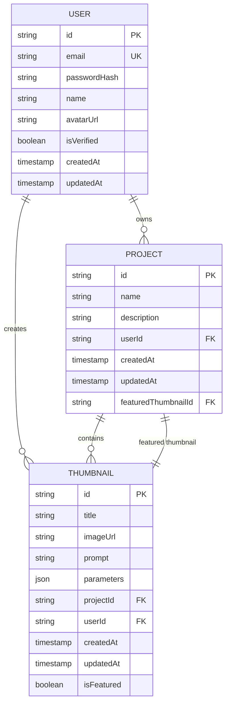

# Thumbnail API

<cite>
**Referenced Files in This Document**
- [environment.ts](file://pikzels-clone\client\src\config\environment.ts)
- [api.ts](file://pikzels-clone\client\src\utils\api.ts)
- [openrouter-ai.service.ts](file://pikzels-clone\src\modules\thumbnail\openrouter-ai.service.ts)
- [thumbnail.controller.ts](file://pikzels-clone\src\modules\thumbnail\thumbnail.controller.ts)
- [thumbnail.routes.ts](file://pikzels-clone\src\modules\thumbnail\thumbnail.routes.ts)
- [thumbnail.public.routes.ts](file://pikzels-clone\src\modules\thumbnail\thumbnail.public.routes.ts)
- [thumbnail.service.ts](file://pikzels-clone\src\modules\thumbnail\thumbnail.service.ts)
- [ai.service.ts](file://pikzels-clone\src\modules\thumbnail\ai.service.ts)
- [image-processing.service.ts](file://pikzels-clone\src\modules\thumbnail\image-processing.service.ts)
- [ThumbnailEditor.tsx](file://pikzels-clone\client\src\components\ThumbnailEditor.tsx)
- [SetFeaturedThumbnail.tsx](file://pikzels-clone\client\src\components\SetFeaturedThumbnail.tsx)
- [model-tiers.config.ts](file://pikzels-clone\src\modules\thumbnail\model-tiers.config.ts)
- [useModelTiers.ts](file://pikzels-clone\client\src\features\ai-tools\hooks\useModelTiers.ts)
- [ModelTierSelector.tsx](file://pikzels-clone\client\src\features\ai-tools\components\ModelTierSelector.tsx)
- [ai-thumbnail-generation.md](file://pikzels-clone\docs\api\ai-thumbnail-generation.md)
- [project-thumbnail-association.md](file://pikzels-clone\docs\api\project-thumbnail-association.md)
</cite>

## Update Summary
**Changes Made**
- Updated AI thumbnail generation section to document model tier integration with subscription-based AI model selection
- Added new Model Tier Configuration section detailing the three-tier system (Flash, Standard, Pro)
- Enhanced AI service configuration to support tier-based model resolution
- Updated frontend integration examples to use centralized model tier configuration
- Added documentation for enhanced Gemini model support with 2K/4K resolution capabilities
- Updated error handling to include model tier resolution failures

## Table of Contents
1. [Introduction](#introduction)
2. [Core Endpoints](#core-endpoints)
3. [Model Tier Configuration](#model-tier-configuration)
4. [API Integration and Configuration](#api-integration-and-configuration)
5. [AI Thumbnail Generation](#ai-thumbnail-generation)
6. [Image Processing Options](#image-processing-options)
7. [Public Access and Sharing](#public-access-and-sharing)
8. [Frontend Integration](#frontend-integration)
9. [Error Handling](#error-handling)
10. [Data Models](#data-models)

## Introduction
The Thumbnail API provides a comprehensive system for creating, managing, and sharing thumbnails within the Pikzels application. The API supports both AI-generated thumbnails from text prompts and manual editing of existing thumbnails. It enables users to associate thumbnails with projects, set featured thumbnails, and share thumbnails publicly. The system integrates with AI services for automated thumbnail creation and includes robust image processing capabilities for customization. Recent enhancements include a subscription-based model tier system that allows users to select different quality levels for AI operations.

**Section sources**
- [thumbnail.controller.ts](file://pikzels-clone\src\modules\thumbnail\thumbnail.controller.ts#L1-L735)
- [thumbnail.routes.ts](file://pikzels-clone\src\modules\thumbnail\thumbnail.routes.ts#L1-L56)

## Core Endpoints
The Thumbnail API provides standard RESTful endpoints for thumbnail management with authentication protection.

### Create Thumbnail
**POST** `/api/thumbnails`

Creates a new thumbnail with specified parameters.

**Request Body**
```json
{
  "title": "My Thumbnail",
  "imageUrl": "https://example.com/image.png",
  "prompt": "A beautiful landscape",
  "parameters": {
    "style": "bold"
  },
  "projectId": "project-123"
}
```

**Response (201 Created)**
```json
{
  "thumbnail": {
    "id": "thumbnail-123",
    "title": "My Thumbnail",
    "imageUrl": "https://example.com/image.png",
    "prompt": "A beautiful landscape",
    "parameters": {
      "style": "bold"
    },
    "projectId": "project-123",
    "userId": "user-123",
    "createdAt": "2023-01-01T00:00:00.000Z",
    "updatedAt": "2023-01-01T00:00:00.000Z"
  }
}
```

### Retrieve Thumbnail
**GET** `/api/thumbnails/:id`

Retrieves a specific thumbnail by ID.

**Response (200 OK)**
```json
{
  "thumbnail": {
    "id": "thumbnail-123",
    "title": "My Thumbnail",
    "imageUrl": "https://example.com/image.png",
    "prompt": "A beautiful landscape",
    "parameters": {
      "style": "bold"
    },
    "projectId": "project-123",
    "userId": "user-123",
    "createdAt": "2023-01-01T00:00:00.000Z",
    "updatedAt": "2023-01-01T00:00:00.000Z"
  }
}
```

### Update Thumbnail
**PUT** `/api/thumbnails/:id`

Updates an existing thumbnail.

**Request Body**
```json
{
  "title": "Updated Thumbnail",
  "parameters": {
    "style": "dramatic"
  }
}
```

**Response (200 OK)**
```json
{
  "thumbnail": {
    "id": "thumbnail-123",
    "title": "Updated Thumbnail",
    "imageUrl": "https://example.com/image.png",
    "prompt": "A beautiful landscape",
    "parameters": {
      "style": "dramatic"
    },
    "projectId": "project-123",
    "userId": "user-123",
    "createdAt": "2023-01-01T00:00:00.000Z",
    "updatedAt": "2023-01-02T00:00:00.000Z"
  }
}
```

### Delete Thumbnail
**DELETE** `/api/thumbnails/:id`

Deletes a thumbnail by ID.

**Response (204 No Content)**

**Section sources**
- [thumbnail.controller.ts](file://pikzels-clone\src\modules\thumbnail\thumbnail.controller.ts#L100-L250)
- [thumbnail.routes.ts](file://pikzels-clone\src\modules\thumbnail\thumbnail.routes.ts#L15-L20)

## Model Tier Configuration
The Thumbnail API now supports a subscription-based model tier system that allows users to select different quality levels for AI operations. This system provides three distinct tiers with varying capabilities and costs.

### Tier System Architecture
The model tier system consists of three quality tiers:

**Flash Tier (Entry Level)**
- **Model**: `google/gemini-2.5-flash-image`
- **Credit Cost**: 1 credit per generation
- **Estimated Time**: ~5 seconds
- **Capabilities**: Fast generation with good quality detail
- **Best For**: Quick thumbnails, budget-conscious users

**Standard Tier (Mid Range)**
- **Model**: `google/gemini-2.5-flash-image` (default)
- **Credit Cost**: 1 credit per generation
- **Estimated Time**: ~5 seconds
- **Capabilities**: Balanced quality and speed
- **Best For**: General thumbnail generation

**Pro Tier (Premium)**
- **Model**: `google/gemini-3-pro-image-preview`
- **Credit Cost**: 4 credits per generation
- **Estimated Time**: ~12 seconds
- **Capabilities**: Native 2K/4K output, maximum detail preservation
- **Best For**: High-quality thumbnails, professional use

### Tier Configuration Management
The model tier configuration is managed centrally in the backend and exposed to the frontend via a dedicated endpoint. This single source of truth ensures consistency across all components.

**Backend Configuration Features:**
- Centralized model ID management
- Credit cost tracking per tier
- Estimated generation time display
- Badge system for premium tiers
- Default tier selection logic

**Frontend Integration:**
- Dynamic model configuration fetching
- Real-time tier availability updates
- Client-side caching for performance
- Automatic fallback to default tiers

**Section sources**
- [model-tiers.config.ts](file://pikzels-clone\src\modules\thumbnail\model-tiers.config.ts#L23-L330)
- [useModelTiers.ts](file://pikzels-clone\client\src\features\ai-tools\hooks\useModelTiers.ts#L94-L138)

## API Integration and Configuration
The API integration has been updated to use a centralized configuration system for better maintainability and deployment flexibility.

### Centralized API Configuration
The frontend now uses a centralized `config.apiBaseUrl` that provides several benefits:

- **Environment-aware configuration**: Automatically detects development vs production environments
- **Centralized URL management**: Single source of truth for API endpoints
- **Production safety checks**: Validates API URLs in production builds to prevent localhost deployment issues
- **Flexible deployment**: Supports various hosting platforms (Netlify, Vercel, Cloudflare Pages)

**Configuration Features:**
- Automatic environment detection (development, production, hosting platform)
- Fallback URL resolution for different deployment targets
- Security validation to prevent production deployment with localhost URLs
- Support for custom API URL overrides via environment variables

**Section sources**
- [environment.ts](file://pikzels-clone\client\src\config\environment.ts#L113-L116)
- [api.ts](file://pikzels-clone\client\src\utils\api.ts#L11-L13)

### API Client Integration
The `authFetch` function demonstrates the centralized configuration usage:

```typescript
const url = endpoint.startsWith('http') 
  ? endpoint 
  : `${config.apiBaseUrl}${endpoint}`;
```

This ensures all API calls use the properly configured base URL regardless of deployment environment.

**Section sources**
- [api.ts](file://pikzels-clone\client\src\utils\api.ts#L7-L27)

## AI Thumbnail Generation
The API supports AI-powered thumbnail generation using OpenRouter's Gemini models with enhanced resolution support and subscription-based model tier integration.

### Enhanced Gemini Model Support
The OpenRouter AI service now includes advanced Gemini models with improved capabilities:

**Gemini Model Capabilities:**
- **NANO_BANANA**: `google/gemini-2.5-flash-image` - Best value, fast generation
- **NANO_BANANA_PRO**: `google/gemini-3-pro-image-preview` - Highest quality with 2K/4K support
- **Aspect Ratio Support**: Comprehensive aspect ratio options including 16:9 optimized for thumbnails
- **Resolution Control**: Native support for 1K, 2K, and 4K output resolutions

**New Resolution Features:**
- **2K Resolution**: Enhanced detail for web and social media use
- **4K Resolution**: Professional quality for high-end applications
- **Automatic Scaling**: Intelligent upscaling with detail preservation
- **Quality Optimization**: Balanced quality vs performance for different use cases

### Model Tier Integration
The AI generation process now supports subscription-based model selection through the tier system:

**Tier Resolution Logic:**
1. **Direct Model Override**: If `model` parameter is provided, use it directly
2. **Tier-Based Selection**: If `tier` parameter is provided, resolve to specific model
3. **Default Fallback**: Use backend default model if neither provided

**Supported Tools with Tier Integration:**
- **Generate**: Text-to-image generation with quality tiers
- **Inpaint**: Contextual editing with premium models
- **Face Swap**: Identity preservation with specialized models
- **Upscale**: Detail-preserving upscaling with 2K/4K support

### Generate Thumbnails from Prompt
**POST** `/api/thumbnails/generate`

Generates thumbnails from a text prompt using AI with enhanced Gemini model support and tier integration.

**Request Body**
```json
{
  "prompt": "A futuristic cityscape at sunset",
  "style": "dramatic",
  "projectId": "project-123",
  "tier": "pro",
  "model": "google/gemini-3-pro-image-preview"
}
```

**Query Parameters**
- `prompt` (required): Text description of the desired thumbnail
- `style` (optional): Style of the thumbnail (bold, minimalist, dramatic, cinematic, professional, creative, gaming)
- `projectId` (required): ID of the project to associate with the thumbnails
- `tier` (optional): Quality tier (flash, standard, pro) for subscription-based selection
- `model` (optional): Direct model override for immediate use

**Response (201 Created)**
```json
{
  "message": "Thumbnails generated successfully with AI",
  "thumbnails": [
    {
      "id": "thumbnail-123",
      "title": "A futuristic cityscape at sunset 1",
      "imageUrl": "https://generated-image.com/1.png",
      "prompt": "A futuristic cityscape at sunset",
      "parameters": {
        "style": "dramatic",
        "variation": 1,
        "aiGenerated": true,
        "tier": "pro",
        "model": "google/gemini-3-pro-image-preview",
        "credits": 4
      },
      "projectId": "project-123",
      "userId": "user-123",
      "createdAt": "2023-01-01T00:00:00.000Z"
    }
  ]
}
```

The AI service automatically applies style modifications to the prompt:
- **Bold**: High contrast, vibrant colors, clear focal point
- **Minimalist**: Clean, simple, lots of white space, minimal elements
- **Dramatic**: Strong lighting, high contrast, cinematic feel, emotional impact
- **Cinematic**: Movie poster quality with professional photography
- **Professional**: Corporate style with clean design aesthetics
- **Creative**: Artistic style with unique perspective and imaginative elements
- **Gaming**: Energetic visuals with gaming aesthetic and vibrant colors

When the AI service is not configured or fails, the system falls back to generating placeholder images with the format:
```
https://placehold.co/1280x720/{random_color}/FFFFFF?text={encoded_prompt}
```

**Section sources**
- [openrouter-ai.service.ts](file://pikzels-clone\src\modules\thumbnail\openrouter-ai.service.ts#L33-L96)
- [openrouter-ai.service.ts](file://pikzels-clone\src\modules\thumbnail\openrouter-ai.service.ts#L154-L167)
- [ai-thumbnail-generation.md](file://pikzels-clone\docs\api\ai-thumbnail-generation.md#L1-L121)
- [ai.service.ts](file://pikzels-clone\src\modules\thumbnail\ai.service.ts#L1-L144)
- [thumbnail.controller.ts](file://pikzels-clone\src\modules\thumbnail\thumbnail.controller.ts#L252-L380)
- [model-tiers.config.ts](file://pikzels-clone\src\modules\thumbnail\model-tiers.config.ts#L294-L305)

## Image Processing Options
The API provides extensive image processing capabilities through query parameters and dedicated endpoints.

### Apply Edits to Thumbnail
**POST** `/api/thumbnails/:id/edit`

Applies various image processing effects to a thumbnail.

**Request Body**
```json
{
  "edits": {
    "brightness": 120,
    "contrast": 110,
    "saturation": 90,
    "hue": 15,
    "blur": 2,
    "sharpen": 1,
    "rotation": 45,
    "flipHorizontal": true,
    "resize": {
      "width": 1920,
      "height": 1080
    },
    "filter": "sepia",
    "crop": {
      "x": 10,
      "y": 10,
      "width": 80,
      "height": 80
    }
  }
}
```

### Available Filters
The following filters can be applied to thumbnails:
- **grayscale**: Convert to black and white
- **sepia**: Apply sepia tone
- **vintage**: Vintage photo effect
- **blackAndWhite**: High contrast black and white
- **invert**: Invert colors
- **blur**: Apply blur effect
- **sharpen**: Enhance image sharpness
- **emboss**: Emboss effect
- **edgeDetect**: Edge detection filter

### AI-Powered Enhancements
**POST** `/api/thumbnails/:id/style-transfer`
**POST** `/api/thumbnails/:id/image-enhancement`

Apply AI-powered style transfer and image enhancement effects.

**Available Style Transfer Options:**
- Impressionist
- Cubist
- Expressionist
- Surrealist
- Pop Art

**Available Image Enhancement Options:**
- Super-resolution
- Denoise
- Deblur
- Color enhancement
- Sharpening

**Section sources**
- [image-processing.service.ts](file://pikzels-clone\src\modules\thumbnail\image-processing.service.ts#L1-L282)
- [thumbnail.controller.ts](file://pikzels-clone\src\modules\thumbnail\thumbnail.controller.ts#L450-L650)

## Public Access and Sharing
The API supports public access to thumbnails through shareable links.

### Generate Shareable Link
**POST** `/api/thumbnails/:id/share`

Generates a unique shareable link for a thumbnail.

**Response (200 OK)**
```json
{
  "message": "Share link generated successfully",
  "shareUrl": "http://localhost:8550/api/thumbnails/share/abc123def456",
  "shareToken": "abc123def456",
  "expiresAt": "2023-02-01T00:00:00.000Z"
}
```

### Access Shared Thumbnail
**GET** `/api/public/thumbnails/share/:token`

Retrieves a thumbnail using a share token without authentication.

**Response (200 OK)**
```json
{
  "thumbnail": {
    "id": "thumbnail-123",
    "title": "My Thumbnail",
    "imageUrl": "https://example.com/image.png",
    "prompt": "A beautiful landscape",
    "parameters": {
      "style": "bold"
    },
    "projectId": "project-123",
    "userId": "user-123",
    "createdAt": "2023-01-01T00:00:00.000Z"
  }
}
```

### Revoke Share Link
**DELETE** `/api/thumbnails/:id/share`

Revokes the share link for a thumbnail.

**Response (200 OK)**
```json
{
  "message": "Share link revoked successfully",
  "thumbnail": {
    "id": "thumbnail-123",
    "title": "My Thumbnail",
    "imageUrl": "https://example.com/image.png",
    "prompt": "A beautiful landscape",
    "parameters": {
      "style": "bold"
    },
    "projectId": "project-123",
    "userId": "user-123",
    "createdAt": "2023-01-01T00:00:00.000Z",
    "updatedAt": "2023-01-02T00:00:00.000Z"
  }
}
```

**Section sources**
- [thumbnail.controller.ts](file://pikzels-clone\src\modules\thumbnail\thumbnail.controller.ts#L550-L700)
- [thumbnail.routes.ts](file://pikzels-clone\src\modules\thumbnail\thumbnail.routes.ts#L35-L40)
- [thumbnail.public.routes.ts](file://pikzels-clone\src\modules\thumbnail\thumbnail.public.routes.ts#L1-L10)

## Frontend Integration
The Thumbnail API integrates with frontend components for enhanced user experience, utilizing the centralized configuration system and model tier integration.

### Centralized API Configuration Usage
The frontend components now benefit from the centralized configuration system:

**Environment Detection:**
- Automatic detection of development vs production environments
- Platform-specific optimizations for Netlify, Vercel, and Cloudflare Pages
- Security validation to prevent production deployment with localhost URLs

**API Client Integration:**
- Consistent URL construction using `config.apiBaseUrl`
- Automatic HTTPS handling for production deployments
- Flexible deployment support across different hosting platforms

### Model Tier Integration
The frontend now integrates with the model tier system for subscription-based AI operations:

**Model Tier Selector Component:**
- Dynamic tier configuration fetching from backend
- Real-time credit balance checking
- Visual tier comparison with pricing and capabilities
- Automatic fallback to default tiers when unavailable

**Hook Integration:**
- `useModelTiers()` hook manages tier state and caching
- Automatic model ID resolution based on selected tier
- Error handling for tier configuration failures
- Client-side caching for performance optimization

**Integration Example:**
```typescript
const { tiers, configured, resolveModel } = useModelTiers();

const handleGenerate = () => {
  const selectedModel = resolveModel('generate', selectedTier);
  if (selectedModel) {
    generateThumbnail({ prompt, tier: selectedTier, model: selectedModel });
  }
};
```

### Thumbnail Editor
The `ThumbnailEditor.tsx` component provides a comprehensive interface for editing thumbnails.

**Key Features:**
- Adjust brightness, contrast, saturation, and hue
- Transform with rotation, flip, and resize
- Add text overlays with customizable position, size, and color
- Draw freehand with customizable color and line width
- Apply watermarks (text or image)
- Save and apply edit presets
- History and undo/redo functionality
- Keyboard shortcuts (Ctrl+Z for undo, Ctrl+Shift+Z for redo, Ctrl+S for save)

**Integration Example:**
```typescript
const handleSave = () => {
  onSave(edits);
};

const applyPreset = (preset: EditPreset) => {
  setEdits(preset.edits);
  addToHistory(preset.edits);
  applyEditsToImage(preset.edits);
};
```

### Set Featured Thumbnail
The `SetFeaturedThumbnail.tsx` component allows users to set a thumbnail as the featured thumbnail for a project.

**Workflow:**
1. Fetch all thumbnails for the project
2. Display thumbnails in a grid layout
3. Allow user to select a thumbnail
4. Set the selected thumbnail as featured via API call

**Integration Example:**
```typescript
const handleSetFeatured = () => {
  if (selectedThumbnail) {
    onSetFeatured(selectedThumbnail);
  }
};
```

**Section sources**
- [ThumbnailEditor.tsx](file://pikzels-clone\client\src\components\ThumbnailEditor.tsx#L1-L1505)
- [SetFeaturedThumbnail.tsx](file://pikzels-clone\client\src\components\SetFeaturedThumbnail.tsx#L1-L219)
- [environment.ts](file://pikzels-clone\client\src\config\environment.ts#L1-L163)
- [api.ts](file://pikzels-clone\client\src\utils\api.ts#L1-L62)
- [useModelTiers.ts](file://pikzels-clone\client\src\features\ai-tools\hooks\useModelTiers.ts#L144-L291)
- [ModelTierSelector.tsx](file://pikzels-clone\client\src\features\ai-tools\components\ModelTierSelector.tsx#L224-L255)

## Error Handling
The API implements comprehensive error handling for various scenarios.

### Common Error Responses
**400 Bad Request**
```json
{
  "error": "Title, prompt, and projectId are required"
}
```

**401 Unauthorized**
```json
{
  "error": "Unauthorized"
}
```

**403 Forbidden**
```json
{
  "error": "Forbidden"
}
```

**404 Not Found**
```json
{
  "error": "Thumbnail not found"
}
```

**500 Internal Server Error**
```json
{
  "error": "Internal server error"
}
```

### Specific Error Cases
- **Invalid video URLs**: When generating thumbnails from video URLs, invalid URLs return a 400 error
- **Processing failures**: Image processing errors return a 500 error with details
- **Permission denied**: Access to private thumbnails without proper authorization returns a 403 error
- **AI service errors**: When the AI service fails, the system falls back to placeholder images and logs the error
- **Rate limiting**: When OpenRouter API rate limits are exceeded, appropriate error messages are returned
- **Configuration errors**: Invalid API keys or missing configuration return specific error messages
- **Model tier resolution failures**: When tier-based model resolution fails, the system uses default models or returns errors
- **Credit insufficient**: When users don't have enough credits for premium tiers, appropriate error messages are returned

**Section sources**
- [thumbnail.controller.ts](file://pikzels-clone\src\modules\thumbnail\thumbnail.controller.ts#L50-L735)
- [ai.service.ts](file://pikzels-clone\src\modules\thumbnail\ai.service.ts#L80-L140)
- [model-tiers.config.ts](file://pikzels-clone\src\modules\thumbnail\model-tiers.config.ts#L294-L305)

## Data Models
This section defines the core data structures used in the Thumbnail API.

### Thumbnail Object
```json
{
  "id": "string",
  "title": "string",
  "imageUrl": "string",
  "prompt": "string",
  "parameters": "object",
  "projectId": "string",
  "userId": "string",
  "createdAt": "string (ISO 8601)",
  "updatedAt": "string (ISO 8601)
}
```

**Parameters Object**
```json
{
  "style": "string",
  "variation": "number",
  "aiGenerated": "boolean",
  "edits": "object",
  "shareToken": "string",
  "shareExpiresAt": "string (ISO 8601)",
  "resolution": "string",
  "model": "string",
  "tier": "string",
  "credits": "number"
}
```

### Project Object with Featured Thumbnail
```json
{
  "id": "string",
  "name": "string",
  "description": "string",
  "userId": "string",
  "createdAt": "string (ISO 8601)",
  "updatedAt": "string (ISO 8601)",
  "featuredThumbnailId": "string",
  "featuredThumbnail": "Thumbnail object"
}
```

### Model Tier Configuration
```json
{
  "tiers": {
    "generate": {
      "toolId": "generate",
      "tiers": [
        {
          "id": "flash",
          "label": "ThumPiks Flash",
          "icon": "⚡",
          "tagline": "Fast generation, good quality",
          "modelId": "google/gemini-2.5-flash-image",
          "modelLabel": "Gemini 2.5 Flash Image",
          "credits": 1,
          "estimatedTime": "~5s"
        },
        {
          "id": "standard",
          "label": "ThumPiks Standard",
          "icon": "⭐",
          "tagline": "Balanced quality and speed",
          "modelId": "google/gemini-2.5-flash-image",
          "modelLabel": "Gemini 2.5 Flash Image",
          "credits": 1,
          "estimatedTime": "~5s",
          "isDefault": true
        },
        {
          "id": "pro",
          "label": "ThumPiks Pro",
          "icon": "💎",
          "tagline": "Native 2K/4K, maximum detail",
          "modelId": "google/gemini-3-pro-image-preview",
          "modelLabel": "Gemini 3 Pro Image",
          "credits": 4,
          "estimatedTime": "~12s",
          "badge": "Sharpest"
        }
      ],
      "defaultTierId": "standard"
    }
  },
  "configured": "boolean",
  "tieredToolIds": ["generate", "inpaint", "face-swap", "upscale"]
}
```

### Database Schema
The database schema includes the following key tables:



**Diagram sources**
- [20250829072650_init\migration.sql](file://pikzels-clone\prisma\migrations\20250829072650_init\migration.sql#L1-L53)
- [20250911125101_add_featured_thumbnail_fields\migration.sql](file://pikzels-clone\prisma\migrations\20250911125101_add_featured_thumbnail_fields\migration.sql#L1-L37)

**Section sources**
- [thumbnail.service.ts](file://pikzels-clone\src\modules\thumbnail\thumbnail.service.ts#L4-L135)
- [project-thumbnail-association.md](file://pikzels-clone\docs\api\project-thumbnail-association.md#L1-L210)
- [model-tiers.config.ts](file://pikzels-clone\src\modules\thumbnail\model-tiers.config.ts#L23-L330)