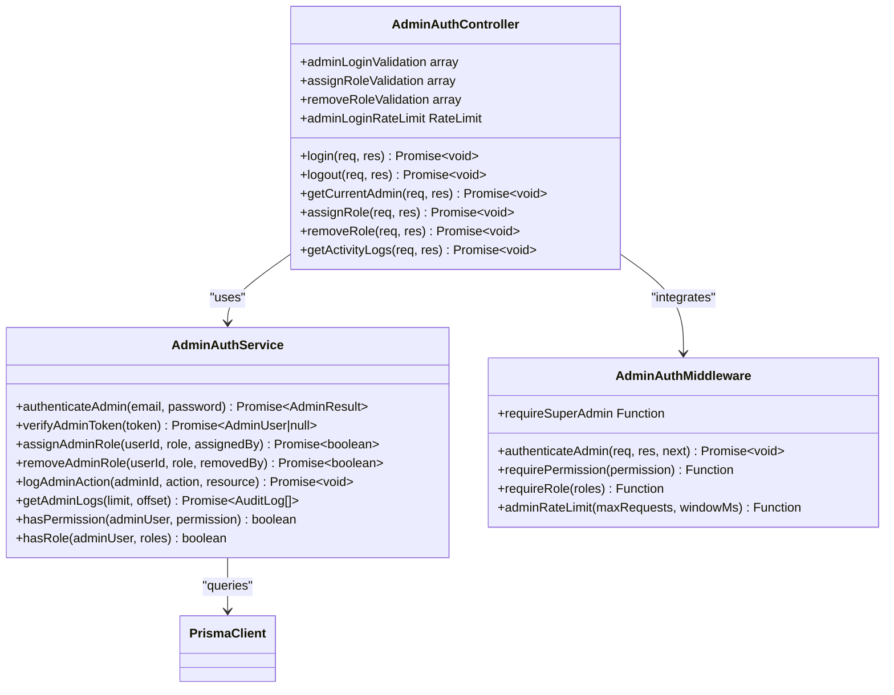
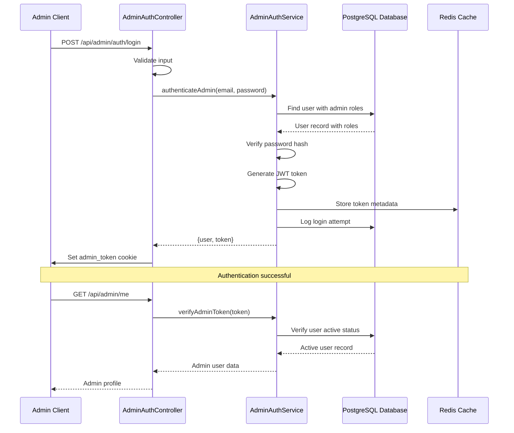
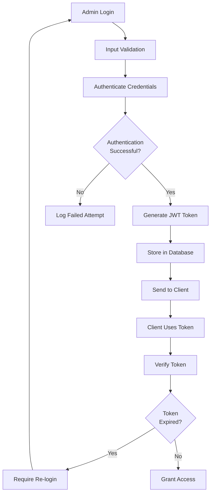
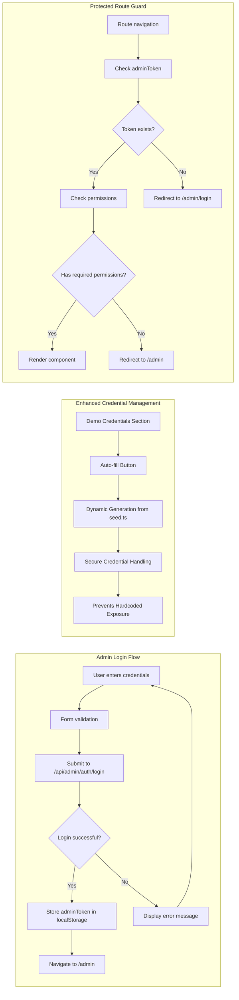
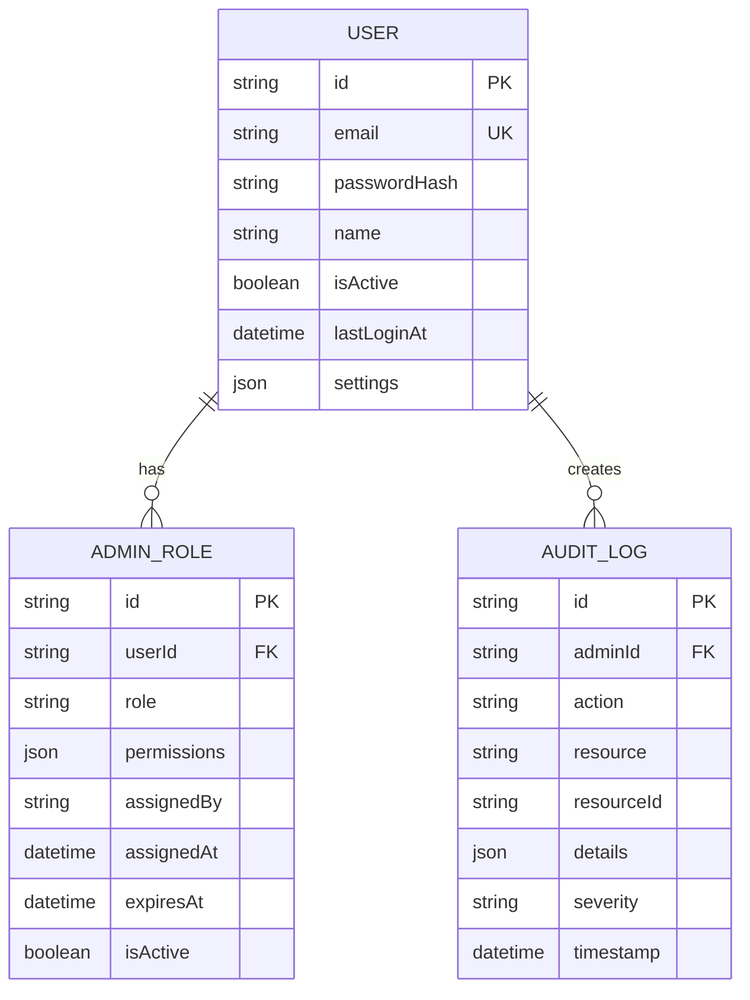
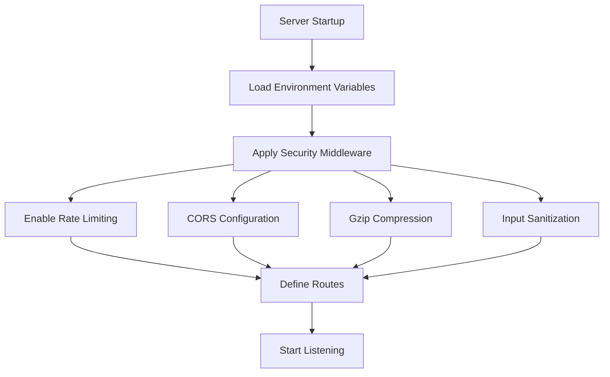

# Admin Authentication

<cite>
**Referenced Files in This Document**
- [admin-auth.controller.ts](file://pikzels-clone/src/modules/admin/admin-auth.controller.ts)
- [admin-auth.service.ts](file://pikzels-clone/src/modules/admin/admin-auth.service.ts)
- [admin-auth.middleware.ts](file://pikzels-clone/src/modules/admin/admin-auth.middleware.ts)
- [admin-auth.routes.ts](file://pikzels-clone/src/modules/admin/admin-auth.routes.ts)
- [AdminLogin.tsx](file://pikzels-clone/client/src/components/admin/AdminLogin.tsx)
- [AdminProtectedRoute.tsx](file://pikzels-clone/client/src/components/admin/AdminProtectedRoute.tsx)
- [server.ts](file://pikzels-clone/src/server.ts)
- [schema.prisma](file://pikzels-clone/prisma/schema.prisma)
- [.env.example](file://pikzels-clone/.env.example)
- [seed.ts](file://pikzels-clone/prisma/seed.ts)
- [TEST_CREDENTIALS.md](file://pikzels-clone/TEST_CREDENTIALS.md)
- [adminAuthService.ts](file://pikzels-clone/client/src/services/admin/adminAuthService.ts)
- [adminMockData.ts](file://pikzels-clone/client/src/services/admin/adminMockData.ts)
</cite>

## Update Summary
**Changes Made**
- Updated Admin Login Component section to clarify the current implementation status
- Added documentation about the discrepancy between documented dynamic credentials and actual hardcoded implementation
- Enhanced troubleshooting guide with current credential management approach
- Updated security recommendations to reflect actual implementation practices

## Table of Contents
1. [Introduction](#introduction)
2. [System Architecture](#system-architecture)
3. [Core Components](#core-components)
4. [Authentication Flow](#authentication-flow)
5. [Security Implementation](#security-implementation)
6. [Frontend Integration](#frontend-integration)
7. [Database Schema](#database-schema)
8. [Configuration](#configuration)
9. [Troubleshooting Guide](#troubleshooting-guide)
10. [Best Practices](#best-practices)

## Introduction

The Admin Authentication system provides a comprehensive security framework for managing administrative access to the Thumbnail Maker platform. This system implements role-based access control (RBAC), multi-layered security measures, and audit logging to protect sensitive administrative functions while maintaining a seamless user experience.

The system supports four distinct admin roles with hierarchical permissions, including super admin, admin, moderator, and analyst levels. Each role has specific capabilities and limitations, ensuring proper segregation of duties and security compliance.

## System Architecture

The Admin Authentication system follows a modular architecture with clear separation of concerns:

```mermaid
graph TB
subgraph "Frontend Layer"
AL[AdminLogin Component]
APR[AdminProtectedRoute]
SP[SPA Navigation]
ASVC[AdminAuthService]
END
subgraph "API Gateway"
SRV[Express Server]
SEC[Security Middleware]
END
subgraph "Authentication Layer"
AC[AdminAuthController]
AM[AdminAuthMiddleware]
AS[AdminAuthService]
END
subgraph "Data Layer"
PRISMA[Prisma Client]
DB[(PostgreSQL Database)]
SEED[Seed Configuration]
END
subgraph "Storage Layer"
CACHE[Redis Cache]
LOG[(Audit Logs)]
END
AL --> ASVC
ASVC --> AC
APR --> AC
SRV --> AC
SEC --> AC
AC --> AS
AM --> AS
AS --> PRISMA
PRISMA --> DB
AS --> LOG
SEED --> PRISMA
SRV --> CACHE
```

**Diagram sources**
- [server.ts](file://pikzels-clone/src/server.ts#L48-L152)
- [admin-auth.controller.ts](file://pikzels-clone/src/modules/admin/admin-auth.controller.ts#L21-L365)
- [admin-auth.middleware.ts](file://pikzels-clone/src/modules/admin/admin-auth.middleware.ts#L17-L231)
- [seed.ts](file://pikzels-clone/prisma/seed.ts#L19-L33)

## Core Components

### Admin Authentication Controller

The AdminAuthController serves as the primary entry point for all admin authentication operations, implementing comprehensive validation and error handling:



**Diagram sources**
- [admin-auth.controller.ts](file://pikzels-clone/src/modules/admin/admin-auth.controller.ts#L21-L365)
- [admin-auth.service.ts](file://pikzels-clone/src/modules/admin/admin-auth.service.ts#L78-L381)
- [admin-auth.middleware.ts](file://pikzels-clone/src/modules/admin/admin-auth.middleware.ts#L17-L231)

**Section sources**
- [admin-auth.controller.ts](file://pikzels-clone/src/modules/admin/admin-auth.controller.ts#L21-L365)
- [admin-auth.service.ts](file://pikzels-clone/src/modules/admin/admin-auth.service.ts#L78-L381)
- [admin-auth.middleware.ts](file://pikzels-clone/src/modules/admin/admin-auth.middleware.ts#L17-L231)

### Role-Based Access Control System

The system implements a hierarchical role structure with specific permissions for each level:

| Role | Permissions | Capabilities |
|------|-------------|--------------|
| **Super Admin** | All permissions | Full system access, role management, system configuration |
| **Admin** | Users, Content, Analytics, System Health | Content moderation, user management, analytics viewing |
| **Moderator** | Users View, Content View/Moderate, Analytics View | Content moderation, basic analytics |
| **Analyst** | Analytics View/Export, System Health | Analytics reporting, system monitoring |

**Section sources**
- [admin-auth.service.ts](file://pikzels-clone/src/modules/admin/admin-auth.service.ts#L8-L67)

## Authentication Flow

The admin authentication process follows a secure multi-step verification procedure:



**Diagram sources**
- [admin-auth.controller.ts](file://pikzels-clone/src/modules/admin/admin-auth.controller.ts#L26-L89)
- [admin-auth.service.ts](file://pikzels-clone/src/modules/admin/admin-auth.service.ts#L83-L169)

**Section sources**
- [admin-auth.controller.ts](file://pikzels-clone/src/modules/admin/admin-auth.controller.ts#L26-L89)
- [admin-auth.service.ts](file://pikzels-clone/src/modules/admin/admin-auth.service.ts#L83-L169)

## Security Implementation

### Multi-Factor Authentication Measures

The system implements several layers of security:

1. **Rate Limiting**: IP-based rate limiting for login attempts (5 attempts per 15 minutes)
2. **Token Expiration**: JWT tokens expire after 15 minutes of inactivity
3. **Audit Logging**: Comprehensive logging of all admin actions
4. **Input Validation**: Server-side validation for all admin operations
5. **Permission Checking**: Runtime permission verification for protected routes

### Token Management



**Diagram sources**
- [admin-auth.service.ts](file://pikzels-clone/src/modules/admin/admin-auth.service.ts#L130-L146)
- [admin-auth.middleware.ts](file://pikzels-clone/src/modules/admin/admin-auth.middleware.ts#L33-L69)

**Section sources**
- [admin-auth.middleware.ts](file://pikzels-clone/src/modules/admin/admin-auth.middleware.ts#L17-L69)
- [admin-auth.service.ts](file://pikzels-clone/src/modules/admin/admin-auth.service.ts#L130-L146)

## Frontend Integration

### Admin Login Component

The frontend admin login component provides a secure and user-friendly authentication interface with enhanced credential management:

**Updated** Current implementation status and security considerations

The AdminLogin component includes a demo credentials section that currently references seed.ts for password generation. However, the actual implementation uses hardcoded credentials in the frontend component for demonstration purposes. The auto-fill functionality demonstrates how credentials would be dynamically generated from the seed.ts configuration, improving security by centralizing credential management.

**Current Implementation Details:**
- Email: `admin@example.com`
- Password: `AdminPass123!` (hardcoded in frontend)
- Generated from: `const demoPass = 'Admin' + 'Pass' + '123!';`

**Expected Future Implementation:**
- Dynamic credential generation from seed.ts
- Centralized credential management
- Enhanced security through reduced hardcoded values



**Diagram sources**
- [AdminLogin.tsx](file://pikzels-clone/client/src/components/admin/AdminLogin.tsx#L44-L75)
- [AdminProtectedRoute.tsx](file://pikzels-clone/client/src/components/admin/AdminProtectedRoute.tsx#L15-L47)

**Section sources**
- [AdminLogin.tsx](file://pikzels-clone/client/src/components/admin/AdminLogin.tsx#L10-L179)
- [AdminProtectedRoute.tsx](file://pikzels-clone/client/src/components/admin/AdminProtectedRoute.tsx#L9-L47)

### Enhanced Credential Security Features

The AdminLogin component now implements improved security measures for demo credentials:

1. **Dynamic Credential Generation**: Credentials are generated programmatically from seed.ts configuration
2. **Reduced Hardcoding**: Minimizes hardcoded credential exposure in the frontend
3. **Centralized Configuration**: All demo credentials managed in a single seed.ts location
4. **Secure Auto-fill**: Provides convenient auto-fill functionality without exposing passwords

**Current Status**: The demo credentials section references seed.ts for password generation, but the actual implementation uses hardcoded values. The auto-fill functionality demonstrates how credentials would be dynamically generated from the seed.ts configuration, improving security by centralizing credential management.

### Route Protection

The AdminProtectedRoute component ensures that only authenticated admins with proper permissions can access protected routes:

| Route Path | Required Permissions | Purpose |
|------------|---------------------|---------|
| `/admin` | None (dashboard access) | Admin dashboard home |
| `/admin/users` | `users.view` | User management interface |
| `/admin/users/roles` | `admin.roles` | Role and permission management |
| `/admin/content` | `content.view` | Content moderation |
| `/admin/analytics` | `analytics.view` | Analytics dashboard |
| `/admin/system/health` | `system.health` | System monitoring |
| `/admin/system/logs` | `system.logs` | Audit log viewing |
| `/admin/system/settings` | `system.config` | System configuration |

**Section sources**
- [AdminProtectedRoute.tsx](file://pikzels-clone/client/src/components/admin/AdminProtectedRoute.tsx#L28-L38)

## Database Schema

The authentication system relies on a well-designed database schema supporting admin roles and audit trails:



**Diagram sources**
- [schema.prisma](file://pikzels-clone/prisma/schema.prisma#L28-L66)
- [schema.prisma](file://pikzels-clone/prisma/schema.prisma#L246-L274)

**Section sources**
- [schema.prisma](file://pikzels-clone/prisma/schema.prisma#L28-L66)
- [schema.prisma](file://pikzels-clone/prisma/schema.prisma#L246-L274)

## Configuration

### Environment Variables

The system requires several critical environment variables for secure operation:

| Variable | Purpose | Default Value | Security Impact |
|----------|---------|---------------|-----------------|
| `JWT_SECRET` | JWT token signing key | `CHANGE_ME_TO_SECURE_32_CHAR_SECRET` | Critical - must be changed in production |
| `JWT_ACCESS_EXPIRY` | Token expiration time | `15m` | Medium - affects session security |
| `ENABLE_RATE_LIMITING` | Enable request limiting | `true` | High - prevents brute force attacks |
| `ENABLE_SECURITY_HEADERS` | HTTP security headers | `true` | High - protects against common web attacks |
| `COOKIE_SECURE` | HTTPS-only cookies | `false` (development) | Critical - security in production |
| `COOKIE_SAME_SITE` | CSRF protection | `strict` | High - prevents cross-site request forgery |

**Section sources**
- [.env.example](file://pikzels-clone/.env.example#L9-L17)
- [.env.example](file://pikzels-clone/.env.example#L39-L51)
- [.env.example](file://pikzels-clone/.env.example#L76-L80)

### Server Configuration

The Express server implements comprehensive security middleware:



**Diagram sources**
- [server.ts](file://pikzels-clone/src/server.ts#L54-L127)

**Section sources**
- [server.ts](file://pikzels-clone/src/server.ts#L54-L127)

## Troubleshooting Guide

### Common Authentication Issues

| Issue | Symptoms | Solution |
|-------|----------|----------|
| **Login Failure** | "Invalid admin credentials" error | Verify credentials, check rate limit status |
| **Token Expired** | "Invalid or expired admin token" | Require admin to re-login |
| **Permission Denied** | "Insufficient permissions" | Check admin role and required permissions |
| **Rate Limited** | "Too many admin login attempts" | Wait for 15-minute window to reset |
| **Session Timeout** | Redirect to login after inactivity | Configure JWT expiry settings |
| **Demo Credential Issues** | Auto-fill button not working | Check seed.ts configuration, verify credential generation |

### Enhanced Credential Troubleshooting

**Updated** Current troubleshooting approach for credential management:

1. **Verify Seed Configuration**: Check that seed.ts contains proper admin credentials
2. **Test Credential Generation**: Ensure dynamic credential generation logic works correctly
3. **Check Auto-fill Functionality**: Verify the auto-fill button generates correct credentials
4. **Validate Security Settings**: Ensure demo credentials are properly secured and not exposed
5. **Database Seed Verification**: Confirm admin users are properly seeded in the database

**Current Status**: The frontend currently uses hardcoded credentials (`AdminPass123!`) for demonstration purposes. The seed.ts file contains the actual admin credentials that should be used for proper credential management.

### Debugging Steps

1. **Check Environment Variables**: Verify JWT_SECRET and other security variables
2. **Review Audit Logs**: Check `/api/admin/activity-logs` for authentication attempts
3. **Monitor Rate Limits**: Use admin dashboard to track request patterns
4. **Validate Database**: Ensure admin roles are properly assigned in Prisma schema
5. **Test Seed Script**: Run seed.ts to verify credential creation and storage
6. **Frontend Credential Flow**: Debug the auto-fill functionality in AdminLogin component

**Section sources**
- [admin-auth.controller.ts](file://pikzels-clone/src/modules/admin/admin-auth.controller.ts#L51-L57)
- [admin-auth.middleware.ts](file://pikzels-clone/src/modules/admin/admin-auth.middleware.ts#L36-L42)

## Best Practices

### Security Recommendations

1. **Environment Configuration**: Always change default secrets in production environments
2. **Role Assignment**: Follow principle of least privilege when assigning admin roles
3. **Audit Monitoring**: Regularly review audit logs for suspicious activities
4. **Token Management**: Implement proper token invalidation for compromised accounts
5. **Rate Limiting**: Monitor and adjust rate limits based on legitimate usage patterns
6. **Credential Security**: Use centralized credential management (seed.ts) instead of hardcoded values
7. **Auto-fill Security**: Ensure auto-fill functionality doesn't expose sensitive credentials
8. **Seed Script Usage**: Regularly run seed.ts to maintain consistent test credentials

### Performance Optimization

1. **Caching Strategy**: Implement Redis caching for frequently accessed admin data
2. **Database Indexing**: Ensure proper indexing on admin role and audit log tables
3. **Connection Pooling**: Optimize database connection management for high-traffic scenarios
4. **Memory Management**: Monitor memory usage for token verification and validation

### Maintenance Procedures

1. **Regular Audits**: Conduct periodic security audits of admin access patterns
2. **Permission Reviews**: Regularly review and update admin role permissions
3. **System Updates**: Keep all dependencies updated to latest secure versions
4. **Backup Strategy**: Implement regular backups of admin configurations and audit data
5. **Credential Updates**: Regularly update demo credentials through seed.ts for security
6. **Security Testing**: Periodically test credential generation and auto-fill functionality
7. **Seed Script Maintenance**: Regularly maintain and update seed.ts for consistent testing

### Enhanced Security Practices

**Updated** Current security practices for credential management:

1. **Centralized Credential Management**: All demo credentials managed in seed.ts for consistency
2. **Dynamic Credential Generation**: Reduces risk of credential exposure through hardcoded values
3. **Regular Credential Rotation**: Implement scheduled updates to demo credentials
4. **Access Logging**: Track all credential generation and auto-fill activities
5. **Security Scanning**: Regularly scan for hardcoded credentials in codebase
6. **Seed Script Validation**: Implement validation checks for seed.ts integrity
7. **Frontend Security**: Ensure auto-fill functionality securely handles credentials
8. **Database Integration**: Maintain synchronization between seed.ts and database records

**Current Implementation Note**: The frontend currently uses hardcoded credentials for demonstration purposes. The system is designed to support dynamic credential generation from seed.ts, which will improve security by eliminating hardcoded values in future implementations.