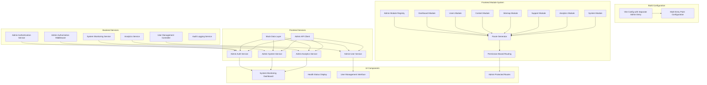
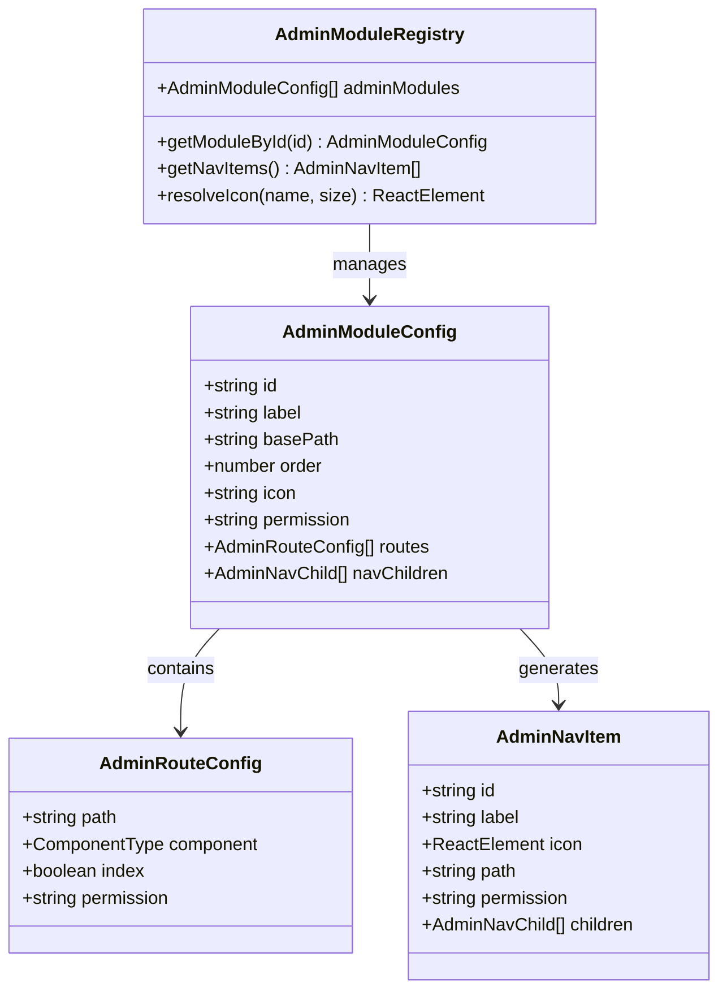
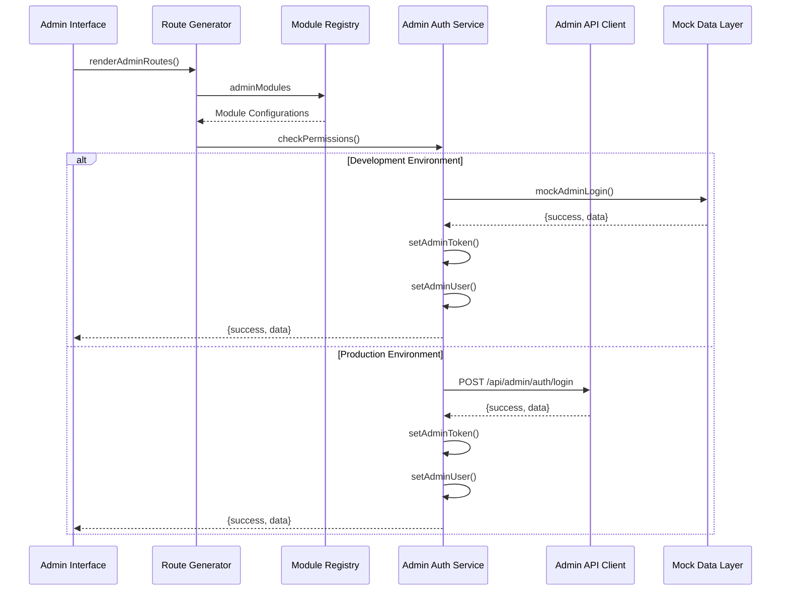
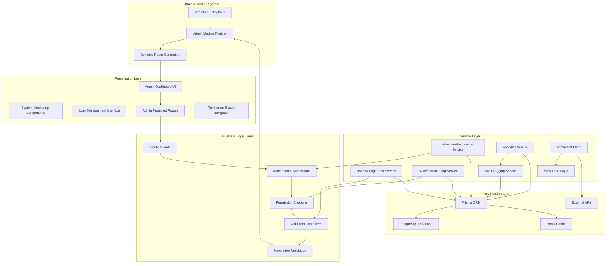
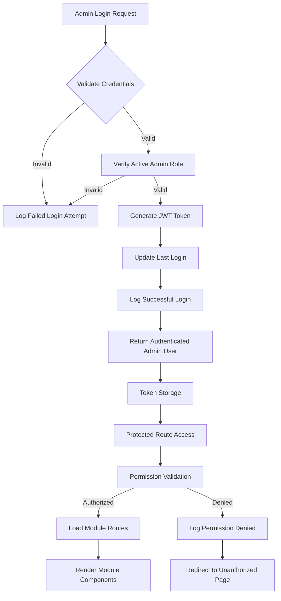
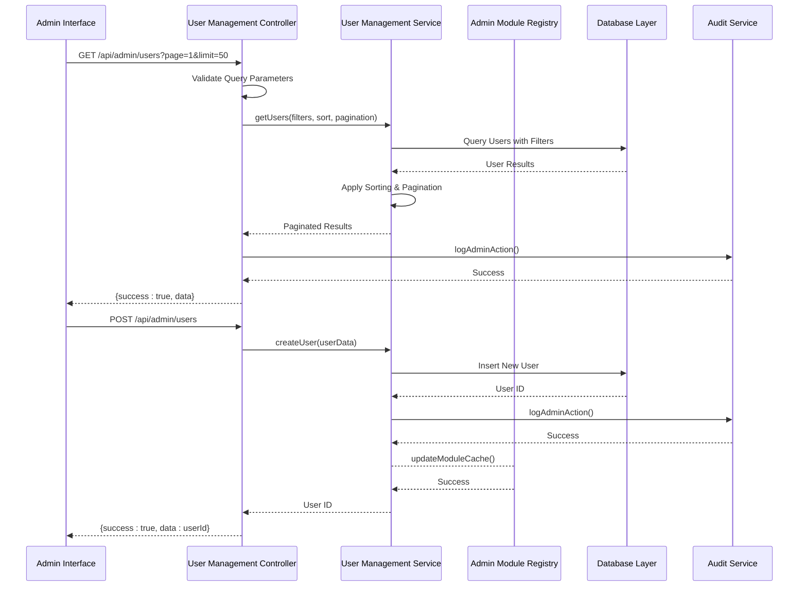
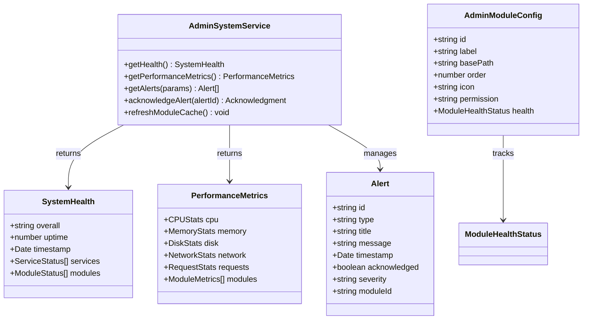
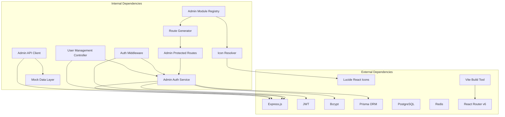

# Administrative Services Layer

<cite>
**Referenced Files in This Document**
- [admin-auth.service.ts](file://src/modules/admin/admin-auth.service.ts)
- [admin-auth.controller.ts](file://src/modules/admin/admin-auth.controller.ts)
- [admin-auth.middleware.ts](file://src/modules/admin/admin-auth.middleware.ts)
- [user-management.controller.ts](file://src/modules/admin/user-management.controller.ts)
- [vite.config.ts](file://client/vite.config.ts)
- [renderAdminRoutes.tsx](file://client/src/features/admin/routes/renderAdminRoutes.tsx)
- [registry/index.ts](file://client/src/features/admin/registry/index.ts)
- [icon-resolver.tsx](file://client/src/features/admin/registry/icon-resolver.tsx)
- [adminAuthService.ts](file://client/src/services/admin/adminAuthService.ts)
- [adminUserService.ts](file://client/src/services/admin/adminUserService.ts)
- [adminSystemService.ts](file://client/src/services/admin/adminSystemService.ts)
- [adminAnalyticsService.ts](file://client/src/services/admin/adminAnalyticsService.ts)
- [adminMockData.ts](file://client/src/services/admin/adminMockData.ts)
- [adminApiClient.ts](file://client/src/services/admin/adminApiClient.ts)
- [SystemMonitoring.tsx](file://client/src/components/admin/SystemMonitoring.tsx)
- [SystemHealthMonitoring.tsx](file://client/src/components/admin/SystemHealthMonitoring.tsx)
- [service-monitor-agent.js](file://service-monitor-agent.js)
</cite>

## Update Summary
**Changes Made**
- Updated architecture overview to reflect new separate Vite entry point for admin panel
- Added documentation for new module-based organization with admin registry system
- Enhanced admin modules coverage including dashboard, users, content, sitemap, support, analytics, and system modules
- Updated frontend service integration to reflect new environment-aware admin API client
- Added permission-based routing documentation with AdminProtectedRoute implementation

## Table of Contents
1. [Introduction](#introduction)
2. [Project Structure](#project-structure)
3. [Core Components](#core-components)
4. [Architecture Overview](#architecture-overview)
5. [Detailed Component Analysis](#detailed-component-analysis)
6. [Dependency Analysis](#dependency-analysis)
7. [Performance Considerations](#performance-considerations)
8. [Troubleshooting Guide](#troubleshooting-guide)
9. [Conclusion](#conclusion)

## Introduction

The Administrative Services Layer is a comprehensive backend and frontend framework designed to provide robust administrative capabilities for the Thumbnail Maker platform. This layer encompasses user management, authentication, authorization, system monitoring, analytics, and content management functionalities. The system implements a modern multi-layered architecture with clear separation of concerns, supporting both development and production environments through environment-aware service implementations.

**Updated** The administrative layer now features a completely redesigned architecture with a separate Vite entry point for the admin panel, module-based organization with a centralized admin registry system, and enhanced permission-based routing. The system serves as the central control hub for platform operators, providing tools for user administration, system health monitoring, content moderation, and operational analytics with comprehensive security measures including role-based access control, detailed audit logging, and secure authentication mechanisms.

## Project Structure

The Administrative Services Layer follows a modern modular architecture with clear separation between backend services, frontend components, and a sophisticated admin module system:



**Diagram sources**
- [vite.config.ts:15-22](file://client/vite.config.ts#L15-L22)
- [registry/index.ts:12-32](file://client/src/features/admin/registry/index.ts#L12-L32)
- [renderAdminRoutes.tsx:52-79](file://client/src/features/admin/routes/renderAdminRoutes.tsx#L52-L79)
- [adminApiClient.ts:50-56](file://client/src/services/admin/adminApiClient.ts#L50-L56)

The structure demonstrates a clean separation between backend business logic and frontend presentation layers, with a sophisticated module registry system that enables dynamic route generation and permission-based access control. The separate Vite entry point allows for optimized loading and isolated bundling of admin-specific assets.

**Section sources**
- [vite.config.ts:1-47](file://client/vite.config.ts#L1-L47)
- [registry/index.ts:1-70](file://client/src/features/admin/registry/index.ts#L1-L70)
- [renderAdminRoutes.tsx:1-79](file://client/src/features/admin/routes/renderAdminRoutes.tsx#L1-L79)

## Core Components

### Modern Admin Module System

The new admin module system provides a structured approach to organizing administrative functionality with centralized configuration and dynamic route generation.



**Diagram sources**
- [registry/index.ts:23-32](file://client/src/features/admin/registry/index.ts#L23-L32)
- [registry/index.ts:45-67](file://client/src/features/admin/registry/index.ts#L45-L67)

The registry system manages seven core admin modules: dashboard, users, content, sitemap, support, analytics, and system, each with its own configuration, routes, and permission requirements. The system supports nested navigation items and dynamic icon resolution.

### Enhanced Frontend Service Layer

The frontend service layer provides sophisticated environment-aware implementations with comprehensive admin API client functionality.



**Diagram sources**
- [renderAdminRoutes.tsx:52-79](file://client/src/features/admin/routes/renderAdminRoutes.tsx#L52-L79)
- [adminApiClient.ts:50-56](file://client/src/services/admin/adminApiClient.ts#L50-L56)
- [adminMockData.ts:37-68](file://client/src/services/admin/adminMockData.ts#L37-L68)

**Section sources**
- [registry/index.ts:1-70](file://client/src/features/admin/registry/index.ts#L1-L70)
- [renderAdminRoutes.tsx:1-79](file://client/src/features/admin/routes/renderAdminRoutes.tsx#L1-L79)
- [adminApiClient.ts:41-67](file://client/src/services/admin/adminApiClient.ts#L41-L67)

## Architecture Overview

The Administrative Services Layer implements a modern multi-tiered architecture with clear separation between presentation, business logic, and data access layers, enhanced by the new module-based organization:



**Diagram sources**
- [vite.config.ts:15-22](file://client/vite.config.ts#L15-L22)
- [registry/index.ts:23-32](file://client/src/features/admin/registry/index.ts#L23-L32)
- [renderAdminRoutes.tsx:52-79](file://client/src/features/admin/routes/renderAdminRoutes.tsx#L52-L79)

The architecture supports horizontal scaling through microservice principles, with each admin module maintaining clear boundaries and responsibilities. The system implements circuit breaker patterns for external dependencies, comprehensive error handling mechanisms, and sophisticated permission-based routing.

**Section sources**
- [vite.config.ts:1-47](file://client/vite.config.ts#L1-L47)
- [registry/index.ts:1-70](file://client/src/features/admin/registry/index.ts#L1-L70)
- [renderAdminRoutes.tsx:1-79](file://client/src/features/admin/routes/renderAdminRoutes.tsx#L1-L79)

## Detailed Component Analysis

### Modern Authentication and Authorization System

The authentication system implements a comprehensive role-based access control (RBAC) mechanism with JWT token-based sessions, detailed audit logging, and sophisticated permission-based routing.



**Diagram sources**
- [admin-auth.service.ts:82-173](file://src/modules/admin/admin-auth.service.ts#L82-L173)
- [admin-auth.middleware.ts:78-114](file://src/modules/admin/admin-auth.middleware.ts#L78-L114)
- [renderAdminRoutes.tsx:62-68](file://client/src/features/admin/routes/renderAdminRoutes.tsx#L62-L68)

The system maintains detailed audit trails for all administrative actions, implementing a comprehensive logging framework that captures user activities, permission changes, and system events with appropriate severity levels. The new module registry system ensures that only authorized modules are loaded and rendered based on user permissions.

### Enhanced User Management Operations

The user management system provides comprehensive CRUD operations with advanced filtering, sorting, and bulk operations capabilities, integrated with the new module system.



**Diagram sources**
- [user-management.controller.ts:11-76](file://src/modules/admin/user-management.controller.ts#L11-L76)
- [admin-auth.service.ts:334-397](file://src/modules/admin/admin-auth.service.ts#L334-L397)
- [registry/index.ts:37-39](file://client/src/features/admin/registry/index.ts#L37-L39)

**Section sources**
- [user-management.controller.ts:1-82](file://src/modules/admin/user-management.controller.ts#L1-L82)
- [admin-auth.service.ts:334-397](file://src/modules/admin/admin-auth.service.ts#L334-L397)
- [registry/index.ts:37-39](file://client/src/features/admin/registry/index.ts#L37-L39)

### Advanced System Monitoring and Health Checks

The system monitoring component provides comprehensive health checking, performance metrics collection, and alert management capabilities, now integrated with the module-based architecture.



**Diagram sources**
- [adminSystemService.ts:16-38](file://client/src/services/admin/adminSystemService.ts#L16-L38)
- [adminMockData.ts:328-406](file://client/src/services/admin/adminMockData.ts#L328-L406)
- [registry/index.ts:23-32](file://client/src/features/admin/registry/index.ts#L23-L32)

The monitoring system implements automatic health checks with configurable intervals, supports both development mock data and production system integration, and provides module-specific health tracking through the registry system.

**Section sources**
- [adminSystemService.ts:1-38](file://client/src/services/admin/adminSystemService.ts#L1-L38)
- [adminMockData.ts:328-406](file://client/src/services/admin/adminMockData.ts#L328-L406)
- [registry/index.ts:23-32](file://client/src/features/admin/registry/index.ts#L23-L32)

### Sophisticated Frontend Service Integration

The frontend service layer provides environment-aware implementations with comprehensive admin API client functionality that seamlessly integrates with the module registry system.

```mermaid
flowchart LR
A[Environment Detection] --> B{shouldUseMockData()}
B --> |true| C[Mock Data Implementation]
B --> |false| D[Real API Implementation]
C --> E[mockAdminLogin]
C --> F[mockGetUsers]
C --> G[mockGetSystemHealth]
D --> H[adminApi.post]
D --> I[adminApi.get]
D --> J[adminApi.put]
E --> K[Development UI]
F --> K
G --> K
H --> L[Production UI]
I --> L
J --> L
K --> M[Module Registry Integration]
L --> M
M --> N[Dynamic Route Generation]
N --> O[Permission-Based Rendering]
```

**Diagram sources**
- [adminApiClient.ts:50-56](file://client/src/services/admin/adminApiClient.ts#L50-L56)
- [adminAuthService.ts:16-37](file://client/src/services/admin/adminAuthService.ts#L16-L37)
- [registry/index.ts:45-67](file://client/src/features/admin/registry/index.ts#L45-L67)

**Section sources**
- [adminApiClient.ts:41-67](file://client/src/services/admin/adminApiClient.ts#L41-L67)
- [adminAuthService.ts:1-60](file://client/src/services/admin/adminAuthService.ts#L1-L60)
- [registry/index.ts:45-67](file://client/src/features/admin/registry/index.ts#L45-L67)

## Dependency Analysis

The Administrative Services Layer exhibits strong modularity with well-defined dependencies between components, enhanced by the new module-based architecture:



**Diagram sources**
- [admin-auth.service.ts:1-5](file://src/modules/admin/admin-auth.service.ts#L1-L5)
- [registry/index.ts:9-10](file://client/src/features/admin/registry/index.ts#L9-L10)
- [renderAdminRoutes.tsx:12-15](file://client/src/features/admin/routes/renderAdminRoutes.tsx#L12-L15)

The dependency structure ensures loose coupling between modules while maintaining clear data flow and responsibility boundaries. The system implements proper error propagation and fallback mechanisms for external service failures, with the module registry providing centralized configuration management.

**Section sources**
- [admin-auth.service.ts:1-5](file://src/modules/admin/admin-auth.service.ts#L1-L5)
- [registry/index.ts:9-10](file://client/src/features/admin/registry/index.ts#L9-L10)
- [renderAdminRoutes.tsx:12-15](file://client/src/features/admin/routes/renderAdminRoutes.tsx#L12-L15)

## Performance Considerations

The Administrative Services Layer implements several performance optimization strategies, enhanced by the new module-based architecture:

### Optimized Module Loading
- Dynamic import of module components for lazy loading and reduced initial bundle size
- Module caching in registry to avoid repeated imports and configuration processing
- Permission-based route filtering to prevent unnecessary component rendering

### Advanced Caching Strategy
- Redis cache integration for frequently accessed user data and system configurations
- JWT token caching to reduce database queries for authenticated requests
- Mock data caching in development environments to minimize API overhead
- Module configuration caching for improved registry performance

### Intelligent API Client
- Environment-aware service switching to avoid unnecessary network calls in development
- Concurrent request handling for system monitoring and analytics operations
- Response compression and efficient JSON serialization
- Automatic retry mechanisms for failed API calls

### Scalable Monitoring
- Built-in performance metrics collection for CPU, memory, and request tracking
- Automatic health check intervals with configurable thresholds
- Module-specific performance monitoring and alerting
- Distributed tracing support for complex admin operations

## Troubleshooting Guide

### Common Authentication Issues

**Problem**: Admin login failing with invalid credentials
- Verify JWT_SECRET environment variable is properly configured
- Check user account status and admin role assignments
- Review authentication logs for failed attempts
- **Updated**: Verify module permissions are correctly assigned to admin roles

**Problem**: Permission denied errors on admin routes
- Verify admin user has appropriate roles and permissions
- Check authorization middleware configuration
- Review audit logs for permission denial events
- **Updated**: Verify module registry configuration includes proper permission mappings

### Module System Issues

**Problem**: Admin modules not loading or routes not appearing
- Verify module configuration in admin registry
- Check module base paths and route definitions
- Review permission requirements for each module
- **New**: Verify module icons are properly resolved in icon resolver

**Problem**: Dynamic routes not generating correctly
- Check admin module order configuration
- Verify route path construction logic
- Review permission-based route wrapping
- **New**: Verify module navigation children configuration

### System Monitoring Problems

**Problem**: System health checks failing intermittently
- Verify external service connectivity (PostgreSQL, Redis, AI services)
- Check service monitor agent configuration and logs
- Review health check endpoint availability
- **Updated**: Verify module-specific health monitoring is properly configured

**Problem**: Performance metrics not updating
- Verify monitoring service startup and configuration
- Check for rate limiting or API quota restrictions
- Review system resource utilization
- **New**: Verify module performance metrics collection is functioning

### Frontend Service Issues

**Problem**: Mock data not loading in development
- Verify shouldUseMockData() function returns correct environment
- Check browser console for CORS or network errors
- Validate mock data service initialization
- **Updated**: Verify admin API client environment detection is working

**Problem**: API calls failing in production
- Verify API endpoints are reachable and returning valid responses
- Check authentication token validity and expiration
- Review network connectivity and proxy configurations
- **New**: Verify Vite proxy configuration for admin API requests

**Section sources**
- [admin-auth.service.ts:144-151](file://src/modules/admin/admin-auth.service.ts#L144-L151)
- [admin-auth.middleware.ts:65-73](file://src/modules/admin/admin-auth.middleware.ts#L65-L73)
- [registry/index.ts:49-56](file://client/src/features/admin/registry/index.ts#L49-L56)
- [adminApiClient.ts:50-56](file://client/src/services/admin/adminApiClient.ts#L50-L56)
- [service-monitor-agent.js:199-241](file://service-monitor-agent.js#L199-L241)

## Conclusion

The Administrative Services Layer provides a robust, scalable foundation for platform administration with comprehensive security, monitoring, and management capabilities. The completely redesigned architecture with separate Vite entry points, module-based organization, and enhanced admin registry system represents a significant advancement in maintainability, scalability, and developer experience.

**Updated** Key strengths of the enhanced implementation include:

- **Modern Architecture**: Separate Vite entry point for optimized admin panel loading and isolated bundling
- **Modular Design**: Centralized admin registry system with dynamic route generation and permission-based routing
- **Enhanced Security**: Comprehensive RBAC system with detailed audit logging and module-specific permission controls
- **Scalability**: Modular design supporting horizontal scaling and microservice deployment with sophisticated caching
- **Developer Experience**: Mock data support, dynamic module loading, and comprehensive environment-aware service implementations
- **Operational Excellence**: Comprehensive monitoring and alerting capabilities with module-specific health tracking

The system successfully balances security requirements with usability, providing administrators with powerful tools while maintaining system stability and performance. The new module-based architecture enables easy extension and maintenance of administrative functionality, while the permission-based routing ensures secure access to sensitive administrative features.

Future enhancements could include distributed tracing for production deployments, container orchestration support, and advanced analytics dashboards for each admin module. The foundation is well-established for continued evolution and expansion of administrative capabilities.