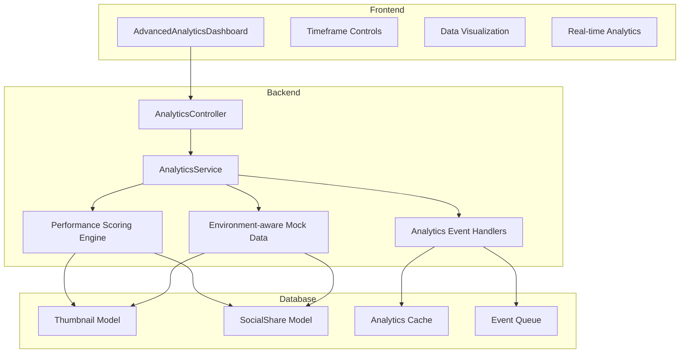
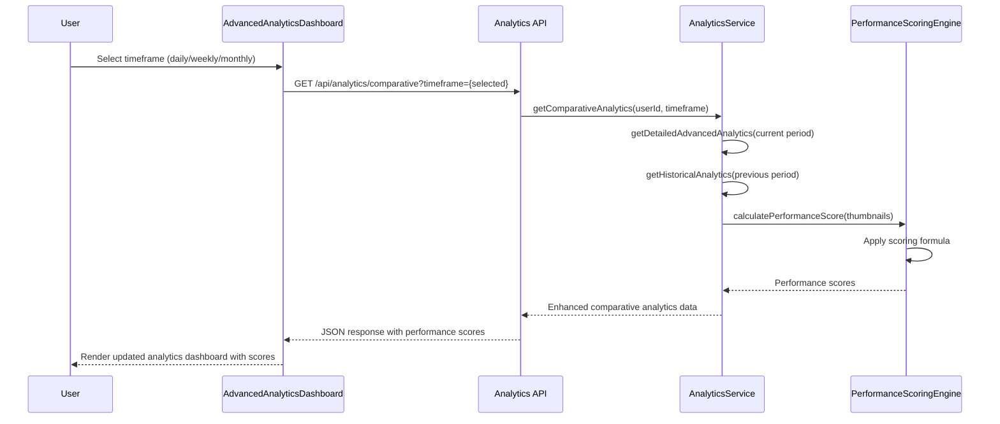
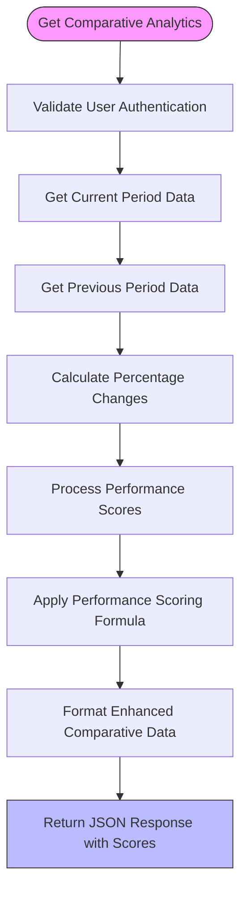

# Advanced Analytics Features

<cite>
**Referenced Files in This Document**
- [AdvancedAnalyticsDashboard.tsx](file://pikzels-clone/client/src/components/AdvancedAnalyticsDashboard.tsx)
- [analytics.service.ts](file://pikzels-clone/src/modules/analytics/analytics.service.ts)
- [analytics.controller.ts](file://pikzels-clone/src/modules/analytics/analytics.controller.ts)
- [analytics.routes.ts](file://pikzels-clone/src/modules/analytics/analytics.routes.ts)
- [advanced-analytics.md](file://pikzels-clone/docs/advanced-analytics.md)
- [adminAnalyticsService.ts](file://pikzels-clone/client/src/services/admin/adminAnalyticsService.ts)
- [adminMockData.ts](file://pikzels-clone/client/src/services/admin/adminMockData.ts)
- [analytics-handlers.ts](file://pikzels-clone/src/events/analytics-handlers.ts)
</cite>

## Update Summary
**Changes Made**
- Enhanced performance scoring algorithms with comprehensive scoring formula
- Added environment-aware mock data functionality for development and testing
- Expanded user statistics aggregation with detailed metrics
- Implemented real-time analytics event processing and caching
- Added comprehensive comparative analysis with historical data
- Integrated top performer ranking with performance scores

## Table of Contents
1. [Introduction](#introduction)
2. [Core Components](#core-components)
3. [Architecture Overview](#architecture-overview)
4. [Detailed Component Analysis](#detailed-component-analysis)
5. [Performance and Optimization](#performance-and-optimization)
6. [Use Cases and Integration](#use-cases-and-integration)
7. [Conclusion](#conclusion)

## Introduction
The Advanced Analytics system provides comprehensive insights into thumbnail creation patterns, performance metrics, and user engagement through enhanced analytics features. This documentation details the implementation of comparative analysis, predictive insights, performance benchmarking, and comprehensive user statistics aggregation that enable data-driven decision making for content creators. The system leverages historical data to generate trend forecasts, A/B test recommendations, and performance scoring algorithms with environment-aware mock data functionality.

## Core Components

The enhanced advanced analytics system consists of frontend and backend components with sophisticated performance scoring algorithms and comprehensive user statistics aggregation. The system aggregates historical data from thumbnail creation, social sharing activities, and real-time analytics events to generate meaningful insights with environment-aware mock data support.

**Section sources**
- [AdvancedAnalyticsDashboard.tsx](file://pikzels-clone/client/src/components/AdvancedAnalyticsDashboard.tsx#L1-L719)
- [analytics.service.ts](file://pikzels-clone/src/modules/analytics/analytics.service.ts#L1-L1410)

## Architecture Overview

The advanced analytics system follows a client-server architecture with clear separation between frontend presentation and backend data processing, enhanced with environment-aware mock data functionality and real-time analytics event processing.

**Diagram sources**
- [AdvancedAnalyticsDashboard.tsx](file://pikzels-clone/client/src/components/AdvancedAnalyticsDashboard.tsx#L59-L96)
- [analytics.controller.ts](file://pikzels-clone/src/modules/analytics/analytics.controller.ts#L1-L284)
- [analytics.service.ts](file://pikzels-clone/src/modules/analytics/analytics.service.ts#L1-L1410)
- [adminAnalyticsService.ts](file://pikzels-clone/client/src/services/admin/adminAnalyticsService.ts#L1-L53)

## Detailed Component Analysis

### AdvancedAnalyticsDashboard Component
The AdvancedAnalyticsDashboard component serves as the primary interface for viewing detailed analytics with timeframe filtering, comparative analysis, and performance scoring visualization. It provides users with granular insights into their thumbnail creation behavior, performance metrics, and engagement patterns.

#### Enhanced Data Interfaces
The component utilizes enhanced data interfaces for handling comprehensive analytics data:

**DetailedAdvancedAnalyticsData**: Contains productivity, editing, engagement, timeframe data, and creation trend metrics.

**ComparativeAnalyticsData**: Extends detailed analytics with comparison data between current and previous periods, including percentage changes for key metrics and performance score analysis.

**TopPerformer**: Represents individual thumbnails with calculated performance scores and engagement metrics.

#### Key Functions
The component implements several key functions to enhance user experience with performance scoring:

- **handleTimeframeChange**: Updates the selected timeframe and triggers data refresh with performance scoring
- **renderTrendIndicator**: Visualizes trend direction and magnitude with color-coded indicators
- **fetchAnalyticsData**: Retrieves enhanced analytics data from the backend API with comparative analysis
- **calculatePerformanceScore**: Integrates performance scoring algorithms for thumbnail evaluation

**Diagram sources**
- [AdvancedAnalyticsDashboard.tsx](file://pikzels-clone/client/src/components/AdvancedAnalyticsDashboard.tsx#L70-L96)
- [analytics.controller.ts](file://pikzels-clone/src/modules/analytics/analytics.controller.ts#L169-L200)
- [analytics.service.ts](file://pikzels-clone/src/modules/analytics/analytics.service.ts#L1054-L1111)

**Section sources**
- [AdvancedAnalyticsDashboard.tsx](file://pikzels-clone/client/src/components/AdvancedAnalyticsDashboard.tsx#L1-L719)
- [advanced-analytics.md](file://pikzels-clone/docs/advanced-analytics.md#L1-L218)

### Enhanced Analytics Service with Performance Scoring
The AnalyticsService class provides the core functionality for data aggregation, trend analysis, comparative metrics calculation, and comprehensive performance scoring algorithms. It implements sophisticated algorithms to process historical data, generate meaningful insights, and calculate performance scores for thumbnails.

#### Performance Scoring Algorithm
The system implements a comprehensive performance scoring algorithm with the following formula:
**Formula: (socialShares × 3) + (editCount × 1) + (downloadCount × 2) + (daysActive × 0.5)**

Key scoring factors:
- **Social Shares**: Weighted at 3x importance for engagement
- **Edit Count**: Weighted at 1x for complexity and refinement
- **Download Count**: Weighted at 2x for accessibility
- **Days Active**: Weighted at 0.5x for longevity and consistency

#### Comprehensive User Statistics Aggregation
The service implements extensive user statistics aggregation including:
- **User Stats**: Thumbnails created, click-through rate, templates used, total views, projects count, recent activity
- **Advanced Analytics**: Productivity metrics, editing complexity, engagement rates, consistency analysis
- **Top Performers**: Performance-ranked thumbnails with detailed metrics
- **Real-time Analytics**: Live event processing and caching for immediate insights

#### Comparative Analysis Implementation
The service implements comprehensive comparative analysis by comparing current period data with previous period data. The getComparativeAnalytics method calculates percentage changes for key metrics including thumbnails, average per day, sharing rate, and average edit complexity.

#### Real-time Analytics Event Processing
The system includes real-time analytics event processing through dedicated handlers:
- **Event Queue Processing**: Batch processing of analytics events with configurable intervals
- **Cache Management**: Real-time caching of user and project statistics
- **Platform-specific Tracking**: Separate statistics tracking for different platforms
- **Performance Monitoring**: Real-time performance metrics collection and storage

**Diagram sources**
- [analytics.service.ts](file://pikzels-clone/src/modules/analytics/analytics.service.ts#L1054-L1111)
- [analytics-handlers.ts](file://pikzels-clone/src/events/analytics-handlers.ts#L288-L316)

**Section sources**
- [analytics.service.ts](file://pikzels-clone/src/modules/analytics/analytics.service.ts#L86-L1410)
- [analytics.controller.ts](file://pikzels-clone/src/modules/analytics/analytics.controller.ts#L1-L284)

### Environment-Aware Mock Data Functionality
The system implements sophisticated environment-aware mock data functionality that automatically switches between real data and mock data based on the current environment configuration.

#### Environment Detection
The system automatically detects the current environment:
- **Development Environment**: Uses mock data with realistic delays
- **Test Environment**: Returns deterministic mock data for consistent testing
- **Production Environment**: Connects to real database services

#### Mock Data Generation
The mock data system provides realistic analytics data:
- **Performance Mock Data**: Simulated performance metrics with appropriate delays
- **Analytics Mock Data**: Generated thumbnail creation patterns and engagement data
- **Admin Mock Data**: Comprehensive administrative analytics with realistic distributions

#### Mock Data Service Integration
The admin analytics service demonstrates environment-aware functionality:
- **Automatic Mock Detection**: Uses `shouldUseMockData()` to determine data source
- **Consistent API Interface**: Same interface regardless of data source
- **Configurable Delays**: Realistic API latency simulation for development

**Section sources**
- [adminAnalyticsService.ts](file://pikzels-clone/client/src/services/admin/adminAnalyticsService.ts#L1-L53)
- [adminMockData.ts](file://pikzels-clone/client/src/services/admin/adminMockData.ts#L1-L31)

### API Response Formats
The enhanced analytics system provides structured API responses for predictive models, statistical summaries, and performance scoring as documented in the advanced-analytics.md file.

#### Enhanced Comparative Analytics Response
The `/api/analytics/comparative` endpoint returns comprehensive JSON structure containing:
- Current period analytics data with performance scores
- Previous period analytics data with historical context
- Comparison metrics with percentage changes and performance analysis
- Detailed performance score calculations for thumbnails

#### Performance Scoring Response
The system generates performance scores for individual thumbnails with detailed metrics:
- **Performance Score**: Calculated using the comprehensive scoring formula
- **Social Shares**: Engagement metrics from social platforms
- **Edit Count**: Complexity and refinement metrics
- **Download Count**: Accessibility and reach metrics
- **Days Active**: Longevity and consistency metrics

#### Real-time Analytics Response
The system provides real-time analytics data through event processing:
- **Live Activity Streams**: Real-time user activity monitoring
- **Performance Metrics**: Current system performance indicators
- **Event Tracking**: Individual event processing and caching

**Section sources**
- [advanced-analytics.md](file://pikzels-clone/docs/advanced-analytics.md#L1-L218)
- [analytics.service.ts](file://pikzels-clone/src/modules/analytics/analytics.service.ts#L397-L459)
- [analytics-handlers.ts](file://pikzels-clone/src/events/analytics-handlers.ts#L174-L316)

## Performance and Optimization

### Computational Complexity
The enhanced analytics system is designed to handle data processing efficiently with improved performance characteristics:

- **Data retrieval**: O(n) where n is the number of thumbnails with optimized database queries
- **Timeframe filtering**: O(n) with efficient date comparisons and caching
- **Performance scoring**: O(m) where m is the number of thumbnails processed
- **Trend calculation**: O(n) for creation trend analysis with real-time updates
- **Comparative analysis**: O(n + m) where n and m are the sizes of current and previous datasets
- **Real-time processing**: O(k) where k is the number of events in the queue

### Enhanced Caching Strategies
The system implements comprehensive caching strategies for optimal performance:

- **Client-side caching**: The frontend component maintains state to avoid redundant API calls when switching between timeframes
- **Real-time caching**: Dedicated cache management for user and project statistics with configurable TTL
- **Performance metrics caching**: Real-time performance metrics stored in cache for immediate access
- **Event queue caching**: Batch processing with configurable flush intervals
- **Database query optimization**: Prisma queries optimized with proper indexing and selective field retrieval
- **Environment-aware caching**: Mock data caching for development environments

### Rate Limiting and Security Considerations
The system includes comprehensive rate limiting and security measures:
- API endpoints require authentication via JWT tokens
- User data isolation ensures users can only access their own analytics
- Input validation on all parameters prevents injection attacks
- Rate limiting protects against excessive API requests
- Real-time analytics event processing includes security validation
- Environment-aware mock data prevents accidental production data exposure

### Real-time Analytics Processing
The system implements real-time analytics processing for immediate insights:
- **Event Queue Management**: Configurable batch processing with automatic flushing
- **Performance Monitoring**: Real-time performance metrics collection and storage
- **Cache Synchronization**: Real-time cache updates for immediate data availability
- **Event Validation**: Comprehensive validation of incoming analytics events

**Section sources**
- [advanced-analytics.md](file://pikzels-clone/docs/advanced-analytics.md#L184-L218)
- [analytics.service.ts](file://pikzels-clone/src/modules/analytics/analytics.service.ts#L1-L1410)
- [analytics-handlers.ts](file://pikzels-clone/src/events/analytics-handlers.ts#L288-L316)

## Use Cases and Integration

### Data-Driven Design Decisions
The enhanced analytics system enables comprehensive data-driven design decisions by providing:
- **Cohort analysis**: Users can analyze creation patterns over different time periods with performance scoring
- **Cross-thumbnail performance comparison**: The system allows comparison of different thumbnails based on sharing rates, engagement, and calculated performance scores
- **Productivity optimization**: Insights into best creation hours, consistency, and performance scoring help users optimize their workflow
- **Performance benchmarking**: Real-time performance metrics and historical comparisons enable continuous improvement

### AI-Powered Thumbnail Suggestions
The system can integrate with AI-powered thumbnail suggestions through:
- **Performance-based recommendations**: Analyzing successful thumbnails (highest performance scores, most shared, most complex)
- **Pattern recognition**: Identifying patterns in high-performing content using performance scoring algorithms
- **Optimal timing suggestions**: Providing recommendations based on user productivity patterns and performance scores
- **Engagement prediction**: Using performance scores to predict thumbnail success rates

### Real-time Analytics Integration
The system provides comprehensive real-time analytics integration:
- **Live event processing**: Immediate processing of user actions and thumbnail creation events
- **Performance monitoring**: Real-time system performance metrics and user activity tracking
- **Dynamic dashboards**: Live-updating analytics displays with real-time data refresh
- **Alert systems**: Performance alerts and notifications based on real-time analytics

### Administrative Analytics
The system supports comprehensive administrative analytics:
- **Environment-aware data**: Automatic switching between mock data and real data based on environment
- **Comprehensive reporting**: Detailed analytics reports with export capabilities
- **System monitoring**: Complete system performance and usage analytics
- **User behavior analysis**: Detailed analysis of user engagement and platform usage patterns

**Section sources**
- [advanced-analytics.md](file://pikzels-clone/docs/advanced-analytics.md#L1-L218)
- [adminAnalyticsService.ts](file://pikzels-clone/client/src/services/admin/adminAnalyticsService.ts#L1-L53)
- [analytics-handlers.ts](file://pikzels-clone/src/events/analytics-handlers.ts#L174-L316)

## Conclusion
The Enhanced Advanced Analytics system provides a comprehensive solution for analyzing thumbnail creation patterns, performance metrics, and user engagement through sophisticated performance scoring algorithms, comprehensive user statistics aggregation, and environment-aware mock data functionality. By leveraging historical data, implementing comparative analysis, and integrating real-time analytics processing, the system enables users to make data-driven decisions and optimize their content creation workflow. The integration between the AdvancedAnalyticsDashboard component and backend services ensures efficient data retrieval and processing, while enhanced caching strategies and performance optimizations maintain responsiveness even with large datasets. The environment-aware mock data functionality provides seamless development and testing experiences while maintaining production-grade analytics capabilities.