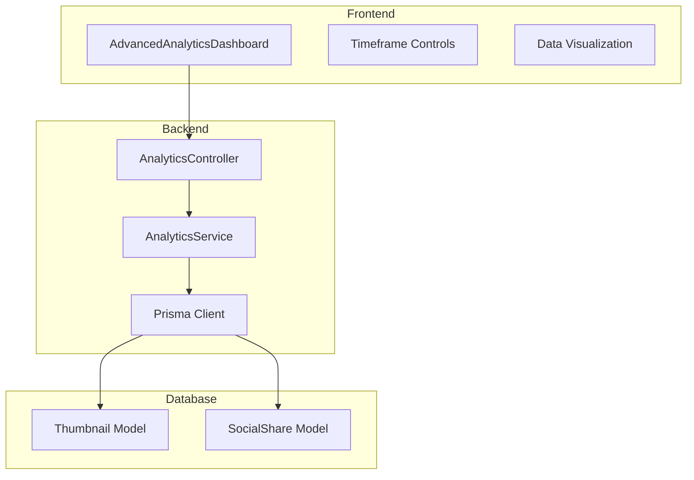
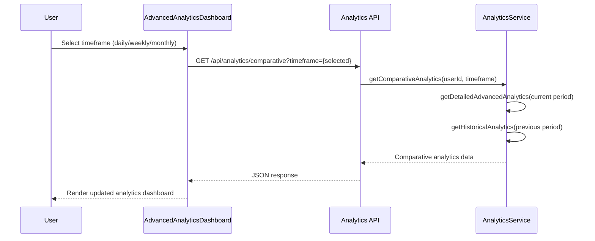
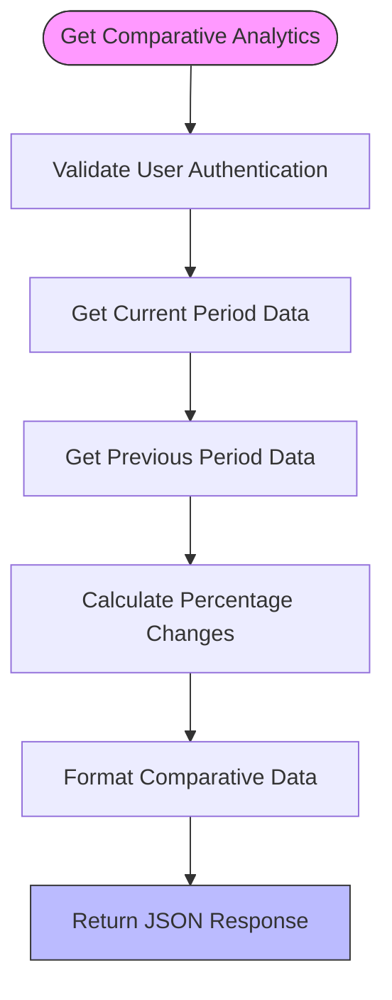

# Advanced Analytics Features

<cite>
**Referenced Files in This Document**   
- [AdvancedAnalyticsDashboard.tsx](file://pikzels-clone/client/src/components/AdvancedAnalyticsDashboard.tsx)
- [analytics.service.ts](file://pikzels-clone/src/modules/analytics/analytics.service.ts)
- [analytics.controller.ts](file://pikzels-clone/src/modules/analytics/analytics.controller.ts)
- [advanced-analytics.md](file://pikzels-clone/docs/advanced-analytics.md)
- [advanced-analytics-dashboard.md](file://pikzels-clone/docs/components/advanced-analytics-dashboard.md)
</cite>

## Table of Contents
1. [Introduction](#introduction)
2. [Core Components](#core-components)
3. [Architecture Overview](#architecture-overview)
4. [Detailed Component Analysis](#detailed-component-analysis)
5. [Performance and Optimization](#performance-and-optimization)
6. [Use Cases and Integration](#use-cases-and-integration)
7. [Conclusion](#conclusion)

## Introduction
The Advanced Analytics system provides comprehensive insights into thumbnail creation patterns, performance metrics, and user engagement. This documentation details the implementation of comparative analysis, predictive insights, and performance benchmarking features that enable data-driven decision making for content creators. The system leverages historical data to generate trend forecasts and A/B test recommendations, with a focus on the AdvancedAnalyticsDashboard component's interaction with backend services.

## Core Components

The advanced analytics system consists of frontend and backend components that work together to provide enriched analytics data. The system aggregates historical data from thumbnail creation and social sharing activities to generate meaningful insights.

**Section sources**
- [AdvancedAnalyticsDashboard.tsx](file://pikzels-clone/client/src/components/AdvancedAnalyticsDashboard.tsx#L1-L727)
- [analytics.service.ts](file://pikzels-clone/src/modules/analytics/analytics.service.ts#L4-L1082)

## Architecture Overview

The advanced analytics system follows a client-server architecture with clear separation between frontend presentation and backend data processing. The system is designed to handle time-based filtering, comparative analysis, and historical data aggregation efficiently.

**Diagram sources**
- [AdvancedAnalyticsDashboard.tsx](file://pikzels-clone/client/src/components/AdvancedAnalyticsDashboard.tsx#L57-L723)
- [analytics.controller.ts](file://pikzels-clone/src/modules/analytics/analytics.controller.ts#L1-L190)
- [analytics.service.ts](file://pikzels-clone/src/modules/analytics/analytics.service.ts#L4-L1082)

## Detailed Component Analysis

### AdvancedAnalyticsDashboard Component
The AdvancedAnalyticsDashboard component serves as the primary interface for viewing detailed analytics with timeframe filtering and comparative analysis. It provides users with granular insights into their thumbnail creation behavior and performance metrics.

#### Data Interfaces
The component utilizes two main data interfaces for handling analytics data:

**DetailedAdvancedAnalyticsData**: Contains productivity, editing, engagement, and timeframe data metrics.

**ComparativeAnalyticsData**: Extends detailed analytics with comparison data between current and previous periods, including percentage changes for key metrics.

#### Key Functions
The component implements several key functions to enhance user experience:

- **handleTimeframeChange**: Updates the selected timeframe and triggers data refresh
- **renderTrendIndicator**: Visualizes trend direction and magnitude with color-coded indicators
- **fetchAnalyticsData**: Retrieves analytics data from the backend API based on selected timeframe

**Diagram sources**
- [AdvancedAnalyticsDashboard.tsx](file://pikzels-clone/client/src/components/AdvancedAnalyticsDashboard.tsx#L57-L723)
- [analytics.controller.ts](file://pikzels-clone/src/modules/analytics/analytics.controller.ts#L158-L188)
- [analytics.service.ts](file://pikzels-clone/src/modules/analytics/analytics.service.ts#L735-L791)

**Section sources**
- [AdvancedAnalyticsDashboard.tsx](file://pikzels-clone/client/src/components/AdvancedAnalyticsDashboard.tsx#L1-L727)
- [advanced-analytics-dashboard.md](file://pikzels-clone/docs/components/advanced-analytics-dashboard.md#L1-L234)

### Backend Analytics Service
The AnalyticsService class provides the core functionality for data aggregation, trend analysis, and comparative metrics calculation. It implements sophisticated algorithms to process historical data and generate meaningful insights.

#### Comparative Analysis Implementation
The service implements comparative analysis by comparing current period data with previous period data. The getComparativeAnalytics method calculates percentage changes for key metrics such as thumbnail count, average per day, sharing rate, and average edit complexity.

#### Predictive Insights
The system generates predictive insights by analyzing historical patterns in thumbnail creation. Metrics such as consistency (percentage of active days) and creation trends help users understand their productivity patterns and forecast future performance.

**Diagram sources**
- [analytics.service.ts](file://pikzels-clone/src/modules/analytics/analytics.service.ts#L735-L791)
- [analytics.controller.ts](file://pikzels-clone/src/modules/analytics/analytics.controller.ts#L158-L188)

**Section sources**
- [analytics.service.ts](file://pikzels-clone/src/modules/analytics/analytics.service.ts#L4-L1082)
- [analytics.controller.ts](file://pikzels-clone/src/modules/analytics/analytics.controller.ts#L1-L190)

### API Response Formats
The advanced analytics system provides structured API responses for predictive models and statistical summaries as documented in the advanced-analytics.md file.

#### Comparative Analytics Response
The `/api/analytics/comparative` endpoint returns a comprehensive JSON structure containing:
- Current period analytics data
- Previous period analytics data
- Comparison metrics with percentage changes

#### Predictive Model Examples
The system generates trend forecasts based on historical data patterns. For example, the creation trend chart visualizes thumbnail creation patterns over time, helping users identify peak activity periods and consistency in creation habits.

**Section sources**
- [advanced-analytics.md](file://pikzels-clone/docs/advanced-analytics.md#L1-L218)
- [analytics.service.ts](file://pikzels-clone/src/modules/analytics/analytics.service.ts#L446-L705)
- [analytics.controller.ts](file://pikzels-clone/src/modules/analytics/analytics.controller.ts#L125-L155)

## Performance and Optimization

### Computational Complexity
The analytics system is designed to handle data processing efficiently. The computational complexity of key operations:

- **Data retrieval**: O(n) where n is the number of thumbnails
- **Timeframe filtering**: O(n) with efficient date comparisons
- **Trend calculation**: O(n) for creation trend analysis
- **Comparative analysis**: O(n + m) where n and m are the sizes of current and previous datasets

### Caching Strategies
The system implements several caching strategies to optimize performance:

- **Client-side caching**: The frontend component maintains state to avoid redundant API calls when switching between timeframes
- **Database query optimization**: Prisma queries are optimized with proper indexing and selective field retrieval
- **Efficient data processing**: Algorithms are designed to minimize memory usage and processing time

### Rate Limiting Considerations
The system includes rate limiting to prevent abuse and ensure fair usage:
- API endpoints require authentication via JWT tokens
- User data isolation ensures users can only access their own analytics
- Input validation on all parameters prevents injection attacks
- Rate limiting protects against excessive API requests

**Section sources**
- [advanced-analytics.md](file://pikzels-clone/docs/advanced-analytics.md#L1-L218)
- [analytics.service.ts](file://pikzels-clone/src/modules/analytics/analytics.service.ts#L4-L1082)

## Use Cases and Integration

### Data-Driven Design Decisions
The advanced analytics system enables data-driven design decisions by providing insights into:
- **Cohort analysis**: Users can analyze their creation patterns over different time periods
- **Cross-thumbnail performance comparison**: The system allows comparison of different thumbnails based on sharing rates and engagement
- **Productivity optimization**: Insights into best creation hours and consistency help users optimize their workflow

### AI-Powered Thumbnail Suggestions
The system can integrate with AI-powered thumbnail suggestions by:
- Analyzing successful thumbnails (most shared, most complex)
- Identifying patterns in high-performing content
- Providing recommendations based on historical performance data
- Suggesting optimal creation times based on user productivity patterns

**Section sources**
- [advanced-analytics.md](file://pikzels-clone/docs/advanced-analytics.md#L1-L218)
- [advanced-analytics-dashboard.md](file://pikzels-clone/docs/components/advanced-analytics-dashboard.md#L1-L234)

## Conclusion
The Advanced Analytics system provides a comprehensive solution for analyzing thumbnail creation patterns and performance. By aggregating historical data and implementing sophisticated comparative analysis, the system enables users to make data-driven decisions and optimize their content creation workflow. The integration between the AdvancedAnalyticsDashboard component and backend services ensures efficient data retrieval and processing, while caching strategies and performance optimizations maintain responsiveness even with large datasets.