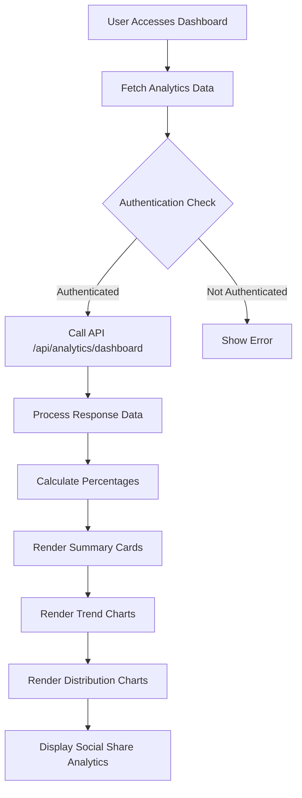
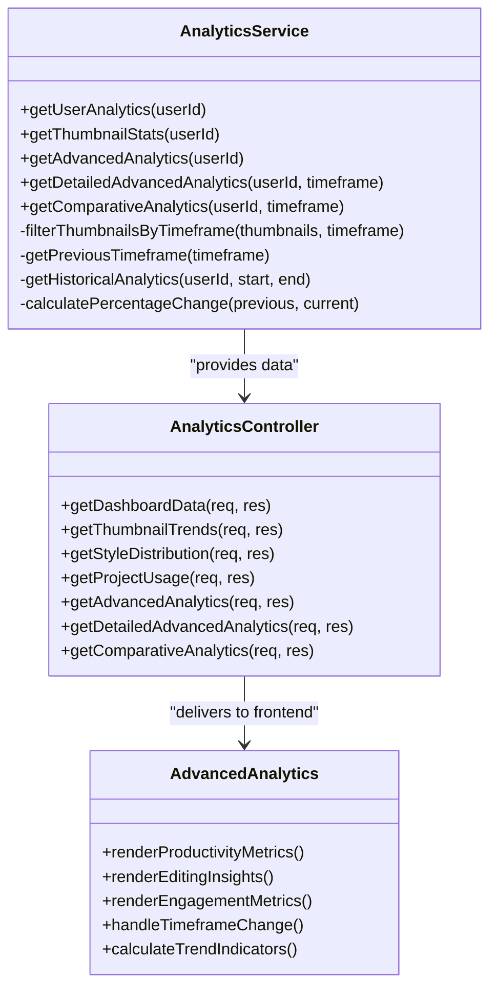
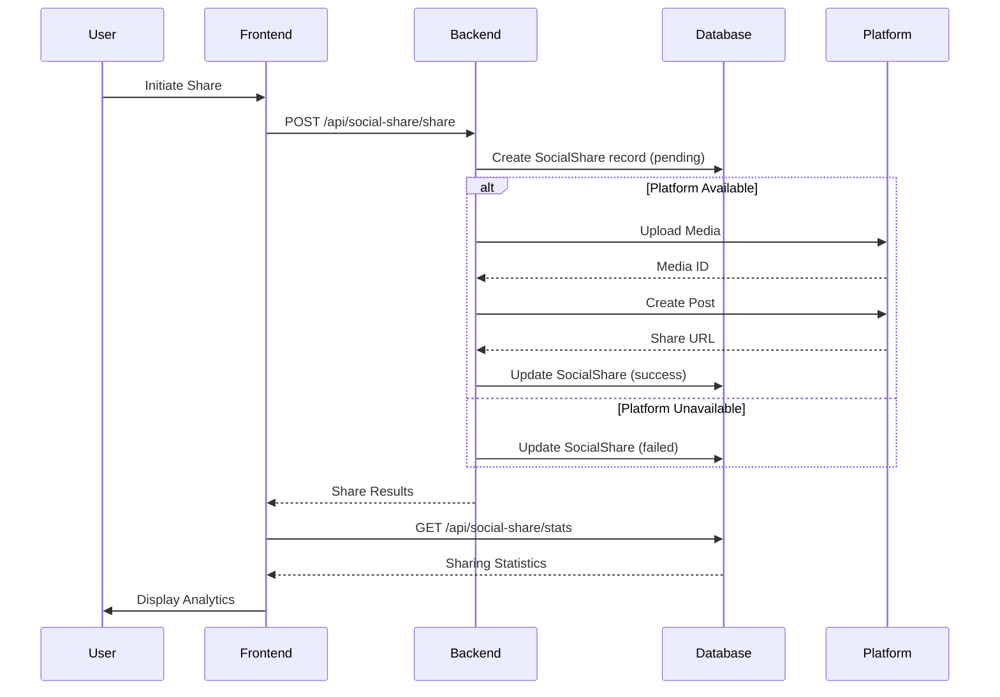

# Analytics & Performance Tracking

<cite>
**Referenced Files in This Document**   
- [analytics.service.ts](file:///pikzels-clone/src/modules/analytics/analytics.service.ts)
- [analytics.controller.ts](file:///pikzels-clone/src/modules/analytics/analytics.controller.ts)
- [analytics.routes.ts](file:///pikzels-clone/src/modules/analytics/analytics.routes.ts)
- [AnalyticsDashboard.tsx](file:///pikzels-clone/client/src/components/AnalyticsDashboard.tsx)
- [AdvancedAnalytics.tsx](file:///pikzels-clone/client/src/components/AdvancedAnalytics.tsx)
- [SocialShareAnalytics.tsx](file:///pikzels-clone/client/src/components/SocialShareAnalytics.tsx)
- [social-share.service.ts](file:///pikzels-clone/src/modules/social-share/social-share.service.ts)
- [social-share.controller.ts](file:///pikzels-clone/src/modules/social-share/social-share.controller.ts)
- [social-share.routes.ts](file:///pikzels-clone/src/modules/social-share/social-share.routes.ts)
- [migration.sql](file:///pikzels-clone/prisma/migrations/20250911134004_add_social_shares/migration.sql)
</cite>

## Table of Contents
1. [Introduction](#introduction)
2. [Data Collection System](#data-collection-system)
3. [Analytics Dashboard Implementation](#analytics-dashboard-implementation)
4. [Advanced Analytics Features](#advanced-analytics-features)
5. [Integration with Social Sharing](#integration-with-social-sharing)
6. [Performance and Data Aggregation](#performance-and-data-aggregation)
7. [Data Privacy Considerations](#data-privacy-considerations)
8. [Interpreting Analytics Data](#interpreting-analytics-data)

## Introduction
The Analytics & Performance Tracking system in the Thumbnail Maker application provides comprehensive insights into thumbnail creation and engagement metrics. This document details the implementation of the analytics infrastructure, focusing on thumbnail performance monitoring, user engagement tracking, and data-driven decision making. The system captures key metrics such as thumbnail views, shares, and user interaction patterns, presenting them through intuitive visualizations in the analytics dashboard. The architecture combines frontend components with backend services to deliver real-time performance insights while maintaining data privacy and system efficiency.

## Data Collection System
The data collection system tracks thumbnail views, shares, and engagement metrics through a structured approach that captures user interactions at multiple levels. The system records thumbnail creation events, editing activities, and social sharing actions, storing them in a relational database with appropriate relationships between entities. Each thumbnail creation is logged with metadata including creation timestamp, style parameters, and project association. Editing activities are tracked through change events that capture the complexity and frequency of modifications. Social sharing events are recorded with platform-specific details, share status, and engagement metrics. The data model includes foreign key relationships between thumbnails, users, and social shares, ensuring data integrity and enabling comprehensive analysis across different dimensions of user activity.

**Section sources**
- [analytics.service.ts](file:///pikzels-clone/src/modules/analytics/analytics.service.ts#L5-L406)
- [social-share.service.ts](file:///pikzels-clone/src/modules/social-share/social-share.service.ts#L5-L131)
- [migration.sql](file:///pikzels-clone/prisma/migrations/20250911134004_add_social_shares/migration.sql#L1-L15)

## Analytics Dashboard Implementation
The analytics dashboard implementation provides visualizations for click-through rates and performance trends through a comprehensive frontend component that fetches and displays analytics data. The dashboard presents key metrics in a grid layout with summary cards showing total thumbnails, projects, average creation rate, and recent activity. Performance trends are visualized through bar charts that display daily creation patterns, hourly distribution, and day-of-week analysis. The interface includes interactive elements such as the Advanced Analytics button that navigates to detailed metrics. Data is fetched from the backend API using authenticated requests, with proper loading states and error handling. The dashboard supports dark mode through theme context integration and provides responsive design for different screen sizes.

**Diagram sources**
- [AnalyticsDashboard.tsx](file:///pikzels-clone/client/src/components/AnalyticsDashboard.tsx#L57-L893)

**Section sources**
- [AnalyticsDashboard.tsx](file:///pikzels-clone/client/src/components/AnalyticsDashboard.tsx#L57-L893)
- [analytics.controller.ts](file:///pikzels-clone/src/modules/analytics/analytics.controller.ts#L7-L122)
- [analytics.routes.ts](file:///pikzels-clone/src/modules/analytics/analytics.routes.ts#L1-L46)

## Advanced Analytics Features
The advanced analytics features include comparative analysis and predictive insights through enhanced data processing and visualization capabilities. The system provides detailed metrics on productivity, editing complexity, and engagement patterns. Productivity insights include identification of the best creation day and hour, along with consistency metrics that measure regularity of thumbnail creation. Editing insights track the complexity of thumbnails through edit count analysis and identify the most complex thumbnail created by the user. Engagement insights monitor social sharing behavior, including platform distribution and sharing rates. The system supports timeframe filtering (daily, weekly, monthly) and provides comparative analytics that compare current performance with previous periods, highlighting trends and areas for improvement.

**Diagram sources**
- [analytics.service.ts](file:///pikzels-clone/src/modules/analytics/analytics.service.ts#L5-L406)
- [analytics.controller.ts](file:///pikzels-clone/src/modules/analytics/analytics.controller.ts#L7-L122)
- [AdvancedAnalytics.tsx](file:///pikzels-clone/client/src/components/AdvancedAnalytics.tsx#L25-L267)

**Section sources**
- [analytics.service.ts](file:///pikzels-clone/src/modules/analytics/analytics.service.ts#L5-L406)
- [analytics.controller.ts](file:///pikzels-clone/src/modules/analytics/analytics.controller.ts#L7-L122)
- [AdvancedAnalytics.tsx](file:///pikzels-clone/client/src/components/AdvancedAnalytics.tsx#L25-L267)

## Integration with Social Sharing
The integration between social sharing events and analytics recording is implemented through a coordinated system that captures sharing activities and updates analytics in real-time. When a user shares a thumbnail, the system creates a SocialShare record in the database with details about the platform, status, and engagement metrics. The SocialShare model includes foreign key relationships to both the Thumbnail and User models, ensuring proper data association. The analytics service aggregates sharing data to calculate metrics such as sharing rate and platform distribution. The SocialShareAnalytics component fetches sharing statistics and displays them in the dashboard using platform-specific visualizations. Error handling is implemented to track failed sharing attempts, providing users with insights into sharing success rates across different platforms.

**Diagram sources**
- [social-share.service.ts](file:///pikzels-clone/src/modules/social-share/social-share.service.ts#L5-L131)
- [social-share.controller.ts](file:///pikzels-clone/src/modules/social-share/social-share.controller.ts#L5-L282)
- [SocialShareAnalytics.tsx](file:///pikzels-clone/client/src/components/SocialShareAnalytics.tsx#L13-L148)

**Section sources**
- [social-share.service.ts](file:///pikzels-clone/src/modules/social-share/social-share.service.ts#L5-L131)
- [social-share.controller.ts](file:///pikzels-clone/src/modules/social-share/social-share.controller.ts#L5-L282)
- [social-share.routes.ts](file:///pikzels-clone/src/modules/social-share/social-share.routes.ts#L1-L26)
- [SocialShareAnalytics.tsx](file:///pikzels-clone/client/src/components/SocialShareAnalytics.tsx#L13-L148)

## Performance and Data Aggregation
The system addresses performance considerations through efficient data aggregation strategies and caching mechanisms. Data aggregation is performed at the service layer using optimized database queries that group and summarize data for different analytics views. The analytics service implements methods to calculate percentages, averages, and distributions while handling edge cases such as empty datasets. Caching is implicitly supported through client-side state management, where fetched analytics data is stored in component state to avoid redundant API calls during navigation. The system uses Prisma ORM for efficient database operations, with carefully designed queries that minimize data transfer and processing overhead. Time-based filtering is implemented to limit the scope of data processing for different timeframes, improving response times for detailed analytics views.

**Section sources**
- [analytics.service.ts](file:///pikzels-clone/src/modules/analytics/analytics.service.ts#L5-L406)
- [analytics.controller.ts](file:///pikzels-clone/src/modules/analytics/analytics.controller.ts#L7-L122)

## Data Privacy Considerations
Data privacy considerations are addressed through user data isolation and secure access controls. The system ensures that users can only access their own analytics data through authentication and authorization mechanisms. All API endpoints require JWT token authentication, and the backend verifies user ownership of requested resources. Analytics data is aggregated at the user level, preventing exposure of other users' information. Social sharing data is stored with user-specific access controls, ensuring that sharing statistics are only visible to the respective user. The system follows the principle of least privilege, with database queries scoped to the authenticated user's ID. Error handling is designed to avoid information leakage, with generic error messages returned to the client while detailed errors are logged server-side.

**Section sources**
- [analytics.controller.ts](file:///pikzels-clone/src/modules/analytics/analytics.controller.ts#L7-L122)
- [social-share.controller.ts](file:///pikzels-clone/src/modules/social-share/social-share.controller.ts#L5-L282)
- [analytics.routes.ts](file:///pikzels-clone/src/modules/analytics/analytics.routes.ts#L1-L46)
- [social-share.routes.ts](file:///pikzels-clone/src/modules/social-share/social-share.routes.ts#L1-L26)

## Interpreting Analytics Data
Interpreting analytics data involves understanding key metrics and making data-driven design decisions based on performance insights. The dashboard provides several key performance indicators that help users evaluate their thumbnail creation effectiveness. The editing percentage metric indicates how many thumbnails have been modified after creation, suggesting engagement with the editing tools. The sharing rate metric shows the proportion of thumbnails that have been shared, indicating content that users find valuable enough to distribute. Productivity metrics such as best creation hour and consistency help users identify optimal times for thumbnail creation. Users can leverage these insights to optimize their workflow, focusing on high-performing styles, creating during peak productivity hours, and refining thumbnails that receive higher engagement.

**Section sources**
- [AnalyticsDashboard.tsx](file:///pikzels-clone/client/src/components/AnalyticsDashboard.tsx#L57-L893)
- [AdvancedAnalytics.tsx](file:///pikzels-clone/client/src/components/AdvancedAnalytics.tsx#L25-L267)
- [analytics.service.ts](file:///pikzels-clone/src/modules/analytics/analytics.service.ts#L5-L406)