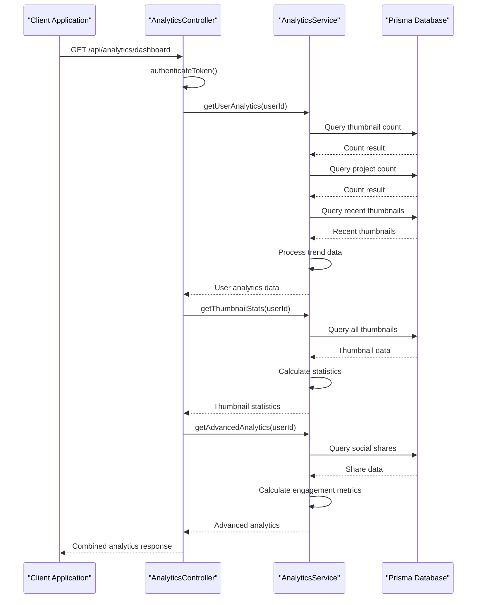
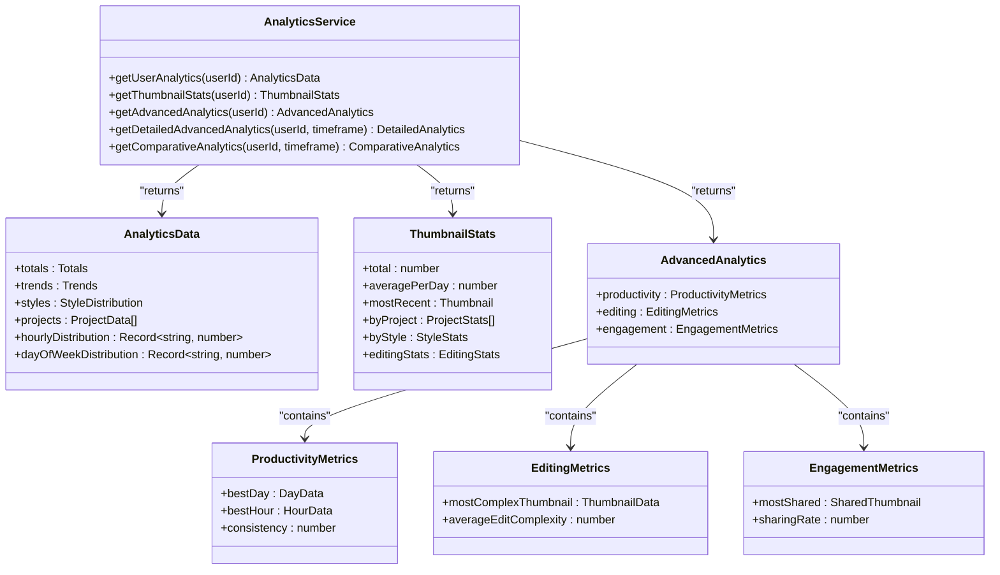
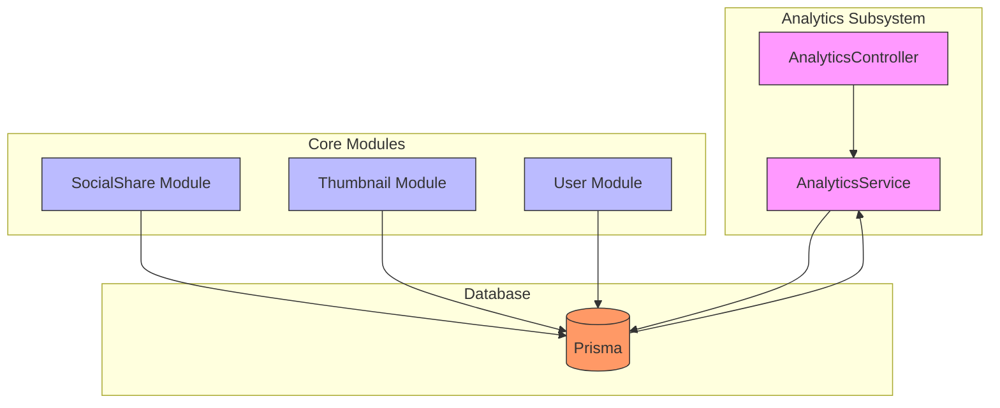
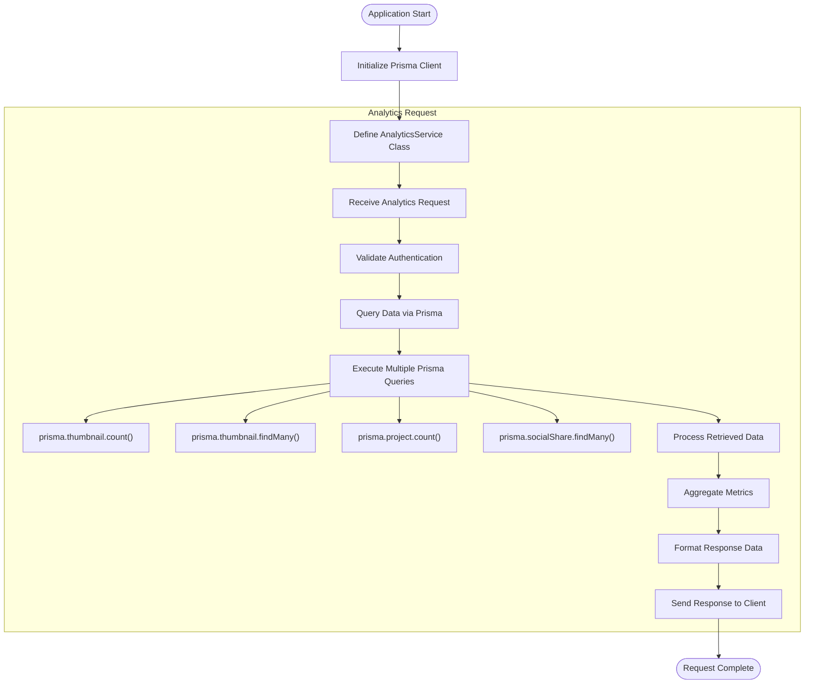
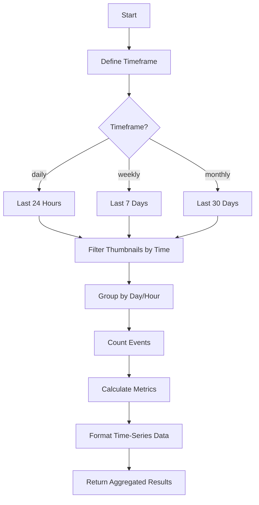
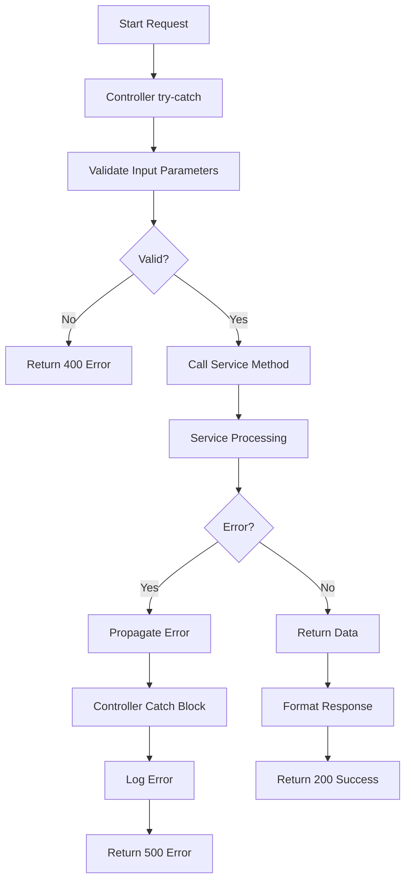

# Analytics Data Collection

<cite>
**Referenced Files in This Document**   
- [analytics.service.ts](file://pikzels-clone\src\modules\analytics\analytics.service.ts)
- [analytics.controller.ts](file://pikzels-clone\src\modules\analytics\analytics.controller.ts)
- [analytics.routes.ts](file://pikzels-clone\src\modules\analytics\analytics.routes.ts)
- [auth.middleware.ts](file://pikzels-clone\src\middleware\auth.middleware.ts)
- [migration.sql](file://pikzels-clone\prisma\migrations\20250911134004_add_social_shares\migration.sql)
</cite>

## Table of Contents
1. [Introduction](#introduction)
2. [Event Tracking Mechanism](#event-tracking-mechanism)
3. [Data Structure of Analytics Events](#data-structure-of-analytics-events)
4. [Integration with Social Sharing and Thumbnail Modules](#integration-with-social-sharing-and-thumbnail-modules)
5. [Data Persistence with Prisma](#data-persistence-with-prisma)
6. [Engagement Metrics and Field Definitions](#engagement-metrics-and-field-definitions)
7. [Timestamp-Based Aggregation](#timestamp-based-aggregation)
8. [Middleware for User Context Enrichment](#middleware-for-user-context-enrichment)
9. [Data Validation and Error Handling](#data-validation-and-error-handling)
10. [Data Integrity Under High Load](#data-integrity-under-high-load)
11. [Extending the Event Model](#extending-the-event-model)

## Introduction

The analytics data collection sub-system in the Thumbnail Maker application captures user interactions such as thumbnail views, shares, and edits. This document provides a comprehensive overview of how these events are tracked, stored, and analyzed. The system leverages Prisma for data persistence and integrates with social sharing and thumbnail modules to provide comprehensive engagement metrics. The analytics service is designed to handle high loads while maintaining data integrity through robust error handling and validation mechanisms.

## Event Tracking Mechanism

The analytics sub-system captures user interactions through a series of well-defined endpoints that collect data on thumbnail creation, editing, and sharing activities. The event tracking mechanism is implemented through the AnalyticsController class, which exposes several endpoints for retrieving different types of analytics data.

The primary entry point for analytics data is the `/dashboard` endpoint, which aggregates multiple metrics including user analytics, thumbnail statistics, and advanced analytics. This endpoint serves as a comprehensive overview of user engagement with the application.



**Diagram sources**
- [analytics.controller.ts](file://pikzels-clone\src\modules\analytics\analytics.controller.ts#L14-L41)
- [analytics.service.ts](file://pikzels-clone\src\modules\analytics\analytics.service.ts#L4-L1084)

**Section sources**
- [analytics.controller.ts](file://pikzels-clone\src\modules\analytics\analytics.controller.ts#L14-L41)
- [analytics.service.ts](file://pikzels-clone\src\modules\analytics\analytics.service.ts#L4-L1084)

## Data Structure of Analytics Events

The analytics system captures a comprehensive set of data points related to user interactions with thumbnails. The data structure is designed to support both real-time analytics and historical trend analysis. The primary data entities include user analytics, thumbnail statistics, and engagement metrics.

User analytics include metrics such as total thumbnails created, total projects created, and thumbnails created in the last 30 days. The system also tracks thumbnail creation trends over the last 7 days, providing insights into user productivity patterns.

Thumbnail statistics capture detailed information about individual thumbnails, including title, creation date, parameters, and associated project. The system calculates average thumbnails per day and groups thumbnails by project and style, providing insights into user preferences and workflow patterns.

Engagement metrics focus on social sharing activities, tracking which thumbnails are shared most frequently and on which platforms. The system also captures editing complexity metrics, including the number of edits made to each thumbnail and the average edit complexity.



**Diagram sources**
- [analytics.service.ts](file://pikzels-clone\src\modules\analytics\analytics.service.ts#L4-L1084)

**Section sources**
- [analytics.service.ts](file://pikzels-clone\src\modules\analytics\analytics.service.ts#L4-L1084)

## Integration with Social Sharing and Thumbnail Modules

The analytics sub-system is tightly integrated with both the social sharing and thumbnail modules, enabling comprehensive tracking of user engagement across these features. The integration is achieved through direct database queries to the Prisma client, which provides access to data from both modules.

For social sharing integration, the analytics service queries the SocialShare table to gather data on thumbnail sharing activities. This includes tracking which thumbnails have been shared, on which platforms (Facebook, LinkedIn, Pinterest, Twitter), and when they were shared. The system also captures engagement metrics from social platforms when available.

The thumbnail module integration allows the analytics service to track thumbnail creation, editing, and styling activities. The service queries the Thumbnail table to gather data on thumbnail creation dates, associated projects, and styling parameters. It also analyzes the parameters field to determine the style of each thumbnail (bold, minimalist, dramatic, or other) and to count the number of edits made to each thumbnail.



**Diagram sources**
- [analytics.service.ts](file://pikzels-clone\src\modules\analytics\analytics.service.ts#L4-L1084)
- [migration.sql](file://pikzels-clone\prisma\migrations\20250911134004_add_social_shares\migration.sql#L1-L16)

**Section sources**
- [analytics.service.ts](file://pikzels-clone\src\modules\analytics\analytics.service.ts#L4-L1084)
- [migration.sql](file://pikzels-clone\prisma\migrations\20250911134004_add_social_shares\migration.sql#L1-L16)

## Data Persistence with Prisma

The analytics sub-system uses Prisma as the ORM for data persistence, providing a type-safe and efficient interface to the underlying database. The AnalyticsService class leverages Prisma's query methods to retrieve and aggregate data from multiple tables, including Thumbnail, Project, and SocialShare.

Data persistence occurs implicitly through the analytics queries, as the system reads from existing tables rather than writing new analytics records. This read-only approach ensures data consistency and reduces the risk of data corruption. The Prisma client is instantiated at the top of the analytics.service.ts file and used throughout the service methods to query the database.

The service employs various Prisma query patterns to optimize performance and reduce database load. These include selective field selection using the `select` parameter, filtering with the `where` parameter, and sorting with the `orderBy` parameter. The service also uses Prisma's aggregation methods, such as `count`, to efficiently calculate metrics without retrieving large datasets.



**Diagram sources**
- [analytics.service.ts](file://pikzels-clone\src\modules\analytics\analytics.service.ts#L4-L1084)

**Section sources**
- [analytics.service.ts](file://pikzels-clone\src\modules\analytics\analytics.service.ts#L4-L1084)

## Engagement Metrics and Field Definitions

The analytics sub-system captures a comprehensive set of engagement metrics that provide insights into user behavior and preferences. These metrics are organized into several categories, each with specific field definitions and calculation methods.

Productivity metrics include the best day and best hour for thumbnail creation, calculated by analyzing the distribution of thumbnail creation timestamps. The consistency metric measures the percentage of days with at least one thumbnail created, providing insight into user engagement patterns.

Editing metrics focus on the complexity of thumbnail edits, with fields including the most complex thumbnail (measured by the number of edits) and the average edit complexity across all thumbnails. These metrics are derived from the parameters field in the Thumbnail table, which stores edit history as a JSON object.

Engagement metrics track social sharing activities, with fields including the most shared thumbnail, sharing rate (percentage of thumbnails shared), and platform distribution. The sharing rate is calculated by comparing the number of unique thumbnails shared to the total number of thumbnails created by the user.

```mermaid
erDiagram
USER ||--o{ THUMBNAIL : creates
USER ||--o{ SOCIAL_SHARE : shares
THUMBNAIL ||--o{ SOCIAL_SHARE : has
USER {
string id PK
string email
string name
datetime createdAt
}
THUMBNAIL {
string id PK
string title
string userId FK
string projectId FK
json parameters
datetime createdAt
datetime updatedAt
}
SOCIAL_SHARE {
string id PK
string thumbnailId FK
string userId FK
string platform
string shareUrl
string status
text errorMessage
datetime sharedAt
json engagement
}
THUMBNAIL }|--|| STYLE : has
STYLE {
string name PK
string description
}
```

**Diagram sources**
- [analytics.service.ts](file://pikzels-clone\src\modules\analytics\analytics.service.ts#L4-L1084)
- [migration.sql](file://pikzels-clone\prisma\migrations\20250911134004_add_social_shares\migration.sql#L1-L16)

**Section sources**
- [analytics.service.ts](file://pikzels-clone\src\modules\analytics\analytics.service.ts#L4-L1084)
- [migration.sql](file://pikzels-clone\prisma\migrations\20250911134004_add_social_shares\migration.sql#L1-L16)

## Timestamp-Based Aggregation

The analytics sub-system employs timestamp-based aggregation to provide time-series insights into user behavior. This approach allows the system to analyze patterns and trends over various time periods, from hourly to monthly.

The system uses JavaScript Date objects to define time ranges for aggregation, with helper methods like `filterThumbnailsByTimeframe` that accept a timeframe parameter ('daily', 'weekly', or 'monthly') and return filtered data accordingly. For daily aggregation, the system looks at the last 24 hours; for weekly, the last 7 days; and for monthly, the last 30 days.

Timestamp aggregation is used in several key metrics. The creation trend metric groups thumbnails by day, providing a daily count of thumbnail creations. The hourly distribution metric counts thumbnails created in each hour of the day, revealing patterns in user productivity throughout the day. The day of week distribution metric counts thumbnails created on each day of the week, showing weekly usage patterns.

The system also implements comparative analytics that compare current period data with previous period data, enabling users to track their progress over time. This is achieved through the `getComparativeAnalytics` method, which calculates percentage changes between periods for key metrics.



**Diagram sources**
- [analytics.service.ts](file://pikzels-clone\src\modules\analytics\analytics.service.ts#L4-L1084)

**Section sources**
- [analytics.service.ts](file://pikzels-clone\src\modules\analytics\analytics.service.ts#L4-L1084)

## Middleware for User Context Enrichment

The analytics sub-system relies on authentication middleware to enrich analytics data with user context and session information. The `authenticateToken` middleware, defined in auth.middleware.ts, is applied to all analytics routes, ensuring that only authenticated users can access analytics data.

When a request is made to an analytics endpoint, the middleware intercepts it and verifies the JWT token in the Authorization header. If the token is valid, the middleware queries the database to retrieve the user's information and attaches it to the request object as `req.user`. This user context is then available to the analytics controller and service methods.

The user context includes the user's ID, email, and name, which are used to filter analytics data to the requesting user only. This ensures data privacy and prevents users from accessing analytics data for other users. The user ID is particularly important as it is used as a filter parameter in all Prisma queries within the analytics service.

The middleware also handles error cases gracefully, returning appropriate HTTP status codes and error messages for missing, invalid, or expired tokens. This ensures that the analytics system maintains security while providing clear feedback to clients.

```mermaid
sequenceDiagram
participant Client as "Client Application"
participant Middleware as "authenticateToken"
participant DB as "Prisma Database"
participant Controller as "AnalyticsController"
Client->>Middleware : Request with JWT token
Middleware->>Middleware : Extract token from header
alt No token
Middleware-->>Client : 401 Unauthorized
stop
end
Middleware->>Middleware : Verify JWT signature
alt Invalid token
Middleware-->>Client : 403 Forbidden
stop
end
Middleware->>DB : Find user by ID
alt User not found
Middleware-->>Client : 401 Unauthorized
stop
end
DB-->>Middleware : User data
Middleware->>Controller : Attach user to request
Controller->>Controller : Process analytics request
Controller-->>Client : Return analytics data
```

**Diagram sources**
- [auth.middleware.ts](file://pikzels-clone\src\middleware\auth.middleware.ts#L1-L55)
- [analytics.routes.ts](file://pikzels-clone\src\modules\analytics\analytics.routes.ts#L1-L47)

**Section sources**
- [auth.middleware.ts](file://pikzels-clone\src\middleware\auth.middleware.ts#L1-L55)
- [analytics.routes.ts](file://pikzels-clone\src\modules\analytics\analytics.routes.ts#L1-L47)

## Data Validation and Error Handling

The analytics sub-system implements comprehensive data validation and error handling to ensure data integrity and provide a reliable user experience. The system employs both input validation and error handling at multiple levels, from the controller to the service layer.

In the AnalyticsController, each method is wrapped in a try-catch block to handle any unexpected errors that may occur during analytics processing. If an error occurs, the controller logs the error to the console and returns a 500 Internal Server Error response to the client. This prevents the application from crashing and provides a graceful degradation of service.

Input validation is performed on parameters that can be controlled by the client, such as the timeframe parameter in the `getDetailedAdvancedAnalytics` and `getComparativeAnalytics` methods. The controller validates that the timeframe is one of the allowed values ('daily', 'weekly', 'monthly') and returns a 400 Bad Request response if it is not.

The AnalyticsService methods include validation logic to handle edge cases, such as when a user has no thumbnails or when date calculations might result in division by zero. For example, the `getThumbnailStats` method checks if the user has any thumbnails before calculating the average per day, returning 0 if there are no thumbnails.



**Diagram sources**
- [analytics.controller.ts](file://pikzels-clone\src\modules\analytics\analytics.controller.ts#L14-L41)
- [analytics.service.ts](file://pikzels-clone\src\modules\analytics\analytics.service.ts#L4-L1084)

**Section sources**
- [analytics.controller.ts](file://pikzels-clone\src\modules\analytics\analytics.controller.ts#L14-L41)
- [analytics.service.ts](file://pikzels-clone\src\modules\analytics\analytics.service.ts#L4-L1084)

## Data Integrity Under High Load

The analytics sub-system is designed to maintain data integrity even under high load conditions. The system employs several strategies to ensure reliable performance and accurate data reporting when handling multiple concurrent requests.

One key strategy is the use of read-only queries to the database. Since the analytics service only reads data and does not modify it, there is no risk of write conflicts or data corruption under high load. This read-only approach also allows the database to optimize query performance through caching and query plan reuse.

The system minimizes database load by using selective field queries and aggregation functions. Instead of retrieving entire records, the service only selects the fields it needs for calculations. It also uses Prisma's built-in aggregation methods like `count` to perform calculations at the database level, reducing the amount of data transferred over the network.

To handle high request volumes, the system could be enhanced with caching mechanisms, such as Redis, to store frequently accessed analytics data. This would reduce the number of database queries and improve response times for common requests. The current implementation does not include caching, but the modular design of the service would make it easy to add caching layers in the future.

The error handling system ensures that even if individual requests fail, the overall system remains stable. By catching and logging errors at the controller level, the system prevents unhandled exceptions from crashing the server. This allows the application to continue serving other requests even if some analytics queries fail.

## Extending the Event Model

The analytics sub-system is designed to be extensible, allowing for the addition of custom tracking needs without major architectural changes. The modular structure of the AnalyticsService class makes it easy to add new methods for collecting and processing additional types of analytics data.

To extend the event model, developers can add new methods to the AnalyticsService class that query the database for additional data points or perform new types of aggregations. For example, a new method could be added to track user interactions with specific UI elements, such as button clicks or menu selections.

The system could also be extended to support custom event tracking by adding a new table to the database for storing custom events. This table could include fields for event type, timestamp, user ID, and custom payload data. The AnalyticsService could then include methods for recording and querying these custom events.

Another extension possibility is the addition of real-time analytics capabilities. This could be achieved by integrating with a message queue system like RabbitMQ or Kafka to process analytics events as they occur, rather than querying historical data. This would enable features like real-time dashboards and notifications.

The existing code structure follows clean coding practices that facilitate extension. Methods are well-documented, have single responsibilities, and use consistent patterns for error handling and data processing. This makes it easier for developers to understand the existing code and add new functionality in a way that is consistent with the overall architecture.