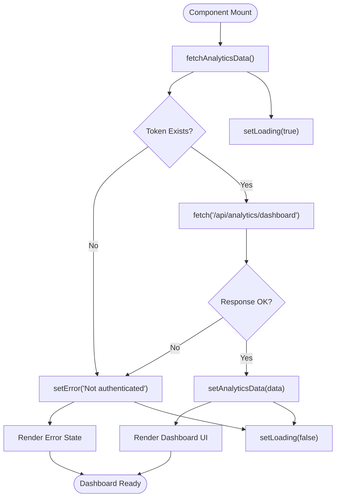
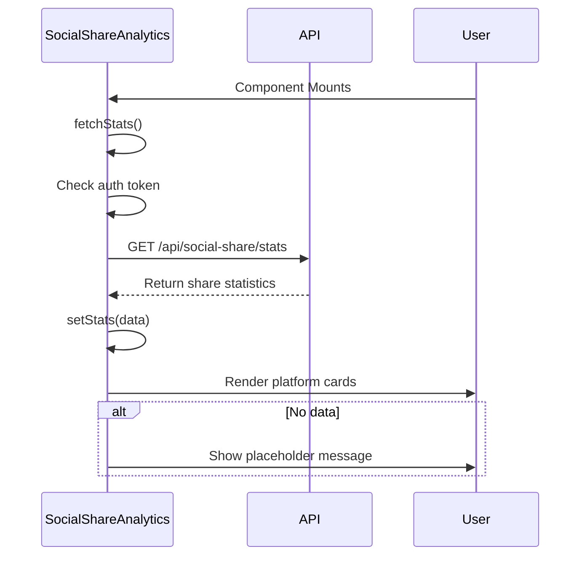
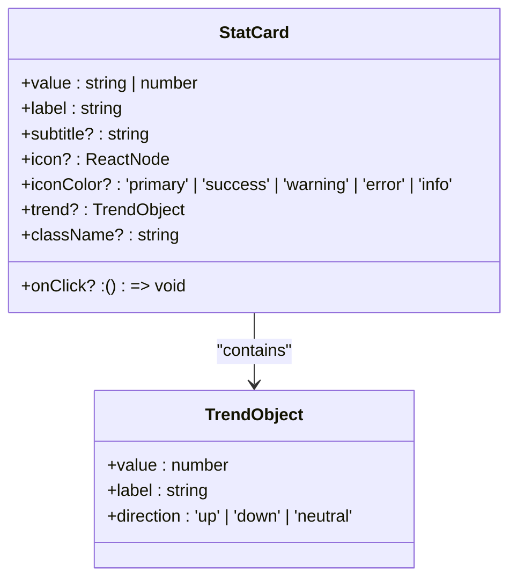
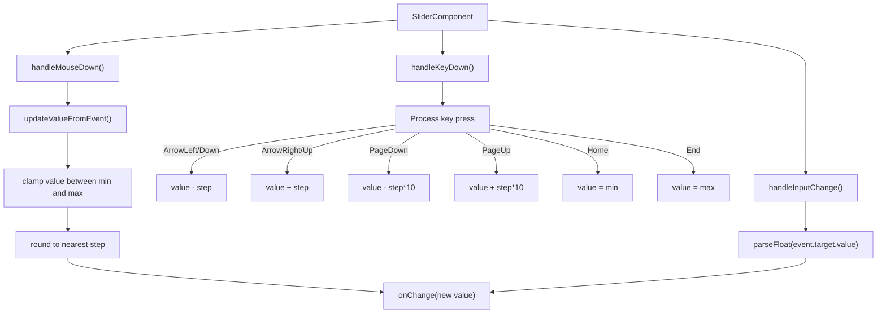
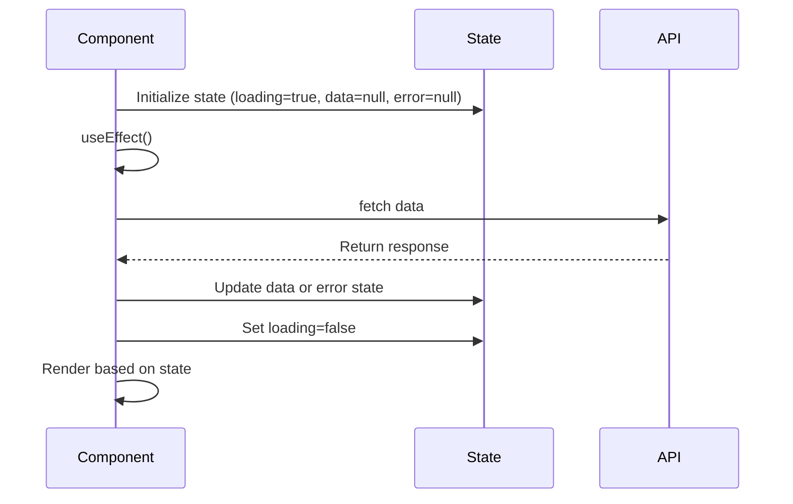
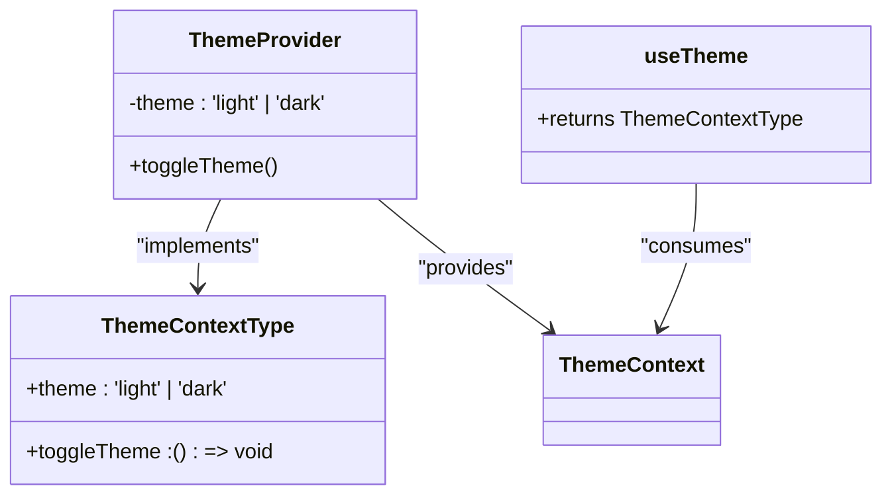

# Dashboard Visualization

<cite>
**Referenced Files in This Document**   
- [AnalyticsDashboard.tsx](file://pikzels-clone/client/src/components/AnalyticsDashboard.tsx)
- [SocialShareAnalytics.tsx](file://pikzels-clone/client/src/components/SocialShareAnalytics.tsx)
- [StatCard.tsx](file://pikzels-clone/client/src/components/ui/StatCard.tsx)
- [Slider.tsx](file://pikzels-clone/client/src/components/ui/Slider.tsx)
- [ThemeContext.tsx](file://pikzels-clone/client/src/contexts/ThemeContext.tsx)
</cite>

## Table of Contents
1. [Introduction](#introduction)
2. [Core Components Overview](#core-components-overview)
3. [AnalyticsDashboard Implementation](#analyticsdashboard-implementation)
4. [SocialShareAnalytics Component](#socialshareanalytics-component)
5. [UI Primitives Integration](#ui-primitives-integration)
6. [Data Visualization and Metrics](#data-visualization-and-metrics)
7. [State Management and Data Fetching](#state-management-and-data-fetching)
8. [Theming and Accessibility](#theming-and-accessibility)
9. [Performance Optimization](#performance-optimization)
10. [Responsive Design and Mobile Considerations](#responsive-design-and-mobile-considerations)
11. [Error Handling and Loading States](#error-handling-and-loading-states)
12. [Conclusion](#conclusion)

## Introduction
The analytics dashboard provides comprehensive insights into user thumbnail creation activity and performance metrics. This documentation details the implementation of the primary dashboard components, focusing on React state management, API integration, and visualization of key metrics such as click-through rates, share counts, and performance trends over time. The system leverages modern React patterns with proper state management, data fetching, and responsive design principles to deliver a seamless user experience across devices.

## Core Components Overview
The analytics dashboard consists of two primary components: AnalyticsDashboard and SocialShareAnalytics. These components work in conjunction with UI primitives like StatCard and Slider to present data in an accessible and visually appealing manner. The dashboard integrates with the ThemeContext for consistent theming across the application and implements responsive layouts that adapt to different screen sizes.

**Section sources**
- [AnalyticsDashboard.tsx](file://pikzels-clone/client/src/components/AnalyticsDashboard.tsx#L1-L897)
- [SocialShareAnalytics.tsx](file://pikzels-clone/client/src/components/SocialShareAnalytics.tsx#L1-L152)

## AnalyticsDashboard Implementation
The AnalyticsDashboard component serves as the main entry point for analytics visualization, displaying key metrics through a grid of StatCard components. It implements React's useState and useEffect hooks for managing component state and lifecycle events. The dashboard fetches analytics data from the '/api/analytics/dashboard' endpoint using the browser's fetch API, with proper authentication token handling from localStorage.

The component handles three primary states: loading, error, and data display. During loading, a spinner animation is shown. If an error occurs during data fetching, an error message is displayed with appropriate styling based on the current theme. When data is successfully retrieved, the dashboard renders various metrics including total thumbnails, projects, average creation rate, and recent activity.

**Diagram sources**
- [AnalyticsDashboard.tsx](file://pikzels-clone/client/src/components/AnalyticsDashboard.tsx#L57-L897)

**Section sources**
- [AnalyticsDashboard.tsx](file://pikzels-clone/client/src/components/AnalyticsDashboard.tsx#L57-L897)

## SocialShareAnalytics Component
The SocialShareAnalytics component specializes in displaying social sharing metrics across multiple platforms including Twitter, Facebook, LinkedIn, and Pinterest. It follows a similar pattern to the main dashboard with state management for loading, error, and data states. The component fetches social share statistics from the '/api/social-share/stats' endpoint and displays them in a responsive grid layout.

Each platform's statistics are presented in a card format showing total shares, successful shares, and failed shares. The component uses visual indicators (emoji icons) to represent each platform and includes a progress bar showing the success rate percentage. When no data is available, a placeholder message encourages users to share thumbnails to generate analytics.

**Diagram sources**
- [SocialShareAnalytics.tsx](file://pikzels-clone/client/src/components/SocialShareAnalytics.tsx#L13-L148)

**Section sources**
- [SocialShareAnalytics.tsx](file://pikzels-clone/client/src/components/SocialShareAnalytics.tsx#L13-L148)

## UI Primitives Integration
The dashboard components integrate with several UI primitives to ensure consistency and reusability across the application. The StatCard component is used extensively to display key metrics with consistent styling, while the Slider component provides interactive controls for data filtering and manipulation.

### StatCard Integration
The StatCard component accepts various props including value, label, subtitle, icon, and trend indicators. It supports different color variants for the icon background and includes accessibility features through proper semantic HTML elements. The component is styled using CSS classes that follow BEM naming conventions for maintainability.

**Diagram sources**
- [StatCard.tsx](file://pikzels-clone/client/src/components/ui/StatCard.tsx#L27-L134)

### Slider Integration
The Slider component implements a fully accessible range input with mouse and keyboard support. It includes features such as drag-to-adjust, keyboard navigation (arrow keys, Page Up/Down, Home/End), and step-based value changes. The component uses refs to manage DOM elements and implements proper event handling for mouse and keyboard interactions.

**Diagram sources**
- [Slider.tsx](file://pikzels-clone/client/src/components/ui/Slider.tsx#L32-L193)

**Section sources**
- [StatCard.tsx](file://pikzels-clone/client/src/components/ui/StatCard.tsx#L1-L138)
- [Slider.tsx](file://pikzels-clone/client/src/components/ui/Slider.tsx#L1-L196)

## Data Visualization and Metrics
The dashboard visualizes key metrics through various chart types and data representations. The main AnalyticsDashboard includes bar charts for trend analysis, percentage bars for distribution metrics, and numerical displays for key performance indicators.

### Key Metrics Displayed
- **Thumbnail Creation Trends**: Daily creation trends displayed as a horizontal bar chart
- **Style Distribution**: Percentage breakdown of thumbnail styles used
- **Project Distribution**: Distribution of thumbnails across projects
- **Editing Metrics**: Percentage of edited thumbnails and average edits per thumbnail
- **Productivity Insights**: Best creation hour and day of week distribution
- **Engagement Metrics**: Social sharing rates and platform-specific statistics

The visualization components use inline styles for dynamic height calculations based on data values, ensuring proportional representation of metrics. Color coding follows the application's design system with indigo for primary metrics, green for positive indicators, and yellow for warnings.

**Section sources**
- [AnalyticsDashboard.tsx](file://pikzels-clone/client/src/components/AnalyticsDashboard.tsx#L57-L897)
- [SocialShareAnalytics.tsx](file://pikzels-clone/client/src/components/SocialShareAnalytics.tsx#L13-L148)

## State Management and Data Fetching
The dashboard components implement React's built-in state management using the useState hook for local component state. The useEffect hook handles side effects such as data fetching on component mount. Both components follow the same pattern for managing asynchronous operations:

1. Initialize state variables for data, loading, and error conditions
2. Implement an async fetch function within useEffect
3. Set loading state to true before API call
4. Handle authentication by retrieving token from localStorage
5. Make API request with proper headers
6. Process response and update state accordingly
7. Handle errors with appropriate messaging
8. Set loading state to false in finally block

The components use proper dependency arrays in useEffect hooks (empty array for mounting once) and implement cleanup functions where necessary to prevent memory leaks.

**Diagram sources**
- [AnalyticsDashboard.tsx](file://pikzels-clone/client/src/components/AnalyticsDashboard.tsx#L57-L897)
- [SocialShareAnalytics.tsx](file://pikzels-clone/client/src/components/SocialShareAnalytics.tsx#L13-L148)

**Section sources**
- [AnalyticsDashboard.tsx](file://pikzels-clone/client/src/components/AnalyticsDashboard.tsx#L57-L897)
- [SocialShareAnalytics.tsx](file://pikzels-clone/client/src/components/SocialShareAnalytics.tsx#L13-L148)

## Theming and Accessibility
The dashboard components integrate with the ThemeContext for consistent theming across the application. The useTheme hook provides access to the current theme ('light' or 'dark') and a toggleTheme function. Components use conditional class names based on the theme to apply appropriate styling for text, backgrounds, and borders.

Accessibility features include:
- Proper semantic HTML elements (dl, dt, dd for definition lists)
- ARIA labels for interactive elements
- Keyboard navigation support for sliders
- Sufficient color contrast for text readability
- Responsive design for various screen sizes
- Loading states with appropriate visual indicators
- Error messages with clear instructions

The ThemeContext implementation checks user preferences from the API and falls back to system preferences using window.matchMedia for prefers-color-scheme. Theme changes are persisted to user settings when authenticated.

**Diagram sources**
- [ThemeContext.tsx](file://pikzels-clone/client/src/contexts/ThemeContext.tsx#L115-L121)

**Section sources**
- [ThemeContext.tsx](file://pikzels-clone/client/src/contexts/ThemeContext.tsx#L1-L123)

## Performance Optimization
The dashboard implementation includes several performance optimization techniques:

### Memoization
While not explicitly using useMemo or useCallback in the provided code, the components could benefit from memoization of expensive calculations such as percentage calculations and data transformations.

### Lazy Loading
The components implement lazy loading of chart data by only fetching data when the component mounts, rather than pre-loading all possible data.

### Efficient Rendering
The components use React's built-in optimization techniques:
- Conditional rendering based on state (loading, error, data)
- Proper key usage in list rendering (using platform name or date as key)
- Minimized re-renders through appropriate state management

### API Optimization
The API endpoints are designed to return aggregated data, reducing the need for client-side processing of large datasets. The analytics data is pre-calculated on the server side to minimize client computation.

**Section sources**
- [AnalyticsDashboard.tsx](file://pikzels-clone/client/src/components/AnalyticsDashboard.tsx#L57-L897)
- [SocialShareAnalytics.tsx](file://pikzels-clone/client/src/components/SocialShareAnalytics.tsx#L13-L148)

## Responsive Design and Mobile Considerations
The dashboard components implement responsive design using CSS grid and flexbox layouts. The layout adapts to different screen sizes through the following strategies:

- **Mobile (default)**: Single column layout for all components
- **Tablet (sm)**: Two-column grid for metrics
- **Desktop (lg)**: Four-column grid for main metrics, two-column for secondary metrics

The components use Tailwind CSS classes for responsive design, with breakpoints defined for sm, md, and lg screens. Typography scales appropriately for different screen sizes, and chart elements adjust their size and spacing to maintain readability.

Interactive elements such as sliders are designed to work with both mouse and touch inputs, with appropriate hit areas for mobile devices. The UI maintains sufficient whitespace and padding to prevent accidental taps on mobile devices.

**Section sources**
- [AnalyticsDashboard.tsx](file://pikzels-clone/client/src/components/AnalyticsDashboard.tsx#L57-L897)
- [SocialShareAnalytics.tsx](file://pikzels-clone/client/src/components/SocialShareAnalytics.tsx#L13-L148)

## Error Handling and Loading States
The components implement comprehensive error handling and loading states to provide a smooth user experience:

### Loading States
- Spinner animation during data fetching
- Skeleton screens for content loading
- Appropriate height reservation to prevent layout shifts

### Error States
- Clear error messages with descriptive text
- Visual indicators (icons) to draw attention to errors
- Context-specific error handling (authentication, network, server errors)
- Error boundaries to prevent component crashes

### Empty States
- Placeholder messages when no data is available
- Guidance on how to generate data
- Visual indicators for empty charts and metrics

The error handling follows best practices by logging errors to the console while presenting user-friendly messages in the UI. The components gracefully handle cases where data might be missing or incomplete.

**Section sources**
- [AnalyticsDashboard.tsx](file://pikzels-clone/client/src/components/AnalyticsDashboard.tsx#L57-L897)
- [SocialShareAnalytics.tsx](file://pikzels-clone/client/src/components/SocialShareAnalytics.tsx#L13-L148)

## Conclusion
The analytics dashboard components provide a comprehensive view of user activity and performance metrics through well-structured React components. The implementation demonstrates proper state management, data fetching patterns, and responsive design principles. By leveraging UI primitives like StatCard and Slider, the components maintain consistency with the rest of the application while providing specialized functionality for analytics visualization.

The integration with ThemeContext ensures a cohesive user experience across light and dark modes, while accessibility features make the dashboard usable for all users. Performance optimizations and error handling contribute to a reliable and efficient user interface that effectively communicates key metrics and insights.