# Dashboard Visualization

<cite>
**Referenced Files in This Document**
- [AnalyticsDashboard.tsx](file://pikzels-clone/client/src/components/AnalyticsDashboard.tsx)
- [SocialShareAnalytics.tsx](file://pikzels-clone/client/src/components/SocialShareAnalytics.tsx)
- [UploadsPage.tsx](file://pikzels-clone/client/src/components/dashboard/UploadsPage.tsx)
- [TrendingPage.tsx](file://pikzels-clone/client/src/components/dashboard/TrendingPage.tsx)
- [ProjectsAndUploadsWidget.tsx](file://pikzels-clone/client/src/components/dashboard/widgets/ProjectsAndUploadsWidget.tsx)
- [SocialShareModal.tsx](file://pikzels-clone/client/src/components/SocialShareModal.tsx)
- [SearchModal.tsx](file://pikzels-clone/client/src/components/search/SearchModal.tsx)
- [CreateTemplateModal.tsx](file://pikzels-clone/client/src/components/templates/CreateTemplateModal.tsx)
- [ForgotPasswordModal.tsx](file://pikzels-clone/client/src/components/auth/ForgotPasswordModal.tsx)
- [StatCard.tsx](file://pikzels-clone/client/src/components/ui/StatCard.tsx)
- [Slider.tsx](file://pikzels-clone/client/src/components/ui/Slider.tsx)
- [ThemeContext.tsx](file://pikzels-clone/client/src/contexts/ThemeContext.tsx)
- [StorageIndicator.tsx](file://pikzels-clone/client/src/components/dashboard/widgets/StorageIndicator.tsx)
- [AllProjectsWidget.tsx](file://pikzels-clone/client/src/components/dashboard/widgets/AllProjectsWidget.tsx)
- [BrandPage.tsx](file://pikzels-clone/client/src/components/dashboard/BrandPage.tsx)
- [DashboardHome.tsx](file://pikzels-clone/client/src/components/dashboard/DashboardHome.tsx)
- [ProjectBreadcrumb.tsx](file://pikzels-clone/client/src/components/projects/ProjectBreadcrumb.tsx)
- [user-settings.service.ts](file://pikzels-clone/src/modules/user/user-settings.service.ts)
- [user-settings.controller.ts](file://pikzels-clone/src/modules/user/user-settings.controller.ts)
- [dashboard-widgets.spec.ts](file://pikzels-clone/tests/e2e/dashboard-widgets.spec.ts)
</cite>

## Update Summary
**Changes Made**
- Enhanced UploadsPage documentation to reflect comprehensive file management capabilities with drag-and-drop, categorization, and preview features
- Added detailed TrendingPage documentation covering YouTube API integration, regional filtering, and live data visualization
- Updated ProjectsAndUploadsWidget documentation to reflect the new widget replacing AllProjectsWidget with unified project and upload management
- Revised dashboard widgets section to include ProjectsAndUploadsWidget as the core widget system
- Updated file management architecture to show UploadsPage as the central hub for asset management
- Enhanced YouTube integration documentation with API status checking and fallback mechanisms
- Updated widget integration patterns showing ProjectsAndUploadsWidget coordinating projects and uploads

## Table of Contents
1. [Introduction](#introduction)
2. [Core Components Overview](#core-components-overview)
3. [AnalyticsDashboard Implementation](#analyticsdashboard-implementation)
4. [SocialShareAnalytics Component](#socialshareanalytics-component)
5. [Enhanced Modal Systems](#enhanced-modal-systems)
6. [UI Primitives Integration](#ui-primitives-integration)
7. [Data Visualization and Metrics](#data-visualization-and-metrics)
8. [State Management and Data Fetching](#state-management-and-data-fetching)
9. [Theming and Accessibility](#theming-and-accessibility)
10. [Performance Optimization](#performance-optimization)
11. [Responsive Design and Mobile Considerations](#responsive-design-and-mobile-considerations)
12. [Error Handling and Loading States](#error-handling-and-loading-states)
13. [Project Cards and Subscription Architecture](#project-cards-and-subscription-architecture)
14. [Dashboard Widgets and Settings](#dashboard-widgets-and-settings)
15. [ProjectsAndUploadsWidget: Unified Project and Upload Management](#projectsanduploads-widget-unified-project-and-upload-management)
16. [UploadsPage: Comprehensive File Management](#uploads-page-comprehensive-file-management)
17. [TrendingPage: YouTube Integration and Live Data](#trending-page-youtube-integration-and-live-data)
18. [Conclusion](#conclusion)

## Introduction
The analytics dashboard provides comprehensive insights into user thumbnail creation activity and performance metrics. This documentation details the implementation of the primary dashboard components, focusing on React state management, API integration, and visualization of key metrics such as click-through rates, share counts, and performance trends over time. The system leverages modern React patterns with proper state management, data fetching, and responsive design principles to deliver a seamless user experience across devices.

**Updated** The dashboard now features a comprehensive widget system with ProjectsAndUploadsWidget replacing AllProjectsWidget, enhanced file management through UploadsPage, YouTube API integration in TrendingPage, and improved project management capabilities. The system now includes unified project and upload management, real-time YouTube trending data, and sophisticated asset management with drag-and-drop functionality.

## Core Components Overview
The analytics dashboard consists of multiple interconnected components: AnalyticsDashboard, SocialShareAnalytics, ProjectsAndUploadsWidget, UploadsPage, and TrendingPage. These components work together to provide a comprehensive dashboard experience with unified project and upload management, file asset handling, and YouTube trending integration.

The dashboard integrates with the ThemeContext for consistent theming across the application and implements responsive layouts that adapt to different screen sizes. The enhanced dashboard now includes integrated modal systems for sharing thumbnails, creating templates, and accessing advanced analytics, along with comprehensive widget functionality for project and upload management.

**Section sources**
- [AnalyticsDashboard.tsx:1-888](file://pikzels-clone/client/src/components/AnalyticsDashboard.tsx#L1-L888)
- [SocialShareAnalytics.tsx:1-145](file://pikzels-clone/client/src/components/SocialShareAnalytics.tsx#L1-L145)
- [ProjectsAndUploadsWidget.tsx:1-405](file://pikzels-clone/client/src/components/dashboard/widgets/ProjectsAndUploadsWidget.tsx#L1-L405)
- [UploadsPage.tsx:1-625](file://pikzels-clone/client/src/components/dashboard/UploadsPage.tsx#L1-L625)
- [TrendingPage.tsx:1-557](file://pikzels-clone/client/src/components/dashboard/TrendingPage.tsx#L1-L557)

## AnalyticsDashboard Implementation
The AnalyticsDashboard component serves as the main entry point for analytics visualization, displaying key metrics through a grid of StatCard components. It implements React's useState and useEffect hooks for managing component state and lifecycle events. The dashboard fetches analytics data from the '/api/analytics/dashboard' endpoint using the browser's fetch API, with proper authentication token handling from localStorage.

The component handles three primary states: loading, error, and data display. During loading, a spinner animation is shown. If an error occurs during data fetching, an error message is displayed with appropriate styling based on the current theme. When data is successfully retrieved, the dashboard renders various metrics including total thumbnails, projects, average creation rate, and recent activity.

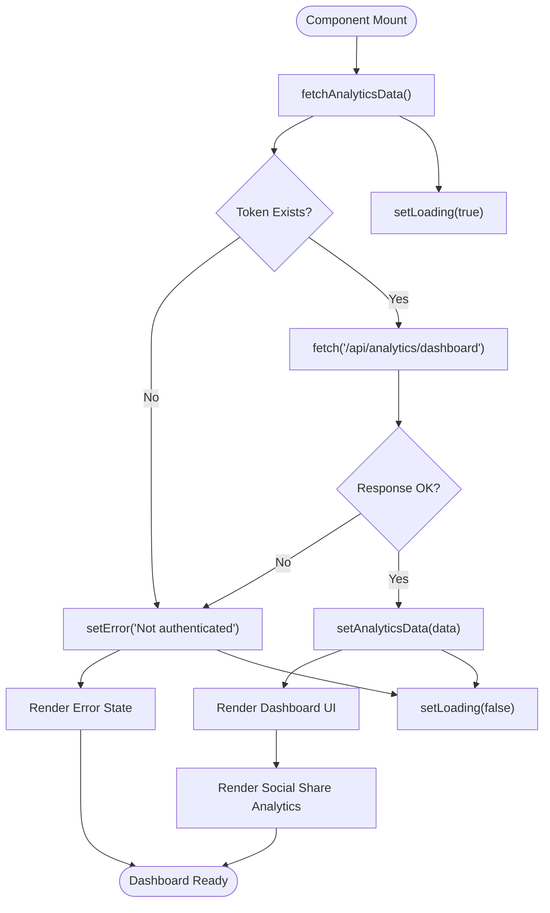

**Diagram sources**
- [AnalyticsDashboard.tsx:69-89](file://pikzels-clone/client/src/components/AnalyticsDashboard.tsx#L69-L89)

**Section sources**
- [AnalyticsDashboard.tsx:69-89](file://pikzels-clone/client/src/components/AnalyticsDashboard.tsx#L69-L89)

## SocialShareAnalytics Component
The SocialShareAnalytics component specializes in displaying social sharing metrics across multiple platforms including Twitter, Facebook, LinkedIn, and Pinterest. It follows a similar pattern to the main dashboard with state management for loading, error, and data states. The component fetches social share statistics from the '/api/social-share/stats' endpoint and displays them in a responsive grid layout.

Each platform's statistics are presented in a card format showing total shares, successful shares, and failed shares. The component uses visual indicators (emoji icons) to represent each platform and includes a progress bar showing the success rate percentage. When no data is available, a placeholder message encourages users to share thumbnails to generate analytics.

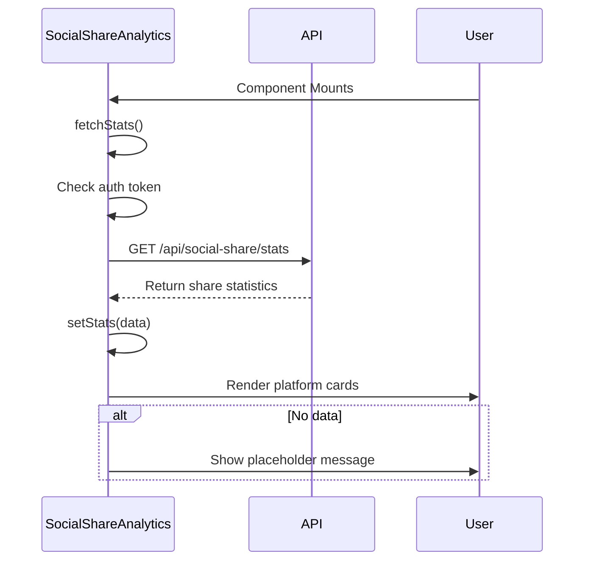

**Diagram sources**
- [SocialShareAnalytics.tsx:22-45](file://pikzels-clone/client/src/components/SocialShareAnalytics.tsx#L22-L45)

**Section sources**
- [SocialShareAnalytics.tsx:22-45](file://pikzels-clone/client/src/components/SocialShareAnalytics.tsx#L22-L45)

## Enhanced Modal Systems
The dashboard now integrates sophisticated modal systems that provide enhanced user interaction and data visualization opportunities. These modals offer contextual workflows for sharing thumbnails, creating templates, and accessing advanced analytics without navigating away from the dashboard.

### SocialShareModal Integration
The SocialShareModal component enables users to share thumbnails directly from the dashboard with comprehensive platform selection and real-time feedback. The modal supports multiple platform selection, customizable messages, and detailed sharing results with individual platform status tracking.

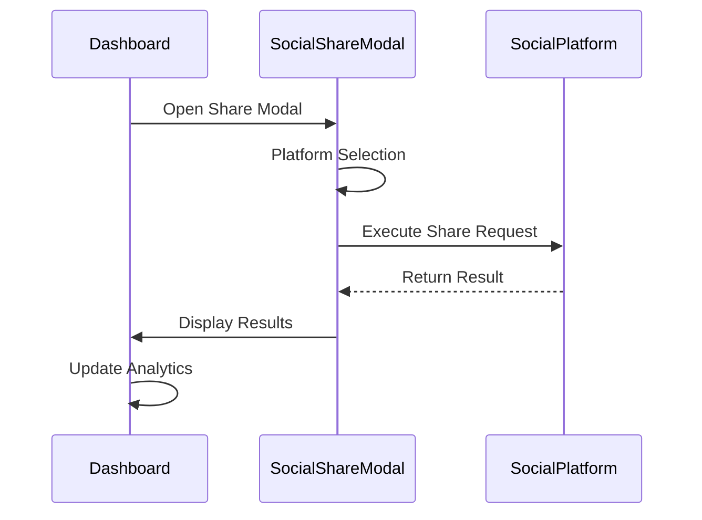

**Diagram sources**
- [SocialShareModal.tsx:38-55](file://pikzels-clone/client/src/components/SocialShareModal.tsx#L38-L55)

### SearchModal Integration
The SearchModal provides global search functionality with intelligent result suggestions, keyboard navigation, and quick action shortcuts. The modal integrates seamlessly with the dashboard's analytics data, allowing users to quickly locate specific thumbnails, templates, or tools within their analytics context.

### CreateTemplateModal Integration
The CreateTemplateModal enables users to convert thumbnails into reusable templates directly from analytics views. The modal captures template metadata, extracts thumbnail parameters, and provides immediate feedback on template creation success.

### ForgotPasswordModal Integration
The ForgotPasswordModal offers secure password recovery with animated transitions, form validation, and user-friendly error handling. The modal maintains consistent theming with the dashboard and provides clear success/error messaging.

**Section sources**
- [SocialShareModal.tsx:1-172](file://pikzels-clone/client/src/components/SocialShareModal.tsx#L1-L172)
- [SearchModal.tsx:1-297](file://pikzels-clone/client/src/components/search/SearchModal.tsx#L1-L297)
- [CreateTemplateModal.tsx:1-188](file://pikzels-clone/client/src/components/templates/CreateTemplateModal.tsx#L1-L188)
- [ForgotPasswordModal.tsx:1-190](file://pikzels-clone/client/src/components/auth/ForgotPasswordModal.tsx#L1-L190)

## UI Primitives Integration
The dashboard components integrate with several UI primitives to ensure consistency and reusability across the application. The StatCard component is used extensively to display key metrics with consistent styling, while the Slider component provides interactive controls for data filtering and manipulation.

### StatCard Integration
The StatCard component accepts various props including value, label, subtitle, icon, and trend indicators. It supports different color variants for the icon background and includes accessibility features through proper semantic HTML elements. The component is styled using CSS classes that follow BEM naming conventions for maintainability.

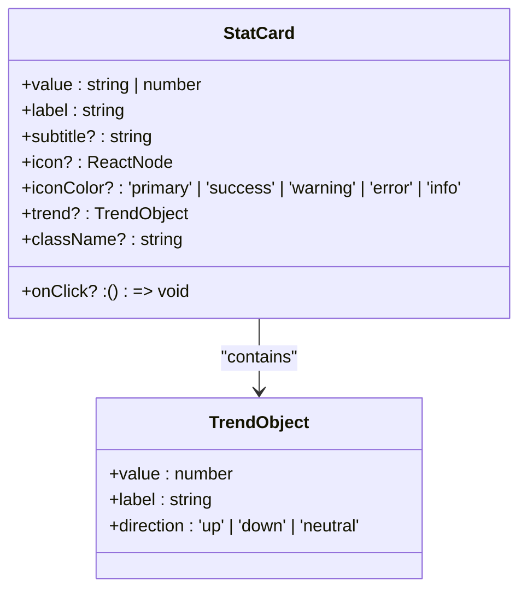

**Diagram sources**
- [StatCard.tsx:28-137](file://pikzels-clone/client/src/components/ui/StatCard.tsx#L28-L137)

### Slider Integration
The Slider component implements a fully accessible range input with mouse and keyboard support. It includes features such as drag-to-adjust, keyboard navigation (arrow keys, Page Up/Down, Home/End), and step-based value changes. The component uses refs to manage DOM elements and implements proper event handling for mouse and keyboard interactions.

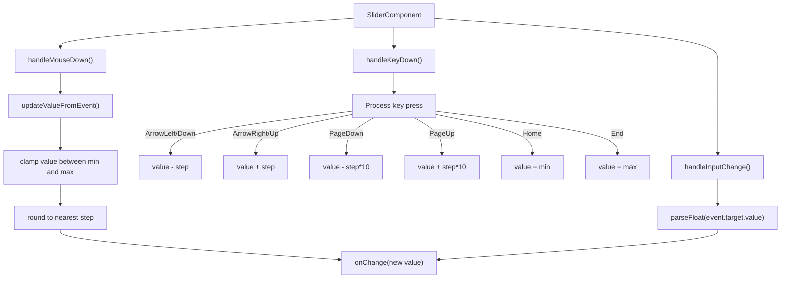

**Diagram sources**
- [Slider.tsx:66-134](file://pikzels-clone/client/src/components/ui/Slider.tsx#L66-L134)

**Section sources**
- [StatCard.tsx:1-138](file://pikzels-clone/client/src/components/ui/StatCard.tsx#L1-L138)
- [Slider.tsx:1-196](file://pikzels-clone/client/src/components/ui/Slider.tsx#L1-L196)

## Data Visualization and Metrics
The dashboard visualizes key metrics through various chart types and data representations. The main AnalyticsDashboard includes bar charts for trend analysis, percentage bars for distribution metrics, and numerical displays for key performance indicators.

### Key Metrics Displayed
- **Thumbnail Creation Trends**: Daily creation trends displayed as a horizontal bar chart
- **Style Distribution**: Percentage breakdown of thumbnail styles used
- **Project Distribution**: Distribution of thumbnails across projects
- **Editing Metrics**: Percentage of edited thumbnails and average edits per thumbnail
- **Productivity Insights**: Best creation hour and day of week distribution
- **Engagement Metrics**: Social sharing rates and platform-specific statistics

The visualization components use inline styles for dynamic height calculations based on data values, ensuring proportional representation of metrics. Color coding follows the application's design system with indigo for primary metrics, green for positive indicators, and yellow for warnings.

**Updated** The dashboard now integrates modal-based data visualization through SocialShareModal, which provides real-time feedback on sharing activities and tracks individual platform performance metrics within the modal interface. The ProjectsAndUploadsWidget combines project and upload visualization in a unified interface.

**Section sources**
- [AnalyticsDashboard.tsx:69-89](file://pikzels-clone/client/src/components/AnalyticsDashboard.tsx#L69-L89)
- [SocialShareAnalytics.tsx:22-45](file://pikzels-clone/client/src/components/SocialShareAnalytics.tsx#L22-L45)
- [ProjectsAndUploadsWidget.tsx:1-405](file://pikzels-clone/client/src/components/dashboard/widgets/ProjectsAndUploadsWidget.tsx#L1-L405)

## State Management and Data Fetching
The dashboard components implement React's built-in state management using the useState hook for local component state. The useEffect hook handles side effects such as data fetching on component mount. Both components follow the same pattern for managing asynchronous operations:

1. Initialize state variables for data, loading, and error conditions
2. Implement an async fetch function within useEffect
3. Set loading state to true before API call
4. Handle authentication by retrieving token from localStorage
5. Make API request with proper headers
6. Process response and update state accordingly
7. Handle errors with appropriate messaging
8. Set loading state to false in finally block

The components use proper dependency arrays in useEffect hooks (empty array for mounting once) and implement cleanup functions where necessary to prevent memory leaks.

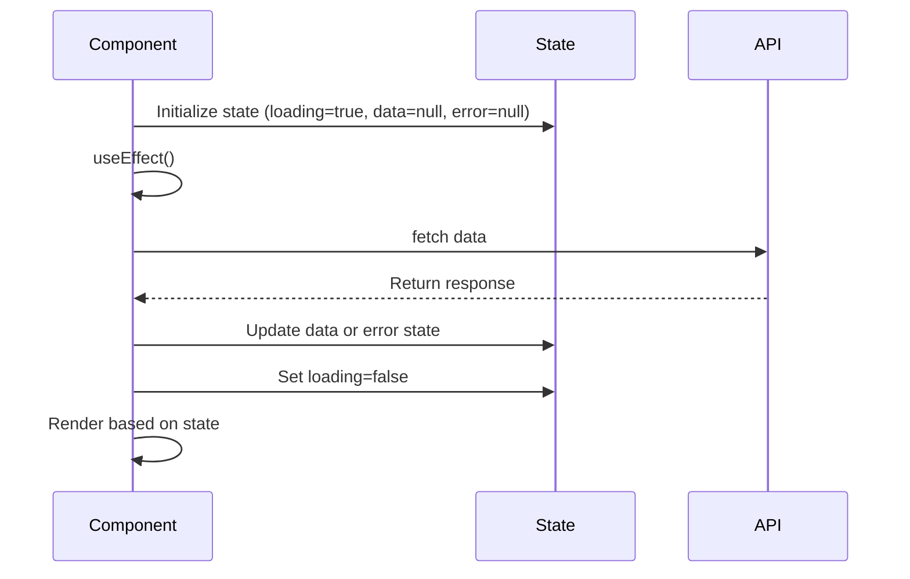

**Diagram sources**
- [AnalyticsDashboard.tsx:69-89](file://pikzels-clone/client/src/components/AnalyticsDashboard.tsx#L69-L89)
- [SocialShareAnalytics.tsx:22-45](file://pikzels-clone/client/src/components/SocialShareAnalytics.tsx#L22-L45)

**Section sources**
- [AnalyticsDashboard.tsx:69-89](file://pikzels-clone/client/src/components/AnalyticsDashboard.tsx#L69-L89)
- [SocialShareAnalytics.tsx:22-45](file://pikzels-clone/client/src/components/SocialShareAnalytics.tsx#L22-L45)

## Theming and Accessibility
The dashboard components integrate with the ThemeContext for consistent theming across the application. The useTheme hook provides access to the current theme ('light' or 'dark') and a toggleTheme function. Components use conditional class names based on the theme to apply appropriate styling for text, backgrounds, and borders.

Accessibility features include:
- Proper semantic HTML elements (dl, dt, dd for definition lists)
- ARIA labels for interactive elements
- Keyboard navigation support for sliders
- Sufficient color contrast for text readability
- Responsive design for various screen sizes
- Loading states with appropriate visual indicators
- Error messages with clear instructions

The ThemeContext implementation checks user preferences from the API and falls back to system preferences using window.matchMedia for prefers-color-scheme. Theme changes are persisted to user settings when authenticated.

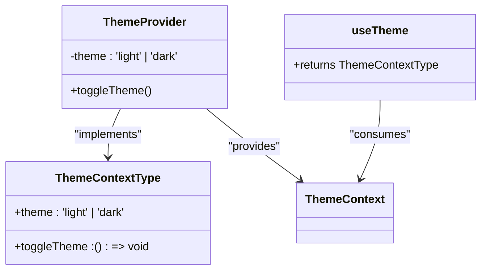

**Diagram sources**
- [ThemeContext.tsx:115-121](file://pikzels-clone/client/src/contexts/ThemeContext.tsx#L115-L121)

**Section sources**
- [ThemeContext.tsx:1-123](file://pikzels-clone/client/src/contexts/ThemeContext.tsx#L1-L123)

## Performance Optimization
The dashboard implementation includes several performance optimization techniques:

### Modal State Management
The enhanced modal systems implement efficient state management with controlled mounting/unmounting to prevent unnecessary re-renders. Modals use React's built-in optimization techniques:
- Conditional rendering based on isOpen prop
- Proper cleanup of event listeners and timers
- Optimized re-renders through appropriate state boundaries

### Memoization
While not explicitly using useMemo or useCallback in the provided code, the components could benefit from memoization of expensive calculations such as percentage calculations and data transformations.

### Lazy Loading
The components implement lazy loading of chart data by only fetching data when the component mounts, rather than pre-loading all possible data. Modal components implement conditional loading to defer heavy operations until needed.

### Efficient Rendering
The components use React's built-in optimization techniques:
- Conditional rendering based on state (loading, error, data)
- Proper key usage in list rendering (using platform name or date as key)
- Minimized re-renders through appropriate state management

### API Optimization
The API endpoints are designed to return aggregated data, reducing the need for client-side processing of large datasets. The analytics data is pre-calculated on the server side to minimize client computation.

**Updated** Modal-based interactions provide better performance by keeping the main dashboard state stable while handling complex user interactions in isolated modal contexts. The ProjectsAndUploadsWidget optimizes rendering by conditionally loading projects or uploads based on view mode.

**Section sources**
- [AnalyticsDashboard.tsx:69-89](file://pikzels-clone/client/src/components/AnalyticsDashboard.tsx#L69-L89)
- [SocialShareAnalytics.tsx:22-45](file://pikzels-clone/client/src/components/SocialShareAnalytics.tsx#L22-L45)
- [ProjectsAndUploadsWidget.tsx:1-405](file://pikzels-clone/client/src/components/dashboard/widgets/ProjectsAndUploadsWidget.tsx#L1-L405)

## Responsive Design and Mobile Considerations
The dashboard components implement responsive design using CSS grid and flexbox layouts. The layout adapts to different screen sizes through the following strategies:

- **Mobile (default)**: Single column layout for all components
- **Tablet (sm)**: Two-column grid for metrics
- **Desktop (lg)**: Four-column grid for main metrics, two-column for secondary metrics

The components use Tailwind CSS classes for responsive design, with breakpoints defined for sm, md, and lg screens. Typography scales appropriately for different screen sizes, and chart elements adjust their size and spacing to maintain readability.

Interactive elements such as sliders are designed to work with both mouse and touch inputs, with appropriate hit areas for mobile devices. The UI maintains sufficient whitespace and padding to prevent accidental taps on mobile devices.

**Updated** Modal components implement responsive design patterns that adapt to mobile screen sizes, with appropriate touch targets and gesture support for mobile users. The UploadsPage features responsive drag-and-drop zones and mobile-optimized asset grids.

**Section sources**
- [AnalyticsDashboard.tsx:69-89](file://pikzels-clone/client/src/components/AnalyticsDashboard.tsx#L69-L89)
- [SocialShareAnalytics.tsx:22-45](file://pikzels-clone/client/src/components/SocialShareAnalytics.tsx#L22-L45)
- [UploadsPage.tsx:1-625](file://pikzels-clone/client/src/components/dashboard/UploadsPage.tsx#L1-L625)

## Error Handling and Loading States
The components implement comprehensive error handling and loading states to provide a smooth user experience:

### Loading States
- Spinner animation during data fetching
- Skeleton screens for content loading
- Appropriate height reservation to prevent layout shifts

### Error States
- Clear error messages with descriptive text
- Visual indicators (icons) to draw attention to errors
- Context-specific error handling (authentication, network, server errors)
- Error boundaries to prevent component crashes

### Empty States
- Placeholder messages when no data is available
- Guidance on how to generate data
- Visual indicators for empty charts and metrics

The error handling follows best practices by logging errors to the console while presenting user-friendly messages in the UI. The components gracefully handle cases where data might be missing or incomplete.

**Updated** Modal components implement robust error handling with user-friendly messaging, loading states, and graceful degradation when API calls fail. The UploadsPage includes comprehensive error states for file upload failures and storage quota exceeded scenarios.

**Section sources**
- [AnalyticsDashboard.tsx:69-89](file://pikzels-clone/client/src/components/AnalyticsDashboard.tsx#L69-L89)
- [SocialShareAnalytics.tsx:22-45](file://pikzels-clone/client/src/components/SocialShareAnalytics.tsx#L22-L45)
- [UploadsPage.tsx:1-625](file://pikzels-clone/client/src/components/dashboard/UploadsPage.tsx#L1-L625)

## Project Cards and Subscription Architecture
**Updated** The dashboard project cards have been architecturally cleaned up to reflect the correct subscription plan assignment model. Previously, project cards incorrectly displayed "Free Plan" badges, but the architecture now correctly assigns subscription plans at the user level rather than individual projects.

### Project Card Structure
The project cards now properly reflect the user's subscription status without displaying individual project badges. Each project card includes:
- Project thumbnail preview with hover effects
- Project title with hover interactions
- Project label indicating project type
- Optional demo indicators for sample projects
- Modern gradient overlays and dark theme compatibility

### Subscription Integration
Project cards now integrate with the user's subscription context rather than displaying per-project plan information. The subscription status is managed at the user level and affects project access and features rather than being displayed on individual project cards.

**Section sources**
- [BrandPage.tsx:196-219](file://pikzels-clone/client/src/components/dashboard/BrandPage.tsx#L196-L219)

## Dashboard Widgets and Settings
The dashboard includes several functional widgets that provide user controls and system information. The storage indicator widget manages user preferences and system settings.

### Storage Indicator Widget
The StorageIndicator component provides:
- Current storage usage display (used/total GB)
- Auto-save toggle with descriptive labels
- Error handling for storage API failures
- Development mode mock data fallback

### Auto-Save Toggle Functionality
The auto-save toggle allows users to enable/disable automatic saving of canvas edits. The toggle state is persisted to user settings and affects the StorageIndicator component's display.

### Auto-Import Toggle Status
**Updated** The auto-import toggle functionality has been cleaned up from project cards as part of the architectural improvements. The toggle remains available through the StorageIndicator widget but is no longer displayed as a prominent feature on project cards.

### Settings API Integration
The dashboard integrates with user settings endpoints:
- `/api/user/settings/auto-save` - Update auto-save preference
- `/api/user/settings/auto-import` - Update auto-import preference  
- `/api/user/storage` - Retrieve storage information

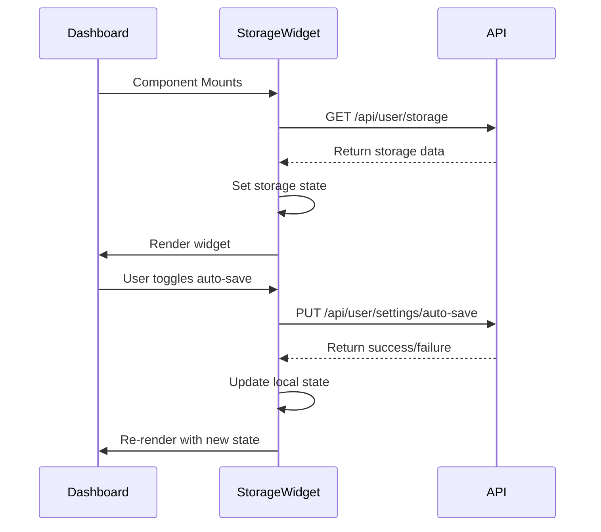

**Diagram sources**
- [StorageIndicator.tsx:53-70](file://pikzels-clone/client/src/components/dashboard/widgets/StorageIndicator.tsx#L53-L70)
- [user-settings.controller.ts:91-130](file://pikzels-clone/src/modules/user/user-settings.controller.ts#L91-L130)

**Section sources**
- [StorageIndicator.tsx:1-163](file://pikzels-clone/client/src/components/dashboard/widgets/StorageIndicator.tsx#L1-L163)
- [user-settings.service.ts:154-182](file://pikzels-clone/src/modules/user/user-settings.service.ts#L154-L182)
- [user-settings.controller.ts:91-130](file://pikzels-clone/src/modules/user/user-settings.controller.ts#L91-L130)

## ProjectsAndUploadsWidget: Unified Project and Upload Management
**New Section** The ProjectsAndUploadsWidget component provides comprehensive project and upload management capabilities through a unified interface. This widget replaces the previous AllProjectsWidget and integrates both project management and file asset management in a single, cohesive component.

### Unified Management Interface
The ProjectsAndUploadsWidget implements a tabbed interface with three primary views:
- **All projects tab**: Displays all user projects with featured thumbnails
- **Saved projects tab**: Filters and displays only saved projects
- **My uploads tab**: Shows user's uploaded assets with categorization

### View Mode Management
The widget manages multiple view modes through state:
- `viewMode`: Controls which tab is active ('all' | 'saved' | 'uploads')
- `assetFilter`: Filters uploads by type ('all' | 'face' | 'background' | 'logo')
- Dynamic loading states for each view mode

### Data Fetching Strategy
The widget implements intelligent data fetching:
- **Projects**: Uses authGet('/api/projects') with pagination (limit: 3) and sorting (sortBy: 'updatedAt', sortOrder: 'desc')
- **Assets**: Uses getUserAssets() with optional type filtering
- **Conditional loading**: Only fetches data when the corresponding tab is active
- **Error handling**: Provides user-friendly error states for both projects and assets

### Asset Management Features
The uploads tab includes comprehensive asset management:
- **Categorization**: Type-based filtering (Faces, Images, Brand)
- **Preview functionality**: Full-screen image preview with metadata
- **Navigation**: Arrow-based navigation through asset collections
- **Download support**: Direct file download capability
- **Storage integration**: Real-time storage usage display

### Project Card Integration
The widget renders project cards with:
- Featured thumbnail display when available
- Project name and description
- Demo project indicators
- Hover effects and navigation to project detail pages

### State Management
The widget manages multiple state variables:
- `projects`: Array of project objects with thumbnail and metadata
- `assets`: Array of user asset objects with type and metadata
- `assetCount`: Total count of user assets for display purposes
- `previewIndex`: Active index for asset preview modal
- `loading`: Combined loading state for both projects and assets

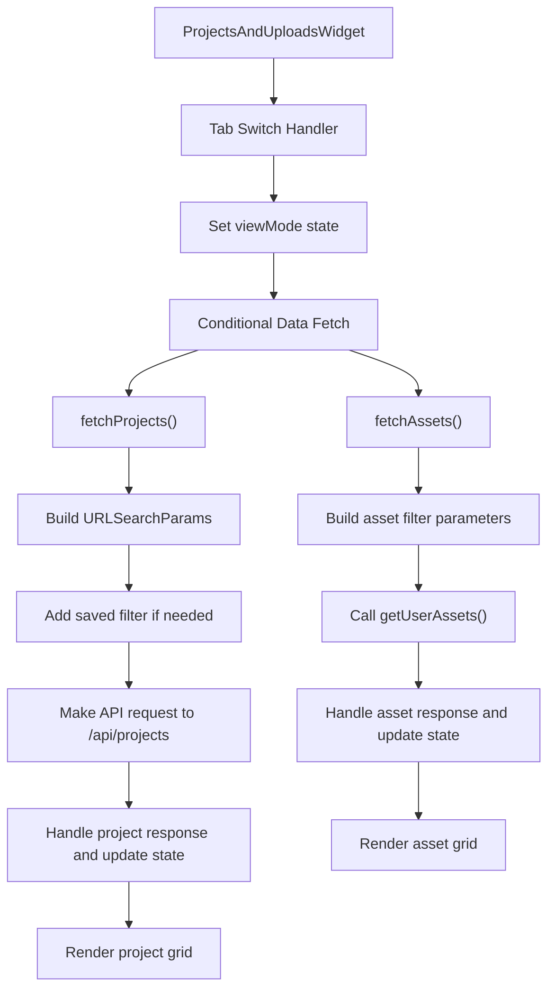

**Diagram sources**
- [ProjectsAndUploadsWidget.tsx:60-113](file://pikzels-clone/client/src/components/dashboard/widgets/ProjectsAndUploadsWidget.tsx#L60-L113)

### Integration with DashboardHome
The ProjectsAndUploadsWidget integrates seamlessly with the main dashboard through:
- Shared styling and theming via Tailwind CSS classes
- Consistent spacing and layout patterns
- Responsive design matching dashboard standards
- Accessible tab navigation with proper ARIA attributes
- Navigation to detailed views (UploadsPage for assets)

**Section sources**
- [ProjectsAndUploadsWidget.tsx:1-405](file://pikzels-clone/client/src/components/dashboard/widgets/ProjectsAndUploadsWidget.tsx#L1-L405)
- [DashboardHome.tsx:639-661](file://pikzels-clone/client/src/components/dashboard/DashboardHome.tsx#L639-L661)
- [ProjectBreadcrumb.tsx:1-37](file://pikzels-clone/client/src/components/projects/ProjectBreadcrumb.tsx#L1-L37)

## UploadsPage: Comprehensive File Management
**New Section** The UploadsPage component provides comprehensive file management capabilities with drag-and-drop functionality, asset categorization, and preview features. This page serves as the central hub for all user-uploaded assets including faces, backgrounds, and brand logos.

### File Upload System
The UploadsPage implements a sophisticated file upload system with:
- **Drag-and-drop support**: Visual feedback during drag operations
- **File validation**: Size limits (10MB max) and type restrictions (image/* only)
- **Multi-type support**: Face, background, logo, and other asset types
- **Progress indication**: Loading states during upload operations

### Asset Categorization and Organization
The page provides comprehensive asset management:
- **Type filtering**: All, Faces, Images, Brand categories
- **Badge system**: Color-coded type indicators (purple for faces, blue for images, amber for brand)
- **Search functionality**: Name and type-based asset search
- **Recategorization**: Drag-and-drop recategorization between tabs

### Storage Management
The UploadsPage includes sophisticated storage management:
- **Usage visualization**: Progress bar showing storage consumption
- **Type breakdown**: Count and display of assets by type
- **Real-time updates**: Storage usage updates after asset operations
- **Quota awareness**: Clear indication of storage limits

### Asset Preview and Interaction
The page features comprehensive asset interaction:
- **Preview modal**: Full-screen image preview with metadata
- **Navigation controls**: Arrow-based navigation through asset collections
- **Download functionality**: Direct file download capability
- **Delete confirmation**: Modal-based deletion with confirmation

### Error Handling and User Feedback
The UploadsPage implements comprehensive error handling:
- **Upload errors**: Clear error messages for invalid files and size limits
- **Network failures**: Graceful degradation with retry options
- **Storage limits**: User-friendly messages for quota exceeded scenarios
- **Operation feedback**: Success indicators for upload, delete, and recategorization operations

### State Management Architecture
The component manages extensive state through React hooks:
- **Asset data**: Complete asset collection with metadata
- **Filter state**: Active type filter and search query
- **Storage state**: Usage statistics and type counts
- **Upload state**: File selection, type selection, and upload progress
- **Delete state**: Confirmation dialogs and operation status
- **Preview state**: Modal visibility and active index

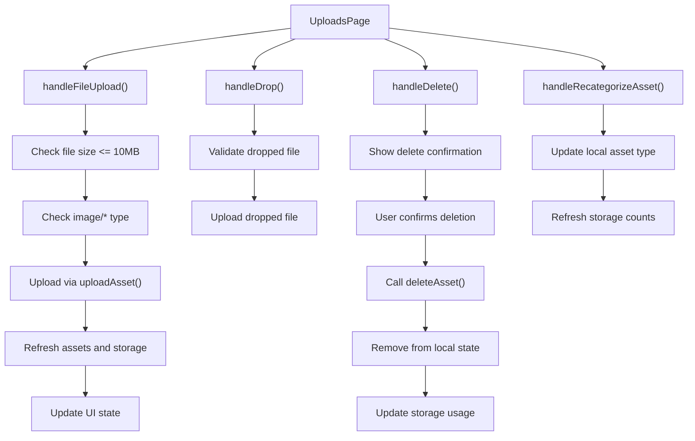

**Diagram sources**
- [UploadsPage.tsx:142-260](file://pikzels-clone/client/src/components/dashboard/UploadsPage.tsx#L142-L260)

### Integration with Services
The UploadsPage integrates with backend services:
- **getUserAssets()**: Fetch user assets with optional type filtering
- **uploadAsset()**: Upload new assets with base64 encoding
- **deleteAsset()**: Remove assets from user collection
- **getStorageUsage()**: Retrieve storage statistics
- **recategorizeAsset()**: Update asset type assignments

**Section sources**
- [UploadsPage.tsx:1-625](file://pikzels-clone/client/src/components/dashboard/UploadsPage.tsx#L1-L625)

## TrendingPage: YouTube Integration and Live Data
**New Section** The TrendingPage component provides YouTube integration for discovering trending thumbnail styles and inspiration. This page showcases real-time YouTube trending data with comprehensive filtering and visualization capabilities.

### YouTube API Integration
The TrendingPage implements sophisticated YouTube API integration:
- **API status checking**: `/api/youtube-trending/status` endpoint for configuration verification
- **Regional filtering**: Support for 18+ countries with automatic browser locale detection
- **Category filtering**: Gaming, Music, Education, Entertainment, Sports, Food categories
- **Live data fetching**: Real-time trending videos with hourly updates

### Regional Detection and Filtering
The page implements intelligent regional detection:
- **Browser locale parsing**: Extracts country code from navigator.language
- **Supported regions**: US, GB, CA, AU, DE, FR, JP, KR, IN, BR, MX, ES, IT, NL, SE, PL, RU, ID, TH, PH
- **Default fallback**: US region when detected locale is unsupported
- **Dynamic region selection**: Dropdown for manual region switching

### Category-Based Discovery
The page provides comprehensive category filtering:
- **Category icons**: Visual icons for each category (Gamepad2, Music2, BookOpen, etc.)
- **Dynamic filtering**: Real-time filtering of trending videos by category
- **Category badges**: Visual indicators for video categories
- **Fallback examples**: Curated examples when API is not configured

### Live Data Visualization
The TrendingPage features sophisticated live data visualization:
- **Live banner**: Green "LIVE" status when API is configured
- **Refresh functionality**: Manual refresh button for live data updates
- **View count display**: Formatted view counts (K/M notation)
- **Hover interactions**: Detailed video information on hover
- **External linking**: Direct YouTube video access

### Fallback and Future Features
The page implements comprehensive fallback mechanisms:
- **API status banner**: Blue "PLANNED" banner when API is not configured
- **Curated examples**: High-performing thumbnail examples as fallback content
- **Feature preview**: Detailed feature roadmap for future live integration
- **Graceful degradation**: Functional interface even without API access

### State Management and Data Flow
The component manages complex state through React hooks:
- **API status**: Configuration state (configured, quotaRemaining)
- **Live videos**: Trending video data with metadata
- **Loading states**: Separate loading states for API check and video fetch
- **Error handling**: Comprehensive error states with user feedback
- **Filter state**: Active category and region selections

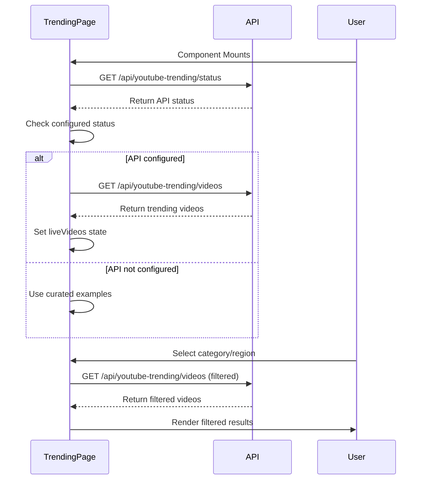

**Diagram sources**
- [TrendingPage.tsx:195-245](file://pikzels-clone/client/src/components/dashboard/TrendingPage.tsx#L195-L245)

### Integration with Backend Services
The TrendingPage integrates with backend YouTube trending services:
- **youtube-trending/status**: Check API configuration and quota status
- **youtube-trending/videos**: Fetch trending videos with region, category, and limit parameters
- **Real-time updates**: Hourly data refresh for trending content
- **Performance metrics**: View counts and engagement data for trending videos

**Section sources**
- [TrendingPage.tsx:1-557](file://pikzels-clone/client/src/components/dashboard/TrendingPage.tsx#L1-L557)

## Conclusion
The analytics dashboard components provide a comprehensive view of user activity and performance metrics through well-structured React components. The implementation demonstrates proper state management, data fetching patterns, and responsive design principles. By leveraging UI primitives like StatCard and Slider, the components maintain consistency with the rest of the application while providing specialized functionality for analytics visualization.

**Updated** The integration with enhanced modal systems including SocialShareModal, SearchModal, CreateTemplateModal, and ForgotPasswordModal significantly expands the dashboard's interactive capabilities. These modal components provide contextual workflows for sharing thumbnails, searching content, creating templates, and managing user accounts without disrupting the main analytics workflow.

The integration with ThemeContext ensures a cohesive user experience across light and dark modes, while accessibility features make the dashboard usable for all users. Performance optimizations including modal state management and lazy loading contribute to a reliable and efficient user interface that effectively communicates key metrics and insights through both traditional dashboard views and interactive modal experiences.

**Updated** The architectural improvements including the replacement of AllProjectsWidget with ProjectsAndUploadsWidget, the introduction of comprehensive file management through UploadsPage, and the implementation of YouTube API integration in TrendingPage significantly enhance the dashboard's functionality. The unified widget system provides centralized access to projects and uploads, while the file management system offers sophisticated asset handling capabilities.

The enhanced dashboard now offers comprehensive data visualization opportunities through modal-based interactions, enabling users to engage with analytics data in more intuitive and contextually relevant ways while maintaining the core dashboard's focus on key performance metrics and trends. The improved subscription architecture, widget management, project management capabilities, file management system, and YouTube integration contribute to a more professional and user-friendly dashboard experience.