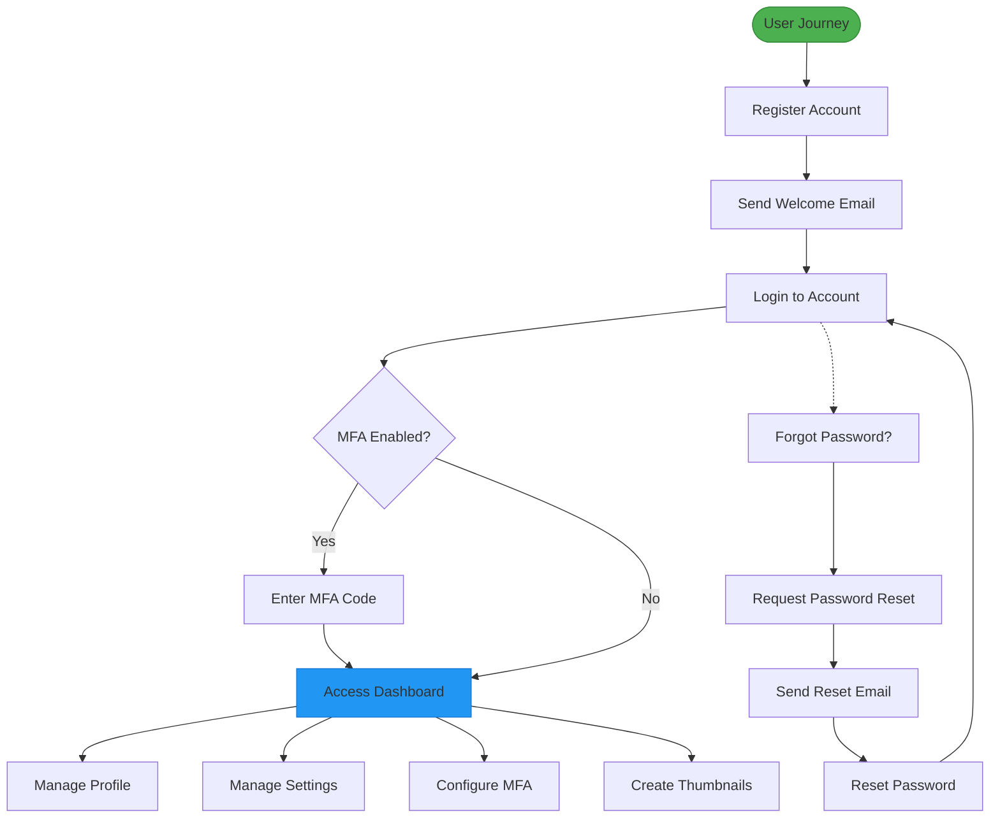
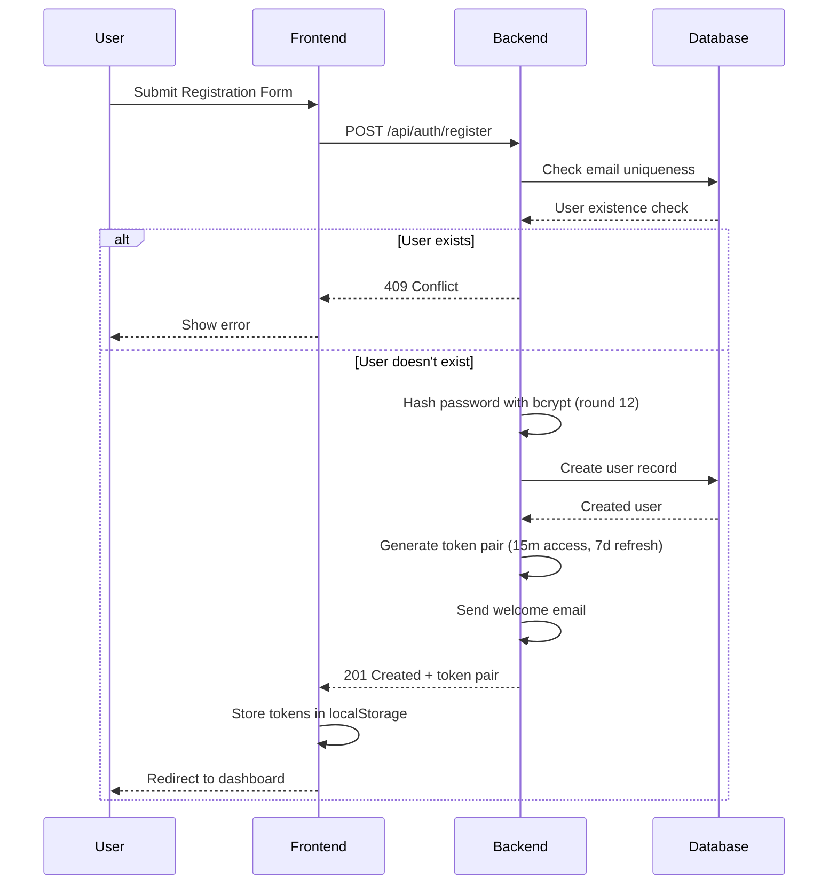
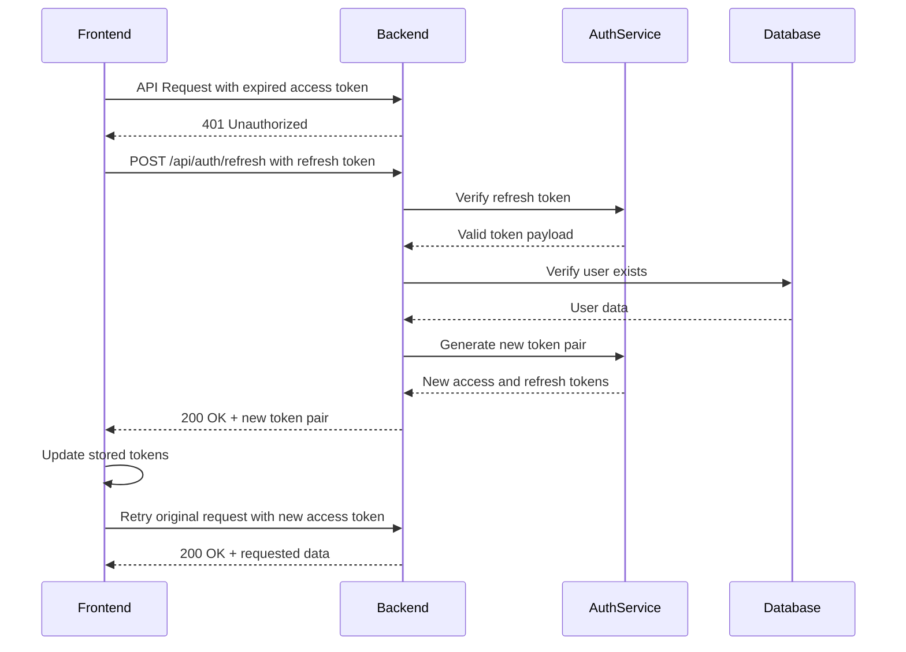
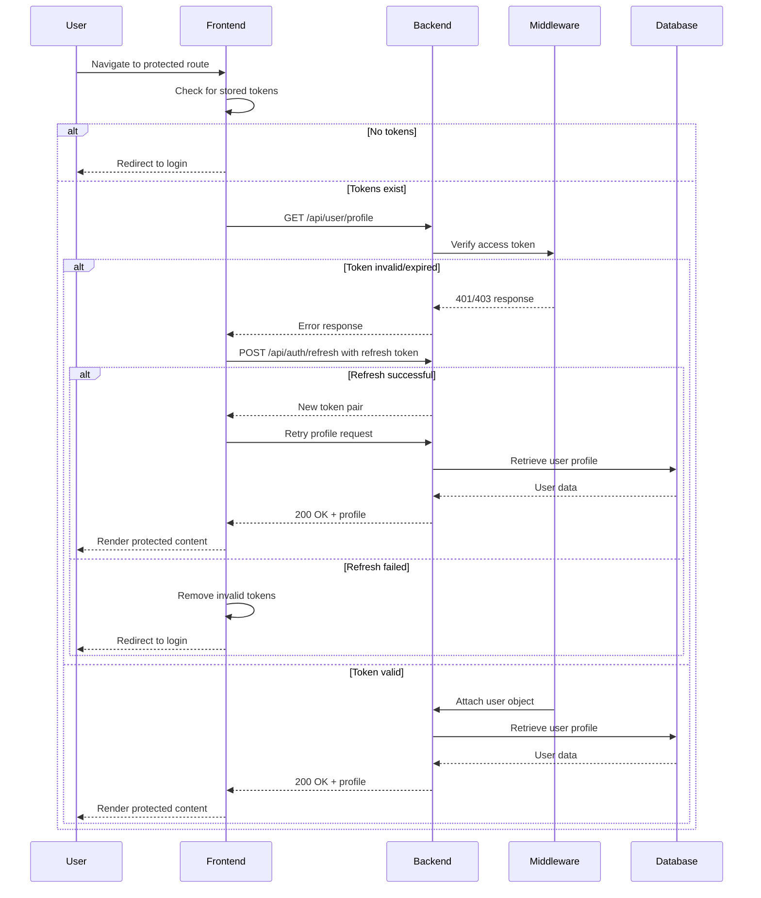
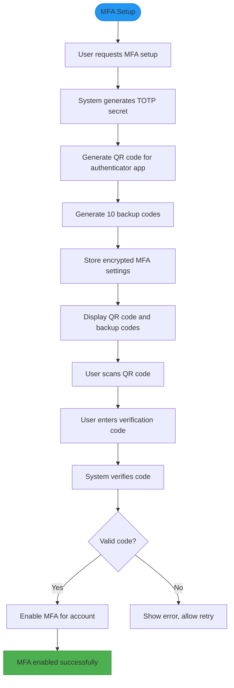
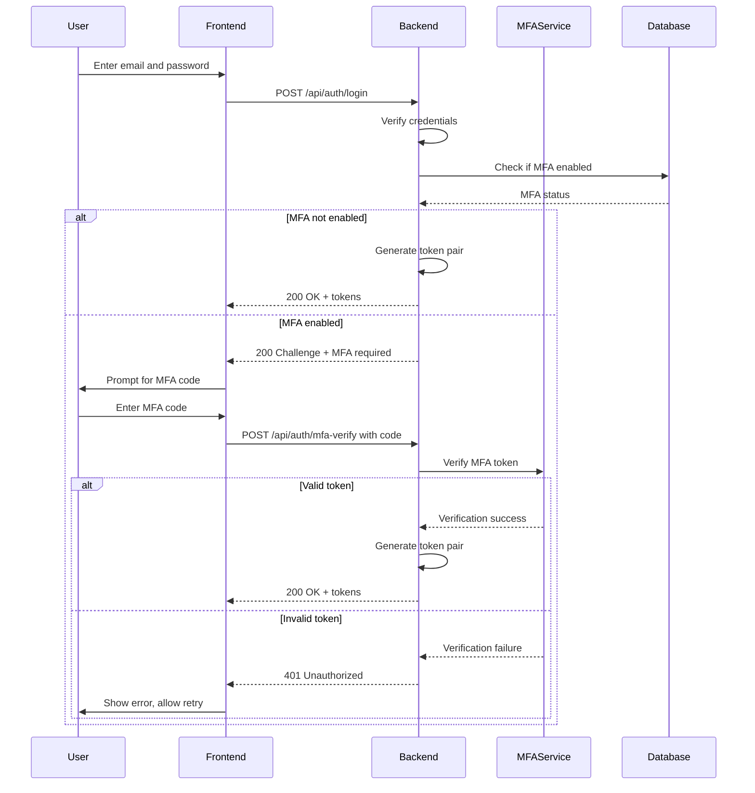
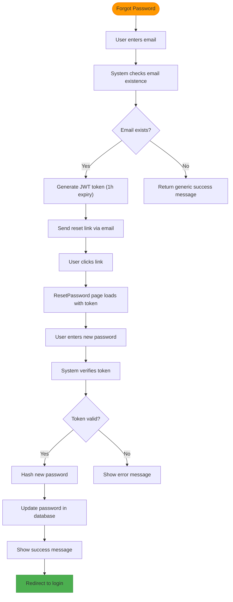
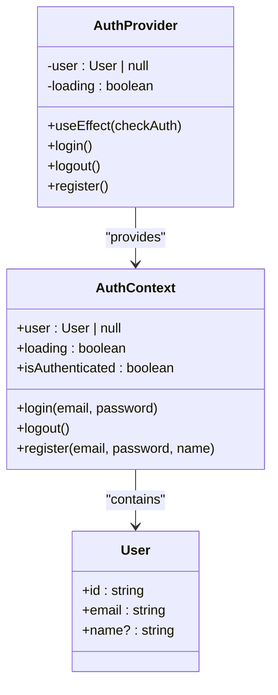

# Authentication & User Management

<cite>
**Referenced Files in This Document**   
- [auth.service.ts](file://pikzels-clone\src\modules\auth\auth.service.ts) - *Updated with enhanced JWT and refresh token support*
- [auth.controller.ts](file://pikzels-clone\src\modules\auth\auth.controller.ts) - *Updated with new authentication endpoints*
- [auth.routes.ts](file://pikzels-clone\src\modules\auth\auth.routes.ts) - *Updated with validation middleware integration*
- [email.service.ts](file://pikzels-clone\src\modules\auth\email.service.ts)
- [jwt.enhanced.service.ts](file://pikzels-clone\src\services\jwt.enhanced.service.ts) - *New enhanced JWT service implementation*
- [mfa.service.ts](file://pikzels-clone\src\modules\auth\mfa.service.ts) - *Added MFA service with TOTP and backup codes*
- [auth.middleware.ts](file://pikzels-clone\src\middleware\auth.middleware.ts)
- [Login.tsx](file://pikzels-clone\client\src\components\auth\Login.tsx)
- [Register.tsx](file://pikzels-clone\client\src\components\auth\Register.tsx)
- [ForgotPassword.tsx](file://pikzels-clone\client\src\components\auth\ForgotPassword.tsx)
- [ResetPassword.tsx](file://pikzels-clone\client\src\components\auth\ResetPassword.tsx)
- [AuthContext.tsx](file://pikzels-clone\client\src\contexts\AuthContext.tsx) - *Updated token handling logic*
- [ProtectedRoute.tsx](file://pikzels-clone\client\src\components\ProtectedRoute.tsx)
- [password-recovery.md](file://pikzels-clone\docs\api\password-recovery.md)
- [user-settings.md](file://pikzels-clone\docs\api\user-settings.md)
</cite>

## Update Summary
**Changes Made**   
- Updated JWT authentication system to use access/refresh token pair with enhanced security
- Added comprehensive Multi-Factor Authentication (MFA) support with TOTP and backup codes
- Updated token expiration times and security practices
- Enhanced password validation and security measures
- Added token refresh mechanism
- Updated documentation to reflect new MFA functionality and improved security practices

## Table of Contents
1. [Introduction](#introduction)
2. [User Journey Overview](#user-journey-overview)
3. [JWT Authentication System](#jwt-authentication-system)
4. [Multi-Factor Authentication](#multi-factor-authentication)
5. [Password Recovery Flow](#password-recovery-flow)
6. [Frontend Authentication Implementation](#frontend-authentication-implementation)
7. [User Settings Management](#user-settings-management)
8. [Security Best Practices](#security-best-practices)
9. [Troubleshooting Guide](#troubleshooting-guide)

## Introduction
This document provides comprehensive documentation for the Authentication & User Management system in the Pikzels application. It covers the complete user journey from registration to profile management, with detailed explanations of the JWT-based authentication system, Multi-Factor Authentication (MFA), password recovery flow, frontend implementation, and user settings management. The system is designed to provide secure and user-friendly access to the thumbnail creation platform with enhanced security measures.

## User Journey Overview
The user journey in the Pikzels application consists of several key stages: registration, email verification, login, password recovery, and profile management. Each stage is designed to provide a seamless experience while maintaining high security standards.

The registration process begins with users providing their email, password, and optional name. Upon successful registration, users receive a welcome email and are automatically authenticated with a JWT token pair. The login process allows returning users to access their accounts using their credentials, with the system validating these against securely hashed passwords in the database.

For users who forget their passwords, a secure recovery process is available that uses time-limited JWT tokens sent via email. Once authenticated, users can manage their profiles, application settings, and MFA configuration through dedicated endpoints and UI components.

**Diagram sources**
- [auth.service.ts](file://pikzels-clone\src\modules\auth\auth.service.ts#L1-L260)
- [Login.tsx](file://pikzels-clone\client\src\components\auth\Login.tsx#L1-L129)

## JWT Authentication System

### Token Generation and Validation
The authentication system uses JSON Web Tokens (JWT) for stateless session management with an enhanced security model. When users register or log in successfully, the system generates a token pair consisting of a short-lived access token and a long-lived refresh token.

The access token is valid for 15 minutes and contains the user's ID, email, and a unique session ID. The refresh token is valid for 7 days and can be used to obtain a new access token without requiring the user to re-enter their credentials. This approach significantly improves security by minimizing the exposure window of access tokens while maintaining user convenience.

The token generation process involves several security measures:
1. Passwords are hashed using bcryptjs with a salt round of 12 for enhanced security
2. The JWT tokens are signed with separate secrets for access and refresh tokens
3. Tokens include a unique session ID to enable token revocation
4. Access tokens have a short 15-minute expiration period to limit the window of vulnerability

**Diagram sources**
- [auth.service.ts](file://pikzels-clone\src\modules\auth\auth.service.ts#L1-L260)
- [jwt.enhanced.service.ts](file://pikzels-clone\src\services\jwt.enhanced.service.ts#L1-L80)
- [auth.controller.ts](file://pikzels-clone\src\modules\auth\auth.controller.ts#L1-L125)

### Token Refresh Mechanism
The system implements a token refresh mechanism that allows users to obtain new access tokens without re-authenticating. When an access token expires, the frontend automatically uses the refresh token to request a new access token from the server.

The refresh process validates the refresh token's signature and type claim, verifies the user still exists in the database, and generates a new token pair with a fresh session ID. This approach provides both security and user convenience by eliminating the need for frequent logins while maintaining the ability to revoke sessions.

**Section sources**
- [auth.service.ts](file://pikzels-clone\src\modules\auth\auth.service.ts#L200-L259)
- [jwt.enhanced.service.ts](file://pikzels-clone\src\services\jwt.enhanced.service.ts#L1-L80)

### Protected Route Implementation
Protected routes are implemented using an authentication middleware that validates JWT tokens on each request. The middleware extracts the token from the Authorization header, verifies its signature and expiration, and attaches the user object to the request if valid.

The frontend implements protected routes using a React component that checks authentication status before rendering protected content. This component attempts to validate the stored token by making a request to the profile endpoint, ensuring the token is still valid.

**Diagram sources**
- [auth.middleware.ts](file://pikzels-clone\src\middleware\auth.middleware.ts#L1-L54)
- [ProtectedRoute.tsx](file://pikzels-clone\client\src\components\ProtectedRoute.tsx#L1-L71)

**Section sources**
- [auth.middleware.ts](file://pikzels-clone\src\middleware\auth.middleware.ts#L1-L54)
- [ProtectedRoute.tsx](file://pikzels-clone\client\src\components\ProtectedRoute.tsx#L1-L71)

## Multi-Factor Authentication

### MFA Implementation Overview
The system now supports Multi-Factor Authentication (MFA) using Time-Based One-Time Passwords (TOTP) following the RFC 6238 standard. Users can enable MFA through their account settings, which enhances security by requiring a second factor in addition to their password.

The MFA implementation includes:
- TOTP authentication using Google Authenticator or similar apps
- Backup codes for emergency access
- QR code provisioning for easy setup
- Encrypted storage of MFA secrets in the database
- Support for backup code regeneration

**Diagram sources**
- [mfa.service.ts](file://pikzels-clone\src\modules\auth\mfa.service.ts#L21-L347)
- [auth.service.ts](file://pikzels-clone\src\modules\auth\auth.service.ts#L1-L260)

### MFA Authentication Flow
When MFA is enabled for an account, users must provide both their password and a valid TOTP code during the login process. The system verifies the TOTP code against the stored secret using the speakeasy library with a time window of ±60 seconds (2 time steps) to account for clock drift.

Users can also authenticate using backup codes, which are single-use and automatically removed from the user's account after use. This provides a recovery mechanism if users lose access to their authenticator app.

**Section sources**
- [mfa.service.ts](file://pikzels-clone\src\modules\auth\mfa.service.ts#L21-L347)
- [auth.service.ts](file://pikzels-clone\src\modules\auth\auth.service.ts#L1-L260)

## Password Recovery Flow

### Recovery Process Overview
The password recovery system follows a secure process that prevents information disclosure about registered email addresses. When a user requests a password reset, the system always returns the same success message regardless of whether the email exists in the database, preventing enumeration attacks.

The recovery process uses JWT tokens with a 1-hour expiration period, providing a balance between user convenience and security. These tokens contain the user ID and an action identifier to ensure they can only be used for password reset operations.

**Diagram sources**
- [auth.service.ts](file://pikzels-clone\src\modules\auth\auth.service.ts#L1-L260)
- [email.service.ts](file://pikzels-clone\src\modules\auth\email.service.ts#L1-L66)

### Email Service Integration
The email service is responsible for sending password reset and welcome emails. Currently, the system simulates email delivery by logging messages to the console, which facilitates development and testing. In production, this should be replaced with a real email service such as SendGrid, AWS SES, or Nodemailer with SMTP.

The password reset email contains a link with the JWT token as a query parameter, directing users to the reset password page. The token includes claims for the user ID and action type, ensuring it can only be used for password reset operations.

**Section sources**
- [email.service.ts](file://pikzels-clone\src\modules\auth\email.service.ts#L1-L66)
- [password-recovery.md](file://pikzels-clone\docs\api\password-recovery.md#L1-L195)

## Frontend Authentication Implementation

### Authentication Context and State Management
The frontend implements authentication state management using React Context. The AuthContext provides a centralized way to manage user authentication state across the application, including login, logout, and registration functionality.

The context handles token persistence by storing the JWT token pair in localStorage, allowing users to remain authenticated between sessions. On application load, the context checks for existing tokens and validates them by making a request to the profile endpoint. If the access token is expired, it automatically uses the refresh token to obtain new tokens.

**Diagram sources**
- [AuthContext.tsx](file://pikzels-clone\client\src\contexts\AuthContext.tsx#L1-L145)
- [Login.tsx](file://pikzels-clone\client\src\components\auth\Login.tsx#L1-L129)

### Component Implementation
Authentication components are implemented as React functional components with proper form handling and error management. Each component manages its own state for form inputs and handles API responses appropriately.

The login and registration components include client-side validation for required fields and display user-friendly error messages. The password recovery components follow a two-step process: first requesting a reset link, then completing the reset with a new password. The MFA components provide interfaces for setting up and verifying two-factor authentication.

**Section sources**
- [Login.tsx](file://pikzels-clone\client\src\components\auth\Login.tsx#L1-L129)
- [Register.tsx](file://pikzels-clone\client\src\components\auth\Register.tsx#L1-L160)
- [ForgotPassword.tsx](file://pikzels-clone\client\src\components\auth\ForgotPassword.tsx#L1-L107)
- [ResetPassword.tsx](file://pikzels-clone\client\src\components\auth\ResetPassword.tsx#L1-L168)

## User Settings Management

### Settings Structure and API
User settings are managed through a flexible JSON structure that allows for easy extension. The settings API provides endpoints for retrieving and updating user preferences, including theme, language, notification preferences, thumbnail defaults, privacy controls, and MFA configuration.

The settings are stored as a JSON field in the User table, allowing for schema flexibility without requiring database migrations for new settings. MFA settings are encrypted before storage to protect sensitive information like TOTP secrets.

| Setting Category | Properties | Description |
|------------------|-----------|-------------|
| theme | light, dark | Application color scheme |
| language | en, es, fr, de, ja | Interface language preference |
| notifications | email, push | Notification delivery methods |
| thumbnailDefaults | width, height, style | Default parameters for new thumbnails |
| privacy | profileVisible, thumbnailsPublic | Visibility settings for user content |
| mfa | enabled, secret, backupCodes | Multi-factor authentication configuration |

**Section sources**
- [user-settings.md](file://pikzels-clone\docs\api\user-settings.md#L1-L148)
- [profile.controller.ts](file://pikzels-clone\src\modules\auth\profile.controller.ts#L1-L74)
- [mfa.service.ts](file://pikzels-clone\src\modules\auth\mfa.service.ts#L21-L347)

## Security Best Practices

### Password and Token Security
The system implements several security best practices to protect user accounts:

1. **Password hashing**: All passwords are hashed using bcryptjs with a salt round of 12, providing strong protection against brute force attacks
2. **Token rotation**: The system uses short-lived access tokens (15 minutes) and long-lived refresh tokens (7 days) to minimize exposure
3. **Secure token storage**: Tokens are stored in localStorage with automatic refresh and proper validation on each request
4. **Information hiding**: The password recovery system does not reveal whether an email is registered, preventing enumeration attacks
5. **Session management**: Each token pair includes a unique session ID that can be used for session revocation

### Brute Force Protection
While the current implementation does not include rate limiting, the architecture supports adding this feature. Rate limiting can be implemented at the route level to prevent brute force attacks on authentication endpoints.

Additional security measures that can be implemented include:
- Account lockout after multiple failed login attempts
- CAPTCHA challenges for suspicious activity
- Multi-factor authentication for sensitive operations
- IP-based rate limiting for password reset requests
- Session invalidation on password change

**Section sources**
- [auth.service.ts](file://pikzels-clone\src\modules\auth\auth.service.ts#L1-L260)
- [jwt.enhanced.service.ts](file://pikzels-clone\src\services\jwt.enhanced.service.ts#L1-L80)
- [auth.middleware.ts](file://pikzels-clone\src\middleware\auth.middleware.ts#L1-L54)

## Troubleshooting Guide

### Common Authentication Issues
This section addresses common issues users and developers may encounter with the authentication system.

**Token Not Persisting**
- **Symptom**: User is logged out after page refresh
- **Cause**: Token not properly stored in localStorage
- **Solution**: Check that the frontend correctly stores the token pair from the login response

**Password Reset Link Not Working**
- **Symptom**: Reset token is invalid or expired
- **Cause**: Token has expired (1-hour limit) or was not properly extracted from URL
- **Solution**: Request a new reset link and complete the process within the time limit

**Account Already Exists Error**
- **Symptom**: Cannot register with an email address
- **Cause**: Email is already registered in the system
- **Solution**: Use the login form or request a password reset if the user has forgotten their password

**Invalid Credentials on Login**
- **Symptom**: Login fails with "Invalid credentials" message
- **Cause**: Incorrect email or password
- **Solution**: Verify email and password, or use password recovery if needed

**MFA Setup Failing**
- **Symptom**: Cannot complete MFA setup
- **Cause**: Incorrect verification code entered
- **Solution**: Ensure the device time is synchronized and re-scan the QR code

### Edge Cases
**Simultaneous Password Reset Requests**
Multiple password reset requests for the same email generate new tokens, invalidating previous ones. Only the most recent token will be valid.

**Expired Authentication Tokens**
When access tokens expire after 15 minutes, the frontend automatically uses the refresh token to obtain new tokens. If the refresh token is also expired (after 7 days), users are automatically logged out and redirected to the login page.

**Network Errors During Authentication**
Transient network issues may prevent authentication requests from completing. The frontend should provide appropriate error messages and allow users to retry.

**MFA Backup Code Exhaustion**
When all backup codes have been used, users can regenerate new ones through their account settings. This requires successful MFA authentication.

**Section sources**
- [auth.service.ts](file://pikzels-clone\src\modules\auth\auth.service.ts#L1-L260)
- [AuthContext.tsx](file://pikzels-clone\client\src\contexts\AuthContext.tsx#L1-L145)
- [password-recovery.md](file://pikzels-clone\docs\api\password-recovery.md#L1-L195)
- [mfa.service.ts](file://pikzels-clone\src\modules\auth\mfa.service.ts#L21-L347)