# Authentication & User Management

<cite>
**Referenced Files in This Document**
- [auth.controller.ts](file://pikzels-clone/src/modules/auth/auth.controller.ts)
- [auth.middleware.ts](file://pikzels-clone/src/middleware/auth.middleware.ts)
- [auth.routes.ts](file://pikzels-clone/src/modules/auth/auth.routes.ts)
- [jwt.enhanced.service.ts](file://pikzels-clone/src/services/jwt.enhanced.service.ts)
- [logger.ts](file://pikzels-clone/src/utils/logger.ts)
- [AuthContext.tsx](file://pikzels-clone/client/src/contexts/AuthContext.tsx)
- [Login.tsx](file://pikzels-clone/client/src/components/auth/Login.tsx)
- [ProtectedRoute.tsx](file://pikzels-clone/client/src/components/ProtectedRoute.tsx)
- [api.ts](file://pikzels-clone/client/src/utils/api.ts)
- [session-coordination.middleware.ts](file://pikzels-clone/src/middleware/session-coordination.middleware.ts)
- [username.utils.ts](file://pikzels-clone/src/utils/username.utils.ts)
- [schema.prisma](file://pikzels-clone/prisma/schema.prisma)
- [migration.sql](file://pikzels-clone/prisma/migrations/20251031011418_add_username_and_verification_fields/migration.sql)
- [AccountPage.tsx](file://pikzels-clone/client/src/components/account/AccountPage.tsx)
- [AccountDropdown.tsx](file://pikzels-clone/client/src/components/account/AccountDropdown.tsx)
- [profile.routes.ts](file://pikzels-clone/src/modules/auth/profile.routes.ts)
- [profile.controller.ts](file://pikzels-clone/src/modules/auth/profile.controller.ts)
- [collaboration.controller.ts](file://pikzels-clone/src/modules/collaboration/collaboration.controller.ts)
- [collaboration.service.ts](file://pikzels-clone/src/modules/collaboration/collaboration.service.ts)
- [server.ts](file://pikzels-clone/src/server.ts)
- [security.config.ts](file://pikzels-clone/src/config/security.config.ts)
- [environment.ts](file://pikzels-clone/client/src/config/environment.ts)
- [netlify.toml](file://pikzels-clone/client/netlify.toml)
- [railway.json](file://pikzels-clone/railway.json)
</cite>

## Update Summary
**Changes Made**
- Updated to reflect the complete migration from localStorage-based JWT token storage to HttpOnly cookies with enhanced security measures
- Enhanced security with SameSite=Strict, Secure flags, and automatic cookie handling for cross-origin deployments
- Added new authFetch utility for centralized authenticated API calls using HttpOnly cookies instead of localStorage
- Updated authentication controller to use HttpOnly cookies with cross-origin support and proper SameSite configuration
- Improved authentication middleware to prioritize cookie-based token retrieval with Authorization header fallback
- Updated protected route implementation to leverage automatic cookie handling
- Enhanced server configuration with proper CORS credentials and cookie parser setup for cross-origin deployments
- Added comprehensive cross-origin cookie configuration for Netlify to Railway deployments

## Table of Contents
1. [Introduction](#introduction)
2. [User Journey Overview](#user-journey-overview)
3. [Username-Based Authentication System](#username-based-authentication-system)
4. [Enhanced JWT Authentication System](#enhanced-jwt-authentication-system)
5. [HttpOnly Cookie Migration](#httponly-cookie-migration)
6. [Cross-Origin Cookie Configuration](#cross-origin-cookie-configuration)
7. [Improved Error Logging & Debugging](#improved-error-logging--debugging)
8. [Multi-Factor Authentication](#multi-factor-authentication)
9. [Password Recovery Flow](#password-recovery-flow)
10. [Comprehensive Account Management](#comprehensive-account-management)
11. [Team Collaboration Features](#team-collaboration-features)
12. [Data Export Functionality](#data-export-functionality)
13. [Frontend Authentication Implementation](#frontend-authentication-implementation)
14. [User Settings Management](#user-settings-management)
15. [Security Best Practices](#security-best-practices)
16. [Troubleshooting Guide](#troubleshooting-guide)

## Introduction
This document provides comprehensive documentation for the Authentication & User Management system in the ThumPiks application. The system has been significantly enhanced with a robust username-based authentication system that supports both username and email login methods, along with comprehensive username validation, suggestions, and case-insensitive lookups. The system now includes a comprehensive account management interface with seven distinct tabs covering profile management, billing, security, notifications, settings, team collaboration, and data export functionality.

**Updated** The authentication system has undergone a major security enhancement with the migration from localStorage token storage to HttpOnly cookies, providing stronger protection against XSS attacks and improving overall security posture. The system now includes comprehensive error logging with structured logging and security event tracking for debugging authentication issues. The new cookie-based system also supports cross-origin deployments with proper SameSite and Secure flag configuration.

## User Journey Overview
The user journey in the ThumPiks application now supports dual authentication methods with enhanced username management capabilities and comprehensive account management features. Users can register with a username, email, name, and password, or log in using either their username or email. The system provides intelligent username suggestions and validation to improve the registration experience, followed by access to a comprehensive account management interface.

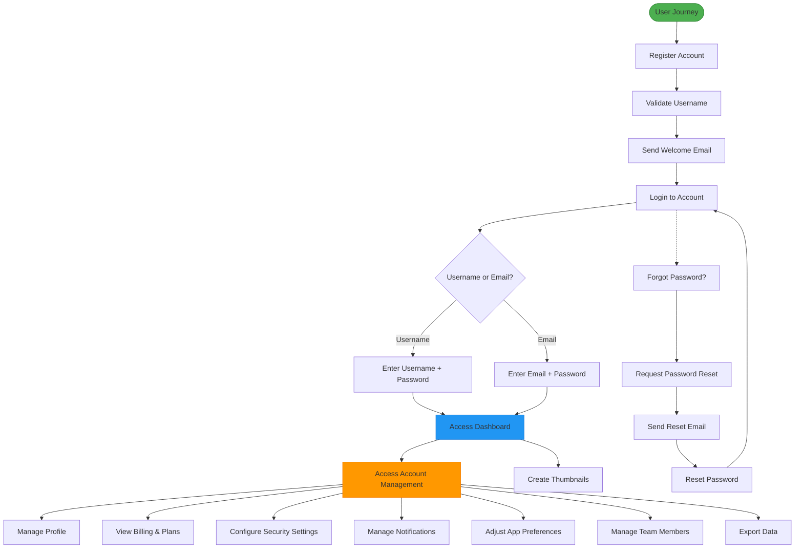

**Diagram sources**
- [auth.controller.ts](file://pikzels-clone/src/modules/auth/auth.controller.ts)
- [Login.tsx](file://pikzels-clone/client/src/components/auth/Login.tsx)
- [AccountPage.tsx](file://pikzels-clone/client/src/components/account/AccountPage.tsx)

## Username-Based Authentication System

### Username Validation and Generation
The system implements comprehensive username validation and generation utilities that follow industry standards. Usernames must be 3-30 characters long and can only contain letters, numbers, dots, underscores, and dashes. The system prevents usernames from starting or ending with special characters and disallows consecutive special characters.

Username suggestions are generated based on the user's full name and email address using multiple strategies including full name combinations, initials, email prefixes, and variations with numbers. The system ensures suggestions are unique and available through case-insensitive checks.

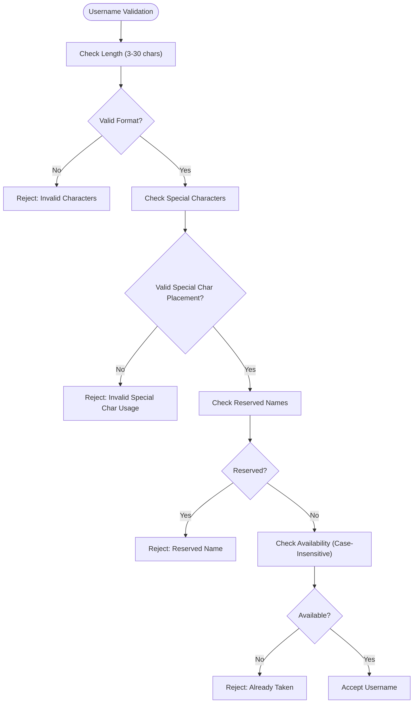

**Diagram sources**
- [username.utils.ts](file://pikzels-clone/src/utils/username.utils.ts)

### Enhanced Login Workflow
The login system now supports both username and email authentication through a unified identifier field. The system automatically detects whether the provided identifier is an email address (contains '@') or a username and performs case-insensitive lookups accordingly.

The login process includes comprehensive error handling that prevents information disclosure about registered accounts. Whether a username or email doesn't exist, the system returns the same generic error message to prevent enumeration attacks.

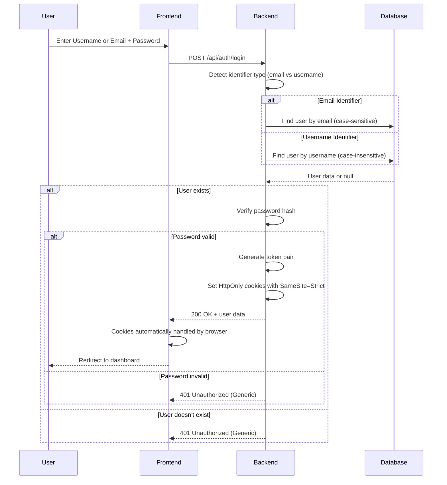

**Diagram sources**
- [auth.controller.ts](file://pikzels-clone/src/modules/auth/auth.controller.ts)
- [auth.middleware.ts](file://pikzels-clone/src/middleware/auth.middleware.ts)

### Username Suggestions and Availability Checking
The frontend provides intelligent username suggestions through the UsernameInput component. When users enter their full name and email, the system generates 5 unique username suggestions that are immediately validated for availability. Users can click on suggested usernames or create their own with real-time validation feedback.

The system implements debounced availability checking to reduce server load while providing responsive feedback. Username availability is checked using case-insensitive database queries to prevent conflicts with different casing.

**Section sources**
- [username.utils.ts](file://pikzels-clone/src/utils/username.utils.ts)
- [Register.tsx](file://pikzels-clone/client/src/components/auth/Register.tsx)

## Enhanced JWT Authentication System

### Token Generation and Validation
The authentication system uses JSON Web Tokens (JWT) for stateless session management with an enhanced security model. When users register or log in successfully, the system generates a token pair consisting of a short-lived access token and a long-lived refresh token.

The access token is valid for 15 minutes and contains the user's ID, email, and a unique session ID. The refresh token is valid for 7 days and can be used to obtain a new access token without requiring the user to re-enter their credentials. This approach significantly improves security by minimizing the exposure window of access tokens while maintaining user convenience.

The token generation process involves several security measures:
1. Passwords are hashed using bcryptjs with a salt round of 12 for enhanced security
2. The JWT tokens are signed with separate secrets for access and refresh tokens
3. Tokens include a unique session ID to enable token revocation
4. Access tokens have a short 15-minute expiration period to limit the window of vulnerability

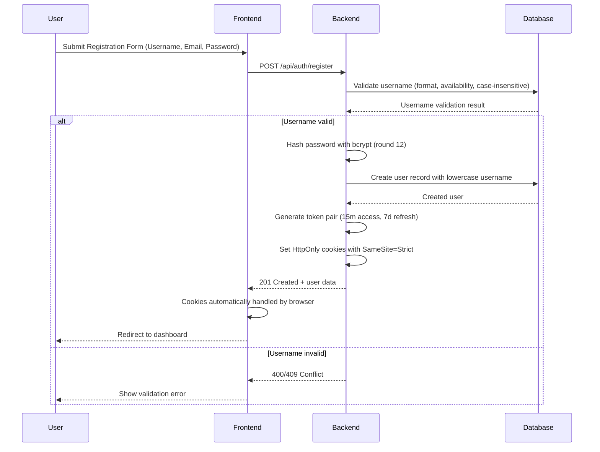

**Diagram sources**
- [auth.controller.ts](file://pikzels-clone/src/modules/auth/auth.controller.ts)
- [jwt.enhanced.service.ts](file://pikzels-clone/src/services/jwt.enhanced.service.ts)

### Token Refresh Mechanism
The system implements a token refresh mechanism that allows users to obtain new access tokens without re-authenticating. When an access token expires, the frontend automatically uses the refresh token to request a new access token from the server.

The refresh process validates the refresh token's signature and type claim, verifies the user still exists in the database, and generates a new token pair with a fresh session ID. This approach provides both security and user convenience by eliminating the need for frequent logins while maintaining the ability to revoke sessions.

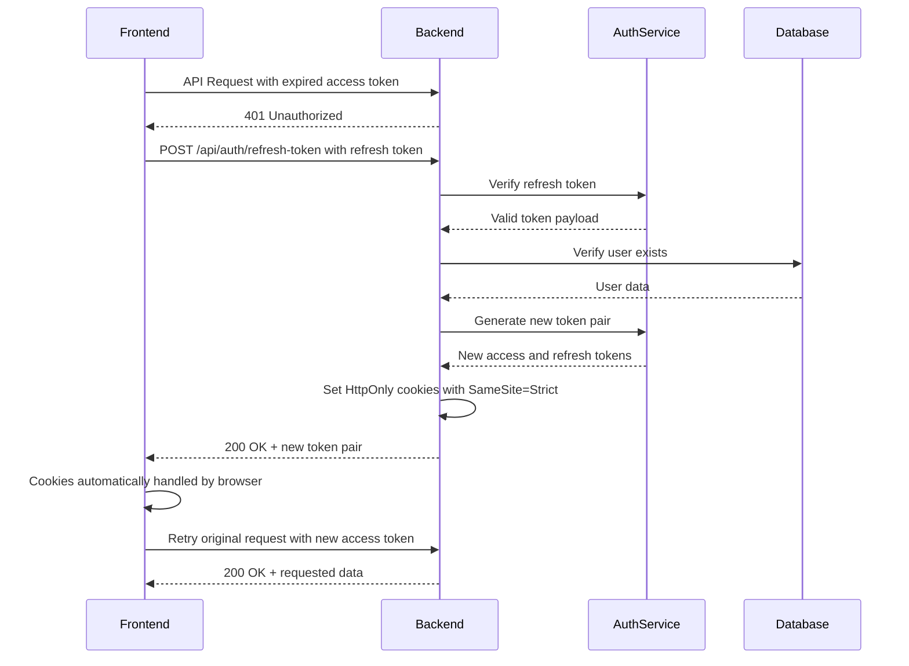

**Section sources**
- [auth.controller.ts](file://pikzels-clone/src/modules/auth/auth.controller.ts)
- [jwt.enhanced.service.ts](file://pikzels-clone/src/services/jwt.enhanced.service.ts)

### Protected Route Implementation
Protected routes are implemented using an authentication middleware that validates JWT tokens on each request. The middleware extracts the token from the Authorization header, verifies its signature and expiration, and attaches the user object to the request if valid.

The frontend implements protected routes using a React component that checks authentication status before rendering protected content. This component attempts to validate the stored token by making a request to the profile endpoint, ensuring the token is still valid.

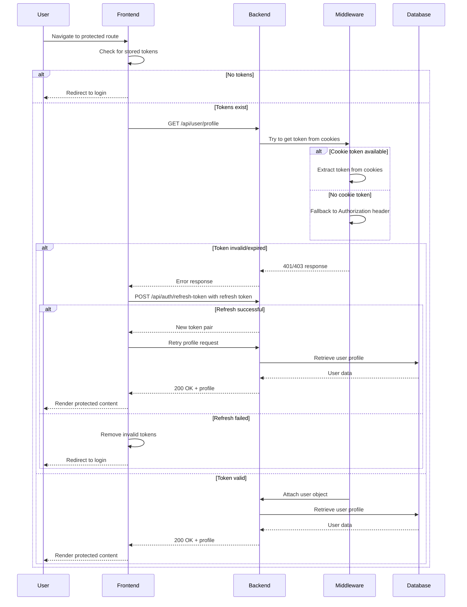

**Diagram sources**
- [auth.middleware.ts](file://pikzels-clone/src/middleware/auth.middleware.ts)
- [ProtectedRoute.tsx](file://pikzels-clone/client/src/components/ProtectedRoute.tsx)

**Section sources**
- [auth.middleware.ts](file://pikzels-clone/src/middleware/auth.middleware.ts)
- [ProtectedRoute.tsx](file://pikzels-clone/client/src/components/ProtectedRoute.tsx)

## HttpOnly Cookie Migration

### Security Enhancement Overview
The authentication system has been significantly enhanced with the migration from localStorage token storage to HttpOnly cookies. This represents a major security improvement that protects against Cross-Site Scripting (XSS) attacks by preventing client-side JavaScript from accessing authentication tokens.

The migration includes:
- **HttpOnly cookies**: Access and refresh tokens are now stored in HttpOnly cookies, making them inaccessible to JavaScript
- **Secure flags**: Cookies are marked as secure in production environments to prevent transmission over HTTP
- **SameSite protection**: Cookies use SameSite=Strict to prevent CSRF attacks
- **Automatic handling**: The browser automatically includes cookies with requests, eliminating manual token management

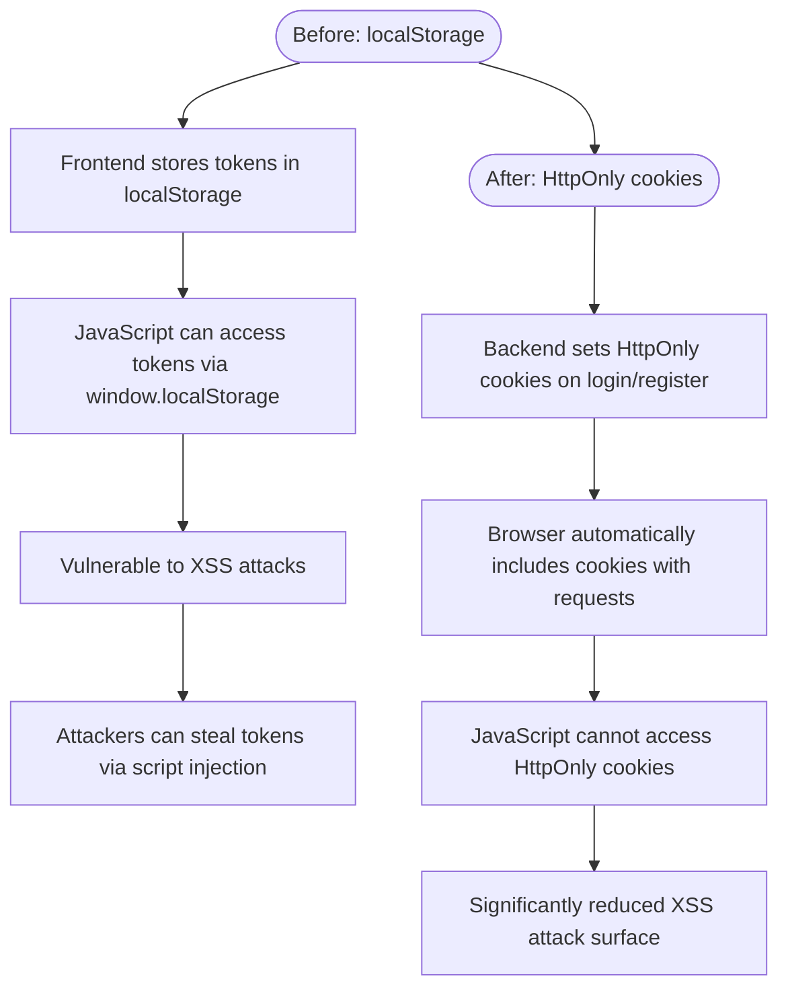

**Diagram sources**
- [auth.controller.ts](file://pikzels-clone/src/modules/auth/auth.controller.ts)
- [auth.middleware.ts](file://pikzels-clone/src/middleware/auth.middleware.ts)

### Cookie Configuration and Security
The system implements comprehensive cookie security measures:

**Access Token Cookie:**
- Name: `token`
- HttpOnly: true (prevents JavaScript access)
- Secure: true in production (HTTPS only)
- SameSite: Strict (prevents CSRF)
- Max-Age: 900 seconds (15 minutes)
- Domain: Based on application configuration

**Refresh Token Cookie:**
- Name: `refreshToken`
- HttpOnly: true (prevents JavaScript access)
- Secure: true in production (HTTPS only)
- SameSite: Strict (prevents CSRF)
- Max-Age: 604800 seconds (7 days)
- Domain: Based on application configuration

**Section sources**
- [auth.controller.ts](file://pikzels-clone/src/modules/auth/auth.controller.ts)
- [auth.middleware.ts](file://pikzels-clone/src/middleware/auth.middleware.ts)

### Backend Implementation
The backend authentication controllers now handle cookie-based token storage:

**Registration Process:**
1. User registers with valid credentials
2. System generates JWT token pair
3. Sets HttpOnly cookies with SameSite=Strict and Secure flags
4. Returns user data without exposing tokens

**Login Process:**
1. User authenticates with credentials
2. System validates credentials
3. Generates JWT token pair
4. Sets HttpOnly cookies with SameSite=Strict and Secure flags
5. Returns user data without exposing tokens

**Logout Process:**
1. User initiates logout
2. Backend clears HttpOnly cookies
3. Invalidates active sessions
4. Returns success response

**Section sources**
- [auth.controller.ts](file://pikzels-clone/src/modules/auth/auth.controller.ts)

### Frontend Adaptations
The frontend authentication context has been adapted to work with cookie-based authentication:

**Authentication Context:**
- Uses `credentials: 'include'` for fetch requests
- Relies on automatic cookie handling by browser
- Simplified token management - no localStorage manipulation needed
- Automatic cookie inclusion with all authenticated requests

**Login Component:**
- Removed localStorage token storage
- Now relies on browser cookie handling
- Simplified authentication flow
- Automatic cookie-based session management

**Section sources**
- [AuthContext.tsx](file://pikzels-clone/client/src/contexts/AuthContext.tsx)
- [Login.tsx](file://pikzels-clone/client/src/components/auth/Login.tsx)

## Cross-Origin Cookie Configuration

### Deployment Environment Support
The authentication system now includes comprehensive cross-origin cookie configuration to support deployments across different hosting platforms. The system automatically adjusts cookie settings based on the deployment environment, particularly for cross-origin scenarios like Netlify to Railway deployments.

**Environment-Based Cookie Configuration:**
- **Development**: SameSite=Strict, no Secure flag (HTTP)
- **Production**: SameSite=None, Secure=true (HTTPS only)
- **Cross-Origin**: SameSite=None required for cross-domain cookie sharing

**Cross-Origin Deployment Scenarios:**
- Netlify frontend → Railway backend
- Vercel frontend → Railway backend  
- Custom domains with SSL certificates

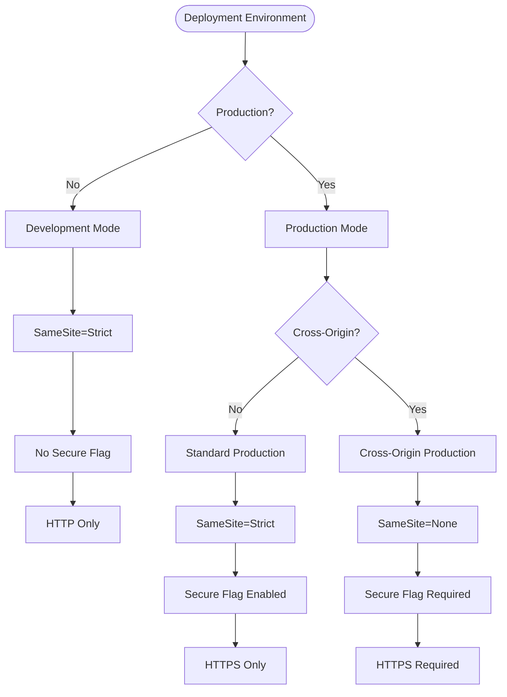

**Diagram sources**
- [auth.controller.ts](file://pikzels-clone/src/modules/auth/auth.controller.ts)
- [security.config.ts](file://pikzels-clone/src/config/security.config.ts)

### Cookie Security Implementation
The system implements environment-aware cookie security configuration:

**Development Environment:**
- SameSite: 'strict'
- Secure: false (HTTP development)
- Domain: localhost
- Path: '/'
- Expires: 15 minutes for access token, 7 days for refresh token

**Production Environment:**
- SameSite: 'none' (required for cross-origin)
- Secure: true (HTTPS only)
- Domain: Configured via CORS_ORIGIN
- Path: '/'
- Expires: 15 minutes for access token, 7 days for refresh token

**Cross-Origin Considerations:**
- SameSite=None requires Secure=true
- Domain must match between frontend and backend
- CORS configuration must allow credentials
- Proper SSL/TLS certificates required

**Section sources**
- [auth.controller.ts](file://pikzels-clone/src/modules/auth/auth.controller.ts)
- [security.config.ts](file://pikzels-clone/src/config/security.config.ts)

## Improved Error Logging & Debugging

### Enhanced Logging Infrastructure
The authentication system now includes comprehensive error logging with structured logging and security event tracking. The system uses Winston for production logging with daily rotation and security-focused log categories.

**Logging Categories:**
- **Application Logs**: General application events and operations
- **Error Logs**: Detailed error information with stack traces
- **Security Logs**: Authentication attempts, token validation, and security events

**Enhanced Error Handling:**
- Structured logging with contextual information
- Security event tracking for authentication failures
- Detailed error information for debugging
- Production-safe error messages without sensitive data exposure

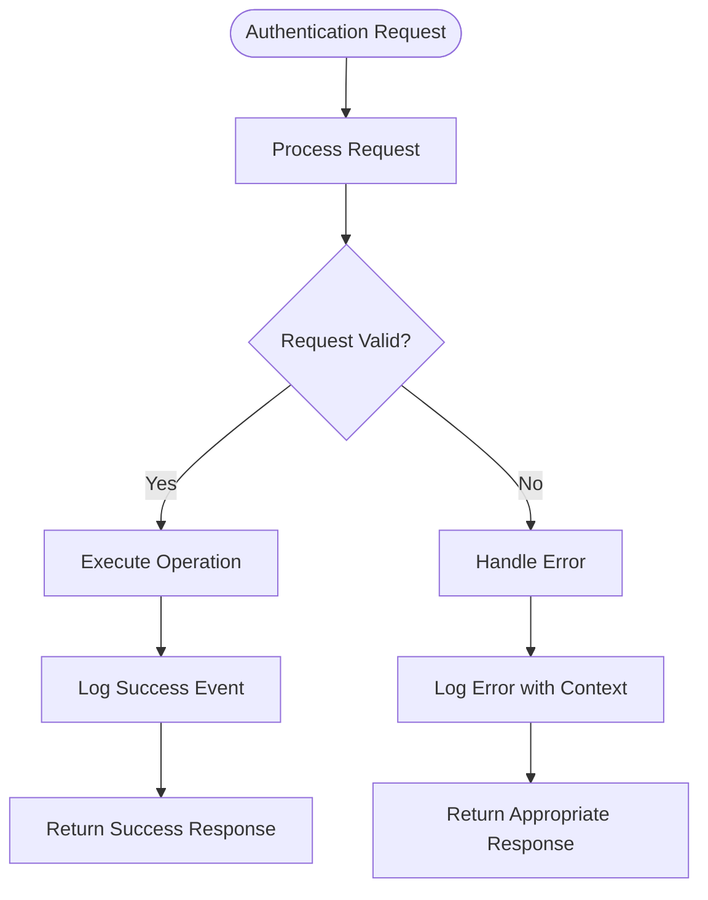

**Diagram sources**
- [auth.controller.ts](file://pikzels-clone/src/modules/auth/auth.controller.ts)
- [auth.middleware.ts](file://pikzels-clone/src/middleware/auth.middleware.ts)
- [logger.ts](file://pikzels-clone/src/utils/logger.ts)

### Security Event Logging
The system implements comprehensive security event logging for authentication-related activities:

**Authentication Attempts:**
- Successful logins with user information and session details
- Failed login attempts with IP address and user agent
- Token validation failures with error context
- Session creation and termination events

**Security Events:**
- Invalid token detection and handling
- User not found scenarios
- Email verification requirement enforcement
- Security monitoring and alerting

**Debugging Information:**
- Request context including IP addresses and user agents
- Error stack traces for development debugging
- Performance metrics for authentication operations
- User session information for troubleshooting

**Section sources**
- [auth.controller.ts](file://pikzels-clone/src/modules/auth/auth.controller.ts)
- [auth.middleware.ts](file://pikzels-clone/src/middleware/auth.middleware.ts)
- [logger.ts](file://pikzels-clone/src/utils/logger.ts)

## Multi-Factor Authentication

### MFA Implementation Overview
The system now supports Multi-Factor Authentication (MFA) using Time-Based One-Time Passwords (TOTP) following the RFC 6238 standard. Users can enable MFA through their account settings, which enhances security by requiring a second factor in addition to their password.

The MFA implementation includes:
- TOTP authentication using Google Authenticator or similar apps
- Backup codes for emergency access
- QR code provisioning for easy setup
- Encrypted storage of MFA secrets in the database
- Support for backup code regeneration

**Diagram sources**
- [mfa.service.ts](file://pikzels-clone/src/modules/auth/mfa.service.ts)
- [auth.service.ts](file://pikzels-clone/src/modules/auth/auth.service.ts)

### MFA Authentication Flow
When MFA is enabled for an account, users must provide both their password and a valid TOTP code during the login process. The system verifies the TOTP code against the stored secret using the speakeasy library with a time window of ±60 seconds (2 time steps) to account for clock drift.

Users can also authenticate using backup codes, which are single-use and automatically removed from the user's account after use. This provides a recovery mechanism if users lose access to their authenticator app.

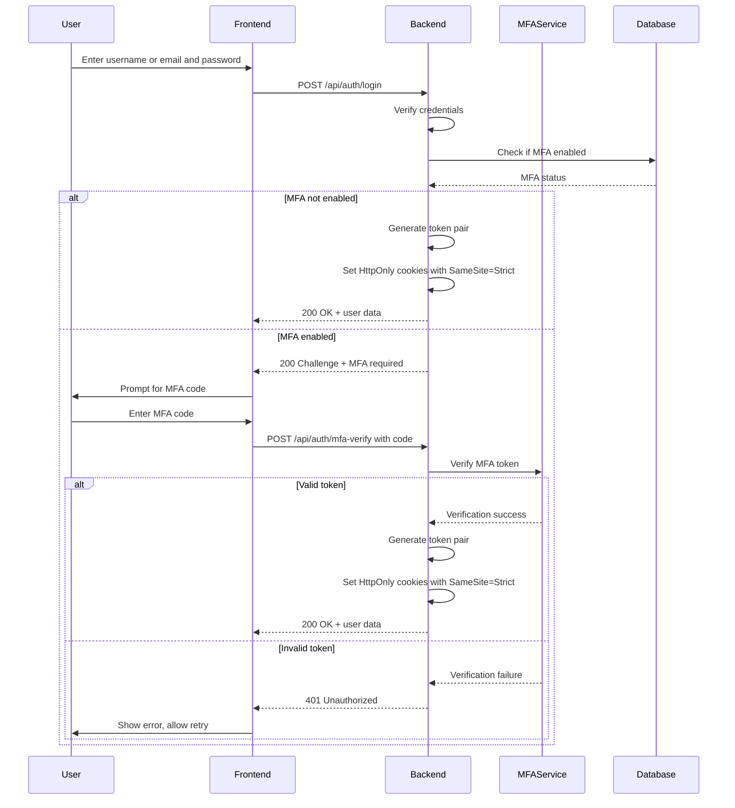

**Section sources**
- [mfa.service.ts](file://pikzels-clone/src/modules/auth/mfa.service.ts)
- [auth.service.ts](file://pikzels-clone/src/modules/auth/auth.service.ts)

## Password Recovery Flow

### Recovery Process Overview
The password recovery system follows a secure process that prevents information disclosure about registered email addresses. When a user requests a password reset, the system always returns the same success message regardless of whether the email exists in the database, preventing enumeration attacks.

The recovery process uses JWT tokens with a 1-hour expiration period, providing a balance between user convenience and security. These tokens contain the user ID and an action identifier to ensure they can only be used for password reset operations.

**Diagram sources**
- [auth.controller.ts](file://pikzels-clone/src/modules/auth/auth.controller.ts)
- [email.service.ts](file://pikzels-clone/src/modules/auth/email.service.ts)

### Email Service Integration
The email service is responsible for sending password reset and welcome emails. Currently, the system simulates email delivery by logging messages to the console, which facilitates development and testing. In production, this should be replaced with a real email service such as SendGrid, AWS SES, or Nodemailer with SMTP.

The password reset email contains a link with the JWT token as a query parameter, directing users to the reset password page. The token includes claims for the user ID and action type, ensuring it can only be used for password reset operations.

**Section sources**
- [email.service.ts](file://pikzels-clone/src/modules/auth/email.service.ts)
- [password-recovery.md](file://pikzels-clone/docs/api/password-recovery.md)

## Comprehensive Account Management

### AccountPage Component Architecture
The new AccountPage component serves as the central hub for comprehensive user account management with a tabbed interface supporting seven distinct sections. The component utilizes React hooks for state management and implements a sophisticated routing system for seamless navigation between account sections.

The component structure includes:
- **Tab Management**: Seven distinct tabs (Profile, Billing, Security, Notifications, Settings, Team, Export) with dedicated icons and navigation
- **State Management**: Comprehensive state handling for profile data, password changes, MFA setup, and account deletion
- **Mock Data Integration**: Realistic mock data for billing plans, invoices, sessions, and login history
- **Responsive Design**: Mobile-first approach with adaptive layouts for different screen sizes

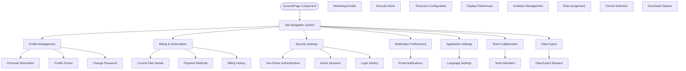

**Diagram sources**
- [AccountPage.tsx](file://pikzels-clone/client/src/components/account/AccountPage.tsx)

### AccountDropdown Integration
The AccountDropdown component provides streamlined access to account management features from the application header. The dropdown includes three logical groups: Account, Preferences, and Support, each containing relevant navigation items with descriptive labels and icons.

Key features include:
- **User Information Display**: Shows user avatar, name, email, and subscription status
- **Grouped Navigation**: Organized menu items with clear categorization
- **Interactive Elements**: Hover effects, keyboard navigation, and click-outside detection
- **Responsive Design**: Adapts to different screen sizes and mobile devices

**Section sources**
- [AccountPage.tsx](file://pikzels-clone/client/src/components/account/AccountPage.tsx)
- [AccountDropdown.tsx](file://pikzels-clone/client/src/components/account/AccountDropdown.tsx)

## Team Collaboration Features

### Team Management Architecture
The system now includes comprehensive team collaboration features built on a modular architecture that supports team creation, member management, and role-based access control. The team management system integrates seamlessly with the existing authentication infrastructure.

The collaboration service provides:
- **Team Creation**: Structured team creation with owner assignment and initial member setup
- **Member Management**: Dynamic member addition, role assignment, and permission management
- **Role-Based Access Control**: Hierarchical roles with appropriate permissions
- **Team Persistence**: Secure storage of team relationships and member data

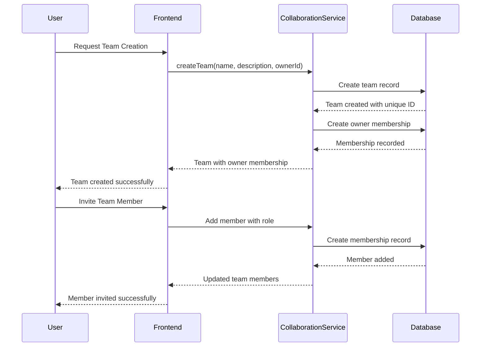

**Diagram sources**
- [collaboration.service.ts](file://pikzels-clone/src/modules/collaboration/collaboration.service.ts)
- [collaboration.controller.ts](file://pikzels-clone/src/modules/collaboration/collaboration.controller.ts)

### Team Member Management
The team management interface provides intuitive controls for managing team members and their roles. The system supports hierarchical roles with appropriate permissions and includes features for member onboarding and offboarding.

Key team management features:
- **Member Invitation**: Email-based invitation system with automated onboarding
- **Role Assignment**: Flexible role-based permissions with inheritance
- **Member Status Tracking**: Real-time visibility of member activity and status
- **Team Statistics**: Usage metrics and contribution tracking

**Section sources**
- [collaboration.service.ts](file://pikzels-clone/src/modules/collaboration/collaboration.service.ts)
- [collaboration.controller.ts](file://pikzels-clone/src/modules/collaboration/collaboration.controller.ts)
- [AccountPage.tsx](file://pikzels-clone/client/src/components/account/AccountPage.tsx)

## Data Export Functionality

### Data Export Architecture
The data export system provides users with comprehensive control over their personal data, enabling them to download copies of their information in various formats. The system is designed with security and privacy considerations in mind, ensuring data protection throughout the export process.

The export functionality includes:
- **Selective Data Export**: Users can choose which data categories to export
- **Format Flexibility**: Support for multiple export formats (JSON, CSV, PDF)
- **Progress Tracking**: Real-time status updates during export processing
- **Security Measures**: Encrypted export links and temporary access tokens

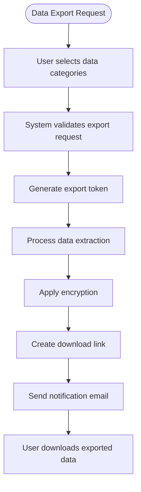

**Diagram sources**
- [AccountPage.tsx](file://pikzels-clone/client/src/components/account/AccountPage.tsx)

### Export Data Categories
The system organizes user data into logical categories that users can export independently. Each category represents a distinct aspect of user information and includes appropriate metadata for comprehensive data representation.

**Available Export Categories:**
- **Personal Information**: Basic profile data, contact information, and preferences
- **Account Activity**: Login history, session logs, and account modification records
- **Billing Information**: Payment history, subscription details, and transaction records
- **Project Data**: Thumbnail projects, templates, and creative assets
- **Settings Configuration**: Application preferences, notification settings, and display options

**Section sources**
- [AccountPage.tsx](file://pikzels-clone/client/src/components/account/AccountPage.tsx)

## Frontend Authentication Implementation

### Authentication Context and State Management
The frontend implements authentication state management using React Context. The AuthContext provides a centralized way to manage user authentication state across the application, including login, logout, and registration functionality.

**Updated** The authentication context now works seamlessly with the new HttpOnly cookie-based authentication system. The context handles cookie-based authentication automatically, eliminating the need for manual localStorage token management.

The context manages authentication state by:
- Automatically handling cookie-based authentication
- Managing user profile data and authentication status
- Providing login, logout, and registration functions
- Handling authentication state across component boundaries

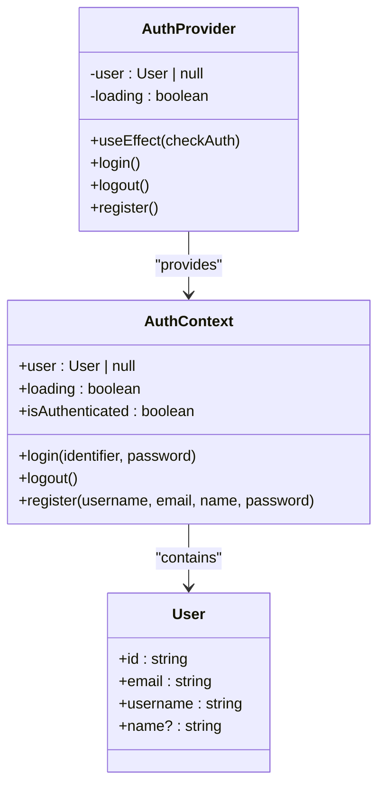

**Diagram sources**
- [AuthContext.tsx](file://pikzels-clone/client/src/contexts/AuthContext.tsx)
- [Login.tsx](file://pikzels-clone/client/src/components/auth/Login.tsx)

### Component Implementation
Authentication components are implemented as React functional components with proper form handling and error management. Each component manages its own state for form inputs and handles API responses appropriately.

The login component now accepts either a username or email in the identifier field, automatically detecting the input type and providing appropriate visual feedback. The registration component includes the new UsernameInput component that provides intelligent username suggestions and real-time validation.

The UsernameInput component implements sophisticated username generation and validation, including:
- Real-time availability checking with debounced requests
- Intelligent suggestions based on user's full name and email
- Case-insensitive availability validation
- Comprehensive format validation with immediate feedback
- Support for refreshing suggestions when needed

**Section sources**
- [Login.tsx](file://pikzels-clone/client/src/components/auth/Login.tsx)
- [Register.tsx](file://pikzels-clone/client/src/components/auth/Register.tsx)
- [UsernameInput.tsx](file://pikzels-clone/client/src/components/auth/UsernameInput.tsx)

### Centralized Authenticated API Calls
The system introduces a new authFetch utility that provides centralized authenticated API calls using HttpOnly cookies instead of localStorage. This utility simplifies authenticated requests throughout the frontend application.

**authFetch Utility Features:**
- Automatic cookie handling with `credentials: 'include'`
- JSON content type detection and automatic setting
- Convenience methods for common HTTP verbs (GET, POST, PUT, DELETE)
- Consistent error handling and response processing
- Environment-aware URL construction

**Section sources**
- [api.ts](file://pikzels-clone/client/src/utils/api.ts)

## User Settings Management

### Settings Structure and API
User settings are managed through a flexible JSON structure that allows for easy extension. The settings API provides endpoints for retrieving and updating user preferences, including theme, language, notification preferences, thumbnail defaults, privacy controls, and MFA configuration.

The settings are stored as a JSON field in the User table, allowing for schema flexibility without requiring database migrations for new settings. MFA settings are encrypted before storage to protect sensitive information like TOTP secrets.

**Updated** The system now includes display preference settings that allow users to choose between showing their name or username in public contexts.

| Setting Category | Properties | Description |
|------------------|-----------|-------------|
| theme | light, dark | Application color scheme |
| language | en, es, fr, de, ja | Interface language preference |
| notifications | email, push | Notification delivery methods |
| thumbnailDefaults | width, height, style | Default parameters for new thumbnails |
| privacy | profileVisible, thumbnailsPublic | Visibility settings for user content |
| displayPreference | name, username | Preference for public display format |
| mfa | enabled, secret, backupCodes | Multi-factor authentication configuration |

**Section sources**
- [user-settings.md](file://pikzels-clone/docs/api/user-settings.md)
- [profile.controller.ts](file://pikzels-clone/src/modules/auth/profile.controller.ts)
- [mfa.service.ts](file://pikzels-clone/src/modules/auth/mfa.service.ts)

## Security Best Practices

### Enhanced Security Measures
The system implements several enhanced security best practices to protect user accounts:

1. **HttpOnly cookies**: All authentication tokens are now stored in HttpOnly cookies, preventing XSS attacks
2. **Secure flags**: Cookies are marked secure in production environments for HTTPS-only transmission
3. **SameSite protection**: Cookies use SameSite=Strict to prevent CSRF attacks
4. **Token rotation**: The system uses short-lived access tokens (15 minutes) and long-lived refresh tokens (7 days) to minimize exposure
5. **Structured logging**: Comprehensive error logging with security event tracking for debugging
6. **Information hiding**: The password recovery system does not reveal whether an email is registered, preventing enumeration attacks
7. **Session management**: Each token pair includes a unique session ID that can be used for session revocation
8. **Username validation**: Comprehensive username validation prevents security issues with special characters and reserved names
9. **Cross-origin support**: Environment-aware cookie configuration for different deployment scenarios

### Brute Force Protection
While the current implementation does not include rate limiting, the architecture supports adding this feature. Rate limiting can be implemented at the route level to prevent brute force attacks on authentication endpoints.

Additional security measures that can be implemented include:
- Account lockout after multiple failed login attempts
- CAPTCHA challenges for suspicious activity
- Multi-factor authentication for sensitive operations
- IP-based rate limiting for password reset requests
- Session invalidation on password change

**Section sources**
- [auth.controller.ts](file://pikzels-clone/src/modules/auth/auth.controller.ts)
- [jwt.enhanced.service.ts](file://pikzels-clone/src/services/jwt.enhanced.service.ts)
- [auth.middleware.ts](file://pikzels-clone/src/middleware/auth.middleware.ts)
- [logger.ts](file://pikzels-clone/src/utils/logger.ts)

## Troubleshooting Guide

### Common Authentication Issues
This section addresses common issues users and developers may encounter with the enhanced authentication system.

**HttpOnly Cookie Issues**
- **Symptom**: Tokens not persisting between browser sessions
- **Cause**: HttpOnly cookies are automatically managed by browser
- **Solution**: Ensure `credentials: 'include'` is set in fetch requests for authenticated endpoints

**Cross-Domain Cookie Problems**
- **Symptom**: Authentication failing across subdomains
- **Cause**: Cookie domain configuration issues
- **Solution**: Configure cookie domain settings for your deployment environment

**Mixed Content Errors**
- **Symptom**: Secure cookies not working in development
- **Cause**: Attempting to use secure cookies over HTTP
- **Solution**: Use HTTPS in development or configure cookies for non-secure environments

**Token Not Persisting**
- **Symptom**: User is logged out after page refresh
- **Cause**: Missing HttpOnly cookie handling or incorrect cookie configuration
- **Solution**: Verify cookie settings in authentication controllers and ensure proper browser cookie handling

**Password Reset Link Not Working**
- **Symptom**: Reset token is invalid or expired
- **Cause**: Token has expired (1-hour limit) or was not properly extracted from URL
- **Solution**: Request a new reset link and complete the process within the time limit

**Account Already Exists Error**
- **Symptom**: Cannot register with an email address
- **Cause**: Email is already registered in the system
- **Solution**: Use the login form or request a password reset if the user has forgotten their password

**Invalid Credentials on Login**
- **Symptom**: Login fails with "Invalid credentials" message
- **Cause**: Incorrect username/email or password, or account not verified
- **Solution**: Verify username/email and password, check if email verification is required, use password recovery if needed

**MFA Setup Failing**
- **Symptom**: Cannot complete MFA setup
- **Cause**: Incorrect verification code entered
- **Solution**: Ensure the device time is synchronized and re-scan the QR code

**Account Management Tab Navigation Issues**
- **Symptom**: Tabs not switching or URL not updating
- **Cause**: Routing configuration issues or state management problems
- **Solution**: Verify route configuration in App.tsx, check tab change handlers, ensure proper URL parameter handling

**Team Collaboration Feature Not Working**
- **Symptom**: Team member management features unavailable
- **Cause**: Missing collaboration module or insufficient permissions
- **Solution**: Verify collaboration service installation, check user permissions, ensure proper API endpoint configuration

**Data Export Request Failing**
- **Symptom**: Export requests timeout or fail
- **Cause**: Large data volume, server processing limits, or storage issues
- **Solution**: Reduce export data scope, check server resources, verify storage permissions

**Enhanced Error Logging Issues**
- **Symptom**: Missing or incomplete error logs
- **Cause**: Logging configuration or permission issues
- **Solution**: Check Winston logger configuration, verify log file permissions, ensure proper log rotation setup

**HttpOnly Cookie Security**
- **Symptom**: Authentication not working in production
- **Cause**: Missing cookie parser or CORS configuration
- **Solution**: Ensure cookie-parser middleware is enabled and CORS includes credentials: true

**Cross-Origin Cookie Configuration**
- **Symptom**: Cookies not being sent across different domains
- **Cause**: SameSite=None requires Secure=true and proper domain configuration
- **Solution**: Verify SameSite setting matches environment, ensure HTTPS in production, configure CORS origins correctly

**Section sources**
- [auth.controller.ts](file://pikzels-clone/src/modules/auth/auth.controller.ts)
- [AuthContext.tsx](file://pikzels-clone/client/src/contexts/AuthContext.tsx)
- [password-recovery.md](file://pikzels-clone/docs/api/password-recovery.md)
- [mfa.service.ts](file://pikzels-clone/src/modules/auth/mfa.service.ts)
- [AccountPage.tsx](file://pikzels-clone/client/src/components/account/AccountPage.tsx)
- [collaboration.service.ts](file://pikzels-clone/src/modules/collaboration/collaboration.service.ts)
- [logger.ts](file://pikzels-clone/src/utils/logger.ts)
- [server.ts](file://pikzels-clone/src/server.ts)