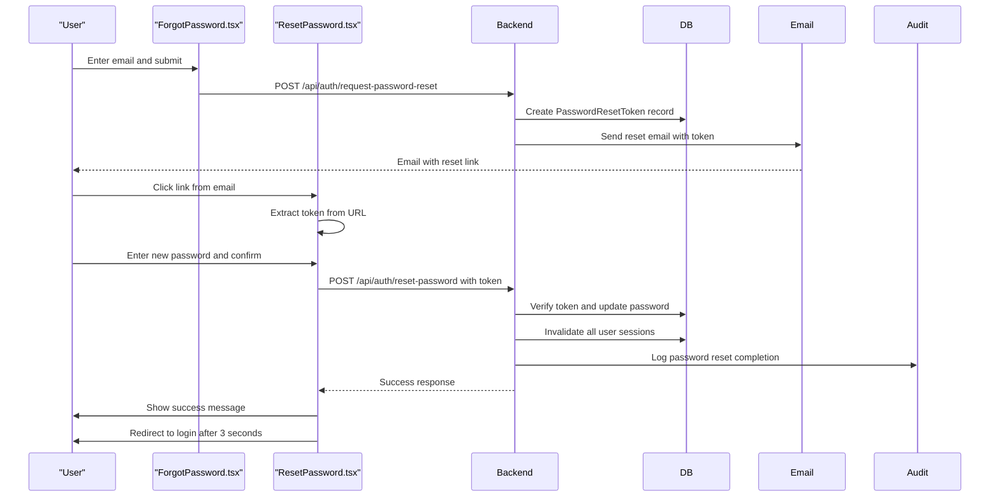
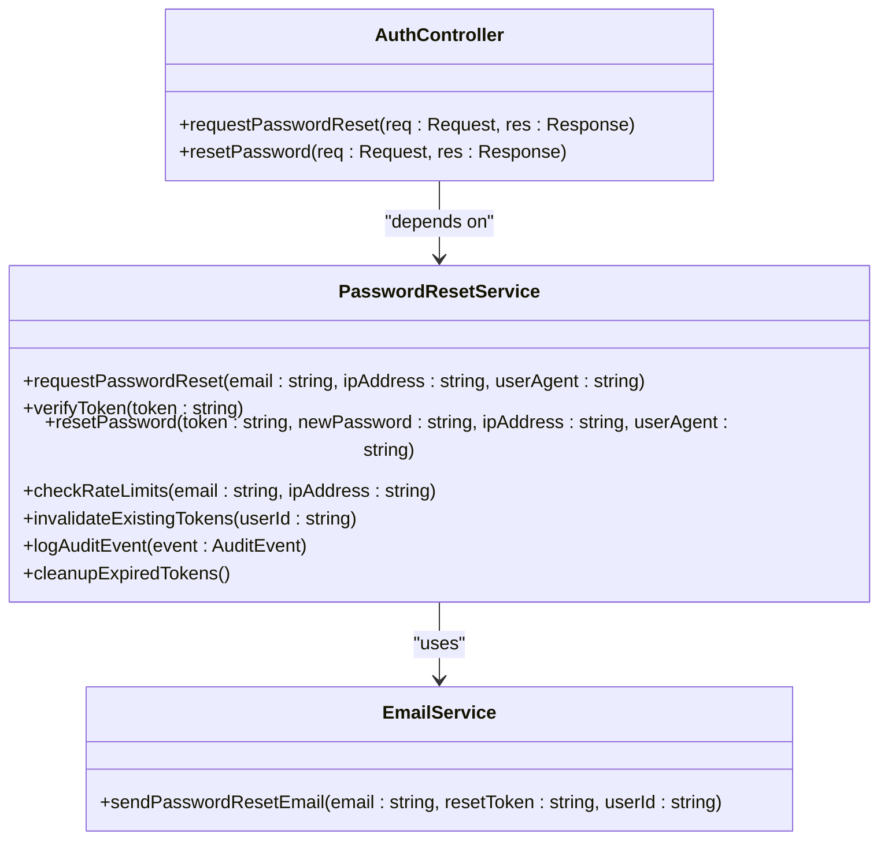
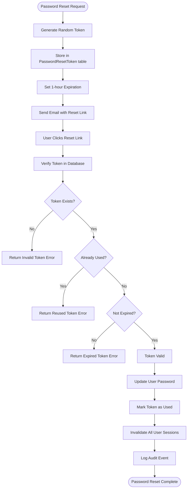

# Password Recovery & Reset

<cite>
**Referenced Files in This Document**
- [ForgotPassword.tsx](file://pikzels-clone/client/src/components/auth/ForgotPassword.tsx)
- [ResetPassword.tsx](file://pikzels-clone/client/src/components/auth/ResetPassword.tsx)
- [password-reset.service.ts](file://pikzels-clone/src/modules/auth/password-reset.service.ts)
- [email.service.ts](file://pikzels-clone/src/modules/email/email.service.ts)
- [auth.controller.ts](file://pikzels-clone/src/modules/auth/auth.controller.ts)
- [auth.routes.ts](file://pikzels-clone/src/modules/auth/auth.routes.ts)
- [schema.prisma](file://pikzels-clone/prisma/schema.prisma)
</cite>

## Update Summary
**Changes Made**
- Updated to reflect database-stored password reset tokens instead of JWT-based approach
- Added comprehensive rate limiting implementation (per-email and per-IP)
- Integrated session invalidation during password reset
- Added comprehensive audit logging for all password reset activities
- Updated token validation to use database records with one-time usage semantics
- Enhanced security measures including token cleanup and reuse prevention

## Table of Contents
1. [Introduction](#introduction)
2. [Frontend Implementation](#frontend-implementation)
3. [Backend Service Architecture](#backend-service-architecture)
4. [Database Token Management](#database-token-management)
5. [Rate Limiting and Security](#rate-limiting-and-security)
6. [API Contracts and Error Handling](#api-contracts-and-error-handling)
7. [Security Measures](#security-measures)
8. [Common Issues and Troubleshooting](#common-issues-and-troubleshooting)
9. [UX Best Practices](#ux-best-practices)

## Introduction

The Password Recovery and Reset system enables users to regain access to their accounts when they forget their passwords. This document details the complete flow from password reset request to successful password update, covering both frontend and backend implementations. The system uses secure database-stored tokens with expiration and one-time usage semantics to ensure account security during the recovery process.

**Updated** The system now implements OWASP-compliant password reset functionality with database-stored tokens, 1-hour expiration, comprehensive rate limiting, session invalidation, and detailed audit logging. This replaces the previous JWT-based approach with enhanced security measures.

**Section sources**
- [ForgotPassword.tsx:3-98](file://pikzels-clone/client/src/components/auth/ForgotPassword.tsx#L3-L98)
- [ResetPassword.tsx:3-174](file://pikzels-clone/client/src/components/auth/ResetPassword.tsx#L3-L174)

## Frontend Implementation

### Forgot Password Component

The `ForgotPassword` component provides a form for users to enter their email address to initiate the password recovery process. It handles form submission, displays loading states, and shows success or error messages based on the API response.

Key features:
- Email input validation
- Loading state during API request
- Success message upon successful request submission
- Error handling for network issues and API failures
- Navigation back to login page

The component makes a POST request to `/api/auth/request-password-reset` with the user's email address and processes the response accordingly.

### Reset Password Component

The `ResetPassword` component handles the password reset functionality after the user clicks the link in their email. It extracts the reset token from the URL query parameters and provides a form for entering and confirming the new password.

Key features:
- Token extraction from URL parameters (supports both `/reset-password/:token` and `/reset-password?token=xyz`)
- New password and confirmation validation (minimum 6 characters, match requirement)
- Real-time error feedback
- Automatic redirection to login page after successful reset
- Handling of missing or invalid tokens

The component makes a POST request to `/api/auth/reset-password` with the token and new password, then processes the response to provide appropriate user feedback.



**Diagram sources**
- [ForgotPassword.tsx:3-98](file://pikzels-clone/client/src/components/auth/ForgotPassword.tsx#L3-L98)
- [ResetPassword.tsx:3-174](file://pikzels-clone/client/src/components/auth/ResetPassword.tsx#L3-L174)
- [password-reset.service.ts:79-145](file://pikzels-clone/src/modules/auth/password-reset.service.ts#L79-L145)

**Section sources**
- [ForgotPassword.tsx:3-98](file://pikzels-clone/client/src/components/auth/ForgotPassword.tsx#L3-L98)
- [ResetPassword.tsx:3-174](file://pikzels-clone/client/src/components/auth/ResetPassword.tsx#L3-L174)

## Backend Service Architecture

The password recovery system is implemented across multiple backend components that work together to provide a secure and reliable recovery flow.

### Password Reset Service

The `PasswordResetService` class contains the core business logic for password recovery operations. It coordinates between user data storage, email services, and audit logging to implement the recovery workflow.

Key responsibilities:
- Rate limiting per email and per IP address
- Database-stored token generation and validation
- Session invalidation during password reset
- Comprehensive audit logging
- Token cleanup and maintenance

### Controller Layer

The `AuthController` exposes REST endpoints for password recovery operations, handling HTTP request parsing, validation, and response formatting.

### Routing Configuration

The `auth.routes.ts` file defines the API endpoints that connect HTTP requests to controller methods, establishing the public interface for the password recovery system.



**Diagram sources**
- [password-reset.service.ts:36-396](file://pikzels-clone/src/modules/auth/password-reset.service.ts#L36-L396)
- [auth.controller.ts:285-376](file://pikzels-clone/src/modules/auth/auth.controller.ts#L285-L376)
- [email.service.ts:230-276](file://pikzels-clone/src/modules/email/email.service.ts#L230-L276)

**Section sources**
- [password-reset.service.ts:36-396](file://pikzels-clone/src/modules/auth/password-reset.service.ts#L36-L396)
- [auth.controller.ts:285-376](file://pikzels-clone/src/modules/auth/auth.controller.ts#L285-L376)
- [auth.routes.ts:106-131](file://pikzels-clone/src/modules/auth/auth.routes.ts#L106-L131)

## Database Token Management

### Token Storage Schema

The password reset system uses a dedicated `PasswordResetToken` model in the database to store reset tokens securely:

```prisma
model PasswordResetToken {
  id        String   @id @default(uuid())
  userId    String
  token     String   @unique
  ipAddress String?
  userAgent String?
  createdAt DateTime @default(now())
  expiresAt DateTime
  usedAt    DateTime?
  isUsed    Boolean  @default(false)
  User      User     @relation(fields: [userId], references: [id], onDelete: Cascade)
}
```

### Token Lifecycle

1. **Generation**: Random 32-byte token generated using cryptographically secure random bytes
2. **Storage**: Token stored in database with 1-hour expiration
3. **Usage**: Token can only be used once and becomes invalid after successful reset
4. **Cleanup**: Expired tokens are cleaned up by scheduled maintenance jobs

### Token Validation Process

The system validates tokens through multiple checks:
1. **Existence**: Token must exist in the database
2. **Usage Status**: Token must not be marked as used
3. **Expiration**: Token must not be expired
4. **Integrity**: Token must be valid and properly formatted



**Diagram sources**
- [password-reset.service.ts:150-269](file://pikzels-clone/src/modules/auth/password-reset.service.ts#L150-L269)
- [schema.prisma:517-534](file://pikzels-clone/prisma/schema.prisma#L517-L534)

**Section sources**
- [password-reset.service.ts:79-145](file://pikzels-clone/src/modules/auth/password-reset.service.ts#L79-L145)
- [schema.prisma:517-534](file://pikzels-clone/prisma/schema.prisma#L517-L534)

## Rate Limiting and Security

### Rate Limiting Implementation

The system implements comprehensive rate limiting to prevent abuse:

**Per-Email Rate Limiting**: 3 requests per hour per email address
**Per-IP Rate Limiting**: 10 requests per hour per IP address

The rate limiting system prevents:
- Email enumeration attacks
- Brute force attempts
- Abuse of the password reset functionality

### Session Invalidation

During password reset, the system implements comprehensive session invalidation:
- All active sessions for the user are terminated
- Session records are marked as inactive
- Users must re-authenticate after password reset

### Audit Logging

All password reset activities are logged to the `AuditLog` table:
- Password reset requests
- Successful password resets
- Failed attempts (invalid tokens, expired tokens)
- Rate limit violations
- Session invalidation events

### Token Cleanup

The system includes automatic cleanup mechanisms:
- Scheduled cleanup of expired tokens
- Prevention of token reuse
- Database constraints to prevent concurrent usage

**Section sources**
- [password-reset.service.ts:9-21](file://pikzels-clone/src/modules/auth/password-reset.service.ts#L9-L21)
- [password-reset.service.ts:274-315](file://pikzels-clone/src/modules/auth/password-reset.service.ts#L274-L315)
- [password-reset.service.ts:375-393](file://pikzels-clone/src/modules/auth/password-reset.service.ts#L375-L393)

## API Contracts and Error Handling

### API Endpoints

| Endpoint | Method | Request Body | Success Response | Error Responses |
|---------|--------|--------------|------------------|-----------------|
| `/api/auth/request-password-reset` | POST | `{ "email": "user@example.com" }` | `200 OK: { "success": true, "message": "If your email is registered, you will receive a password reset link." }` | `400 Bad Request: { "error": "Email is required" }`<br>`429 Too Many Requests: { "success": false, "message": "Too many reset attempts. Please try again later.", "rateLimited": true }`<br>`500 Internal Server Error: { "error": "Password reset request failed" }` |
| `/api/auth/reset-password` | POST | `{ "token": "reset-token", "newPassword": "newpass123" }` | `200 OK: { "success": true, "message": "Password successfully reset. Please log in with your new password.", "userId": "user-id" }` | `400 Bad Request: { "error": "Token is required" }`<br>`400 Bad Request: { "error": "New password is required" }`<br>`400 Bad Request: { "error": "Invalid or expired reset token" }`<br>`400 Bad Request: { "error": "This reset link has already been used" }`<br>`400 Bad Request: { "error": "Reset link has expired" }`<br>`500 Internal Server Error: { "error": "Password reset failed" }` |

### Error Handling Strategy

The system implements comprehensive error handling to provide meaningful feedback while maintaining security:

- **Email validation**: Ensures email is provided in the request
- **Token validation**: Checks for missing, invalid, or expired tokens
- **Rate limiting**: Prevents abuse through configurable limits
- **Security considerations**: Does not reveal whether an email exists in the system to prevent enumeration attacks
- **Graceful degradation**: Provides clear error messages to users while logging detailed information for debugging
- **Session management**: Automatically invalidates sessions during password reset

**Section sources**
- [auth.controller.ts:285-376](file://pikzels-clone/src/modules/auth/auth.controller.ts#L285-L376)
- [auth.routes.ts:106-131](file://pikzels-clone/src/modules/auth/auth.routes.ts#L106-L131)

## Security Measures

The password recovery system implements multiple security measures to protect user accounts:

### Database-Stored Tokens
Tokens are stored in the database rather than being JWT-encoded, providing better control and security:
- Cryptographically secure random token generation
- Database-level uniqueness constraints
- Automatic expiration and cleanup
- Prevention of token reuse

### Comprehensive Rate Limiting
Multiple layers of rate limiting prevent abuse:
- Per-email rate limiting (3 requests per hour)
- Per-IP rate limiting (10 requests per hour)
- Configurable limits for different attack scenarios

### Session Invalidation
During password reset, the system:
- Terminates all active sessions for the user
- Marks sessions as inactive
- Forces users to re-authenticate
- Prevents session hijacking after password changes

### Audit Logging
Complete audit trail of all password reset activities:
- Request attempts and successes
- Failed attempts with reasons
- Rate limit violations
- Session invalidation events
- Security-related events

### Token Lifecycle Management
- Automatic cleanup of expired tokens
- Prevention of concurrent token usage
- Database constraints to prevent manipulation
- Detailed logging of all token operations

### Input Validation
All inputs are validated on the server side to prevent injection attacks and ensure data integrity:
- Email format validation
- Password strength requirements
- Token format validation
- Rate limit enforcement

**Section sources**
- [password-reset.service.ts:36-396](file://pikzels-clone/src/modules/auth/password-reset.service.ts#L36-L396)
- [email.service.ts:230-276](file://pikzels-clone/src/modules/email/email.service.ts#L230-L276)

## Common Issues and Troubleshooting

### Email Delivery Failures
The system includes robust email delivery with retry logic:
- Automatic retry with exponential backoff
- Configurable retry attempts (default: 3)
- Jitter to prevent thundering herd effects
- Comprehensive error logging
- Webhook support for delivery notifications

### Token Expiration
Users may encounter expired tokens if they do not complete the reset process within 1 hour. The system should provide clear messaging and allow users to request a new reset link.

### Token Reuse Prevention
The system prevents token reuse through database constraints and validation logic. Attempted reuse results in immediate rejection with appropriate error messaging.

### Rate Limit Violations
Users who exceed rate limits receive 429 responses with clear messaging. The system tracks attempts per email and per IP address to prevent abuse.

### Session Invalidation Issues
After successful password reset, users may need to re-authenticate. This is expected behavior and ensures security.

### Database Connection Issues
Token creation and validation require database access. Connection failures result in appropriate error handling and logging.

**Section sources**
- [ResetPassword.tsx:3-174](file://pikzels-clone/client/src/components/auth/ResetPassword.tsx#L3-L174)
- [auth.controller.ts:285-376](file://pikzels-clone/src/modules/auth/auth.controller.ts#L285-L376)
- [email.service.ts:115-228](file://pikzels-clone/src/modules/email/email.service.ts#L115-L228)

## UX Best Practices

The password recovery flow implements several user experience best practices:

### Clear Instructions
Both the email and the reset page provide clear instructions on how to complete the password reset process.

### Progressive Disclosure
The flow is broken into two clear steps: requesting a reset link and resetting the password, reducing cognitive load.

### Immediate Feedback
Users receive immediate visual feedback for form submissions, loading states, and success/error conditions.

### Accessibility
The interface includes proper labels, focus management, and semantic HTML to ensure accessibility for all users.

### Mobile Responsiveness
The components are designed to work well on both desktop and mobile devices with responsive layouts.

### Error Recovery
Users can easily navigate back to the login page or request a new reset link if they encounter issues.

### Confirmation and Redirection
After successful password reset, users receive confirmation and are automatically redirected to the login page, providing a seamless transition to the next step.

### Token Flexibility
The reset page supports tokens from both URL parameters and query parameters, accommodating different email client behaviors.

**Section sources**
- [ForgotPassword.tsx:3-98](file://pikzels-clone/client/src/components/auth/ForgotPassword.tsx#L3-L98)
- [ResetPassword.tsx:3-174](file://pikzels-clone/client/src/components/auth/ResetPassword.tsx#L3-L174)