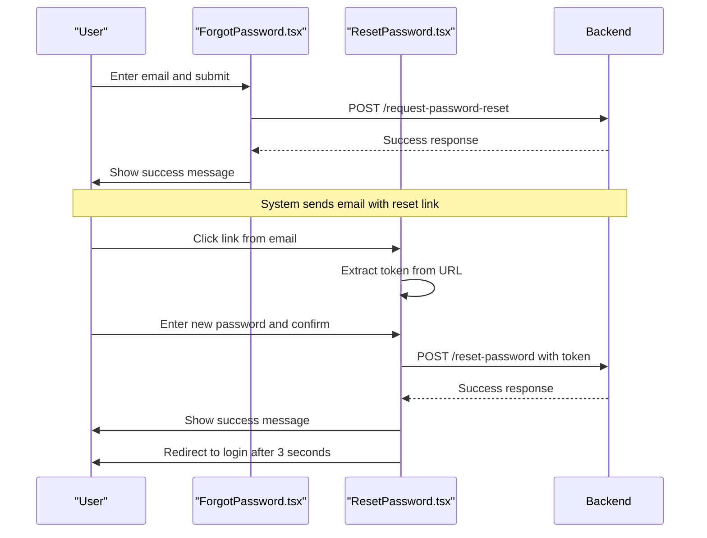
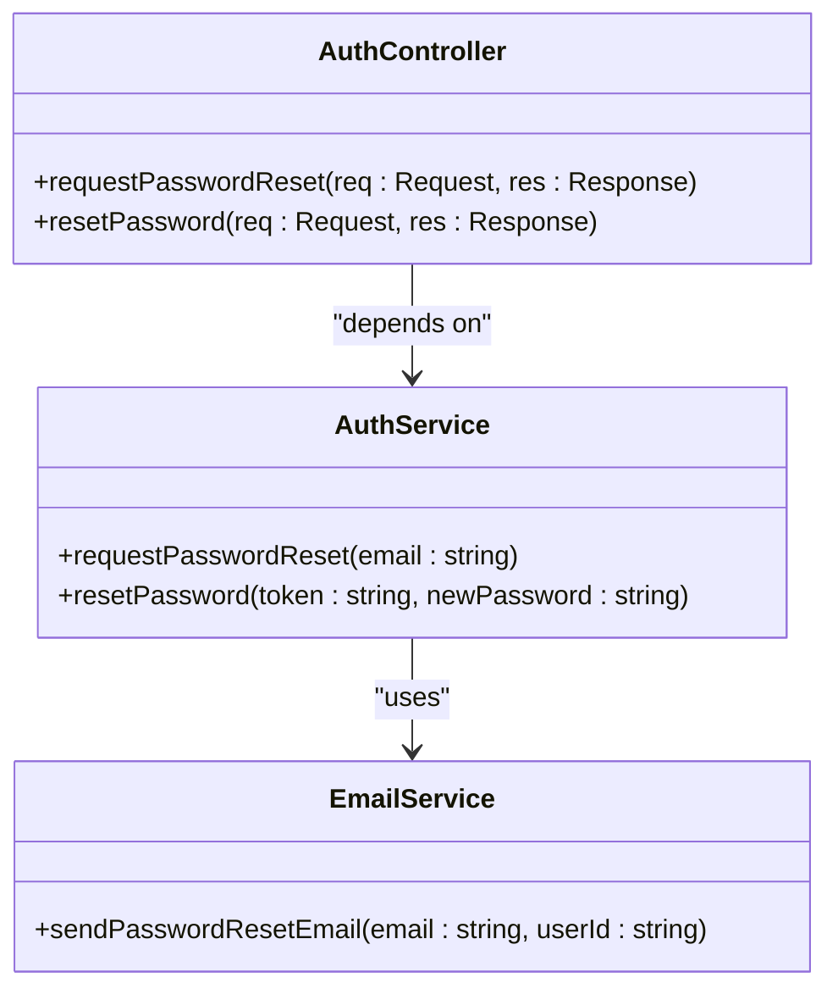
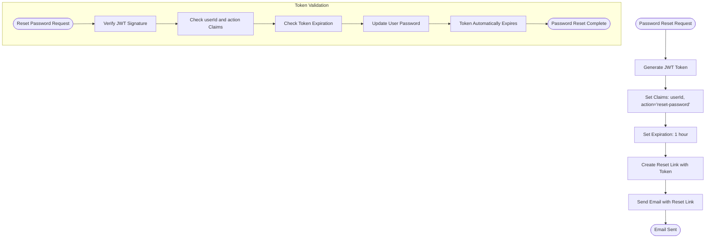

<cite>
**Referenced Files in This Document**   
- [ForgotPassword.tsx](file://pikzels-clone/client/src/components/auth/ForgotPassword.tsx)
- [ResetPassword.tsx](file://pikzels-clone/client/src/components/auth/ResetPassword.tsx)
- [auth.service.ts](file://pikzels-clone/src/modules/auth/auth.service.ts)
- [email.service.ts](file://pikzels-clone/src/modules/auth/email.service.ts)
- [auth.controller.ts](file://pikzels-clone/src/modules/auth/auth.controller.ts)
- [auth.routes.ts](file://pikzels-clone/src/modules/auth/auth.routes.ts)
</cite>

# Password Recovery & Reset

## Table of Contents
1. [Introduction](#introduction)
2. [Frontend Implementation](#frontend-implementation)
3. [Backend Service Architecture](#backend-service-architecture)
4. [Token Generation and Validation](#token-generation-and-validation)
5. [API Contracts and Error Handling](#api-contracts-and-error-handling)
6. [Security Measures](#security-measures)
7. [Common Issues and Troubleshooting](#common-issues-and-troubleshooting)
8. [UX Best Practices](#ux-best-practices)

## Introduction

The Password Recovery and Reset system enables users to regain access to their accounts when they forget their passwords. This document details the complete flow from password reset request to successful password update, covering both frontend and backend implementations. The system uses secure token-based authentication with expiration and one-time usage semantics to ensure account security during the recovery process.

**Section sources**
- [ForgotPassword.tsx](file://pikzels-clone/client/src/components/auth/ForgotPassword.tsx#L3-L104)
- [ResetPassword.tsx](file://pikzels-clone/client/src/components/auth/ResetPassword.tsx#L3-L165)

## Frontend Implementation

### Forgot Password Component

The `ForgotPassword` component provides a form for users to enter their email address to initiate the password recovery process. It handles form submission, displays loading states, and shows success or error messages based on the API response.

Key features:
- Email input validation
- Loading state during API request
- Success message upon successful request submission
- Error handling for network issues and API failures
- Navigation back to login page

The component makes a POST request to `/api/auth/request-password-reset` with the user's email address and processes the response accordingly.

### Reset Password Component

The `ResetPassword` component handles the password reset functionality after the user clicks the link in their email. It extracts the reset token from the URL query parameters and provides a form for entering and confirming the new password.

Key features:
- Token extraction from URL parameters
- New password and confirmation validation (minimum 6 characters, match requirement)
- Real-time error feedback
- Automatic redirection to login page after successful reset
- Handling of missing or invalid tokens

The component makes a POST request to `/api/auth/reset-password` with the token and new password, then processes the response to provide appropriate user feedback.

**Diagram sources**
- [ForgotPassword.tsx](file://pikzels-clone/client/src/components/auth/ForgotPassword.tsx#L3-L104)
- [ResetPassword.tsx](file://pikzels-clone/client/src/components/auth/ResetPassword.tsx#L3-L165)

**Section sources**
- [ForgotPassword.tsx](file://pikzels-clone/client/src/components/auth/ForgotPassword.tsx#L3-L104)
- [ResetPassword.tsx](file://pikzels-clone/client/src/components/auth/ResetPassword.tsx#L3-L165)

## Backend Service Architecture

The password recovery system is implemented across multiple backend components that work together to provide a secure and reliable recovery flow.

### Service Layer

The `AuthService` class contains the core business logic for password recovery operations. It coordinates between user data storage and email services to implement the recovery workflow.

### Controller Layer

The `AuthController` exposes REST endpoints for password recovery operations, handling HTTP request parsing, validation, and response formatting.

### Routing Configuration

The `auth.routes.ts` file defines the API endpoints that connect HTTP requests to controller methods, establishing the public interface for the password recovery system.

**Diagram sources**
- [auth.service.ts](file://pikzels-clone/src/modules/auth/auth.service.ts#L81-L134)
- [auth.controller.ts](file://pikzels-clone/src/modules/auth/auth.controller.ts#L80-L122)
- [email.service.ts](file://pikzels-clone/src/modules/auth/email.service.ts#L5-L47)

**Section sources**
- [auth.service.ts](file://pikzels-clone/src/modules/auth/auth.service.ts#L81-L134)
- [auth.controller.ts](file://pikzels-clone/src/modules/auth/auth.controller.ts#L80-L122)
- [auth.routes.ts](file://pikzels-clone/src/modules/auth/auth.routes.ts#L1-L16)

## Token Generation and Validation

### Token Generation

When a user requests a password reset, the system generates a JWT token containing:
- User ID (`userId`)
- Action type (`action: 'reset-password'`)
- Expiration time (1 hour)

The token is generated using the application's JWT secret and includes the `action` claim to ensure it can only be used for password reset operations.

### Token Validation

During password reset, the system validates tokens by:
1. Verifying the JWT signature using the application secret
2. Checking that the token contains a valid `userId` and `action` claim
3. Ensuring the token has not expired
4. Confirming the action is specifically for password reset

Tokens are designed to be one-time use through their limited 1-hour expiration period, after which they become invalid and cannot be used to reset passwords.

**Diagram sources**
- [email.service.ts](file://pikzels-clone/src/modules/auth/email.service.ts#L5-L47)
- [auth.service.ts](file://pikzels-clone/src/modules/auth/auth.service.ts#L109-L134)

**Section sources**
- [email.service.ts](file://pikzels-clone/src/modules/auth/email.service.ts#L5-L47)
- [auth.service.ts](file://pikzels-clone/src/modules/auth/auth.service.ts#L109-L134)

## API Contracts and Error Handling

### API Endpoints

| Endpoint | Method | Request Body | Success Response | Error Responses |
|---------|--------|--------------|------------------|-----------------|
| `/api/auth/request-password-reset` | POST | `{ "email": "user@example.com" }` | `200 OK: { "message": "If your email is registered, you will receive a password reset link." }` | `400 Bad Request: { "error": "Email is required" }` `500 Internal Server Error: { "error": "Internal server error" }` |
| `/api/auth/reset-password` | POST | `{ "token": "jwt-token", "newPassword": "newpass123" }` | `200 OK: { "message": "Password successfully reset" }` | `400 Bad Request: { "error": "Token and new password are required" }` `400 Bad Request: { "error": "Invalid or expired password reset token" }` `400 Bad Request: { "error": "Password must be at least 6 characters long" }` `500 Internal Server Error: { "error": "Internal server error" }` |

### Error Handling Strategy

The system implements comprehensive error handling to provide meaningful feedback while maintaining security:

- **Email validation**: Ensures email is provided in the request
- **Token validation**: Checks for missing, invalid, or expired tokens
- **Password validation**: Enforces minimum length requirement (6 characters)
- **Security considerations**: Does not reveal whether an email exists in the system to prevent enumeration attacks
- **Graceful degradation**: Provides clear error messages to users while logging detailed information for debugging

**Section sources**
- [auth.controller.ts](file://pikzels-clone/src/modules/auth/auth.controller.ts#L80-L122)
- [auth.service.ts](file://pikzels-clone/src/modules/auth/auth.service.ts#L81-L134)

## Security Measures

The password recovery system implements multiple security measures to protect user accounts:

### One-Time Token Usage
Tokens are designed to be effectively one-time use through their 1-hour expiration period. Once expired, they cannot be used to reset passwords, preventing replay attacks.

### Token Specificity
Tokens include an `action` claim that restricts their use to password reset operations only, preventing their misuse for other authentication purposes.

### Secure Token Generation
Tokens are generated using industry-standard JWT with HMAC signing, ensuring they cannot be tampered with or forged.

### Input Validation
All inputs are validated on the server side to prevent injection attacks and ensure data integrity.

### Error Message Security
Error messages are designed to not reveal whether an email address exists in the system, preventing user enumeration attacks.

### Password Security
New passwords are hashed using bcrypt with a cost factor of 10 before storage, ensuring they are never stored in plain text.

**Section sources**
- [auth.service.ts](file://pikzels-clone/src/modules/auth/auth.service.ts#L81-L134)
- [email.service.ts](file://pikzels-clone/src/modules/auth/email.service.ts#L5-L47)

## Common Issues and Troubleshooting

### Email Delivery Failures
In the current implementation, email delivery is simulated through console logging. In production, this would be replaced with a real email service integration. Common issues include:
- Invalid email addresses
- Spam filters blocking reset emails
- Email service provider limitations

### Token Expiration
Users may encounter expired tokens if they do not complete the reset process within 1 hour. The system should provide clear messaging and allow users to request a new reset link.

### Invalid Tokens
Tokens may be invalid due to:
- Manual URL modification
- Using a token that has already been used
- Network issues during token generation

### Password Validation Errors
Users may encounter password validation errors if they:
- Enter passwords shorter than 6 characters
- Provide mismatched password and confirmation

The system provides immediate feedback for these issues to guide users toward successful password reset.

**Section sources**
- [ResetPassword.tsx](file://pikzels-clone/client/src/components/auth/ResetPassword.tsx#L3-L165)
- [auth.controller.ts](file://pikzels-clone/src/modules/auth/auth.controller.ts#L100-L122)

## UX Best Practices

The password recovery flow implements several user experience best practices:

### Clear Instructions
Both the email and the reset page provide clear instructions on how to complete the password reset process.

### Progressive Disclosure
The flow is broken into two clear steps: requesting a reset link and resetting the password, reducing cognitive load.

### Immediate Feedback
Users receive immediate visual feedback for form submissions, loading states, and success/error conditions.

### Accessibility
The interface includes proper labels, focus management, and semantic HTML to ensure accessibility for all users.

### Mobile Responsiveness
The components are designed to work well on both desktop and mobile devices with responsive layouts.

### Error Recovery
Users can easily navigate back to the login page or request a new reset link if they encounter issues.

### Confirmation and Redirection
After successful password reset, users receive confirmation and are automatically redirected to the login page, providing a seamless transition to the next step.

**Section sources**
- [ForgotPassword.tsx](file://pikzels-clone/client/src/components/auth/ForgotPassword.tsx#L3-L104)
- [ResetPassword.tsx](file://pikzels-clone/client/src/components/auth/ResetPassword.tsx#L3-L165)