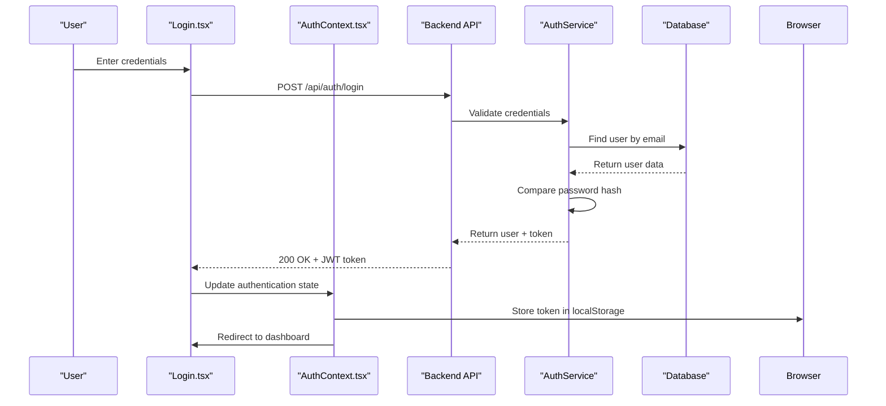
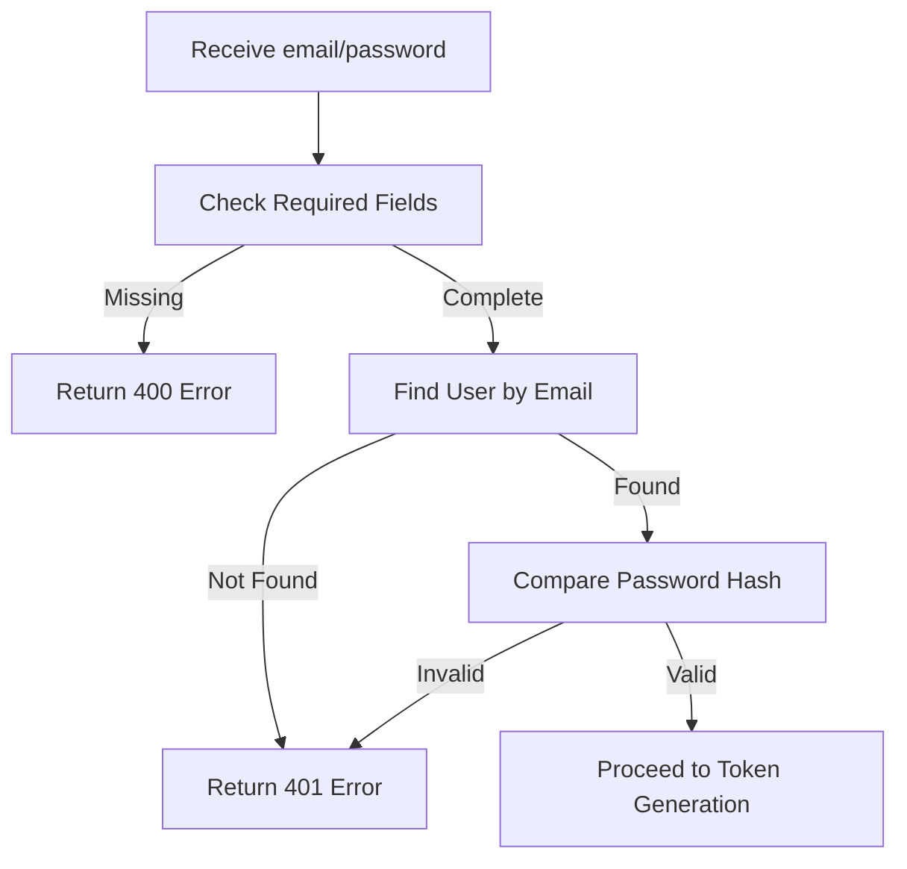
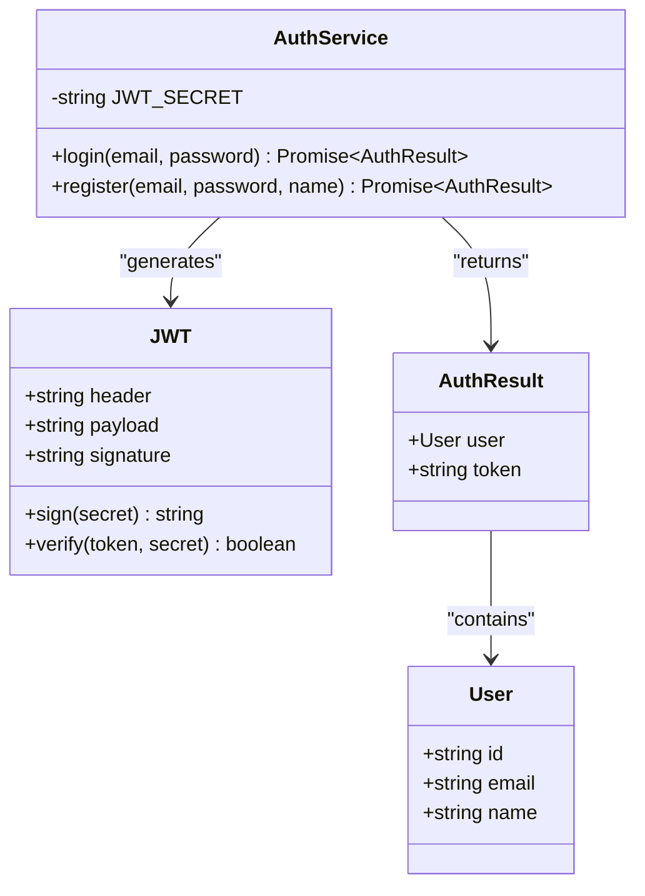
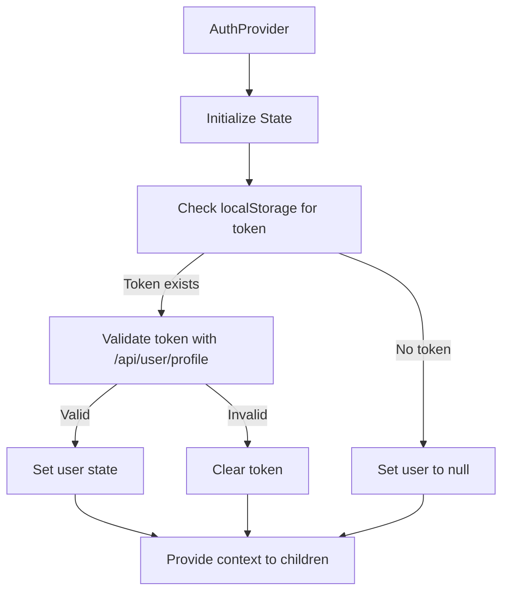
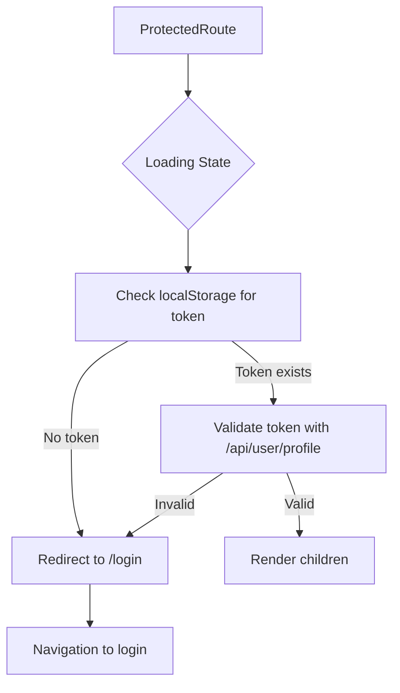
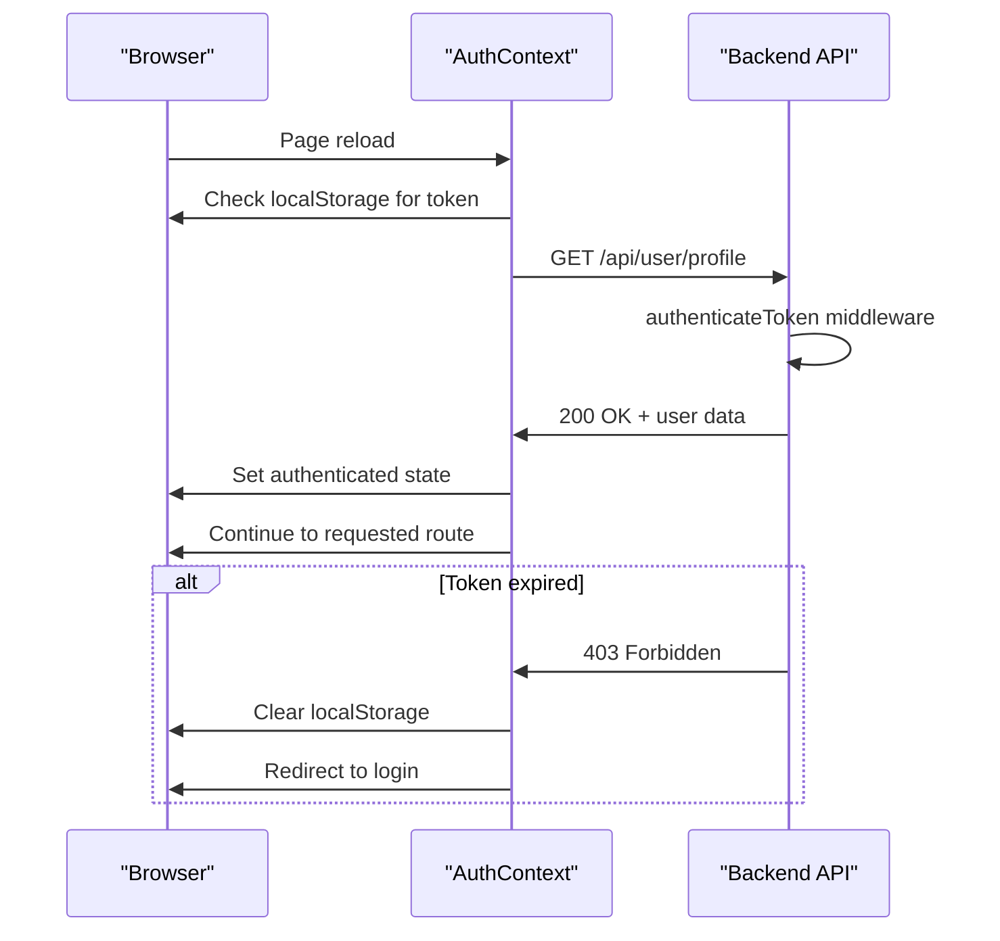
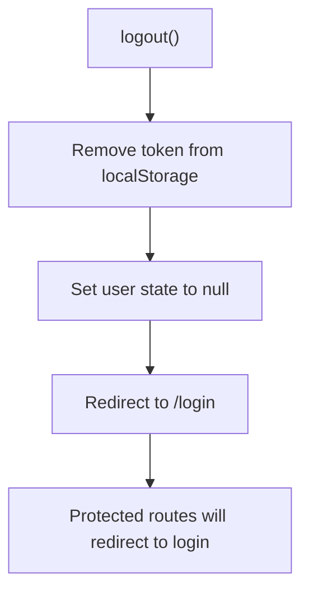

# User Login & Session Management

<cite>
**Referenced Files in This Document**  
- [Login.tsx](file://pikzels-clone/client/src/components/auth/Login.tsx)
- [AuthContext.tsx](file://pikzels-clone/client/src/contexts/AuthContext.tsx)
- [auth.service.ts](file://pikzels-clone/src/modules/auth/auth.service.ts)
- [auth.controller.ts](file://pikzels-clone/src/modules/auth/auth.controller.ts)
- [auth.middleware.ts](file://pikzels-clone/src/middleware/auth.middleware.ts)
- [profile.controller.ts](file://pikzels-clone/src/modules/auth/profile.controller.ts)
- [Register.tsx](file://pikzels-clone/client/src/components/auth/Register.tsx)
- [ProtectedRoute.tsx](file://pikzels-clone/client/src/components/ProtectedRoute.tsx)
</cite>

## Table of Contents
1. [Introduction](#introduction)
2. [Authentication Flow Overview](#authentication-flow-overview)
3. [Login Endpoint Implementation](#login-endpoint-implementation)
4. [Credential Validation Process](#credential-validation-process)
5. [JWT Token Issuance and Expiration](#jwt-token-issuance-and-expiration)
6. [Frontend Session Management with AuthContext](#frontend-session-management-with-authcontext)
7. [Protected Route Enforcement](#protected-route-enforcement)
8. [Session Persistence and Token Refresh](#session-persistence-and-token-refresh)
9. [Logout Behavior](#logout-behavior)
10. [Security Considerations](#security-considerations)

## Introduction

This document details the user login and session management system implemented in the Thumbnail Maker application. The authentication system follows a modern token-based approach using JWT (JSON Web Tokens) for stateless authentication, with React Context for frontend state management. The system handles user login, session persistence, protected route access, and secure token storage across application reloads.

The implementation spans both frontend and backend components, with clear separation of concerns between authentication logic, session state management, and route protection mechanisms. The system is designed to provide a seamless user experience while maintaining robust security practices.

## Authentication Flow Overview

The user authentication flow in the Thumbnail Maker application follows a standard token-based authentication pattern with React frontend and Express backend integration. The process begins with user credential submission through the login interface and concludes with authenticated access to protected resources.



**Diagram sources**
- [Login.tsx](file://pikzels-clone/client/src/components/auth/Login.tsx#L3-L126)
- [AuthContext.tsx](file://pikzels-clone/client/src/contexts/AuthContext.tsx#L31-L145)
- [auth.service.ts](file://pikzels-clone/src/modules/auth/auth.service.ts#L1-L136)
- [auth.controller.ts](file://pikzels-clone/src/modules/auth/auth.controller.ts#L1-L122)

**Section sources**
- [Login.tsx](file://pikzels-clone/client/src/components/auth/Login.tsx#L3-L126)
- [AuthContext.tsx](file://pikzels-clone/client/src/contexts/AuthContext.tsx#L31-L145)

## Login Endpoint Implementation

The login endpoint is implemented as a RESTful API endpoint that accepts user credentials and returns authentication tokens upon successful validation. The endpoint follows proper HTTP status code conventions and provides meaningful error responses for various failure scenarios.

```mermaid
flowchart TD
A["POST /api/auth/login"] --> B{Validate Request}
B --> |Missing fields| C[400 Bad Request]
B --> |Valid| D[Call AuthService.login()]
D --> E{User Exists?}
E --> |No| F[401 Unauthorized]
E --> |Yes| G{Password Valid?}
G --> |No| F
G --> |Yes| H[Generate JWT Token]
H --> I[Return 200 OK + Token]
```

The implementation includes comprehensive error handling for different scenarios:
- 400 Bad Request: When required fields (email, password) are missing
- 401 Unauthorized: When credentials are invalid
- 500 Internal Server Error: For unexpected server-side issues

**Diagram sources**
- [auth.controller.ts](file://pikzels-clone/src/modules/auth/auth.controller.ts#L45-L78)
- [auth.service.ts](file://pikzels-clone/src/modules/auth/auth.service.ts#L35-L65)

**Section sources**
- [auth.controller.ts](file://pikzels-clone/src/modules/auth/auth.controller.ts#L45-L78)
- [auth.service.ts](file://pikzels-clone/src/modules/auth/auth.service.ts#L35-L65)

## Credential Validation Process

The credential validation process involves multiple security checks to ensure only authorized users can access the system. The backend service implements a two-step verification process that combines database lookup with cryptographic password comparison.



The validation process is implemented in the `AuthService` class, which first verifies that both email and password are provided in the request. It then queries the database to find the user by their email address. If the user exists, the service uses bcrypt to compare the provided password with the stored hash. This approach ensures that plaintext passwords are never stored or compared directly.

**Diagram sources**
- [auth.service.ts](file://pikzels-clone/src/modules/auth/auth.service.ts#L35-L65)
- [auth.middleware.ts](file://pikzels-clone/src/middleware/auth.middleware.ts#L1-L54)

**Section sources**
- [auth.service.ts](file://pikzels-clone/src/modules/auth/auth.service.ts#L35-L65)

## JWT Token Issuance and Expiration

The authentication system uses JSON Web Tokens (JWT) for stateless session management, with tokens issued upon successful login and configured to expire after 7 days. The token generation process includes user identification and proper signing to prevent tampering.



The JWT token contains a payload with the user ID and is signed using a secret key stored in environment variables. The token is configured to expire after 7 days (`expiresIn: '7d'`), providing a balance between user convenience and security. The token is returned to the client in the login response and must be included in the Authorization header for subsequent requests to protected endpoints.

**Diagram sources**
- [auth.service.ts](file://pikzels-clone/src/modules/auth/auth.service.ts#L58-L63)
- [auth.middleware.ts](file://pikzels-clone/src/middleware/auth.middleware.ts#L20-L25)

**Section sources**
- [auth.service.ts](file://pikzels-clone/src/modules/auth/auth.service.ts#L58-L63)

## Frontend Session Management with AuthContext

The frontend implements session management using React Context (AuthContext), which provides a centralized state management solution for authentication status across the application. The context handles token storage, user state synchronization, and authentication operations.



The AuthContext implementation includes several key features:
- Automatic session restoration on page reload by checking localStorage
- Token validation through a profile request to ensure the token is still valid
- State synchronization between authentication status and UI components
- Centralized login, logout, and registration methods accessible throughout the application

Components consume the authentication state through the `useAuth` hook, which provides access to the current user, authentication status, and authentication methods.

**Diagram sources**
- [AuthContext.tsx](file://pikzels-clone/client/src/contexts/AuthContext.tsx#L31-L145)
- [Login.tsx](file://pikzels-clone/client/src/components/auth/Login.tsx#L3-L126)

**Section sources**
- [AuthContext.tsx](file://pikzels-clone/client/src/contexts/AuthContext.tsx#L31-L145)

## Protected Route Enforcement

The application enforces access control to protected routes using a dedicated ProtectedRoute component that checks authentication status before rendering child components. This ensures that only authenticated users can access sensitive areas of the application.



The ProtectedRoute component implements a three-state process:
1. Loading state while checking authentication status
2. Authentication validation by making a request to the profile endpoint
3. Conditional rendering based on authentication status

This approach provides a seamless user experience by automatically redirecting unauthenticated users to the login page while allowing authenticated users uninterrupted access to protected content. The component also handles edge cases such as expired or invalid tokens by clearing the local storage and redirecting to the login page.

**Diagram sources**
- [ProtectedRoute.tsx](file://pikzels-clone/client/src/components/ProtectedRoute.tsx#L1-L71)
- [auth.middleware.ts](file://pikzels-clone/src/middleware/auth.middleware.ts#L1-L54)

**Section sources**
- [ProtectedRoute.tsx](file://pikzels-clone/client/src/components/ProtectedRoute.tsx#L1-L71)

## Session Persistence and Token Refresh

The system implements session persistence across browser reloads by storing the JWT token in localStorage, allowing users to remain authenticated during their 7-day session window. The token refresh strategy relies on the automatic revalidation process performed by the AuthContext on application initialization.



When a user reloads the application, the AuthContext automatically checks for an existing token in localStorage. If a token is found, it makes a request to the profile endpoint to validate the token's authenticity and retrieve user information. The backend's authenticateToken middleware verifies the JWT signature and expiration, ensuring that only valid tokens grant access.

This approach provides transparent session persistence without requiring explicit token refresh endpoints, leveraging the existing authentication infrastructure for session validation.

**Diagram sources**
- [AuthContext.tsx](file://pikzels-clone/client/src/contexts/AuthContext.tsx#L50-L65)
- [auth.middleware.ts](file://pikzels-clone/src/middleware/auth.middleware.ts#L1-L54)
- [profile.controller.ts](file://pikzels-clone/src/modules/auth/profile.controller.ts#L1-L107)

**Section sources**
- [AuthContext.tsx](file://pikzels-clone/client/src/contexts/AuthContext.tsx#L50-L65)

## Logout Behavior

The logout functionality provides a clean mechanism for users to terminate their sessions, removing authentication tokens from the client and redirecting to the login page. The implementation ensures complete session cleanup and prevents unauthorized access after logout.



The logout process is implemented as a method within the AuthContext provider, making it accessible throughout the application. When invoked, it performs three critical actions:
1. Removes the JWT token from localStorage to eliminate the authentication credential
2. Updates the React context state to reflect the unauthenticated status
3. Navigates the user to the login page using the router

This comprehensive approach ensures that the logout action is reflected both in persistent storage and application state, preventing access to protected routes and providing immediate visual feedback to the user.

**Section sources**
- [AuthContext.tsx](file://pikzels-clone/client/src/contexts/AuthContext.tsx#L125-L130)

## Security Considerations

The authentication system incorporates multiple security measures to protect user accounts and prevent common attack vectors. These measures span both frontend and backend implementations to create a comprehensive security posture.

### HTTPS Enforcement
While not explicitly shown in the code, the application should be deployed behind HTTPS to encrypt all authentication traffic, preventing man-in-the-middle attacks and credential interception.

### Token Theft Mitigation
The system uses several strategies to mitigate token theft risks:
- JWT tokens are signed with a secret key to prevent tampering
- Tokens have a limited 7-day expiration window
- No sensitive information is stored in the token payload
- Tokens are transmitted in the Authorization header rather than cookies

### Brute Force Attack Protection
The current implementation provides basic protection against brute force attacks through:
- Generic error messages that don't distinguish between invalid email and password
- Server-side validation that prevents excessive login attempts (though rate limiting implementation is not visible in the provided code)

### Additional Security Features
- Passwords are hashed using bcrypt with a cost factor of 10
- Input validation on both frontend and backend to prevent injection attacks
- Proper HTTP status codes that don't leak system information
- Secure token storage in localStorage with consideration for XSS risks

**Section sources**
- [auth.service.ts](file://pikzels-clone/src/modules/auth/auth.service.ts#L40-L41)
- [auth.middleware.ts](file://pikzels-clone/src/middleware/auth.middleware.ts#L20-L25)
- [Login.tsx](file://pikzels-clone/client/src/components/auth/Login.tsx#L3-L126)