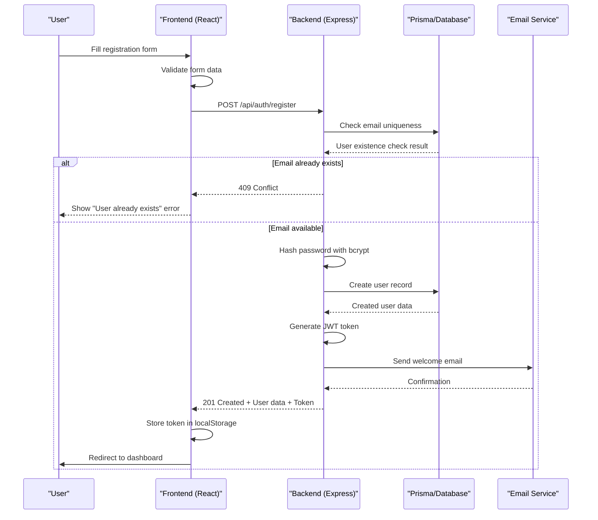
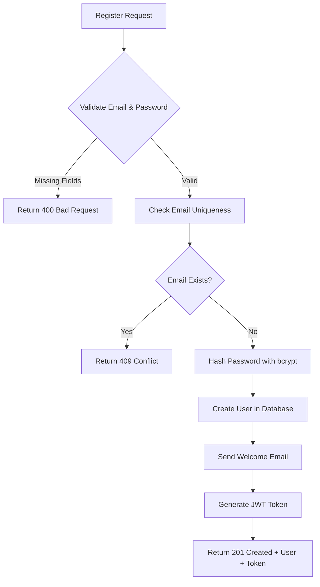
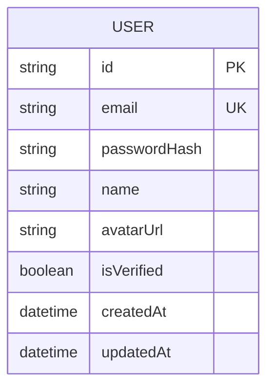

# User Registration

<cite>
**Referenced Files in This Document**   
- [auth.service.ts](file://pikzels-clone\shared\auth.service.ts)
- [Register.tsx](file://pikzels-clone\client\src\components\auth\Register.tsx)
- [auth.service.ts](file://pikzels-clone\src\modules\auth\auth.service.ts)
- [auth.controller.ts](file://pikzels-clone\src\modules\auth\auth.controller.ts)
- [auth.routes.ts](file://pikzels-clone\src\modules\auth\auth.routes.ts)
- [email.service.ts](file://pikzels-clone\src\modules\auth\email.service.ts)
- [AuthContext.tsx](file://pikzels-clone\client\src\contexts\AuthContext.tsx)
- [migration.sql](file://pikzels-clone\prisma\migrations\20250829072650_init\migration.sql)
</cite>

## Table of Contents
1. [Introduction](#introduction)
2. [Registration Flow Overview](#registration-flow-overview)
3. [Frontend Implementation](#frontend-implementation)
4. [Backend Implementation](#backend-implementation)
5. [Data Persistence with Prisma](#data-persistence-with-prisma)
6. [Email Integration](#email-integration)
7. [Security Considerations](#security-considerations)
8. [Error Handling](#error-handling)
9. [State Management](#state-management)
10. [HTTP Request/Response Cycle](#http-requestresponse-cycle)
11. [Troubleshooting Guide](#troubleshooting-guide)

## Introduction

The User Registration sub-feature enables new users to create accounts in the Pikzels application. This document details the end-to-end implementation of the registration process, covering both frontend and backend components. The system implements secure authentication practices including email uniqueness validation, password hashing with bcryptjs, and JWT token generation for session management. The registration flow integrates with Prisma for database persistence and includes email service integration for user verification and welcome messages.

## Registration Flow Overview

The user registration process follows a structured flow from form submission to account creation and authentication. When a user submits the registration form, the frontend validates input data and sends a POST request to the backend authentication endpoint. The backend verifies email uniqueness, securely hashes the password, creates a user record in the database, generates a JWT token, and sends a welcome email. Upon successful registration, the frontend stores the authentication token and redirects the user to the dashboard.

**Diagram sources**
- [Register.tsx](file://pikzels-clone\client\src\components\auth\Register.tsx#L45-L85)
- [auth.controller.ts](file://pikzels-clone\src\modules\auth\auth.controller.ts#L6-L30)
- [auth.service.ts](file://pikzels-clone\src\modules\auth\auth.service.ts#L9-L47)

## Frontend Implementation

The frontend registration component is implemented as a React functional component in Register.tsx. It manages form state including name, email, password, and confirmation password fields. The component includes client-side validation to ensure password fields match before submission. Upon form submission, it makes a fetch request to the backend registration endpoint and handles the response appropriately, displaying errors or redirecting to the dashboard upon success.

**Section sources**
- [Register.tsx](file://pikzels-clone\client\src\components\auth\Register.tsx#L1-L160)

## Backend Implementation

The backend registration logic is implemented in the AuthService class within auth.service.ts. The register method first checks for email uniqueness using Prisma's findUnique query. If the email is available, it hashes the password using bcrypt with a salt round of 10, creates a new user record, sends a welcome email, and generates a JWT token with a 7-day expiration. The AuthController handles the HTTP request, validates required fields, and returns appropriate status codes and responses.

**Diagram sources**
- [auth.service.ts](file://pikzels-clone\src\modules\auth\auth.service.ts#L9-L47)
- [auth.controller.ts](file://pikzels-clone\src\modules\auth\auth.controller.ts#L6-L30)

**Section sources**
- [auth.service.ts](file://pikzels-clone\src\modules\auth\auth.service.ts#L1-L136)
- [auth.controller.ts](file://pikzels-clone\src\modules\auth\auth.controller.ts#L1-L122)

## Data Persistence with Prisma

User data is persisted in the database using Prisma ORM. The User model includes fields for id, email, passwordHash, name, avatarUrl, isVerified, createdAt, and updatedAt. The email field has a unique constraint to prevent duplicate registrations. The Prisma migration file defines the User table schema and creates a unique index on the email column to enforce this constraint at the database level.

**Diagram sources**
- [migration.sql](file://pikzels-clone\prisma\migrations\20250829072650_init\migration.sql#L1-L10)

**Section sources**
- [migration.sql](file://pikzels-clone\prisma\migrations\20250829072650_init\migration.sql#L1-L52)

## Email Integration

The registration process integrates with an email service to send welcome messages to new users. The EmailService class provides a static method sendWelcomeEmail that would integrate with a third-party email provider in production. Currently, the implementation logs email content to the console for development purposes. The service is called from the AuthService after a user is successfully created in the database.

**Section sources**
- [email.service.ts](file://pikzels-clone\src\modules\auth\email.service.ts#L25-L45)

## Security Considerations

The registration implementation includes several security measures. Passwords are hashed using bcryptjs with a salt round of 10, ensuring that plain text passwords are never stored in the database. JWT tokens are used for authentication, with a 7-day expiration period. The system validates required fields on both client and server sides to prevent incomplete data submission. While rate limiting is not currently implemented, the codebase contains references to throttling concepts that could be leveraged to prevent brute force attacks.

**Section sources**
- [auth.service.ts](file://pikzels-clone\src\modules\auth\auth.service.ts#L20-L25)
- [auth.controller.ts](file://pikzels-clone\src\modules\auth\auth.controller.ts#L10-L15)

## Error Handling

The registration flow implements comprehensive error handling for various failure scenarios. The backend returns specific HTTP status codes: 400 for missing required fields, 409 for duplicate email addresses, and 500 for internal server errors. The frontend captures these responses and displays user-friendly error messages. Network errors are handled gracefully with a generic message to avoid exposing system details to users.

**Section sources**
- [auth.controller.ts](file://pikzels-clone\src\modules\auth\auth.controller.ts#L20-L30)
- [Register.tsx](file://pikzels-clone\client\src\components\auth\Register.tsx#L60-L75)

## State Management

Authentication state is managed using React Context through the AuthContext. The AuthProvider component checks for an existing authentication token on initialization and fetches the user profile if present. The context provides login, logout, and register functions that update the user state and localStorage. This centralized state management ensures consistent authentication state across the application.

**Section sources**
- [AuthContext.tsx](file://pikzels-clone\client\src\contexts\AuthContext.tsx#L1-L145)

## HTTP Request/Response Cycle

The registration process follows a standard HTTP POST request/response cycle. The frontend sends a JSON payload containing email, password, and name to the /api/auth/register endpoint. The backend processes this request, performs all necessary operations, and returns a JSON response with user data and authentication token upon success. The Content-Type header is set to application/json for proper data serialization. Error responses include descriptive messages to guide user correction.

**Section sources**
- [Register.tsx](file://pikzels-clone\client\src\components\auth\Register.tsx#L45-L65)
- [auth.controller.ts](file://pikzels-clone\src\modules\auth\auth.controller.ts#L6-L30)

## Troubleshooting Guide

Common issues in the registration flow include validation failures, network connectivity problems, and database constraints. Validation errors typically occur when required fields are missing or passwords don't match. Network errors may result from server unavailability or CORS configuration issues. Database constraint violations happen when attempting to register with an already existing email address. For debugging, check browser developer tools for network request details, verify server logs for error messages, and ensure the database connection is properly configured.

**Section sources**
- [Register.tsx](file://pikzels-clone\client\src\components\auth\Register.tsx#L60-L85)
- [auth.controller.ts](file://pikzels-clone\src\modules\auth\auth.controller.ts#L20-L30)