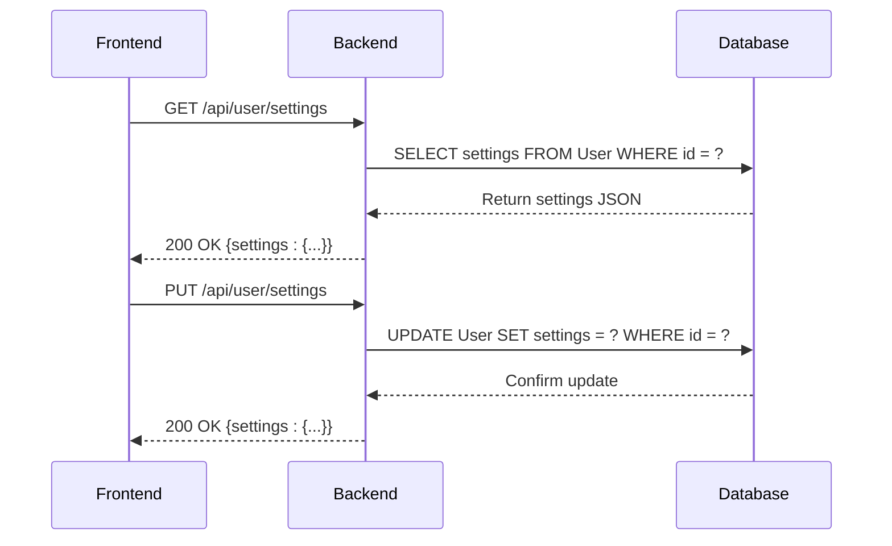
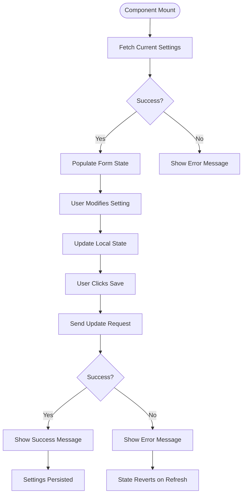
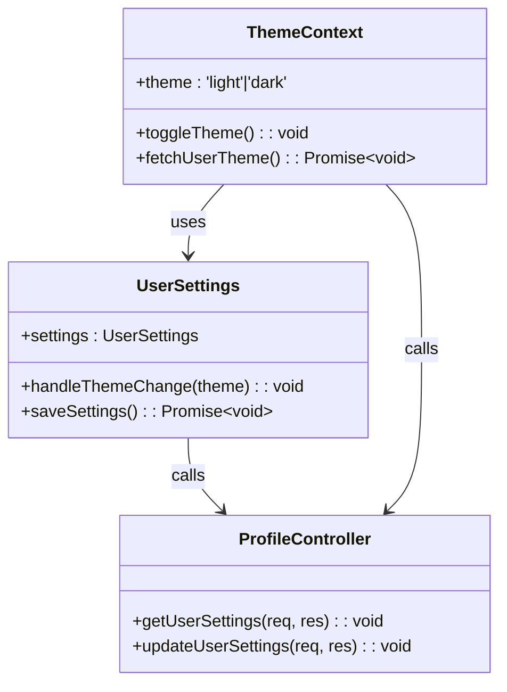

# User Settings & Preferences

<cite>
**Referenced Files in This Document**  
- [profile.controller.ts](file://pikzels-clone\src\modules\auth\profile.controller.ts)
- [UserSettings.tsx](file://pikzels-clone\client\src\components\UserSettings.tsx)
- [ThemeContext.tsx](file://pikzels-clone\client\src\contexts\ThemeContext.tsx)
- [migration.sql](file://pikzels-clone\prisma\migrations\20250909081634_add_user_settings\migration.sql)
</cite>

## Table of Contents
1. [Introduction](#introduction)
2. [Backend Implementation](#backend-implementation)
3. [Frontend Integration](#frontend-integration)
4. [State Synchronization](#state-synchronization)
5. [Data Validation and Security](#data-validation-and-security)
6. [Troubleshooting Guide](#troubleshooting-guide)
7. [Conclusion](#conclusion)

## Introduction
This document details the implementation of user settings and preferences management in the Thumbnail Maker application. The system enables users to customize their experience through theme selection, language preferences, notification settings, thumbnail defaults, and privacy controls. The architecture follows a client-server model with state synchronization between frontend and backend components, leveraging Prisma for data persistence and React Context for dynamic theming.

## Backend Implementation

The user settings functionality is implemented through the ProfileController class in the authentication module, which handles both retrieval and update operations for user profile data including settings. The backend exposes RESTful endpoints that follow standard HTTP semantics for CRUD operations on user settings.

User settings are stored as a JSONB field in the User table, allowing for flexible schema evolution without requiring database migrations for new preference types. This approach supports hierarchical settings structures while maintaining query performance.

**Diagram sources**
- [profile.controller.ts](file://pikzels-clone\src\modules\auth\profile.controller.ts#L60-L107)
- [migration.sql](file://pikzels-clone\prisma\migrations\20250909081634_add_user_settings\migration.sql#L1-L3)

**Section sources**
- [profile.controller.ts](file://pikzels-clone\src\modules\auth\profile.controller.ts#L13-L107)

## Frontend Integration

The UserSettings component provides a comprehensive interface for managing user preferences, implementing a controlled form pattern with real-time state management. The UI is organized into logical sections for appearance, language, notifications, thumbnail defaults, and privacy settings, each with appropriate input controls.

The component manages its own state for settings, providing immediate visual feedback when users modify preferences. Form inputs are bound to the settings state object, with individual handler functions for each setting type that perform shallow merging to preserve other settings values.

**Diagram sources**
- [UserSettings.tsx](file://pikzels-clone\client\src\components\UserSettings.tsx#L25-L664)

**Section sources**
- [UserSettings.tsx](file://pikzels-clone\client\src\components\UserSettings.tsx#L1-L664)

## State Synchronization

The application maintains consistency between frontend and backend states through a combination of React Context and direct API calls. The ThemeContext provides a global state management solution for theme preferences, synchronizing UI appearance across components while also persisting changes to the backend.

When users change their theme preference through the toggle control, the ThemeContext updates the local state and immediately applies the "dark" class to the document element for instant visual feedback. Simultaneously, it initiates a background request to persist the preference to the user's settings in the database.

**Diagram sources**
- [ThemeContext.tsx](file://pikzels-clone\client\src\contexts\ThemeContext.tsx#L1-L122)
- [UserSettings.tsx](file://pikzels-clone\client\src\components\UserSettings.tsx#L3-L664)
- [profile.controller.ts](file://pikzels-clone\src\modules\auth\profile.controller.ts#L60-L107)

**Section sources**
- [ThemeContext.tsx](file://pikzels-clone\client\src\contexts\ThemeContext.tsx#L1-L122)

## Data Validation and Security

The user settings system implements validation at multiple levels to ensure data integrity and security. On the frontend, the UserSettings interface defines TypeScript types for all settings, providing compile-time validation of structure and types.

The backend performs authentication checks on all settings endpoints, requiring valid JWT tokens for access. While the current implementation accepts any JSON structure for settings, this could be enhanced with schema validation to prevent malformed data storage.

Security considerations include proper authorization checks to ensure users can only modify their own settings, and the use of HTTPS for all API communications. Sensitive operations are protected by the authentication middleware, which verifies user identity before processing requests.

**Section sources**
- [profile.controller.ts](file://pikzels-clone\src\modules\auth\profile.controller.ts#L60-L107)
- [UserSettings.tsx](file://pikzels-clone\client\src\components\UserSettings.tsx#L3-L664)

## Troubleshooting Guide

Common issues with user settings typically fall into three categories: authentication problems, network errors, and state synchronization issues.

For authentication-related failures, verify that the user is properly logged in and that the authentication token is present in local storage. Network issues may occur due to connectivity problems or server downtime; check the browser's developer tools for failed API requests.

State synchronization problems can manifest when the UI does not reflect saved settings after a page refresh. This typically indicates that the settings update request failed or that the fetch request on component mount encountered an error. Check the console for error messages and verify that the API endpoints are accessible.

Caching issues may occur if the browser caches API responses. Implement cache-busting strategies such as adding timestamp parameters to requests if this becomes problematic in production environments.

**Section sources**
- [profile.controller.ts](file://pikzels-clone\src\modules\auth\profile.controller.ts#L60-L107)
- [UserSettings.tsx](file://pikzels-clone\client\src\components\UserSettings.tsx#L45-L664)
- [ThemeContext.tsx](file://pikzels-clone\client\src\contexts\ThemeContext.tsx#L25-L122)

## Conclusion

The user settings and preferences system provides a robust foundation for personalized user experiences in the Thumbnail Maker application. By combining flexible data storage with intuitive UI controls and real-time state synchronization, the implementation balances usability with technical soundness.

The architecture supports future enhancements such as settings categories, import/export functionality, and team-wide preference templates. The separation of concerns between frontend presentation and backend persistence enables independent evolution of both components while maintaining a consistent user experience.