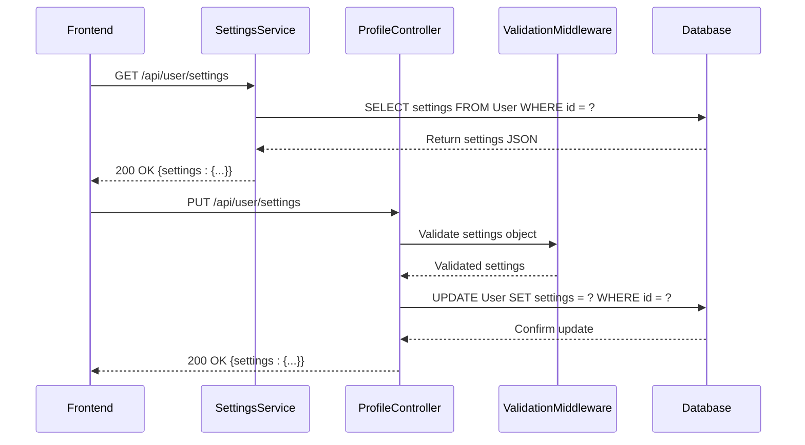
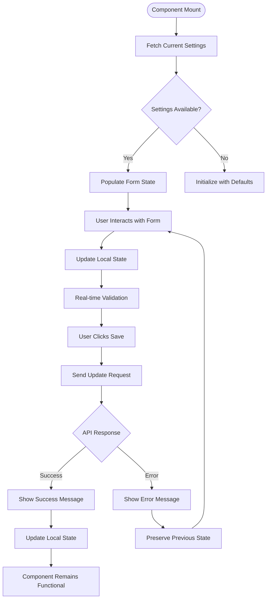
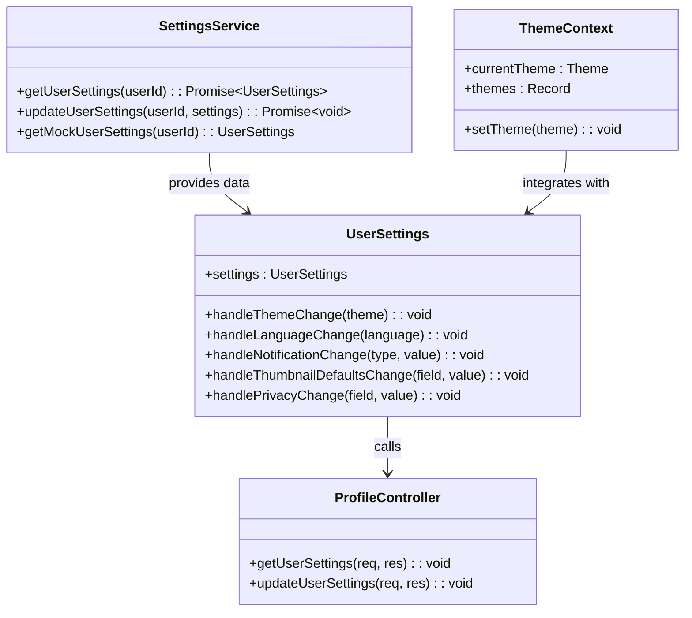

# User Settings & Preferences

<cite>
**Referenced Files in This Document**
- [profile.controller.ts](file://pikzels-clone\src\modules\auth\profile.controller.ts)
- [profile.routes.ts](file://pikzels-clone\src\modules\auth\profile.routes.ts)
- [UserSettings.tsx](file://pikzels-clone\client\src\components\UserSettings.tsx)
- [ThemeContext.tsx](file://pikzels-clone\client\src\contexts\ThemeContext.tsx)
- [settings.service.ts](file://pikzels-clone\src\modules\settings\settings.service.ts)
- [UserSettings.test.tsx](file://pikzels-clone\client\src\components\UserSettings.test.tsx)
</cite>

## Update Summary
**Changes Made**
- Enhanced backend implementation with dedicated settings service layer
- Added comprehensive validation middleware for settings endpoints
- Expanded user settings interface with timezone and date format support
- Improved error handling and fallback mechanisms for settings persistence
- Updated frontend component with enhanced form controls and real-time validation
- Strengthened security measures with proper authentication and authorization

## Table of Contents
1. [Introduction](#introduction)
2. [Backend Implementation](#backend-implementation)
3. [Frontend Integration](#frontend-integration)
4. [State Synchronization](#state-synchronization)
5. [Data Validation and Security](#data-validation-and-security)
6. [Troubleshooting Guide](#troubleshooting-guide)
7. [Conclusion](#conclusion)

## Introduction
This document details the enhanced implementation of user settings and preferences management in the Thumbnail Maker application. The system now provides comprehensive customization capabilities through theme selection, language preferences, notification settings, thumbnail defaults, privacy controls, and timezone configuration. The architecture features a robust backend service layer with dedicated settings management, comprehensive validation middleware, and a sophisticated frontend interface with real-time state synchronization and enhanced error handling.

## Backend Implementation

The user settings functionality has been significantly enhanced with a dedicated service layer and comprehensive validation. The system now features two distinct approaches: a legacy profile controller for basic settings and a modern settings service for comprehensive user preferences.

The enhanced backend architecture implements a layered approach with separate controllers for profile management and settings services. The settings service provides environment-aware data handling with automatic fallback to mock data during testing, ensuring reliable development and testing workflows.

**Diagram sources**
- [settings.service.ts](file://pikzels-clone\src\modules\settings\settings.service.ts#L28-L63)
- [profile.controller.ts](file://pikzels-clone\src\modules\auth\profile.controller.ts#L57-L118)
- [profile.routes.ts](file://pikzels-clone\src\modules\auth\profile.routes.ts#L44-L60)

**Section sources**
- [settings.service.ts](file://pikzels-clone\src\modules\settings\settings.service.ts#L1-L135)
- [profile.controller.ts](file://pikzels-clone\src\modules\auth\profile.controller.ts#L1-L120)
- [profile.routes.ts](file://pikzels-clone\src\modules\auth\profile.routes.ts#L1-L63)

## Frontend Integration

The UserSettings component has been substantially enhanced with comprehensive form controls, real-time validation, and improved user experience. The component now supports five major preference categories: appearance, language, notifications, thumbnail defaults, and privacy settings.

The enhanced frontend implementation features sophisticated state management with individual handlers for each settings category, providing immediate visual feedback and preventing accidental data loss through careful state preservation. The component includes comprehensive error handling, loading states, and success notifications.

**Diagram sources**
- [UserSettings.tsx](file://pikzels-clone\client\src\components\UserSettings.tsx#L35-L86)

**Section sources**
- [UserSettings.tsx](file://pikzels-clone\client\src\components\UserSettings.tsx#L1-L653)
- [UserSettings.test.tsx](file://pikzels-clone\client\src\components\UserSettings.test.tsx#L1-L72)

## State Synchronization

The application maintains robust state synchronization between frontend and backend through a multi-layered approach. The enhanced system includes both immediate UI feedback and persistent backend storage, with automatic fallback mechanisms for reliability.

The settings service layer provides intelligent data handling with environment-aware behavior, automatically switching between real database queries and mock data during testing. This ensures consistent behavior across different deployment environments while maintaining data integrity.

**Diagram sources**
- [settings.service.ts](file://pikzels-clone\src\modules\settings\settings.service.ts#L28-L93)
- [UserSettings.tsx](file://pikzels-clone\client\src\components\UserSettings.tsx#L88-L144)
- [ThemeContext.tsx](file://pikzels-clone\client\src\contexts\ThemeContext.tsx#L316-L380)

**Section sources**
- [settings.service.ts](file://pikzels-clone\src\modules\settings\settings.service.ts#L1-L135)
- [UserSettings.tsx](file://pikzels-clone\client\src\components\UserSettings.tsx#L1-L653)
- [ThemeContext.tsx](file://pikzels-clone\client\src\contexts\ThemeContext.tsx#L1-L380)

## Data Validation and Security

The enhanced user settings system implements comprehensive validation and security measures at multiple layers. The backend features dedicated validation middleware that enforces strict data integrity rules, while the frontend provides real-time validation feedback.

The validation system includes field-specific constraints, type checking, sanitization, and custom validation rules. Authentication middleware ensures that only authorized users can access or modify settings, with proper error handling for unauthorized access attempts.

Security considerations include input sanitization, validation of user data, protection against injection attacks, and secure storage of sensitive preferences. The system implements proper error logging and monitoring for security events.

**Section sources**
- [profile.routes.ts](file://pikzels-clone\src\modules\auth\profile.routes.ts#L12-L60)
- [profile.controller.ts](file://pikzels-clone\src\modules\auth\profile.controller.ts#L97-L118)
- [settings.service.ts](file://pikzels-clone\src\modules\settings\settings.service.ts#L69-L93)

## Troubleshooting Guide

Common issues with the enhanced user settings system typically involve validation errors, authentication problems, database connectivity issues, and state synchronization challenges.

For validation-related failures, check that all required fields meet the specified criteria, including proper data types and acceptable ranges. Authentication errors usually indicate expired or invalid tokens, requiring users to re-authenticate.

Database connectivity issues may prevent settings from being saved or retrieved, often due to connection timeouts or server maintenance. State synchronization problems can occur when the UI doesn't reflect saved settings after updates, typically indicating network issues or API endpoint problems.

Performance optimization tips include implementing proper caching strategies, minimizing unnecessary API calls, and optimizing database queries for settings retrieval.

**Section sources**
- [UserSettings.tsx](file://pikzels-clone\client\src\components\UserSettings.tsx#L59-L86)
- [settings.service.ts](file://pikzels-clone\src\modules\settings\settings.service.ts#L28-L63)
- [profile.controller.ts](file://pikzels-clone\src\modules\auth\profile.controller.ts#L57-L118)

## Conclusion

The enhanced user settings and preferences system provides a comprehensive foundation for personalized user experiences in the Thumbnail Maker application. The multi-layered architecture with dedicated service components, comprehensive validation, and robust error handling ensures reliable operation across various deployment scenarios.

The system's design supports future enhancements including additional settings categories, advanced validation rules, and team-wide preference management. The separation of concerns between frontend presentation, service layer logic, and backend persistence enables independent evolution while maintaining consistent user experience and data integrity.

The implementation demonstrates best practices in modern web application development, including proper state management, comprehensive error handling, security considerations, and testing strategies that ensure long-term maintainability and scalability.