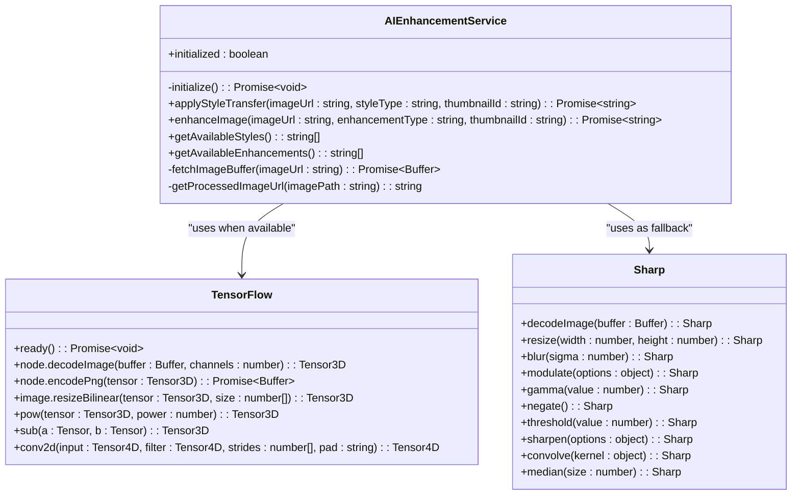
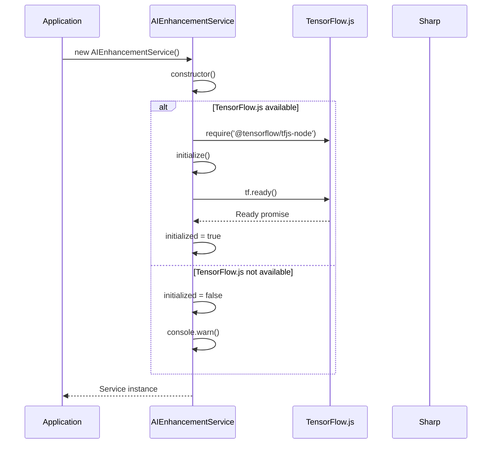
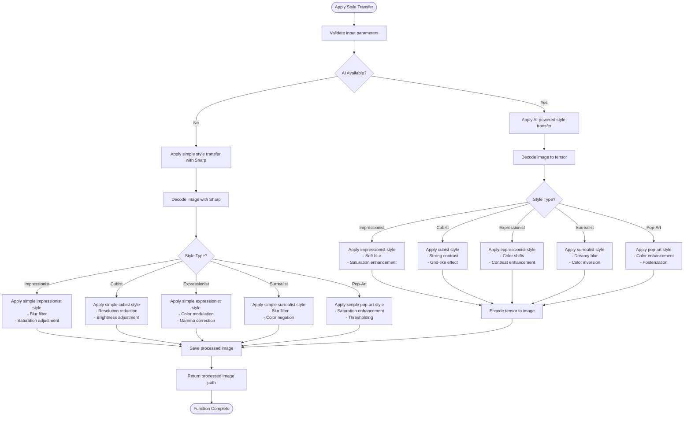
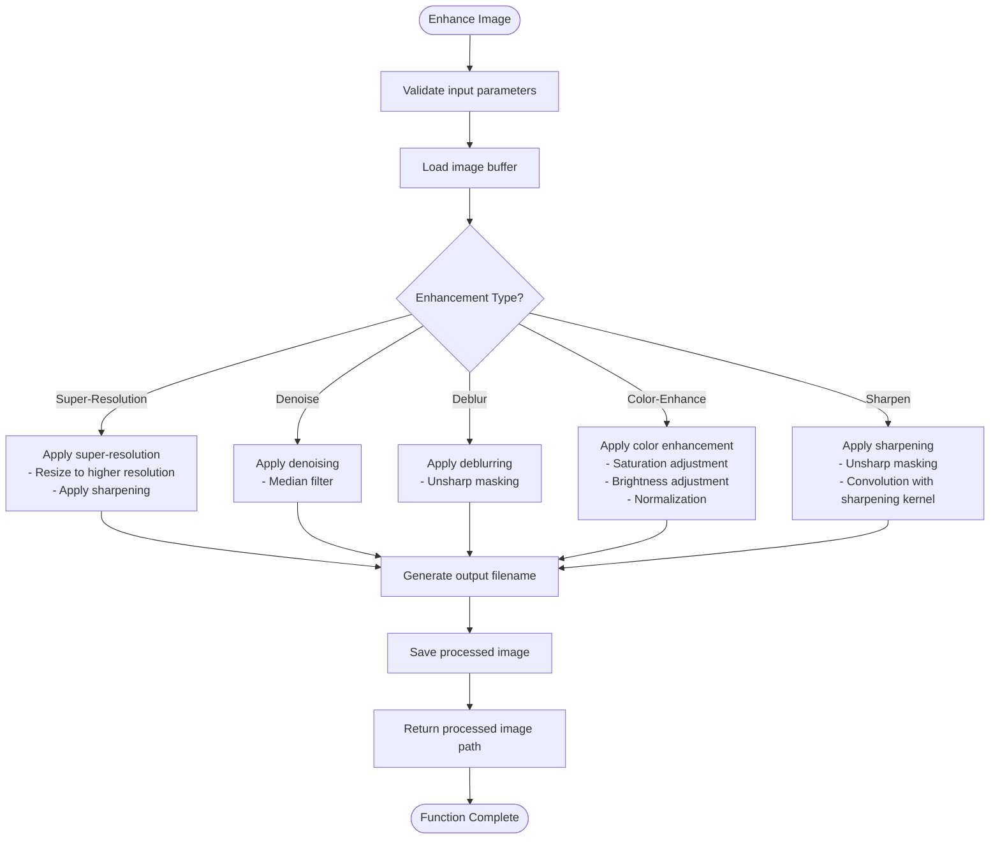
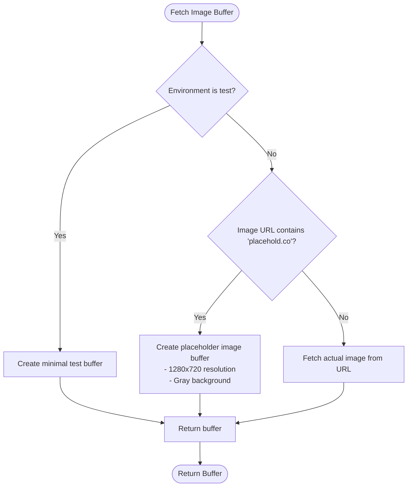
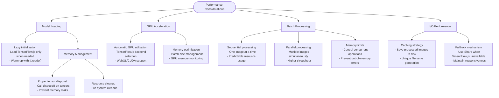
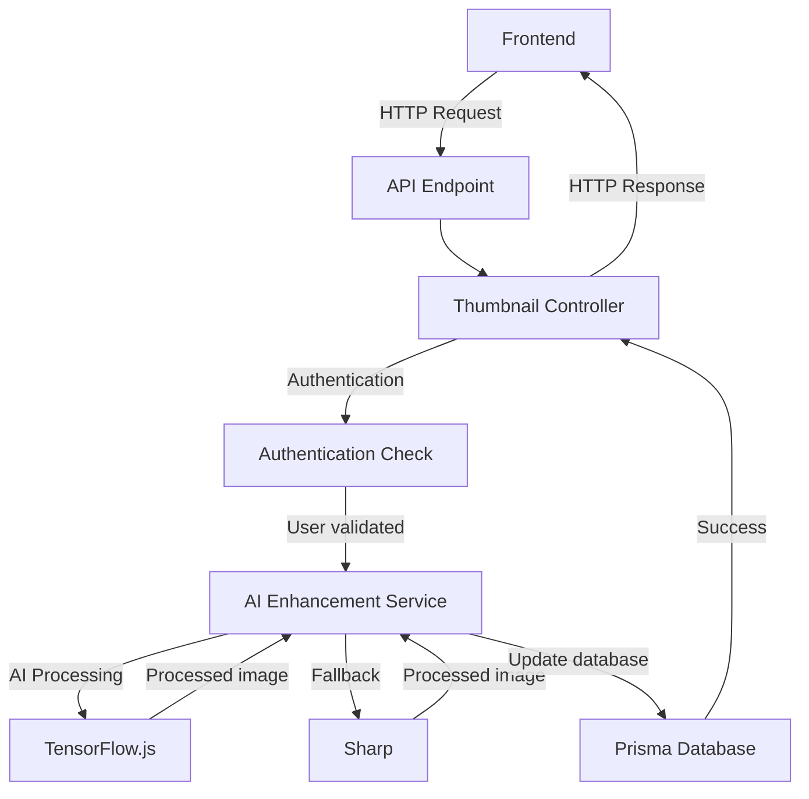

# AI Enhancement Module

<cite>
**Referenced Files in This Document**   
- [ai-enhancement.service.ts](file://pikzels-clone/src/modules/ai/ai-enhancement.service.ts)
- [ai-enhancement.service.test.ts](file://pikzels-clone/src/modules/ai/ai-enhancement.service.test.ts)
- [thumbnail.controller.ts](file://pikzels-clone/src/modules/thumbnail/thumbnail.controller.ts)
</cite>

## Table of Contents
1. [Introduction](#introduction)
2. [Core Components](#core-components)
3. [AI Model Integration](#ai-model-integration)
4. [Style Transfer Implementation](#style-transfer-implementation)
5. [Image Enhancement Capabilities](#image-enhancement-capabilities)
6. [Feature Extraction Process](#feature-extraction-process)
7. [Performance Considerations](#performance-considerations)
8. [Custom Model Training](#custom-model-training)
9. [Common Issues and Troubleshooting](#common-issues-and-troubleshooting)
10. [Integration with Application](#integration-with-application)

## Introduction

The AI Enhancement Module provides advanced image processing capabilities for thumbnail generation and enhancement through artificial intelligence. This module leverages TensorFlow.js for AI-powered image analysis and optimization, offering both style transfer and image enhancement features. The system is designed with a fallback mechanism using Sharp for basic image processing when TensorFlow.js is not available, ensuring graceful degradation of functionality.

The module supports multiple artistic styles including impressionist, cubist, expressionist, surrealist, and pop-art, as well as various enhancement types such as super-resolution, denoising, deblurring, color enhancement, and sharpening. This comprehensive set of features enables users to create visually compelling thumbnails with minimal effort.

**Section sources**
- [ai-enhancement.service.ts](file://pikzels-clone/src/modules/ai/ai-enhancement.service.ts#L30-L664)

## Core Components

The AI Enhancement Module consists of several key components that work together to provide AI-powered thumbnail enhancement capabilities. At the core is the `AIEnhancementService` class, which orchestrates the application of AI models to image processing tasks. The service handles initialization of TensorFlow.js, manages the application of various enhancement algorithms, and provides a clean interface for other components to utilize AI features.

The module implements a dual-processing approach, using TensorFlow.js for advanced AI operations when available, and falling back to Sharp for basic image processing when TensorFlow.js is not present. This ensures that the application remains functional even in environments where AI capabilities cannot be loaded.

**Diagram sources**
- [ai-enhancement.service.ts](file://pikzels-clone/src/modules/ai/ai-enhancement.service.ts#L30-L664)

**Section sources**
- [ai-enhancement.service.ts](file://pikzels-clone/src/modules/ai/ai-enhancement.service.ts#L30-L664)

## AI Model Integration

The AI Enhancement Module integrates TensorFlow.js for advanced image analysis and processing capabilities. The integration is implemented with careful consideration for environment compatibility, as evidenced by the conditional import and initialization pattern. The module attempts to load TensorFlow.js, but gracefully handles cases where it's not available by falling back to Sharp for basic image processing.

Model loading occurs during the service initialization phase, where TensorFlow.js is warmed up by calling the `ready()` method. This ensures that the TensorFlow.js backend is properly initialized before any inference operations are performed. The initialization process is asynchronous, allowing the application to continue loading while the AI framework prepares itself.

**Diagram sources**
- [ai-enhancement.service.ts](file://pikzels-clone/src/modules/ai/ai-enhancement.service.ts#L1-L50)

**Section sources**
- [ai-enhancement.service.ts](file://pikzels-clone/src/modules/ai/ai-enhancement.service.ts#L1-L50)

## Style Transfer Implementation

The style transfer functionality in the AI Enhancement Module provides several artistic styles that can be applied to thumbnails. The implementation uses a combination of TensorFlow.js operations to simulate various artistic effects when AI capabilities are available, and falls back to Sharp-based image processing techniques when TensorFlow.js is not present.

For each style, the module applies a series of transformations that approximate the characteristics of that artistic movement. The AI-powered implementations use tensor operations to manipulate image features, while the fallback implementations use traditional image processing filters to achieve similar visual effects.

**Diagram sources**
- [ai-enhancement.service.ts](file://pikzels-clone/src/modules/ai/ai-enhancement.service.ts#L63-L181)

**Section sources**
- [ai-enhancement.service.ts](file://pikzels-clone/src/modules/ai/ai-enhancement.service.ts#L63-L181)

## Image Enhancement Capabilities

The AI Enhancement Module provides a comprehensive set of image enhancement capabilities designed to improve thumbnail quality through AI-powered techniques. These enhancements include super-resolution, denoising, deblurring, color enhancement, and sharpening, each implemented to address specific image quality issues.

The enhancement process follows a consistent pattern: the input image is loaded, the specified enhancement algorithm is applied based on the enhancement type, and the processed image is saved with a unique filename. When TensorFlow.js is available, more sophisticated AI models would be used for these enhancements, though the current implementation uses Sharp as a placeholder for demonstration purposes.

**Diagram sources**
- [ai-enhancement.service.ts](file://pikzels-clone/src/modules/ai/ai-enhancement.service.ts#L190-L237)

**Section sources**
- [ai-enhancement.service.ts](file://pikzels-clone/src/modules/ai/ai-enhancement.service.ts#L190-L237)

## Feature Extraction Process

The feature extraction process for video frames in the AI Enhancement Module is implemented through the `fetchImageBuffer` method, which handles the retrieval and preparation of image data for processing. This method serves as the entry point for all image processing operations, ensuring that images are properly loaded and converted into a format suitable for both AI analysis and traditional image processing.

The process begins by checking the environment (test vs. production) and the image source (placeholder vs. actual image). For placeholder images from services like placehold.co, the module generates a synthetic image buffer with specified dimensions and background color. For other images, it would typically fetch the actual image data from the provided URL, though the current implementation uses a placeholder approach.

**Diagram sources**
- [ai-enhancement.service.ts](file://pikzels-clone/src/modules/ai/ai-enhancement.service.ts#L588-L623)

**Section sources**
- [ai-enhancement.service.ts](file://pikzels-clone/src/modules/ai/ai-enhancement.service.ts#L588-L623)

## Performance Considerations

The AI Enhancement Module incorporates several performance considerations to ensure efficient operation, particularly when dealing with AI model loading, GPU acceleration, and batch processing. The module implements lazy initialization of TensorFlow.js, loading and preparing the framework only when needed, which reduces startup time and memory usage for users who may not utilize AI features.

For GPU acceleration, the module relies on TensorFlow.js's built-in capabilities to automatically utilize available GPU resources when present. The implementation includes proper tensor disposal after operations to prevent memory leaks, a critical consideration when performing intensive AI computations. The batch processing capability is supported through the design of the enhancement methods, which process one image at a time but can be called repeatedly in sequence or parallel for multiple images.

The module also considers network and I/O performance by caching processed images to disk and generating unique filenames based on timestamp and thumbnail ID to avoid conflicts. The fallback mechanism to Sharp ensures that basic image processing remains available even when AI capabilities cannot be loaded, maintaining application responsiveness.

**Section sources**
- [ai-enhancement.service.ts](file://pikzels-clone/src/modules/ai/ai-enhancement.service.ts#L1-L664)

## Custom Model Training

While the current implementation of the AI Enhancement Module does not include direct support for training custom AI models, it is designed with extensibility in mind. The modular architecture allows for the integration of new enhancement algorithms and trained models through the existing enhancement framework.

To train custom models for use with this module, developers would typically follow a process of collecting and labeling training data, selecting an appropriate neural network architecture, training the model using TensorFlow.js or TensorFlow Python, and then converting the trained model to a format compatible with TensorFlow.js.

Once a custom model is trained and converted, it can be integrated into the module by adding new methods to handle model loading and inference, and updating the enhancement type mappings to include the new capabilities. The module's design supports this extension pattern, with clear separation between the service interface and the underlying implementation details.

```mermaid
flowchart TD
Start([Custom Model Training]) --> DataCollection["Data Collection"]
DataCollection --> LabelData["Label training data"]
DataCollection --> OrganizeData["Organize data into categories"]
Start --> ModelSelection["Model Selection"]
ModelSelection --> ChooseArchitecture["Choose neural network architecture"]
ModelSelection --> ConsiderConstraints["Consider deployment constraints<br/>- Model size<br/>- Inference speed"]
Start --> Training["Model Training"]
Training --> TrainModel["Train model using TensorFlow"]
Training --> ValidateModel["Validate model performance"]
Training --> OptimizeModel["Optimize model for inference"]
Start --> ModelConversion["Model Conversion"]
ModelConversion --> ConvertFormat["Convert to TensorFlow.js format"]
ModelConversion --> TestModel["Test converted model"]
Start --> Integration["Integration with Module"]
Integration --> AddLoading["Add model loading method"]
Integration --> ImplementInference["Implement inference execution"]
Integration --> UpdateMappings["Update enhancement type mappings"]
Integration --> TestIntegration["Test integrated functionality"]
```

**Section sources**
- [ai-enhancement.service.ts](file://pikzels-clone/src/modules/ai/ai-enhancement.service.ts#L30-L664)

## Common Issues and Troubleshooting

The AI Enhancement Module may encounter several common issues related to model compatibility, memory management, and performance degradation. Understanding these issues and their solutions is crucial for maintaining reliable operation of the AI features.

Model compatibility issues can arise when there are version mismatches between TensorFlow.js and the expected model format, or when running in environments that don't support the required TensorFlow.js backend. Memory leaks during inference can occur if tensors are not properly disposed of after use, leading to increasing memory consumption over time. Accuracy degradation may happen when models are applied to image types or styles they weren't trained on, producing suboptimal results.

```mermaid
flowchart TD
Start([Common Issues]) --> ModelCompatibility["Model Compatibility"]
ModelCompatibility --> VersionMismatch["Version mismatches<br/>- TensorFlow.js version vs. model version"]
ModelCompatibility --> BackendSupport["Backend support issues<br/>- Node.js vs. browser environments<br/>- GPU driver compatibility"]
ModelCompatibility --> Solution1["Solutions<br/>- Pin TensorFlow.js version<br/>- Test across target environments<br/>- Provide fallback options"]
Start --> MemoryLeaks["Memory Leaks"]
MemoryLeaks --> TensorDisposal["Improper tensor disposal<br/>- Forgetting to call dispose()"]
MemoryLeaks --> CircularRefs["Circular references<br/>- Holding references to tensors"]
MemoryLeaks --> Solution2["Solutions<br/>- Always dispose tensors after use<br/>- Use try-finally blocks<br/>- Monitor memory usage"]
Start --> AccuracyDegradation["Accuracy Degradation"]
AccuracyDegradation --> DataDrift["Data drift<br/>- Input images differ from training data"]
AccuracyDegradation --> Overfitting["Model overfitting<br/>- Poor generalization to new inputs"]
AccuracyDegradation --> Solution3["Solutions<br/>- Regular model retraining<br/>- Monitor performance metrics<br/>- Implement model versioning"]
Start --> PerformanceIssues["Performance Issues"]
PerformanceIssues --> SlowInference["Slow inference times<br/>- Large model size<br/>- Complex operations"]
PerformanceIssues --> HighMemory["High memory usage<br/>- Large tensors<br/>- Multiple concurrent operations"]
PerformanceIssues --> Solution4["Solutions<br/>- Model optimization<br/>- Batch processing control<br/>- GPU acceleration"]
```

**Section sources**
- [ai-enhancement.service.ts](file://pikzels-clone/src/modules/ai/ai-enhancement.service.ts#L1-L664)
- [ai-enhancement.service.test.ts](file://pikzels-clone/src/modules/ai/ai-enhancement.service.test.ts#L1-L50)

## Integration with Application

The AI Enhancement Module is integrated into the main application through the thumbnail controller, which exposes the AI enhancement features via API endpoints. This integration allows the frontend application to access AI-powered thumbnail styling and enhancement capabilities through standard HTTP requests.

The integration follows a clean separation of concerns, with the AIEnhancementService handling the core AI functionality while the thumbnail controller manages request validation, authentication, and database operations. This architecture ensures that AI processing is decoupled from the application's business logic and data persistence layers.

**Diagram sources**
- [thumbnail.controller.ts](file://pikzels-clone/src/modules/thumbnail/thumbnail.controller.ts#L10-L734)

**Section sources**
- [thumbnail.controller.ts](file://pikzels-clone/src/modules/thumbnail/thumbnail.controller.ts#L10-L734)