# AI Enhancement Module

<cite>
**Referenced Files in This Document**
- [ai-enhancement.service.ts](file://pikzels-clone/src/modules/ai/ai-enhancement.service.ts)
- [ai-enhancement.service.test.ts](file://pikzels-clone/src/modules/ai/ai-enhancement.service.test.ts)
- [thumbnail.controller.ts](file://pikzels-clone/src/modules/thumbnail/thumbnail.controller.ts)
- [openrouter-ai.service.ts](file://pikzels-clone/src/modules/thumbnail/openrouter-ai.service.ts)
- [ai-service-manager.ts](file://pikzels-clone/src/modules/thumbnail/ai-service-manager.ts)
- [generate-landing-thumbnails.ts](file://pikzels-clone/scripts/generate-landing-thumbnails.ts)
- [environment.ts](file://pikzels-clone/client/src/config/environment.ts)
- [.env.example](file://pikzels-clone/.env.example)
- [vision.controller.ts](file://pikzels-clone/src/modules/vision/vision.controller.ts)
- [vision.service.ts](file://pikzels-clone/src/modules/vision/vision.service.ts)
- [vision.routes.ts](file://pikzels-clone/src/modules/vision/vision.routes.ts)
- [ab-testing.service.ts](file://pikzels-clone/src/modules/ab-testing/ab-testing.service.ts)
- [ab-testing.controller.ts](file://pikzels-clone/src/modules/ab-testing/ab-testing.controller.ts)
- [ab-testing.routes.ts](file://pikzels-clone/src/modules/ab-testing/ab-testing.routes.ts)
- [editor-chat.controller.ts](file://pikzels-clone/src/modules/editor-chat/editor-chat.controller.ts)
- [editor-chat.service.ts](file://pikzels-clone/src/modules/editor-chat/editor-chat.service.ts)
- [editor-chat.routes.ts](file://pikzels-clone/src/modules/editor-chat/editor-chat.routes.ts)
- [types.ts](file://pikzels-clone/src/modules/editor-chat/types.ts)
- [action-catalog.ts](file://pikzels-clone/src/modules/editor-command/action-catalog.ts)
- [useChatStreaming.ts](file://pikzels-clone/client/src/features/ai-chat/hooks/useChatStreaming.ts)
- [useChatActions.ts](file://pikzels-clone/client/src/features/ai-chat/hooks/useChatActions.ts)
- [types.ts](file://pikzels-clone/client/src/features/ai-chat/types.ts)
- [ChatMessage.tsx](file://pikzels-clone/client/src/features/ai-chat/components/ChatMessage.tsx)
- [ChatPanel.tsx](file://pikzels-clone/client/src/features/ai-chat/components/ChatPanel.tsx)
- [server.ts](file://pikzels-clone/src/server.ts)
</cite>

## Update Summary
**Changes Made**
- Added comprehensive AI chat system with dedicated editor-chat module
- Integrated streaming response capabilities with Server-Sent Events (SSE)
- Implemented conversation management with multi-turn chat support
- Added action-based AI assistance that can directly modify editor state
- Enhanced AI service ecosystem with OpenRouter integration for both vision and chat

## Table of Contents
1. [Introduction](#introduction)
2. [Core Components](#core-components)
3. [AI Model Integration](#ai-model-integration)
4. [Vision Analysis System](#vision-analysis-system)
5. [Visual Search Capabilities](#visual-search-capabilities)
6. [A/B Testing Framework](#ab-testing-framework)
7. [AI Chat System](#ai-chat-system)
8. [Style Transfer Implementation](#style-transfer-implementation)
9. [Image Enhancement Capabilities](#image-enhancement-capabilities)
10. [Feature Extraction Process](#feature-extraction-process)
11. [Performance Considerations](#performance-considerations)
12. [Custom Model Training](#custom-model-training)
13. [Common Issues and Troubleshooting](#common-issues-and-troubleshooting)
14. [Integration with Application](#integration-with-application)

## Introduction

The AI Enhancement Module has been significantly expanded to provide a comprehensive suite of AI-powered features beyond traditional image processing. The enhanced module now includes three sophisticated AI systems: Vision Analysis for intelligent image understanding, Visual Search for discovering similar content, A/B Testing for performance optimization, and a revolutionary AI Chat System for interactive thumbnail editing assistance.

**Updated** The module now features advanced AI capabilities including OpenRouter Gemini Vision for thumbnail analysis, Bing Web Search integration for visual discovery, a complete A/B testing framework for optimizing thumbnail performance metrics, and a sophisticated AI chat system that provides real-time conversational assistance with direct editor action capabilities.

The Vision Analysis system provides intelligent thumbnail design insights by analyzing visual elements, color palettes, composition styles, and design moods. The Visual Search functionality enables users to discover similar thumbnails through both text queries and image-based searches. The A/B Testing framework allows systematic comparison of different thumbnail variants to maximize click-through rates and engagement. The AI Chat System offers conversational AI assistance that can directly modify editor state through structured actions.

**Section sources**
- [vision.service.ts:14-29](file://pikzels-clone/src/modules/vision/vision.service.ts#L14-L29)
- [vision.controller.ts:27-57](file://pikzels-clone/src/modules/vision/vision.controller.ts#L27-L57)
- [ab-testing.service.ts:24-65](file://pikzels-clone/src/modules/ab-testing/ab-testing.service.ts#L24-L65)
- [editor-chat.service.ts:10-14](file://pikzels-clone/src/modules/editor-chat/editor-chat.service.ts#L10-L14)

## Core Components

The enhanced AI Enhancement Module consists of interconnected components that work together to provide comprehensive AI-powered thumbnail capabilities. The core system now includes the original AI Enhancement Service alongside four new specialized modules.

**Updated** Enhanced with Vision Analysis Service, Visual Search functionality, A/B Testing framework, and a revolutionary AI Chat System for interactive thumbnail editing assistance.

The module maintains its dual-processing architecture, using TensorFlow.js for advanced AI operations when available and falling back to Sharp for basic image processing. The new components integrate seamlessly with this architecture while providing specialized functionality for different AI use cases. The AI Chat System represents the most significant addition, providing real-time conversational assistance with direct editor action capabilities.

```mermaid
classDiagram
class AIEnhancementService {
+initialized : boolean
-initialize() : Promise~void~
+applyStyleTransfer(imageUrl : string, styleType : string, thumbnailId : string) : Promise~string~
+enhanceImage(imageUrl : string, enhancementType : string, thumbnailId : string) : Promise~string~
+getAvailableStyles() : string[]
+getAvailableEnhancements() : string[]
-fetchImageBuffer(imageUrl : string) : Promise~Buffer~
-getProcessedImageUrl(imagePath : string) : string
}
class VisionService {
-openrouterApiKey : string
-openrouterApiUrl : string
-bingApiKey : string
-bingEndpoint : string
-analyzeImage(imageUrl : string, userId : string) : Promise~VisionAnalysisResult~
-searchWebImages(query : string, count : number) : Promise~BingImageResult[]~
-getHistory(userId : string, limit : number) : Promise~VisionAnalysisResult[]~
-parseVisionResponse(rawContent : string) : ParsedVisionResponse
-generatePromptFromElements(parsed : ParsedVisionResponse) : string
}
class ABTestingService {
-prisma : PrismaClient
-cache : CacheService
-createTest(userId : string, data : ABTestCreate) : Promise~ABTestResult~
-startTest(testId : string, userId : string) : Promise~ABTestResult~
-recordEvent(testId : string, variantId : string, userId : string, action : string) : Promise~void~
-completeTest(testId : string, userId : string) : Promise~ABTestResult~
}
class EditorChatService {
-openrouterApiKey : string
-openrouterApiUrl : string
-buildSystemPrompt(canvasContext : CanvasContext, platformPreset : PlatformPresetContext) : string
-streamChat(messages : ChatMessagePayload[], canvasContext : CanvasContext, platformPreset : PlatformPresetContext, send : Function, isAborted : Function) : Promise~void~
-extractActionBlock(text : string) : Object | null
}
class TensorFlow {
+ready() : Promise~void~
+node.decodeImage(buffer : Buffer, channels : number) : Tensor3D
+node.encodePng(tensor : Tensor3D) : Promise~Buffer~
+image.resizeBilinear(tensor : Tensor3D, size : number[]) : Tensor3D
+pow(tensor : Tensor3D, power : number) : Tensor3D
+sub(a : Tensor, b : Tensor) : Tensor3D
+conv2d(input : Tensor4D, filter : Tensor4D, strides : number[], pad : string) : Tensor4D
}
class Sharp {
+decodeImage(buffer : Buffer) : Sharp
+resize(width : number, height : number) : Sharp
+blur(sigma : number) : Sharp
+modulate(options : object) : Sharp
+gamma(value : number) : Sharp
+negate() : Sharp
+threshold(value : number) : Sharp
+sharpen(options : object) : Sharp
+convolve(kernel : object) : Sharp
+median(size : number) : Sharp
}
AIEnhancementService --> TensorFlow : "uses when available"
AIEnhancementService --> Sharp : "uses as fallback"
VisionService --> VisionService : "integrates with OpenRouter"
ABTestingService --> ABTestingService : "manages test lifecycle"
EditorChatService --> EditorChatService : "streams chat completions"
```

**Diagram sources**
- [ai-enhancement.service.ts:31-666](file://pikzels-clone/src/modules/ai/ai-enhancement.service.ts#L31-L666)
- [vision.service.ts:31-306](file://pikzels-clone/src/modules/vision/vision.service.ts#L31-L306)
- [ab-testing.service.ts:12-338](file://pikzels-clone/src/modules/ab-testing/ab-testing.service.ts#L12-L338)
- [editor-chat.service.ts:55-214](file://pikzels-clone/src/modules/editor-chat/editor-chat.service.ts#L55-L214)

**Section sources**
- [ai-enhancement.service.ts:31-666](file://pikzels-clone/src/modules/ai/ai-enhancement.service.ts#L31-L666)
- [vision.service.ts:31-306](file://pikzels-clone/src/modules/vision/vision.service.ts#L31-L306)
- [ab-testing.service.ts:12-338](file://pikzels-clone/src/modules/ab-testing/ab-testing.service.ts#L12-L338)
- [editor-chat.service.ts:55-214](file://pikzels-clone/src/modules/editor-chat/editor-chat.service.ts#L55-L214)

## AI Model Integration

The AI Enhancement Module integrates multiple AI providers and models to deliver comprehensive functionality. The system now supports OpenRouter for advanced vision analysis, visual search capabilities, and conversational AI assistance, while maintaining TensorFlow.js integration for local image processing.

**Updated** Enhanced with OpenRouter Gemini Vision integration, Bing Web Search API, comprehensive error handling for multiple AI providers, and streaming chat completions with action extraction capabilities.

The integration architecture supports both cloud-based AI services and local TensorFlow.js models. The Vision Analysis system utilizes OpenRouter's Gemini Vision model for intelligent thumbnail analysis, while the Visual Search functionality leverages Bing's image search capabilities. The AI Chat System provides conversational assistance with structured action extraction, and the A/B Testing framework operates independently but integrates with the overall AI ecosystem.

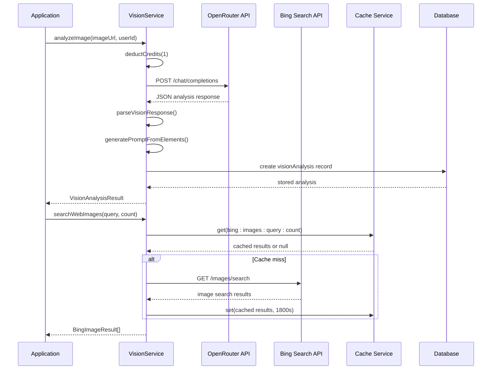

**Diagram sources**
- [vision.service.ts:51-146](file://pikzels-clone/src/modules/vision/vision.service.ts#L51-L146)
- [vision.service.ts:148-201](file://pikzels-clone/src/modules/vision/vision.service.ts#L148-L201)

**Section sources**
- [vision.service.ts:39-49](file://pikzels-clone/src/modules/vision/vision.service.ts#L39-L49)
- [vision.service.ts:69-106](file://pikzels-clone/src/modules/vision/vision.service.ts#L69-L106)
- [vision.service.ts:151-176](file://pikzels-clone/src/modules/vision/vision.service.ts#L151-L176)

## Vision Analysis System

The Vision Analysis system provides intelligent thumbnail design insights by analyzing visual elements, color palettes, composition styles, and design moods. This system leverages OpenRouter's Gemini Vision model to process both uploaded images and URLs, extracting meaningful design information for thumbnail optimization.

**Updated** Comprehensive vision analysis powered by OpenRouter Gemini Vision with structured JSON responses and automated prompt generation.

The system implements a sophisticated analysis pipeline that processes user-uploaded images or external URLs through the Gemini Vision model. The analysis extracts detailed information about visual design elements, including main subjects, facial presence, text overlays, color schemes, emotional mood, artistic style, and compositional structure. The results are stored in the database with associated suggested prompts for thumbnail generation.

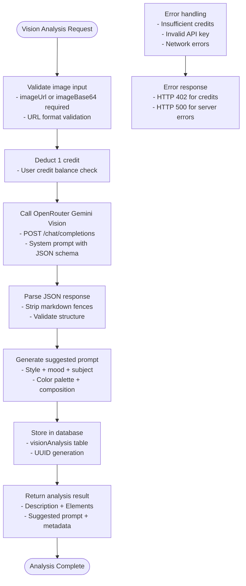

**Diagram sources**
- [vision.controller.ts:27-57](file://pikzels-clone/src/modules/vision/vision.controller.ts#L27-L57)
- [vision.service.ts:51-146](file://pikzels-clone/src/modules/vision/vision.service.ts#L51-L146)
- [vision.service.ts:229-272](file://pikzels-clone/src/modules/vision/vision.service.ts#L229-L272)

**Section sources**
- [vision.controller.ts:27-57](file://pikzels-clone/src/modules/vision/vision.controller.ts#L27-L57)
- [vision.service.ts:51-146](file://pikzels-clone/src/modules/vision/vision.service.ts#L51-L146)
- [vision.service.ts:129-145](file://pikzels-clone/src/modules/vision/vision.service.ts#L129-L145)

## Visual Search Capabilities

The Visual Search system enables users to discover similar thumbnails through both text-based queries and image-based searches. This functionality leverages Bing's Web Search API to find visually similar content, providing users with inspiration and competitive analysis capabilities.

**Updated** Integrated Bing Web Search API for comprehensive visual content discovery with caching and rate limiting support.

The Visual Search system provides two primary search modes: text-based search for finding thumbnails related to specific topics, and image-based search for discovering visually similar content. The system implements intelligent caching to reduce API calls and improve response times, while maintaining quality filters to ensure relevant results.

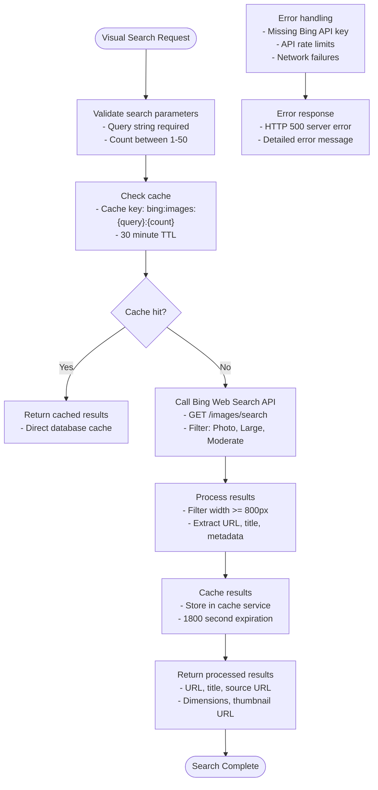

**Diagram sources**
- [vision.controller.ts:59-83](file://pikzels-clone/src/modules/vision/vision.controller.ts#L59-L83)
- [vision.service.ts:148-201](file://pikzels-clone/src/modules/vision/vision.service.ts#L148-L201)
- [vision.service.ts:156-198](file://pikzels-clone/src/modules/vision/vision.service.ts#L156-L198)

**Section sources**
- [vision.controller.ts:59-83](file://pikzels-clone/src/modules/vision/vision.controller.ts#L59-L83)
- [vision.service.ts:148-201](file://pikzels-clone/src/modules/vision/vision.service.ts#L148-L201)
- [vision.service.ts:163-195](file://pikzels-clone/src/modules/vision/vision.service.ts#L163-L195)

## A/B Testing Framework

The A/B Testing framework provides a comprehensive system for comparing different thumbnail variants to optimize performance metrics such as click-through rates and engagement. This framework supports statistical analysis with minimum sample size requirements and automated winner determination.

**Updated** Complete A/B testing implementation with statistical significance testing, variant management, and performance analytics.

The A/B Testing system manages test lifecycle from creation through completion, tracking impressions and clicks for each variant. The framework enforces statistical validity by requiring a minimum number of impressions before declaring a winner, ensuring reliable performance comparisons.

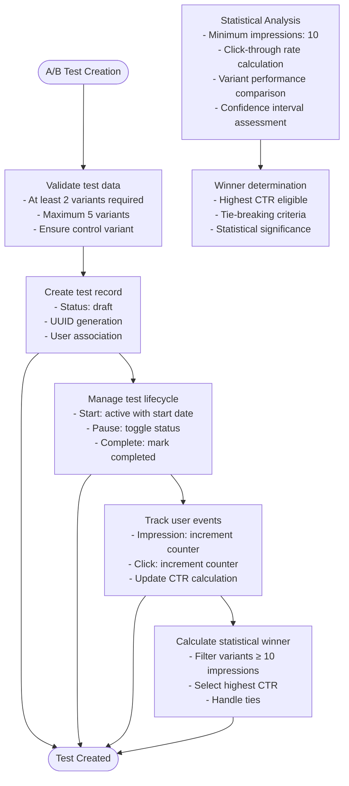

**Diagram sources**
- [ab-testing.service.ts:24-65](file://pikzels-clone/src/modules/ab-testing/ab-testing.service.ts#L24-L65)
- [ab-testing.service.ts:117-148](file://pikzels-clone/src/modules/ab-testing/ab-testing.service.ts#L117-L148)
- [ab-testing.service.ts:217-268](file://pikzels-clone/src/modules/ab-testing/ab-testing.service.ts#L217-L268)
- [ab-testing.service.ts:314-321](file://pikzels-clone/src/modules/ab-testing/ab-testing.service.ts#L314-L321)

**Section sources**
- [ab-testing.service.ts:24-65](file://pikzels-clone/src/modules/ab-testing/ab-testing.service.ts#L24-L65)
- [ab-testing.service.ts:117-148](file://pikzels-clone/src/modules/ab-testing/ab-testing.service.ts#L117-L148)
- [ab-testing.service.ts:217-268](file://pikzels-clone/src/modules/ab-testing/ab-testing.service.ts#L217-L268)
- [ab-testing.service.ts:314-321](file://pikzels-clone/src/modules/ab-testing/ab-testing.service.ts#L314-L321)

## AI Chat System

**New Section** The AI Chat System provides conversational AI assistance for thumbnail editing with real-time streaming responses and direct editor action capabilities.

The AI Chat System represents a revolutionary addition to the AI Enhancement Module, offering users conversational assistance for thumbnail editing through a dedicated editor-chat module. This system provides multi-turn conversations with streaming responses using Server-Sent Events (SSE), allowing users to interact naturally with AI assistance while working in the thumbnail editor.

The chat system integrates tightly with the editor's action catalog, enabling AI assistants to propose and execute specific editor actions based on user requests. It supports platform-aware responses, canvas context awareness, and structured action extraction with automatic targeting capabilities.

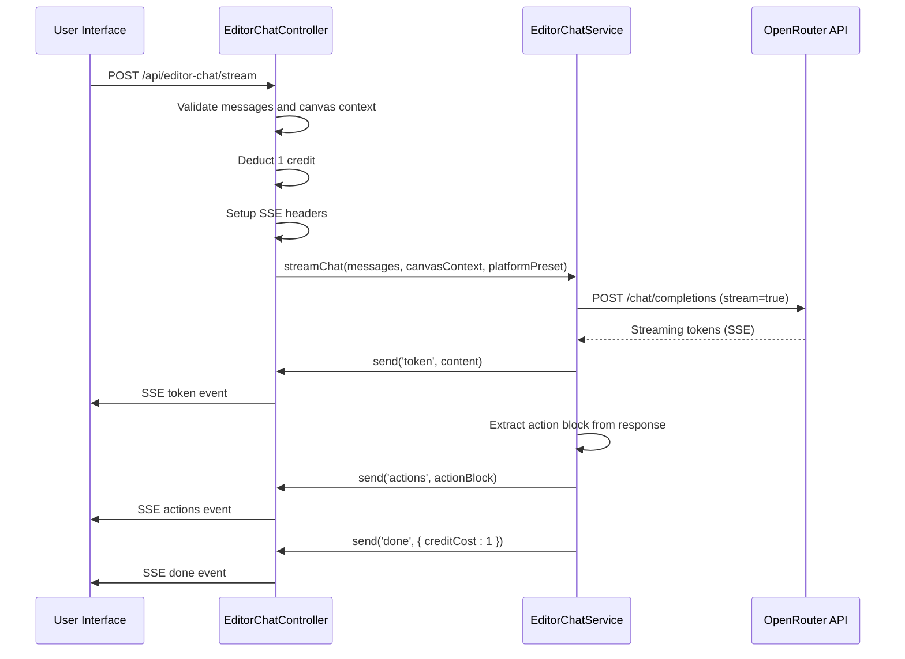

**Diagram sources**
- [editor-chat.controller.ts:14-95](file://pikzels-clone/src/modules/editor-chat/editor-chat.controller.ts#L14-L95)
- [editor-chat.service.ts:74-173](file://pikzels-clone/src/modules/editor-chat/editor-chat.service.ts#L74-L173)

The AI Chat System provides several key capabilities:

**Multi-turn Conversations**: Maintains conversation history with intelligent trimming to stay within token limits, allowing for complex editing workflows that span multiple interactions.

**Streaming Responses**: Implements real-time streaming using Server-Sent Events, providing immediate feedback as the AI generates responses, enhancing the user experience during complex operations.

**Action-Based Assistance**: Extracts structured actions from AI responses, enabling direct editor modifications through a standardized action catalog that mirrors the editor's capabilities.

**Platform Awareness**: Supports platform-specific presets that influence AI recommendations based on target platforms, ensuring suggestions respect platform conventions and technical constraints.

**Canvas Context Integration**: Provides comprehensive canvas state information to the AI, enabling context-aware suggestions and precise action targeting.

**Section sources**
- [editor-chat.controller.ts:14-123](file://pikzels-clone/src/modules/editor-chat/editor-chat.controller.ts#L14-L123)
- [editor-chat.service.ts:55-214](file://pikzels-clone/src/modules/editor-chat/editor-chat.service.ts#L55-L214)
- [types.ts:17-52](file://pikzels-clone/src/modules/editor-chat/types.ts#L17-L52)
- [action-catalog.ts:7-121](file://pikzels-clone/src/modules/editor-command/action-catalog.ts#L7-L121)

## Style Transfer Implementation

The style transfer functionality in the AI Enhancement Module provides several artistic styles that can be applied to thumbnails. The implementation uses a combination of TensorFlow.js operations to simulate various artistic effects when AI capabilities are available, and falls back to Sharp-based image processing techniques when TensorFlow.js is not present.

**Updated** Enhanced with OpenRouter AI integration for automated thumbnail generation with multiple model support.

For each style, the module applies a series of transformations that approximate the characteristics of that artistic movement. The AI-powered implementations use tensor operations to manipulate image features, while the fallback implementations use traditional image processing filters to achieve similar visual effects.

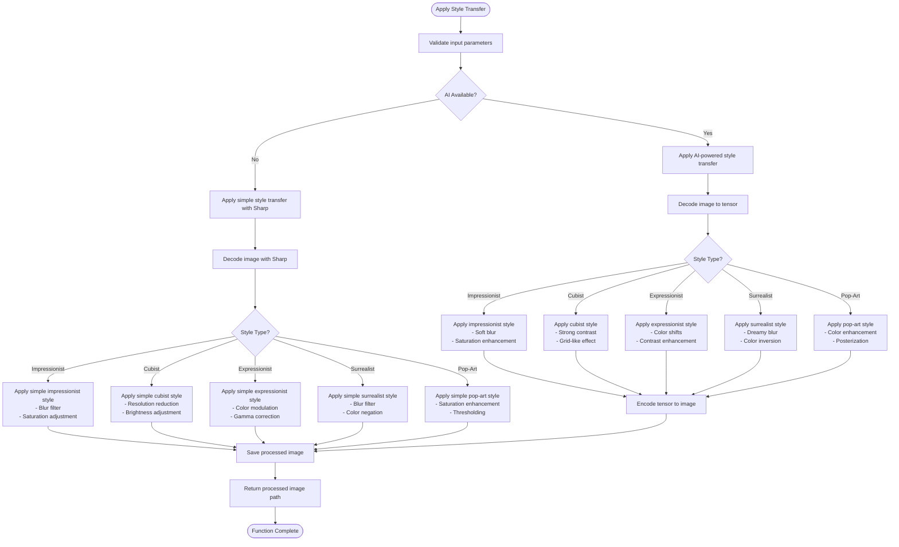

**Diagram sources**
- [ai-enhancement.service.ts:64-182](file://pikzels-clone/src/modules/ai/ai-enhancement.service.ts#L64-L182)

**Section sources**
- [ai-enhancement.service.ts:64-182](file://pikzels-clone/src/modules/ai/ai-enhancement.service.ts#L64-L182)

## Image Enhancement Capabilities

The AI Enhancement Module provides a comprehensive set of image enhancement capabilities designed to improve thumbnail quality through AI-powered techniques. These enhancements include super-resolution, denoising, deblurring, color enhancement, and sharpening, each implemented to address specific image quality issues.

**Updated** Enhanced with OpenRouter AI integration for automated thumbnail generation with multiple model support and improved error handling.

The enhancement process follows a consistent pattern: the input image is loaded, the specified enhancement algorithm is applied based on the enhancement type, and the processed image is saved with a unique filename. When TensorFlow.js is available, more sophisticated AI models would be used for these enhancements, though the current implementation uses Sharp as a placeholder for demonstration purposes.

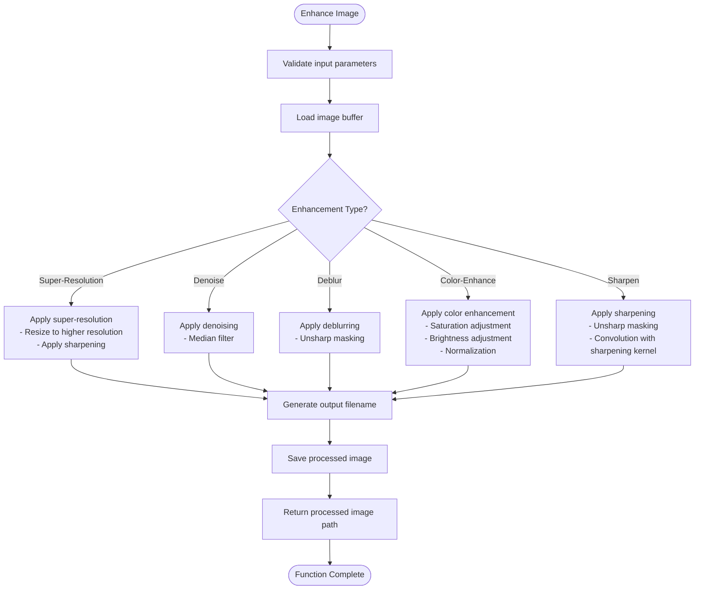

**Diagram sources**
- [ai-enhancement.service.ts:191-238](file://pikzels-clone/src/modules/ai/ai-enhancement.service.ts#L191-L238)

**Section sources**
- [ai-enhancement.service.ts:191-238](file://pikzels-clone/src/modules/ai/ai-enhancement.service.ts#L191-L238)

## Feature Extraction Process

The feature extraction process for video frames in the AI Enhancement Module is implemented through the `fetchImageBuffer` method, which handles the retrieval and preparation of image data for processing. This method serves as the entry point for all image processing operations, ensuring that images are properly loaded and converted into a format suitable for both AI analysis and traditional image processing.

**Updated** Enhanced with OpenRouter AI integration for automated thumbnail generation with multiple model support.

The process begins by checking the environment (test vs. production) and the image source (placeholder vs. actual image). For placeholder images from services like placehold.co, the module generates a synthetic image buffer with specified dimensions and background color. For other images, it would typically fetch the actual image data from the provided URL, though the current implementation uses a placeholder approach.

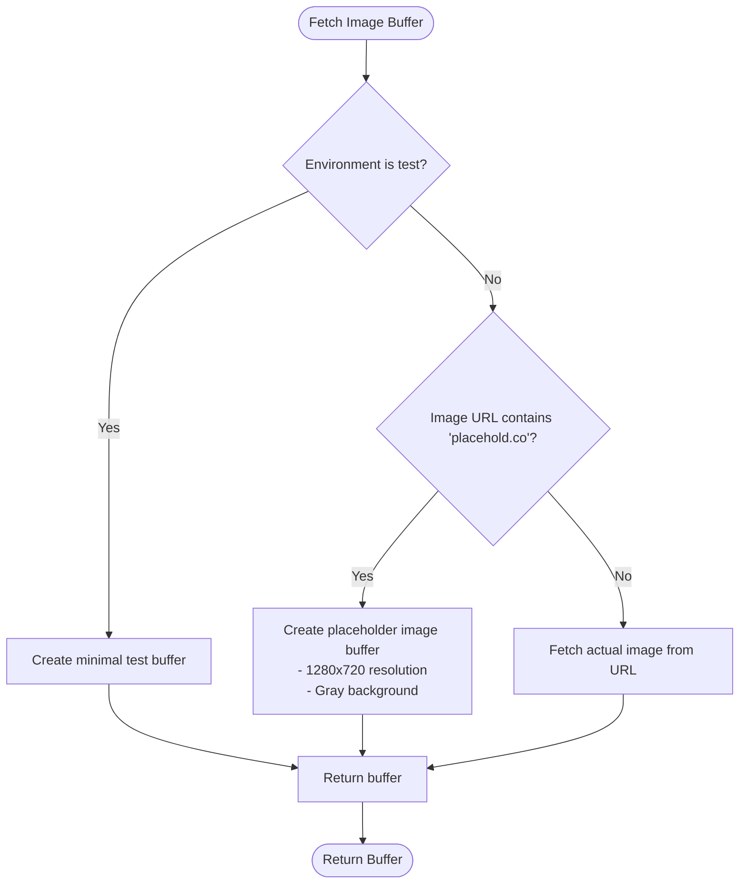

**Diagram sources**
- [ai-enhancement.service.ts:589-624](file://pikzels-clone/src/modules/ai/ai-enhancement.service.ts#L589-L624)

**Section sources**
- [ai-enhancement.service.ts:589-624](file://pikzels-clone/src/modules/ai/ai-enhancement.service.ts#L589-L624)

## Performance Considerations

The AI Enhancement Module incorporates several performance considerations to ensure efficient operation, particularly when dealing with AI model loading, GPU acceleration, and batch processing. The module implements lazy initialization of TensorFlow.js, loading and preparing the framework only when needed, which reduces startup time and memory usage for users who may not utilize AI features.

**Updated** Enhanced with OpenRouter AI service performance optimizations including timeout handling, retry mechanisms, and model availability detection.

For GPU acceleration, the module relies on TensorFlow.js's built-in capabilities to automatically utilize available GPU resources when present. The implementation includes proper tensor disposal after operations to prevent memory leaks, a critical consideration when performing intensive AI computations. The batch processing capability is supported through the design of the enhancement methods, which process one image at a time but can be called repeatedly in sequence or parallel for multiple images.

The module also considers network and I/O performance by caching processed images to disk and generating unique filenames based on timestamp and thumbnail ID to avoid conflicts. The fallback mechanism to Sharp ensures that basic image processing remains available even when AI capabilities cannot be loaded, maintaining application responsiveness.

**Updated** The AI Chat System introduces additional performance considerations including SSE streaming overhead, conversation history management, and action execution coordination.

The AI Chat System implements several performance optimizations:
- Streaming response handling with efficient buffer management
- Conversation history trimming to stay within token limits
- Action block extraction with structured JSON parsing
- Credit-based rate limiting to prevent abuse
- Platform-aware caching for repeated requests

```mermaid
flowchart TD
Start([Performance Considerations]) --> ModelLoading["Model Loading"]
ModelLoading --> LazyInit["Lazy initialization<br/>- Load TensorFlow.js only when needed<br/>- Warm up with tf.ready()"]
ModelLoading --> OpenRouterConfig["OpenRouter Configuration<br/>- API key validation<br/>- Model availability checks<br/>- Timeout handling"]
ModelLoading --> MemoryManagement["Memory Management"]
MemoryManagement --> TensorDisposal["Proper tensor disposal<br/>- Call dispose() on tensors<br/>- Prevent memory leaks"]
MemoryManagement --> Cleanup["Resource cleanup<br/>- File system cleanup"]
Start --> GPUAcceleration["GPU Acceleration"]
GPUAcceleration --> AutoGPU["Automatic GPU utilization<br/>- TensorFlow.js backend selection<br/>- WebGL/CUDA support"]
GPUAcceleration --> MemoryOpt["Memory optimization<br/>- Batch size management<br/>- GPU memory monitoring"]
Start --> BatchProcessing["Batch Processing"]
BatchProcessing --> Sequential["Sequential processing<br/>- One image at a time<br/>- Predictable resource usage"]
BatchProcessing --> Parallel["Parallel processing<br/>- Multiple images simultaneously<br/>- Higher throughput"]
BatchProcessing --> MemoryLimits["Memory limits<br/>- Control concurrent operations<br/>- Prevent out-of-memory errors"]
Start --> IOPerformance["I/O Performance"]
IOPerformance --> Caching["Caching strategy<br/>- Save processed images to disk<br/>- Unique filename generation"]
IOPerformance --> Fallback["Fallback mechanism<br/>- Use Sharp when TensorFlow.js unavailable<br/>- Maintain responsiveness"]
Start --> NetworkPerformance["Network Performance"]
NetworkPerformance --> Timeouts["Timeout Handling<br/>- 2-minute timeout for image generation<br/>- Abort signals for long requests"]
NetworkPerformance --> Retries["Retry Mechanisms<br/>- Up to 2 retry attempts<br/>- 3-second delay between attempts<br/>- Intelligent error classification"]
NetworkPerformance --> ModelSelection["Model Selection<br/>- Automatic model discovery<br/>- Availability validation<br/>- Fallback model selection"]
Start --> CreditSystem["Credit Management"]
CreditSystem --> VisionCredits["Vision Analysis Credits<br/>- 1 credit deduction per analysis<br/>- Insufficient credit handling<br/>- Credit balance validation"]
CreditSystem --> ChatCredits["Chat System Credits<br/>- 1 credit deduction per chat turn<br/>- Real-time credit validation<br/>- Concurrent session limits"]
Start --> ChatPerformance["Chat Performance"]
ChatPerformance --> SSEHandling["SSE Streaming<br/>- Efficient buffer management<br/>- Connection pooling<br/>- Graceful connection termination"]
ChatPerformance --> HistoryTrimming["Conversation History<br/>- Max 10 messages retained<br/>- Token limit awareness<br/>- Context message building"]
ChatPerformance --> ActionExecution["Action Execution<br/>- Sequential action processing<br/>- Action result tracking<br/>- Error recovery mechanisms"]
```

**Section sources**
- [ai-enhancement.service.ts:34-55](file://pikzels-clone/src/modules/ai/ai-enhancement.service.ts#L34-L55)
- [vision.service.ts:59-67](file://pikzels-clone/src/modules/vision/vision.service.ts#L59-L67)
- [openrouter-ai.service.ts:6-9](file://pikzels-clone/src/modules/thumbnail/openrouter-ai.service.ts#L6-L9)
- [openrouter-ai.service.ts:174-196](file://pikzels-clone/src/modules/thumbnail/openrouter-ai.service.ts#L174-L196)
- [editor-chat.service.ts:16-84](file://pikzels-clone/src/modules/editor-chat/editor-chat.service.ts#L16-L84)

## Custom Model Training

While the current implementation of the AI Enhancement Module does not include direct support for training custom AI models, it is designed with extensibility in mind. The modular architecture allows for the integration of new enhancement algorithms and trained models through the existing enhancement framework.

**Updated** Enhanced with OpenRouter AI integration supporting multiple model families including Google Gemini, OpenAI GPT-5, and Black Forest Labs FLUX.2 families.

To train custom models for use with this module, developers would typically follow a process of collecting and labeling training data, selecting an appropriate neural network architecture, training the model using TensorFlow.js or TensorFlow Python, and then converting the trained model to a format compatible with TensorFlow.js.

Once a custom model is trained and converted, it can be integrated into the module by adding new methods to handle model loading and inference, and updating the enhancement type mappings to include the new capabilities. The module's design supports this extension pattern, with clear separation between the service interface and the underlying implementation details.

**Updated** The AI Chat System supports custom model integration through OpenRouter's flexible model selection system, allowing developers to specify custom models for specialized use cases.

```mermaid
flowchart TD
Start([Custom Model Training]) --> DataCollection["Data Collection"]
DataCollection --> LabelData["Label training data"]
DataCollection --> OrganizeData["Organize data into categories"]
Start --> ModelSelection["Model Selection"]
ModelSelection --> ChooseArchitecture["Choose neural network architecture"]
ModelSelection --> ConsiderConstraints["Consider deployment constraints<br/>- Model size<br/>- Inference speed"]
Start --> Training["Model Training"]
Training --> TrainModel["Train model using TensorFlow"]
Training --> ValidateModel["Validate model performance"]
Training --> OptimizeModel["Optimize model for inference"]
Start --> ModelConversion["Model Conversion"]
ModelConversion --> ConvertFormat["Convert to TensorFlow.js format"]
ModelConversion --> TestModel["Test converted model"]
Start --> Integration["Integration with Module"]
Integration --> AddLoading["Add model loading method"]
Integration --> ImplementInference["Implement inference execution"]
Integration --> UpdateMappings["Update enhancement type mappings"]
Integration --> TestIntegration["Test integrated functionality"]
Start --> OpenRouterIntegration["OpenRouter Integration"]
OpenRouterIntegration --> ModelRegistration["Register model with OpenRouter"]
OpenRouterIntegration --> AvailabilityValidation["Validate model availability"]
OpenRouterIntegration --> ErrorHandling["Implement error handling"]
Start --> ChatModelIntegration["Chat Model Integration"]
ChatModelIntegration --> CustomModelSelection["Custom model selection<br/>- OPENROUTER_MODEL_COMMAND<br/>- Model parameter override<br/>- Response format adaptation"]
```

**Section sources**
- [ai-enhancement.service.ts:31-666](file://pikzels-clone/src/modules/ai/ai-enhancement.service.ts#L31-L666)
- [openrouter-ai.service.ts:32-26](file://pikzels-clone/src/modules/thumbnail/openrouter-ai.service.ts#L32-L26)
- [editor-chat.service.ts:91-105](file://pikzels-clone/src/modules/editor-chat/editor-chat.service.ts#L91-L105)

## Common Issues and Troubleshooting

The AI Enhancement Module may encounter several common issues related to model compatibility, memory management, and performance degradation. Understanding these issues and their solutions is crucial for maintaining reliable operation of the AI features.

**Updated** Enhanced with OpenRouter AI service troubleshooting including timeout handling, retry mechanisms, and model compatibility issues.

Model compatibility issues can arise when there are version mismatches between TensorFlow.js and the expected model format, or when running in environments that don't support the required TensorFlow.js backend. Memory leaks during inference can occur if tensors are not properly disposed of after use, leading to increasing memory consumption over time. Accuracy degradation may happen when models are applied to image types or styles they weren't trained on, producing suboptimal results.

**Updated** The AI Chat System introduces additional troubleshooting considerations including SSE streaming issues, conversation state management, and action execution failures.

Common issues across all AI systems include:

```mermaid
flowchart TD
Start([Common Issues]) --> ModelCompatibility["Model Compatibility"]
ModelCompatibility --> VersionMismatch["Version mismatches<br/>- TensorFlow.js version vs. model version"]
ModelCompatibility --> BackendSupport["Backend support issues<br/>- Node.js vs. browser environments<br/>- GPU driver compatibility"]
ModelCompatibility --> OpenRouterModels["OpenRouter Model Issues<br/>- API key configuration<br/>- Model availability<br/>- Unsupported model types"]
Start --> MemoryLeaks["Memory Leaks"]
MemoryLeaks --> TensorDisposal["Improper tensor disposal<br/>- Forgetting to call dispose()"]
MemoryLeaks --> CircularRefs["Circular references<br/>- Holding references to tensors"]
MemoryLeaks --> OpenRouterMemory["OpenRouter Memory Issues<br/>- Request timeouts<br/>- Response parsing errors<br/>- Model loading failures"]
Start --> AccuracyDegradation["Accuracy Degradation"]
AccuracyDegradation --> DataDrift["Data drift<br/>- Input images differ from training data"]
AccuracyDegradation --> Overfitting["Model overfitting<br/>- Poor generalization to new inputs"]
AccuracyDegradation --> OpenRouterAccuracy["OpenRouter Accuracy Issues<br/>- Prompt quality<br/>- Model selection<br/>- Parameter configuration"]
Start --> PerformanceIssues["Performance Issues"]
PerformanceIssues --> SlowInference["Slow inference times<br/>- Large model size<br/>- Complex operations"]
PerformanceIssues --> HighMemory["High memory usage<br/>- Large tensors<br/>- Multiple concurrent operations"]
PerformanceIssues --> OpenRouterPerformance["OpenRouter Performance Issues<br/>- Network latency<br/>- Rate limiting<br/>- Timeout errors"]
PerformanceIssues --> TimeoutErrors["Timeout Errors<br/>- 2-minute generation timeout<br/>- Request abortion<br/>- Retry mechanism failures"]
PerformanceIssues --> RetryFailures["Retry Failures<br/>- Invalid API keys<br/>- Insufficient credits<br/>- Model not supporting images"]
Start --> CreditIssues["Credit System Issues"]
CreditIssues --> InsufficientCredits["Insufficient credits<br/>- Vision analysis blocked<br/>- Chat turns blocked<br/>- Credit deduction failures<br/>- Balance synchronization"]
Start --> ChatIssues["Chat System Issues"]
ChatIssues --> SSEStreaming["SSE Streaming Issues<br/>- Connection drops<br/>- Buffer overflow<br/>- Event parsing errors"]
ChatIssues --> ConversationState["Conversation State Issues<br/>- History corruption<br/>- Context loss<br/>- Message ordering problems"]
ChatIssues --> ActionExecution["Action Execution Issues<br/>- Action parsing failures<br/>- Editor integration errors<br/>- Action validation failures"]
ChatIssues --> PlatformAwareness["Platform Awareness Issues<br/>- Incorrect platform presets<br/>- Dimension mismatch errors<br/>- Targeting rule violations"]
```

**Section sources**
- [ai-enhancement.service.ts:34-55](file://pikzels-clone/src/modules/ai/ai-enhancement.service.ts#L34-L55)
- [vision.service.ts:55-67](file://pikzels-clone/src/modules/vision/vision.service.ts#L55-L67)
- [openrouter-ai.service.ts:174-196](file://pikzels-clone/src/modules/thumbnail/openrouter-ai.service.ts#L174-L196)
- [openrouter-ai.service.ts:277-295](file://pikzels-clone/src/modules/thumbnail/openrouter-ai.service.ts#L277-L295)
- [editor-chat.controller.ts:96-122](file://pikzels-clone/src/modules/editor-chat/editor-chat.controller.ts#L96-L122)

## Integration with Application

The AI Enhancement Module is integrated into the main application through the thumbnail controller, which exposes the AI enhancement features via API endpoints. This integration allows the frontend application to access AI-powered thumbnail styling and enhancement capabilities through standard HTTP requests.

**Updated** Enhanced with OpenRouter AI service integration and AI service manager for unified provider management, plus comprehensive editor-chat module integration.

The integration follows a clean separation of concerns, with the AIEnhancementService handling the core AI functionality while the thumbnail controller manages request validation, authentication, and database operations. This architecture ensures that AI processing is decoupled from the application's business logic and data persistence layers.

**Updated** The AI Chat System integrates seamlessly with the existing editor infrastructure, sharing the same authentication and rate limiting middleware while providing specialized streaming capabilities.

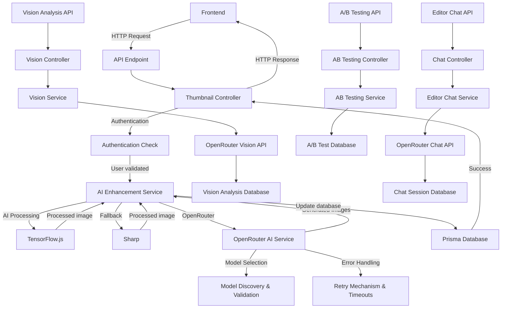

**Diagram sources**
- [thumbnail.controller.ts:57-76](file://pikzels-clone/src/modules/thumbnail/thumbnail.controller.ts#L57-L76)
- [openrouter-ai.service.ts:165-196](file://pikzels-clone/src/modules/thumbnail/openrouter-ai.service.ts#L165-L196)
- [ai-service-manager.ts:38-75](file://pikzels-clone/src/modules/thumbnail/ai-service-manager.ts#L38-L75)
- [vision.controller.ts:27-57](file://pikzels-clone/src/modules/vision/vision.controller.ts#L27-L57)
- [ab-testing.controller.ts:1-50](file://pikzels-clone/src/modules/ab-testing/ab-testing.controller.ts#L1-L50)
- [editor-chat.controller.ts:14-95](file://pikzels-clone/src/modules/editor-chat/editor-chat.controller.ts#L14-L95)
- [server.ts:215-216](file://pikzels-clone/src/server.ts#L215-L216)

**Section sources**
- [thumbnail.controller.ts:57-76](file://pikzels-clone/src/modules/thumbnail/thumbnail.controller.ts#L57-L76)
- [openrouter-ai.service.ts:165-196](file://pikzels-clone/src/modules/thumbnail/openrouter-ai.service.ts#L165-L196)
- [ai-service-manager.ts:38-75](file://pikzels-clone/src/modules/thumbnail/ai-service-manager.ts#L38-L75)
- [vision.controller.ts:27-57](file://pikzels-clone/src/modules/vision/vision.controller.ts#L27-L57)
- [ab-testing.controller.ts:1-50](file://pikzels-clone/src/modules/ab-testing/ab-testing.controller.ts#L1-L50)
- [editor-chat.controller.ts:14-95](file://pikzels-clone/src/modules/editor-chat/editor-chat.controller.ts#L14-L95)
- [server.ts:215-216](file://pikzels-clone/src/server.ts#L215-L216)

## Automated Content Generation

**New Section** The AI Enhancement Module now includes automated content generation capabilities through dedicated scripts for landing page optimization.

The system includes automated scripts that leverage OpenRouter AI services to generate realistic YouTube-style thumbnails for landing page optimization. These scripts use predefined prompts optimized for different content categories and automatically save the generated thumbnails to the client's public images directory.

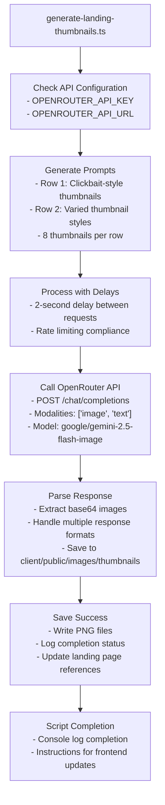

**Diagram sources**
- [generate-landing-thumbnails.ts:93-179](file://pikzels-clone/scripts/generate-landing-thumbnails.ts#L93-L179)

**Section sources**
- [generate-landing-thumbnails.ts:1-207](file://pikzels-clone/scripts/generate-landing-thumbnails.ts#L1-L207)
- [environment.ts:135-140](file://pikzels-clone/client/src/config/environment.ts#L135-L140)
- [.env.example:93-94](file://pikzels-clone/.env.example#L93-L94)

## AI Chat Client Integration

**New Section** The AI Chat System includes comprehensive client-side integration with React hooks and components for seamless user interaction.

The client-side implementation provides a complete React-based solution for interacting with the AI Chat System, including streaming hooks, action execution utilities, and rich UI components for displaying conversation history and action results.

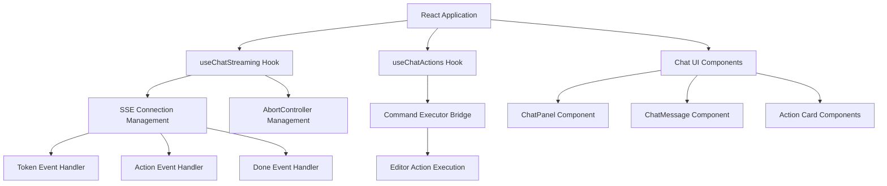

**Diagram sources**
- [useChatStreaming.ts:46-185](file://pikzels-clone/client/src/features/ai-chat/hooks/useChatStreaming.ts#L46-L185)
- [useChatActions.ts:24-54](file://pikzels-clone/client/src/features/ai-chat/hooks/useChatActions.ts#L24-L54)
- [ChatMessage.tsx:21-39](file://pikzels-clone/client/src/features/ai-chat/components/ChatMessage.tsx#L21-L39)

The client-side implementation includes:

**Streaming Hook**: Manages SSE connections, handles token streaming, processes action blocks, and manages connection lifecycle with proper error handling and abort support.

**Action Execution Hook**: Bridges chat action output to the existing editor command execution pipeline, providing status tracking and error reporting for executed actions.

**UI Components**: Rich React components for rendering chat messages, action cards, and conversation state with proper styling and user interaction support.

**Section sources**
- [useChatStreaming.ts:46-185](file://pikzels-clone/client/src/features/ai-chat/hooks/useChatStreaming.ts#L46-L185)
- [useChatActions.ts:24-54](file://pikzels-clone/client/src/features/ai-chat/hooks/useChatActions.ts#L24-L54)
- [types.ts:26-77](file://pikzels-clone/client/src/features/ai-chat/types.ts#L26-L77)
- [ChatMessage.tsx:21-39](file://pikzels-clone/client/src/features/ai-chat/components/ChatMessage.tsx#L21-L39)
- [ChatPanel.tsx:107-142](file://pikzels-clone/client/src/features/ai-chat/components/ChatPanel.tsx#L107-L142)