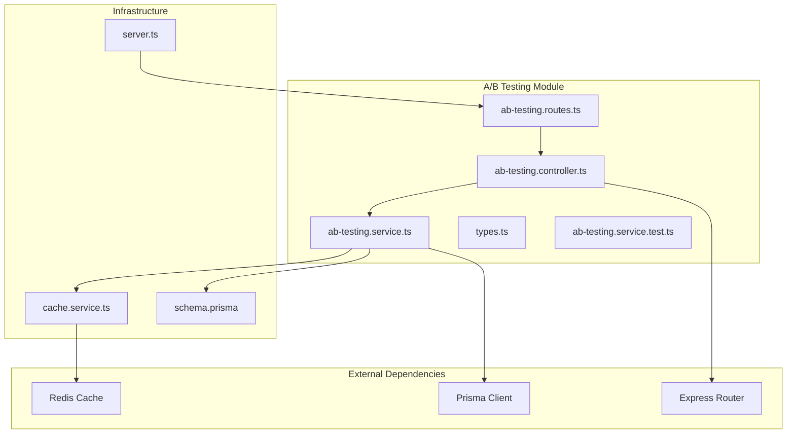
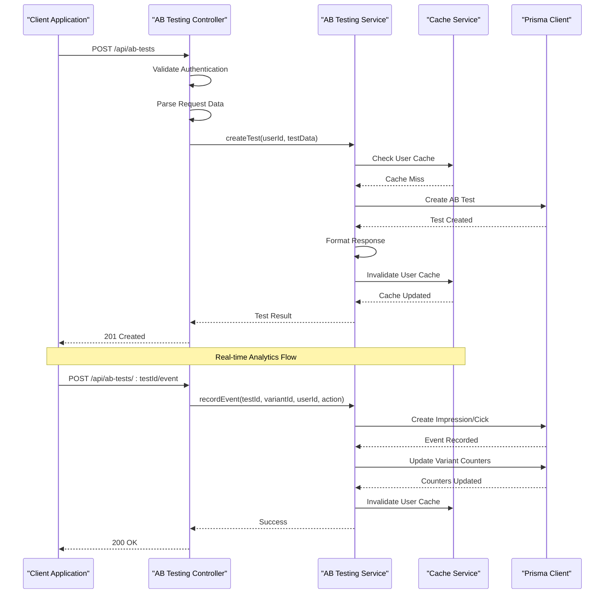
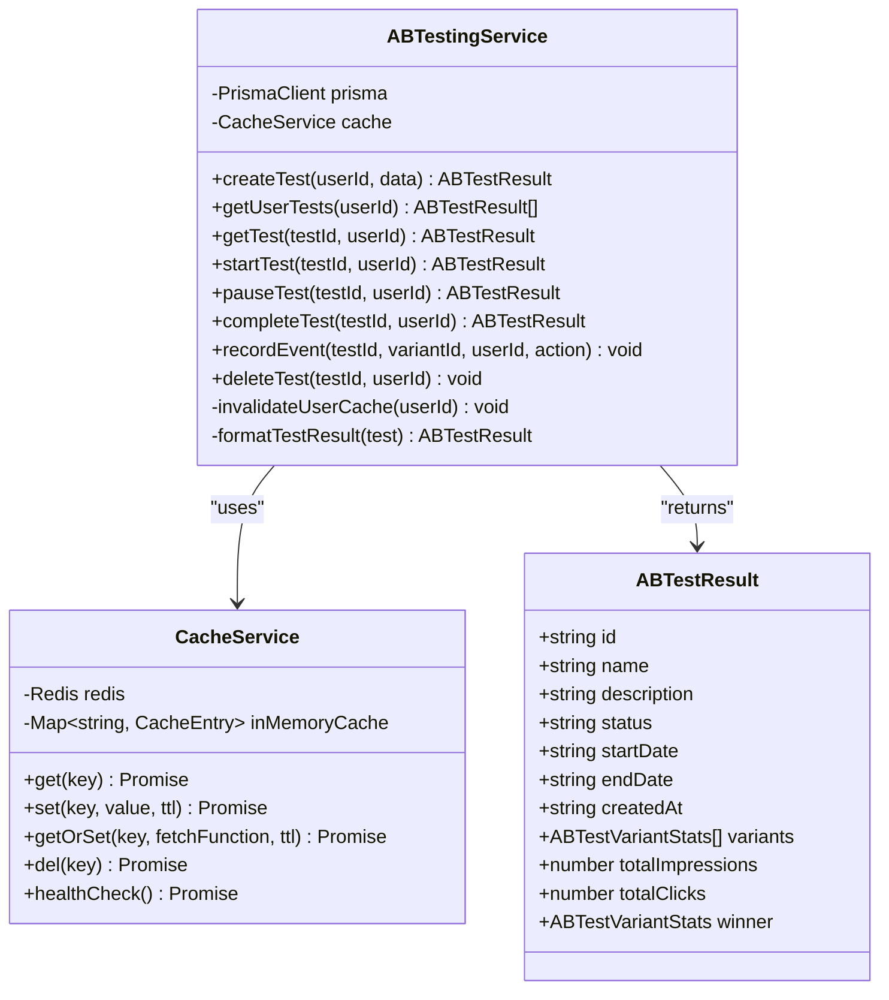
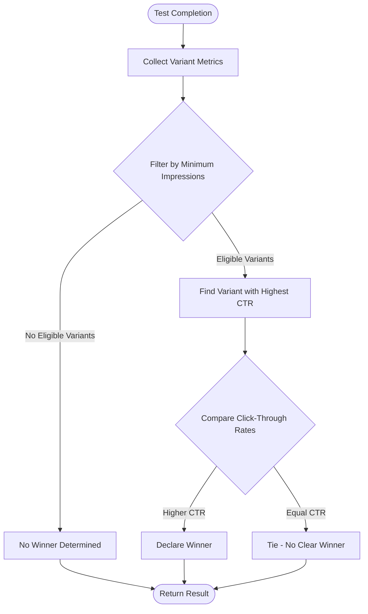
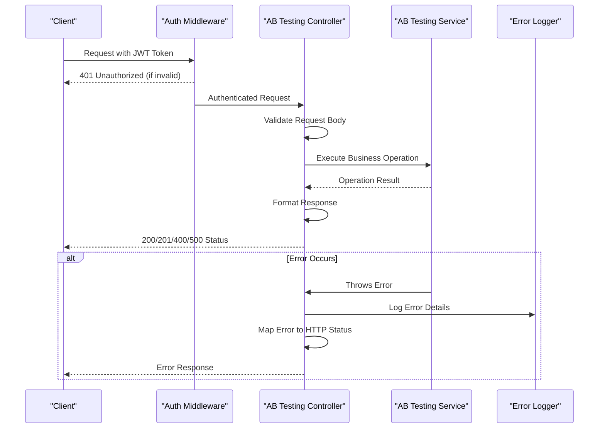
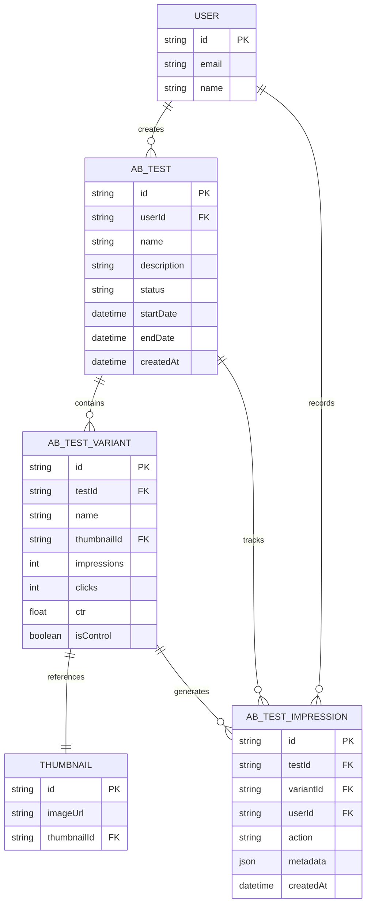
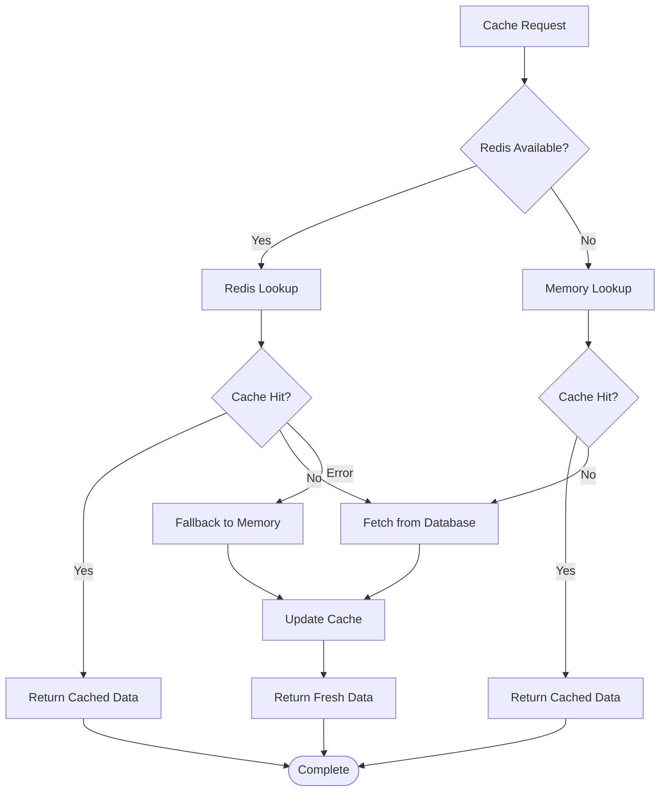
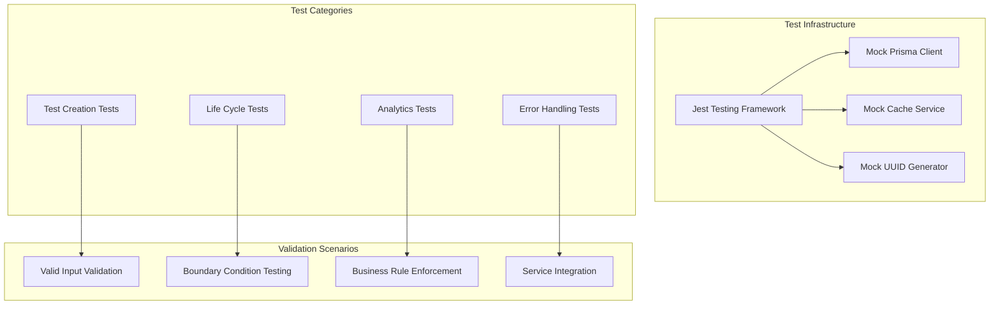

# A/B Testing Module

<cite>
**Referenced Files in This Document**
- [ab-testing.controller.ts](file://pikzels-clone/src/modules/ab-testing/ab-testing.controller.ts)
- [ab-testing.service.ts](file://pikzels-clone/src/modules/ab-testing/ab-testing.service.ts)
- [ab-testing.routes.ts](file://pikzels-clone/src/modules/ab-testing/ab-testing.routes.ts)
- [types.ts](file://pikzels-clone/src/modules/ab-testing/types.ts)
- [ab-testing.service.test.ts](file://pikzels-clone/src/modules/ab-testing/__tests__/ab-testing.service.test.ts)
- [schema.prisma](file://pikzels-clone/prisma/schema.prisma)
- [cache.service.ts](file://pikzels-clone/src/services/cache.service.ts)
- [server.ts](file://pikzels-clone/src/server.ts)
</cite>

## Update Summary
**Changes Made**
- Enhanced AB testing relationships with proper foreign key constraints and cascade deletion behaviors
- Updated schema structure with ABTest and ABTestImpression relationships in User model
- Improved data model integrity with cascading deletes for related records
- Enhanced cache invalidation strategy for user-specific test data

## Table of Contents
1. [Introduction](#introduction)
2. [Project Structure](#project-structure)
3. [Core Components](#core-components)
4. [Architecture Overview](#architecture-overview)
5. [Detailed Component Analysis](#detailed-component-analysis)
6. [Data Model and Storage](#data-model-and-storage)
7. [API Endpoints](#api-endpoints)
8. [Performance and Caching](#performance-and-caching)
9. [Testing Strategy](#testing-strategy)
10. [Security Considerations](#security-considerations)
11. [Conclusion](#conclusion)

## Introduction

The A/B Testing Module is a comprehensive feature within the Thumbnail Maker platform that enables users to conduct controlled experiments on thumbnail designs to optimize engagement metrics. This module provides a complete solution for creating, managing, and analyzing A/B tests with sophisticated analytics capabilities.

The module supports multi-variant testing with automatic control variant assignment, real-time analytics tracking, and intelligent winner determination based on statistical significance thresholds. It integrates seamlessly with the thumbnail editing system and provides robust performance monitoring through Redis caching.

**Updated** Enhanced with improved AB testing relationships including proper foreign key constraints and cascade deletion behaviors for data integrity.

## Project Structure

The A/B Testing Module follows a clean, layered architecture with clear separation of concerns:



**Diagram sources**
- [ab-testing.controller.ts](file://pikzels-clone/src/modules/ab-testing/ab-testing.controller.ts#L1-L221)
- [ab-testing.service.ts](file://pikzels-clone/src/modules/ab-testing/ab-testing.service.ts#L1-L338)
- [ab-testing.routes.ts](file://pikzels-clone/src/modules/ab-testing/ab-testing.routes.ts#L1-L43)

**Section sources**
- [ab-testing.controller.ts](file://pikzels-clone/src/modules/ab-testing/ab-testing.controller.ts#L1-L221)
- [ab-testing.service.ts](file://pikzels-clone/src/modules/ab-testing/ab-testing.service.ts#L1-L338)
- [ab-testing.routes.ts](file://pikzels-clone/src/modules/ab-testing/ab-testing.routes.ts#L1-L43)

## Core Components

### Controller Layer
The controller layer handles HTTP requests and implements comprehensive error handling with appropriate HTTP status codes. It validates authentication, processes request data, and manages error responses.

### Service Layer
The service layer contains the core business logic for A/B testing operations including test creation, lifecycle management, event recording, and analytics computation.

### Data Models
The module defines TypeScript interfaces for type safety and consistent data handling across the application.

### Testing Infrastructure
Comprehensive unit tests validate business logic, error conditions, and integration scenarios with mocked dependencies.

**Section sources**
- [ab-testing.controller.ts](file://pikzels-clone/src/modules/ab-testing/ab-testing.controller.ts#L29-L90)
- [ab-testing.service.ts](file://pikzels-clone/src/modules/ab-testing/ab-testing.service.ts#L24-L65)
- [types.ts](file://pikzels-clone/src/modules/ab-testing/types.ts#L1-L40)

## Architecture Overview

The A/B Testing Module implements a three-tier architecture with clear separation between presentation, business logic, and data persistence layers:



**Diagram sources**
- [ab-testing.controller.ts](file://pikzels-clone/src/modules/ab-testing/ab-testing.controller.ts#L29-L57)
- [ab-testing.service.ts](file://pikzels-clone/src/modules/ab-testing/ab-testing.service.ts#L24-L65)
- [cache.service.ts](file://pikzels-clone/src/services/cache.service.ts#L117-L230)

## Detailed Component Analysis

### ABTestingService Implementation

The service layer provides comprehensive A/B testing functionality with sophisticated business logic:



**Diagram sources**
- [ab-testing.service.ts](file://pikzels-clone/src/modules/ab-testing/ab-testing.service.ts#L12-L338)
- [cache.service.ts](file://pikzels-clone/src/services/cache.service.ts#L3-L352)
- [types.ts](file://pikzels-clone/src/modules/ab-testing/types.ts#L22-L34)

#### Business Logic Validation

The service enforces strict business rules for test creation:

- **Minimum Variants**: At least 2 variants required
- **Maximum Variants**: Limited to 5 variants per test
- **Control Assignment**: Automatically assigns control variant if none specified
- **Lifecycle Management**: Proper state transitions (draft → active → paused → completed)

#### Analytics Computation

The module implements intelligent winner determination:



**Diagram sources**
- [ab-testing.service.ts](file://pikzels-clone/src/modules/ab-testing/ab-testing.service.ts#L314-L321)

**Section sources**
- [ab-testing.service.ts](file://pikzels-clone/src/modules/ab-testing/ab-testing.service.ts#L24-L338)

### Controller Implementation

The controller layer provides comprehensive request handling with proper authentication and error management:



**Diagram sources**
- [ab-testing.controller.ts](file://pikzels-clone/src/modules/ab-testing/ab-testing.controller.ts#L29-L90)

**Section sources**
- [ab-testing.controller.ts](file://pikzels-clone/src/modules/ab-testing/ab-testing.controller.ts#L29-L221)

### Route Configuration

The routing system provides organized endpoint structure with authentication middleware:

| Endpoint | Method | Description | Authentication |
|----------|--------|-------------|----------------|
| `/api/ab-tests` | POST | Create new A/B test | Required |
| `/api/ab-tests` | GET | Get user's A/B tests | Required |
| `/api/ab-tests/:testId` | GET | Get specific test | Required |
| `/api/ab-tests/:testId` | DELETE | Delete test | Required |
| `/api/ab-tests/:testId/start` | POST | Start test | Required |
| `/api/ab-tests/:testId/pause` | POST | Pause test | Required |
| `/api/ab-tests/:testId/complete` | POST | Complete test | Required |
| `/api/ab-tests/:testId/event` | POST | Record event (impression/click) | Required |

**Section sources**
- [ab-testing.routes.ts](file://pikzels-clone/src/modules/ab-testing/ab-testing.routes.ts#L1-L43)

## Data Model and Storage

The A/B Testing Module utilizes a comprehensive data model with proper indexing and relationships:



**Diagram sources**
- [schema.prisma](file://pikzels-clone/prisma/schema.prisma#L334-L386)

### Database Schema Features

- **Indexes**: Strategic indexing on frequently queried fields (userId, status, createdAt, testId, variantId)
- **Cascading Deletes**: Automatic cleanup of related records when parent records are deleted
- **Foreign Key Constraints**: Maintains referential integrity across the relationship graph
- **JSON Metadata**: Flexible storage for additional event tracking data

**Updated** Enhanced with proper foreign key constraints and cascade deletion behaviors:
- ABTestVariant has `onDelete: Cascade` ensuring variants are automatically deleted when their parent test is removed
- ABTestImpression has `onDelete: Cascade` ensuring impressions are automatically cleaned up
- User model now has relationships with both ABTest and ABTestImpression for proper ownership tracking

**Section sources**
- [schema.prisma](file://pikzels-clone/prisma/schema.prisma#L334-L386)

## API Endpoints

### Test Management Endpoints

#### Create Test
**Endpoint**: `POST /api/ab-tests`
**Description**: Creates a new A/B test with specified variants
**Request Body**:
```json
{
  "name": "string",
  "description": "string",
  "variants": [
    {
      "name": "string",
      "thumbnailId": "string",
      "isControl": "boolean"
    }
  ]
}
```

#### Get User Tests
**Endpoint**: `GET /api/ab-tests`
**Description**: Retrieves all A/B tests for the authenticated user

#### Get Test Details
**Endpoint**: `GET /api/ab-tests/:testId`
**Description**: Retrieves detailed information about a specific test including analytics

#### Delete Test
**Endpoint**: `DELETE /api/ab-tests/:testId`
**Description**: Removes an A/B test (only draft or completed tests can be deleted)

### Test Lifecycle Endpoints

#### Start Test
**Endpoint**: `POST /api/ab-tests/:testId/start`
**Description**: Activates a test for user traffic allocation

#### Pause Test
**Endpoint**: `POST /api/ab-tests/:testId/pause`
**Description**: Temporarily stops test execution

#### Complete Test
**Endpoint**: `POST /api/ab-tests/:testId/complete`
**Description**: Finalizes test and determines winner

### Analytics Endpoints

#### Record Event
**Endpoint**: `POST /api/ab-tests/:testId/event`
**Description**: Records user interactions (impressions/clicks)
**Request Body**:
```json
{
  "variantId": "string",
  "action": "impression|click"
}
```

**Section sources**
- [ab-testing.controller.ts](file://pikzels-clone/src/modules/ab-testing/ab-testing.controller.ts#L29-L221)
- [ab-testing.routes.ts](file://pikzels-clone/src/modules/ab-testing/ab-testing.routes.ts#L20-L40)

## Performance and Caching

### Cache Strategy

The module implements a robust caching strategy using Redis with automatic failover to in-memory caching:



**Diagram sources**
- [cache.service.ts](file://pikzels-clone/src/services/cache.service.ts#L117-L230)

### Cache Configuration

- **User Test Cache**: TTL of 60 seconds for user-specific test lists
- **Redis Integration**: Production-grade caching with automatic retry mechanisms
- **Memory Fallback**: In-memory cache ensures system resilience during Redis outages
- **Automatic Cleanup**: Periodic cleanup of expired cache entries

**Updated** Enhanced cache invalidation strategy for improved data consistency:
- User-specific cache keys (`abtests:user:${userId}`) with 60-second TTL
- Automatic cache invalidation on test creation, updates, and deletions
- Robust fallback mechanism ensuring system reliability during Redis failures

**Section sources**
- [cache.service.ts](file://pikzels-clone/src/services/cache.service.ts#L1-L352)
- [ab-testing.service.ts](file://pikzels-clone/src/modules/ab-testing/ab-testing.service.ts#L70-L90)

## Testing Strategy

### Unit Testing Approach

The module employs comprehensive unit testing with mocking infrastructure:



**Diagram sources**
- [ab-testing.service.test.ts](file://pikzels-clone/src/modules/ab-testing/__tests__/ab-testing.service.test.ts#L1-L400)

### Test Coverage Areas

- **Business Logic**: Core A/B testing algorithms and validation rules
- **Error Conditions**: Edge cases, invalid inputs, and boundary conditions
- **Integration**: Service-to-service communication and data persistence
- **Cache Behavior**: Cache hit/miss scenarios and invalidation logic

**Section sources**
- [ab-testing.service.test.ts](file://pikzels-clone/src/modules/ab-testing/__tests__/ab-testing.service.test.ts#L46-L400)

## Security Considerations

### Authentication and Authorization

The module implements comprehensive security measures:

- **JWT Authentication**: All endpoints require valid authentication tokens
- **User Isolation**: Tests are strictly bound to user ownership
- **Input Validation**: Comprehensive request validation and sanitization
- **Rate Limiting**: Built-in rate limiting for API endpoints

### Data Protection

- **Privacy Compliance**: User data handling follows privacy best practices
- **Audit Logging**: Comprehensive logging of all test operations
- **Secure Storage**: Sensitive data encrypted at rest
- **Access Control**: Strict permission boundaries between users

**Section sources**
- [ab-testing.controller.ts](file://pikzels-clone/src/modules/ab-testing/ab-testing.controller.ts#L31-L38)
- [server.ts](file://pikzels-clone/src/server.ts#L16-L22)

## Conclusion

The A/B Testing Module represents a mature, production-ready solution for conducting controlled experiments on thumbnail designs. Its comprehensive feature set includes sophisticated analytics, robust caching, extensive testing coverage, and enterprise-grade security.

Key strengths of the implementation include:

- **Business Intelligence**: Intelligent winner determination with statistical significance
- **Performance Optimization**: Redis-backed caching with automatic failover
- **Developer Experience**: Clean architecture with comprehensive testing
- **Scalability**: Designed for high-traffic scenarios with proper indexing
- **Maintainability**: Well-structured codebase with clear separation of concerns
- **Data Integrity**: Enhanced with proper foreign key constraints and cascade deletion behaviors

**Updated** The module now features improved data model relationships with proper foreign key constraints, cascade deletion behaviors, and enhanced User model relationships for better ownership tracking and data consistency.

The module successfully integrates with the broader Thumbnail Maker ecosystem while providing specialized functionality for experimentation and optimization. Its modular design facilitates future enhancements and maintains consistency with the application's overall architecture.