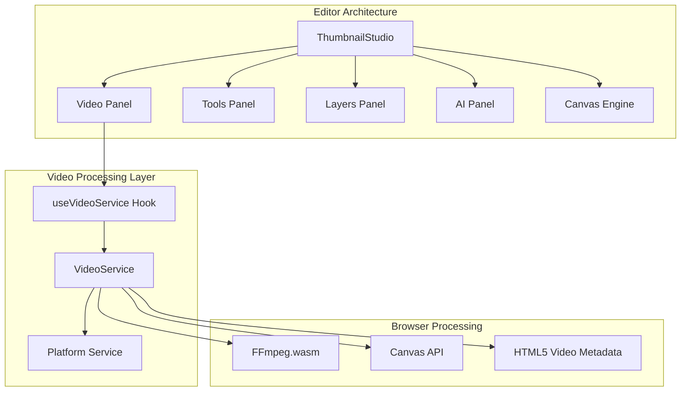
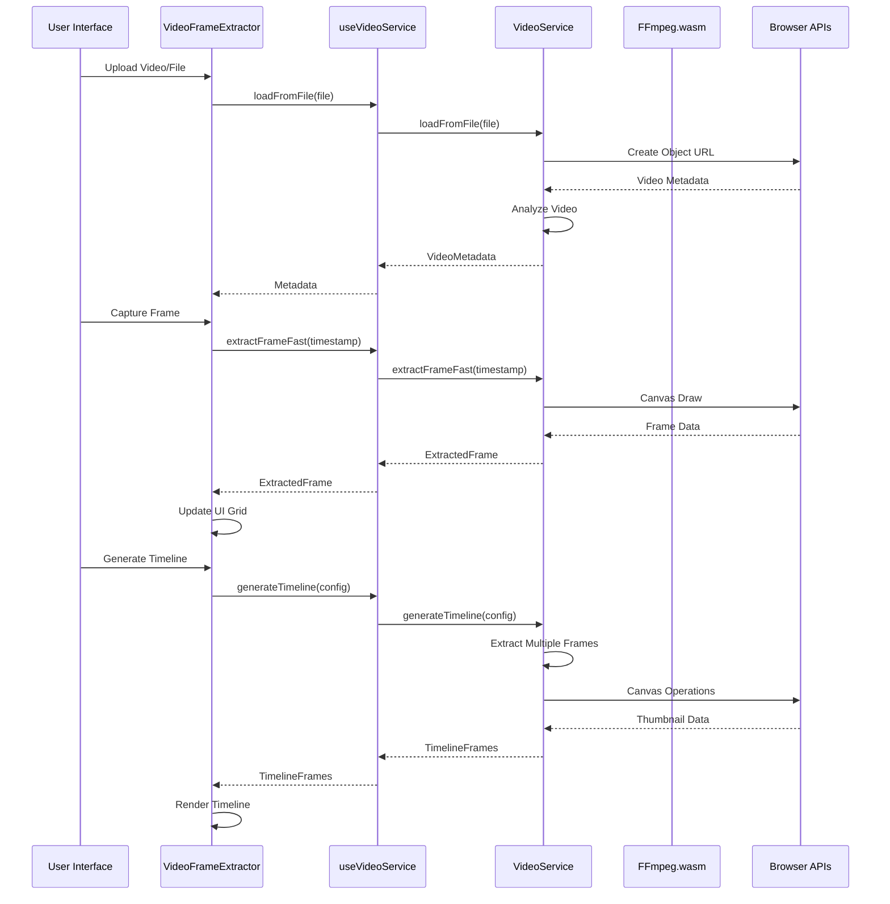
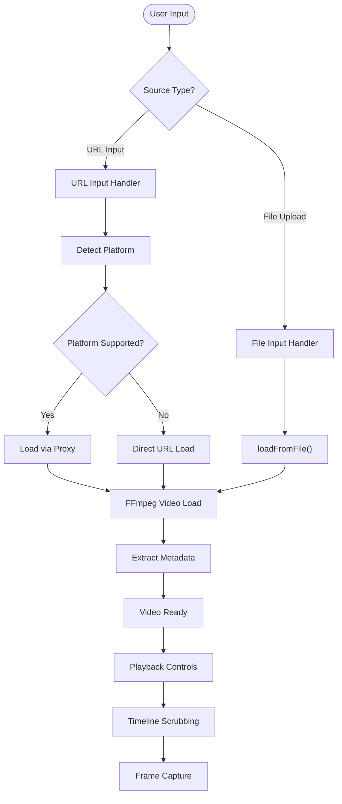
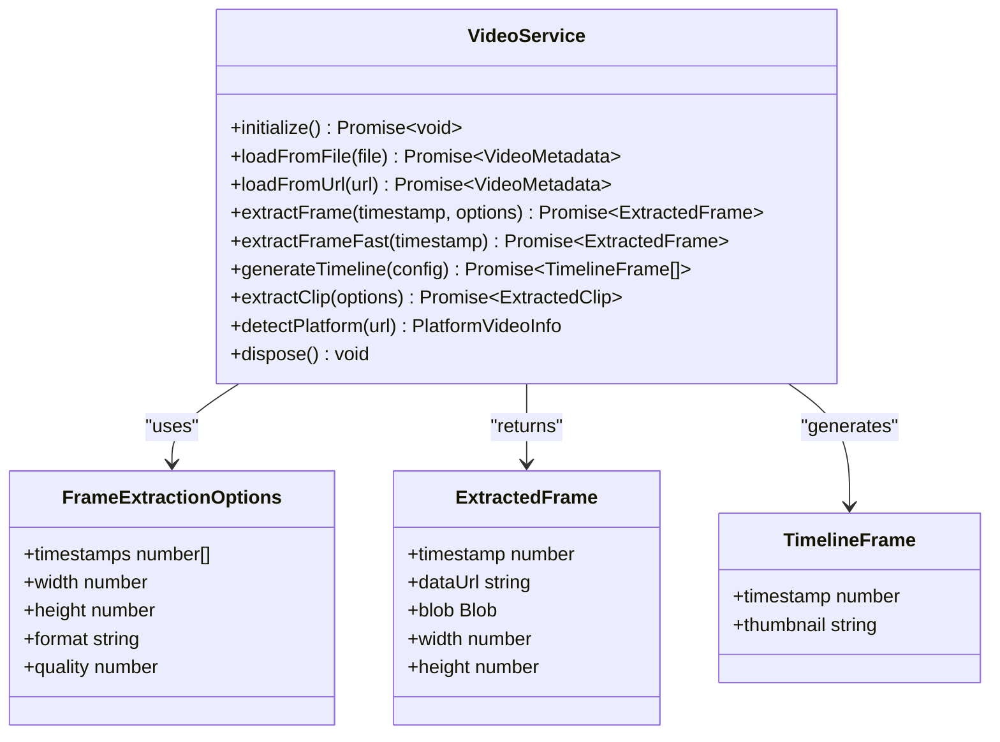
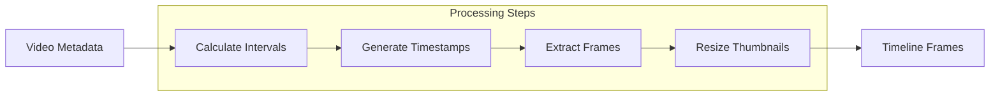
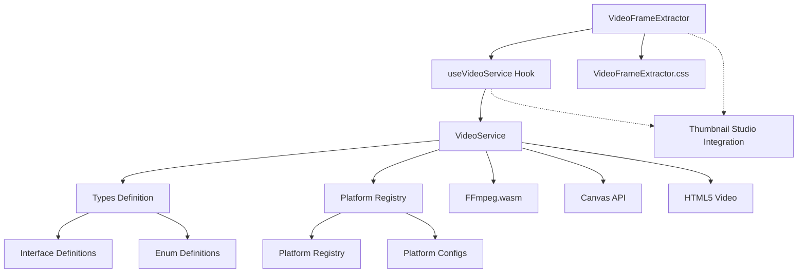

# Video Frame Extractor

<cite>
**Referenced Files in This Document**
- [VideoFrameExtractor.tsx](file://pikzels-clone/client/src/components/editor/panels/VideoFrameExtractor.tsx)
- [VideoFrameExtractor.css](file://pikzels-clone/client/src/components/editor/panels/VideoFrameExtractor.css)
- [useVideoService.ts](file://pikzels-clone/client/src/hooks/useVideoService.ts)
- [video-service.ts](file://pikzels-clone/client/src/services/video/video-service.ts)
- [types.ts](file://pikzels-clone/client/src/services/video/types.ts)
- [platforms.ts](file://pikzels-clone/client/src/services/video/platforms.ts)
- [ThumbnailStudio.tsx](file://pikzels-clone/client/src/components/editor/ThumbnailStudio.tsx)
</cite>

## Table of Contents
1. [Introduction](#introduction)
2. [Project Structure](#project-structure)
3. [Core Components](#core-components)
4. [Architecture Overview](#architecture-overview)
5. [Detailed Component Analysis](#detailed-component-analysis)
6. [Dependency Analysis](#dependency-analysis)
7. [Performance Considerations](#performance-considerations)
8. [Troubleshooting Guide](#troubleshooting-guide)
9. [Conclusion](#conclusion)

## Introduction

The Video Frame Extractor is a sophisticated React component integrated into the Thumbnail Studio editor that enables users to extract still frames from videos for use as thumbnails. Built with modern web technologies, it provides seamless support for both local video files and popular social media platforms like YouTube, TikTok, and Instagram.

The component leverages FFmpeg.wasm for browser-based video processing, eliminating the need for server-side video processing while maintaining high-quality frame extraction capabilities. It features an intuitive timeline interface, real-time playback controls, and responsive design that adapts to various screen sizes.

## Project Structure

The Video Frame Extractor is organized within the editor's panel system, integrating seamlessly with the broader Thumbnail Studio architecture:

**Diagram sources**
- [ThumbnailStudio.tsx](file://pikzels-clone/client/src/components/editor/ThumbnailStudio.tsx#L526-L531)
- [useVideoService.ts](file://pikzels-clone/client/src/hooks/useVideoService.ts#L26-L54)
- [video-service.ts](file://pikzels-clone/client/src/services/video/video-service.ts#L33-L44)

**Section sources**
- [VideoFrameExtractor.tsx](file://pikzels-clone/client/src/components/editor/panels/VideoFrameExtractor.tsx#L1-L725)
- [ThumbnailStudio.tsx](file://pikzels-clone/client/src/components/editor/ThumbnailStudio.tsx#L526-L531)

## Core Components

### VideoFrameExtractor Component

The main component serves as a comprehensive video frame extraction interface with the following key features:

**Primary Functionality:**
- Dual video source support (file upload and URL input)
- Real-time video playback with scrubbing controls
- Timeline generation with thumbnail previews
- Frame extraction with customizable options
- Responsive grid layout for captured frames

**State Management:**
- Video loading and playback state
- Extracted frame collection and selection
- Platform detection for social media URLs
- Progress tracking during processing operations

**Integration Points:**
- React hooks for state management
- Custom video service abstraction
- CSS-in-JS styling with theme support
- Event handlers for user interactions

**Section sources**
- [VideoFrameExtractor.tsx](file://pikzels-clone/client/src/components/editor/panels/VideoFrameExtractor.tsx#L163-L722)

### useVideoService Hook

The hook provides a simplified interface to the underlying VideoService, managing initialization, state synchronization, and cleanup operations:

**Key Responsibilities:**
- Service lifecycle management
- Progress callback handling
- Video loading operations
- Frame extraction methods
- Platform detection utilities

**Return Values:**
- Complete service interface with state
- Convenience methods for common operations
- Automatic cleanup on component unmount

**Section sources**
- [useVideoService.ts](file://pikzels-clone/client/src/hooks/useVideoService.ts#L26-L191)

### VideoService Implementation

The core service handles all video processing operations using FFmpeg.wasm:

**Processing Pipeline:**
- FFmpeg initialization and loading
- Video metadata extraction
- Frame extraction with scaling options
- Timeline generation with thumbnails
- Clip extraction capabilities

**Platform Integration:**
- Social media URL detection
- Proxy endpoint routing
- Platform-specific video ID extraction
- Cross-origin video loading

**Section sources**
- [video-service.ts](file://pikzels-clone/client/src/services/video/video-service.ts#L33-L631)

## Architecture Overview

The Video Frame Extractor follows a layered architecture pattern with clear separation of concerns:

**Diagram sources**
- [VideoFrameExtractor.tsx](file://pikzels-clone/client/src/components/editor/panels/VideoFrameExtractor.tsx#L207-L252)
- [useVideoService.ts](file://pikzels-clone/client/src/hooks/useVideoService.ts#L68-L122)
- [video-service.ts](file://pikzels-clone/client/src/services/video/video-service.ts#L354-L397)

The architecture ensures efficient resource utilization through lazy initialization and proper cleanup mechanisms. The service maintains a singleton pattern for optimal performance while allowing multiple components to share video processing capabilities.

**Section sources**
- [video-service.ts](file://pikzels-clone/client/src/services/video/video-service.ts#L66-L118)
- [useVideoService.ts](file://pikzels-clone/client/src/hooks/useVideoService.ts#L41-L54)

## Detailed Component Analysis

### Video Loading and Playback System

The video loading system supports multiple input sources with intelligent platform detection:

**Diagram sources**
- [VideoFrameExtractor.tsx](file://pikzels-clone/client/src/components/editor/panels/VideoFrameExtractor.tsx#L207-L252)
- [video-service.ts](file://pikzels-clone/client/src/services/video/video-service.ts#L133-L184)

The system handles cross-origin restrictions through proxy endpoints for supported platforms, ensuring reliable video loading from social media sources.

**Section sources**
- [platforms.ts](file://pikzels-clone/client/src/services/video/platforms.ts#L114-L176)
- [video-service.ts](file://pikzels-clone/client/src/services/video/video-service.ts#L144-L181)

### Frame Extraction Pipeline

The frame extraction process utilizes two distinct approaches for optimal performance:

**High-Quality Extraction:**
- Uses FFmpeg for precise frame positioning
- Supports custom dimensions and formats
- Maintains original video quality
- Suitable for final thumbnail export

**Fast Preview Extraction:**
- Leverages HTML5 Canvas API
- Provides instant frame rendering
- Optimized for timeline generation
- Lower computational overhead

**Diagram sources**
- [video-service.ts](file://pikzels-clone/client/src/services/video/video-service.ts#L264-L348)
- [types.ts](file://pikzels-clone/client/src/services/video/types.ts#L33-L47)

**Section sources**
- [video-service.ts](file://pikzels-clone/client/src/services/video/video-service.ts#L354-L397)
- [types.ts](file://pikzels-clone/client/src/services/video/types.ts#L33-L76)

### Timeline Generation System

The timeline generation creates thumbnail previews for video navigation:

**Diagram sources**
- [video-service.ts](file://pikzels-clone/client/src/services/video/video-service.ts#L403-L462)

The timeline system generates evenly spaced frames throughout the video duration, providing users with visual navigation cues and quick frame selection options.

**Section sources**
- [video-service.ts](file://pikzels-clone/client/src/services/video/video-service.ts#L403-L462)

### Platform Detection and Integration

The platform detection system supports multiple social media platforms with specialized handling:

| Platform | URL Patterns | Video ID Extraction | Proxy Endpoint |
|----------|--------------|-------------------|----------------|
| YouTube | watch?v=, embed/, shorts/ | Extracts 11-character ID | `/api/video/proxy/youtube` |
| TikTok | @username/video/, vm.tiktok.com | Extracts numeric ID | `/api/video/proxy/tiktok` |
| Instagram | instagram.com/p/, instagram.com/reel/ | Extracts alphanumeric ID | `/api/video/proxy/instagram` |
| Twitter/X | twitter.com/status/, x.com/status/ | Extracts numeric ID | `/api/video/proxy/twitter` |
| Vimeo | vimeo.com/, player.vimeo.com | Extracts numeric ID | `/api/video/proxy/vimeo` |

**Section sources**
- [platforms.ts](file://pikzels-clone/client/src/services/video/platforms.ts#L12-L108)
- [platforms.ts](file://pikzels-clone/client/src/services/video/platforms.ts#L156-L167)

## Dependency Analysis

The Video Frame Extractor has a well-defined dependency structure that promotes modularity and maintainability:

**Diagram sources**
- [VideoFrameExtractor.tsx](file://pikzels-clone/client/src/components/editor/panels/VideoFrameExtractor.tsx#L6-L13)
- [useVideoService.ts](file://pikzels-clone/client/src/hooks/useVideoService.ts#L7-L20)
- [video-service.ts](file://pikzels-clone/client/src/services/video/video-service.ts#L8-L21)

The dependency graph reveals a clean separation between presentation logic (React components), business logic (service layer), and infrastructure (browser APIs and external libraries). This architecture facilitates testing, maintenance, and future enhancements.

**Section sources**
- [types.ts](file://pikzels-clone/client/src/services/video/types.ts#L1-L155)
- [platforms.ts](file://pikzels-clone/client/src/services/video/platforms.ts#L1-L212)

## Performance Considerations

The Video Frame Extractor is designed with several performance optimizations:

**Memory Management:**
- Proper cleanup of video elements and object URLs
- Efficient canvas memory usage for frame extraction
- Progressive loading of timeline thumbnails
- Automatic garbage collection of temporary resources

**Processing Efficiency:**
- Lazy initialization of FFmpeg library
- Canvas-based extraction for real-time previews
- Optimized thumbnail generation pipeline
- Background processing with progress indicators

**Resource Optimization:**
- CDN-hosted FFmpeg core files
- Browser caching of processed frames
- Efficient DOM manipulation
- Minimal re-rendering through proper state management

**Section sources**
- [video-service.ts](file://pikzels-clone/client/src/services/video/video-service.ts#L558-L565)
- [video-service.ts](file://pikzels-clone/client/src/services/video/video-service.ts#L76-L114)

## Troubleshooting Guide

Common issues and their solutions:

**FFmpeg Loading Failures:**
- **Symptom:** FFmpeg fails to load with timeout errors
- **Solution:** Check network connectivity and CDN accessibility
- **Prevention:** Implement retry logic and fallback mechanisms

**Cross-Origin Issues:**
- **Symptom:** Videos from social media platforms fail to load
- **Solution:** Verify proxy endpoints are configured correctly
- **Prevention:** Test platform URLs before integration

**Memory Leaks:**
- **Symptom:** Browser performance degrades over time
- **Solution:** Ensure proper cleanup in component unmount
- **Prevention:** Always call dispose() on service instances

**Frame Extraction Errors:**
- **Symptom:** Frames appear corrupted or incomplete
- **Solution:** Verify timestamp validity and video availability
- **Prevention:** Validate input parameters before extraction

**Section sources**
- [video-service.ts](file://pikzels-clone/client/src/services/video/video-service.ts#L105-L113)
- [video-service.ts](file://pikzels-clone/client/src/services/video/video-service.ts#L251-L254)

## Conclusion

The Video Frame Extractor represents a sophisticated implementation of browser-based video processing capabilities. Its modular architecture, comprehensive platform support, and performance optimizations make it an essential component of the Thumbnail Studio editor ecosystem.

The component successfully bridges the gap between user-friendly video editing and powerful browser-based processing, enabling creators to extract high-quality frames from diverse video sources. The clean separation of concerns, robust error handling, and extensible design ensure maintainability and future scalability.

Through careful consideration of performance, usability, and integration requirements, the Video Frame Extractor provides a solid foundation for advanced video editing workflows within the broader Thumbnail Maker platform.