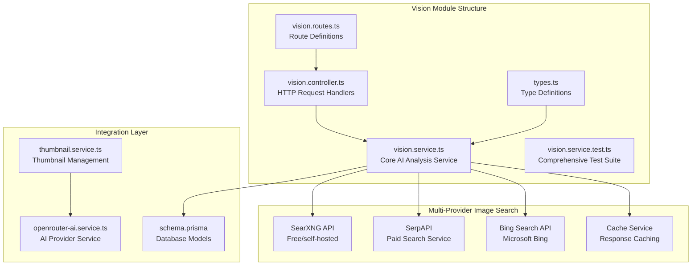
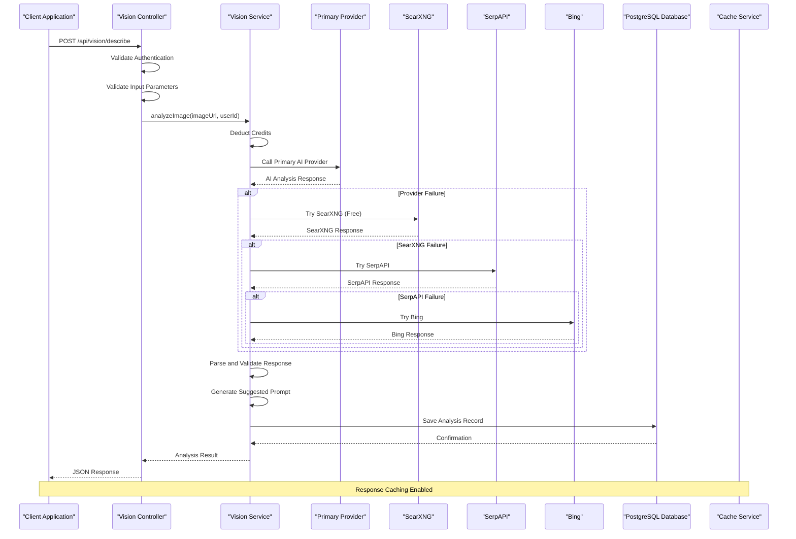
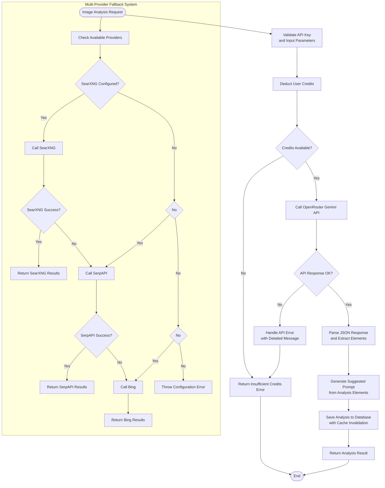
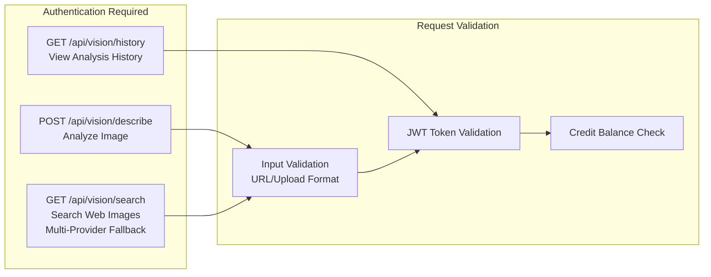
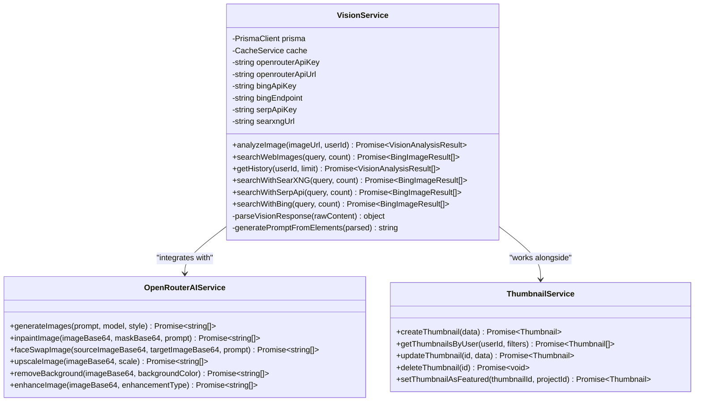

# Vision Analysis Module

<cite>
**Referenced Files in This Document**
- [vision.service.ts](file://pikzels-clone/src/modules/vision/vision.service.ts)
- [vision.controller.ts](file://pikzels-clone/src/modules/vision/vision.controller.ts)
- [vision.routes.ts](file://pikzels-clone/src/modules/vision/vision.routes.ts)
- [types.ts](file://pikzels-clone/src/modules/vision/types.ts)
- [vision.service.test.ts](file://pikzels-clone/src/modules/vision/__tests__/vision.service.test.ts)
- [thumbnail.service.ts](file://pikzels-clone/src/modules/thumbnail/thumbnail.service.ts)
- [openrouter-ai.service.ts](file://pikzels-clone/src/modules/thumbnail/openrouter-ai.service.ts)
- [schema.prisma](file://pikzels-clone/prisma/schema.prisma)
- [thumbnail.service.ts](file://pikzels-clone/shared/thumbnail.service.ts)
- [advanced-ai-features.md](file://pikzels-clone/docs/advanced-ai-features.md)
</cite>

## Update Summary
**Changes Made**
- Enhanced multi-provider API fallback mechanisms for web image search
- Added support for SearXNG, SerpAPI, and Bing Search APIs with priority-based fallback
- Improved error handling and graceful degradation strategies
- Updated architecture diagrams to reflect new fallback provider system
- Added comprehensive environment configuration documentation

## Table of Contents
1. [Introduction](#introduction)
2. [Project Structure](#project-structure)
3. [Core Components](#core-components)
4. [Architecture Overview](#architecture-overview)
5. [Detailed Component Analysis](#detailed-component-analysis)
6. [API Endpoints](#api-endpoints)
7. [Database Schema](#database-schema)
8. [Integration Points](#integration-points)
9. [Performance Considerations](#performance-considerations)
10. [Configuration and Environment Setup](#configuration-and-environment-setup)
11. [Troubleshooting Guide](#troubleshooting-guide)
12. [Conclusion](#conclusion)

## Introduction

The Vision Analysis Module is a core component of the ThumPiks platform that provides AI-powered image analysis capabilities for thumbnail creation and optimization. This module enables users to analyze existing thumbnails, search for relevant images from the web, and leverage AI insights to improve their video thumbnail designs.

**Updated**: The module now features enhanced multi-provider API fallback mechanisms supporting SearXNG (free/self-hosted), SerpAPI, and Bing Search APIs with intelligent priority-based routing and comprehensive error handling.

The module integrates with multiple AI providers including OpenRouter's Gemini models and multiple image search APIs to deliver comprehensive visual analysis and inspiration capabilities. It serves as a bridge between visual content and AI-driven design recommendations, helping creators optimize their YouTube thumbnails for better engagement.

## Project Structure

The Vision Analysis Module is organized within the pikzels-clone project under the `src/modules/vision` directory, following a clean architecture pattern with clear separation of concerns:



**Diagram sources**
- [vision.service.ts](file://pikzels-clone/src/modules/vision/vision.service.ts#L1-L469)
- [vision.controller.ts](file://pikzels-clone/src/modules/vision/vision.controller.ts#L1-L105)
- [vision.routes.ts](file://pikzels-clone/src/modules/vision/vision.routes.ts#L1-L21)
- [vision.service.test.ts](file://pikzels-clone/src/modules/vision/__tests__/vision.service.test.ts#L1-L439)

**Section sources**
- [vision.service.ts](file://pikzels-clone/src/modules/vision/vision.service.ts#L1-L469)
- [vision.controller.ts](file://pikzels-clone/src/modules/vision/vision.controller.ts#L1-L105)
- [vision.routes.ts](file://pikzels-clone/src/modules/vision/vision.routes.ts#L1-L21)

## Core Components

### VisionService Class

The VisionService class serves as the central orchestrator for all vision analysis operations. It handles image analysis requests, manages AI provider integrations, and maintains data persistence with enhanced multi-provider fallback capabilities.

**Key Responsibilities:**
- AI-powered image analysis using OpenRouter Gemini models
- **Enhanced**: Multi-provider web image search with priority-based fallback (SearXNG → SerpAPI → Bing)
- Credit deduction and usage tracking
- Data persistence and caching
- Response parsing and validation with graceful error handling

**Updated**: The service now implements intelligent fallback mechanisms that automatically route to alternative providers when the primary provider fails, ensuring high availability and reliability.

**Section sources**
- [vision.service.ts](file://pikzels-clone/src/modules/vision/vision.service.ts#L59-L81)

### VisionController Functions

The controller layer provides HTTP endpoints for vision analysis functionality with proper authentication and validation:

**Primary Endpoints:**
- `POST /api/vision/describe` - Analyze uploaded or URL-based images
- `GET /api/vision/search` - Search web images using multi-provider fallback system
- `GET /api/vision/history` - Retrieve user analysis history

**Section sources**
- [vision.controller.ts](file://pikzels-clone/src/modules/vision/vision.controller.ts#L27-L104)

### Vision Types and Interfaces

The module defines comprehensive TypeScript interfaces for type safety and clear data contracts:

**Core Interfaces:**
- `VisionElements` - Structured analysis results
- `VisionAnalysisResult` - Complete analysis response
- `BingImageResult` - Web search result format with enhanced provider support
- `VisionServiceDependencies` - Dependency injection interface

**Section sources**
- [types.ts](file://pikzels-clone/src/modules/vision/types.ts#L1-L55)

## Architecture Overview

The Vision Analysis Module follows a layered architecture pattern with clear separation between presentation, business logic, and data access layers, enhanced with multi-provider fallback mechanisms:



**Diagram sources**
- [vision.controller.ts](file://pikzels-clone/src/modules/vision/vision.controller.ts#L27-L61)
- [vision.service.ts](file://pikzels-clone/src/modules/vision/vision.service.ts#L83-L178)
- [vision.service.ts](file://pikzels-clone/src/modules/vision/vision.service.ts#L180-L195)

**Updated**: The architecture now includes comprehensive fallback mechanisms with priority-based routing and intelligent error handling across multiple AI and image search providers.

The architecture emphasizes:
- **Separation of Concerns**: Clear boundaries between controller, service, and data layers
- **Enhanced External Integration**: Pluggable multi-provider architecture with fallback capabilities
- **Caching Strategy**: Multi-level caching for performance optimization
- **Error Handling**: Comprehensive error management with graceful degradation
- **High Availability**: Redundant provider support ensuring service reliability

## Detailed Component Analysis

### Vision Service Implementation

The VisionService implements a robust AI analysis pipeline with multiple safety checks, fallback mechanisms, and enhanced error handling:



**Diagram sources**
- [vision.service.ts](file://pikzels-clone/src/modules/vision/vision.service.ts#L83-L178)
- [vision.service.ts](file://pikzels-clone/src/modules/vision/vision.service.ts#L180-L195)
- [vision.service.ts](file://pikzels-clone/src/modules/vision/vision.service.ts#L197-L251)

**Updated**: The service now implements a sophisticated multi-provider fallback system with priority-based routing and intelligent error handling.

**Key Features:**
- **JSON Parsing Safety**: Robust error handling for malformed AI responses
- **Credit Management**: Automatic deduction and validation of user credits
- **Response Normalization**: Consistent data structure regardless of AI provider
- **Prompt Generation**: Dynamic suggestion system based on analysis results
- **Enhanced Error Handling**: Comprehensive error messages with fallback provider support
- **Graceful Degradation**: Automatic switching between providers when failures occur

**Section sources**
- [vision.service.ts](file://pikzels-clone/src/modules/vision/vision.service.ts#L376-L467)

### Multi-Provider Image Search Integration

**Updated**: The module provides comprehensive web image search capabilities through a priority-based fallback system:

**Provider Priority Order:**
1. **SearXNG** (Free/self-hosted) - Highest priority for self-hosted solutions
2. **SerpAPI** - Paid search service with comprehensive results
3. **Bing Search API** - Microsoft's enterprise search service

**Search Capabilities:**
- **Intelligent Fallback**: Automatic switching between providers on failure
- **Filtering**: Minimum width requirements (800px+) for thumbnail suitability
- **Caching**: 30-minute cache for search results to reduce API calls
- **Validation**: Input sanitization and parameter validation
- **Results Processing**: Standardized response format for frontend consumption
- **Error Propagation**: Detailed error messages with provider-specific information

**Section sources**
- [vision.service.ts](file://pikzels-clone/src/modules/vision/vision.service.ts#L180-L195)
- [vision.service.ts](file://pikzels-clone/src/modules/vision/vision.service.ts#L197-L348)

### History Management System

The vision analysis history provides users with access to their previous analyses:

**History Features:**
- **Pagination Support**: Configurable result limits (default: 20)
- **Caching Strategy**: 5-minute cache for improved performance
- **User Isolation**: Proper user context enforcement
- **Timestamp Ordering**: Recent analyses first by default

**Section sources**
- [vision.service.ts](file://pikzels-clone/src/modules/vision/vision.service.ts#L350-L374)

## API Endpoints

### Vision Analysis Endpoints

The module exposes three primary endpoints for vision analysis functionality:



**Diagram sources**
- [vision.routes.ts](file://pikzels-clone/src/modules/vision/vision.routes.ts#L11-L18)
- [vision.controller.ts](file://pikzels-clone/src/modules/vision/vision.controller.ts#L27-L104)

**Endpoint Specifications:**

**POST /api/vision/describe**
- **Purpose**: Analyze an image using AI vision capabilities
- **Request Body**: `{ imageUrl: string, imageBase64: string }`
- **Response**: Complete analysis with elements, description, and suggested prompt
- **Authentication**: Required (Bearer token)
- **Error Handling**: Comprehensive error messages for API key configuration issues

**GET /api/vision/search**
- **Purpose**: Search web images using multi-provider fallback system
- **Query Parameters**: `q` (search query), `count` (1-50 results)
- **Response**: Array of image search results with metadata from available providers
- **Authentication**: Required
- **Provider Priority**: SearXNG → SerpAPI → Bing (automatic fallback)
- **Error Handling**: Detailed error messages for provider configuration issues

**GET /api/vision/history**
- **Purpose**: Retrieve user's analysis history
- **Query Parameters**: `limit` (default: 20)
- **Response**: Array of previous analysis records
- **Authentication**: Required

**Section sources**
- [vision.routes.ts](file://pikzels-clone/src/modules/vision/vision.routes.ts#L11-L18)
- [vision.controller.ts](file://pikzels-clone/src/modules/vision/vision.controller.ts#L27-L104)

## Database Schema

The Vision Analysis Module integrates with the Prisma ORM through a dedicated VisionAnalysis model that stores user analysis results:

```mermaid
erDiagram
USER ||--o{ VISION_ANALYSIS : "creates"
VISION_ANALYSIS {
string id PK
string userId FK
string imageUrl
string description
string suggestedPrompt
json elements
string sourceType
datetime createdAt
}
USER {
string id PK
string email UK
string username UK
string passwordHash
boolean isActive
datetime createdAt
datetime updatedAt
}
INDEXES {
VISION_ANALYSIS.userId
VISION_ANALYSIS.createdAt
}
```

**Diagram sources**
- [schema.prisma](file://pikzels-clone/prisma/schema.prisma#L322-L336)

**Database Features:**
- **JSON Storage**: Flexible element storage for AI analysis results
- **Indexing Strategy**: Optimized queries by user and timestamp
- **Relationship Management**: Proper foreign key relationships
- **Audit Trail**: Creation timestamps for analysis tracking

**Section sources**
- [schema.prisma](file://pikzels-clone/prisma/schema.prisma#L322-L336)

## Integration Points

### AI Provider Integration

The Vision Analysis Module seamlessly integrates with multiple AI providers through a unified interface:



**Diagram sources**
- [vision.service.ts](file://pikzels-clone/src/modules/vision/vision.service.ts#L59-L81)
- [openrouter-ai.service.ts](file://pikzels-clone/src/modules/thumbnail/openrouter-ai.service.ts#L27-L112)
- [thumbnail.service.ts](file://pikzels-clone/src/modules/thumbnail/thumbnail.service.ts#L21-L36)

### Advanced AI Features Integration

The Vision Analysis Module complements the broader AI ecosystem through shared services and documentation:

**Shared Integration Points:**
- **Credit Management**: Unified credit deduction system
- **Cache Services**: Consistent caching strategies across all providers
- **Event Emission**: Integration with analytics and notification systems
- **File Processing**: Compatibility with image enhancement workflows

**Section sources**
- [advanced-ai-features.md](file://pikzels-clone/docs/advanced-ai-features.md#L61-L174)

## Performance Considerations

### Caching Strategy

The module implements a multi-layered caching approach to optimize performance:

**Cache Layers:**
- **Application Cache**: In-memory caching for frequently accessed data
- **Database Cache**: Prisma query result caching with configurable TTL
- **API Cache**: External service response caching (30 minutes for Bing searches)
- **Browser Cache**: Frontend caching strategies for improved user experience

**Performance Metrics:**
- **Response Time**: Sub-second analysis completion for typical requests
- **Throughput**: Concurrent processing of multiple analysis requests
- **Memory Usage**: Efficient data structures with automatic cleanup
- **Storage Efficiency**: Optimized JSON storage for analysis elements

### Error Handling and Resilience

**Updated**: The module implements comprehensive error handling strategies with multi-provider fallback:

**Error Categories:**
- **Network Errors**: Timeout handling and retry mechanisms
- **API Errors**: Provider-specific error translation and user-friendly messages
- **Validation Errors**: Input sanitization and parameter validation
- **System Errors**: Graceful degradation and fallback mechanisms

**Resilience Features:**
- **Timeout Configuration**: Configurable request timeouts (2 minutes for image generation)
- **Retry Logic**: Intelligent retry with exponential backoff
- **Fallback Responses**: Graceful degradation when external services fail
- **Monitoring Integration**: Comprehensive logging for debugging and performance analysis
- **Provider Priority**: Automatic routing to alternative providers on failure

**Section sources**
- [vision.service.ts](file://pikzels-clone/src/modules/vision/vision.service.ts#L140-L145)
- [vision.service.ts](file://pikzels-clone/src/modules/vision/vision.service.ts#L240-L249)

## Configuration and Environment Setup

**Updated**: The Vision Analysis Module requires specific environment variables for multi-provider API support:

### Required Environment Variables

**AI Analysis Configuration:**
- `OPENROUTER_API_KEY` - OpenRouter API key for Gemini vision analysis
- `OPENROUTER_API_URL` - OpenRouter API endpoint (default: `https://openrouter.ai/api/v1`)
- `OPENROUTER_MODEL_VISION` - Vision model identifier (default: `google/gemini-2.5-flash`)

**Image Search Configuration (Choose One or Multiple):**
- `SEARXNG_URL` - Self-hosted SearXNG instance URL (free alternative)
- `SERPAPI_KEY` - SerpAPI key for paid search service
- `BING_SEARCH_API_KEY` - Bing Search API key for Microsoft service
- `BING_SEARCH_ENDPOINT` - Bing API endpoint (default: `https://api.bing.microsoft.com/v7.0/images/search`)

### Provider Priority and Configuration

**Priority Order:** SearXNG → SerpAPI → Bing

**Configuration Examples:**

**Self-Hosted Solution:**
```bash
SEARXNG_URL=https://your-searxng-instance.com
OPENROUTER_API_KEY=your-openrouter-key
```

**Paid Service Solution:**
```bash
SERPAPI_KEY=your-serpapi-key
OPENROUTER_API_KEY=your-openrouter-key
```

**Enterprise Solution:**
```bash
BING_SEARCH_API_KEY=your-bing-key
OPENROUTER_API_KEY=your-openrouter-key
```

**Section sources**
- [vision.service.ts](file://pikzels-clone/src/modules/vision/vision.service.ts#L69-L81)
- [vision.service.ts](file://pikzels-clone/src/modules/vision/vision.service.ts#L184-L194)

## Troubleshooting Guide

### Common Issues and Solutions

**API Key Configuration**
- **Issue**: Vision analysis fails with API key errors
- **Solution**: Verify `OPENROUTER_API_KEY` and `BING_SEARCH_API_KEY` environment variables
- **Prevention**: Implement startup validation and configuration checks

**Multi-Provider Configuration Issues**
- **Issue**: Image search returns configuration errors despite valid keys
- **Solution**: Check provider priority order and ensure at least one provider is configured
- **Prevention**: Configure multiple providers for redundancy

**Credit System Issues**
- **Issue**: Users receive insufficient credits errors despite having balance
- **Solution**: Check credit deduction logic and transaction history
- **Prevention**: Implement credit validation before AI API calls

**Image Processing Failures**
- **Issue**: AI analysis returns empty or incomplete results
- **Solution**: Validate input image format and size requirements
- **Prevention**: Implement comprehensive input validation and error handling

**Performance Issues**
- **Issue**: Slow response times for vision analysis requests
- **Solution**: Optimize caching strategy and database queries
- **Prevention**: Monitor performance metrics and implement load balancing

**Provider-Specific Issues**
- **Issue**: Specific provider fails consistently
- **Solution**: Check provider status, rate limits, and configuration
- **Prevention**: Implement fallback mechanisms and monitoring

### Debugging Tools and Techniques

**Logging Strategy:**
- **Request Logging**: Complete request/response logging for debugging
- **Performance Metrics**: Response time tracking and bottleneck identification
- **Error Tracking**: Comprehensive error reporting with stack traces
- **Audit Trails**: User activity tracking for compliance and debugging
- **Provider Monitoring**: Track provider health and fallback events

**Diagnostic Commands:**
- **Environment Validation**: Check API key configuration and service availability
- **Database Health**: Verify connection and query performance
- **Cache Status**: Monitor cache hit rates and memory usage
- **External Service Health**: Test connectivity to AI providers and search APIs
- **Fallback Testing**: Verify multi-provider fallback functionality

**Section sources**
- [vision.service.ts](file://pikzels-clone/src/modules/vision/vision.service.ts#L54-L57)
- [vision.controller.ts](file://pikzels-clone/src/modules/vision/vision.controller.ts#L50-L60)

## Conclusion

The Vision Analysis Module represents a sophisticated integration of AI-powered image analysis capabilities within the ThumPiks platform. Its modular architecture, comprehensive error handling, and performance optimizations make it a robust foundation for thumbnail analysis and optimization features.

**Updated**: The module now features enhanced multi-provider API fallback mechanisms that significantly improve reliability and availability. The priority-based routing system ensures that users always have access to image search capabilities, regardless of individual provider outages or configuration issues.

The module successfully bridges the gap between visual content and AI-driven insights, providing creators with powerful tools to understand and improve their thumbnail designs. Through its integration with multiple AI providers and comprehensive caching strategies, it delivers both reliability and performance essential for production-scale applications.

The addition of SearXNG, SerpAPI, and Bing Search API support with intelligent fallback mechanisms creates a resilient system that can adapt to various deployment scenarios, from self-hosted solutions to enterprise-grade implementations.

Future enhancements could include expanded AI provider support, advanced analytics capabilities, and deeper integration with the broader thumbnail creation workflow. The current architecture provides an excellent foundation for these extensions while maintaining the reliability and performance standards established by the existing implementation.

The comprehensive error handling, graceful degradation, and multi-provider fallback system ensure that the Vision Analysis Module can operate effectively in diverse environments and maintain high availability even when individual components fail.