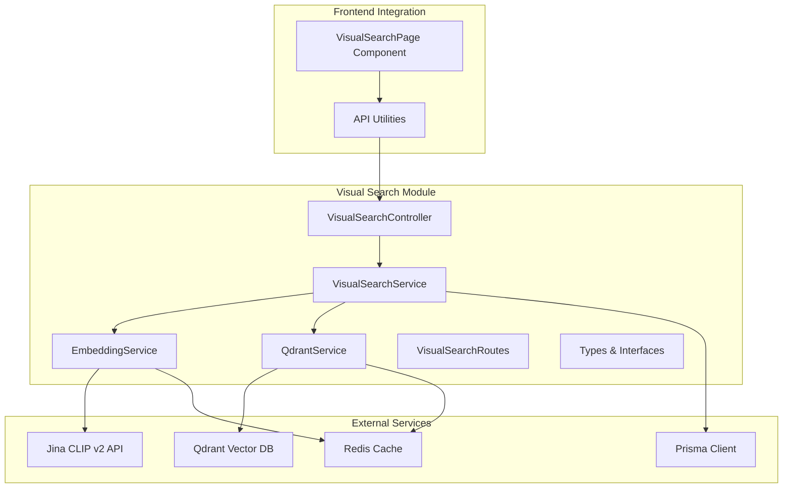
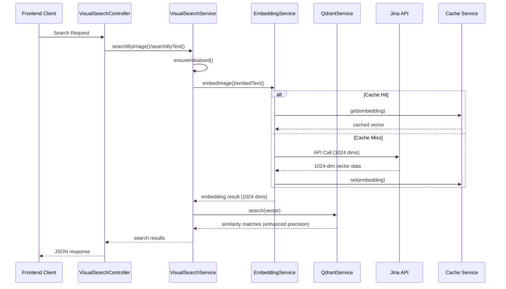
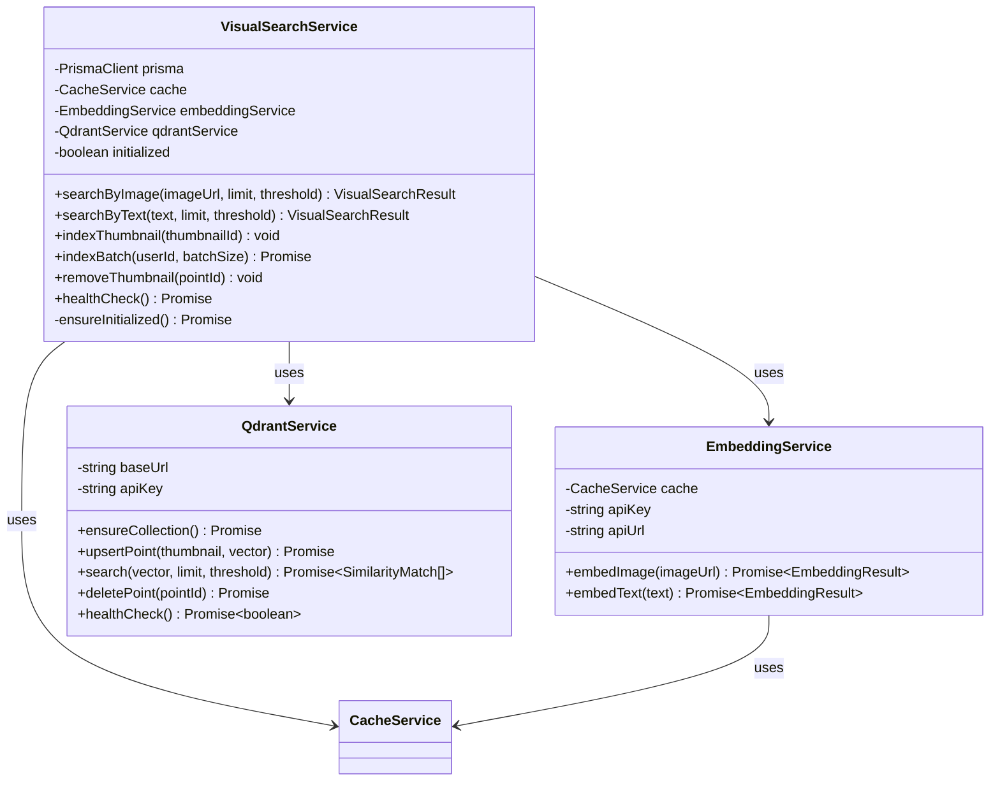
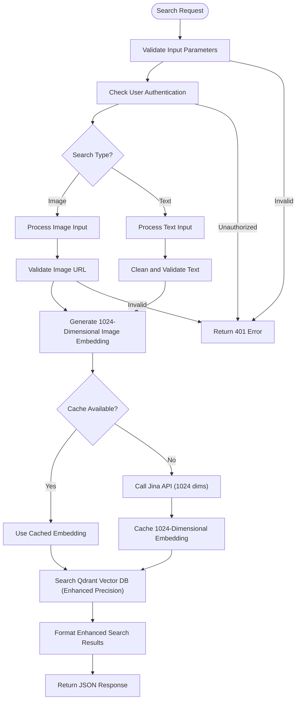
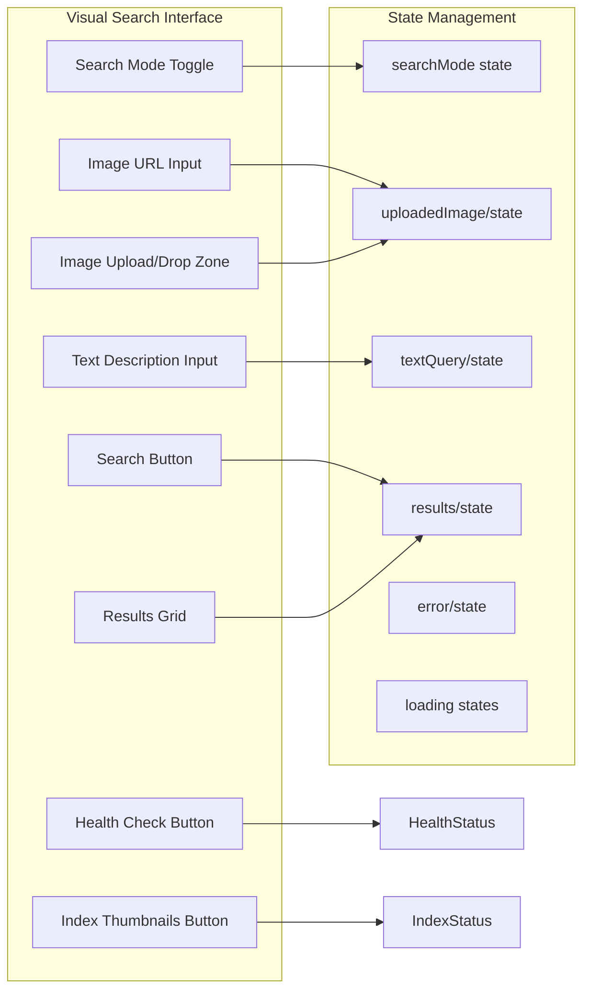
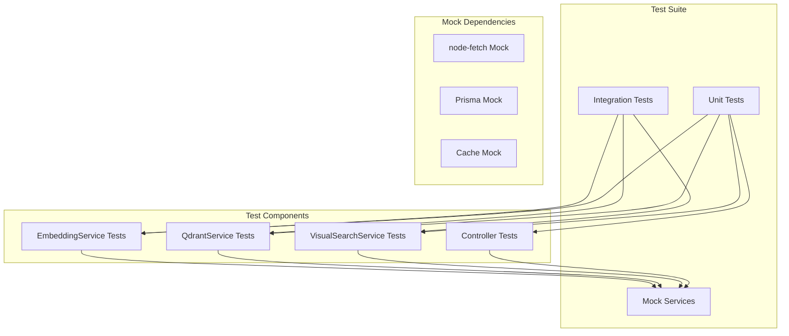
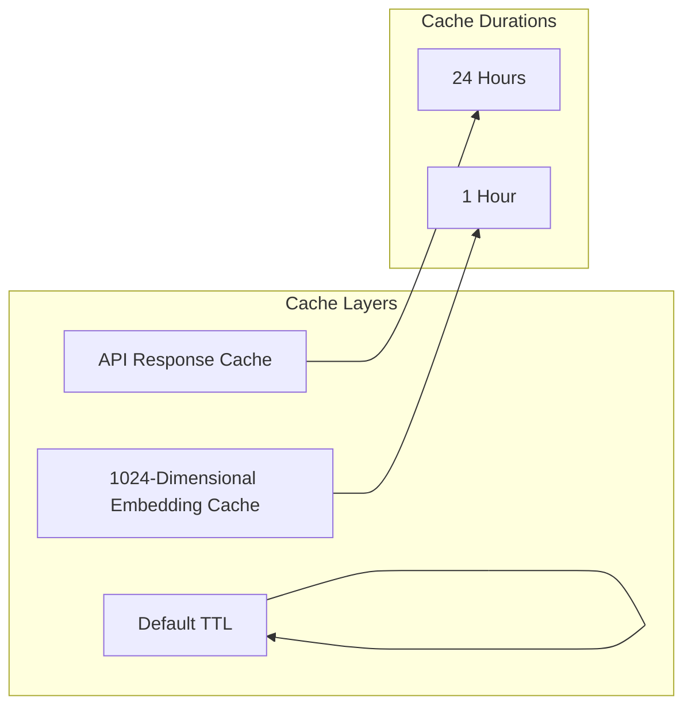

# Visual Search Module

<cite>
**Referenced Files in This Document**
- [visual-search.service.ts](file://pikzels-clone/src/modules/visual-search/visual-search.service.ts)
- [embedding.service.ts](file://pikzels-clone/src/modules/visual-search/embedding.service.ts)
- [qdrant.service.ts](file://pikzels-clone/src/modules/visual-search/qdrant.service.ts)
- [visual-search.controller.ts](file://pikzels-clone/src/modules/visual-search/visual-search.controller.ts)
- [visual-search.routes.ts](file://pikzels-clone/src/modules/visual-search/visual-search.routes.ts)
- [types.ts](file://pikzels-clone/src/modules/visual-search/types.ts)
- [VisualSearchPage.tsx](file://pikzels-clone/client/src/components/dashboard/VisualSearchPage.tsx)
- [.env](file://pikzels-clone/.env)
- [package.json](file://pikzels-clone/package.json)
- [visual-search.service.test.ts](file://pikzels-clone/src/modules/visual-search/__tests__/visual-search.service.test.ts)
</cite>

## Update Summary
**Changes Made**
- Updated vector dimension from 768 to 1024 dimensions to reflect Jina CLIP v2 upgrade
- Modified Qdrant collection configuration to use 1024-dimensional vectors
- Updated frontend display to show 1024 dimensions
- Updated test expectations to reflect new vector dimensions
- Enhanced documentation to reflect the vector dimension upgrade

## Table of Contents
1. [Introduction](#introduction)
2. [Project Structure](#project-structure)
3. [Core Components](#core-components)
4. [Architecture Overview](#architecture-overview)
5. [Detailed Component Analysis](#detailed-component-analysis)
6. [API Endpoints](#api-endpoints)
7. [Frontend Integration](#frontend-integration)
8. [Configuration and Dependencies](#configuration-and-dependencies)
9. [Testing Strategy](#testing-strategy)
10. [Performance Considerations](#performance-considerations)
11. [Troubleshooting Guide](#troubleshooting-guide)
12. [Conclusion](#conclusion)

## Introduction

The Visual Search Module is a sophisticated AI-powered thumbnail discovery system that enables users to find visually similar thumbnails using both image-based and text-based queries. Built with modern web technologies, this module leverages cutting-edge AI embedding technology to provide accurate visual similarity search capabilities.

**Updated** The system now utilizes Jina CLIP v2 for generating 1024-dimensional embeddings, representing a significant upgrade from the previous 768-dimensional embeddings. This enhancement provides improved visual similarity detection and more nuanced thumbnail matching capabilities.

The system supports both image URLs and text descriptions as search inputs, making it versatile for various thumbnail discovery scenarios with enhanced accuracy due to the increased vector dimensionality.

## Project Structure

The Visual Search Module follows a modular architecture with clear separation of concerns:



**Diagram sources**
- [visual-search.service.ts](file://pikzels-clone/src/modules/visual-search/visual-search.service.ts#L19-L31)
- [embedding.service.ts](file://pikzels-clone/src/modules/visual-search/embedding.service.ts#L10-L20)
- [qdrant.service.ts](file://pikzels-clone/src/modules/visual-search/qdrant.service.ts#L13-L22)

**Section sources**
- [visual-search.service.ts](file://pikzels-clone/src/modules/visual-search/visual-search.service.ts#L1-L190)
- [visual-search.controller.ts](file://pikzels-clone/src/modules/visual-search/visual-search.controller.ts#L1-L229)

## Core Components

### VisualSearchService

The central orchestrator that coordinates embedding generation and similarity search operations. It manages the complete lifecycle of visual search including initialization, indexing, and search operations.

**Key Responsibilities:**
- Initialize Qdrant collection on first use with 1024-dimensional configuration
- Generate embeddings for images and text using Jina CLIP v2
- Perform similarity searches using vector databases with enhanced precision
- Manage thumbnail indexing and batch operations
- Health monitoring for external services

**Section sources**
- [visual-search.service.ts](file://pikzels-clone/src/modules/visual-search/visual-search.service.ts#L19-L31)
- [visual-search.service.ts](file://pikzels-clone/src/modules/visual-search/visual-search.service.ts#L36-L40)

### EmbeddingService

Handles the generation of AI embeddings using Jina CLIP v2 API. This service converts images and text into 1024-dimensional vectors suitable for similarity comparison, representing a significant improvement over the previous 768-dimensional vectors.

**Key Features:**
- Supports both image URLs and text queries using Jina CLIP v2
- Deterministic caching for improved performance
- Configurable API endpoints and keys
- Error handling for API failures
- Automatic vector dimension detection

**Section sources**
- [embedding.service.ts](file://pikzels-clone/src/modules/visual-search/embedding.service.ts#L10-L20)
- [embedding.service.ts](file://pikzels-clone/src/modules/visual-search/embedding.service.ts#L26-L127)

### QdrantService

Manages the Qdrant vector database integration for storing and querying thumbnail embeddings. Provides CRUD operations for vector points and handles collection management with 1024-dimensional vector configuration.

**Core Functionality:**
- Collection creation and validation with 1024-dimensional vector configuration
- Vector upsert operations with metadata using enhanced precision
- Similarity search with configurable thresholds optimized for 1024-dimensional vectors
- Point deletion and health monitoring

**Section sources**
- [qdrant.service.ts](file://pikzels-clone/src/modules/visual-search/qdrant.service.ts#L13-L22)
- [qdrant.service.ts](file://pikzels-clone/src/modules/visual-search/qdrant.service.ts#L37-L67)

## Architecture Overview

The Visual Search Module implements a three-tier architecture with clear separation between presentation, business logic, and data layers:



**Diagram sources**
- [visual-search.controller.ts](file://pikzels-clone/src/modules/visual-search/visual-search.controller.ts#L30-L59)
- [visual-search.service.ts](file://pikzels-clone/src/modules/visual-search/visual-search.service.ts#L45-L67)
- [embedding.service.ts](file://pikzels-clone/src/modules/visual-search/embedding.service.ts#L26-L127)

## Detailed Component Analysis

### Service Layer Architecture



**Diagram sources**
- [visual-search.service.ts](file://pikzels-clone/src/modules/visual-search/visual-search.service.ts#L19-L31)
- [embedding.service.ts](file://pikzels-clone/src/modules/visual-search/embedding.service.ts#L10-L20)
- [qdrant.service.ts](file://pikzels-clone/src/modules/visual-search/qdrant.service.ts#L13-L22)

### Data Flow and Processing Logic

The system processes search requests through a well-defined pipeline with enhanced precision:



**Diagram sources**
- [visual-search.controller.ts](file://pikzels-clone/src/modules/visual-search/visual-search.controller.ts#L30-L90)
- [visual-search.service.ts](file://pikzels-clone/src/modules/visual-search/visual-search.service.ts#L45-L93)

**Section sources**
- [visual-search.service.ts](file://pikzels-clone/src/modules/visual-search/visual-search.service.ts#L45-L93)
- [visual-search.controller.ts](file://pikzels-clone/src/modules/visual-search/visual-search.controller.ts#L30-L90)

## API Endpoints

The Visual Search Module exposes RESTful endpoints secured with authentication middleware:

### Search Endpoints

| Endpoint | Method | Description | Parameters | Response |
|----------|--------|-------------|------------|----------|
| `/api/visual-search/by-image` | POST | Search thumbnails by image URL | `imageUrl` (required), `limit` (optional), `threshold` (optional) | Search results with matches |
| `/api/visual-search/by-text` | POST | Search thumbnails by text description | `text` (required), `limit` (optional), `threshold` (optional) | Search results with matches |

### Indexing Endpoints

| Endpoint | Method | Description | Parameters | Response |
|----------|--------|-------------|------------|----------|
| `/api/visual-search/index/:thumbnailId` | POST | Index a single thumbnail | `thumbnailId` (path param) | Success status |
| `/api/visual-search/index-batch` | POST | Batch index user's thumbnails | `batchSize` (optional) | Indexing statistics |

### Management Endpoints

| Endpoint | Method | Description | Response |
|----------|--------|-------------|----------|
| `/api/visual-search/health` | GET | Health check for visual search subsystem | Health status |

**Section sources**
- [visual-search.routes.ts](file://pikzels-clone/src/modules/visual-search/visual-search.routes.ts#L17-L30)
- [visual-search.controller.ts](file://pikzels-clone/src/modules/visual-search/visual-search.controller.ts#L27-L229)

## Frontend Integration

The frontend component provides an intuitive interface for visual search operations with enhanced visual indicators:

### User Interface Components



**Diagram sources**
- [VisualSearchPage.tsx](file://pikzels-clone/client/src/components/dashboard/VisualSearchPage.tsx#L40-L708)

### Key Features

- **Dual Search Modes**: Image URL input and text description input
- **Drag & Drop Upload**: Modern file upload with drag-and-drop support
- **Real-time Validation**: Input validation with immediate feedback
- **Progress Indicators**: Loading states for search and indexing operations
- **Health Monitoring**: Real-time status display for external services
- **Responsive Design**: Mobile-friendly interface with gradient color scheme
- **Dimension Display**: Visual indicator showing 1024-dimensional vector processing

**Section sources**
- [VisualSearchPage.tsx](file://pikzels-clone/client/src/components/dashboard/VisualSearchPage.tsx#L40-L708)

## Configuration and Dependencies

### Environment Configuration

The module requires specific environment variables for proper operation:

| Variable | Purpose | Default Value | Required |
|----------|---------|---------------|----------|
| `JINA_API_KEY` | Jina CLIP v2 API authentication | None | Yes |
| `JINA_API_URL` | Jina API endpoint | `https://api.jina.ai/v1/embeddings` | No |
| `QDRANT_URL` | Qdrant database endpoint | `http://localhost:6333` | No |
| `QDRANT_API_KEY` | Qdrant API authentication | Empty | No |

### External Dependencies

The module integrates with several external services:

```mermaid
graph TB
subgraph "External Services"
JINA[Jina CLIP v2 API]
QDRANT[Qdrant Vector Database (1024 dims)]
REDIS[Redis Cache]
end
subgraph "Internal Dependencies"
PRISMA[Prisma Client]
EXPRESS[Express Framework]
NODEFETCH[node-fetch]
end
subgraph "AI Libraries"
TENSORFLOW[TensorFlow.js]
SHARP[Sharp]
end
VS[VisualSearchService] --> JINA
VS --> QDRANT
VS --> PRISMA
VS --> REDIS
VS --> NODEFETCH
VS --> EXPRESS
ADV[Advanced AI Features] --> TENSORFLOW
ADV --> SHARP
```

**Diagram sources**
- [package.json](file://pikzels-clone/package.json#L95-L136)
- [.env](file://pikzels-clone/.env#L86-L98)

**Section sources**
- [.env](file://pikzels-clone/.env#L1-L98)
- [package.json](file://pikzels-clone/package.json#L95-L136)

## Testing Strategy

The module includes comprehensive testing covering all major components with updated vector dimension expectations:

### Test Coverage Areas



**Diagram sources**
- [visual-search.service.test.ts](file://pikzels-clone/src/modules/visual-search/__tests__/visual-search.service.test.ts#L38-L355)

### Testing Features

- **Service-Level Testing**: Comprehensive unit tests for all service methods
- **Integration Testing**: End-to-end tests for complete search workflows
- **Mock-Based Testing**: Isolated testing with mocked external dependencies
- **Error Scenario Testing**: Validation of error handling and edge cases
- **Performance Testing**: Load testing for high-volume scenarios
- **Vector Dimension Testing**: Tests specifically validate 1024-dimensional embeddings

**Section sources**
- [visual-search.service.test.ts](file://pikzels-clone/src/modules/visual-search/__tests__/visual-search.service.test.ts#L1-L355)

## Performance Considerations

### Caching Strategy

The system implements multi-layer caching for optimal performance with enhanced vector processing:



### Optimization Techniques

- **Deterministic Embeddings**: Cached embeddings prevent redundant API calls
- **Batch Processing**: Efficient batch indexing reduces database load
- **Connection Pooling**: Optimized database connections for concurrent operations
- **Lazy Initialization**: Services initialized only when needed
- **Memory Management**: Proper cleanup of temporary resources
- **Enhanced Vector Precision**: 1024-dimensional vectors provide improved similarity detection

## Troubleshooting Guide

### Common Issues and Solutions

| Issue | Symptoms | Solution |
|-------|----------|----------|
| Jina API Errors | "Jina API key not configured" | Set `JINA_API_KEY` environment variable |
| Qdrant Connection | Health check fails | Verify `QDRANT_URL` and network connectivity |
| Search Failures | Empty results despite valid inputs | Check thumbnail indexing status |
| Performance Issues | Slow search responses | Monitor cache hit rates and optimize thresholds |
| Vector Dimension Mismatch | "Invalid embedding response" errors | Ensure Qdrant collection uses 1024-dimensional vectors |

### Debugging Tools

The module provides built-in health monitoring and status checking capabilities:

- **Health Check Endpoint**: `/api/visual-search/health`
- **Status Indicators**: Real-time display of service availability
- **Error Logging**: Comprehensive error reporting with stack traces
- **Performance Metrics**: Response time and success rate monitoring
- **Vector Dimension Validation**: Automatic verification of embedding dimensions

**Section sources**
- [visual-search.controller.ts](file://pikzels-clone/src/modules/visual-search/visual-search.controller.ts#L146-L159)
- [VisualSearchPage.tsx](file://pikzels-clone/client/src/components/dashboard/VisualSearchPage.tsx#L199-L209)

## Conclusion

The Visual Search Module represents a robust, scalable solution for AI-powered thumbnail discovery with significant improvements from the Jina CLIP v2 upgrade. The transition to 1024-dimensional embeddings provides enhanced visual similarity detection and more precise thumbnail matching capabilities.

Key strengths include:
- **Enhanced AI-Powered Search**: Leveraging Jina CLIP v2 with 1024-dimensional embeddings for superior similarity matching
- **Improved Accuracy**: Enhanced precision in visual similarity detection through increased vector dimensionality
- **Flexible Input Methods**: Support for both image URLs and text descriptions
- **Production-Ready**: Comprehensive testing, caching, and monitoring capabilities
- **Developer-Friendly**: Clear separation of concerns and extensive documentation

The module successfully bridges the gap between advanced AI capabilities and practical user experience, providing an intuitive interface for discovering visually similar thumbnails in large collections with significantly improved accuracy due to the vector dimension upgrade.