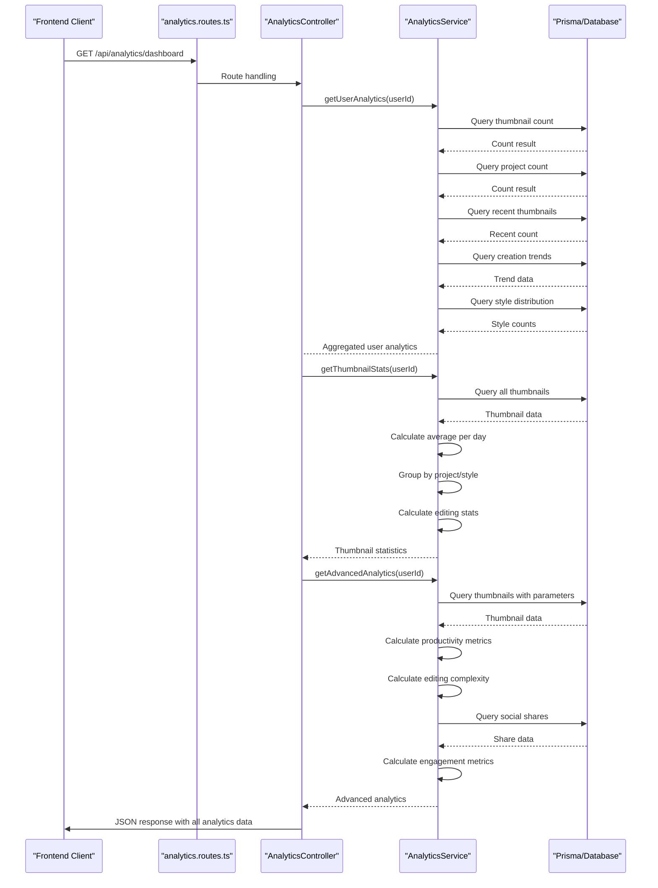
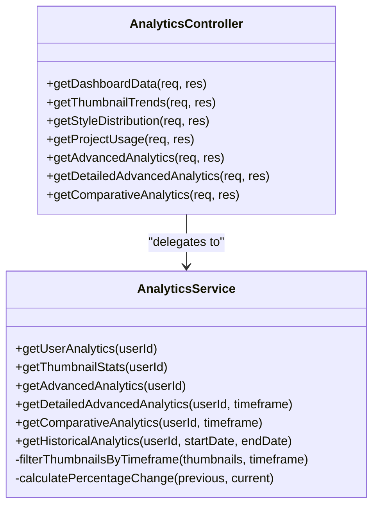
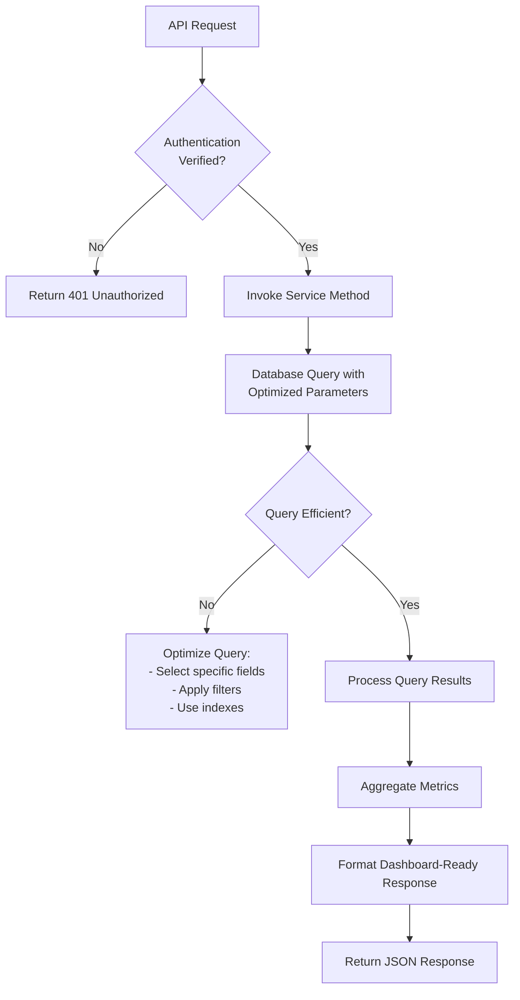

# Analytics Module

<cite>
**Referenced Files in This Document**   
- [analytics.controller.ts](file://pikzels-clone\src\modules\analytics\analytics.controller.ts)
- [analytics.service.ts](file://pikzels-clone\src\modules\analytics\analytics.service.ts)
- [analytics.routes.ts](file://pikzels-clone\src\modules\analytics\analytics.routes.ts)
</cite>

## Table of Contents
1. [Introduction](#introduction)
2. [Data Collection Mechanism](#data-collection-mechanism)
3. [Controller Implementation](#controller-implementation)
4. [Data Model and Query Optimization](#data-model-and-query-optimization)
5. [Privacy Considerations](#privacy-considerations)
6. [Extensibility and Integration](#extensibility-and-integration)
7. [Common Issues and Performance](#common-issues-and-performance)
8. [Conclusion](#conclusion)

## Introduction
The Analytics Module provides comprehensive insights into user engagement and thumbnail performance within the Thumbnail Maker application. This document details the architecture, implementation, and operational aspects of the analytics system, focusing on data flow from routes to services, controller handling of API requests, data modeling, and performance optimization strategies.

## Data Collection Mechanism

The analytics data collection mechanism follows a structured flow from the routing layer through the service layer, aggregating metrics from user interactions with thumbnails and projects. The system collects data on thumbnail creation trends, style distribution, project usage, editing behavior, and social sharing engagement.

The data collection begins at the routing level in `analytics.routes.ts`, where authenticated requests are directed to appropriate controller methods. These routes include endpoints for dashboard data, advanced analytics, detailed analytics with timeframe filtering, comparative analytics, thumbnail trends, style distribution, and project usage.

The service layer in `analytics.service.ts` implements comprehensive data aggregation methods that query the database through Prisma ORM. Key metrics collected include:
- Total thumbnails and projects created by the user
- Recent thumbnail creation (last 30 days)
- Daily creation trends (last 7 days)
- Style distribution across thumbnails (bold, minimalist, dramatic, other)
- Project usage statistics (thumbnails per project)
- Hourly and day-of-week distribution of thumbnail creation
- Editing complexity metrics (number of edits per thumbnail)
- Social sharing engagement (sharing rate, most shared thumbnails)

Time-series data is handled through date-based filtering and grouping mechanisms that organize thumbnails by creation date, enabling trend analysis over specific periods. The system calculates productivity metrics such as best creation day/hour, consistency percentage, and average thumbnails per day.

**Diagram sources**
- [analytics.routes.ts](file://pikzels-clone\src\modules\analytics\analytics.routes.ts#L1-L46)
- [analytics.controller.ts](file://pikzels-clone\src\modules\analytics\analytics.controller.ts#L13-L189)
- [analytics.service.ts](file://pikzels-clone\src\modules\analytics\analytics.service.ts#L4-L1082)

**Section sources**
- [analytics.routes.ts](file://pikzels-clone\src\modules\analytics\analytics.routes.ts#L1-L46)
- [analytics.service.ts](file://pikzels-clone\src\modules\analytics\analytics.service.ts#L4-L1082)

## Controller Implementation

The `AnalyticsController` class in `analytics.controller.ts` handles all incoming API requests for analytics data, implementing a comprehensive set of endpoints that provide different views of user analytics. Each controller method follows a consistent pattern of authentication verification, service method invocation, and response formatting.

The primary endpoint `getDashboardData` aggregates multiple analytics datasets into a single response for the analytics dashboard, calling three separate service methods to retrieve user analytics, thumbnail statistics, and advanced analytics. This approach enables efficient data loading while maintaining separation of concerns.

Additional specialized endpoints provide focused analytics data:
- `getThumbnailTrends`: Returns daily creation trends for visualization
- `getStyleDistribution`: Provides style usage distribution for charting
- `getProjectUsage`: Returns project utilization statistics
- `getAdvancedAnalytics`: Delivers comprehensive productivity, editing, and engagement metrics
- `getDetailedAdvancedAnalytics`: Offers time-filtered analytics with creation trends and edit distribution
- `getComparativeAnalytics`: Provides current vs. previous period comparisons for key metrics

All controller methods implement robust error handling with appropriate HTTP status codes (401 for unauthorized access, 400 for invalid parameters, 500 for server errors) and consistent JSON response formatting. The controller validates the presence of authenticated user data before processing any request and properly handles asynchronous service calls with try-catch blocks.

The detailed and comparative analytics endpoints include parameter validation for the timeframe query parameter, ensuring it is one of the allowed values (daily, weekly, monthly). This validation prevents invalid data requests and provides clear error messages to clients.

**Diagram sources**
- [analytics.controller.ts](file://pikzels-clone\src\modules\analytics\analytics.controller.ts#L13-L189)
- [analytics.service.ts](file://pikzels-clone\src\modules\analytics\analytics.service.ts#L4-L1082)

**Section sources**
- [analytics.controller.ts](file://pikzels-clone\src\modules\analytics\analytics.controller.ts#L13-L189)

## Data Model and Query Optimization

The analytics system leverages the existing database schema with `Thumbnail`, `Project`, and `SocialShare` models to derive analytics metrics without requiring dedicated analytics tables. The data model relies on Prisma ORM to interact with the database, utilizing efficient query patterns to minimize performance impact.

Key aspects of the data model include:
- **Thumbnail model**: Contains creation timestamp, parameters (including style and edit history), project association, and user ownership
- **Project model**: Tracks user projects with creation dates and thumbnail associations
- **SocialShare model**: Records social sharing activities with platform, status, and engagement metrics

Query optimization strategies implemented in the analytics service include:
- **Selective field retrieval**: Using Prisma's `select` option to retrieve only necessary fields (e.g., only `createdAt` when calculating trends)
- **Batched operations**: Grouping related data queries within service methods to reduce database round trips
- **Efficient counting**: Using database-level `count` operations instead of retrieving all records and counting in application code
- **Indexed queries**: Leveraging database indexes on frequently queried fields like `userId`, `createdAt`, and foreign key relationships
- **Date range filtering**: Applying date filters at the database level to limit result sets

The service implements caching patterns through in-memory aggregation, where multiple metrics are derived from a single query result set. For example, the `getThumbnailStats` method retrieves all thumbnails once and then calculates various statistics (average per day, project distribution, style distribution) from this single dataset.

Time-series data is optimized through daily and hourly binning, where timestamps are grouped into date or hour buckets during the query processing phase. This reduces the data volume while preserving trend information for visualization purposes.

**Diagram sources**
- [analytics.service.ts](file://pikzels-clone\src\modules\analytics\analytics.service.ts#L4-L1082)

**Section sources**
- [analytics.service.ts](file://pikzels-clone\src\modules\analytics\analytics.service.ts#L4-L1082)

## Privacy Considerations

The analytics system implements several privacy considerations to ensure user data is collected, processed, and stored in compliance with data protection principles:

1. **Authentication enforcement**: All analytics endpoints require authenticated access through the `authenticateToken` middleware, ensuring only authorized users can access their own analytics data.

2. **Data isolation**: Analytics queries are scoped to the authenticated user's ID, preventing cross-user data access. The service methods accept a `userId` parameter that is used to filter all database queries.

3. **Minimal data collection**: The system collects only metrics derived from existing application data rather than creating new tracking mechanisms. No personally identifiable information beyond what is already stored in the application is collected for analytics purposes.

4. **Aggregate reporting**: Analytics are presented as aggregated metrics rather than raw data, reducing the risk of exposing sensitive information through data analysis.

5. **No third-party tracking**: The analytics system is entirely self-contained within the application and does not integrate with external analytics services that might introduce additional privacy risks.

6. **Secure data transmission**: All analytics API endpoints use HTTPS (implied by the authentication middleware) to protect data in transit.

7. **Error handling**: Error messages are generic and do not expose database structure or internal system details that could be exploited.

The system does not implement data retention policies or anonymization for historical analytics, which represents a potential area for enhancement to further strengthen privacy protections.

**Section sources**
- [analytics.routes.ts](file://pikzels-clone\src\modules\analytics\analytics.routes.ts#L1-L46)
- [analytics.controller.ts](file://pikzels-clone\src\modules\analytics\analytics.controller.ts#L13-L189)
- [analytics.service.ts](file://pikzels-clone\src\modules\analytics\analytics.service.ts#L4-L1082)

## Extensibility and Integration

The analytics module is designed with extensibility in mind, allowing for the addition of new metrics and integration with external analytics platforms. The modular architecture separates concerns between routing, controller logic, and service implementation, making it straightforward to extend functionality.

To add new metrics, developers can:
1. Implement a new method in `AnalyticsService` that queries the database and calculates the desired metric
2. Add a corresponding method in `AnalyticsController` to expose the metric via API
3. Register a new route in `analytics.routes.ts` that maps to the controller method

For example, adding a "top performing thumbnails" metric based on social engagement would involve creating a service method that joins thumbnail data with social share engagement metrics, calculating a performance score, and returning the top results.

Integration with external analytics platforms can be achieved through several approaches:
1. **Webhook system**: Implement a service that sends analytics events to external platforms in real-time
2. **Export functionality**: Add API endpoints that format analytics data in standard formats (CSV, JSON) for external processing
3. **Scheduled reporting**: Implement background jobs that push aggregated analytics to external systems on a regular basis
4. **API bridge**: Create a translation layer that converts internal analytics data to the schema expected by external platforms

The service layer's helper methods, such as `calculatePercentageChange` and `filterThumbnailsByTimeframe`, provide reusable components that can be leveraged when implementing new analytics features. The comparative analytics functionality demonstrates how complex metrics can be built by comparing data across different time periods.

Potential extension points include:
- Real-time analytics with WebSocket updates
- Custom report generation with user-defined parameters
- Predictive analytics based on historical trends
- Team-level analytics for collaboration features
- Integration with marketing analytics platforms

**Section sources**
- [analytics.service.ts](file://pikzels-clone\src\modules\analytics\analytics.service.ts#L4-L1082)
- [analytics.controller.ts](file://pikzels-clone\src\modules\analytics\analytics.controller.ts#L13-L189)
- [analytics.routes.ts](file://pikzels-clone\src\modules\analytics\analytics.routes.ts#L1-L46)

## Common Issues and Performance

The analytics module may encounter several common issues, particularly under high load or with data inconsistencies. Understanding these issues and their solutions is critical for maintaining system reliability and performance.

**Data inconsistency issues:**
- **Missing user references**: Thumbnails or projects with invalid userId references can cause analytics calculations to fail or produce inaccurate results
- **Incomplete parameter data**: Thumbnails with malformed or missing parameters JSON can affect style distribution and editing complexity calculations
- **Timezone discrepancies**: Creation timestamps stored in different timezones can distort hourly and daily distribution metrics

**Performance bottlenecks under high load:**
- **Database query latency**: Complex analytics queries on large datasets can become slow as user data grows
- **Memory consumption**: Loading large numbers of thumbnails into memory for aggregation can exhaust server resources
- **Concurrent request overload**: Multiple users requesting analytics simultaneously can overwhelm the database

**Mitigation strategies:**
1. **Caching**: Implement Redis or similar in-memory caching to store frequently accessed analytics results, reducing database load
2. **Query optimization**: Use database indexing on frequently queried fields (userId, createdAt) and optimize query patterns
3. **Pagination**: For endpoints that return large datasets, implement pagination to limit response size
4. **Background processing**: Move intensive analytics calculations to background jobs that update pre-computed metrics tables
5. **Rate limiting**: Implement rate limiting on analytics endpoints to prevent abuse and ensure fair resource allocation
6. **Data sampling**: For very large datasets, consider using statistical sampling techniques to estimate metrics
7. **Connection pooling**: Configure proper database connection pooling to handle concurrent requests efficiently

The current implementation loads all relevant thumbnails into memory for certain calculations, which could become problematic with large user datasets. Future optimizations could include using database-level aggregation functions (GROUP BY, COUNT, etc.) to shift processing to the database engine.

**Section sources**
- [analytics.service.ts](file://pikzels-clone\src\modules\analytics\analytics.service.ts#L4-L1082)
- [analytics.controller.ts](file://pikzels-clone\src\modules\analytics\analytics.controller.ts#L13-L189)

## Conclusion
The Analytics Module provides a comprehensive system for tracking and reporting on user engagement and thumbnail performance within the Thumbnail Maker application. By leveraging the existing data model and implementing efficient query patterns, the system delivers valuable insights through a well-structured API.

The architecture follows a clean separation of concerns with routes, controllers, and services each handling their respective responsibilities. The implementation provides both high-level overview metrics and detailed analytical data, supporting various use cases from simple dashboard displays to in-depth performance analysis.

While the current implementation is functional, opportunities exist for performance optimization through caching, background processing, and more efficient database queries. The modular design facilitates extension with new metrics and integration with external systems, ensuring the analytics capabilities can evolve with the application's needs.

Privacy considerations are adequately addressed through authentication enforcement and data isolation, though additional measures like data retention policies could further enhance privacy protections.