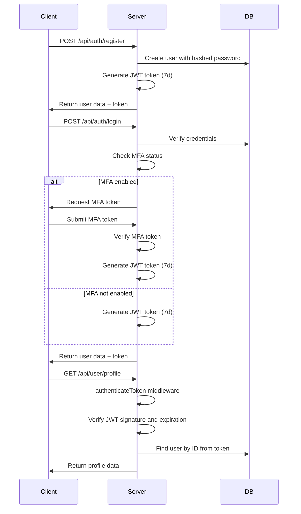
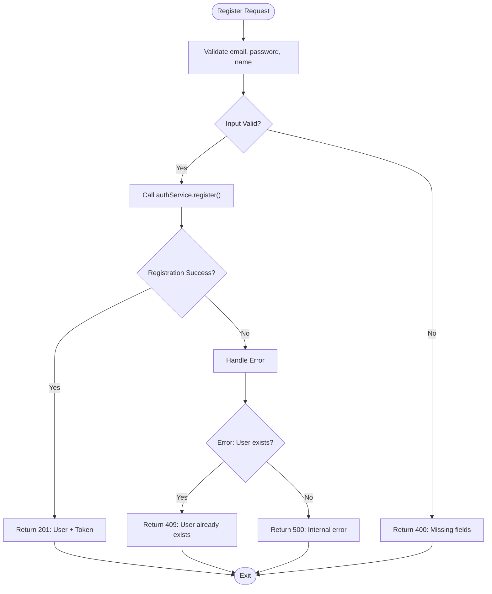
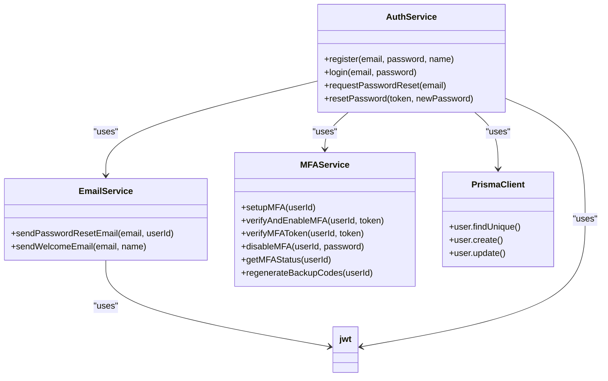
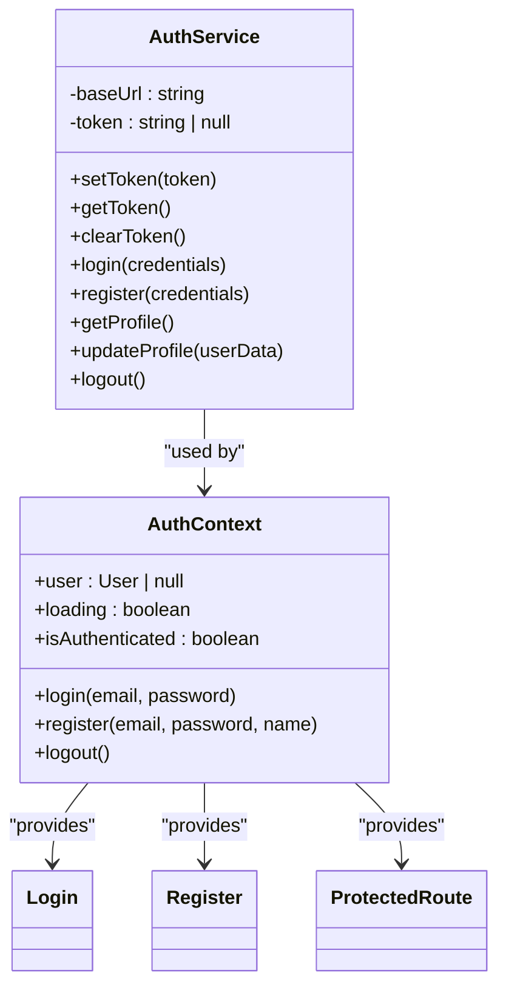

# Authentication Module

<cite>
**Referenced Files in This Document**   
- [auth.middleware.ts](file://pikzels-clone\src\middleware\auth.middleware.ts)
- [auth.routes.ts](file://pikzels-clone\src\modules\auth\auth.routes.ts)
- [auth.controller.ts](file://pikzels-clone\src\modules\auth\auth.controller.ts)
- [auth.service.ts](file://pikzels-clone\src\modules\auth\auth.service.ts)
- [email.service.ts](file://pikzels-clone\src\modules\auth\email.service.ts)
- [mfa.service.ts](file://pikzels-clone\src\modules\auth\mfa.service.ts) - *Added in commit 92c9c4f*
- [shared/auth.service.ts](file://pikzels-clone\shared\auth.service.ts)
- [Login.tsx](file://pikzels-clone\client\src\components\auth\Login.tsx)
- [Register.tsx](file://pikzels-clone\client\src\components\auth\Register.tsx)
- [AuthContext.tsx](file://pikzels-clone\client\src\contexts\AuthContext.tsx)
</cite>

## Update Summary
**Changes Made**   
- Added comprehensive documentation for Multi-Factor Authentication (MFA) service
- Updated security practices section to include MFA implementation details
- Enhanced troubleshooting guide with MFA-specific issues
- Added new extension points for MFA integration
- Updated referenced files to include newly added mfa.service.ts

## Table of Contents
1. [Introduction](#introduction)
2. [Authentication Flow](#authentication-flow)
3. [Route Structure](#route-structure)
4. [Controller Logic](#controller-logic)
5. [Service Layer Implementation](#service-layer-implementation)
6. [Shared AuthService](#shared-authservice)
7. [Security Practices](#security-practices)
8. [Troubleshooting Guide](#troubleshooting-guide)
9. [Extension Points](#extension-points)

## Introduction

The Authentication Module provides a comprehensive JWT-based authentication system for the Pikzels application. It handles user registration, login, token validation, and password recovery functionality through a well-structured backend API and shared services. The module follows a clean separation of concerns with distinct layers for middleware, routes, controllers, and services, ensuring maintainability and scalability.

**Section sources**
- [auth.middleware.ts](file://pikzels-clone\src\middleware\auth.middleware.ts#L1-L54)
- [auth.routes.ts](file://pikzels-clone\src\modules\auth\auth.routes.ts#L1-L16)

## Authentication Flow

The authentication system implements a standard JWT-based flow with registration, login, and token validation. When a user registers or logs in successfully, the server generates a JWT token that is returned to the client. This token contains the user ID and is signed with a secret key. The token has a 7-day expiration period for security.

For protected routes, the client must include the JWT token in the Authorization header using the Bearer scheme. The `authenticateToken` middleware intercepts these requests, verifies the token's validity, and attaches the authenticated user object to the request for downstream handlers to use.

For users with MFA enabled, the authentication flow includes an additional verification step. After successful credential validation, the system checks if MFA is enabled for the user. If so, it requires a valid TOTP token or backup code before granting access.



**Diagram sources**
- [auth.middleware.ts](file://pikzels-clone\src\middleware\auth.middleware.ts#L15-L53)
- [auth.service.ts](file://pikzels-clone\src\modules\auth\auth.service.ts#L20-L48)
- [auth.service.ts](file://pikzels-clone\src\modules\auth\auth.service.ts#L50-L79)
- [mfa.service.ts](file://pikzels-clone\src\modules\auth\mfa.service.ts#L133-L180)

**Section sources**
- [auth.middleware.ts](file://pikzels-clone\src\middleware\auth.middleware.ts#L15-L53)
- [auth.service.ts](file://pikzels-clone\src\modules\auth\auth.service.ts#L20-L79)
- [mfa.service.ts](file://pikzels-clone\src\modules\auth\mfa.service.ts#L133-L180)

## Route Structure

The authentication routes are defined in `auth.routes.ts` using Express Router. The module exposes endpoints for user registration, login, and password recovery. All routes follow a consistent RESTful pattern with clear, descriptive paths.

```mermaid
graph TD
A[Auth Routes] --> B[/api/auth/register]
A --> C[/api/auth/login]
A --> D[/api/request-password-reset]
A --> E[/api/reset-password]
B --> |POST| F[AuthController.register]
C --> |POST| G[AuthController.login]
D --> |POST| H[AuthController.requestPasswordReset]
E --> |POST| I[AuthController.resetPassword]
```

**Diagram sources**
- [auth.routes.ts](file://pikzels-clone\src\modules\auth\auth.routes.ts#L1-L16)

**Section sources**
- [auth.routes.ts](file://pikzels-clone\src\modules\auth\auth.routes.ts#L1-L16)

## Controller Logic

The `AuthController` class handles incoming HTTP requests and orchestrates the authentication process by delegating to the service layer. Each controller method follows a consistent pattern of input validation, service invocation, and response formatting.

The controller implements proper error handling with appropriate HTTP status codes:
- 400 Bad Request for validation errors
- 401 Unauthorized for authentication failures
- 409 Conflict for duplicate user registration
- 500 Internal Server Error for unexpected issues



**Diagram sources**
- [auth.controller.ts](file://pikzels-clone\src\modules\auth\auth.controller.ts#L6-L30)
- [auth.controller.ts](file://pikzels-clone\src\modules\auth\auth.controller.ts#L32-L56)

**Section sources**
- [auth.controller.ts](file://pikzels-clone\src\modules\auth\auth.controller.ts#L6-L122)

## Service Layer Implementation

The authentication service layer contains the core business logic for user management and authentication operations. The `AuthService` class provides methods for registration, login, and password recovery, while the `EmailService` handles email notifications.

### User Management Service

The `AuthService` interacts with the database through Prisma ORM to perform CRUD operations on user data. Passwords are securely hashed using bcryptjs with a salt round of 10 before storage.



**Diagram sources**
- [auth.service.ts](file://pikzels-clone\src\modules\auth\auth.service.ts#L1-L136)
- [email.service.ts](file://pikzels-clone\src\modules\auth\email.service.ts#L1-L66)
- [mfa.service.ts](file://pikzels-clone\src\modules\auth\mfa.service.ts#L21-L347)

### Password Recovery Service

The password recovery flow uses JWT tokens with a 1-hour expiration to securely reset passwords. The token contains the user ID and an action identifier to prevent misuse.

### Multi-Factor Authentication Service

The MFA service implements Time-based One-Time Password (TOTP) authentication using the speakeasy library. When a user enables MFA, the system generates a secret key that is used to generate time-based tokens. The user scans a QR code with their authenticator app (Google Authenticator, Authy, etc.) which then generates 6-digit codes that change every 30 seconds.

The service also generates 10 backup codes that can be used when the user doesn't have access to their authenticator app. These codes are single-use and are removed from the user's account after use. All MFA settings are encrypted before storage in the database.

**Section sources**
- [auth.service.ts](file://pikzels-clone\src\modules\auth\auth.service.ts#L1-L136)
- [email.service.ts](file://pikzels-clone\src\modules\auth\email.service.ts#L1-L66)
- [mfa.service.ts](file://pikzels-clone\src\modules\auth\mfa.service.ts#L21-L347)

## Shared AuthService

The shared `AuthService` in the client provides a unified interface for authentication operations across different parts of the application. It encapsulates HTTP calls to the backend API and manages the authentication token in memory.

The service defines TypeScript interfaces for type safety and provides methods for login, registration, profile management, and logout. The token is automatically attached to authenticated requests via the Authorization header.



**Diagram sources**
- [shared/auth.service.ts](file://pikzels-clone\shared\auth.service.ts#L1-L140)
- [AuthContext.tsx](file://pikzels-clone\client\src\contexts\AuthContext.tsx#L1-L145)

**Section sources**
- [shared/auth.service.ts](file://pikzels-clone\shared\auth.service.ts#L1-L140)
- [AuthContext.tsx](file://pikzels-clone\client\src\contexts\AuthContext.tsx#L1-L145)

## Security Practices

The authentication module implements several security best practices to protect user data and prevent common vulnerabilities.

### Password Hashing

Passwords are never stored in plain text. The system uses bcryptjs to hash passwords with a salt round of 10, providing strong protection against brute force attacks and rainbow table lookups.

### Token Security

JWT tokens are signed with a secret key and include expiration times:
- Authentication tokens: 7 days
- Password reset tokens: 1 hour

The secret key is configured via environment variables to prevent exposure in code repositories.

### Multi-Factor Authentication

The MFA implementation follows security best practices:
- TOTP tokens are valid for 30 seconds with a window of 2 steps (60 seconds total)
- Secret keys are encrypted before storage
- Backup codes are single-use and regenerated as needed
- MFA setup requires verification before enabling
- OAuth users have additional protection requiring admin action to disable MFA

### Input Validation

All endpoints perform strict input validation to prevent injection attacks and ensure data integrity. Required fields are validated, and password strength is checked during reset operations.

### Rate Limiting Considerations

While not currently implemented, the architecture supports rate limiting through middleware that could be added to prevent brute force attacks on authentication endpoints.

**Section sources**
- [auth.service.ts](file://pikzels-clone\src\modules\auth\auth.service.ts#L25-L26)
- [auth.service.ts](file://pikzels-clone\src\modules\auth\auth.service.ts#L35-L38)
- [email.service.ts](file://pikzels-clone\src\modules\auth\email.service.ts#L10-L18)
- [mfa.service.ts](file://pikzels-clone\src\modules\auth\mfa.service.ts#L21-L347)

## Troubleshooting Guide

This section addresses common issues encountered with the authentication system and provides guidance for resolution.

### Token Invalidation

Common causes and solutions:
- **Expired tokens**: Users need to log in again after 7 days of inactivity
- **Invalid signature**: Ensure the JWT_SECRET environment variable is consistent across deployments
- **Missing Authorization header**: Verify client code includes the Bearer token in requests

### Email Delivery Failures

The current implementation simulates email delivery through console output. In production:
- Configure a proper email service (SendGrid, AWS SES, etc.)
- Verify email templates and links
- Monitor delivery rates and bouncebacks
- Implement proper error handling for email service failures

### Registration Conflicts

When users encounter "User already exists" errors:
- Verify the email is not already registered
- Implement a password reset flow instead of registration
- Consider adding email verification to prevent impersonation

### MFA Issues

Common MFA problems and solutions:
- **QR code not scanning**: Ensure proper lighting and camera focus; try manual entry of the secret key
- **Invalid TOTP codes**: Check device time synchronization; TOTP requires accurate time
- **Lost backup codes**: Use the regenerate backup codes feature (requires current MFA access)
- **MFA lockout**: Contact support with identity verification for manual recovery
- **OAuth user MFA issues**: Admin intervention required to modify MFA settings for OAuth users

**Section sources**
- [auth.middleware.ts](file://pikzels-clone\src\middleware\auth.middleware.ts#L15-L53)
- [email.service.ts](file://pikzels-clone\src\modules\auth\email.service.ts#L1-L66)
- [auth.controller.ts](file://pikzels-clone\src\modules\auth\auth.controller.ts#L6-L30)
- [mfa.service.ts](file://pikzels-clone\src\modules\auth\mfa.service.ts#L21-L347)

## Extension Points

The authentication module is designed to support future extensions and integrations.

### OAuth2 Integration

The current local authentication can be extended to support OAuth2 providers:
- Add routes for OAuth callback handling
- Implement provider-specific strategies (Google, GitHub, etc.)
- Create a unified user profile service that merges local and OAuth identities
- Update the shared AuthService to support multiple authentication methods

### Single Sign-On (SSO)

For enterprise scenarios, SSO can be implemented by:
- Adding SAML or OpenID Connect support
- Creating identity provider configurations
- Implementing secure token exchange mechanisms
- Extending the user model to support external identity references

### MFA Enhancements

The MFA system can be extended with additional features:
- Push notification authentication
- Biometric verification
- Hardware security keys (WebAuthn)
- Location-based authentication rules
- Device trust scoring

The modular architecture ensures these extensions can be added with minimal impact on existing functionality.

**Section sources**
- [auth.routes.ts](file://pikzels-clone\src\modules\auth\auth.routes.ts#L1-L16)
- [shared/auth.service.ts](file://pikzels-clone\shared\auth.service.ts#L1-L140)
- [mfa.service.ts](file://pikzels-clone\src\modules\auth\mfa.service.ts#L21-L347)