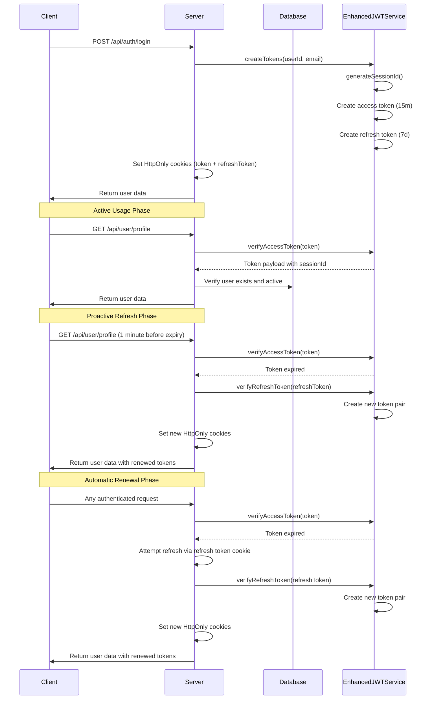
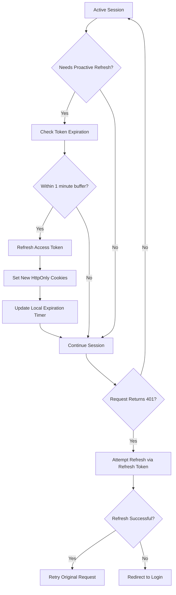
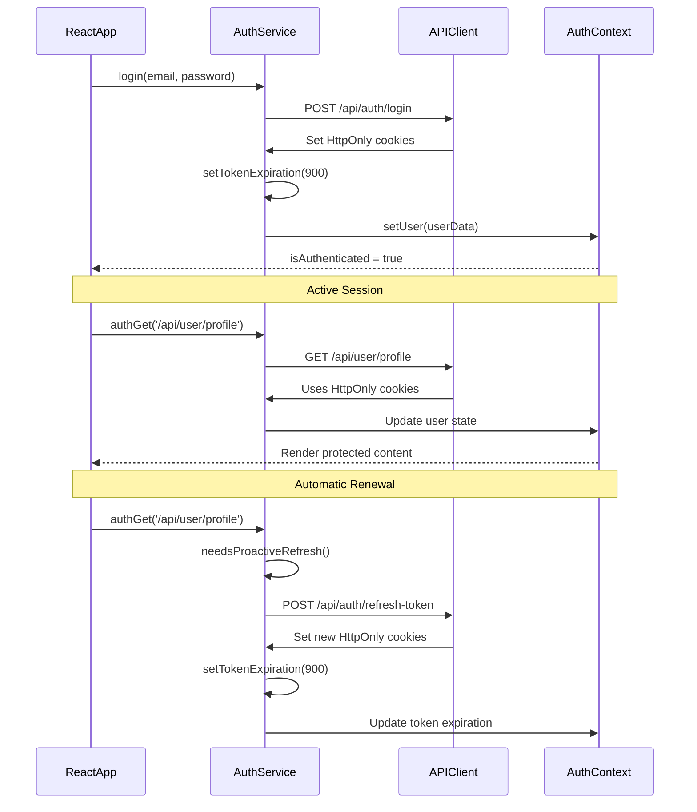

# Authentication Module

<cite>
**Referenced Files in This Document**
- [auth.middleware.ts](file://pikzels-clone\src\middleware\auth.middleware.ts)
- [auth.routes.ts](file://pikzels-clone\src\modules\auth\auth.routes.ts)
- [auth.controller.ts](file://pikzels-clone\src\modules\auth\auth.controller.ts)
- [auth.service.ts](file://pikzels-clone\src\modules\auth\auth.service.ts)
- [email.service.ts](file://pikzels-clone\src\modules\auth\email.service.ts)
- [jwt.enhanced.service.ts](file://pikzels-clone\src\services\jwt.enhanced.service.ts)
- [profile.routes.ts](file://pikzels-clone\src\modules\auth\profile.routes.ts)
- [profile.controller.ts](file://pikzels-clone\src\modules\auth\profile.controller.ts)
- [shared/auth.service.ts](file://pikzels-clone\shared\auth.service.ts)
- [api.ts](file://pikzels-clone\client\src\utils\api.ts)
- [AuthContext.tsx](file://pikzels-clone\client\src\contexts\AuthContext.tsx)
- [Login.tsx](file://pikzels-clone\client\src\components\auth\Login.tsx)
- [Register.tsx](file://pikzels-clone\client\src\components\auth\Register.tsx)
</cite>

## Update Summary
**Changes Made**
- Enhanced authentication context with improved session handling and automatic renewal capabilities
- Updated middleware to support HttpOnly cookies and dual token storage (access + refresh)
- Improved protected route logic with proactive token refresh and automatic renewal
- Enhanced user state management with session ID tracking and activity timestamps
- Added comprehensive token lifecycle management with 15-minute access tokens and 7-day refresh tokens
- Implemented robust error handling for token expiration and automatic refresh flows

## Table of Contents
1. [Introduction](#introduction)
2. [Authentication Flow](#authentication-flow)
3. [Enhanced Session Handling](#enhanced-session-handling)
4. [Route Structure](#route-structure)
5. [Controller Logic](#controller-logic)
6. [Service Layer Implementation](#service-layer-implementation)
7. [Shared AuthService](#shared-authservice)
8. [Security Practices](#security-practices)
9. [Troubleshooting Guide](#troubleshooting-guide)
10. [Extension Points](#extension-points)

## Introduction

The Authentication Module provides a comprehensive JWT-based authentication system with enhanced session handling for the ThumPiks application. The system implements modern security practices including HttpOnly cookies, dual token storage (access + refresh), automatic token renewal, and robust session management. The module follows a clean separation of concerns with distinct layers for middleware, routes, controllers, and services, ensuring maintainability, scalability, and enhanced user experience.

**Section sources**
- [auth.middleware.ts](file://pikzels-clone\src\middleware\auth.middleware.ts#L1-L218)
- [jwt.enhanced.service.ts](file://pikzels-clone\src\services\jwt.enhanced.service.ts#L1-L89)

## Authentication Flow

The authentication system implements a sophisticated JWT-based flow with enhanced session handling, automatic token renewal, and comprehensive error management. The system uses HttpOnly cookies to store authentication tokens securely, implementing a dual-token architecture with 15-minute access tokens and 7-day refresh tokens.

### Enhanced Token Lifecycle



**Diagram sources**
- [auth.middleware.ts](file://pikzels-clone\src\middleware\auth.middleware.ts#L10-L119)
- [auth.controller.ts](file://pikzels-clone\src\modules\auth\auth.controller.ts#L89-L161)
- [jwt.enhanced.service.ts](file://pikzels-clone\src\services\jwt.enhanced.service.ts#L27-L48)
- [api.ts](file://pikzels-clone\client\src\utils\api.ts#L41-L63)

### Session Management Features

The enhanced authentication system includes comprehensive session management with:

- **Session ID Tracking**: Each token carries a unique session ID for correlation and audit trails
- **Automatic Renewal**: Proactive token refresh 1 minute before expiration during active usage
- **Cross-Origin Support**: HttpOnly cookies with SameSite configuration for Netlify-Railway deployment
- **User State Management**: Rich user context with permissions, roles, and activity timestamps
- **Security Monitoring**: Comprehensive logging for authentication attempts and token validation

**Section sources**
- [auth.middleware.ts](file://pikzels-clone\src\middleware\auth.middleware.ts#L82-L96)
- [jwt.enhanced.service.ts](file://pikzels-clone\src\services\jwt.enhanced.service.ts#L22-L25)
- [api.ts](file://pikzels-clone\client\src\utils\api.ts#L32-L35)

## Enhanced Session Handling

The authentication module implements sophisticated session handling with automatic renewal capabilities and enhanced user state management.

### Dual Token Architecture

The system employs a dual-token architecture for optimal security and user experience:

**Access Token (15 minutes)**
- Stored in HttpOnly cookie for maximum security
- Automatically renewed during active usage
- Used for all authenticated API requests
- Expires frequently to minimize risk window

**Refresh Token (7 days)**
- Stored in separate HttpOnly cookie
- Used exclusively for obtaining new access tokens
- Provides seamless session continuation
- Can be invalidated through logout or account changes

### Automatic Renewal Mechanism



**Diagram sources**
- [api.ts](file://pikzels-clone\client\src\utils\api.ts#L75-L140)
- [auth.middleware.ts](file://pikzels-clone\src\middleware\auth.middleware.ts#L122-L192)

### Enhanced User Context

The authentication middleware creates a comprehensive user context with:

- **Session Information**: Unique session IDs, creation timestamps, and last activity tracking
- **Permission Management**: Role-based permissions (thumbnails:read/write, projects:read/write)
- **User State**: Verified status, account activation state, and display preferences
- **Security Metadata**: IP address, user agent, and request correlation data

**Section sources**
- [auth.middleware.ts](file://pikzels-clone\src\middleware\auth.middleware.ts#L82-L96)
- [AuthContext.tsx](file://pikzels-clone\client\src\contexts\AuthContext.tsx#L39-L65)
- [api.ts](file://pikzels-clone\client\src\utils\api.ts#L18-L27)

## Route Structure

The authentication routes are organized into logical groups with enhanced security and comprehensive functionality.

### Core Authentication Routes

```mermaid
graph TD
A[Auth Routes] --> B[/api/auth/register]
A --> C[/api/auth/login]
A --> D[/api/auth/logout]
A --> E[/api/auth/refresh-token]
B --> |POST| F[AuthController.register]
C --> |POST| G[AuthController.login]
D --> |POST| H[AuthController.logout]
E --> |POST| I[AuthController.refreshToken]
A --> J[/api/auth/verify-email/:token]
A --> K[/api/auth/resend-verification]
A --> L[/api/auth/request-password-reset]
A --> M[/api/auth/reset-password]
J --> |GET| N[AuthController.verifyEmail]
K --> |POST| O[AuthController.resendVerification]
L --> |POST| P[AuthController.requestPasswordReset]
M --> |POST| Q[AuthController.resetPassword]
```

**Diagram sources**
- [auth.routes.ts](file://pikzels-clone\src\modules\auth\auth.routes.ts#L23-L197)

### Profile and Settings Routes

The system includes dedicated routes for user profile management and settings:

- **Profile Management**: `/api/user/profile` (GET/PUT) with comprehensive validation
- **Settings Management**: `/api/user/settings` (GET/PUT) for user preferences
- **Display Preferences**: `/api/auth/display-preference` (PUT) for name/username display
- **Username Tools**: `/api/auth/suggest-usernames` and `/api/auth/check-username/:username`

**Section sources**
- [auth.routes.ts](file://pikzels-clone\src\modules\auth\auth.routes.ts#L1-L198)
- [profile.routes.ts](file://pikzels-clone\src\modules\auth\profile.routes.ts#L1-L63)

## Controller Logic

The controller layer implements robust authentication logic with comprehensive error handling and security measures.

### Enhanced Authentication Controllers

Each controller method follows a consistent pattern with enhanced security:

**Registration Controller**
- Validates username uniqueness and email availability
- Implements OWASP password standards
- Generates verification tokens with 24-hour expiry
- Creates HttpOnly cookies with cross-origin configuration
- Sends welcome email with verification instructions

**Login Controller**
- Supports both username and email authentication
- Implements timing-safe password comparison
- Handles demo mode bypass for testing environments
- Creates dual token pair with session correlation
- Updates user last login timestamp

**Token Refresh Controller**
- Validates refresh tokens from HttpOnly cookies
- Prevents token type confusion attacks
- Verifies user account status and activity
- Returns new token pair with updated session IDs
- Maintains session continuity across refresh

### Error Handling Strategy

The controllers implement comprehensive error handling:

- **Typed Errors**: Specific error classes for validation, conflict, and unauthorized scenarios
- **Security Logging**: Detailed logs for authentication attempts and failures
- **Generic Responses**: Non-descriptive messages to prevent information leakage
- **Debug Mode**: Development-specific error details for troubleshooting

**Section sources**
- [auth.controller.ts](file://pikzels-clone\src\modules\auth\auth.controller.ts#L17-L82)
- [auth.controller.ts](file://pikzels-clone\src\modules\auth\auth.controller.ts#L89-L161)
- [auth.controller.ts](file://pikzels-clone\src\modules\auth\auth.controller.ts#L344-L389)

## Service Layer Implementation

The service layer implements the core business logic with enhanced security and comprehensive user management.

### Enhanced Authentication Service

The `AuthService` class provides comprehensive authentication functionality:

**User Management Operations**
- Username validation with regex patterns and availability checks
- Email verification with token-based confirmation
- Password hashing with bcrypt and OWASP compliance
- Display preference management (name vs username)

**Token Management**
- Dual token creation with session correlation
- Secure token signing with environment-specific secrets
- Token validation with type and expiration checks
- Password reset token generation with 1-hour expiry

**Security Features**
- Timing-safe password comparison to prevent timing attacks
- Account deactivation and verification checks
- Comprehensive logging for security monitoring
- Error handling with minimal information disclosure

### Enhanced JWT Service

The `EnhancedJWTService` provides robust token management:

**Token Generation**
- Session ID generation for correlation and audit trails
- Access tokens with 15-minute expiration for frequent renewal
- Refresh tokens with 7-day expiration for long-term sessions
- Separate signing keys for access and refresh tokens

**Token Validation**
- Type-specific validation to prevent token substitution attacks
- Session ID correlation for session management
- Environment-aware secret management for testing
- Comprehensive error logging for security monitoring

**Password Reset Management**
- Specialized reset tokens with action identification
- 1-hour expiration for security compliance
- Secure token generation with cryptographic randomness

**Section sources**
- [auth.service.ts](file://pikzels-clone\src\modules\auth\auth.service.ts#L18-L614)
- [jwt.enhanced.service.ts](file://pikzels-clone\src\services\jwt.enhanced.service.ts#L12-L89)

## Shared AuthService

The shared `AuthService` provides a unified interface for authentication operations across client applications with enhanced session management.

### Enhanced Client-Side Authentication

The client-side service implements comprehensive session handling:

**Token Management**
- Automatic HttpOnly cookie handling for authentication
- Proactive token refresh based on expiration timers
- Session state persistence across browser sessions
- Cross-origin cookie configuration for deployment environments

**User State Management**
- Automatic authentication state detection on page load
- Seamless token renewal without user intervention
- Error handling for authentication failures
- Integration with React Router for protected routes

**API Integration**
- Enhanced fetch wrapper with automatic token refresh
- Request caching control for different endpoint types
- Error boundary handling for network failures
- Progress indication for authentication operations

### Client-Side Session Features



**Diagram sources**
- [shared/auth.service.ts](file://pikzels-clone\shared\auth.service.ts#L25-L141)
- [AuthContext.tsx](file://pikzels-clone\client\src\contexts\AuthContext.tsx#L43-L65)
- [api.ts](file://pikzels-clone\client\src\utils\api.ts#L75-L140)

**Section sources**
- [shared/auth.service.ts](file://pikzels-clone\shared\auth.service.ts#L25-L141)
- [AuthContext.tsx](file://pikzels-clone\client\src\contexts\AuthContext.tsx#L36-L128)
- [api.ts](file://pikzels-clone\client\src\utils\api.ts#L75-L140)

## Security Practices

The authentication module implements comprehensive security practices with enhanced session management and automatic renewal capabilities.

### Enhanced Token Security

**HttpOnly Cookie Implementation**
- Access tokens stored in HttpOnly cookies preventing XSS attacks
- Separate refresh tokens with 7-day expiration for long-term sessions
- Cross-origin cookie configuration with SameSite and Secure flags
- Environment-specific cookie settings for development and production

**Session Management Security**
- Unique session IDs for correlation and audit trails
- Automatic session termination on logout
- User activity tracking and monitoring
- Session validation against database state

**Token Validation Enhancements**
- Type-specific token validation to prevent substitution attacks
- Session ID correlation for session management
- Comprehensive error logging for security monitoring
- Graceful degradation on token validation failures

### Enhanced User Protection

**Account Security**
- Email verification requirement for account activation
- Account deactivation and verification status checks
- Timing-safe password comparison to prevent timing attacks
- Comprehensive logging for suspicious activities

**Session Security**
- Automatic session renewal without user interaction
- Proactive token refresh 1 minute before expiration
- Cross-origin session handling for multi-domain deployments
- Session state validation against database records

**Deployment Security**
- Environment-aware secret management for testing
- Cross-origin cookie configuration for Netlify-Railway setup
- Secure cookie flags for HTTPS-only transmission
- CORS configuration for API security

**Section sources**
- [auth.middleware.ts](file://pikzels-clone\src\middleware\auth.middleware.ts#L15-L119)
- [auth.controller.ts](file://pikzels-clone\src\modules\auth\auth.controller.ts#L30-L50)
- [jwt.enhanced.service.ts](file://pikzels-clone\src\services\jwt.enhanced.service.ts#L14-L20)

## Troubleshooting Guide

This section addresses common issues with the enhanced authentication system and provides comprehensive resolution guidance.

### Token Renewal Issues

**Symptoms**: Users experience frequent logout despite active usage
**Causes and Solutions**:
- **Expired Access Token**: Automatic renewal should handle this - check proactive refresh logic
- **Refresh Token Issues**: Verify refresh token cookie is being sent with requests
- **Session Corruption**: Clear browser cookies and re-authenticate
- **Cross-Origin Problems**: Ensure SameSite and Secure cookie settings match deployment

### Session Management Problems

**Symptoms**: Session not persisting across browser restarts
**Causes and Solutions**:
- **Cookie Configuration**: Verify HttpOnly and Secure flags are properly set
- **SameSite Settings**: Check SameSite configuration for cross-origin requests
- **Browser Privacy Settings**: Some browsers block third-party cookies
- **Session Storage**: Client-side session storage is cleared on logout

### Authentication Flow Issues

**Symptoms**: Login/logout cycles not working properly
**Causes and Solutions**:
- **Cookie Not Set**: Verify server is setting HttpOnly cookies correctly
- **CSRF Protection**: Check SameSite configuration for cross-origin requests
- **Token Validation**: Review EnhancedJWTService configuration and secrets
- **User State**: Ensure user exists and is active in database

### Automatic Renewal Failures

**Symptoms**: Requests failing with 401 errors despite recent activity
**Causes and Solutions**:
- **Refresh Endpoint Issues**: Verify `/api/auth/refresh-token` endpoint is accessible
- **Cookie Transmission**: Check that refresh token cookie is included in requests
- **Token Validation**: Review refresh token validation logic and expiration
- **Database Connectivity**: Ensure user record is accessible during refresh

### Cross-Origin Deployment Issues

**Symptoms**: Authentication working locally but failing in production
**Causes and Solutions**:
- **Cookie Domain**: Verify cookie domain matches deployment URL
- **SameSite Configuration**: Adjust SameSite to 'none' for cross-origin requests
- **HTTPS Requirement**: Ensure Secure flag is set for HTTPS deployments
- **CORS Headers**: Check CORS configuration for API endpoints

**Section sources**
- [auth.middleware.ts](file://pikzels-clone\src\middleware\auth.middleware.ts#L15-L119)
- [api.ts](file://pikzels-clone\client\src\utils\api.ts#L41-L63)
- [AuthContext.tsx](file://pikzels-clone\client\src\contexts\AuthContext.tsx#L43-L65)

## Extension Points

The authentication module is designed for future enhancements while maintaining current functionality.

### OAuth Integration

The enhanced architecture supports OAuth integration:

**Implementation Path**
- Add OAuth callback routes with state validation
- Implement provider-specific user profile mapping
- Extend user model to support multiple authentication providers
- Create unified authentication flow combining local and OAuth

### Advanced Session Management

Future enhancements for session handling:

**Session Persistence**
- Database-backed session storage for distributed deployments
- Session clustering for load-balanced environments
- Session encryption for sensitive data protection
- Session audit trails for security monitoring

**Advanced Token Features**
- Token blacklisting for immediate revocation
- Token binding to user agents and IP addresses
- Hierarchical token permissions and scopes
- Token expiration notifications and reminders

### Enhanced Security Features

**Multi-Factor Authentication**
- TOTP integration with time-based codes
- Hardware security key support (WebAuthn)
- Push notification authentication
- Biometric authentication integration

**Advanced Monitoring**
- Real-time session tracking and alerts
- Behavioral analysis for suspicious activities
- IP reputation integration and monitoring
- Device fingerprinting and correlation

**Section sources**
- [auth.routes.ts](file://pikzels-clone\src\modules\auth\auth.routes.ts#L1-L198)
- [jwt.enhanced.service.ts](file://pikzels-clone\src\services\jwt.enhanced.service.ts#L12-L89)
- [AuthContext.tsx](file://pikzels-clone\client\src\contexts\AuthContext.tsx#L36-L128)