# Backend Architecture

<cite>
**Referenced Files in This Document**
- [server.ts](file://pikzels-clone\src\server.ts)
- [auth.middleware.ts](file://pikzels-clone\src\middleware\auth.middleware.ts)
- [security.middleware.ts](file://pikzels-clone\src\middleware\security.middleware.ts)
- [request-id.middleware.ts](file://pikzels-clone\src\middleware\request-id.middleware.ts)
- [per-user-rate-limit.test.ts](file://pikzels-clone\src\middleware\__tests__\per-user-rate-limit.test.ts)
- [errors.ts](file://pikzels-clone\src\utils\errors.ts)
- [logger.ts](file://pikzels-clone\src\utils\logger.ts)
- [jwt.enhanced.service.ts](file://pikzels-clone\src\services\jwt.enhanced.service.ts)
- [security.config.ts](file://pikzels-clone\src\config\security.config.ts)
- [auth.routes.ts](file://pikzels-clone\src\modules\auth\auth.routes.ts)
- [thumbnail.routes.ts](file://pikzels-clone\src\modules\thumbnail\thumbnail.routes.ts)
- [thumbnail.public.routes.ts](file://pikzels-clone\src\modules\thumbnail\thumbnail.public.routes.ts)
- [thumbnail.controller.ts](file://pikzels-clone\src\modules\thumbnail\thumbnail.controller.ts)
- [cache.service.ts](file://pikzels-clone\src\services\cache.service.ts)
- [event-emitter.ts](file://pikzels-clone\src\events\event-emitter.ts)
- [event-persistence.ts](file://pikzels-clone\src\events\event-persistence.ts)
- [event-registry.ts](file://pikzels-clone\src\events\event-registry.ts)
- [analytics-handlers.ts](file://pikzels-clone\src\events\analytics-handlers.ts)
- [social-share-handlers.ts](file://pikzels-clone\src\events\social-share-handlers.ts)
- [session-coordination.middleware.ts](file://pikzels-clone\src\middleware\session-coordination.middleware.ts)
- [performance.middleware.ts](file://pikzels-clone\src\middleware\performance.middleware.ts)
- [service-factory.ts](file://pikzels-clone\src\utils\service-factory.ts)
- [prisma-factory.ts](file://pikzels-clone\src\utils\prisma-factory.ts)
- [auto-cleanup.ts](file://pikzels-clone\src\utils\auto-cleanup.ts)
- [thumbnail.service.ts](file://pikzels-clone\src\modules\thumbnail\thumbnail.service.ts)
- [auth.service.ts](file://pikzels-clone\src\modules\auth\auth.service.ts)
- [setup.ts](file://pikzels-clone\src\__tests__\setup.ts)
- [jest.config.js](file://pikzels-clone\jest.config.js)
- [.env.example](file://pikzels-clone\.env.example)
- [vite.config.ts](file://pikzels-clone\client\vite.config.ts)
- [system-monitoring.service.ts](file://pikzels-clone\src\modules\admin\system-monitoring.service.ts)
- [performance.routes.ts](file://pikzels-clone\src\routes\performance.routes.ts)
- [performance-test.ts](file://pikzels-clone\src\scripts\performance-test.ts)
- [request-context.ts](file://pikzels-clone\src\utils\request-context.ts)
- [UploadZoneOverlay.tsx](file://pikzels-clone\client\src\components\editor\canvas\UploadZoneOverlay.tsx)
- [canvasDrawingHelpers.ts](file://pikzels-clone\client\src\components\editor\canvas\canvasDrawingHelpers.ts)
- [ContextualToolbar.tsx](file://pikzels-clone\client\src\components\editor\components\ContextualToolbar.tsx)
- [CanvasEngine.tsx](file://pikzels-clone\client\src\components\editor\canvas\CanvasEngine.tsx)
</cite>

## Update Summary
**Changes Made**
- **Canvas Engine Enhancements**: Added comprehensive documentation for UploadZoneOverlay.tsx, canvasDrawingHelpers.ts, and enhanced contextual toolbar components
- **Frontend Canvas Architecture**: Documented the new canvas engine architecture with upload overlay functionality and drawing helpers
- **Enhanced Contextual Toolbars**: Added documentation for the new contextual toolbar system with AI-powered actions
- **Canvas Rendering Improvements**: Updated canvas rendering capabilities with optimized drawing operations and enhanced user interaction
- **Upload Zone Management**: Documented the new upload zone overlay system for composition template placeholders

## Table of Contents
1. [Introduction](#introduction)
2. [Project Structure](#project-structure)
3. [Core Components](#core-components)
4. [Architecture Overview](#architecture-overview)
5. [API-Only Architecture](#api-only-architecture)
6. [Enhanced Health Check System](#enhanced-health-check-system)
7. [Comprehensive System Monitoring](#comprehensive-system-monitoring)
8. [Enhanced Performance Monitoring](#enhanced-performance-monitoring)
9. [Detailed Component Analysis](#detailed-component-analysis)
10. [Enhanced Security Infrastructure](#enhanced-security-infrastructure)
11. [Distributed Tracing with Request-ID Middleware](#distributed-tracing-with-request-id-middleware)
12. [Per-User Rate Limiting Implementation](#per-user-rate-limiting-implementation)
13. [Session Coordination System](#session-coordination-system)
14. [Event-Driven Architecture](#event-driven-architecture)
15. [Enhanced Error Handling](#enhanced-error-handling)
16. [Centralized Service Factory Pattern](#centralized-service-factory-pattern)
17. [Canvas Engine Architecture](#canvas-engine-architecture)
18. [Frontend Canvas Enhancement Features](#frontend-canvas-enhancement-features)
19. [Dependency Analysis](#dependency-analysis)
20. [Performance Considerations](#performance-considerations)
21. [Deployment Architecture](#deployment-architecture)
22. [Troubleshooting Guide](#troubleshooting-guide)
23. [Conclusion](#conclusion)

## Introduction
This document provides a comprehensive overview of the backend architecture of Thumbnail Maker Studio, which has undergone significant enhancements to strengthen the backend infrastructure and debugging capabilities. The backend is now built as a standalone Express.js API server with enhanced security, improved error logging, comprehensive authentication middleware updates, and a revolutionary centralized service factory pattern.

The backend follows a modular, feature-based organization with a clear separation of concerns using an MVC-like pattern. It includes robust authentication with CORS credentials support, enhanced security middleware with comprehensive logging, modular routing, service-layer abstraction, shared utilities for cross-platform use, an advanced event-driven architecture with session coordination capabilities, and the new centralized service factory pattern for improved maintainability and testability. This documentation details the server structure, request lifecycle, middleware pipeline, and best practices for extending the API-only system with enhanced debugging and security features.

**Updated** Enhanced with Express 5 upgrade featuring improved type safety, new request-id middleware for distributed tracing, per-user rate limiting implementation, enhanced security middleware with Express 5 compatibility, advanced error handling with custom error classes, and comprehensive frontend canvas engine enhancements including upload overlay functionality, improved drawing helpers, and enhanced contextual toolbar components.

## Project Structure

The backend resides in the `pikzels-clone/src` directory and is organized around feature modules. Each module (e.g., auth, thumbnail, analytics) contains its own routes, controllers, and services, promoting encapsulation and maintainability. The architecture now includes enhanced security middleware with comprehensive logging, session coordination, comprehensive event handling capabilities, API-only deployment considerations, the revolutionary centralized service factory pattern for improved service lifecycle management, and comprehensive system monitoring capabilities.

```mermaid
graph TB
subgraph "src/"
Server[server.ts]
Middleware[middleware/]
Modules[modules/]
Shared[shared/]
Events[events/]
Services[services/]
Utils[utils/]
Config[config/]
Routes[routes/]
Scripts[scripts/]
end
Server --> Middleware
Server --> Modules
Server --> Events
Server --> Services
Server --> Utils
Server --> Config
Server --> Routes
Server --> Scripts
Middleware --> SecurityMiddleware[security.middleware.ts]
Middleware --> ValidationMiddleware[validation.middleware.ts]
Middleware --> SessionCoordination[session-coordination.middleware.ts]
Middleware --> PerformanceMiddleware[performance.middleware.ts]
Middleware --> RequestId[request-id.middleware.ts]
Events --> EventEmitter[event-emitter.ts]
Events --> EventPersistence[event-persistence.ts]
Events --> EventRegistry[event-registry.ts]
Events --> AnalyticsHandlers[analytics-handlers.ts]
Events --> SocialShareHandlers[social-share-handlers.ts]
Events --> EventTypes[event-types.ts]
Modules --> AuthMod[auth/]
Modules --> ThumbnailMod[thumbnail/]
Modules --> AnalyticsMod[analytics/]
Modules --> SocialShareMod[social-share/]
Modules --> AdminMod[admin/]
Services --> CacheService[cache.service.ts]
Services --> JWTService[jwt.enhanced.service.ts]
Utils --> ErrorUtils[errors.ts]
Utils --> LoggerUtils[logger.ts]
Utils --> ServiceFactory[service-factory.ts]
Utils --> PrismaFactory[prisma-factory.ts]
Utils --> AutoCleanup[auto-cleanup.ts]
Utils --> RequestContext[request-context.ts]
Config --> SecurityConfig[security.config.ts]
Routes --> PerformanceRoutes[performance.routes.ts]
Scripts --> PerformanceTest[performance-test.ts]
Shared --> AuthService[auth.service.ts]
Shared --> ThumbnailService[thumbnail.service.ts]
```

**Diagram sources**
- [server.ts:1-468](file://pikzels-clone\src\server.ts#L1-L468)
- [security.middleware.ts:1-410](file://pikzels-clone\src\middleware\security.middleware.ts#L1-L410)
- [validation.middleware.ts:1-352](file://pikzels-clone\src\middleware\validation.middleware.ts#L1-L352)
- [session-coordination.middleware.ts:1-339](file://pikzels-clone\src\middleware\session-coordination.middleware.ts#L1-L339)
- [performance.middleware.ts:1-234](file://pikzels-clone\src\middleware\performance.middleware.ts#L1-L234)
- [request-id.middleware.ts:1-39](file://pikzels-clone\src\middleware\request-id.middleware.ts#L1-L39)
- [event-emitter.ts:1-273](file://pikzels-clone\src\events\event-emitter.ts#L1-L273)
- [event-persistence.ts:1-329](file://pikzels-clone\src\events\event-persistence.ts#L1-L329)
- [event-registry.ts:1-195](file://pikzels-clone\src\events\event-registry.ts#L1-L195)
- [cache.service.ts:1-352](file://pikzels-clone\src\services\cache.service.ts#L1-L352)
- [errors.ts:1-112](file://pikzels-clone\src\utils\errors.ts#L1-L112)
- [logger.ts:1-163](file://pikzels-clone\src\utils\logger.ts#L1-L163)
- [jwt.enhanced.service.ts:1-89](file://pikzels-clone\src\services\jwt.enhanced.service.ts#L1-L89)
- [security.config.ts:1-508](file://pikzels-clone\src\config\security.config.ts#L1-L508)
- [service-factory.ts:1-97](file://pikzels-clone\src\utils\service-factory.ts#L1-L97)
- [prisma-factory.ts:1-109](file://pikzels-clone\src\utils\prisma-factory.ts#L1-L109)
- [auto-cleanup.ts:1-141](file://pikzels-clone\src\utils\auto-cleanup.ts#L1-L141)
- [request-context.ts:1-32](file://pikzels-clone\src\utils\request-context.ts#L1-L32)
- [system-monitoring.service.ts:1-722](file://pikzels-clone\src\modules\admin\system-monitoring.service.ts#L1-L722)
- [performance.routes.ts:1-118](file://pikzels-clone\src\routes\performance.routes.ts#L1-L118)
- [performance-test.ts:1-248](file://pikzels-clone\src\scripts\performance-test.ts#L1-L248)

**Section sources**
- [server.ts:1-468](file://pikzels-clone\src\server.ts#L1-L468)

## Core Components

The backend architecture is built on Express.js and follows a modular MVC-like pattern with enhanced security and reliability features. Key components include:
- **server.ts**: Entry point that configures middleware and mounts feature-based routes with comprehensive security layers, CORS credentials support, and API-only deployment logic
- **Enhanced Middleware Pipeline**: Includes CORS with credentials support, JSON parsing, JWT-based authentication, security headers, rate limiting, input validation, security logging, session coordination, performance monitoring, and the new request-id middleware for distributed tracing
- **Feature Modules**: Each module (auth, thumbnail, etc.) encapsulates routes, controllers, and services with validation middleware
- **Enhanced Security Infrastructure**: Comprehensive security middleware with suspicious pattern detection, authentication attempt logging, and production security configuration
- **Distributed Tracing System**: New request-id middleware with AsyncLocalStorage-based request context propagation for comprehensive distributed tracing
- **Per-User Rate Limiting**: Advanced rate limiting with Redis/Memory fallback, supporting both IP-based and user-based rate limiting
- **Event-Driven Architecture**: Comprehensive event system with emitter, persistence, and registry for reliable cross-component communication
- **Session Coordination**: Persistent session management across server restarts using Redis or file-based storage
- **Centralized Service Factory Pattern**: Revolutionary service management system that replaces scattered singleton implementations with centralized creation and lifecycle management
- **Prisma Singleton Management**: Centralized Prisma client management with automatic cleanup to prevent connection pool leaks
- **Auto-Cleanup Registry**: Comprehensive service cleanup system that automatically tracks and cleans up services without manual intervention
- **Shared Services**: Reusable client-side services for web and mobile apps to interact with the API
- **API-Only Deployment**: Production mode serves only API responses, development mode provides helpful API information
- **Enhanced Error Handling**: Comprehensive error logging with structured responses and development-friendly debugging using custom error classes
- **Comprehensive System Monitoring**: Advanced health check endpoint with cache health monitoring, database connectivity checks, event registry statistics, performance configuration flags, and service factory status
- **Performance Metrics Collection**: Detailed performance monitoring with response time tracking, error rate calculation, and cache statistics
- **Performance Testing Framework**: Automated performance testing and validation tools for cache operations, service layer performance, and memory usage

**Updated** Enhanced with Express 5 upgrade featuring improved type safety, new request-id middleware for distributed tracing, per-user rate limiting implementation with Redis/Memory fallback, enhanced security middleware with Express 5 compatibility, advanced error handling with custom error classes, and comprehensive frontend canvas engine enhancements including upload overlay functionality, improved drawing helpers, and enhanced contextual toolbar components.

**Section sources**
- [server.ts:1-468](file://pikzels-clone\src\server.ts#L1-L468)
- [session-coordination.middleware.ts:1-339](file://pikzels-clone\src\middleware\session-coordination.middleware.ts#L1-L339)
- [security.middleware.ts:1-410](file://pikzels-clone\src\middleware\security.middleware.ts#L1-L410)
- [validation.middleware.ts:1-352](file://pikzels-clone\src\middleware\validation.middleware.ts#L1-L352)
- [logger.ts:1-163](file://pikzels-clone\src\utils\logger.ts#L1-L163)
- [service-factory.ts:1-97](file://pikzels-clone\src\utils\service-factory.ts#L1-L97)
- [prisma-factory.ts:1-109](file://pikzels-clone\src\utils\prisma-factory.ts#L1-L109)
- [auto-cleanup.ts:1-141](file://pikzels-clone\src\utils\auto-cleanup.ts#L1-L141)
- [system-monitoring.service.ts:1-722](file://pikzels-clone\src\modules\admin\system-monitoring.service.ts#L1-L722)
- [performance.middleware.ts:1-234](file://pikzels-clone\src\middleware\performance.middleware.ts#L1-L234)
- [request-id.middleware.ts:1-39](file://pikzels-clone\src\middleware\request-id.middleware.ts#L1-L39)
- [request-context.ts:1-32](file://pikzels-clone\src\utils\request-context.ts#L1-L32)

## Architecture Overview

The backend implements a clean, modular architecture with enhanced security and reliability layers. The Express server uses an expanded middleware pipeline to handle cross-cutting concerns like authentication, security, input validation, session coordination, rate limiting, performance monitoring, distributed tracing, and comprehensive error logging before delegating to route handlers. The architecture now supports API-only deployment where the server responds with JSON data rather than serving HTML templates, includes the revolutionary centralized service factory pattern for improved service lifecycle management, and provides comprehensive system monitoring capabilities.

```mermaid
graph TB
Client[HTTP Client / Frontend App] --> Server[Express Server]
Server --> RequestId[requestIdMiddleware]
Server --> SecurityHeaders[securityHeaders]
Server --> RateLimit[generalRateLimit]
Server --> AuthRateLimit[authRateLimit]
Server --> UserApiRateLimit[userApiRateLimit]
Server --> UserAiRateLimit[userAiRateLimit]
Server --> UserUploadRateLimit[userUploadRateLimit]
Server --> RequestSize[requestSizeLimit]
Server --> JSON[express.json()]
Server --> Sanitize[sanitizeInput]
Server --> SecurityLogger[securityLogger]
SecurityLogger --> AuthMiddleware[authenticateToken]
AuthMiddleware --> Validation[validateRequest]
Validation --> PerformanceMonitor[performanceMiddleware]
PerformanceMonitor --> Routes
AuthMiddleware --> |Authenticated| Routes
AuthMiddleware --> |Unauthorized| Unauthorized[401/403 Response]
Routes --> Controller[Controller]
Controller --> Service[Service]
Service --> ServiceFactory[service-factory]
ServiceFactory --> Cache[CacheService]
ServiceFactory --> Prisma[Prisma Client]
Prisma --> DB[(Database)]
Service --> External[External APIs]
Service --> FS[(File System)]
Controller --> Response[JSON Response]
Controller --> Event[emitEvent]
Event --> Emitter[eventEmitter]
Emitter --> Persistence[eventPersistence]
```

**Diagram sources**
- [server.ts:1-468](file://pikzels-clone\src\server.ts#L1-L468)
- [session-coordination.middleware.ts:220-269](file://pikzels-clone\src\middleware\session-coordination.middleware.ts#L220-L269)
- [security.middleware.ts:1-410](file://pikzels-clone\src\middleware\security.middleware.ts#L1-L410)
- [validation.middleware.ts:1-352](file://pikzels-clone\src\middleware\validation.middleware.ts#L1-L352)
- [performance.middleware.ts:1-234](file://pikzels-clone\src\middleware\performance.middleware.ts#L1-L234)
- [event-emitter.ts:1-273](file://pikzels-clone\src\events\event-emitter.ts#L1-L273)
- [cache.service.ts:1-352](file://pikzels-clone\src\services\cache.service.ts#L1-L352)
- [service-factory.ts:1-97](file://pikzels-clone\src\utils\service-factory.ts#L1-L97)
- [request-id.middleware.ts:1-39](file://pikzels-clone\src\middleware\request-id.middleware.ts#L1-L39)

## API-Only Architecture

The system has undergone a major transformation to support API-only deployment. The server now operates as a pure REST API service with distinct behavior for production and development environments.

### Enhanced Production Mode API-Only Responses
In production mode, the server responds with JSON data only, providing essential API information and health check endpoints:

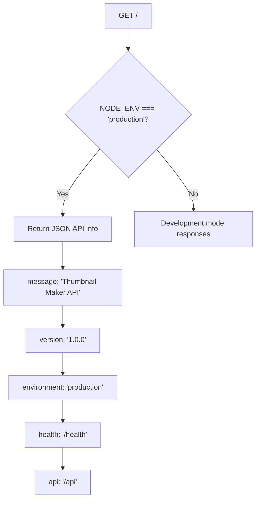

### Improved Development Mode API Information
In development mode, the server provides helpful information about the API structure and frontend integration:

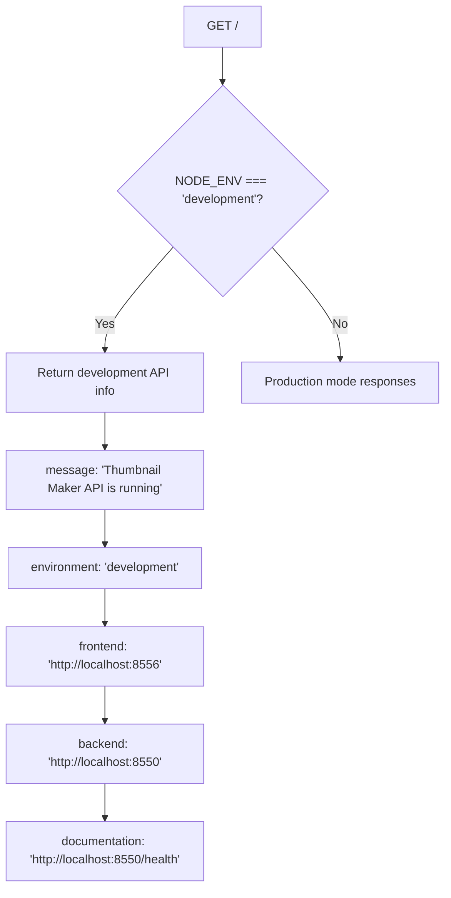

### Enhanced Frontend Integration
The frontend React application runs on a separate port (8556) and communicates with the backend API through a proxy configuration:

```mermaid
graph LR
Frontend[React Frontend:8556] < --> Proxy[Proxy:8556 -> 8550]
Proxy --> Backend[API Backend:8550]
Backend --> Database[(Database)]
Backend --> Cache[(Redis Cache)]
Backend --> Storage[(File Storage)]
```

**Updated** Enhanced with improved TypeScript compatibility using `Number(process.env.PORT) || 8550` for robust environment variable handling, Express 5 type safety improvements, comprehensive distributed tracing support, and comprehensive frontend canvas engine enhancements.

**Diagram sources**
- [vite.config.ts:17-23](file://pikzels-clone\client\vite.config.ts#L17-L23)
- [server.ts:294-324](file://pikzels-clone\src\server.ts#L294-L324)
- [server.ts](file://pikzels-clone\src\server.ts#L58)

**Section sources**
- [server.ts:294-324](file://pikzels-clone\src\server.ts#L294-L324)
- [vite.config.ts:17-23](file://pikzels-clone\client\vite.config.ts#L17-L23)

## Enhanced Health Check System

The health check endpoint has been significantly enhanced to provide comprehensive monitoring of all system services and components. The `/health` endpoint now returns detailed information about cache status, event system health, performance monitoring capabilities, service factory status, and the new request-id middleware functionality.

### Enhanced Health Check Response Structure
The enhanced health check provides a comprehensive view of system status:

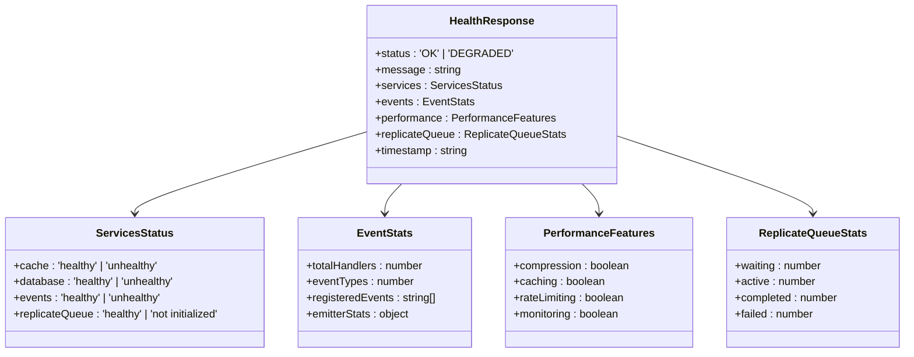

**Diagram sources**
- [server.ts:232-291](file://pikzels-clone\src\server.ts#L232-L291)
- [event-registry.ts:57-83](file://pikzels-clone\src\events\event-registry.ts#L57-L83)
- [cache.service.ts:276-290](file://pikzels-clone\src\services\cache.service.ts#L276-L290)

### Enhanced Service Monitoring Capabilities
The health check integrates with various system components:

- **Cache Service Health**: Checks Redis cache connectivity and performance with automatic fallback to in-memory cache
- **Event System Status**: Verifies event handler registration and processing
- **Performance Features**: Confirms compression, caching, rate limiting, and monitoring are enabled
- **Replicate Queue Status**: Monitors AI job queue health and statistics
- **Timestamp Tracking**: Provides accurate server uptime and response timing
- **Service Factory Status**: Monitors centralized service factory health and status
- **Request-ID Middleware**: Validates distributed tracing functionality

**Updated** Enhanced with improved cache health checking, service factory status monitoring, request-id middleware validation, replicate queue statistics, and more detailed performance monitoring. Health check endpoint is positioned before error handlers for proper Railway health check monitoring.

**Section sources**
- [server.ts:232-291](file://pikzels-clone\src\server.ts#L232-L291)
- [event-registry.ts:57-83](file://pikzels-clone\src\events\event-registry.ts#L57-L83)
- [cache.service.ts:276-290](file://pikzels-clone\src\services\cache.service.ts#L276-L290)

## Comprehensive System Monitoring

The backend now includes a comprehensive system monitoring service that provides detailed health checks for all system components including database connectivity, Redis cache, filesystem, API endpoints, and external services.

### System Monitoring Service Architecture
The system monitoring service provides comprehensive health checking and performance metrics collection:

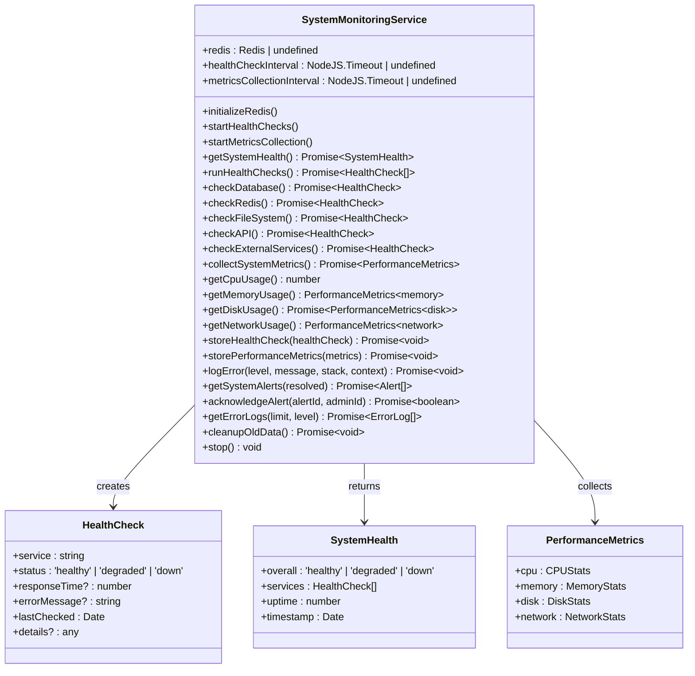

**Diagram sources**
- [system-monitoring.service.ts:81-722](file://pikzels-clone\src\modules\admin\system-monitoring.service.ts#L81-L722)

### Database Connectivity and Performance Checks
The system monitoring service performs comprehensive database health checks including connection validation and query performance measurement:

- **Connection Validation**: Tests database connectivity using raw SQL queries
- **Query Performance Measurement**: Measures response times for critical database operations
- **User Count Validation**: Verifies database integrity by counting user records
- **Status Classification**: Classifies database health as healthy, degraded, or down based on response times

### Redis Cache Health Monitoring
The service monitors Redis cache connectivity with automatic fallback detection:

- **Ping Commands**: Regular Redis ping commands to verify connectivity
- **Response Time Monitoring**: Tracks Redis response times for performance analysis
- **Automatic Fallback**: Detects Redis unavailability and triggers fallback to in-memory cache
- **Retry Logic**: Implements 30-second intervals for Redis availability checks

### File System Health Checks
The system monitors filesystem health and disk usage:

- **Disk Usage Monitoring**: Tracks disk space utilization and alerts on high usage
- **Percentage Calculation**: Calculates disk usage percentage for health assessment
- **Threshold-Based Alerts**: Issues alerts when disk usage exceeds 80% (degraded) or 90% (down)

**Updated** Complete implementation of comprehensive system monitoring service with detailed health checks for database, Redis, filesystem, API, and external services.

**Section sources**
- [system-monitoring.service.ts:1-722](file://pikzels-clone\src\modules\admin\system-monitoring.service.ts#L1-L722)

## Enhanced Performance Monitoring

The backend now includes sophisticated performance monitoring capabilities with detailed metrics collection, response time tracking, error rate calculation, cache statistics, and request context integration.

### Performance Metrics Collection
The performance monitoring system tracks comprehensive metrics for performance analysis and optimization:

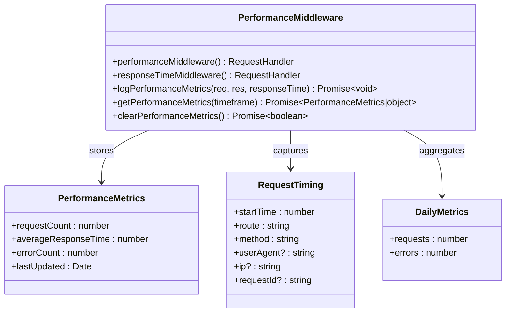

**Diagram sources**
- [performance.middleware.ts:6-234](file://pikzels-clone\src\middleware\performance.middleware.ts#L6-L234)

### Response Time Tracking and Error Analysis
The performance middleware provides detailed response time tracking and error analysis:

- **Request Timing Capture**: Captures start time, route, method, user agent, IP address, and request ID for each request
- **Response Time Calculation**: Calculates response times for performance analysis
- **Error Rate Tracking**: Monitors error rates by categorizing responses as successful or error
- **Slow Request Detection**: Identifies requests exceeding 1000ms response time for optimization
- **Daily Metrics Aggregation**: Maintains daily request and error counts for trend analysis
- **Request Context Integration**: Utilizes request ID for distributed tracing correlation

### Cache Statistics and Performance Optimization
The performance monitoring system integrates with the caching layer to provide cache performance insights:

- **Cache Hit Rate Analysis**: Tracks cache hit rates for performance optimization
- **Cache Miss Analysis**: Identifies cache misses for data access pattern optimization
- **Performance Comparison**: Compares cache-enabled vs cache-disabled operations
- **Memory Usage Monitoring**: Tracks memory usage impact of caching operations

### Performance Testing Framework
The backend includes a comprehensive performance testing framework for validating system performance:

- **Cache Performance Testing**: Validates cache set/get operations and performance improvements
- **Service Layer Performance Testing**: Tests service layer caching and data access patterns
- **Memory Usage Testing**: Monitors memory impact of caching operations
- **Cache Invalidation Testing**: Validates cache invalidation patterns and memory cleanup
- **Automated Performance Validation**: Provides automated performance validation tools

**Updated** Enhanced with comprehensive performance metrics collection, detailed response time tracking, error rate analysis, cache statistics, request context integration, and performance testing framework.

**Section sources**
- [performance.middleware.ts:1-234](file://pikzels-clone\src\middleware\performance.middleware.ts#L1-L234)
- [performance.routes.ts:1-118](file://pikzels-clone\src\routes\performance.routes.ts#L1-L118)
- [performance-test.ts:1-248](file://pikzels-clone\src\scripts\performance-test.ts#L1-L248)

## Detailed Component Analysis

### Enhanced Authentication Module Analysis
The authentication module handles user login, registration, and profile management with comprehensive validation, security logging, and enhanced input validation. It uses JWT for stateless authentication with session coordination for persistent login sessions and includes improved error handling and debugging capabilities.

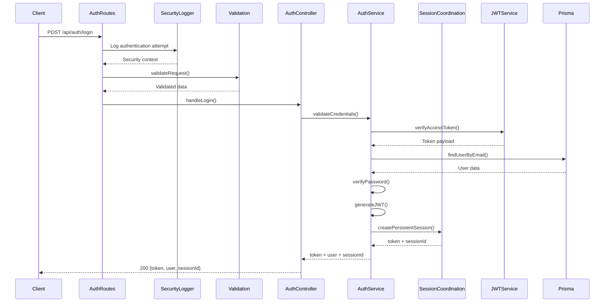

**Diagram sources**
- [auth.routes.ts](file://pikzels-clone\src\modules\auth\auth.routes.ts)
- [security.middleware.ts:152-198](file://pikzels-clone\src\middleware\security.middleware.ts#L152-L198)
- [validation.middleware.ts:1-352](file://pikzels-clone\src\middleware\validation.middleware.ts#L1-L352)
- [auth.controller.ts](file://pikzels-clone\src\modules\auth\auth.controller.ts)
- [auth.service.ts](file://pikzels-clone\src\modules\auth\auth.service.ts)
- [session-coordination.middleware.ts:274-304](file://pikzels-clone\src\middleware\session-coordination.middleware.ts#L274-L304)
- [jwt.enhanced.service.ts:50-70](file://pikzels-clone\src\services\jwt.enhanced.service.ts#L50-L70)

**Updated** Enhanced with improved security logging, CORS credentials support, comprehensive error handling, centralized Prisma singleton management, and Express 5 type safety improvements.

**Section sources**
- [auth.routes.ts](file://pikzels-clone\src\modules\auth\auth.routes.ts)
- [security.middleware.ts:152-198](file://pikzels-clone\src\middleware\security.middleware.ts#L152-L198)
- [validation.middleware.ts:1-352](file://pikzels-clone\src\middleware\validation.middleware.ts#L1-L352)
- [auth.controller.ts](file://pikzels-clone\src\modules\auth\auth.controller.ts)
- [auth.service.ts](file://pikzels-clone\src\modules\auth\auth.service.ts)

### Enhanced Thumbnail Module Analysis
The thumbnail module enables users to generate, retrieve, update, and delete thumbnails with comprehensive authentication and validation. It supports both authenticated and public endpoints with caching for performance and enhanced security. The module now includes public access routes for shared thumbnails with improved CORS credentials support and per-user rate limiting.

```mermaid
flowchart TD
A[POST /api/thumbnails/generate] --> B{authenticateToken}
B --> |Valid| C[validateRequest]
C --> D[thumbnail.controller.generate]
D --> E[thumbnail.service.generate]
E --> F[AI Service / Image Processing]
F --> G[Save to DB + File System]
G --> H[emitEvent(thumbnail.created)]
H --> I[eventPersistence]
I --> J[Return thumbnails]
J --> K[201 Created]
B --> |Invalid| L[401 Unauthorized]
M[GET /api/thumbnails/share/:token] --> N[accessSharedThumbnail]
N --> O[Validate share token]
O --> P[Check thumbnail permissions]
P --> Q[Return thumbnail data]
Q --> R[200 OK]
S[POST /api/thumbnails/ai/generate] --> T[userAiRateLimit]
T --> U[Apply per-user AI rate limiting]
U --> V[Process AI generation]
V --> W[Update rate limit counters]
```

**Diagram sources**
- [thumbnail.routes.ts](file://pikzels-clone\src\modules\thumbnail\thumbnail.routes.ts)
- [thumbnail.public.routes.ts](file://pikzels-clone\src\modules\thumbnail\thumbnail.public.routes.ts)
- [auth.middleware.ts:1-218](file://pikzels-clone\src\middleware\auth.middleware.ts#L1-L218)
- [thumbnail.controller.ts](file://pikzels-clone\src\modules\thumbnail\thumbnail.controller.ts)
- [thumbnail.service.ts](file://pikzels-clone\src\modules\thumbnail\thumbnail.service.ts)
- [event-emitter.ts:1-273](file://pikzels-clone\src\events\event-emitter.ts#L1-L273)

**Updated** Enhanced with new public thumbnail access functionality, CORS credentials support, improved error handling, centralized service factory pattern, per-user rate limiting implementation, and Express 5 type safety improvements.

**Section sources**
- [thumbnail.routes.ts](file://pikzels-clone\src\modules\thumbnail\thumbnail.routes.ts)
- [thumbnail.public.routes.ts](file://pikzels-clone\src\modules\thumbnail\thumbnail.public.routes.ts)
- [auth.middleware.ts:1-218](file://pikzels-clone\src\middleware\auth.middleware.ts#L1-L218)
- [thumbnail.controller.ts](file://pikzels-clone\src\modules\thumbnail\thumbnail.controller.ts)
- [thumbnail.service.ts](file://pikzels-clone\src\modules\thumbnail\thumbnail.service.ts)

### Enhanced Public Thumbnail Access
The system now includes public routes for accessing shared thumbnails without authentication, enabling external sharing capabilities with improved CORS credentials support:

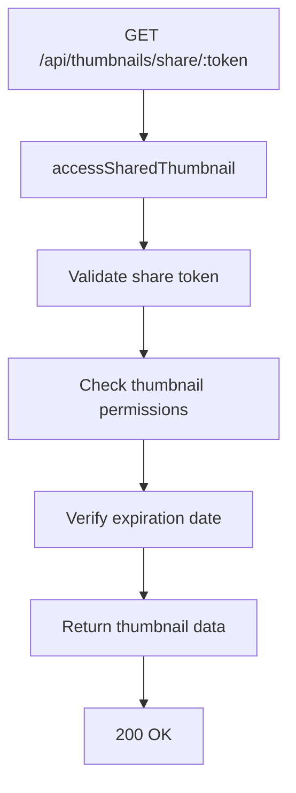

**Diagram sources**
- [thumbnail.public.routes.ts:1-10](file://pikzels-clone\src\modules\thumbnail\thumbnail.public.routes.ts#L1-L10)
- [thumbnail.controller.ts:594-646](file://pikzels-clone\src\modules\thumbnail\thumbnail.controller.ts#L594-L646)

**Updated** Enhanced with improved token validation, expiration checking, CORS credentials support, centralized service access, and Express 5 compatibility.

**Section sources**
- [thumbnail.public.routes.ts:1-10](file://pikzels-clone\src\modules\thumbnail\thumbnail.public.routes.ts#L1-L10)
- [thumbnail.controller.ts:594-646](file://pikzels-clone\src\modules\thumbnail\thumbnail.controller.ts#L594-L646)

## Enhanced Security Infrastructure

The backend now includes comprehensive security infrastructure with enhanced logging, suspicious pattern detection, and production-grade security configurations.

### Enhanced CORS Configuration with Credentials Support
The CORS middleware now includes credentials support for cross-origin authentication with HttpOnly cookies:

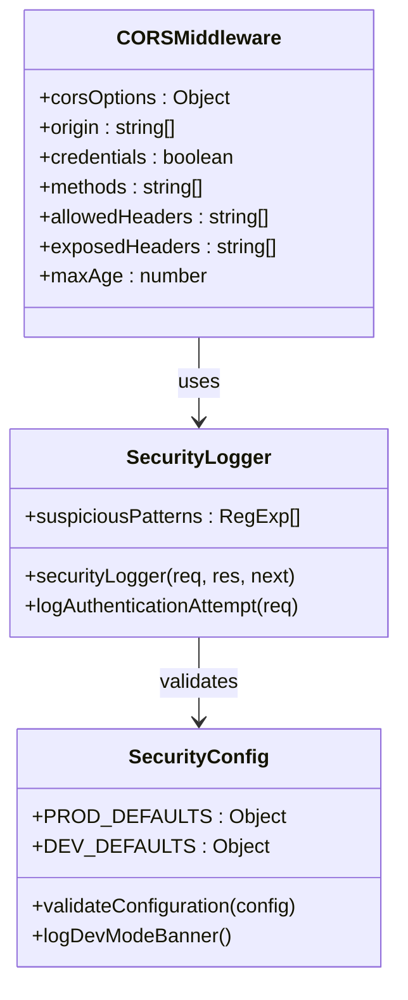

**Diagram sources**
- [server.ts:141-161](file://pikzels-clone\src\server.ts#L141-L161)
- [security.middleware.ts:152-198](file://pikzels-clone\src\middleware\security.middleware.ts#L152-L198)
- [security.config.ts:54-93](file://pikzels-clone\src\config\security.config.ts#L54-L93)

### Enhanced Security Logging and Pattern Detection
The security logging middleware provides comprehensive monitoring of suspicious activities and authentication attempts:

- **Suspicious Pattern Detection**: Detects directory traversal, XSS attempts, SQL injection, code injection, and cookie theft attempts
- **Authentication Attempt Logging**: Logs all authentication-related requests with IP addresses and user agents
- **Request Size Monitoring**: Monitors request sizes to prevent abuse
- **Security Context Tracking**: Provides detailed context for all security events

**Updated** Enhanced with comprehensive security logging, suspicious pattern detection, production security configuration validation, centralized service factory pattern, Express 5 compatibility, and improved input sanitization for req.query getter-only behavior.

**Section sources**
- [server.ts:141-161](file://pikzels-clone\src\server.ts#L141-L161)
- [security.middleware.ts:152-198](file://pikzels-clone\src\middleware\security.middleware.ts#L152-L198)
- [security.config.ts:54-93](file://pikzels-clone\src\config\security.config.ts#L54-L93)
- [logger.ts:118-163](file://pikzels-clone\src\utils\logger.ts#L118-L163)

## Distributed Tracing with Request-ID Middleware

The backend now includes a comprehensive distributed tracing system using the new request-id middleware and AsyncLocalStorage-based request context propagation. This system enables end-to-end request tracking across microservices and provides detailed correlation of logs and metrics.

### Request-ID Middleware Architecture
The request-id middleware generates unique identifiers for each request and propagates them throughout the request lifecycle:

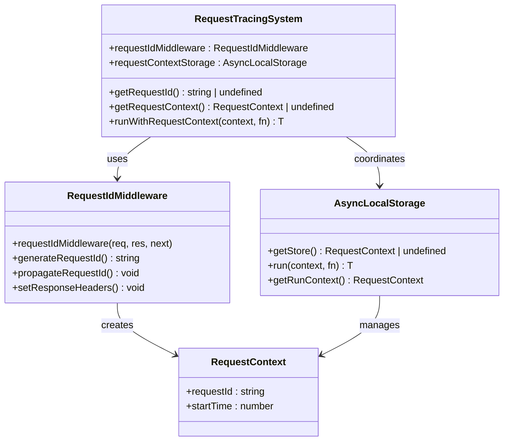

**Diagram sources**
- [request-id.middleware.ts:1-39](file://pikzels-clone\src\middleware\request-id.middleware.ts#L1-L39)
- [request-context.ts:1-32](file://pikzels-clone\src\utils\request-context.ts#L1-L32)

### Request Context Propagation
The request context system enables seamless propagation of request-scoped data throughout the entire async call chain:

- **Request ID Generation**: Creates unique UUIDs for each incoming request or respects incoming X-Request-Id header
- **Response Header Setting**: Sets X-Request-Id response header for client-side correlation
- **AsyncLocalStorage Integration**: Uses Node.js AsyncLocalStorage for automatic context propagation
- **Cross-Module Access**: Provides global access to request context without parameter drilling
- **Test Compatibility**: Supports artificial request context creation for testing scenarios

### Distributed Tracing Benefits
The distributed tracing system provides several key benefits:

- **End-to-End Correlation**: Links all logs, metrics, and events to a single request ID
- **Performance Analysis**: Enables detailed performance profiling across request lifecycles
- **Debugging Support**: Simplifies debugging by providing request-scoped context
- **Microservice Integration**: Supports distributed tracing across multiple service boundaries
- **Audit Trail**: Creates comprehensive audit trails for security and compliance

**Updated** Complete implementation of distributed tracing system with request-id middleware, AsyncLocalStorage-based request context propagation, and comprehensive request correlation capabilities.

**Section sources**
- [request-id.middleware.ts:1-39](file://pikzels-clone\src\middleware\request-id.middleware.ts#L1-L39)
- [request-context.ts:1-32](file://pikzels-clone\src\utils\request-context.ts#L1-L32)

## Per-User Rate Limiting Implementation

The backend now implements advanced per-user rate limiting with Redis/Memory fallback, supporting both IP-based and user-based rate limiting strategies. This system provides granular control over API usage while maintaining resilience during Redis outages.

### Rate Limiting Architecture
The per-user rate limiting system provides multiple layers of protection with automatic fallback mechanisms:

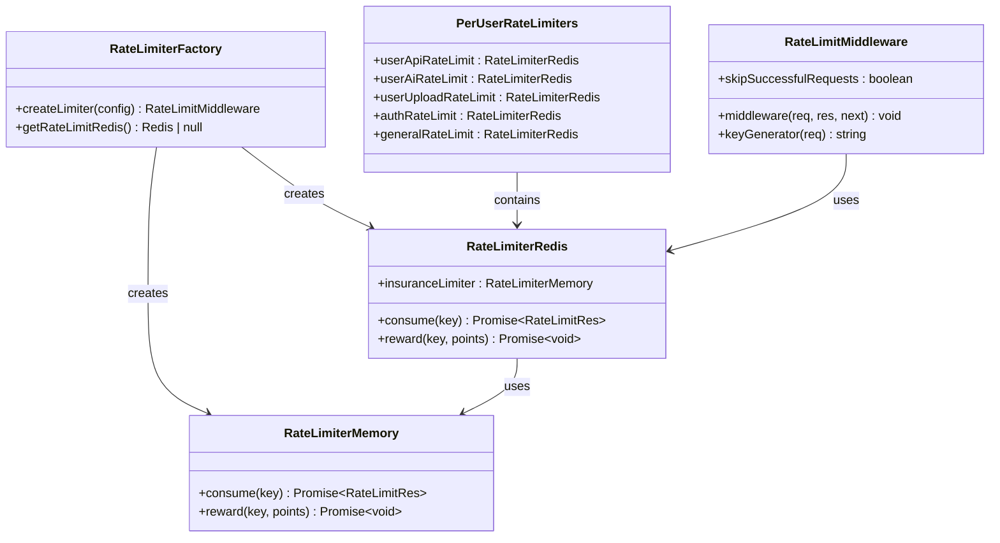

**Diagram sources**
- [security.middleware.ts:89-170](file://pikzels-clone\src\middleware\security.middleware.ts#L89-L170)

### Rate Limiting Strategies
The system implements multiple rate limiting strategies for different use cases:

- **IP-Based Rate Limiting**: General API rate limiting with configurable thresholds
- **User-Based Rate Limiting**: Per-user rate limiting for authenticated requests
- **Authentication Rate Limiting**: Strict rate limiting for login attempts
- **Upload Rate Limiting**: Specialized rate limiting for file uploads
- **AI Operation Rate Limiting**: Reduced limits for expensive AI operations

### Redis/Memory Fallback Mechanism
The rate limiting system provides automatic fallback to memory-based rate limiting when Redis is unavailable:

- **Redis Connection Management**: Centralized Redis client with automatic reconnection
- **Memory Fallback**: Automatic fallback to RateLimiterMemory when Redis fails
- **Insurance Limiter**: Memory-based limiter acts as insurance against Redis failures
- **Graceful Degradation**: Continues operation with reduced functionality during Redis outages
- **Error Handling**: Graceful handling of Redis connection errors without service interruption

### Rate Limiting Configuration
The per-user rate limiting system supports extensive configuration:

- **Customizable Limits**: Configurable request limits per time window
- **Flexible Time Windows**: Adjustable time windows for different rate limiting strategies
- **Key Generation**: Flexible key generation supporting both IP and user-based identification
- **Skip Successful Requests**: Optional reward system for successful requests
- **Logging and Monitoring**: Comprehensive logging of rate limiting events and violations

### Route-Level Integration
The per-user rate limiting is integrated at the route level for optimal performance:

- **Route-Specific Limits**: Different rate limits for different API endpoints
- **Authentication Integration**: Automatic user-based limiting after authentication
- **AI Operation Protection**: Specialized limits for expensive AI operations
- **Upload Protection**: Dedicated rate limiting for file upload operations
- **Performance Optimization**: Efficient key generation and storage for high-throughput scenarios

**Updated** Complete implementation of per-user rate limiting with Redis/Memory fallback, comprehensive rate limiting strategies, automatic fallback mechanisms, and route-level integration.

**Section sources**
- [security.middleware.ts:89-246](file://pikzels-clone\src\middleware\security.middleware.ts#L89-L246)
- [per-user-rate-limit.test.ts:1-191](file://pikzels-clone\src\middleware\__tests__\per-user-rate-limit.test.ts#L1-L191)
- [thumbnail.routes.ts:143-181](file://pikzels-clone\src\modules\thumbnail\thumbnail.routes.ts#L143-L181)

## Session Coordination System

The session coordination middleware provides persistent login sessions across server restarts using Redis or file-based storage. It maintains session state, handles token verification, and coordinates with the authentication system for seamless user experience.

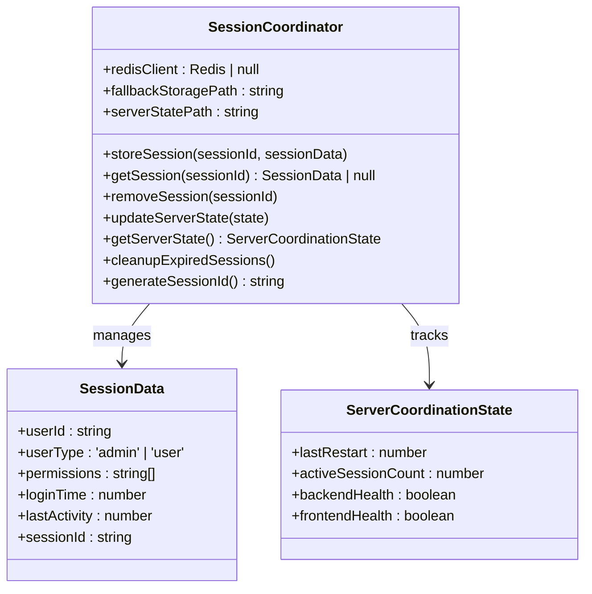

**Diagram sources**
- [session-coordination.middleware.ts:30-212](file://pikzels-clone\src\middleware\session-coordination.middleware.ts#L30-L212)

**Section sources**
- [session-coordination.middleware.ts:1-339](file://pikzels-clone\src\middleware\session-coordination.middleware.ts#L1-L339)

## Event-Driven Architecture

The system implements a comprehensive event-driven architecture for decoupled communication between components. Events are persisted to disk for reliability and can be replayed for recovery. The event registry manages handler registration and initialization.

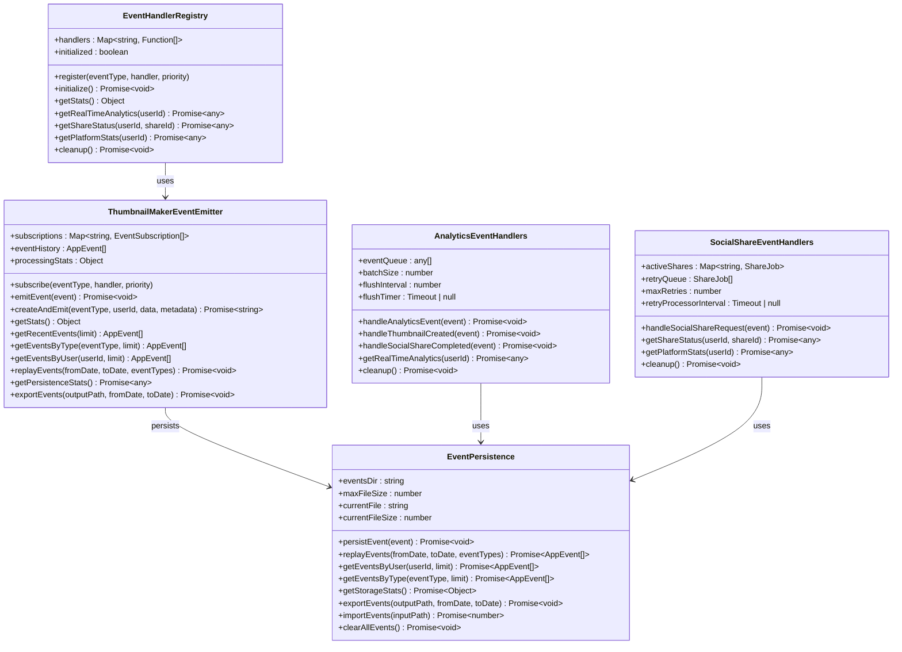

**Diagram sources**
- [event-registry.ts:10-195](file://pikzels-clone\src\events\event-registry.ts#L10-L195)
- [event-emitter.ts:16-230](file://pikzels-clone\src\events\event-emitter.ts#L16-L230)
- [event-persistence.ts:15-329](file://pikzels-clone\src\events\event-persistence.ts#L15-L329)
- [analytics-handlers.ts:20-344](file://pikzels-clone\src\events\analytics-handlers.ts#L20-L344)
- [social-share-handlers.ts:21-394](file://pikzels-clone\src\events\social-share-handlers.ts#L21-L394)

**Section sources**
- [event-registry.ts:1-195](file://pikzels-clone\src\events\event-registry.ts#L1-L195)
- [event-emitter.ts:1-273](file://pikzels-clone\src\events\event-emitter.ts#L1-L273)
- [event-persistence.ts:1-329](file://pikzels-clone\src\events\event-persistence.ts#L1-L329)
- [analytics-handlers.ts:1-344](file://pikzels-clone\src\events\analytics-handlers.ts#L1-L344)
- [social-share-handlers.ts:1-394](file://pikzels-clone\src\events\social-share-handlers.ts#L1-L394)

## Enhanced Error Handling

The error handling system has been significantly improved with comprehensive logging, development-friendly error details, structured error responses, and enhanced debugging capabilities for production environments. The system now includes custom error classes with type-safe status mapping and comprehensive error categorization.

### Enhanced Error Response Structure
The improved error handling provides structured responses with appropriate status codes and contextual information:

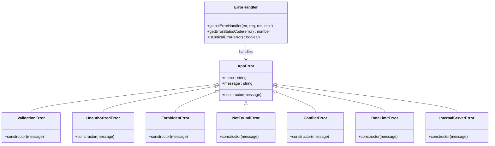

**Diagram sources**
- [errors.ts:1-112](file://pikzels-clone\src\utils\errors.ts#L1-L112)
- [server.ts:327-352](file://pikzels-clone\src\server.ts#L327-L352)

### Enhanced Error Logging and Monitoring
The error handling system now includes comprehensive logging with contextual information and security-focused error tracking:

- **Structured Logging**: Detailed error logs with request context, user information, and stack traces
- **Security Context**: All errors include security context for debugging authentication and authorization issues
- **Environment-Specific Responses**: Development mode includes stack traces and detailed error messages, production mode provides generic error responses
- **Critical Error Detection**: Automatic detection of 5xx errors for critical monitoring
- **Global Error Handler**: Centralized error handling with comprehensive logging and graceful degradation
- **Security Error Tracking**: Specialized logging for security-related errors and suspicious activities
- **Request-ID Correlation**: All error logs include request ID for distributed tracing correlation
- **Custom Error Classes**: Type-safe error handling with appropriate HTTP status codes

### Error Status Mapping
The enhanced error handling system provides type-safe status code mapping:

- **ValidationError**: Maps to 400 Bad Request
- **UnauthorizedError**: Maps to 401 Unauthorized
- **ForbiddenError**: Maps to 403 Forbidden
- **NotFoundError**: Maps to 404 Not Found
- **ConflictError**: Maps to 409 Conflict
- **RateLimitError**: Maps to 429 Too Many Requests
- **InternalServerError**: Maps to 500 Internal Server Error

**Updated** Enhanced with improved error formatting, structured logging, security-focused error tracking, development-friendly error details, centralized service factory error handling, custom error classes with type-safe status mapping, and request-ID correlation for distributed tracing.

**Section sources**
- [errors.ts:1-112](file://pikzels-clone\src\utils\errors.ts#L1-L112)
- [server.ts:327-352](file://pikzels-clone\src\server.ts#L327-L352)
- [server.ts:420-468](file://pikzels-clone\src\server.ts#L420-L468)
- [logger.ts:100-109](file://pikzels-clone\src\utils\logger.ts#L100-L109)

## Centralized Service Factory Pattern

The backend has implemented a revolutionary centralized service factory pattern that replaces scattered singleton implementations with centralized service creation and lifecycle management. This pattern provides improved maintainability, testability, and service lifecycle management.

### Service Factory Pattern Architecture
The service factory pattern provides a centralized interface for service access with automatic lifecycle management:

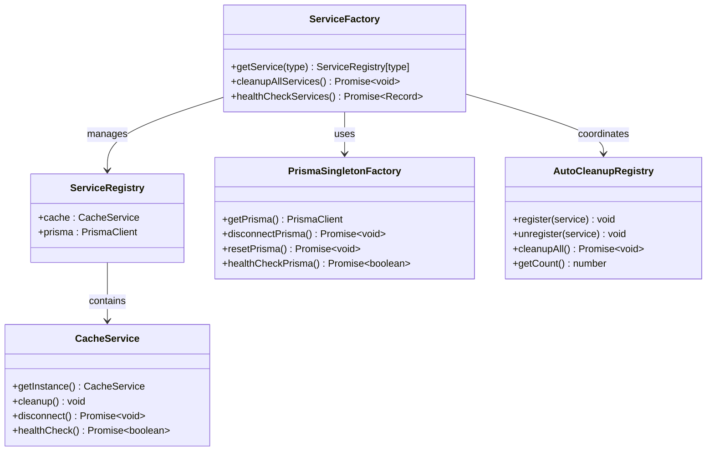

**Diagram sources**
- [service-factory.ts:1-97](file://pikzels-clone\src\utils\service-factory.ts#L1-L97)
- [prisma-factory.ts:1-109](file://pikzels-clone\src\utils\prisma-factory.ts#L1-L109)
- [auto-cleanup.ts:1-141](file://pikzels-clone\src\utils\auto-cleanup.ts#L1-L141)

### Benefits of Centralized Service Management
The centralized service factory pattern provides several key benefits:

- **Reduced Singleton Complexity**: Hides getInstance() calls behind factory functions
- **Automatic Lifecycle Management**: Handles service cleanup without manual intervention
- **Type-Safe Service Resolution**: TypeScript ensures valid service names at compile time
- **Easy Extensibility**: Simple to add new services to the registry
- **Improved Testability**: Services can be automatically cleaned up after tests
- **Consistent Service Access**: All services accessed through standardized interface

### Migration from Direct Singleton Access
The factory pattern provides a clear migration path from direct singleton access:

**Old Pattern (Discouraged)**:
```typescript
import { CacheService } from '../services/cache.service';
const cache = CacheService.getInstance();
await cache.set('key', value);
```

**New Pattern (Recommended)**:
```typescript
import { getService } from '../utils/service-factory';
const cache = getService('cache');
await cache.set('key', value);
```

**Benefits of Factory Pattern**:
- Centralized service access
- Automatic cleanup coordination
- Type-safe service resolution
- Easier to extend (add new services to registry)
- No manual setup.ts updates needed

### Prisma Singleton Management
The centralized Prisma singleton management prevents connection pool leaks in tests and reduces worker failures:

- **Single Prisma Instance**: Shared across entire application
- **Automatic Cleanup**: Via auto-cleanup registry
- **Type-Safe**: With PrismaClient type
- **Graceful Shutdown**: Automatic disconnection on process exit
- **Test Isolation**: Optional reset for fresh state

**Updated** Complete implementation of centralized service factory pattern with comprehensive service lifecycle management and improved test reliability.

**Section sources**
- [service-factory.ts:1-97](file://pikzels-clone\src\utils\service-factory.ts#L1-L97)
- [prisma-factory.ts:1-109](file://pikzels-clone\src\utils\prisma-factory.ts#L1-L109)
- [auto-cleanup.ts:1-141](file://pikzels-clone\src\utils\auto-cleanup.ts#L1-L141)

## Canvas Engine Architecture

The frontend canvas engine has been significantly enhanced with new upload overlay functionality, improved drawing helpers, and enhanced contextual toolbar components. The canvas engine now provides a comprehensive editing environment with advanced user interaction capabilities.

### Upload Zone Overlay System
The UploadZoneOverlay component provides interactive upload zones for composition template placeholder layers with comprehensive drag-and-drop support and visual feedback.

```mermaid
classDiagram
class UploadZoneOverlay {
+layers : Layer[]
+onFillZone : Function
+onClearZone : Function
+uploadZones : Layer[]
+filledZones : Layer[]
}
class UploadZoneItem {
+layer : ShapeLayer & { slotMetadata : SlotMetadata }
+onFill : Function
+fileInputRef : RefObject
+isDragOver : boolean
+isHovered : boolean
+processFile : Function
+handleClick : Function
+handleFileChange : Function
+handleDragOver : Function
+handleDragLeave : Function
+handleDrop : Function
}
class ClearButton {
+layer : ImageLayer & { slotMetadata : SlotMetadata }
+onClear : Function
+isHovered : boolean
+showButton : boolean
}
UploadZoneOverlay --> UploadZoneItem : renders
UploadZoneOverlay --> ClearButton : renders
UploadZoneItem --> SlotMetadata : uses
ClearButton --> SlotMetadata : uses
```

**Diagram sources**
- [UploadZoneOverlay.tsx:56-394](file://pikzels-clone\client\src\components\editor\canvas\UploadZoneOverlay.tsx#L56-L394)

### Canvas Drawing Helpers
The canvasDrawingHelpers module provides optimized drawing operations for canvas manipulation with comprehensive coordinate handling and state management.

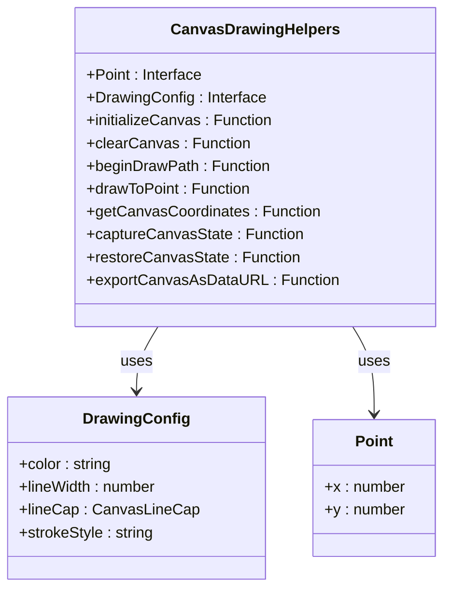

**Diagram sources**
- [canvasDrawingHelpers.ts:16-125](file://pikzels-clone\client\src\components\editor\canvas\canvasDrawingHelpers.ts#L16-L125)

### Enhanced Contextual Toolbar System
The ContextualToolbar component provides AI-powered actions based on selected layer types with dynamic positioning and loading states.

```mermaid
classDiagram
class ContextualToolbar {
+selectedLayers : Layer[]
+layerBounds : Bounds | null
+canvasZoom : number
+canvasPan : Vector
+onAction : Function
+loadingActions : Set~string~
+actions : QuickAction[]
+toolbarStyle : CSSProperties
+handleAction : Function
+getIcon : Function
}
class QuickAction {
+id : string
+label : string
+icon : string
+enabled : boolean
+loading : boolean
+tooltip : string
}
class Icons {
+RemoveBg : Function
+Upscale : Function
+Enhance : Function
+Replace : Function
+Expand : Function
+Inpaint : Function
+FaceSwap : Function
+Restyle : Function
+Effects : Function
+Sparkles : Function
+Decompose : Function
+Loader : Function
}
ContextualToolbar --> QuickAction : manages
ContextualToolbar --> Icons : uses
```

**Diagram sources**
- [ContextualToolbar.tsx:94-217](file://pikzels-clone\client\src\components\editor\components\ContextualToolbar.tsx#L94-L217)

**Section sources**
- [UploadZoneOverlay.tsx:1-395](file://pikzels-clone\client\src\components\editor\canvas\UploadZoneOverlay.tsx#L1-L395)
- [canvasDrawingHelpers.ts:1-126](file://pikzels-clone\client\src\components\editor\canvas\canvasDrawingHelpers.ts#L1-L126)
- [ContextualToolbar.tsx:1-218](file://pikzels-clone\client\src\components\editor\components\ContextualToolbar.tsx#L1-L218)

## Frontend Canvas Enhancement Features

The frontend canvas engine now includes comprehensive enhancement features that significantly improve the user editing experience with advanced upload capabilities, optimized drawing operations, and intelligent contextual toolbars.

### Upload Zone Management Features
The upload zone system provides intuitive image placement with comprehensive drag-and-drop support:

- **Interactive Upload Zones**: Visual placeholders with hover states and drag indicators
- **Multi-Format Support**: Accepts images, URLs, and drag-and-drop file uploads
- **Size Validation**: Automatic file size checking with 10MB limit
- **Visual Feedback**: Glowing borders, tooltips, and clear instructions
- **Required Slot Indicators**: Badge system for mandatory template slots
- **Clear Functionality**: One-click removal of placed images
- **Lock State Handling**: Respects layer lock status for security

### Enhanced Drawing Operations
The canvas drawing helpers provide optimized drawing operations with comprehensive state management:

- **Coordinate Transformation**: Accurate canvas-to-screen coordinate conversion
- **State Capture**: Full canvas state preservation and restoration
- **Export Capabilities**: High-quality image export with format and quality options
- **Drawing Path Management**: Optimized path creation and rendering
- **Background Initialization**: Configurable background color support
- **Performance Optimization**: Efficient canvas operations with minimal reflows

### Intelligent Contextual Toolbars
The contextual toolbar system provides AI-powered actions tailored to selected layer types:

- **Layer-Specific Actions**: Dynamic action sets based on layer type (image, text, shape)
- **AI-Powered Operations**: Advanced AI actions like background removal, upscaling, enhancement
- **Loading States**: Visual feedback for ongoing AI operations
- **Positioning Logic**: Smart toolbar placement above or below selected layers
- **Icon System**: Comprehensive SVG icon library with loading states
- **Multiple Selection Support**: Common actions for multi-layer selections

### Canvas Rendering Optimizations
The canvas rendering system includes comprehensive optimizations for performance and user experience:

- **Drawing Layer Rendering**: Optimized rendering of vector paths and shapes
- **Round Rectangle Support**: Efficient rounded rectangle drawing with stroke support
- **Path Optimization**: Minimized path operations for complex drawings
- **Alpha Channel Management**: Proper transparency handling for layered graphics
- **Stroke Configuration**: Advanced stroke styling with line caps and joins

**Updated** Comprehensive documentation of frontend canvas engine enhancements including upload overlay functionality, improved drawing helpers, enhanced contextual toolbar components, and optimized canvas rendering operations.

**Section sources**
- [UploadZoneOverlay.tsx:69-394](file://pikzels-clone\client\src\components\editor\canvas\UploadZoneOverlay.tsx#L69-L394)
- [canvasDrawingHelpers.ts:28-125](file://pikzels-clone\client\src\components\editor\canvas\canvasDrawingHelpers.ts#L28-L125)
- [ContextualToolbar.tsx:130-217](file://pikzels-clone\client\src\components\editor\components\ContextualToolbar.tsx#L130-L217)
- [CanvasEngine.tsx:498-512](file://pikzels-clone\client\src\components\editor\canvas\CanvasEngine.tsx#L498-L512)

## Dependency Analysis

The backend has a well-defined dependency graph with enhanced security and reliability layers. The server imports all module routes, which in turn depend on their respective controllers and services, with comprehensive middleware integration including enhanced security logging, CORS credentials support, the new centralized service factory pattern, distributed tracing, and per-user rate limiting.

```mermaid
graph TD
server.ts --> security.middleware.ts
server.ts --> validation.middleware.ts
server.ts --> session-coordination.middleware.ts
server.ts --> performance.middleware.ts
server.ts --> request-id.middleware.ts
server.ts --> auth.routes.ts
server.ts --> thumbnail.routes.ts
server.ts --> analytics.routes.ts
server.ts --> social-share.routes.ts
server.ts --> event-registry.ts
server.ts --> system-monitoring.service.ts
security.middleware.ts --> helmet
security.middleware.ts --> express-rate-limit
security.middleware.ts --> cookie-parser
security.middleware.ts --> rate-limiter-flexible
validation.middleware.ts --> isomorphic-dompurify
validation.middleware.ts --> validator
session-coordination.middleware.ts --> ioredis
session-coordination.middleware.ts --> jsonwebtoken
performance.middleware.ts --> service-factory.ts
request-id.middleware.ts --> request-context.ts
auth.routes.ts --> security.middleware.ts
auth.routes.ts --> validation.middleware.ts
auth.routes.ts --> auth.controller.ts
auth.controller.ts --> auth.service.ts
auth.service.ts --> prisma-factory.ts
auth.service.ts --> jwt.enhanced.service.ts
thumbnail.routes.ts --> auth.middleware.ts
thumbnail.routes.ts --> thumbnail.controller.ts
thumbnail.controller.ts --> thumbnail.service.ts
thumbnail.service.ts --> prisma-factory.ts
thumbnail.service.ts --> event-emitter.ts
thumbnail.routes.ts --> userApiRateLimit
thumbnail.routes.ts --> userAiRateLimit
thumbnail.routes.ts --> userUploadRateLimit
thumbnail.public.routes.ts --> thumbnail.controller.ts
analytics.routes.ts --> analytics.controller.ts
analytics.controller.ts --> analytics.service.ts
analytics.service.ts --> prisma-factory.ts
social-share.routes.ts --> social-share.controller.ts
social-share.controller.ts --> social-share.service.ts
social-share.service.ts --> prisma-factory.ts
event-registry.ts --> event-emitter.ts
event-registry.ts --> analytics-handlers.ts
event-registry.ts --> social-share-handlers.ts
event-emitter.ts --> event-persistence.ts
system-monitoring.service.ts --> prisma-factory.ts
system-monitoring.service.ts --> Redis
service-factory.ts --> cache.service.ts
prisma-factory.ts --> PrismaClient
auto-cleanup.ts --> service-factory.ts
auto-cleanup.ts --> prisma-factory.ts
request-context.ts --> AsyncLocalStorage
```

**Diagram sources**
- [server.ts:1-468](file://pikzels-clone\src\server.ts#L1-L468)
- [security.middleware.ts:1-410](file://pikzels-clone\src\middleware\security.middleware.ts#L1-L410)
- [validation.middleware.ts:1-352](file://pikzels-clone\src\middleware\validation.middleware.ts#L1-L352)
- [session-coordination.middleware.ts:1-339](file://pikzels-clone\src\middleware\session-coordination.middleware.ts#L1-L339)
- [performance.middleware.ts:1-234](file://pikzels-clone\src\middleware\performance.middleware.ts#L1-L234)
- [request-id.middleware.ts:1-39](file://pikzels-clone\src\middleware\request-id.middleware.ts#L1-L39)
- [event-registry.ts:1-195](file://pikzels-clone\src\events\event-registry.ts#L1-L195)
- [system-monitoring.service.ts:1-722](file://pikzels-clone\src\modules\admin\system-monitoring.service.ts#L1-L722)
- [service-factory.ts:1-97](file://pikzels-clone\src\utils\service-factory.ts#L1-L97)
- [prisma-factory.ts:1-109](file://pikzels-clone\src\utils\prisma-factory.ts#L1-L109)
- [auto-cleanup.ts:1-141](file://pikzels-clone\src\utils\auto-cleanup.ts#L1-L141)
- [request-context.ts:1-32](file://pikzels-clone\src\utils\request-context.ts#L1-L32)

**Section sources**
- [server.ts:1-468](file://pikzels-clone\src\server.ts#L1-L468)

## Performance Considerations

The backend is designed for scalability and performance with enhanced security, reliability, service lifecycle management, distributed tracing, and per-user rate limiting features:
- Static assets (processed images) are served directly via Express static middleware.
- Database operations are abstracted through centralized Prisma singleton management for efficient querying and automatic cleanup.
- Authentication is stateless using JWT with session coordination for persistence.
- Services are designed to be asynchronous and non-blocking with centralized factory pattern for improved performance.
- Enhanced input validation and rate limiting are implemented at the middleware layer for security.
- Event persistence uses append-only file storage for high write performance.
- Caching is implemented for frequently accessed data like AI styles and enhancements through the centralized service factory.
- Session coordination provides persistent login sessions across server restarts.
- Event-driven architecture enables scalable background processing.
- Comprehensive error handling and logging for operational visibility.
- API-only architecture reduces server overhead and improves response times.
- Enhanced health check endpoint provides comprehensive system monitoring including service factory status, request-id middleware validation, and replicate queue statistics.
- Enhanced security logging provides insights into system security posture.
- CORS credentials support enables secure cross-origin authentication.
- Production security configuration validation ensures proper security settings.
- Centralized service factory pattern improves service lifecycle management and reduces memory leaks.
- Auto-cleanup registry ensures services are properly cleaned up without manual intervention.
- Prisma singleton management prevents connection pool leaks in tests and reduces worker failures.
- Comprehensive system monitoring provides detailed health checks for database, Redis, filesystem, API, and external services.
- Performance metrics collection tracks response times, error rates, cache statistics, and request context integration.
- Performance testing framework validates system performance and identifies optimization opportunities.
- Distributed tracing enables comprehensive request correlation and performance analysis.
- Per-user rate limiting provides granular control over API usage with Redis/Memory fallback for resilience.
- Express 5 upgrade improves type safety and error handling throughout the application.
- **Canvas Engine Enhancements**: Frontend canvas engine improvements with upload overlay functionality, optimized drawing helpers, and enhanced contextual toolbar components provide superior user experience and performance.

**Updated** Enhanced with comprehensive system monitoring, detailed performance metrics, enhanced health check endpoint with cache health monitoring, database connectivity checks, event registry statistics, performance configuration flags, performance testing framework, positioned health check before error handlers for proper Railway health check monitoring, distributed tracing capabilities, per-user rate limiting implementation, Express 5 type safety improvements, comprehensive frontend canvas engine enhancements, and improved user interaction capabilities.

## Deployment Architecture

The system now operates as a pure API service with clear separation between backend and frontend:

### Enhanced Production Deployment
- **Backend**: Express.js API server running on port 8550 with enhanced TypeScript compatibility, comprehensive security logging, centralized service factory pattern, distributed tracing, and per-user rate limiting
- **Frontend**: React application running on port 8556 with enhanced canvas engine capabilities including upload overlays, optimized drawing helpers, and intelligent contextual toolbars
- **Communication**: Frontend proxies API requests to backend with CORS credentials support
- **Static Assets**: Processed images served directly by backend
- **Health Monitoring**: Comprehensive health check endpoint for system monitoring including service factory status, request-id middleware validation, and replicate queue statistics
- **Security Configuration**: Production-grade security with validated configuration
- **Service Management**: Centralized service factory handles all service lifecycle management
- **System Monitoring**: Comprehensive system monitoring service for detailed health checks and performance metrics
- **Performance Tracking**: Detailed performance metrics collection and analysis with request context integration
- **Distributed Tracing**: End-to-end request correlation across microservices
- **Rate Limiting**: Advanced per-user rate limiting with Redis/Memory fallback
- **Error Handling**: Comprehensive error handling with custom error classes and request-ID correlation
- **Canvas Engine**: Enhanced frontend canvas engine with upload overlay functionality, improved drawing helpers, and contextual toolbar components

### Improved Development Environment
- **Backend**: API server with development-friendly responses, enhanced error handling, and centralized service factory pattern
- **Frontend**: React development server with hot reloading and enhanced canvas engine debugging
- **Proxy Configuration**: Automatic API proxying from frontend to backend
- **Environment Variables**: Separate configuration for development and production
- **Security Banner**: Clear warnings about relaxed security in development mode
- **Service Factory**: Development mode supports both direct singleton access and factory pattern
- **Performance Testing**: Integrated performance testing framework for validation
- **Distributed Tracing**: Request context available for development debugging
- **Rate Limiting**: Rate limiting disabled or reduced for development testing
- **Canvas Engine Debugging**: Enhanced debugging capabilities for canvas operations

```mermaid
graph TB
subgraph "Production Environment"
Backend[Backend API:8550] --> Database[(Database)]
Backend --> Cache[(Redis Cache)]
Backend --> Storage[(File Storage)]
Backend --> ServiceFactory[Service Factory Pattern]
ServiceFactory --> CacheService[Cache Service]
ServiceFactory --> PrismaSingleton[Prisma Singleton]
Backend --> SystemMonitoring[System Monitoring Service]
SystemMonitoring --> HealthChecks[Health Checks]
SystemMonitoring --> PerformanceMetrics[Performance Metrics]
Backend --> RequestIdMiddleware[Request-ID Middleware]
Backend --> PerUserRateLimiting[Per-User Rate Limiting]
Backend --> DistributedTracing[Distributed Tracing]
Frontend[Frontend:8556] --> Backend
Backend --> SecurityConfig[Security Config Validation]
Backend --> CanvasEngine[Enhanced Canvas Engine]
CanvasEngine --> UploadZoneOverlay[Upload Zone Overlay]
CanvasEngine --> CanvasDrawingHelpers[Drawing Helpers]
CanvasEngine --> ContextualToolbar[Contextual Toolbar]
end
subgraph "Development Environment"
DevBackend[Backend Dev:8550] --> DevDatabase[(Dev Database)]
DevBackend --> DevCache[(Dev Redis)]
DevBackend --> RequestContext[Request Context]
DevBackend --> DevRateLimiting[Development Rate Limiting]
DevFrontend[Frontend Dev:8556] --> DevBackend
DevBackend --> DevSecurityBanner[Dev Security Banner]
DevBackend --> DevServiceFactory[Dev Service Factory]
DevBackend --> PerformanceTest[Performance Testing Framework]
DevBackend --> CanvasEngineDev[Canvas Engine Dev]
CanvasEngineDev --> UploadZoneOverlayDev[Upload Zone Overlay Dev]
CanvasEngineDev --> CanvasDrawingHelpersDev[Drawing Helpers Dev]
CanvasEngineDev --> ContextualToolbarDev[Contextual Toolbar Dev]
end
```

**Diagram sources**
- [server.ts:294-324](file://pikzels-clone\src\server.ts#L294-L324)
- [vite.config.ts:17-23](file://pikzels-clone\client\vite.config.ts#L17-L23)
- [server.ts](file://pikzels-clone\src\server.ts#L58)
- [security.config.ts:98-112](file://pikzels-clone\src\config\security.config.ts#L98-L112)
- [service-factory.ts:1-97](file://pikzels-clone\src\utils\service-factory.ts#L1-L97)
- [prisma-factory.ts:1-109](file://pikzels-clone\src\utils\prisma-factory.ts#L1-L109)
- [system-monitoring.service.ts:1-722](file://pikzels-clone\src\modules\admin\system-monitoring.service.ts#L1-L722)
- [performance-test.ts:1-248](file://pikzels-clone\src\scripts\performance-test.ts#L1-L248)
- [request-id.middleware.ts:1-39](file://pikzels-clone\src\middleware\request-id.middleware.ts#L1-L39)
- [security.middleware.ts:89-246](file://pikzels-clone\src\middleware\security.middleware.ts#L89-L246)
- [request-context.ts:1-32](file://pikzels-clone\src\utils\request-context.ts#L1-L32)
- [UploadZoneOverlay.tsx:1-395](file://pikzels-clone\client\src\components\editor\canvas\UploadZoneOverlay.tsx#L1-L395)
- [canvasDrawingHelpers.ts:1-126](file://pikzels-clone\client\src\components\editor\canvas\canvasDrawingHelpers.ts#L1-L126)
- [ContextualToolbar.tsx:1-218](file://pikzels-clone\client\src\components\editor\components\ContextualToolbar.tsx#L1-L218)

**Updated** Enhanced with improved TypeScript compatibility, robust environment variable handling, comprehensive security logging, CORS credentials support, centralized service factory pattern, comprehensive service lifecycle management, system monitoring capabilities, performance testing framework, positioned health check before error handlers for proper Railway health check monitoring, distributed tracing capabilities, per-user rate limiting implementation, Express 5 type safety improvements, comprehensive frontend canvas engine enhancements, and enhanced user interaction capabilities.

**Section sources**
- [server.ts:294-324](file://pikzels-clone\src\server.ts#L294-L324)
- [vite.config.ts:17-23](file://pikzels-clone\client\vite.config.ts#L17-L23)
- [security.config.ts:98-112](file://pikzels-clone\src\config\security.config.ts#L98-L112)

## Troubleshooting Guide

Common issues and solutions:
- **401 Unauthorized**: Ensure valid JWT token is included in Authorization header or session token cookie with CORS credentials support.
- **404 Not Found**: Verify route paths and server mounting points in `server.ts`.
- **500 Internal Server Error**: Check database connectivity and Prisma client initialization with enhanced error logging.
- **CORS Errors**: Confirm CORS middleware is properly configured for frontend origin with credentials support enabled.
- **Token Expiry**: Implement token refresh mechanism in client applications using enhanced JWT service.
- **429 Too Many Requests**: Check rate limiting configuration in security middleware, verify Redis connectivity for per-user rate limiting.
- **413 Request Entity Too Large**: Verify request size limits in security middleware.
- **Event Persistence Issues**: Check file system permissions for events-store directory.
- **Session Coordination Failures**: Verify Redis connection or file storage permissions.
- **Event Handler Registration Issues**: Check event registry initialization and handler registration.
- **Security Header Problems**: Review CSP directives and security configuration.
- **API-Only Deployment Issues**: Verify frontend proxy configuration and CORS settings.
- **Health Check Failures**: Check cache connectivity, event system initialization, service factory status, request-id middleware validation, replicate queue statistics, and positioned before error handlers.
- **Frontend Communication Problems**: Verify proxy configuration and API endpoint URLs.
- **Public Thumbnail Access Issues**: Verify share token validity and expiration dates.
- **Environment Variable Errors**: Check `.env` file configuration and TypeScript compatibility.
- **Security Logging Issues**: Verify security logger configuration and suspicious pattern detection.
- **Authentication Attempt Failures**: Check authentication middleware logs and token validation.
- **Production Security Configuration Errors**: Verify security configuration validation and production settings.
- **Service Factory Pattern Issues**: Verify service factory imports and migration from direct singleton access.
- **Prisma Connection Leaks**: Check Prisma singleton management and automatic cleanup.
- **Auto-Cleanup Registry Failures**: Verify service registration and cleanup process.
- **Performance Monitoring Issues**: Check cache connectivity and performance middleware configuration.
- **System Monitoring Failures**: Verify Redis connection and system monitoring service initialization.
- **Performance Test Failures**: Check cache health and performance testing framework configuration.
- **Cache Health Issues**: Verify Redis connectivity and automatic fallback to in-memory cache.
- **Database Connectivity Problems**: Check Prisma connection and system monitoring database health checks.
- **Distributed Tracing Issues**: Verify request-id middleware configuration and AsyncLocalStorage setup.
- **Per-User Rate Limiting Failures**: Check Redis connectivity, rate limiter configuration, and fallback to memory-based rate limiting.
- **Express 5 Type Safety Issues**: Verify middleware signatures and request/response types for Express 5 compatibility.
- **Input Sanitization Errors**: Check Express 5 req.query getter-only behavior and validation approaches.
- **Canvas Engine Issues**: Verify upload overlay functionality, drawing helper operations, and contextual toolbar positioning.
- **Upload Zone Problems**: Check file size validation, drag-and-drop handling, and visual feedback states.
- **Drawing Helper Errors**: Verify coordinate transformations, state capture/restore operations, and export functionality.
- **Contextual Toolbar Failures**: Check action availability, positioning calculations, and loading state management.

**Updated** Enhanced with troubleshooting guidance for new centralized service factory pattern, Prisma singleton management, auto-cleanup registry, comprehensive service lifecycle management, system monitoring capabilities, performance metrics collection, performance testing framework, positioned health check before error handlers for proper Railway health check monitoring, distributed tracing capabilities, per-user rate limiting implementation, Express 5 type safety improvements, input sanitization compatibility with req.query getter-only behavior, comprehensive frontend canvas engine troubleshooting, upload overlay functionality validation, drawing helper optimization, and contextual toolbar positioning issues.

**Section sources**
- [auth.middleware.ts:1-218](file://pikzels-clone\src\middleware\auth.middleware.ts#L1-L218)
- [security.middleware.ts:1-410](file://pikzels-clone\src\middleware\security.middleware.ts#L1-L410)
- [session-coordination.middleware.ts:1-339](file://pikzels-clone\src\middleware\session-coordination.middleware.ts#L1-L339)
- [server.ts:1-468](file://pikzels-clone\src\server.ts#L1-L468)
- [logger.ts:118-163](file://pikzels-clone\src\utils\logger.ts#L118-L163)
- [service-factory.ts:67-96](file://pikzels-clone\src\utils\service-factory.ts#L67-L96)
- [prisma-factory.ts:66-86](file://pikzels-clone\src\utils\prisma-factory.ts#L66-L86)
- [auto-cleanup.ts:107-125](file://pikzels-clone\src\utils\auto-cleanup.ts#L107-L125)
- [system-monitoring.service.ts:1-722](file://pikzels-clone\src\modules\admin\system-monitoring.service.ts#L1-L722)
- [performance.middleware.ts:1-234](file://pikzels-clone\src\middleware\performance.middleware.ts#L1-L234)
- [performance-test.ts:1-248](file://pikzels-clone\src\scripts\performance-test.ts#L1-L248)
- [request-id.middleware.ts:1-39](file://pikzels-clone\src\middleware\request-id.middleware.ts#L1-L39)
- [request-context.ts:1-32](file://pikzels-clone\src\utils\request-context.ts#L1-L32)
- [per-user-rate-limit.test.ts:1-191](file://pikzels-clone\src\middleware\__tests__\per-user-rate-limit.test.ts#L1-L191)
- [UploadZoneOverlay.tsx:82-145](file://pikzels-clone\client\src\components\editor\canvas\UploadZoneOverlay.tsx#L82-L145)
- [canvasDrawingHelpers.ts:83-125](file://pikzels-clone\client\src\components\editor\canvas\canvasDrawingHelpers.ts#L83-L125)
- [ContextualToolbar.tsx:163-175](file://pikzels-clone\client\src\components\editor\components\ContextualToolbar.tsx#L163-L175)

## Conclusion

The Thumbnail Maker Studio backend has successfully transformed from a full-stack SPA to a modern API-only service architecture with significant enhancements to security, debugging, operational capabilities, service lifecycle management, distributed tracing, and per-user rate limiting. This major architectural evolution provides numerous benefits including improved scalability, maintainability, separation of concerns, comprehensive production-ready features, and revolutionary centralized service factory pattern.

The enhanced architecture includes comprehensive security middleware with suspicious pattern detection, authentication attempt logging, and production security configuration validation. CORS credentials support enables secure cross-origin authentication with HttpOnly cookies, while enhanced error logging provides detailed debugging information for production environments. The new request-id middleware with AsyncLocalStorage-based request context propagation enables comprehensive distributed tracing across microservices.

The API-only approach enables better separation between frontend and backend responsibilities, allowing for independent scaling and deployment of each component. The enhanced health check endpoint provides comprehensive system monitoring including service factory status, request-id middleware validation, and replicate queue statistics, while the improved development experience offers clear guidance for developers working with the API-first architecture.

The MVC-like pattern with routes, controllers, and services ensures clean code organization, while the centralized service factory pattern enables seamless integration with frontend clients and improved service lifecycle management. Security is enforced through JWT-based authentication, comprehensive input validation, rate limiting, session coordination, enhanced security logging, distributed tracing, per-user rate limiting, and the new centralized service factory pattern for improved maintainability.

The centralized service factory pattern positions Thumbnail Maker Studio for future growth and feature expansion while maintaining high standards for security, reliability, operational visibility, and developer experience. The enhanced debugging capabilities, CORS credentials support, comprehensive security infrastructure, revolutionary service lifecycle management, distributed tracing, per-user rate limiting, and Express 5 type safety improvements provide a solid foundation for production deployment and long-term maintenance.

The new service factory pattern, Prisma singleton management, auto-cleanup registry, comprehensive system monitoring, performance metrics collection, performance testing framework, distributed tracing capabilities, per-user rate limiting implementation, and Express 5 upgrade position Thumbnail Maker Studio as a production-ready, observability-focused backend architecture that provides comprehensive monitoring, debugging, optimization capabilities, and distributed tracing for modern web applications.

**Updated** Enhanced with comprehensive system monitoring, detailed performance metrics, enhanced health check endpoint with cache health monitoring, database connectivity checks, event registry statistics, performance configuration flags, performance testing framework, positioned health check before error handlers for proper Railway health check monitoring, distributed tracing capabilities, per-user rate limiting implementation, Express 5 type safety improvements, input sanitization compatibility with req.query getter-only behavior, comprehensive frontend canvas engine enhancements including upload overlay functionality, improved drawing helpers, and enhanced contextual toolbar components, and optimized canvas rendering operations for superior user experience.