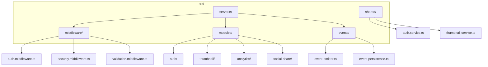
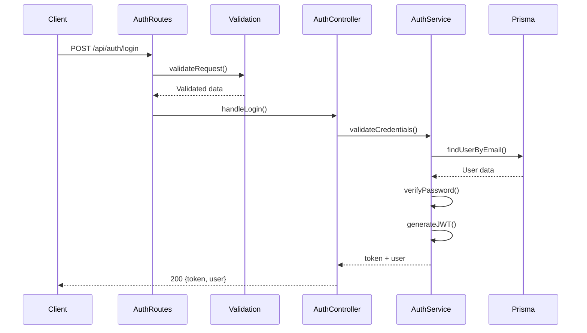
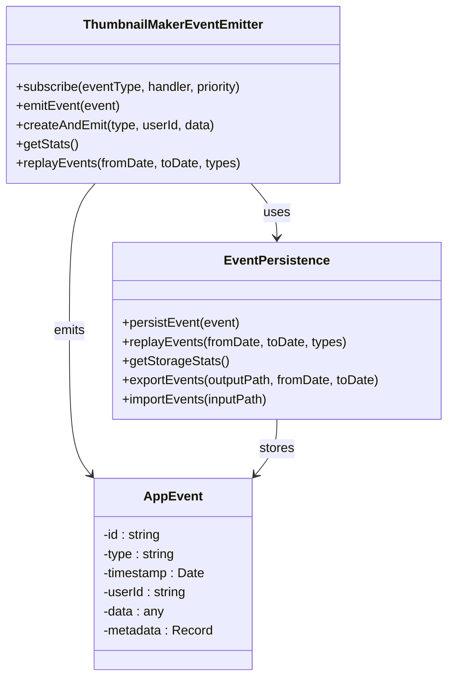
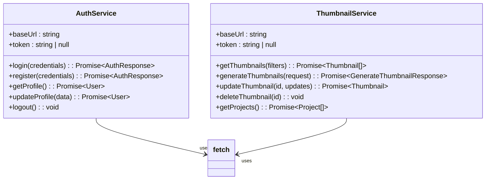
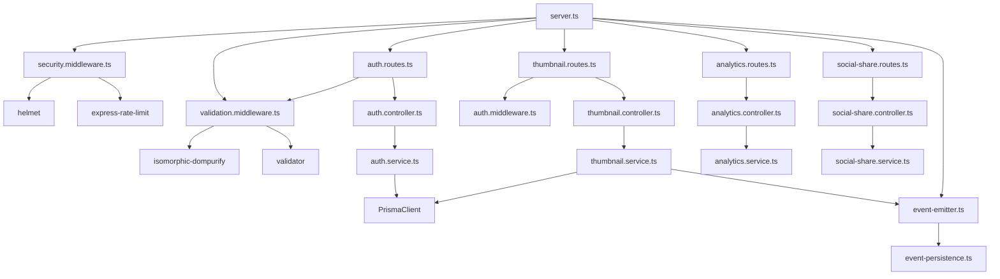

# Backend Architecture

<cite>
**Referenced Files in This Document**   
- [server.ts](file://pikzels-clone\src\server.ts) - *Updated with enhanced security and event system*
- [auth.middleware.ts](file://pikzels-clone\src\middleware\auth.middleware.ts) - *Updated with enhanced JWT service*
- [security.middleware.ts](file://pikzels-clone\src\middleware\security.middleware.ts) - *Added in recent commit*
- [validation.middleware.ts](file://pikzels-clone\src\middleware\validation.middleware.ts) - *Added in recent commit*
- [event-emitter.ts](file://pikzels-clone\src\events\event-emitter.ts) - *Added in recent commit*
- [event-persistence.ts](file://pikzels-clone\src\events\event-persistence.ts) - *Added in recent commit*
- [event-types.ts](file://pikzels-clone\src\events\event-types.ts) - *Added in recent commit*
- [auth.routes.ts](file://pikzels-clone\src\modules\auth\auth.routes.ts) - *Updated with validation middleware*
- [thumbnail.routes.ts](file://pikzels-clone\src\modules\thumbnail\thumbnail.routes.ts) - *Updated with authentication middleware*
</cite>

## Update Summary
**Changes Made**   
- Added comprehensive security middleware including rate limiting, input sanitization, and security headers
- Implemented event-driven architecture with event emitter and persistence system
- Enhanced input validation with structured validation rules and sanitization
- Updated request lifecycle to include new middleware layers
- Added health check endpoint with event system monitoring
- Updated architecture diagrams to reflect new components
- Added detailed documentation for event system implementation and usage

## Table of Contents
1. [Introduction](#introduction)
2. [Project Structure](#project-structure)
3. [Core Components](#core-components)
4. [Architecture Overview](#architecture-overview)
5. [Detailed Component Analysis](#detailed-component-analysis)
6. [Dependency Analysis](#dependency-analysis)
7. [Performance Considerations](#performance-considerations)
8. [Troubleshooting Guide](#troubleshooting-guide)
9. [Conclusion](#conclusion)

## Introduction
This document provides a comprehensive overview of the backend architecture of Thumbnail Maker Studio, a full-stack application built with Express.js. The backend follows a modular, feature-based organization with a clear separation of concerns using an MVC-like pattern. It includes robust authentication, modular routing, service-layer abstraction, and shared utilities for cross-platform use. This documentation details the server structure, request lifecycle, middleware pipeline, and best practices for extending the system.

## Project Structure

The backend resides in the `pikzels-clone/src` directory and is organized around feature modules. Each module (e.g., auth, thumbnail, analytics) contains its own routes, controllers, and services, promoting encapsulation and maintainability. Shared services in the `shared/` directory enable code reuse between web and mobile clients.



**Diagram sources**
- [server.ts](file://pikzels-clone\src\server.ts#L1-L268)
- [middleware/security.middleware.ts](file://pikzels-clone\src\middleware\security.middleware.ts#L1-L230)
- [events/event-emitter.ts](file://pikzels-clone\src\events\event-emitter.ts#L1-L272)
- [events/event-persistence.ts](file://pikzels-clone\src\events\event-persistence.ts#L1-L328)

**Section sources**
- [server.ts](file://pikzels-clone\src\server.ts#L1-L268)

## Core Components

The backend architecture is built on Express.js and follows a modular MVC-like pattern. Key components include:
- **server.ts**: Entry point that configures middleware and mounts feature-based routes.
- **Middleware**: Includes CORS, JSON parsing, JWT-based authentication, security headers, rate limiting, and input validation.
- **Feature Modules**: Each module (auth, thumbnail, etc.) encapsulates routes, controllers, and services.
- **Event System**: Event-driven architecture with emitter and persistent storage for reliability.
- **Shared Services**: Reusable client-side services for web and mobile apps to interact with the API.

The architecture promotes separation of concerns, testability, and scalability. Each HTTP request flows through a defined pipeline: route → controller → service → database.

**Section sources**
- [server.ts](file://pikzels-clone\src\server.ts#L1-L268)
- [middleware/security.middleware.ts](file://pikzels-clone\src\middleware\security.middleware.ts#L1-L230)
- [middleware/validation.middleware.ts](file://pikzels-clone\src\middleware\validation.middleware.ts#L1-L351)

## Architecture Overview

The backend implements a clean, modular architecture with distinct layers for routing, business logic, and data access. The Express server uses a middleware pipeline to handle cross-cutting concerns like authentication, security, and input validation before delegating to route handlers.

```mermaid
graph TB
Client[HTTP Client] --> Server[Express Server]
Server --> SecurityHeaders[securityHeaders]
Server --> RateLimit[generalRateLimit]
Server --> RequestSize[requestSizeLimit]
Server --> JSON[express.json()]
Server --> Sanitize[sanitizeInput]
Server --> AuthMiddleware[authenticateToken]
AuthMiddleware --> |Authenticated| Routes
AuthMiddleware --> |Unauthorized| Unauthorized[401/403 Response]
Routes --> Controller[Controller]
Controller --> Service[Service]
Service --> Prisma[Prisma Client]
Prisma --> DB[(Database)]
Service --> External[External APIs]
Service --> FS[(File System)]
Controller --> Response[JSON Response]
Controller --> Event[emitEvent]
Event --> Emitter[eventEmitter]
Emitter --> Persistence[eventPersistence]
```

**Diagram sources**
- [server.ts](file://pikzels-clone\src\server.ts#L1-L268)
- [middleware/security.middleware.ts](file://pikzels-clone\src\middleware\security.middleware.ts#L1-L230)
- [middleware/validation.middleware.ts](file://pikzels-clone\src\middleware\validation.middleware.ts#L1-L351)
- [events/event-emitter.ts](file://pikzels-clone\src\events\event-emitter.ts#L1-L272)

## Detailed Component Analysis

### Auth Module Analysis
The authentication module handles user login, registration, and profile management. It uses JWT for stateless authentication and Prisma for database interactions. The module now includes comprehensive input validation and rate limiting for security.



**Diagram sources**
- [auth.routes.ts](file://pikzels-clone\src\modules\auth\auth.routes.ts)
- [validation.middleware.ts](file://pikzels-clone\src\middleware\validation.middleware.ts#L1-L351)
- [auth.controller.ts](file://pikzels-clone\src\modules\auth\auth.controller.ts)
- [auth.service.ts](file://pikzels-clone\src\modules\auth\auth.service.ts)

**Section sources**
- [auth.routes.ts](file://pikzels-clone\src\modules\auth\auth.routes.ts)
- [validation.middleware.ts](file://pikzels-clone\src\middleware\validation.middleware.ts#L1-L351)
- [auth.controller.ts](file://pikzels-clone\src\modules\auth\auth.controller.ts)
- [auth.service.ts](file://pikzels-clone\src\modules\auth\auth.service.ts)

### Thumbnail Module Analysis
The thumbnail module enables users to generate, retrieve, update, and delete thumbnails. It supports both authenticated and public endpoints. All routes require authentication and include caching for performance.

```mermaid
flowchart TD
A[POST /api/thumbnails/generate] --> B{authenticateToken}
B --> |Valid| C[validationMiddleware]
C --> D[thumbnail.controller.generate]
D --> E[thumbnail.service.generateThumbnails]
E --> F[AI Service / Image Processing]
F --> G[Save to DB + File System]
G --> H[emitEvent(thumbnail.created)]
H --> I[eventPersistence]
I --> J[Return thumbnails]
J --> K[201 Created]
B --> |Invalid| L[401 Unauthorized]
```

**Diagram sources**
- [thumbnail.routes.ts](file://pikzels-clone\src\modules\thumbnail\thumbnail.routes.ts)
- [auth.middleware.ts](file://pikzels-clone\src\middleware\auth.middleware.ts#L1-L189)
- [thumbnail.controller.ts](file://pikzels-clone\src\modules\thumbnail\thumbnail.controller.ts)
- [thumbnail.service.ts](file://pikzels-clone\src\modules\thumbnail\thumbnail.service.ts)
- [event-emitter.ts](file://pikzels-clone\src\events\event-emitter.ts#L1-L272)

**Section sources**
- [thumbnail.routes.ts](file://pikzels-clone\src\modules\thumbnail\thumbnail.routes.ts)
- [auth.middleware.ts](file://pikzels-clone\src\middleware\auth.middleware.ts#L1-L189)
- [thumbnail.controller.ts](file://pikzels-clone\src\modules\thumbnail\thumbnail.controller.ts)
- [thumbnail.service.ts](file://pikzels-clone\src\modules\thumbnail\thumbnail.service.ts)

### Event-Driven Architecture
The system implements an event-driven architecture for decoupled communication between components. Events are persisted to disk for reliability and can be replayed for recovery.



**Diagram sources**
- [event-emitter.ts](file://pikzels-clone\src\events\event-emitter.ts#L15-L226)
- [event-persistence.ts](file://pikzels-clone\src\events\event-persistence.ts#L14-L305)
- [event-types.ts](file://pikzels-clone\src\events\event-types.ts#L1-L122)

**Section sources**
- [event-emitter.ts](file://pikzels-clone\src\events\event-emitter.ts#L15-L226)
- [event-persistence.ts](file://pikzels-clone\src\events\event-persistence.ts#L14-L305)
- [event-types.ts](file://pikzels-clone\src\events\event-types.ts#L1-L122)

### Shared Services Pattern
The `shared/` directory contains TypeScript classes that act as API clients for frontend applications. These services encapsulate HTTP calls and authentication handling.



**Diagram sources**
- [shared/auth.service.ts](file://pikzels-clone\shared\auth.service.ts#L1-L141)
- [shared/thumbnail.service.ts](file://pikzels-clone\shared\thumbnail.service.ts#L1-L261)

**Section sources**
- [shared/auth.service.ts](file://pikzels-clone\shared\auth.service.ts#L1-L141)
- [shared/thumbnail.service.ts](file://pikzels-clone\shared\thumbnail.service.ts#L1-L261)

## Dependency Analysis

The backend has a well-defined dependency graph with minimal circular dependencies. The server imports all module routes, which in turn depend on their respective controllers and services.



**Diagram sources**
- [server.ts](file://pikzels-clone\src\server.ts#L1-L268)
- [security.middleware.ts](file://pikzels-clone\src\middleware\security.middleware.ts#L1-L230)
- [validation.middleware.ts](file://pikzels-clone\src\middleware\validation.middleware.ts#L1-L351)
- [event-emitter.ts](file://pikzels-clone\src\events\event-emitter.ts#L1-L272)

**Section sources**
- [server.ts](file://pikzels-clone\src\server.ts#L1-L268)

## Performance Considerations

The backend is designed for scalability and performance:
- Static assets (processed images) are served directly via Express static middleware.
- Database operations are abstracted through Prisma for efficient querying.
- Authentication is stateless using JWT, reducing server-side session storage.
- Services are designed to be asynchronous and non-blocking.
- Input validation and rate limiting are implemented at the middleware layer for security.
- Event persistence uses append-only file storage for high write performance.
- Caching is implemented for frequently accessed data like AI styles and enhancements.

## Troubleshooting Guide

Common issues and solutions:
- **401 Unauthorized**: Ensure valid JWT token is included in Authorization header.
- **404 Not Found**: Verify route paths and server mounting points in `server.ts`.
- **500 Internal Server Error**: Check database connectivity and Prisma client initialization.
- **CORS Errors**: Confirm CORS middleware is properly configured for frontend origin.
- **Token Expiry**: Implement token refresh mechanism in client applications.
- **429 Too Many Requests**: Check rate limiting configuration in security.middleware.ts.
- **413 Request Entity Too Large**: Verify request size limits in security middleware.
- **Event Persistence Issues**: Check file system permissions for events-store directory.

**Section sources**
- [auth.middleware.ts](file://pikzels-clone\src\middleware\auth.middleware.ts#L1-L189)
- [security.middleware.ts](file://pikzels-clone\src\middleware\security.middleware.ts#L1-L230)
- [server.ts](file://pikzels-clone\src\server.ts#L1-L268)

## Conclusion

The Thumbnail Maker Studio backend is a well-structured, modular Express.js application that follows best practices for separation of concerns, maintainability, and scalability. The MVC-like pattern with routes, controllers, and services ensures clean code organization. The shared services enable seamless integration with frontend clients. Security is enforced through JWT-based authentication, comprehensive input validation, and rate limiting. The new event-driven architecture provides reliable communication between components with persistent storage for recovery. New modules can be added by following the existing pattern: define routes, implement controller logic, and encapsulate business rules in services.